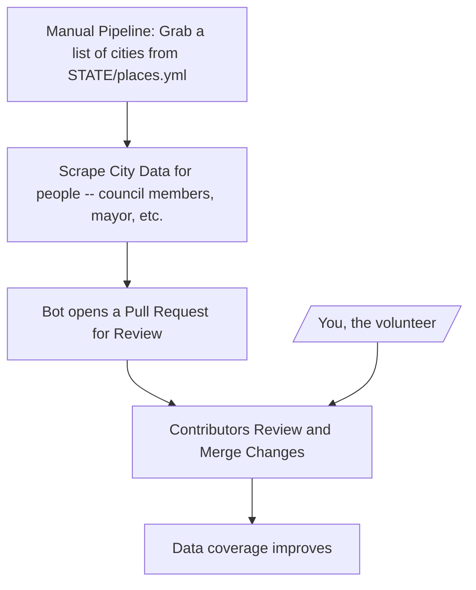

# OpenData

## How this works

## Priorities
### Washington
- [ ] Top 10 cities by population
- [ ] Bottom 10 cities by population
- [ ] Executive branch officials
- [ ] CD Map

### City Directory
- [ ] Grab council members & city leaders for:
  - [x] Washington
    - [x] Top 20 cities by population
      - [x] seattle
      - [x] spokane
      - [x] tacoma
      - [x] vancouver
      - [x] bellevue
      - [x] kent
      - [x] everett
      - [x] spokane_valley
      - [x] renton
      - [ ] federal_way
      - [x] yakima
      - [ ] bellingham
      - [ ] kirkland
      - [ ] auburn
      - [ ] kennewick
      - [ ] pasco
      - [ ] redmond
      - [ ] marysville
      - [ ] sammamish
      - [ ] lakewood
  - [ ] Michigan
    - [ ] Top 10 cities by population

### State Directory
- [ ] Grab info for:
  - [ ] Washington
    - [ ] Executive branch officials
    - [ ] CD Maps
  - [ ] California
    - [ ] Executive branch officials
    - [ ] CD Maps
  - [ ] Texas
    - [ ] Executive branch officials
    - [ ] CD Map 
  - [ ] Florida
    - [ ] Executive branch officials
    - [ ] CD Map
  - [ ] New York
    - [ ] Executive branch officials
    - [ ] CD Map

### Country Directory
- [ ] Maps of states
