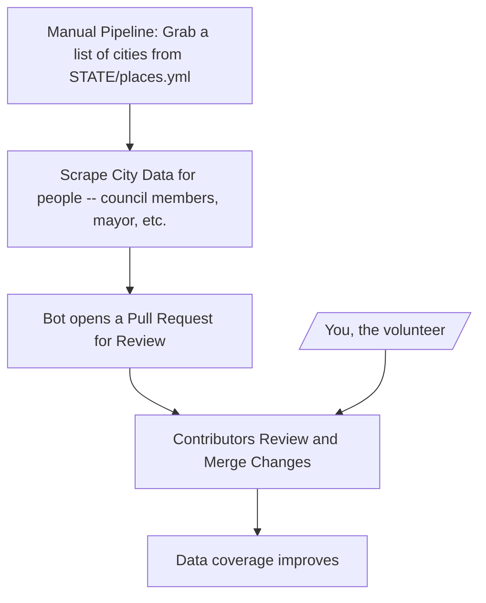

# OpenData

## How this works



## Rules
* Cities can be in two counties (ex: King/Snohomish -> Bothell)
* A county can have the same name as a city (ex: Spokane/Spokane)

## Commands

```bash
rake 'city_scrape:get_places[mi]'
```

## Priorities
### Washington
- [ ] Top 10 cities by population
- [ ] Bottom 10 cities by population
- [ ] Executive branch officials
- [ ] CD Map

### City Directory
- [ ] Grab council members & city leaders for:
  - [ ] Washington
    - [ ] Top 20 cities by population
  - [ ] Alabama
    - [ ] Top 20 cities by population

### State Directory
- [ ] Grab info for:
  - [ ] Washington
    - [ ] Executive branch officials
    - [ ] CD Maps
  - [ ] California
    - [ ] Executive branch officials
    - [ ] CD Maps
  - [ ] Texas
    - [ ] Executive branch officials
    - [ ] CD Map 
  - [ ] Florida
    - [ ] Executive branch officials
    - [ ] CD Map
  - [ ] New York
    - [ ] Executive branch officials
    - [ ] CD Map

### Country Directory
- [ ] Maps of states

### Scratch
```bash
gh pr list --state open --json headRefName --search "head:pipeline-city-scrapes-wa-" --template '{{range .}}{{.headRefName}} {{end}}'
```

### Services
* Google Gemini 2.5 Pro (with grounding - google search) - Paid Tier 1
  * Pricing Page - https://ai.google.dev/gemini-api/docs/pricing
  * Google Search - 1,500 RPD (free), then $35 / 1,000 requests
  * Input: $1.25 Per Million (<= 200k tokens); $2.50 Per Million (> 200k tokens)
  * Output: $10.00 Per Million (<= 200k tokens); $15.00 Per Million (> 200k)
* OpenAI API - GPT 4o Mini (used only with scraping)
  * https://openai.com/api/pricing/

### Links
* https://editor.dicebear.com/
