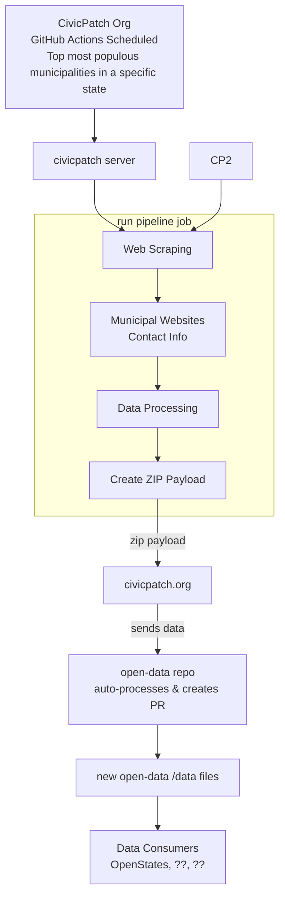

# civicpatch-tools

A collection of tools and projects supporting the collection, processing, and publication of data on elected municipal officials across the United States.

To view the full dataset, see the [open-data](https://github.com/CivicPatch/open-data/) repository.

## Table of Contents

- [Description](#description)
- [Projects](#projects)
- [Summary](#summary)
- [Development](#development)
- [Testing](#testing)
- [License](#license)
- [Contact](#contact)

## Description

This repository contains supporting infrastructure for the CivicPatch initiative, which aims to make information about municipal officials more accessible and transparent. It includes scrapers, APIs, and automation for data collection and publication.

## Projects

- [civicpatch](./civicpatch/README.md)
  The main project. Scrapes municipal websites for contact information on elected officials. Scrape jobs are run via GitHub Actions or by volunteers, and results are submitted to the open-data repo.
- [civicpatch.org](./civicpatch.org/README.md)
  Coordinates data submissions between civicpatch servers and the open-data repo. Receives GitHub webhook events to keep pull request state in sync.
- [shared](./shared/)
  Python utilities shared across both projects — import as `from shared.utils import ...`. Put cross-cutting logic here rather than duplicating it.

## Summary


```mermaid
graph TD
    %% Trigger Sources
    A1[CivicPatch Org<br/>GitHub Actions Scheduled<br/>Top most populous municipalities in a specific state] 
    
    %% civicpatch servers with internal pipeline
    A1 --> CP1[civicpatch server]
    
    subgraph "run pipeline job"
        SCRAPE[Web Scraping] --> S[Municipal Websites<br/>Contact Info]
        S --> PROCESS[Data Processing]
        PROCESS --> ZIP[Create ZIP Payload]
    end
    
    %% Data flow to civicpatch.org
    CP1 --> SCRAPE
    CP2 --> SCRAPE
    ZIP -->|zip payload| C[civicpatch.org]
    
    %% Simplified: civicpatch.org sends to open-data, which auto-processes
    C -->|sends data| OD[open-data repo<br/>auto-processes & creates PR]
    
    %% Final data available
    OD --> DATA["new open-data /data files"]
    
    %% Data consumers
    DATA --> DC[Data Consumers<br/>OpenStates, ??, ??]
```

## Contributing

Join the [Unified - Civic Data Tech](https://unified.me/chat/!NcnsrToWrvzzzoLHWn) group and 
join our weekly sync and biweekly hackathon meetings.

- Weekly Sync — Introductions and Updates
- Biweekly Hackathons — Onboarding, bug bashing

[Issues](https://github.com/orgs/CivicPatch/projects/3)

## Development

### Requirements

- Docker (required for running services; tested on OSX)
- [mise](https://mise.jdx.dev/getting-started.html) (for managing environments and scripts)

  - `brew install openssl readline` (for postgres tool)

- A [github](https://github.com/) account

  - Poke a maintainer [michelle@civicpatch.org], or see [Contributing](#contributing) guide for onboarding
    for additional setup as needed. This project integrates heavily with the [open-data](https://github.com/CivicPatch/open-data) 
    repo and multiple other services so you'll either want to set up your own mirror repos and corresponding 
    github apps, or you can use keys provided for you during onboarding.

### Setup

1. Run the following:

   ```sh
   mise install
   mise setup
   ```

2. Set up environment variables for **civicpatch** (optional — skip if you don't need to run scrapes):

   - Reference [civicpatch/docker-compose.yml](./civicpatch/docker-compose.yml) for available variables
   - Create `../civicpatch.env` with the variables you need

3. Set up environment variables for **civicpatch.org** (contact the maintainer for GitHub App keys):

   - Reference [civicpatch.org/docker-compose.yml](./civicpatch.org/docker-compose.yml) for available variables
   - Create `../civicpatch.org.env` with the variables you need

4. Run `docker compose up`

   Services will be available at `localhost:8000` (civicpatch) and `localhost:8001` (api).

   Migrations run automatically on startup. If you need to run them manually:

   ```sh
   cd civicpatch.org && mise migrate_up
   ```

## Testing

- Each project contains its own test suite.

### civicpatch

```sh
mise tcp
```

### civicpatch.org

```sh
mise tapi
```

## License

[MIT License](LICENSE.txt)

## Contact

For questions or contributions, open an issue or contact the maintainers via GitHub.
