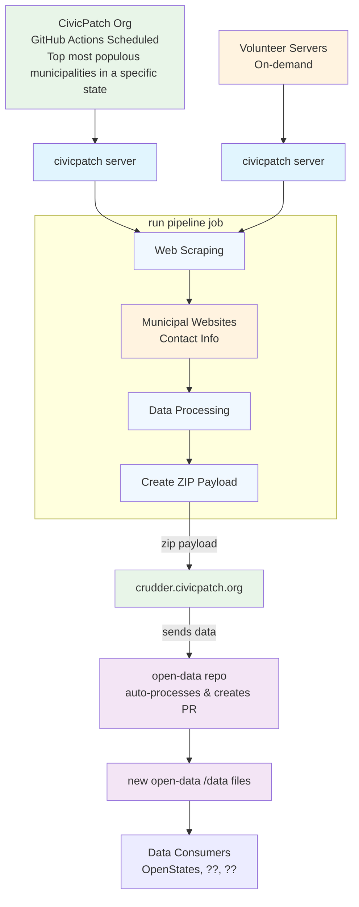

# civicpatch-tools

Set of projects that support the collection of elected municipal officials across
the United States.

To see the entire set of data, check the [open-data](https://github.com/CivicPatch/open-data/) repo.

## Projects

- [civicpatch](./civicpatch/README.md)
  The main project. Scrapes websites for contact information on elected officials.
  Scrape jobs are run on either GitHub Actions or by volunteers running scrapes on their own servers.
- [crudder](./crudder/README.md)
  Helper project that sits civicpatch volunteer servers & GitHub Actions.

## Summary

```mermaid
graph TD
    %% Trigger Sources
    A1[CivicPatch Org<br/>GitHub Actions Scheduled<br/>Top most populous municipalities in a specific state] 
    B1[Volunteer Servers<br/>On-demand]
    
    %% civicpatch servers with internal pipeline
    A1 --> CP1[civicpatch server]
    B1 --> CP2[civicpatch server]
    
    subgraph "run pipeline job"
        SCRAPE[Web Scraping] --> S[Municipal Websites<br/>Contact Info]
        S --> PROCESS[Data Processing]
        PROCESS --> ZIP[Create ZIP Payload]
    end
    
    %% Data flow to crudder
    CP1 --> SCRAPE
    CP2 --> SCRAPE
    ZIP -->|zip payload| C[crudder.civicpatch.org]
    
    %% Simplified: crudder sends to open-data, which auto-processes
    C -->|sends data| OD[open-data repo<br/>auto-processes & creates PR]
    
    %% Final data available
    OD --> DATA["new open-data /data files"]
    
    %% Data consumers
    DATA --> DC[Data Consumers<br/>OpenStates, ??, ??]
    
    %% Styling
    classDef orgType fill:#e8f5e8
    classDef volunteerType fill:#fff3e0
    classDef serverType fill:#e1f5fe
    classDef dataStore fill:#f3e5f5
    classDef service fill:#e8f5e8
    classDef source fill:#fff3e0
    classDef pipeline fill:#f0f8ff
    
    class A1 orgType
    class B1 volunteerType
    class CP1,CP2 serverType
    class OD,DATA dataStore
    class C service
    class S source
    class SCRAPE,PROCESS,ZIP pipeline
```

## Development

### Requirements

- Docker
  - You will need this to run anything here. Tested on OSX, should work on Linux, might work
  on Windows but you may need to do extra tweaking with user permissions.
- [mise](https://mise.jdx.dev/getting-started.html)
  - Under each project there will be mise.toml files that should make development easier (test scripts, starting projects, etc).

### Steps
1. Run `mise install` to set up your environment.
2. Run `pre-commit install` to set up gitleaks.
3. Go into individual projects (civicpatch, mainly) for further setup steps
