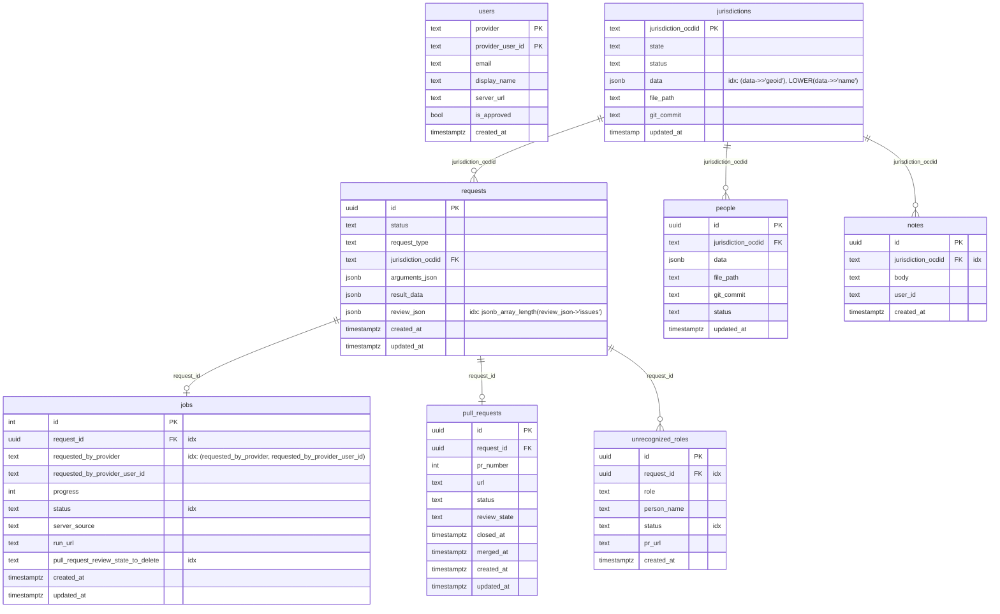

# api.civicpatch.org

The backend API for civicpatch.org. Receives scrape results from `civicpatch`, creates PRs to the [open-data](https://github.com/CivicPatch/open-data/) repository, and exposes data to the web UI.

## What it does

- Accepts ZIP payloads from `civicpatch` pipeline jobs and opens GitHub PRs to `open-data`
- Manages jurisdiction and people data in a PostGIS/PostgreSQL database
- Authenticates users via GitHub OAuth (GitHub App)
- Exposes REST endpoints consumed by the `civicpatch` web UI
- Receives GitHub webhook events to keep PR state in sync without polling

## Project layout

```
src/
  routers/
    api/            ← versioned API routes (one file per resource)
    auth.py         ← GitHub OAuth routes
  webhooks/
    github.py       ← GitHub webhook receiver (pull_request events)
  services/         ← business logic (github_service, auth_service, etc.)
  database/
    database.py     ← all SQL queries
  schemas/          ← Pydantic request/response models
  stores/           ← Redis helpers
  utils/
  main.py           ← FastAPI app + lifespan + background tasks
database_operations/
  migrations/       ← numbered SQL migrations (NNN_description.up/down.sql)
  migrate.py        ← migration runner
tests/
  unit/
  factories/        ← test data builders
```

## Services and dependencies

| Service | Purpose | Default (dev) |
|---------|---------|---------------|
| PostgreSQL (PostGIS) | Primary data store | `localhost:6000` |
| Redis | Session/cache store | `localhost:6379` |
| GitHub App | OAuth + API access + webhooks | Contact maintainer for keys |

## Environment variables

Most values have safe development defaults in `docker-compose.yml`. The only ones that require real credentials:

| Variable | Required | Notes |
|----------|----------|-------|
| `GITHUB_APP_ID` | Yes | Contact maintainer |
| `GITHUB_APP_CLIENT_ID` | Yes | Contact maintainer |
| `GITHUB_APP_CLIENT_SECRET` | Yes | Contact maintainer |
| `GITHUB_APP_PRIVATE_KEY_BASE64` | Yes | Contact maintainer |
| `GITHUB_APP_INSTALLATION_ID` | Yes | Contact maintainer |
| `GITHUB_WEBHOOK_SECRET` | Optional | Required to receive webhook events |
| `STORAGE_ENDPOINT` / `STORAGE_ACCESS_KEY_ID` / `STORAGE_SECRET_ACCESS_KEY` | Optional | Cloudflare R2, only for zip storage |

Create `../api.civicpatch.org.env` with these values. Everything else in `docker-compose.yml` uses defaults.

## Local setup

See the [root README](../README.md) for `mise install` / Docker setup.

Once the env file is in place:

```sh
# Start the API + database + Redis
docker compose up

# API is available at http://localhost:8001
# Database is available at localhost:6000 (PostGIS)
```

## Migrations

Migrations are numbered SQL files in `database_operations/migrations/`.

```sh
# Apply all pending migrations
mise migrate_up

# Roll back the most recent migration
mise migrate_down
```

When adding a feature that changes the schema, create a new migration file:
`NNN_description.up.sql` / `NNN_description.down.sql` — do not edit existing ones.

## Testing

```sh
# Unit tests (from workspace root)
mise tapi
```

## GitHub webhook

The API listens for `pull_request` events at `POST /webhooks/github`. It uses HMAC-SHA256 signature verification (`X-Hub-Signature-256`). On each event it updates `pull_request_status` on the corresponding `jobs` row, keeping PR state in sync without polling GitHub.

An hourly background task also reconciles DB state against GitHub's open-PR list to recover from any missed events.

To register the webhook in GitHub, set the payload URL to `https://api.civicpatch.org/webhooks/github` and set the secret to match `GITHUB_WEBHOOK_SECRET`.

## Database schema

> **Keep this diagram in sync with migrations.** Whenever a migration adds, renames, or drops a column or table, update the chart below.



**Notes:**
- `requests.result_data` — array of scraped `Official` objects returned by the civicpatch pipeline
- `requests.review_json` — pipeline review output (`issues`, `warnings`, etc.)
- `people.data` — full `Official` JSONB blob; the canonical record for a jurisdiction's current officials
- `jurisdictions.data` — jurisdiction metadata (name, geoid, etc.)
- `jobs` and `pull_requests` each have a unique constraint on `request_id` (one-to-one with `requests`)
- `people` has no FK to `requests` — it is updated independently when a PR is merged

