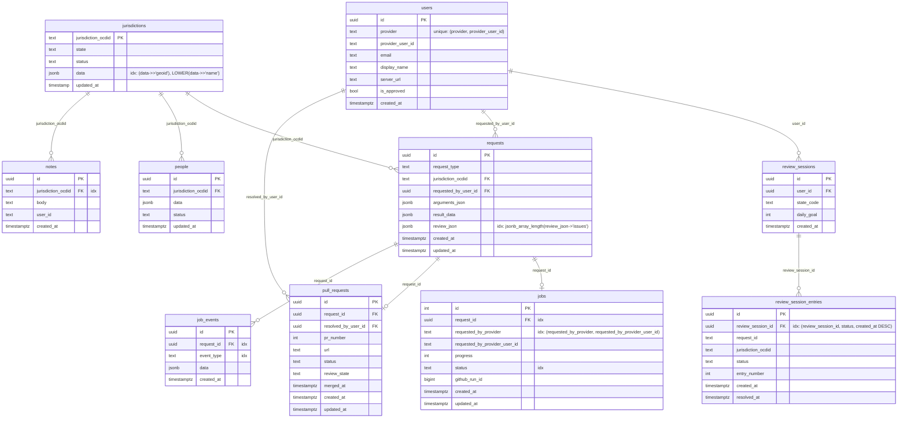

# Database Schema

> **This is the authoritative schema reference.** Keep this diagram in sync with migrations. Whenever a migration adds, renames, or drops a column, table, or index, update the chart below.

**Notes:**
- `requests.result_data` — array of scraped `Official` objects returned by the civicpatch pipeline
- `requests.review_json` — pipeline review output (`issues`, `warnings`, etc.)
- `people.data` — full `Official` JSONB blob; the canonical record for a jurisdiction's current officials
- `jurisdictions.data` — jurisdiction metadata (name, geoid, etc.)
- `jobs` and `pull_requests` each have a unique constraint on `request_id` (one-to-one with `requests`)
- `people` has no FK to `requests` — it is updated independently when a PR is merged
- `users.provider` + `users.provider_user_id` form a unique constraint; `id` is the actual primary key
