# Database Schema

> **This is the authoritative schema reference.** Keep this diagram in sync with migrations. Whenever a migration adds, renames, or drops a column, table, or index, update the chart below.
>
> Types suffixed `_null` (e.g. `text_null`) are nullable. All others are NOT NULL.

```mermaid
erDiagram
    %% idx = regular index, functional idx noted inline
    users {
        uuid            id              PK
        text            provider        "unique: (provider, provider_user_id)"
        text            provider_user_id
        text            email
        text_null       display_name    "unique (NULLs distinct)"
        text            role            "default: 'default', CHECK IN ('default','contributors','maintainers','admins')"
        timestamptz_null last_login_at  "set by upsert_user on every successful sign-in"
        timestamptz_null created_at
    }

    jurisdictions {
        text            jurisdiction_ocdid  PK
        text            status              "check: active|inactive, default: active. inactive = removed from the synced jurisdictions.yml upstream; derived from presence in the file, never read out of it"
        text_null       state               "idx"
        text            level               "idx, default: 'local'"
        jsonb_null      data                "idx: (data->>'geoid'), LOWER(data->>'name')"
        text            search_text         "idx: GIN to_tsvector('simple',_), GIN gin_trgm_ops; default: ''; name+display_name+state code+state name, maintained by sync"
        text_array      parent_ocdids       "idx: GIN; default: '{}'; ancestry most-specific-first, incl. the implied state; maintained by sync"
        timestamptz_null scraped_at          "idx: (state, scraped_at); last *scraped*, stamped on job-PR merge"
        timestamptz_null updated_at
    }

    state_configs {
        text            state               PK
    }

    synced_files {
        text            path                PK
        text            blob_sha            "last-synced git blob SHA (sync cursor)"
        timestamptz     synced_at           "default: now()"
    }

    requests {
        uuid            id                  PK
        text            request_type
        text_null       jurisdiction_ocdid  FK  "idx"
        uuid_null       requested_by_user_id FK
        jsonb           arguments_json
        jsonb_null      data_json           "scraped Official objects from pipeline"
        jsonb_null      review_json         "idx: jsonb_array_length(review_json->'issues')"
        timestamptz_null published_at       "set when a reviewer publishes; replaces pull_requests.status='merged' + merge_enqueued_at"
        timestamptz_null dismissed_at       "set when a reviewer dismisses; replaces pull_requests.status='closed'. check: not both set"
        uuid_null       resolved_by_user_id FK  "whoever published or dismissed it"
        text_null       open_data_url       "where the change landed: a commit URL going forward, a PR URL on backfilled rows"
        timestamptz     created_at
        timestamptz     updated_at
    }

    pipeline_runs {
        int             id              PK
        uuid            request_id      FK  "unique"
        int_null        progress
        text            status              "idx"
        bigint_null     github_run_id
        timestamptz_null created_at
        timestamptz_null updated_at
    }

    pull_requests {
        uuid            id                  PK
        uuid            request_id          FK  "unique"
        uuid_null       resolved_by_user_id FK
        int             pr_number
        text_null       url
        text            status              "idx. Scrape rows are historical as of 115 — publish state lives on requests now. Jurisdiction-edit requests are the only lifecycle still writing here."
        text_null       review_state        "no writer, ever — the bot verdict was never persisted"
        timestamptz_null merged_at
        timestamptz_null merge_enqueued_at   "set at merge enqueue; cleared on settle"
        timestamptz     created_at
        timestamptz     updated_at
    }

    people {
        uuid            id                  PK
        text            jurisdiction_ocdid  FK  "idx"
        jsonb           data                "canonical Official JSONB blob"
        text_null       status              "check: active|inactive, default: active. inactive = no longer named by the latest roster; kept, never deleted, so seat history survives"
        timestamptz_null updated_at         "from the record's own updated_at — data, not a publish time" 
    }

    issues {
        uuid            id          PK
        text            issue_type      "idx"
        text            issue_key       "unique: (issue_type, issue_key)"
        text_array      request_ids
        jsonb           data
        text            status          "idx, check: pending|pr_opened|resolved|superseded"
        text_null       pull_request_url
        timestamptz_null resolved_at
        timestamptz     created_at
        boolean         is_flagged      "default: false"
    }

    review_sessions {
        uuid            id                      PK
        uuid            user_id                 FK
        text            state_code              "idx: unique (user_id, state_code) WHERE ended_at IS NULL"
        int             daily_goal
        int             current_entry_number    "default: 1"
        timestamptz     updated_at              "default: NOW()"
        timestamptz_null ended_at
        timestamptz_null created_at
    }

    review_session_entries {
        uuid            id                  PK
        uuid            review_session_id   FK  "idx: (review_session_id, status, created_at DESC)"
        text_array      request_ids
        text            jurisdiction_ocdid      "idx: unique WHERE status = 'claimed'"
        text            status
        int_null        entry_number
        timestamptz_null created_at
        timestamptz_null resolved_at
    }

    api_keys {
        int             id              PK
        uuid            user_id         FK  "idx"
        text            api_key_suffix
        text            api_key_hash        "idx"
        timestamptz_null created_at      "default: now()"
        timestamptz_null revoked_at      "idx"
    }

    api_usage_limits {
        int             id          PK
        uuid            user_id     FK  "unique"
        int             daily_limit
    }

    change_log_types {
        text            type                PK
    }

    change_logs {
        uuid            id                  PK
        text            type                FK  "references change_log_types(type)"
        text_null       jurisdiction_ocdid  "idx"
        text_null       request_id          "the request the change belongs to; NULL for non-review changes"
        jsonb_null      changes             "type-specific payload; {field,from,to} diff for edit_person"
        uuid_null       user_id             FK
        timestamptz     created_at          "idx: created_at DESC, default: now()"
    }

    source_records {
        uuid            id                  PK
        uuid            request_id          FK  "idx; ON DELETE CASCADE — which scrape"
        text            person_id           "idx: (person_id, created_at DESC); the Record id, also the membership FK"
        text            jurisdiction_ocdid  FK  "idx"
        jsonb           raw                 "the Record as it arrived, labels verbatim — truth for re-derivation"
        jsonb           parsed              "gin idx (jsonb_path_ops); the published decision — historical, never current"
        timestamptz_null published_at       "NULL until the triple is materialised"
        timestamptz     created_at          "default: now(); orders derivations — no unique key, replays add rows"
    }

    roles {
        text            id                  PK "SLUG, not a uuid: council-member. Immune to label renames. check: id <> ''"
        text            label               "unique idx: (lower(label)); display name, renameable"
        text            status              "check: active|candidate|excluded|inactive"
        bool            is_unique           "default: false"
        int_null        priority            "NULL = unranked, sorts last"
        timestamptz     created_at
    }

    role_aliases {
        uuid            id                  PK
        text            role_id             FK  "idx; ON UPDATE CASCADE, ON DELETE CASCADE"
        text            label               "unique idx: (lower(label)) — across ALL roles"
        text            status              "check: active|candidate, default: candidate"
        timestamptz     created_at
    }

    organizations {
        uuid            id                  PK
        text            jurisdiction_ocdid  FK  "unique: (jurisdiction_ocdid, name)"
        text            name                "one body — City Council, Township Board. Derivation currently mints one per jurisdiction"
        int             sort_order          "default: 0"
        timestamptz     created_at          "default: now()"
    }

    divisions {
        text            ocdid               PK "ocd-division/...; minted lazily when a post needs it"
        text            jurisdiction_ocdid  FK
        timestamptz     created_at          "default: now()"
    }

    posts {
        uuid            id                  PK "also unique (id, organization_id) so memberships can FK the pair — kept: that column feeds a partial unique index and its failure would be silent"
        text            jurisdiction_ocdid  FK "denormalised for direct queries; 121 dropped the composite FK — a mismatch is visible, not silent"
        uuid            organization_id     FK
        text            role_id             FK "ON UPDATE CASCADE; the SEAT's role — a title the holder carries lives on the membership"
        text            division_ocdid      FK "ON UPDATE CASCADE"
        text_null       label               "human-owned; mint-only writes never overwrite it"
        int             headcount           "check: > 0, default: 1; human-owned"
        timestamptz     created_at          "default: now()"
    }

    memberships {
        uuid            id                  PK
        uuid            post_id             FK "composite FK (post_id, organization_id) ON UPDATE CASCADE"
        uuid            organization_id     "unique idx: (person_id, organization_id) WHERE closed_at IS NULL — one open seat per body"
        uuid            person_id           FK
        text_null       role_id             FK "idx WHERE NOT NULL; ON UPDATE CASCADE. A title held in a seat this role does not define — mayor for a councilmember serving as mayor"
        text_array      designations        "default: {}; how the source tells one seat from another: Place 2, Position 8"
        text_array      unmatched_text      "gin idx; default: {}; what the parser could not classify — triage material"
        date_null       start_date          "from the source; we do not infer it"
        date_null       end_date            "from the source — NOT set when someone stops appearing"
        timestamptz     first_seen_at       "when the SOURCE said it, not when the row was written"
        timestamptz     last_seen_at        "advanced on every scrape that still lists them"
        timestamptz_null closed_at          "set when a scrape stops listing them; NULL = currently open"
        timestamptz     created_at          "default: now()"
    }

    roles ||--o{ role_aliases : "role_id"
    jurisdictions ||--o{ organizations : "jurisdiction_ocdid"
    jurisdictions ||--o{ divisions : "jurisdiction_ocdid"
    jurisdictions ||--o{ posts : "jurisdiction_ocdid"
    organizations ||--o{ posts : "organization_id"
    roles ||--o{ posts : "role_id"
    divisions ||--o{ posts : "division_ocdid"
    posts ||--o{ memberships : "post_id"
    people ||--o{ memberships : "person_id"
    roles ||--o{ memberships : "role_id (title, not seat)"
    requests ||--o{ source_records : "request_id"
    jurisdictions ||--o{ source_records : "jurisdiction_ocdid"
    jurisdictions ||--o{ requests : "jurisdiction_ocdid"
    jurisdictions ||--o{ people : "jurisdiction_ocdid"
    requests ||--o| pipeline_runs : "request_id"
    requests ||--o| pull_requests : "request_id"
    requests }o--o{ issues : "request_ids"
    users ||--o{ review_sessions : "user_id"
    users ||--o{ requests : "requested_by_user_id"
    users ||--o{ pull_requests : "resolved_by_user_id"
    users ||--o{ api_keys : "user_id (ON DELETE CASCADE)"
    users ||--o| api_usage_limits : "user_id (ON DELETE CASCADE)"
    change_log_types ||--o{ change_logs : "type"
    users ||--o{ change_logs : "user_id (ON DELETE SET NULL)"
    jurisdictions ||--o{ change_logs : "jurisdiction_ocdid"
    roles ||--o{ change_logs : "jurisdiction_ocdid"
    review_sessions ||--o{ review_session_entries : "review_session_id"
```

**Notes:**
- `requests.review_json` — pipeline review output (`issues`, `warnings`, etc.)
- `jurisdictions.data` — jurisdiction metadata (name, geoid, etc.)
- `pipeline_runs` and `pull_requests` each have a unique constraint on `request_id` (one-to-one with `requests`)
- `people` has no FK to `requests` — it is updated independently when a PR is merged
- `state_configs` has one row per state (seeded per existing state in migration 100; every state always has one). It currently carries **no settings columns** — migration 103 dropped `min_scraped_at` when freshness became a computed rolling window, and the table is deliberately kept as the home for the next per-state setting rather than dropped and recreated. `state` mirrors `jurisdictions.state` but is **not** an enforced FK (`jurisdictions.state` isn't unique).
- `roles` replaced `role_terms` / `role_aliases` in migration 106, and migration 109 **flattened it**: the `scope` column (NULL=global / state ocdid / place ocdid) is gone, along with per-scope resolution, alias unioning, and the `roles_global_complete` check. It carried 24 global rows and 1 scoped test row while costing the promotion trap — promoting a role was DELETE + INSERT, minting a new uuid and breaking any FK pointing at it. One flat list, `unique (lower(label))`. #2470 and #2471 ask for *more* hierarchy and are inverted by this; see `.scratch/2026-08-12-plan-flat-roles.md`.
- **`roles.id` is a slug, not a uuid** — `council-member`, derived from `label` at creation. Migration 109 swapped the uuid for it. Read that carefully: `id` is a uuid in every other domain table, and this schema's other text-PK tables name the column for its content (`geoid`, `path`, `type`), so `roles.id` matches neither convention. It is named `id` so Phase 2's FK reads `posts.role_id` rather than `posts.role_slug`.
- The consequence of that choice: unlike a uuid, this id is *derived*, so it can be **wrong**. Mint "Concil Member", fix the label to "Council Member", and the id stays `concil-member` — a rename moves `label` and deliberately leaves `id`, which is what keeps published references resolving. Phase 2's `posts.role_id` should use `ON UPDATE CASCADE` so correcting a mis-derived id stays one statement.
- `core.role_taxonomy.slugify_label` must reproduce migration 109's backfill expression exactly (`trim(both '-' from lower(regexp_replace(label, '[^a-zA-Z0-9]+', '-', 'g')))`), or a role minted by the app and one minted by the migration would disagree.
- **Slugging is lossy, so the PK is a stricter constraint than `unique (lower(label))`.** Same lowercase label ⟹ same slug, but not the reverse: `Council/Member` and `Council Member` are two distinct labels that reduce to one id. The label index therefore catches nothing the PK doesn't — it is kept as documentation of intent, not for coverage. `core.role_taxonomy.slug_conflict_error` rejects such a pair before the write so the message can name both labels; the PK is the concurrency backstop.
- `roles_id_not_empty` exists because `NOT NULL` does not cover `''`: a label of pure punctuation slugs to the empty string, which would otherwise insert silently as published identity. `schemas.roles.RoleInput` rejects such a label at the API boundary; the check covers any other writer.
- **Labels and aliases share one case-insensitive namespace, and no index can enforce it.** `roles_label_lower_uq` spans `roles`, `role_aliases_label_lower_uq` spans `role_aliases`, and a unique index cannot span both — so nothing at the schema level stops one role claiming another's *label* as an alias. That matters because `get_role_alias_map` lets the last role written win, making the owner depend on priority order (a reorder could silently flip it). `core.role_taxonomy.name_conflict_error` enforces the cross-table half before the write. A role restating *its own* label as an alias is allowed: it resolves to itself, and seeded rows do it (`Select Board Member`, `Deputy Mayor Pro Tempore`).
- `roles.status`: each value is a distinct matcher behaviour — `active` matches; `candidate` matches and flags for #2471's triage; `excluded` matches so the label can be *knowingly dropped* (an exclusion like `Webmaster`, dormant since `/config/exclude` and `/config/include` were removed); `inactive` is not matched at all, and is what removal sets, so the row and any seat history survive. `active` is the only value in use today. **`shared.utils.config_utils.get_role_configs` filters to `active` and is the only reader** — before it, `status` had zero readers, which was not harmless: an `excluded` role was matched as an ordinary one. The filter is blunter than the design above, though: it makes `excluded` invisible rather than match-then-drop, so an excluded label falls through to `unrecognized_role`. The vocabulary went `kind: canonical|exclusion` → `status: …|rejected` → `status: …|excluded`; the last step realigns it with the `exclude_role` / `include_role` change-log types, which are permanent because existing `change_logs` rows FK to them.
- `role_aliases` was a `roles.aliases text[]` between migrations 106 and 110. The array could not express either thing the table exists for: a per-alias approval state (an alias must not match until approved), and uniqueness *across* roles — nothing stopped one string aliasing two roles, which makes the matcher's answer arbitrary. `role_aliases_label_lower_uq` is deliberately global, not per-role.
- `role_aliases.status` defaults to `candidate`, but every alias written through `PUT /api/v1/roles` is set `active`: a maintainer typing one *is* the approval. The default is aimed at a future auto-mint path, which is the case approval was designed for. `get_roles` returns only `active` aliases, so the wire shape stays `aliases: ["…"]` and the pipeline cannot accidentally match an unapproved one.
- `roles.priority` stays nullable on purpose: `ORDER BY priority NULLS LAST` treats NULL as a real state (unranked, sorts to the end), which `NOT NULL DEFAULT 0` would collapse into "ranked first". **`PUT /api/v1/roles/reorder` is its only writer**, and it keys on `id`; `RoleInput` deliberately has no `priority` field. Two reasons: reorder is ADMINS-only while the upsert is MAINTAINERS, so accepting it on the upsert would bypass that gate — and an omitted field would read as "clear it", which flattened every role's ordering on any save.
- `synced_files` is keyed by repo path (e.g. `data/tx/local/place_austin.yml`) — no FK; it holds the last-synced git blob SHA per file the open-data sync tree-diffs (both `jurisdictions.yml` and people files)
- `jurisdictions.scraped_at` is "last *scraped*" — stamped on job-PR merge, **not** bumped by manual people edits (so hand-corrected jurisdictions don't read as freshly scraped)
- `users.provider` + `users.provider_user_id` form a unique constraint; `id` is the actual primary key
- `users.role` is a single trust level per user (one of `default`, `contributors`, `maintainers`, `admins`); permissions cascade downward (admin implies maintainer implies contributor implies default). The `user_roles` join table was dropped in migration 087.
- `api_keys`, `api_usage_limits` use `user_id` (UUID FK to `users.id`); the deprecated composite `(provider, provider_user_id)` shape was migrated out in migration 086.
