# Database Schema

> **This is the authoritative schema reference.** Keep this diagram in sync with migrations. Whenever a migration adds, renames, or drops a column, table, or index, update the chart below.
>
> Types suffixed `_null` (e.g. `text_null`) are nullable. All others are NOT NULL.

```mermaid
erDiagram
    %% idx = regular index, functional idx noted inline
    users {
        uuid            id              PK
        text            provider        "unique: (provider, provider_user_id)"
        text            provider_user_id
        text            email
        text_null       display_name
        timestamptz_null created_at
    }

    jurisdictions {
        text            jurisdiction_ocdid  PK
        text            status
        text_null       state               "idx"
        jsonb_null      data                "idx: (data->>'geoid'), LOWER(data->>'name')"
        timestamptz_null updated_at
    }

    requests {
        uuid            id                  PK
        text            request_type
        text_null       jurisdiction_ocdid  FK  "idx"
        uuid_null       requested_by_user_id FK
        jsonb           arguments_json
        jsonb_null      data_json           "scraped Official objects from pipeline"
        jsonb_null      review_json         "idx: jsonb_array_length(review_json->'issues')"
        timestamptz     created_at
        timestamptz     updated_at
    }

    pipeline_runs {
        int             id              PK
        uuid            request_id      FK  "unique"
        int_null        progress
        text            status              "idx"
        bigint_null     github_run_id
        timestamptz_null created_at
        timestamptz_null updated_at
    }

    pull_requests {
        uuid            id                  PK
        uuid            request_id          FK  "unique"
        uuid_null       resolved_by_user_id FK
        int             pr_number
        text_null       url
        text            status              "idx"
        text_null       review_state
        timestamptz_null merged_at
        timestamptz     created_at
        timestamptz     updated_at
    }

    people {
        uuid            id                  PK
        text            jurisdiction_ocdid  FK  "idx"
        jsonb           data                "canonical Official JSONB blob"
        text_null       status
        timestamptz_null updated_at
    }

    notes {
        uuid            id                  PK
        text            jurisdiction_ocdid  FK  "idx"
        text            body
        uuid_null       user_id             FK
        timestamptz     created_at
    }

    pipeline_issues {
        uuid            id          PK
        text            issue_type      "idx"
        text            issue_key       "unique: (issue_type, issue_key)"
        text            category        "check: error|issue"
        text_array      request_ids
        jsonb           data
        text            status          "idx, check: pending|pr_opened|resolved|superseded"
        text_null       pull_request_url
        timestamptz_null resolved_at
        timestamptz     created_at
        boolean         is_flagged      "default: false"
    }

    review_sessions {
        uuid            id                      PK
        uuid            user_id                 FK
        text            state_code              "idx"
        int             daily_goal
        int             current_entry_number    "default: 1"
        text_array      reviewed_ocdids         "default: {}"
        timestamptz     updated_at              "default: NOW()"
        timestamptz_null created_at
    }

    review_session_entries {
        uuid            id                  PK
        uuid            review_session_id   FK  "idx: (review_session_id, status, created_at DESC)"
        text_array      request_ids
        text            jurisdiction_ocdid      "idx: unique WHERE status = 'claimed'"
        text            status
        int_null        entry_number
        timestamptz_null created_at
        timestamptz_null resolved_at
    }

    jurisdictions ||--o{ requests : "jurisdiction_ocdid"
    jurisdictions ||--o{ people : "jurisdiction_ocdid"
    jurisdictions ||--o{ notes : "jurisdiction_ocdid"
    requests ||--o| pipeline_runs : "request_id"
    requests ||--o| pull_requests : "request_id"
    requests }o--o{ pipeline_issues : "request_ids"
    users ||--o{ review_sessions : "user_id"
    users ||--o{ requests : "requested_by_user_id"
    users ||--o{ pull_requests : "resolved_by_user_id"
    users ||--o{ notes : "user_id"
    review_sessions ||--o{ review_session_entries : "review_session_id"
```

**Notes:**
- `requests.review_json` — pipeline review output (`issues`, `warnings`, etc.)
- `jurisdictions.data` — jurisdiction metadata (name, geoid, etc.)
- `pipeline_runs` and `pull_requests` each have a unique constraint on `request_id` (one-to-one with `requests`)
- `people` has no FK to `requests` — it is updated independently when a PR is merged
- `users.provider` + `users.provider_user_id` form a unique constraint; `id` is the actual primary key
