# Database Schema

> **This is the authoritative schema reference.** Keep this diagram in sync with migrations. Whenever a migration adds, renames, or drops a column, table, or index, update the chart below.
>
> Types suffixed `_null` (e.g. `text_null`) are nullable. All others are NOT NULL.

```mermaid
erDiagram
    %% idx = regular index, functional idx noted inline
    users {
        uuid            id              PK
        text            provider        "unique: (provider, provider_user_id)"
        text            provider_user_id
        text            email
        text_null       display_name    "unique (NULLs distinct)"
        text            role            "default: 'default', CHECK IN ('default','contributors','maintainers','admins')"
        timestamptz_null last_login_at  "set by upsert_user on every successful sign-in"
        timestamptz_null created_at
    }

    jurisdictions {
        text            jurisdiction_ocdid  PK
        text            status
        text_null       state               "idx"
        text            level               "idx, default: 'local'"
        jsonb_null      data                "idx: (data->>'geoid'), LOWER(data->>'name')"
        text            search_text         "idx: GIN to_tsvector('simple',_), GIN gin_trgm_ops; default: ''; name+display_name+state code+state name, maintained by sync"
        text_array      parent_ocdids       "idx: GIN; default: '{}'; ancestry most-specific-first, incl. the implied state; maintained by sync"
        timestamptz_null scraped_at          "idx: (state, scraped_at); last *scraped*, stamped on job-PR merge"
        timestamptz_null updated_at
    }

    state_configs {
        text            state               PK
    }

    synced_files {
        text            path                PK
        text            blob_sha            "last-synced git blob SHA (sync cursor)"
        timestamptz     synced_at           "default: now()"
    }

    requests {
        uuid            id                  PK
        text            request_type
        text_null       jurisdiction_ocdid  FK  "idx"
        uuid_null       requested_by_user_id FK
        jsonb           arguments_json
        jsonb_null      data_json           "scraped Official objects from pipeline"
        jsonb_null      review_json         "idx: jsonb_array_length(review_json->'issues')"
        timestamptz     created_at
        timestamptz     updated_at
    }

    pipeline_runs {
        int             id              PK
        uuid            request_id      FK  "unique"
        int_null        progress
        text            status              "idx"
        bigint_null     github_run_id
        timestamptz_null created_at
        timestamptz_null updated_at
    }

    pull_requests {
        uuid            id                  PK
        uuid            request_id          FK  "unique"
        uuid_null       resolved_by_user_id FK
        int             pr_number
        text_null       url
        text            status              "idx"
        text_null       review_state
        timestamptz_null merged_at
        timestamptz_null merge_enqueued_at   "set at merge enqueue; cleared on settle"
        timestamptz     created_at
        timestamptz     updated_at
    }

    people {
        uuid            id                  PK
        text            jurisdiction_ocdid  FK  "idx"
        jsonb           data                "canonical Official JSONB blob"
        text_null       status
        timestamptz_null updated_at
    }

    issues {
        uuid            id          PK
        text            issue_type      "idx"
        text            issue_key       "unique: (issue_type, issue_key)"
        text_array      request_ids
        jsonb           data
        text            status          "idx, check: pending|pr_opened|resolved|superseded"
        text_null       pull_request_url
        timestamptz_null resolved_at
        timestamptz     created_at
        boolean         is_flagged      "default: false"
    }

    review_sessions {
        uuid            id                      PK
        uuid            user_id                 FK
        text            state_code              "idx: unique (user_id, state_code) WHERE ended_at IS NULL"
        int             daily_goal
        int             current_entry_number    "default: 1"
        timestamptz     updated_at              "default: NOW()"
        timestamptz_null ended_at
        timestamptz_null created_at
    }

    review_session_entries {
        uuid            id                  PK
        uuid            review_session_id   FK  "idx: (review_session_id, status, created_at DESC)"
        text_array      request_ids
        text            jurisdiction_ocdid      "idx: unique WHERE status = 'claimed'"
        text            status
        int_null        entry_number
        timestamptz_null created_at
        timestamptz_null resolved_at
    }

    api_keys {
        int             id              PK
        uuid            user_id         FK  "idx"
        text            api_key_suffix
        text            api_key_hash        "idx"
        timestamptz_null created_at      "default: now()"
        timestamptz_null revoked_at      "idx"
    }

    api_usage_limits {
        int             id          PK
        uuid            user_id     FK  "unique"
        int             daily_limit
    }

    change_log_types {
        text            type                PK
    }

    change_logs {
        uuid            id                  PK
        text            type                FK  "references change_log_types(type)"
        text_null       jurisdiction_ocdid  "idx"
        text_null       request_id          "the request the change belongs to; NULL for non-review changes"
        jsonb_null      changes             "type-specific payload; {field,from,to} diff for edit_person"
        uuid_null       user_id             FK
        timestamptz     created_at          "idx: created_at DESC, default: now()"
    }

    role_terms {
        uuid            id                  PK
        text            value               "unique: (value, jurisdiction_ocdid)"
        text            kind                "check: canonical|exclusion — CLEANUP TBD, see notes"
        text_null       jurisdiction_ocdid  "NULL=global, state ocdid=state, place ocdid=local"
        text_null       display_name
        bool            is_unique
        int             priority
        timestamptz     created_at
    }

    role_aliases {
        uuid            id                  PK
        uuid            term_id             FK  "unique: (term_id, value) WHERE disabled_at IS NULL"
        text            value               "idx: value WHERE disabled_at IS NULL"
        text            source              "check: curated|confirmed|learned"
        real_null       confidence
        timestamptz_null disabled_at
        timestamptz     created_at
    }

    jurisdictions ||--o{ requests : "jurisdiction_ocdid"
    jurisdictions ||--o{ people : "jurisdiction_ocdid"
    requests ||--o| pipeline_runs : "request_id"
    requests ||--o| pull_requests : "request_id"
    requests }o--o{ issues : "request_ids"
    users ||--o{ review_sessions : "user_id"
    users ||--o{ requests : "requested_by_user_id"
    users ||--o{ pull_requests : "resolved_by_user_id"
    users ||--o{ api_keys : "user_id (ON DELETE CASCADE)"
    users ||--o| api_usage_limits : "user_id (ON DELETE CASCADE)"
    change_log_types ||--o{ change_logs : "type"
    users ||--o{ change_logs : "user_id (ON DELETE SET NULL)"
    jurisdictions ||--o{ change_logs : "jurisdiction_ocdid"
    review_sessions ||--o{ review_session_entries : "review_session_id"
    role_terms ||--o{ role_aliases : "term_id (ON DELETE CASCADE)"
```

**Notes:**
- `requests.review_json` — pipeline review output (`issues`, `warnings`, etc.)
- `jurisdictions.data` — jurisdiction metadata (name, geoid, etc.)
- `pipeline_runs` and `pull_requests` each have a unique constraint on `request_id` (one-to-one with `requests`)
- `people` has no FK to `requests` — it is updated independently when a PR is merged
- `state_configs` has one row per state (seeded per existing state in migration 100; every state always has one). It currently carries **no settings columns** — migration 103 dropped `min_scraped_at` when freshness became a computed rolling window, and the table is deliberately kept as the home for the next per-state setting rather than dropped and recreated. `state` mirrors `jurisdictions.state` but is **not** an enforced FK (`jurisdictions.state` isn't unique).
- **`role_terms.kind` — CLEANUP TBD.** Exclusions were removed from the codebase; every term is now a role. The column is still `NOT NULL` with no default, so the INSERT in `database/roles.py` writes the literal `'canonical'` — that literal is the only remaining `kind` mention in Python. Dropping it needs a migration that (a) decides what to do with the pre-existing `kind = 'exclusion'` rows, which are now readable as ordinary roles, and (b) removes the `role_terms_kind_check` constraint. No index keys off `kind`. The retired `exclude_role` / `include_role` change-log types are left in `change_log_types` for the same reason: existing `change_logs` rows FK to them.
- `synced_files` is keyed by repo path (e.g. `data/tx/local/place_austin.yml`) — no FK; it holds the last-synced git blob SHA per file the open-data sync tree-diffs (both `jurisdictions.yml` and people files)
- `jurisdictions.scraped_at` is "last *scraped*" — stamped on job-PR merge, **not** bumped by manual people edits (so hand-corrected jurisdictions don't read as freshly scraped)
- `users.provider` + `users.provider_user_id` form a unique constraint; `id` is the actual primary key
- `users.role` is a single trust level per user (one of `default`, `contributors`, `maintainers`, `admins`); permissions cascade downward (admin implies maintainer implies contributor implies default). The `user_roles` join table was dropped in migration 087.
- `api_keys`, `api_usage_limits` use `user_id` (UUID FK to `users.id`); the deprecated composite `(provider, provider_user_id)` shape was migrated out in migration 086.
