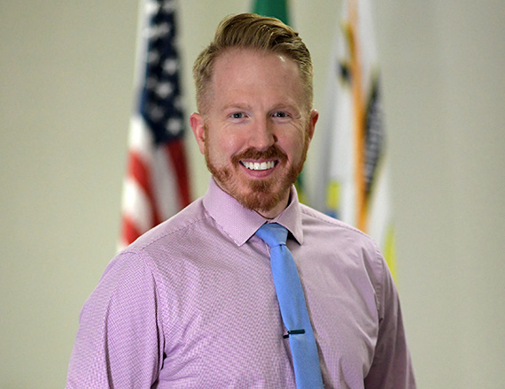

 

## City Council

## Councilmember Davin Perry

My name is Davin Perry and I currently hold position #6 for the Airway Heights City Council. I want to make this city all it can be. A little about me…

A great quote I love is – “Decisions are made by those who show up”. Well sign me up.

I’m a logistics obsessed, type-A personality who values being on-time, following through, and paying attention to the details.

I’m nearly a lifelong West Plains resident. I grew up in Medical Lake, spent 10 years living in Cheney and since 2018 have called Airway Heights home.

I started my career as a multimedia and video professional working for EWU Athletics and then made stops in LA and Atlanta.

Afterwards I returned to EWU for a post-bac in electrical engineering, followed by a year working in the bay area.

In 2017 I came back to teach high school and give back to the community I love. I look forward to serving the City of Airway Heights for the betterment of all citizens. 

 __Committee Assignments:__ 

 * Finance Committee
 * Public Works Committee 
    

 __Top Three Legislative Priorities:  __ 

1) Secure the passage of a public safety bond measure to provide for desperately needed funding to ensure the safety of all citizens.  Our city budget does not currently meet the demands for many of our needs, most importantly police and fire.  With our unprecedented growth we need upgraded facilities along with proper equipment and personnel to meet these needs. 

2) Provide multiple ways in which to provide more affordable housing options while managing growth.  I’m in favor of easing ADU (accessory dwelling units) requirements and code restrictions. 

3) Expand our park space requirements from developers, recreation pathways, and ensure adequate funding to maintain the operation of our magnificent recreation center.

 