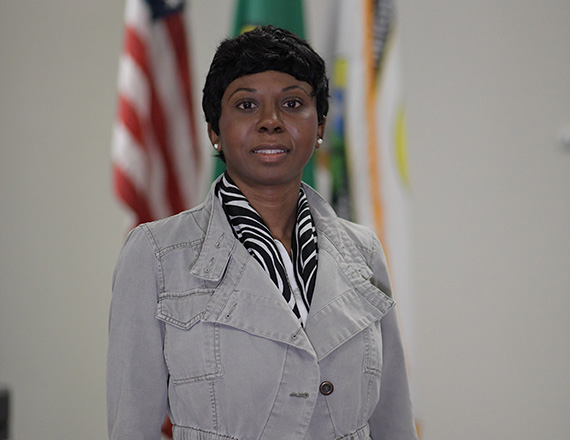

 

## City Council

## Jennifer Morton

Councilmember Jennifer Morton was raised in the small town of Davenport, WA and found her way to the City of Airway Heights in 2017 where she bought her first home. She has a diverse background ranging from aerospace distribution, financial services, city government, and human resources. The military moto of “leave it better than what I found it ” is the driving force that propels her to leave a lasting impact that is measurable and quantifiable. Councilmember Morton looks to work toward four key goals:

 *  __Water: __ provide an actionable sustainable solution for providing clean affordable water for Airway Heights citizens.
 *  __Housing: __ provide affordable, quality housing for current and new residents.     
 *  __Schools: __ secure a complete K-12 school system in our city for the growing population.  
 *  __Infrastructure: __ provide accessible public transportation, inter-agency collaboration, and safe walking/biking paths that connect our thriving neighborhoods and city core. 

With her educational background in public and business administration and military training, Councilmember Morton brings over 18 years of experience ranging from road construction, personnel management, and operation management. As an active member of the community, she has worked with special needs populations, veterans, the homeless community, and at-risk youth. Councilmember Morton hopes to pull from these wide-ranging experiences to meet some of the challenges facing our local community. She looks forward to being a part of the exciting transformation currently underway in the City of Airway Heights. 

    