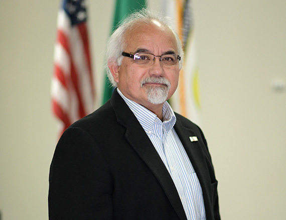

 

## City Council

## Councilmember Hank Bynaker

Hank Bynaker has more than 25 years of management experience in maritime and intermodal transportation operations, having held the positions of Chief Executive Officer of a public port, Vice President and Chief Operations Officer, Director of Marketing and General Manager of Operations, and owner of a loss control and management consulting business. Over his career, he has gained a wide breadth of experience in such areas as labor relations, safety, security, environmental, public agencies, local, federal, and state government including the US Secret Service detachments for President Clinton and Vice President Al Gore. He has served on numerous committees and boards such as the Area Maritime Security Committees for both Puget Sound and Sector Columbia River and the Board of Governors for the US Propeller Club.

Councilmember Bynaker is a good fit for the City Council as he has lived in housing at Fairchild AFB, Cheney, Spokane, Spokane Valley, Medical Lake, and Airway Heights, and is very familiar with all of these communities.

He graduated from Medical Lake High School and earned a Bachelor of Science degree in Safety and Health Management from Central Washington University.

He has been married to his wife Constance Bynaker for 44 years and has two married daughters and five grandchildren. He enjoys boating and fishing and spending quality time with family and friends.

    

 __Top Three Legislative Priorities:__    

 1.  New uncontaminated water source 
 1.  Public safety and security 
 1.  Responsible economic development with job creation 

 __Committee Assignments:__ 

 *  Comprehensive Plan Ad Hoc Committee 
 *   Collective Bargaining Ad Hoc Committee 
 *  Spokane Regional Transportation Council 
 *  Spokane Transit Authority Board of Directors, ex officio member 
 *  Spokane Transit Performance Monitoring & External Relations Committee 
 