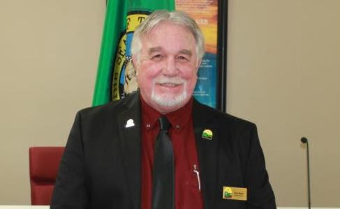

 

## City Council

## Councilmember Dave Malet

Councilmember Dave Malet spent his early childhood in Spokane before moving to Seattle. He has many fond memories of living in Eastern Washington and moved to Airway Heights in 2005 while working in the cable television industry. For the past four years Dave has been employed with the City in the Parks and Recreation Department, until his election to the City Council. He has had the opportunity to meet and work with many people in the community and is excited to be a part of Airway Heights and the future growth.

As a Councilmember he brings 35 years of experience as a small retail business owner, 10 years of experience in the cable television industry and years of experience in real estate. Dave appreciates and understands the importance of small businesses in our developing and emerging City. He is a retired Teamster Union member and was the union steward for the CWA. He believes strongly in equality in the workplace and fair wages. As a resident of Airway Heights and a member of the City Council, Dave plans to be involved in the community and to reach out to the residents for their valuable input on current events and issues. 

    