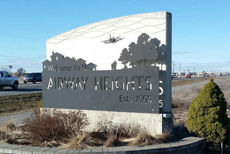

 

# City Council Members

For more information on the individual members of the City Council of Airway Heights, please click the assigned link:

 __Position 1:__   [Councilmember Hank Bynaker](https://cawh.org/city-council-members/councilmember-hank-bynaker/)  

Term expires December 31, 2025

 __Position 2:__  [Councilmember Kevin Richey](https://cawh.org/city-council-members/councilmember-kevin-richey/) 

Term expires December 31, 2025

 __Position 3:__   [Vice Chair Veronica Messing](https://cawh.org/city-council-members/vice-chair-veronica-messing/)  

Term expires December 31, 2027

 __Position 4:__  [Councilmember Dave Malet](https://cawh.org/city-council-members/councilmember-dave-malet/) 

Term expires December 31, 2025

 __Position 5:__  [Council Chair Larry Bowman](https://cawh.org/city-council-members/council-chair-larry-bowman/) 

Term expires December 31, 2027

 __Position 6:__  [Councilmember Davin Perry](https://cawh.org/city-council-members/councilmember-davin-perry/) 

Term expires December 31, 2025

 __Position 7:__  [Councilmember Jennifer Morton](https://cawh.org/city-council-members/councilmember-jennifer-morton/) 

Term expires December 31, 2027

    