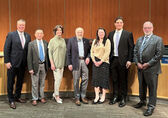
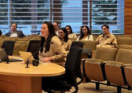
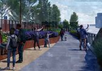
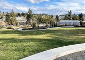
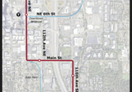
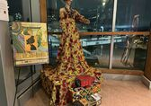
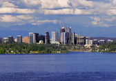

 [Skip to main content](https://bellevuewa.gov/city-news?dept=city-council#main-content)     

  

 City News Search Department- Any -City Attorney's OfficeCity Clerk's OfficeCity CouncilCity Manager's OfficeCommunicationsCommunity DevelopmentDevelopment ServicesEmergency ManagementFinance & Asset ManagementFireHuman ResourcesInformation TechnologyParks & Community ServicesPoliceTransportationUtilities  [Subscribe to City News](https://bellevuewa.gov/city-news/articles.xml?dept=city-council)  

###  [Council Roundup: Claire Sumadiwirya appointed as new councilmember](https://bellevuewa.gov/city-news/council-roundup-3-18-25) 

 March 21 2025 Plus, Keep Bellevue Beautiful and State Legislative session updates    

###  [City Council selects Claire Sumadiwirya to fill council seat until November election](https://bellevuewa.gov/city-news/sumadiwirya-appointment) 

 March 19 2025 Sumadiwirya will be sworn in after seat is vacated March 28The City Council Tuesday interviewed five candidates and unanimously appointed Claire Sumadiwirya to the council seat Councilmember Janice…    

###  [Council Roundup: Finalists selected for upcoming council vacancy](https://bellevuewa.gov/city-news/council-roundup-finalists-selected-upcoming-council-vacancy) 

 March 14 2025 Plus, Grand Connection Crossing, minimum sentencing discussion and celebration of NowruzThe City Council met in executive session Tuesday to review the qualifications of applicants for appointment to…    

###  [Council Roundup: Early successes with Safe Parking Program](https://bellevuewa.gov/city-news/council-roundup-3-4-25) 

 March 7 2025 Plus, naming process for new park, update from county and Women’s History MonthThe City Council received a progress update on Bellevue’s Safe Parking Pilot Program at Tuesday’s council meeting and…    

###  [Council Roundup: Diversity Advantage 2035 and Centering Communities of Color](https://bellevuewa.gov/city-news/council-roundup-2-25-25) 

 February 28 2025 Plus, process for filling council vacancy and land use code amendments for critical areas and BelRedThe City Council heard from members of the Centering Communities of Color Coordinating Team Tuesday… 

###  [Process underway to fill upcoming vacancy on City Council](https://bellevuewa.gov/city-news/zahn-vacancy) 

 February 26 2025 Applications for Position 5 seat due by March 7 

###  [Council Roundup: Update on RapidRide K Line to Kirkland](https://bellevuewa.gov/city-news/council-roundup-2-11-25) 

 February 14 2025 Plus, emergency services levy, Councilmember Zahn’s plans and Day of Remembrance proclamationThe City Council received an update Tuesday from King County Metro about the RapidRide K Line, a bus…    

###  [Council Roundup: Progress report from police](https://bellevuewa.gov/city-news/council-roundup-2-4-25) 

 February 7 2025 Plus, aligning land use code to state law, Innovation Forum update and proclamation for Black History MonthThis week, the City Council was provided an annual crime and recruitment update by the…    

###  [Council funds affordable housing through ARCH, Housing Stability Program](https://bellevuewa.gov/city-news/council-roundup-1-28-25) 

 January 31 2025 Plus, Councilmember Zahn discusses appointment to state legislative office, councilmembers remember a longtime city employee and three proclamations are issued 

###  [Council Roundup: Keeping regional growth center designation for downtown](https://bellevuewa.gov/city-news/council-roundup-1-14-25) 

 January 16 2025 Plus, 2025 legislative session and Bellevue schools update    The City Council Tuesday voted to update the Downtown Subarea Plan to ensure downtown keeps its status as a regional growth…     [Subscribe to City News](https://bellevuewa.gov/city-news/articles.xml?dept=city-council)  

### Reasonable Accommodation

For alternate formats, interpreters, or reasonable modification requests please phone at least 48 hours in advance [425-452-6800](tel:4254526800) (voice) or email [servicefirst@bellevuewa.gov](mailto:servicefirst@bellevuewa.gov). For complaints regarding modifications, contact the City of Bellevue ADA, Title VI, and Equal Opportunity Officer at [ADATitleVI@bellevuewa.gov](mailto:ADATitleVI@bellevuewa.gov).

 