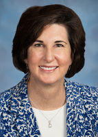

 [Skip to main content](https://bellevuewa.gov/city-government/city-council/councilmembers/lynne-robinson#main-content)        

Mayor 1/6/20-12/31/25

Deputy Mayor 1/2/18-12/31/19

Councilmember 1/1/14-12/31/25

Mayor Lynne Robinson joined the City Council in 2014, and she has a long history of civic involvement. She is a champion for startups and small business, and has encouraged startup and equity crowdfunding workshops at City Hall. Her colleagues voted her deputy mayor in January 2018 and mayor in January 2020, 2022 and 2024.

Lynne also advocates for the environment, parks and open spaces, human services and affordable housing in Bellevue. She proposed a property tax exemption adopted by the council for multifamily complexes that include affordable housing. 

She represents the council on the Sound Cities Association Large City Mayors, the King County Affordable Housing Committee and the Puget Sound Regional Council Executive Board, among other assignments. 

Before her election to the council, Lynne served on and chaired the Bellevue Network on Aging and the Parks & Community Services Board.

A retired physical therapist who ran her own business for 20 years, Lynne holds a doctorate in physical therapy from Regis University and bachelor's degrees in physical therapy from Northwestern University Medical School and community services from California State University Chico. Lynne developed an interest in computer science while in college, and she is on the Washington Technology Industry Association Cascadia Blockchain Council.

Lynne and husband Dan Watson live downtown after moving from the Woodridge neighborhood, where they had resided since 1997. Their two children graduated from Bellevue public schools and are successful professionals. 

## Council Assignments and Appointments

 * King County Emergency Medical Services Advisory Task Force
 * Greater Seattle Partners Board
 * King County Affordable Housing Committee
 * Sound Cities Association North End Mayors
 * Sound Cities Association Large City Mayors
 * Puget Sound Regional Council Executive Board
 * Puget Sound Regional Council Economic Development Board Alternate
 * Washington Technology Industry Association Cascadia Blockchain Council
 * Washington Internet of Things Council
 * LEOFF 1 Pension Board Liaison

## Past Council Assignments and Appointments

 * King County Lake Washington Mayors
 * Puget Sound Regional Council Growth Management Policy Board
 * Puget Sound Regional Council Executive Board 
 * Mental Illness Drug Dependency Advisory Committee
 * Mental Illness Drug Dependency Executive Committee
 * Puget Sound Regional Council Transit-Oriented Development Committee
 * King County Cities Climate Collaboration
 * Eastside Human Services Forum Executive Board
 * Disability Board
 * Human Services Commission Liaison
 * Environmental Stewardship Initiative Council Team
 * Safe Energy Leadership Alliance
 * Special Events Committee Liaison
 * Parks & Community Services Board Liaison
 * Puget Sound Regional Council Transportation Policy Board

## Community Service

 * Parks & Community Services Board, 2008-2013 (chair 2011-2013)
 * Bellevue Network on Aging, 2007-2013 (chair 2008-2012)
 * Woodridge Elementary Program Delivery Council, 2002-2004 (chair)
 * Woodridge Garden Club, 2001-2005 (president)
 * Mount Baker Park Presbyterian Church, 1992-1998 (elder)
 * Volunteer, Bellevue School District
 * Volunteer, Bellevue Youth Theatre
 * Volunteer, Bellevue West Little League
 * Volunteer, Girl Scouts
 * Volunteer, Overlake Auxiliaries

## Employment

 * Small business owner serving older adults (retired)

## Education

 * Regis University, Doctorate, Physical Therapy
 * Northwestern University Medical School, Bachelor of Science, Physical Therapy
 * California State University Chico, Bachelor of Arts, Community Services

### Reasonable Accommodation

For alternate formats, interpreters, or reasonable modification requests please phone at least 48 hours in advance [425-452-7810](tel:425-452-7810) (voice) or email [counciloffice@bellevuewa.gov](mailto:counciloffice@bellevuewa.gov). For complaints regarding modifications, contact the City of Bellevue ADA, Title VI, and Equal Opportunity Officer at [ADATitleVI@bellevuewa.gov](mailto:ADATitleVI@bellevuewa.gov).

 