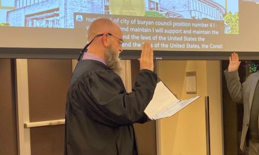

   [Skip navigation](https://www.burienwa.gov/cms/One.aspx?portalId=11046019&pageId=19994831#page)    

# City of Burien

 *   ))  
 *  [Facebook](https://www.facebook.com/CityofBurien) 
 *  [Twitter](https://twitter.com/burien) 
 *  [Instagram](https://www.instagram.com/cityofburien) 
 *  Translate 
   *   
   {1}  [##LOC[OK]##](javascript:void(0);)       [Menu](https://www.burienwa.gov/cms/One.aspx?portalId=11046019&pageId=19994831#mMenuCMS)  

 *  [Home](https://www.burienwa.gov/home) 
 *  [Residents](https://www.burienwa.gov/residents)  
   *  [Resident Resources](https://www.burienwa.gov/residents/resident_resources) 
     *  [Report an Issue](https://www.burienwa.gov/residents/resident_resources/report_an_issue) 
     *  [Schools & Libraries](https://www.burienwa.gov/residents/resident_resources/schools_libraries) 
     *  [Grant Opportunities](https://www.burienwa.gov/residents/resident_resources/grant_opportunities) 
     *  [Utilities](https://www.burienwa.gov/residents/resident_resources/utilities) 
     *  [Community Engagement](https://www.burienwa.gov/residents/resident_resources/community_engagement) 
     *  [Human Services](https://www.burienwa.gov/residents/resident_resources/human_services) 
     *  [Newcomer Information](https://www.burienwa.gov/residents/resident_resources/newcomer_information) 
   *  [Public Safety](https://www.burienwa.gov/residents/public_safety) 
     *  [Police](https://www.burienwa.gov/residents/public_safety/police) 
     *  [Fire](https://www.burienwa.gov/residents/public_safety/fire) 
     *  [Emergency Management](https://www.burienwa.gov/residents/public_safety/emergency_management) 
     *  [Animal Care & Control](https://www.burienwa.gov/residents/public_safety/animal_care_control) 
   *  [Parks, Recreation & Cultural Services](https://www.burienwa.gov/residents/parks_recreation_cultural_services) 
     *  [Programs & Services](https://www.burienwa.gov/residents/parks_recreation_cultural_services/programs_services) 
     *  [Registration](https://www.burienwa.gov/residents/parks_recreation_cultural_services/registration) 
     *  [Recreation Guide](https://www.burienwa.gov/residents/parks_recreation_cultural_services/recreation_guide) 
     *  [Facility Rentals](https://www.burienwa.gov/residents/parks_recreation_cultural_services/facility_rentals) 
     *  [City Parks, Trails & Facilities](https://www.burienwa.gov/residents/parks_recreation_cultural_services/city_parks_trails_facilities) 
     *  [Community Garden](https://www.burienwa.gov/residents/parks_recreation_cultural_services/community_garden) 
     *  [Art](https://www.burienwa.gov/residents/parks_recreation_cultural_services/art) 
     *  [Parks and Facility Master Plans](https://www.burienwa.gov/residents/parks_recreation_cultural_services/parks_and_facility_master_plans) 
     *  [Green Burien Partnership](https://www.burienwa.gov/residents/parks_recreation_cultural_services/green_burien_partnership) 
     *  [Current Park & Facility Improvement Projects](https://www.burienwa.gov/residents/parks_recreation_cultural_services/current_park_facility_improvement_projects) 
     *  [Completed Park & Facility Improvement Projects](https://www.burienwa.gov/residents/parks_recreation_cultural_services/completed_park_facility_improvement_projects) 
   *  [Public Works](https://www.burienwa.gov/residents/public_works) 
     *  [Current Projects](https://www.burienwa.gov/residents/public_works/current_projects) 
     *  [Completed Projects](https://www.burienwa.gov/residents/public_works/completed_projects) 
     *  [Stormwater](https://www.burienwa.gov/residents/public_works/stormwater) 
     *  [Master and Facility Plans](https://www.burienwa.gov/residents/public_works/master_and_facility_plans) 
     *  [Transportation](https://www.burienwa.gov/residents/public_works/transportation) 
   *  [Burien's Vision](https://www.burienwa.gov/residents/burien_s_vision) 
     *  [Comprehensive Plan](https://www.burienwa.gov/residents/burien_s_vision/comprehensive_plan) 
     *  [Downtown Burien Handbook](https://www.burienwa.gov/residents/burien_s_vision/downtown_burien_handbook) 
     *  [Parks, Recreation and Open Space Plan](https://www.burienwa.gov/residents/burien_s_vision/parks_recreation_and_open_space_plan)  
 *  [Business](https://www.burienwa.gov/business)  
   *  [Why Choose Burien?](https://www.burienwa.gov/business/why_choose_burien_) 
     *  [Regional Connection](https://www.burienwa.gov/business/why_choose_burien_/regional_connection) 
     *  [Business Friendly](https://www.burienwa.gov/business/why_choose_burien_/business_friendly) 
     *  [Affordability](https://www.burienwa.gov/business/why_choose_burien_/affordability) 
     *  [Talented Workforce](https://www.burienwa.gov/business/why_choose_burien_/talented_workforce) 
   *  [Start Your Business](https://www.burienwa.gov/business/start_your_business) 
     *  [Business License](https://www.burienwa.gov/business/start_your_business/business_license) 
   *  [Grow your Business](https://www.burienwa.gov/business/grow_your_business) 
     *  [Marketing](https://www.burienwa.gov/business/grow_your_business/marketing) 
     *  [Financing](https://www.burienwa.gov/business/grow_your_business/financing) 
     *  [Workforce Assistance](https://www.burienwa.gov/business/grow_your_business/workforce_assistance) 
     *  [Site Location/Expansion Assistance](https://www.burienwa.gov/business/grow_your_business/site_location__expansion_assistance) 
     *  [Business Resources](https://www.burienwa.gov/business/grow_your_business/business_resources) 
     *  [Shop Local Burien](https://www.burienwa.gov/business/grow_your_business/shop_local_burien) 
   *  [Economic Development](https://www.burienwa.gov/business/economic_development) 
     *  [Business Assistance](https://www.burienwa.gov/business/economic_development/business_assistance) 
     *  [Business Attraction](https://www.burienwa.gov/business/economic_development/business_attraction) 
     *  [Invest in Burien Opportunity Zones](https://www.burienwa.gov/business/economic_development/invest_in_burien_opportunity_zones) 
     *  [Wellness Cluster](https://www.burienwa.gov/business/economic_development/wellness_cluster) 
     *  [Burien Film Office](https://www.burienwa.gov/business/economic_development/burien_film_office) 
     *  [Soundside Alliance](https://www.burienwa.gov/business/economic_development/soundside_alliance) 
     *  [Economic Development Projects & Initiatives](https://www.burienwa.gov/business/economic_development/economic_development_projects_initiatives) 
     *  [Storefront Repair Grant Program](https://www.burienwa.gov/business/economic_development/storefront_repair_grant_program) 
     *  [Small Business Economic Recovery Grants Program](https://www.burienwa.gov/business/economic_development/small_business_economic_recovery_grants_program) 
   *  [Community Development](https://www.burienwa.gov/business/community_development) 
     *  [Permit Center](https://www.burienwa.gov/business/community_development/permit_center) 
     *  [Land Use Review](https://www.burienwa.gov/business/community_development/land_use_review) 
     *  [Request an Inspection](https://www.burienwa.gov/business/community_development/request_an_inspection) 
     *  [Planning Initiatives](https://www.burienwa.gov/business/community_development/planning_initiatives) 
     *  [Development Projects](https://www.burienwa.gov/business/community_development/development_projects) 
     *  [Trees and Urban Forest Management](https://www.burienwa.gov/business/community_development/trees_and_urban_forest_management) 
     *  [Housing Affordability](https://www.burienwa.gov/business/community_development/housing_affordability) 
   *  [Sustainability](https://www.burienwa.gov/business/sustainability) 
     *  [Plastic Bag Ban](https://www.burienwa.gov/business/sustainability/plastic_bag_ban) 
     *  [Compostable Products](https://www.burienwa.gov/business/sustainability/compostable_products) 
     *  [Waste Reduction](https://www.burienwa.gov/business/sustainability/waste_reduction) 
     *  [Burien Source Control Inspection Program](https://www.burienwa.gov/business/sustainability/burien_source_control_inspection_program)  
 *  [City Hall](https://www.burienwa.gov/city_hall)  
   *  [About Burien](https://www.burienwa.gov/city_hall/about_burien) 
     *  [Building Hours and Directions](https://www.burienwa.gov/city_hall/about_burien/building_hours_and_directions) 
     *  [How is Burien Governed?](https://www.burienwa.gov/city_hall/about_burien/how_is_burien_governed) 
     *  [Native Land and Peoples Acknowledgment](https://www.burienwa.gov/city_hall/about_burien/native_land_and_peoples_acknowledgment) 
   *  [City Council](https://www.burienwa.gov/city_hall/city_council) 
     *  [Mayor Kevin Schilling](https://www.burienwa.gov/city_hall/city_council/mayor_kevin_schilling) 
     *  [Deputy Mayor Sarah Moore](https://www.burienwa.gov/city_hall/city_council/sarah_moore) 
     *  [Hugo Garcia](https://www.burienwa.gov/city_hall/city_council/hugo_garcia) 
     *  [Linda Akey](https://www.burienwa.gov/city_hall/city_council/linda_akey) 
     *  [Jimmy Matta](https://www.burienwa.gov/city_hall/city_council/jimmy_matta) 
     *  [Alex Andrade](https://www.burienwa.gov/city_hall/city_council/alex_andrade) 
     *  [Stephanie Mora](https://www.burienwa.gov/city_hall/city_council/deputy_mayor_stephanie_mora) 
     *  [City Council Meeting Access](https://www.burienwa.gov/city_hall/city_council/city_council_meeting_access) 
     *  [Council Roundups](https://www.burienwa.gov/city_hall/city_council/council_roundups) 
     *  [Strategic Plan](https://www.burienwa.gov/city_hall/city_council/strategic_plan) 
   *  [Boards and Commissions](https://www.burienwa.gov/city_hall/boards_and_commissions) 
     *  [Consejos y Comisiones](https://www.burienwa.gov/city_hall/boards_and_commissions/consejos_y_comisiones) 
     *  [Arts Commission](https://www.burienwa.gov/city_hall/boards_and_commissions/arts_commission) 
     *  [Business and Economic Development Partnership](https://www.burienwa.gov/city_hall/boards_and_commissions/business_and_economic_development_partnership) 
     *  [Burien Airport Committee](https://www.burienwa.gov/city_hall/boards_and_commissions/burien_airport_committee) 
     *  [Human Services Commission](https://www.burienwa.gov/city_hall/boards_and_commissions/human_services_commission) 
     *  [Parks and Recreation Advisory Board](https://www.burienwa.gov/city_hall/boards_and_commissions/parks_and_recreation_advisory_board) 
     *  [Planning Commission](https://www.burienwa.gov/city_hall/boards_and_commissions/planning_commission) 
   *  [Working With Us](https://www.burienwa.gov/city_hall/working_with_us) 
     *  [Why Work for Burien?](https://www.burienwa.gov/city_hall/working_with_us/why_work_for_burien_) 
     *  [Job Openings](https://www.burienwa.gov/city_hall/working_with_us/job_openings) 
     *  [Job Descriptions & Salary Schedules](https://www.burienwa.gov/city_hall/working_with_us/job_descriptions_salary_schedules) 
     *  [Volunteer](https://www.burienwa.gov/city_hall/working_with_us/volunteer) 
     *  [Bids, RFPs, & RFQs](https://www.burienwa.gov/city_hall/working_with_us/bids_rfp_rfq) 
     *  [Interlocal Agreements](https://www.burienwa.gov/city_hall/working_with_us/interlocal_agreements) 
   *  [Laws & Regulations](https://www.burienwa.gov/city_hall/laws_regulations) 
     *  [Municipal Code](https://www.burienwa.gov/city_hall/laws_regulations/municipal_code) 
     *  [Public Records Request](https://www.burienwa.gov/city_hall/laws_regulations/public_record_request) 
     *  [Executive Orders](https://www.burienwa.gov/city_hall/laws_regulations/executive_orders) 
     *  [Zoning](https://www.burienwa.gov/city_hall/laws_regulations/zoning) 
     *  [Construction Codes](https://www.burienwa.gov/city_hall/laws_regulations/construction_codes) 
     *  [Shoreline Master Program](https://www.burienwa.gov/city_hall/laws_regulations/shoreline_master_program) 
     *  [Marijuana Business](https://www.burienwa.gov/city_hall/laws_regulations/marijuana_business) 
     *  [Hearing Examiner](https://www.burienwa.gov/city_hall/laws_regulations/hearing_examiner) 
     *  [Code Compliance](https://www.burienwa.gov/city_hall/laws_regulations/code_compliance) 
     *  [City Attorney](https://www.burienwa.gov/city_hall/laws_regulations/city_attorney) 
     *  [Renting in Burien](https://www.burienwa.gov/city_hall/laws_regulations/renting_in_burien) 
     *  [Special Event Permit](https://www.burienwa.gov/city_hall/laws_regulations/special_event_permit) 
     *  [Minimum Wage](https://www.burienwa.gov/city_hall/laws_regulations/minimum_wage) 
   *  [Departments](https://www.burienwa.gov/city_hall/departments) 
   *  [Finance](https://www.burienwa.gov/city_hall/finance) 
     *  [Budget](https://www.burienwa.gov/city_hall/finance/budget) 
     *  [Annual Financial Reports](https://www.burienwa.gov/city_hall/finance/annual_financial_reports) 
     *  [Long-range Financial Plan](https://www.burienwa.gov/city_hall/finance/long-range_financial_plan) 
     *  [Recovery Roadmap](https://www.burienwa.gov/city_hall/finance/recovery_roadmap) 
   *  [Taxes](https://www.burienwa.gov/city_hall/taxes) 
   *  [Areas of Focus](https://www.burienwa.gov/city_hall/areas_of_focus) 
     *  [Arts and Culture](https://www.burienwa.gov/city_hall/areas_of_focus/arts_and_culture) 
     *  [Economic Development](https://www.burienwa.gov/city_hall/areas_of_focus/economic_development) 
     *  [Environment](https://www.burienwa.gov/city_hall/areas_of_focus/environment) 
     *  [Government](https://www.burienwa.gov/city_hall/areas_of_focus/government) 
     *  [Housing](https://www.burienwa.gov/city_hall/areas_of_focus/housing) 
     *  [Human Services](https://www.burienwa.gov/city_hall/areas_of_focus/human_services) 
     *  [Infrastructure and Transportation](https://www.burienwa.gov/city_hall/areas_of_focus/infrastructure_and_transportation) 
     *  [Neighborhoods](https://www.burienwa.gov/city_hall/areas_of_focus/neighborhoods) 
     *  [Pandemic Recovery](https://www.burienwa.gov/city_hall/areas_of_focus/pandemic_recovery) 
     *  [Parks and Recreation](https://www.burienwa.gov/city_hall/areas_of_focus/parks_and_recreation) 
     *  [Public Safety](https://www.burienwa.gov/city_hall/areas_of_focus/public_safety)  
 *  [Visitors](https://www.burienwa.gov/visitors)  
   *  [About Burien](https://www.burienwa.gov/visitors/about_burien) 
   *  [Restaurants & Attractions](https://www.burienwa.gov/visitors/restaurants___attractions) 
   *  [Featured Events](https://www.burienwa.gov/visitors/featured_events) 
   *  [City Parks and Trails](https://www.burienwa.gov/visitors/city_parks_trails) 
   *  [Art](https://www.burienwa.gov/visitors/art)  
 *  [News & Events](https://www.burienwa.gov/news_events)  
   *  [Calendar](https://www.burienwa.gov/news_events/calendar) 
   *  [Featured Events](https://www.burienwa.gov/news_events/featured_events) 
   *  [City Newsroom](https://www.burienwa.gov/news_events/city_newsroom) 
     *  [News & Announcements](https://www.burienwa.gov/news_events/city_newsroom/news_announcements) 
     *  [Social Media](https://www.burienwa.gov/news_events/city_newsroom/social_media) 
     *  [Email Newsletters](https://www.burienwa.gov/news_events/city_newsroom/email_newsletters) 
   *  [Burien TV](https://www.burienwa.gov/news_events/burien_tv) 
   *  [Public Notices](https://www.burienwa.gov/news_events/public_notices) 
   *  [Print Publications](https://www.burienwa.gov/news_events/print_publications) 
     *  [Burien Magazine](https://www.burienwa.gov/news_events/print_publications/burien_magazine) 
     *  [Burien City News](https://www.burienwa.gov/news_events/print_publications/burien_city_news)  
 *  [I Want To...](https://www.burienwa.gov/i_want_to___)  
   *  [Job Openings](https://www.burienwa.gov/i_want_to___/job_openings) 
   *  [Business License](https://www.burienwa.gov/i_want_to___/business_license) 
   *  [Pet License](https://www.burienwa.gov/i_want_to___/pet_license) 
   *  [Permits](https://www.burienwa.gov/i_want_to___/permits) 
   *  [Advisory Boards and Commissions](https://www.burienwa.gov/i_want_to___/citizen_advisory_board) 
   *  [City Council](https://www.burienwa.gov/i_want_to___/city_council) 
   *  [Departments](https://www.burienwa.gov/i_want_to___/departments) 
   *  [City Hall](https://www.burienwa.gov/i_want_to___/city_hall) 
   *  [King County District Court South](https://www.burienwa.gov/i_want_to___/king_county_district_court_south) 
   *  [Burien Community Center](https://www.burienwa.gov/i_want_to___/burien_community_center) 
   *  [Off-leash Dog Park](https://www.burienwa.gov/i_want_to___/off-leash_dog_park) 
   *  [Parks](https://www.burienwa.gov/i_want_to___/parks) 
   *  [Police Station](https://www.burienwa.gov/i_want_to___/police_station) 
   *  [Code Violation](https://www.burienwa.gov/i_want_to___/code_violation) 
   *  [General Concern](https://www.burienwa.gov/i_want_to___/general_concern) 
   *  [Service Request](https://www.burienwa.gov/i_want_to___/service_request) 
   *  [Council Meetings](https://www.burienwa.gov/i_want_to___/council_meetings) 
   *  [Planning Commission Meetings](https://www.burienwa.gov/i_want_to___/planning_commission_meetings) 
   *  [Facility or Athletic Field Rental](https://www.burienwa.gov/i_want_to___/facility_or_athletic_field_rental) 
   *  [Inspection](https://www.burienwa.gov/i_want_to___/inspection) 
   *  [Volunteer Opportunities](https://www.burienwa.gov/i_want_to___/volunteer_opportunities) 
   *  [City Council Meeting](https://www.burienwa.gov/i_want_to___/City-Council-Meeting) 
   *  [Advisory Body Meeting](https://www.burienwa.gov/i_want_to___/Advisory-Body-Meeting) 
   *  [Public Record](https://www.burienwa.gov/i_want_to___/public_record) 
   *  [Special Event Permit](https://www.burienwa.gov/i_want_to___/special_event_permit) 
   *  [Translation or Interpretation](https://www.burienwa.gov/i_want_to___/translation_or_interpretation)  

 *  [Home](https://www.burienwa.gov/home) 
 *  [Residents](https://www.burienwa.gov/residents) 
   *  [Resident Resources](https://www.burienwa.gov/residents/resident_resources) 
     *  [Report an Issue](https://www.burienwa.gov/residents/resident_resources/report_an_issue) 
     *  [Schools & Libraries](https://www.burienwa.gov/residents/resident_resources/schools_libraries) 
     *  [Grant Opportunities](https://www.burienwa.gov/residents/resident_resources/grant_opportunities) 
     *  [Utilities](https://www.burienwa.gov/residents/resident_resources/utilities) 
     *  [Community Engagement](https://www.burienwa.gov/residents/resident_resources/community_engagement) 
     *  [Human Services](https://www.burienwa.gov/residents/resident_resources/human_services) 
     *  [Newcomer Information](https://www.burienwa.gov/residents/resident_resources/newcomer_information) 
   *  [Public Safety](https://www.burienwa.gov/residents/public_safety) 
     *  [Police](https://www.burienwa.gov/residents/public_safety/police) 
     *  [Fire](https://www.burienwa.gov/residents/public_safety/fire) 
     *  [Emergency Management](https://www.burienwa.gov/residents/public_safety/emergency_management) 
     *  [Animal Care & Control](https://www.burienwa.gov/residents/public_safety/animal_care_control) 
   *  [Parks, Recreation & Cultural Services](https://www.burienwa.gov/residents/parks_recreation_cultural_services) 
     *  [Programs & Services](https://www.burienwa.gov/residents/parks_recreation_cultural_services/programs_services) 
     *  [Registration](https://www.burienwa.gov/residents/parks_recreation_cultural_services/registration) 
     *  [Recreation Guide](https://www.burienwa.gov/residents/parks_recreation_cultural_services/recreation_guide) 
     *  [Facility Rentals](https://www.burienwa.gov/residents/parks_recreation_cultural_services/facility_rentals) 
     *  [City Parks, Trails & Facilities](https://www.burienwa.gov/residents/parks_recreation_cultural_services/city_parks_trails_facilities) 
     *  [Community Garden](https://www.burienwa.gov/residents/parks_recreation_cultural_services/community_garden) 
     *  [Art](https://www.burienwa.gov/residents/parks_recreation_cultural_services/art) 
     *  [Parks and Facility Master Plans](https://www.burienwa.gov/residents/parks_recreation_cultural_services/parks_and_facility_master_plans) 
     *  [Green Burien Partnership](https://www.burienwa.gov/residents/parks_recreation_cultural_services/green_burien_partnership) 
     *  [Current Park & Facility Improvement Projects](https://www.burienwa.gov/residents/parks_recreation_cultural_services/current_park_facility_improvement_projects) 
     *  [Completed Park & Facility Improvement Projects](https://www.burienwa.gov/residents/parks_recreation_cultural_services/completed_park_facility_improvement_projects) 
   *  [Public Works](https://www.burienwa.gov/residents/public_works) 
     *  [Current Projects](https://www.burienwa.gov/residents/public_works/current_projects) 
     *  [Completed Projects](https://www.burienwa.gov/residents/public_works/completed_projects) 
     *  [Stormwater](https://www.burienwa.gov/residents/public_works/stormwater) 
     *  [Master and Facility Plans](https://www.burienwa.gov/residents/public_works/master_and_facility_plans) 
     *  [Transportation](https://www.burienwa.gov/residents/public_works/transportation) 
   *  [Burien's Vision](https://www.burienwa.gov/residents/burien_s_vision) 
     *  [Comprehensive Plan](https://www.burienwa.gov/residents/burien_s_vision/comprehensive_plan) 
     *  [Downtown Burien Handbook](https://www.burienwa.gov/residents/burien_s_vision/downtown_burien_handbook) 
     *  [Parks, Recreation and Open Space Plan](https://www.burienwa.gov/residents/burien_s_vision/parks_recreation_and_open_space_plan) 
 *  [Business](https://www.burienwa.gov/business) 
   *  [Why Choose Burien?](https://www.burienwa.gov/business/why_choose_burien_) 
     *  [Regional Connection](https://www.burienwa.gov/business/why_choose_burien_/regional_connection) 
     *  [Business Friendly](https://www.burienwa.gov/business/why_choose_burien_/business_friendly) 
     *  [Affordability](https://www.burienwa.gov/business/why_choose_burien_/affordability) 
     *  [Talented Workforce](https://www.burienwa.gov/business/why_choose_burien_/talented_workforce) 
   *  [Start Your Business](https://www.burienwa.gov/business/start_your_business) 
     *  [Business License](https://www.burienwa.gov/business/start_your_business/business_license) 
   *  [Grow your Business](https://www.burienwa.gov/business/grow_your_business) 
     *  [Marketing](https://www.burienwa.gov/business/grow_your_business/marketing) 
     *  [Financing](https://www.burienwa.gov/business/grow_your_business/financing) 
     *  [Workforce Assistance](https://www.burienwa.gov/business/grow_your_business/workforce_assistance) 
     *  [Site Location/Expansion Assistance](https://www.burienwa.gov/business/grow_your_business/site_location__expansion_assistance) 
     *  [Business Resources](https://www.burienwa.gov/business/grow_your_business/business_resources) 
     *  [Shop Local Burien](https://www.burienwa.gov/business/grow_your_business/shop_local_burien) 
   *  [Economic Development](https://www.burienwa.gov/business/economic_development) 
     *  [Business Assistance](https://www.burienwa.gov/business/economic_development/business_assistance) 
     *  [Business Attraction](https://www.burienwa.gov/business/economic_development/business_attraction) 
     *  [Invest in Burien Opportunity Zones](https://www.burienwa.gov/business/economic_development/invest_in_burien_opportunity_zones) 
     *  [Wellness Cluster](https://www.burienwa.gov/business/economic_development/wellness_cluster) 
     *  [Burien Film Office](https://www.burienwa.gov/business/economic_development/burien_film_office) 
     *  [Soundside Alliance](https://www.burienwa.gov/business/economic_development/soundside_alliance) 
     *  [Economic Development Projects & Initiatives](https://www.burienwa.gov/business/economic_development/economic_development_projects_initiatives) 
     *  [Storefront Repair Grant Program](https://www.burienwa.gov/business/economic_development/storefront_repair_grant_program) 
     *  [Small Business Economic Recovery Grants Program](https://www.burienwa.gov/business/economic_development/small_business_economic_recovery_grants_program) 
   *  [Community Development](https://www.burienwa.gov/business/community_development) 
     *  [Permit Center](https://www.burienwa.gov/business/community_development/permit_center) 
     *  [Land Use Review](https://www.burienwa.gov/business/community_development/land_use_review) 
     *  [Request an Inspection](https://www.burienwa.gov/business/community_development/request_an_inspection) 
     *  [Planning Initiatives](https://www.burienwa.gov/business/community_development/planning_initiatives) 
     *  [Development Projects](https://www.burienwa.gov/business/community_development/development_projects) 
     *  [Trees and Urban Forest Management](https://www.burienwa.gov/business/community_development/trees_and_urban_forest_management) 
     *  [Housing Affordability](https://www.burienwa.gov/business/community_development/housing_affordability) 
   *  [Sustainability](https://www.burienwa.gov/business/sustainability) 
     *  [Plastic Bag Ban](https://www.burienwa.gov/business/sustainability/plastic_bag_ban) 
     *  [Compostable Products](https://www.burienwa.gov/business/sustainability/compostable_products) 
     *  [Waste Reduction](https://www.burienwa.gov/business/sustainability/waste_reduction) 
     *  [Burien Source Control Inspection Program](https://www.burienwa.gov/business/sustainability/burien_source_control_inspection_program) 
 *  [City Hall](https://www.burienwa.gov/city_hall) 
   *  [About Burien](https://www.burienwa.gov/city_hall/about_burien) 
     *  [Building Hours and Directions](https://www.burienwa.gov/city_hall/about_burien/building_hours_and_directions) 
     *  [How is Burien Governed?](https://www.burienwa.gov/city_hall/about_burien/how_is_burien_governed) 
     *  [Native Land and Peoples Acknowledgment](https://www.burienwa.gov/city_hall/about_burien/native_land_and_peoples_acknowledgment) 
   *  [City Council](https://www.burienwa.gov/city_hall/city_council) 
     *  [Mayor Kevin Schilling](https://www.burienwa.gov/city_hall/city_council/mayor_kevin_schilling) 
     *  [Deputy Mayor Sarah Moore](https://www.burienwa.gov/city_hall/city_council/sarah_moore) 
     *  [Hugo Garcia](https://www.burienwa.gov/city_hall/city_council/hugo_garcia) 
     *  [Linda Akey](https://www.burienwa.gov/city_hall/city_council/linda_akey) 
     *  [Jimmy Matta](https://www.burienwa.gov/city_hall/city_council/jimmy_matta) 
     *  [Alex Andrade](https://www.burienwa.gov/city_hall/city_council/alex_andrade) 
     *  [Stephanie Mora](https://www.burienwa.gov/city_hall/city_council/deputy_mayor_stephanie_mora) 
     *  [City Council Meeting Access](https://www.burienwa.gov/city_hall/city_council/city_council_meeting_access) 
     *  [Council Roundups](https://www.burienwa.gov/city_hall/city_council/council_roundups) 
     *  [Strategic Plan](https://www.burienwa.gov/city_hall/city_council/strategic_plan) 
   *  [Boards and Commissions](https://www.burienwa.gov/city_hall/boards_and_commissions) 
     *  [Consejos y Comisiones](https://www.burienwa.gov/city_hall/boards_and_commissions/consejos_y_comisiones) 
     *  [Arts Commission](https://www.burienwa.gov/city_hall/boards_and_commissions/arts_commission) 
     *  [Business and Economic Development Partnership](https://www.burienwa.gov/city_hall/boards_and_commissions/business_and_economic_development_partnership) 
     *  [Burien Airport Committee](https://www.burienwa.gov/city_hall/boards_and_commissions/burien_airport_committee) 
     *  [Human Services Commission](https://www.burienwa.gov/city_hall/boards_and_commissions/human_services_commission) 
     *  [Parks and Recreation Advisory Board](https://www.burienwa.gov/city_hall/boards_and_commissions/parks_and_recreation_advisory_board) 
     *  [Planning Commission](https://www.burienwa.gov/city_hall/boards_and_commissions/planning_commission) 
   *  [Working With Us](https://www.burienwa.gov/city_hall/working_with_us) 
     *  [Why Work for Burien?](https://www.burienwa.gov/city_hall/working_with_us/why_work_for_burien_) 
     *  [Job Openings](https://www.burienwa.gov/city_hall/working_with_us/job_openings) 
     *  [Job Descriptions & Salary Schedules](https://www.burienwa.gov/city_hall/working_with_us/job_descriptions_salary_schedules) 
     *  [Volunteer](https://www.burienwa.gov/city_hall/working_with_us/volunteer) 
     *  [Bids, RFPs, & RFQs](https://www.burienwa.gov/city_hall/working_with_us/bids_rfp_rfq) 
     *  [Interlocal Agreements](https://www.burienwa.gov/city_hall/working_with_us/interlocal_agreements) 
   *  [Laws & Regulations](https://www.burienwa.gov/city_hall/laws_regulations) 
     *  [Municipal Code](https://www.burienwa.gov/city_hall/laws_regulations/municipal_code) 
     *  [Public Records Request](https://www.burienwa.gov/city_hall/laws_regulations/public_record_request) 
     *  [Executive Orders](https://www.burienwa.gov/city_hall/laws_regulations/executive_orders) 
     *  [Zoning](https://www.burienwa.gov/city_hall/laws_regulations/zoning) 
     *  [Construction Codes](https://www.burienwa.gov/city_hall/laws_regulations/construction_codes) 
     *  [Shoreline Master Program](https://www.burienwa.gov/city_hall/laws_regulations/shoreline_master_program) 
     *  [Marijuana Business](https://www.burienwa.gov/city_hall/laws_regulations/marijuana_business) 
     *  [Hearing Examiner](https://www.burienwa.gov/city_hall/laws_regulations/hearing_examiner) 
     *  [Code Compliance](https://www.burienwa.gov/city_hall/laws_regulations/code_compliance) 
     *  [City Attorney](https://www.burienwa.gov/city_hall/laws_regulations/city_attorney) 
     *  [Renting in Burien](https://www.burienwa.gov/city_hall/laws_regulations/renting_in_burien) 
     *  [Special Event Permit](https://www.burienwa.gov/city_hall/laws_regulations/special_event_permit) 
     *  [Minimum Wage](https://www.burienwa.gov/city_hall/laws_regulations/minimum_wage) 
   *  [Departments](https://www.burienwa.gov/city_hall/departments) 
   *  [Finance](https://www.burienwa.gov/city_hall/finance) 
     *  [Budget](https://www.burienwa.gov/city_hall/finance/budget) 
     *  [Annual Financial Reports](https://www.burienwa.gov/city_hall/finance/annual_financial_reports) 
     *  [Long-range Financial Plan](https://www.burienwa.gov/city_hall/finance/long-range_financial_plan) 
     *  [Recovery Roadmap](https://www.burienwa.gov/city_hall/finance/recovery_roadmap) 
   *  [Taxes](https://www.burienwa.gov/city_hall/taxes) 
   *  [Areas of Focus](https://www.burienwa.gov/city_hall/areas_of_focus) 
     *  [Arts and Culture](https://www.burienwa.gov/city_hall/areas_of_focus/arts_and_culture) 
     *  [Economic Development](https://www.burienwa.gov/city_hall/areas_of_focus/economic_development) 
     *  [Environment](https://www.burienwa.gov/city_hall/areas_of_focus/environment) 
     *  [Government](https://www.burienwa.gov/city_hall/areas_of_focus/government) 
     *  [Housing](https://www.burienwa.gov/city_hall/areas_of_focus/housing) 
     *  [Human Services](https://www.burienwa.gov/city_hall/areas_of_focus/human_services) 
     *  [Infrastructure and Transportation](https://www.burienwa.gov/city_hall/areas_of_focus/infrastructure_and_transportation) 
     *  [Neighborhoods](https://www.burienwa.gov/city_hall/areas_of_focus/neighborhoods) 
     *  [Pandemic Recovery](https://www.burienwa.gov/city_hall/areas_of_focus/pandemic_recovery) 
     *  [Parks and Recreation](https://www.burienwa.gov/city_hall/areas_of_focus/parks_and_recreation) 
     *  [Public Safety](https://www.burienwa.gov/city_hall/areas_of_focus/public_safety) 
 *  [Visitors](https://www.burienwa.gov/visitors) 
   *  [About Burien](https://www.burienwa.gov/visitors/about_burien) 
   *  [Restaurants & Attractions](https://www.burienwa.gov/visitors/restaurants___attractions) 
   *  [Featured Events](https://www.burienwa.gov/visitors/featured_events) 
   *  [City Parks and Trails](https://www.burienwa.gov/visitors/city_parks_trails) 
   *  [Art](https://www.burienwa.gov/visitors/art) 
 *  [News & Events](https://www.burienwa.gov/news_events) 
   *  [Calendar](https://www.burienwa.gov/news_events/calendar) 
   *  [Featured Events](https://www.burienwa.gov/news_events/featured_events) 
   *  [City Newsroom](https://www.burienwa.gov/news_events/city_newsroom) 
     *  [News & Announcements](https://www.burienwa.gov/news_events/city_newsroom/news_announcements) 
     *  [Social Media](https://www.burienwa.gov/news_events/city_newsroom/social_media) 
     *  [Email Newsletters](https://www.burienwa.gov/news_events/city_newsroom/email_newsletters) 
   *  [Burien TV](https://www.burienwa.gov/news_events/burien_tv) 
   *  [Public Notices](https://www.burienwa.gov/news_events/public_notices) 
   *  [Print Publications](https://www.burienwa.gov/news_events/print_publications) 
     *  [Burien Magazine](https://www.burienwa.gov/news_events/print_publications/burien_magazine) 
     *  [Burien City News](https://www.burienwa.gov/news_events/print_publications/burien_city_news) 
 *  [I Want To...](https://www.burienwa.gov/i_want_to___) 
   *  [Job Openings](https://www.burienwa.gov/i_want_to___/job_openings) 
   *  [Business License](https://www.burienwa.gov/i_want_to___/business_license) 
   *  [Pet License](https://www.burienwa.gov/i_want_to___/pet_license) 
   *  [Permits](https://www.burienwa.gov/i_want_to___/permits) 
   *  [Advisory Boards and Commissions](https://www.burienwa.gov/i_want_to___/citizen_advisory_board) 
   *  [City Council](https://www.burienwa.gov/i_want_to___/city_council) 
   *  [Departments](https://www.burienwa.gov/i_want_to___/departments) 
   *  [City Hall](https://www.burienwa.gov/i_want_to___/city_hall) 
   *  [King County District Court South](https://www.burienwa.gov/i_want_to___/king_county_district_court_south) 
   *  [Burien Community Center](https://www.burienwa.gov/i_want_to___/burien_community_center) 
   *  [Off-leash Dog Park](https://www.burienwa.gov/i_want_to___/off-leash_dog_park) 
   *  [Parks](https://www.burienwa.gov/i_want_to___/parks) 
   *  [Police Station](https://www.burienwa.gov/i_want_to___/police_station) 
   *  [Code Violation](https://www.burienwa.gov/i_want_to___/code_violation) 
   *  [General Concern](https://www.burienwa.gov/i_want_to___/general_concern) 
   *  [Service Request](https://www.burienwa.gov/i_want_to___/service_request) 
   *  [Council Meetings](https://www.burienwa.gov/i_want_to___/council_meetings) 
   *  [Planning Commission Meetings](https://www.burienwa.gov/i_want_to___/planning_commission_meetings) 
   *  [Facility or Athletic Field Rental](https://www.burienwa.gov/i_want_to___/facility_or_athletic_field_rental) 
   *  [Inspection](https://www.burienwa.gov/i_want_to___/inspection) 
   *  [Volunteer Opportunities](https://www.burienwa.gov/i_want_to___/volunteer_opportunities) 
   *  [City Council Meeting](https://www.burienwa.gov/i_want_to___/City-Council-Meeting) 
   *  [Advisory Body Meeting](https://www.burienwa.gov/i_want_to___/Advisory-Body-Meeting) 
   *  [Public Record](https://www.burienwa.gov/i_want_to___/public_record) 
   *  [Special Event Permit](https://www.burienwa.gov/i_want_to___/special_event_permit) 
   *  [Translation or Interpretation](https://www.burienwa.gov/i_want_to___/translation_or_interpretation) 
  [City of Burien](https://www.burienwa.gov/cms/One.aspx?portalId=11046019&pageId=19994831)  »  [City Hall](https://www.burienwa.gov/city_hall)  »  [City Council](https://www.burienwa.gov/city_hall/city_council)  »  [Council Roundups](https://www.burienwa.gov/city_hall/city_council/council_roundups)  »  Council Roundup: December 18, 2023 

 *  [Print this page](https://www.burienwa.gov/cms/One.aspx?portalId=11046019&pageId=19994831#) 
 *  [Share this page](https://www.burienwa.gov/cms/One.aspx?portalId=11046019&pageId=19994831#) 

 *  [A-](https://www.burienwa.gov/cms/One.aspx?portalId=11046019&pageId=19994831#) 
 *  [A+](https://www.burienwa.gov/cms/One.aspx?portalId=11046019&pageId=19994831#) 
  [Skip Sidebar Navigation](https://www.burienwa.gov/cms/One.aspx?portalId=11046019&pageId=19994831#ctl00_ContentPlaceHolder1_ctl04_linkLastNav)    [Council Roundup: December 18, 2023](https://www.burienwa.gov/city_hall/city_council/council_roundups/council_roundup_december_18_2023)   [Council Roundup: December 18, 2023](https://www.burienwa.gov/city_hall/city_council/council_roundups/council_roundup_december_18_2023)   [Last item for navigation](https://www.burienwa.gov/cms/portlets/#) 

## Council Roundup: December 18, 2023

  Honoring and Welcoming Councilmembers, PROS Plan, New Revenues Posted on 12/27/2023   

The Burien City Council hosted a reception to honor outgoing councilmembers and to welcome incoming councilmembers. They also heard a presentation on the Parks, Recreation and Open Space Plan and discussed new revenue options to address a forecasted revenue gap.  

 *  [View the agenda](https://burienwa.civicweb.net/Portal/MeetingInformation.aspx?Org=Cal&Id=1103) 

 *  [Watch the video](https://imd0mxanj2.execute-api.us-west-2.amazonaws.com/ssr/watch/658125973f8fa20008f1fc55) 

## City Council Honors Outgoing Councilmembers, Welcomes New Councilmembers

The City Council presented proclamations and a key to the city to Mayor Sofia Aragon and Councilmember Cydney Moore.

Linda Akey, Alex Andrade, and Kevin Schilling, who won council positions in the recent election, took their oaths of office.

Both incoming and outgoing councilmembers were celebrated at a special reception prior to the regular meeting.

## Parks, Recreation and Open Space Plan Presented

City Council heard the first of a series of scheduled presentations on the updated [Parks, Recreation and Open Space (PROS) Plan](https://connect.burienwa.gov/projects/parks-recreation-and-open-space-plan-update). The City sought feedback on the elements of the plan through the [Shape Your City](https://connect.burienwa.gov/projects/shape-your-city) initiative.

The purpose of the PROS plan is to guide the future of Burien’s parks, recreation, and open space planning and capital project prioritization over the next six years. The plan includes an overview of community input, system analysis, themes and goals, and Capital Improvement Program (CIP) prioritization. It provides recommendations to support a wholistic system and provide opportunities for enhancements to the current system.

The planning process identified the following opportunities:

 * Parks and Recreation Centers are critical infrastructure for positive health outcomes.
 * Providing recreation and educational opportunities is a community-wide effort.
 * Integration of public art and representation bolster community ownership.

Challenges include:

 * Climate change leading to dire health and economic consequences.
 * Maintenance and funding limitations could impact system expansions.
 * The need for equitable access to safe parks and open spaces.

The plan proposes that capital improvement projects be prioritized using metrics that consider equity, existing conditions, level of service, and opportunities.

## City Council Discusses Revenue Options to Address Forecasted Revenue Gap

The City Council discussed options to raise revenues to address a forecasted revenue gap. They directed staff bring back legislation to review both council and voter-approved revenue options.

## Council Reports

During the Council Reports portion of the meeting, the following councilmembers provided updates:

 * Deputy Mayor Schilling reported on his attendance of a Sound Cities Association meeting to approve funds to operate their organization.
 * Mayor Aragon recommended the City Council sign a letter of support for Sound Cities Association’s ask for federal funding for new helicopters for the King County Sheriff’s Office.

## City Manager’s Report

During the City Manager’s Report portion of the meeting, the City Manager provided the following updates:

 * Shape Your City open house occurred on December 6. Community members who were unable to attend can still provide feedback through January 5, 2024 in [an online engagement activity](https://storymaps.arcgis.com/collections/092f6f0f8c92484b8b3a9b7351308854).
 * Kinect@Burien has applied for Multifamily Tax Exemption (MFTE). City staff confirmed receipt the application.
 * Recruitment for [advisory boards](https://www.burienwa.gov/news_events/city_newsroom/news_announcements/city_council_advisory_board_roles_for_2024) continues, with applications due January 12, 2024.
 * Progress is being made to establish a temporary emergency housing village. City staff are meeting with staff from King County Regional Homelessness Authority, City of Seattle, and King County.
 * Communication has resumed with Oasis Home Church and Burien Community Support Coalition regarding Sunnydale Village.
 * King County is issuing a request for proposals for cities to site, construct, operate, and/or develop projects that benefit people living unsheltered and mitigate the negative impacts of living unsheltered, such as, day centers, hygiene services, sanctioned encampments, and shelter within the city for serving unsheltered individuals or families. Up to $5 million in funding is available to pay for or reimburse eligible costs incurred from the contract start date through December 31, 2026. The City Council gave staff direction to proceed with an application in partnership with Mary’s Place to support their [Burien Affordable Housing and Shelter Development Project](https://www.marysplaceseattle.org/burien-project).

##  __ Consent Agenda__  ____ 

The City Council approved the following on their consent agenda:

 * Federal and state legislative agendas
 * Ordinance No. 833, Amending BMC 3.11.078 - Printing and Publishing Income for Local Business and Occupation Tax
     

 *  [Request for Accommodation](https://www.burienwa.gov/accessibility) 
 *  [Translation and Interpretation](https://www.burienwa.gov/translation_and_interpretation) 
 *  [RFPs and RFQs](https://www.burienwa.gov/city_hall/working_with_us/bids_rfp_rfq) 
 *  [Permit Center](https://www.burienwa.gov/business/community_development/permit_center) 
 *  [Zoning Code](https://www.burienwa.gov/city_hall/laws_regulations/zoning) 

 *  [Map Library](https://www.burienwa.gov/map_library) 
 *  [Comprehensive Plan](https://www.burienwa.gov/residents/burien_s_vision/comprehensive_plan) 
 *  [Burien Municipal Code](https://www.codepublishing.com/WA/Burien) 
 *  [Register for a Class](https://www.burienwa.gov/residents/parks_recreation_cultural_services/registration) 
 *  [Facility and Field Rental](https://www.burienwa.gov/residents/parks_recreation_cultural_services/facility_rentals) 

 *  [Facebook](https://www.facebook.com/CityofBurien) 
 *  [Twitter](https://twitter.com/burien) 
 *  [Instagram](https://www.instagram.com/cityofburien) 

400 SW 152nd St, Suite 300, Burien, WA 98166

(206) 241-4647

(206) 248-5539

© 2025 City of Burien | All Rights Reserved | [Terms of Use](https://www.burienwa.gov/footer/terms_of_use) | Powered by [CivicLive](https://www.civiclive.com) 

 