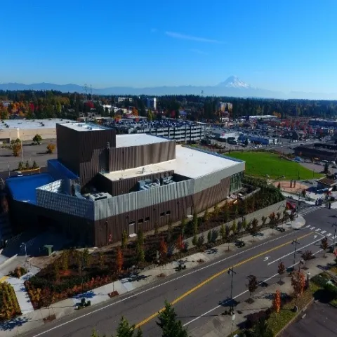
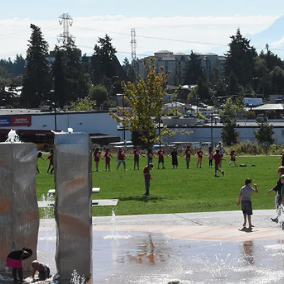
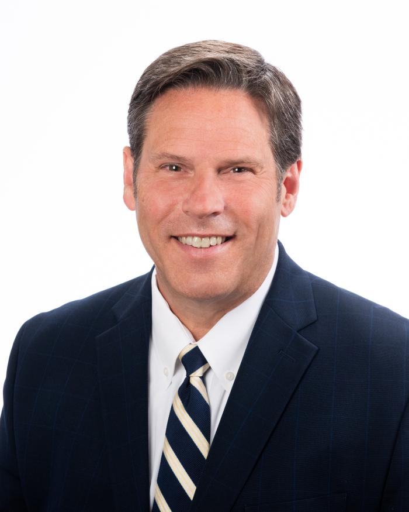

    

# Mayor's Office

 Image    

## Performing Arts & Event Center

 Image    

## Town Square Park

 Image    

## Dumas Bay Centre

 PlayPause HomePassportsVolunteeringPermitPay Traffic Infraction  [Mayor's Twitter (X) page](https://twitter.com/WAFederalWay)   [Mayor Ferrell's Facebook page](https://www.facebook.com/MayorJimFerrell)   [City of Federal Way's Instagram page](https://www.instagram.com/fedwaywa/?next=/fedwaywa/)  

Looking for something specific? Try the __SEARCH__  

Search Image    

 __Welcome to Federal Way! __ 

We take pride in our community, from the Performing Arts & Event Center, Town Square Park, Dumas Bay Centre, Steel Lake, Town Center Steps, and the flagpole on 320th - we consider this Federal Way's front yard. Federal Way is a community Centered on Opportunity!

Jim Ferrell, 

Federal Way Mayor 

Learn more about Mayor Jim Ferrell [from his official bio](https://www.federalwaywa.gov/page/about-jim-ferrell).

### Mayor's Office

Monday-Friday 8-5 p.m.

33325 8th Avenue S

Federal Way, WA 98003

### Mayor Jim Ferrell

(253) 835-2402 

 [jim.ferrell@federalwaywa.gov](mailto:Jim.Ferrell@federalwaywa.gov) 

### Mayor's Staff

Brian Davis, City Administrator

(253) 835-2414

 [brian.davis@federalwaywa.gov](mailto:brian.davis@federalwaywa.gov) 

Ben Miller, Communications Manager

(253) 835-2411

 [ben.miller@federalwaywa.gov](mailto:brian.davis@federalwaywa.gov) 

Bill Vadino, Policy Advisor

(253) 835-2420

 [bill.vadino@federalwaywa.gov](mailto:bill.vadino@federalwaywa.gov) 

Pam Jones, Mayor's Executive Assistant

(253) 835-2402

 [pamela.jones@federalwaywa.gov](mailto:pamela.jones@federalwaywa.gov) 

Susan Sooy, Office Assistant

(253) 835-2403

 [susan.sooy@federalwaywa.gov](mailto:susan.sooy@federalwaywa.gov) 

 

 