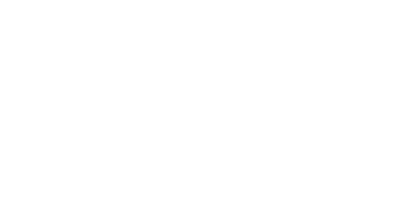

 [Skip to main content](https://www.federalwaywa.gov/mayors-office#main-content)     

## Main navigation

 *  About About sub-navigation   

Federal Way is a fast-growing city  *Centered on Opportunity*. The current population is 102,000 in one of the most diverse communities in Washington state.  

   *  [Directions to City Hall](https://www.federalwaywa.gov/page/directions-city-hallcourtpolice)  
   *  [Calendar of Events](https://www.federalwaywa.gov/calendar)  
   *  [Bids](https://www.federalwaywa.gov/bids)  
   *  [Employment Opportunities](https://www.governmentjobs.com/careers/federalway)  
   *  [Press Releases](https://www.federalwaywa.gov/page/press-releases)   [Contact Us](https://www.federalwaywa.gov/page/contact-us)   [Join Mailing List(s)](https://www.federalwaywa.gov/page/e-newsletter-sign)   [News](https://www.federalwaywa.gov/page/press-releases)  
 *  Government Government sub-navigation   

Mayor Jim Ferrell, our dedicated City Councilmembers and Municipal Court Judges represent the City of Federal Way.   

   *  [Mayor's Office](https://www.federalwaywa.gov/mayors-office)  
   *  [City Council](https://www.federalwaywa.gov/city-council)  
   *  [Municipal Court](https://www.federalwaywa.gov/municipal-court)  
   *  [Boards & Commissions](https://www.federalwaywa.gov/boards-commissions)  
   *  [City Departments](https://www.federalwaywa.gov/page/departments)   [Get Involved](https://engagefw.com/)   [Agendas & Minutes](https://www.federalwaywa.gov/page/agendas-and-minutes)   [Contact Us](https://www.federalwaywa.gov/page/contact-us)  
 *  Business Business sub-navigation   

Federal Way is conveniently located between Seattle and Portland, Oregon, and is open for business!   

   *  [Economic Development](https://www.federalwaywa.gov/economic-development)  
   *  [Business Tools](https://www.federalwaywa.gov/page/business-tools)  
   *  [Demographics](https://www.federalwaywa.gov/page/demographics)   [Get a Business License](https://www.federalwaywa.gov/page/business-license)   [Downtown Redevelopment](https://www.federalwaywa.gov/page/downtown-redevelopment)   [Contact Us](https://www.federalwaywa.gov/economic-development)  
 *  Community Community sub-navigation   

The Federal Way community features 32 parks, award-winning restaurants along Pacific Highway and 320th, and family-friendly activities. It’s centrally located in Puget Sound, with breathtaking views of Mount Rainier.  

   *  [Transportation & Road Conditions](https://www.federalwaywa.gov/page/roadway-conditions)  
   *  [Parks & Recreation](https://www.federalwaywa.gov/parks)  
   *  [Engage Federal Way](https://engagefw.com/)  
   *  [Eyes on Federal Way](https://www.federalwaywa.gov/page/eyes-federal-way-0)  
   *  [Federal Way Community Center](https://itallhappenshere.org/)  
   *  [Performing Arts & Event Center](https://fwpaec.org/)  
   *  [Be Prepared](https://www.federalwaywa.gov/emergency-management)   [Visit Federal Way](https://visitfw.org/)   [Calendar of Events](https://www.federalwaywa.gov/calendar/month)   [Volunteer](https://www.federalwaywa.gov/page/volunteering-federal-way)  
 *  Services Services sub-navigation 
   *  [Public Works](https://www.federalwaywa.gov/public-works)  
   *  [Entrance Sign](https://www.federalwaywa.gov/sites/default/files/2024-02/EntranceSignDisplayApplicationForm.pdf)  
   *  [Boards and Commissions](https://www.federalwaywa.gov/page/boards-commissions)  
   *  [Jobs](https://www.governmentjobs.com/careers/federalway)  
   *  [Pay](https://www.federalwaywa.gov/page/pay)   [Social Services](https://www.federalwaywa.gov/page/community-social-services)   [Service Request](https://www.federalwaywa.gov/page/eyes-federal-way-0)   [Public Records](https://www.federalwaywa.gov/page/public-records)  
 *  Police Police sub-navigation   

The Federal Way Police Department is nationally accredited to protect and serve our community.  

   *  [Your Federal Way Police Department](https://www.federalwaywa.gov/police-0)  
   *  [Animal Services](https://www.federalwaywa.gov/page/animal-services-unit)  
   *  [Resources](https://www.federalwaywa.gov/page/police-resources)  
   *  [Services](https://www.federalwaywa.gov/page/police-service-request)   [File a Police Report](https://www.federalwaywa.gov/page/file-police-report-online)   [Concealed Pistol License Info](https://www.federalwaywa.gov/page/concealed-pistol-license-cpl-appointment-request-form-0)   [Request Police Record](https://federalway.justfoia.com/publicportal/home/newrequest)  

## Secondary Links

 *  [Visit Federal Way](https://visitfw.org/) 
 *  [Resources](https://www.federalwaywa.gov/page/resources-and-help) 
 *  [News](https://www.federalwaywa.gov/page/federal-way-citywide-news) 
 *  [Jobs](https://www.governmentjobs.com/careers/federalway) 
 *  [Contact](https://www.federalwaywa.gov/page/contact-us) 
 Search Menu    

# Mayor's Office

 Image    

## Performing Arts & Event Center

 Image    

## Town Square Park

 Image    

## Dumas Bay Centre

 PlayPause HomePassportsVolunteeringPermitPay Traffic Infraction  [Mayor's Twitter (X) page](https://twitter.com/WAFederalWay)   [Mayor Ferrell's Facebook page](https://www.facebook.com/MayorJimFerrell)   [City of Federal Way's Instagram page](https://www.instagram.com/fedwaywa/?next=/fedwaywa/)  

Looking for something specific? Try the __SEARCH__  

Search Image    

 __Welcome to Federal Way! __ 

We take pride in our community, from the Performing Arts & Event Center, Town Square Park, Dumas Bay Centre, Steel Lake, Town Center Steps, and the flagpole on 320th - we consider this Federal Way's front yard. Federal Way is a community Centered on Opportunity!

Jim Ferrell, 

Federal Way Mayor 

Learn more about Mayor Jim Ferrell [from his official bio](https://www.federalwaywa.gov/page/about-jim-ferrell).

### Mayor's Office

Monday-Friday 8-5 p.m.

33325 8th Avenue S

Federal Way, WA 98003

### Mayor Jim Ferrell

(253) 835-2402 

 [jim.ferrell@federalwaywa.gov](mailto:Jim.Ferrell@federalwaywa.gov) 

### Mayor's Staff

Brian Davis, City Administrator

(253) 835-2414

 [brian.davis@federalwaywa.gov](mailto:brian.davis@federalwaywa.gov) 

Ben Miller, Communications Manager

(253) 835-2411

 [ben.miller@federalwaywa.gov](mailto:brian.davis@federalwaywa.gov) 

Bill Vadino, Policy Advisor

(253) 835-2420

 [bill.vadino@federalwaywa.gov](mailto:bill.vadino@federalwaywa.gov) 

Pam Jones, Mayor's Executive Assistant

(253) 835-2402

 [pamela.jones@federalwaywa.gov](mailto:pamela.jones@federalwaywa.gov) 

Susan Sooy, Office Assistant

(253) 835-2403

 [susan.sooy@federalwaywa.gov](mailto:susan.sooy@federalwaywa.gov) 

 

 Toggle Dark modeGrow textShrink text 

## Mayors Action Links

 *    [Shop Local Federal Way](https://shoplocalfedway.com/) 
 *    [Citywide News](https://www.federalwaywa.gov/banner/federal-way-citywide-news) 
 *    [Performing Arts & Event Center](https://fwpaec.org/) 
 *    [Employment](https://www.governmentjobs.com/careers/federalway) 

 [__Join us__](https://www.federalwaywa.gov/page/e-newsletter-sign) to stay informed about the events and activities happening in and around the City of Federal Way!

## Secondary Links - Footer

 *  [Visit Federal Way](https://visitfw.org/) 
 *  [Resources](https://www.federalwaywa.gov/page/resources-and-help) 
 *  [News](https://www.federalwaywa.gov/page/federal-way-citywide-news) 
 *  [Jobs](https://www.governmentjobs.com/careers/federalway) 
 *  [Contact](https://www.federalwaywa.gov/page/contact-us) 

  

## Social Media Links

 *  [X (Twitter)](https://twitter.com/wafederalway) 
 *  [Facebook](https://www.facebook.com/CityofFederalWay) 
 *  [Instagram](https://www.instagram.com/fedwaywa/) 
 *  [LinkedIn](https://www.linkedin.com/company/city-of-federal-way/) 
 *  [YouTube](https://www.youtube.com/user/FWcommunications) 

33325 8th Avenue South, Federal Way, WA 98003, 253.835.7000

## Footer

 *  © Copyright 2024 City of Federal Way 
 *  [Accessibility Statement](https://www.federalwaywa.gov/page/website-accessibility-statement) 
 *  [Privacy Policy](https://www.federalwaywa.gov/page/website-privacy-policy) 
 *  [Employee Resources](https://www.federalwaywa.gov/page/employee-resources) 
 