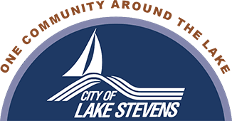
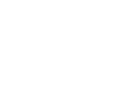

  [Skip to Main Content](https://www.lakestevenswa.gov/320/Council-Members#contentarea)  

 [Create a Website Account](https://www.lakestevenswa.gov/MyAccount/ProfileCreate)  - Manage notification subscriptions, save form progress and more.    

 *  [Website Sign In](https://www.lakestevenswa.gov/MyAccount) 
  

#   

             Search     

 1.  [Government](https://www.lakestevenswa.gov/31/Government) 
 1.  [Our Community](https://www.lakestevenswa.gov/9/Our-Community) 
 1.  [Lake Management](https://www.lakestevenswa.gov/408/Lake-Management) 
 1.  [How Do I...](https://www.lakestevenswa.gov/27/How-Do-I) 
       

 1.  [Home - v3](https://www.lakestevenswa.gov/320/Council-Members) 
 1. Staff Directory
   

# City Council

  Physical Address:

1812 Main Street

Lake Stevens, WA 98258

Mailing Address:

P.O. Box 257

Lake Stevens, WA 98258

Phone:

 [425-622-9400](tel:4256229400) 

Fax:

425-334-0835

Link: [City Council](https://www.lakestevenswa.gov/index.aspx?NID=319) 

|Staff|
|---|
|Name|Title|Email|Phone|Additional Phone|
|[Daughtry, Kim](https://www.lakestevenswa.gov/directory.aspx?EID=31)|Council Position #1||[(425) 407-3869](tel:4254073869)| |
|[Petershagen, Gary](https://www.lakestevenswa.gov/directory.aspx?EID=57)|Council Position #2||[(425) 407-3327](tel:4254073327)| |
|[Donoghue, Ryan](https://www.lakestevenswa.gov/directory.aspx?EID=33)|Council Position #3||[(425) 903-6771](tel:4259036771)| |
|[Shipman, Kymm](https://www.lakestevenswa.gov/directory.aspx?EID=34)|Council Position #4||[(425) 870-1767](tel:4258701767)| |
|[Jorstad, Anji](https://www.lakestevenswa.gov/directory.aspx?EID=35)|Council Position #5||[(425) 407-3147](tel:4254073147)| |
|[Ewing, Steve](https://www.lakestevenswa.gov/directory.aspx?EID=32)|Council Position #6||[(425) 530-6832](tel:4255306832)| |
|[Tageant, Marcus](https://www.lakestevenswa.gov/directory.aspx?EID=37)|Council Position #7||[(425) 407-3880](tel:4254073880)| |

  [Return to Staff Directory](https://www.lakestevenswa.gov/Directory.aspx)  

  

### Live Edit

    

 1.  [Agendas and Minutes](https://www.lakestevenswa.gov/329/Agendas-and-Minutes) 
 1.  [City Council](https://www.lakestevenswa.gov/319/City-Council) 
 1.  [City Maps](https://www.lakestevenswa.gov/187/City-Maps) 
 1.  [Municipal Code](https://www.codepublishing.com/WA/LakeStevens) 
 1.  [Form Center](https://www.lakestevenswa.gov/FormCenter) 
  [Sewer Information](https://www.lakestevenswa.gov/474/Sewer-Information)   [City Services](https://www.lakestevenswa.gov/233/City-Services)   [Contact Us](https://www.lakestevenswa.gov/directory.aspx)   [Job Openings](https://www.lakestevenswa.gov/95/How-to-Apply)   [Online Permit Center](https://www.lakestevenswa.gov/158)   [Parks & Recreation](https://www.lakestevenswa.gov/157)  

 1.        

 1.    

 __City Hall and Permit Counter Hours__    

 Monday through Thursday   

9 am to 12 pm, 1 pm to 4 pm   

 Friday   

9 am - 12 pm   

 1.    

 __City Hall__      

1812 Main Street (physical)   

P.O. Box 257 (mailing)   

Lake Stevens, WA 98258   

Phone: (425) 622-9400   

 1.    

 __Police Department__    

 1825 S Lake Stevens Road   

Lake Stevens, WA 98258   

Phone: (425) 622-9401   

   

###   

 1.  [Facebook](https://www.lakestevenswa.gov/Layout/WidgetShare/ShareLink/Facebook) 
 1.  [Twitter](https://www.lakestevenswa.gov/Layout/WidgetShare/ShareLink/Twitter) 
 1.  [Pinterest](https://www.lakestevenswa.gov/Layout/WidgetShare/ShareLink/Pinterest) 
 1.  [Delicious](https://www.lakestevenswa.gov/Layout/WidgetShare/ShareLink/Delicious) 
 1.  [Blogger](https://www.lakestevenswa.gov/Layout/WidgetShare/ShareLink/Blogger) 
 1.  [LinkedIn](https://www.lakestevenswa.gov/Layout/WidgetShare/ShareLink/LinkedIn) 
 

###   

 1.  [Home](https://www.lakestevenswa.gov/320/Council-Members) 
 1.  [My Account](https://www.lakestevenswa.gov/MyAccount) 
 1.  [Printer Friendly](https://www.lakestevenswa.gov/320/Council-Members#PrinterFriendly62e50871-92bf-441e-986d-1eb79699f41a) 
 1.  [Email Page](https://www.lakestevenswa.gov/EmailPage) 
 1.  [Contact Us](https://www.lakestevenswa.gov/directory.aspx) 
 1.  [RSS](https://www.lakestevenswa.gov/rss.aspx) 
 1.  [Site Map](https://www.lakestevenswa.gov/SiteMap) 
 1.  [Translate Page](https://www.lakestevenswa.gov/320/Council-Members#TranslatePage62e50871-92bf-441e-986d-1eb79699f41a) 
 1.  [Notifications](https://www.lakestevenswa.gov/list.aspx) 
 1.  [Documents](https://www.lakestevenswa.gov/DocumentCenter) 

 1.  [Home](https://www.lakestevenswa.gov/320/Council-Members)  

 1.  [Site Map](https://www.lakestevenswa.gov/sitemap.aspx)  

 1.  [Accessibility](https://www.lakestevenswa.gov/accessibility.aspx)  

 1.  [Copyright Notices](https://www.lakestevenswa.gov/site/copyright)  

 1.  [Government Websites by CivicPlus®](http://civicplus.com/referral)  

 /QuickLinks.aspx Loading Loading Do Not Show AgainClose   [] 