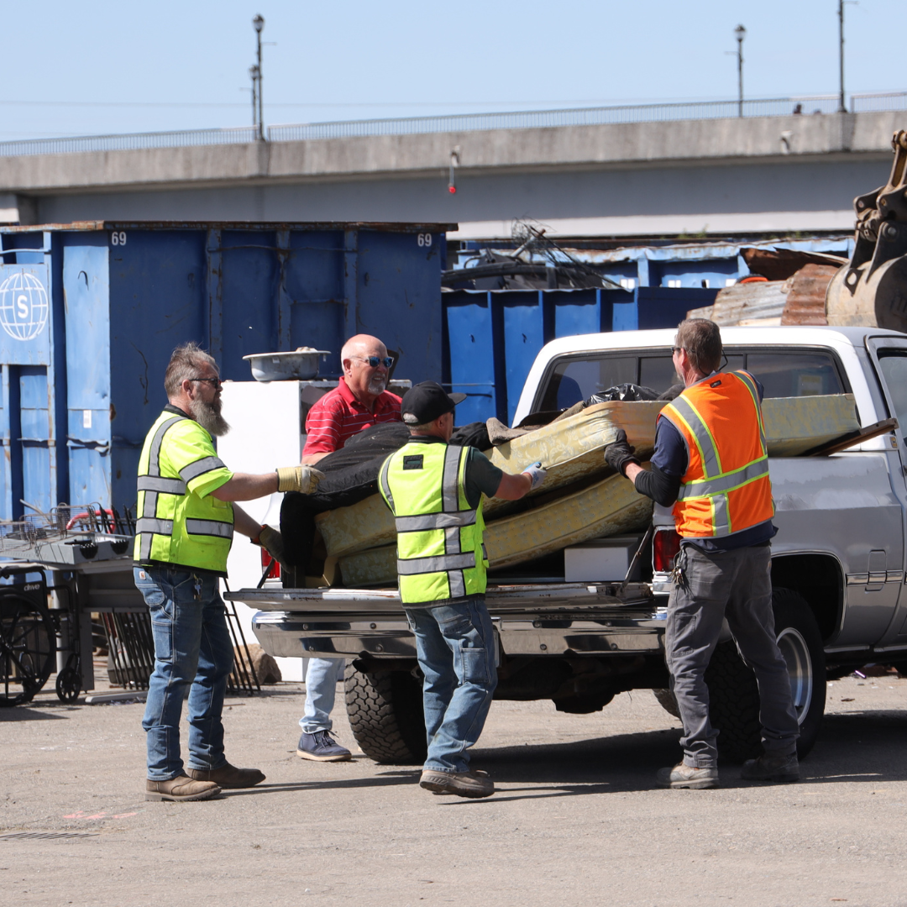
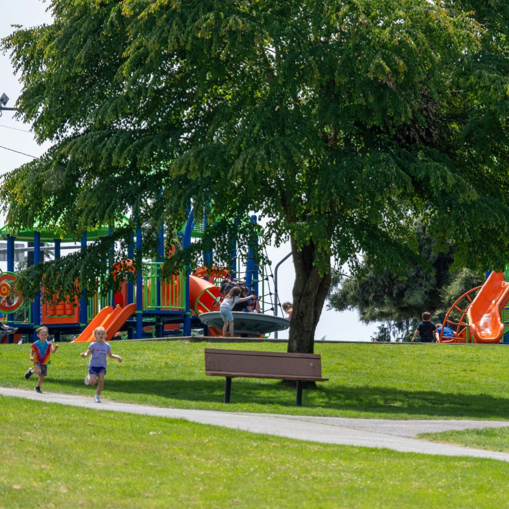
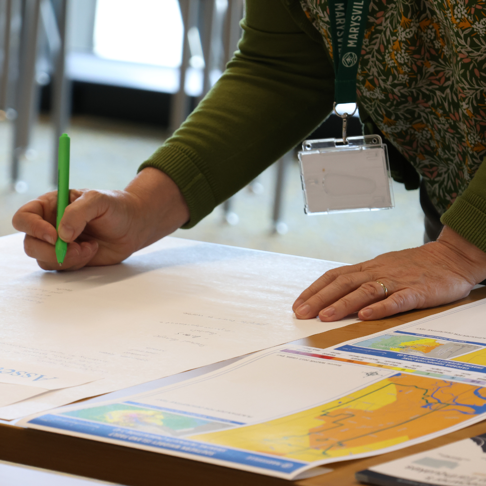
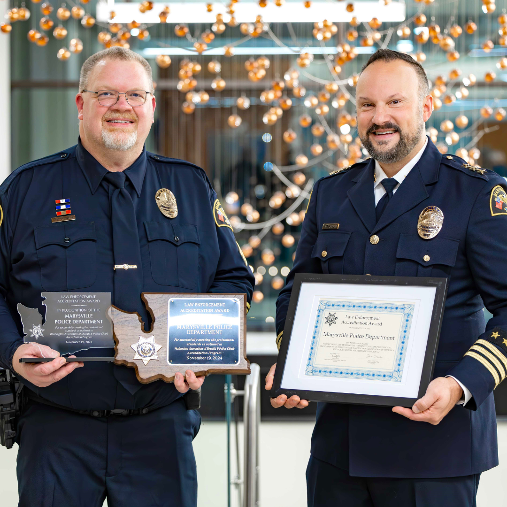
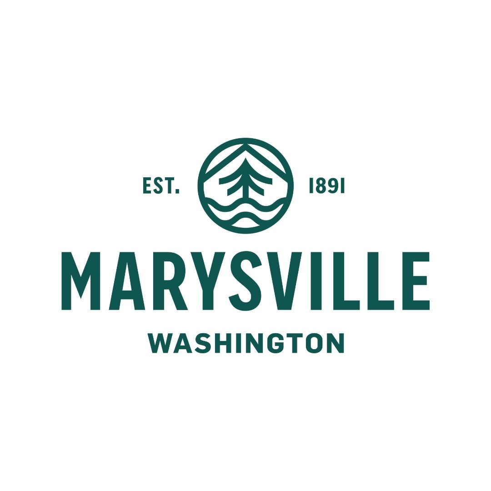
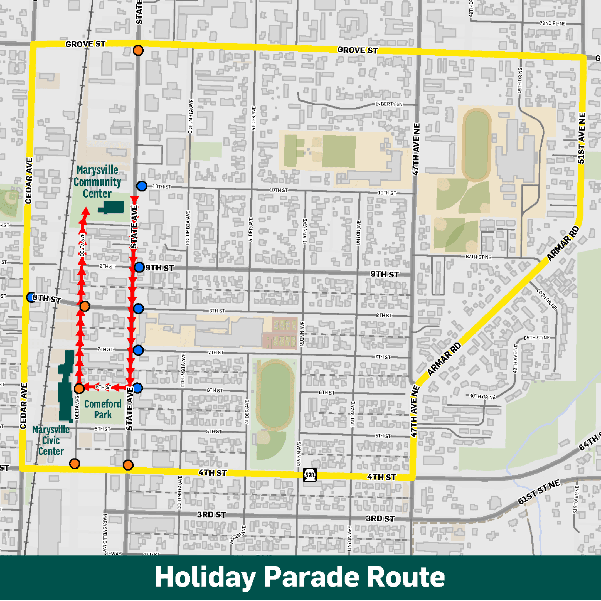
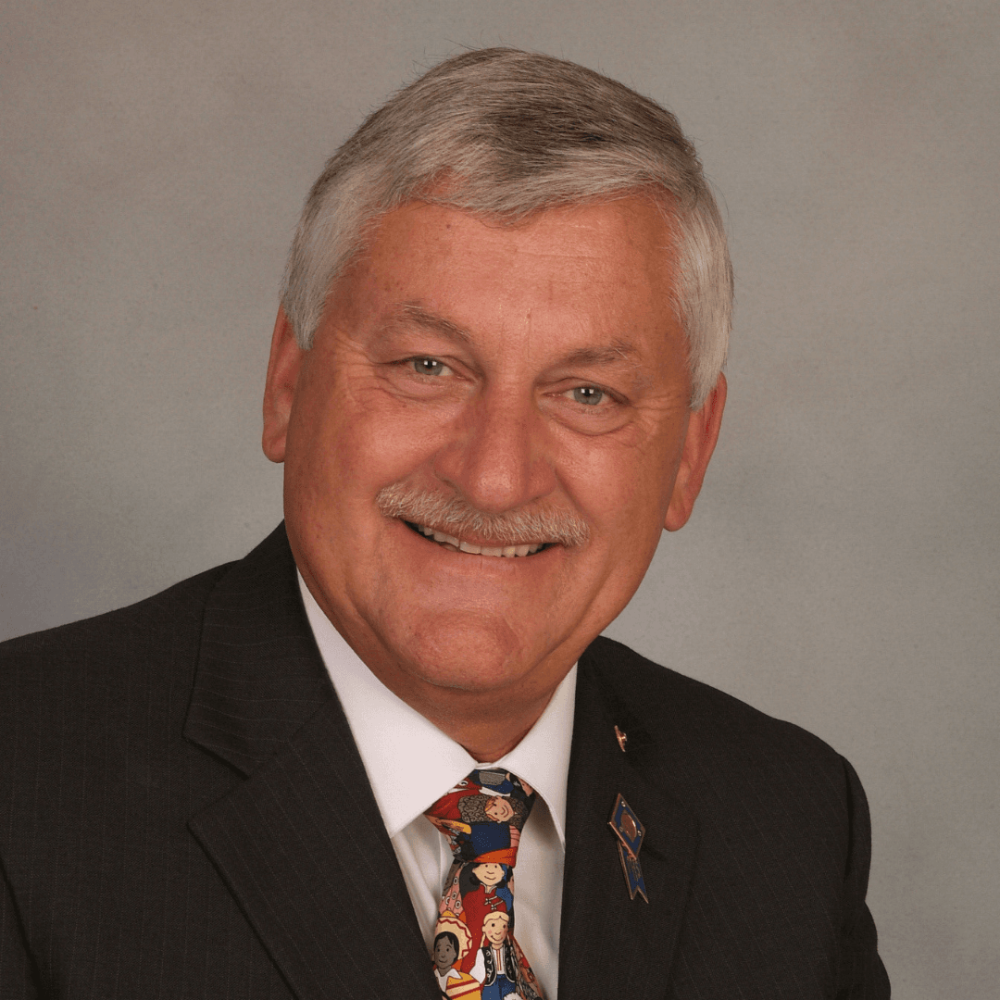
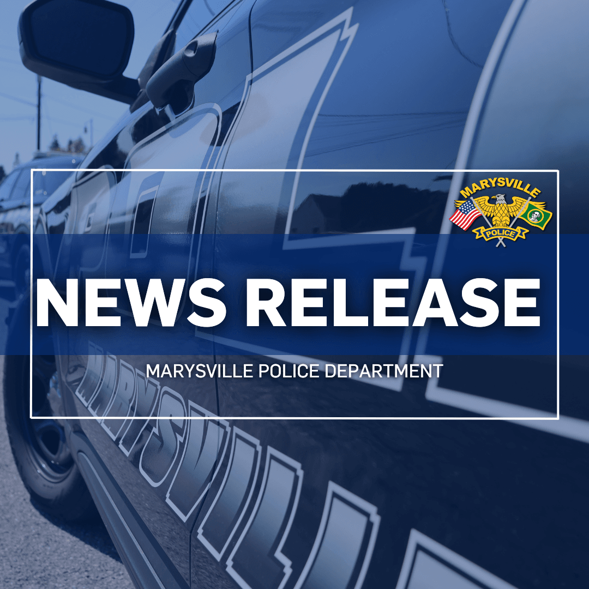
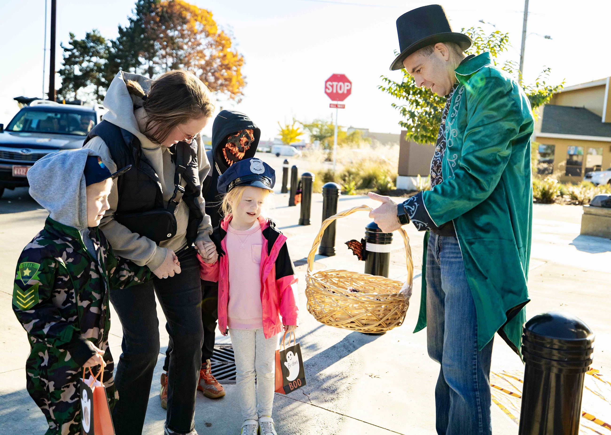
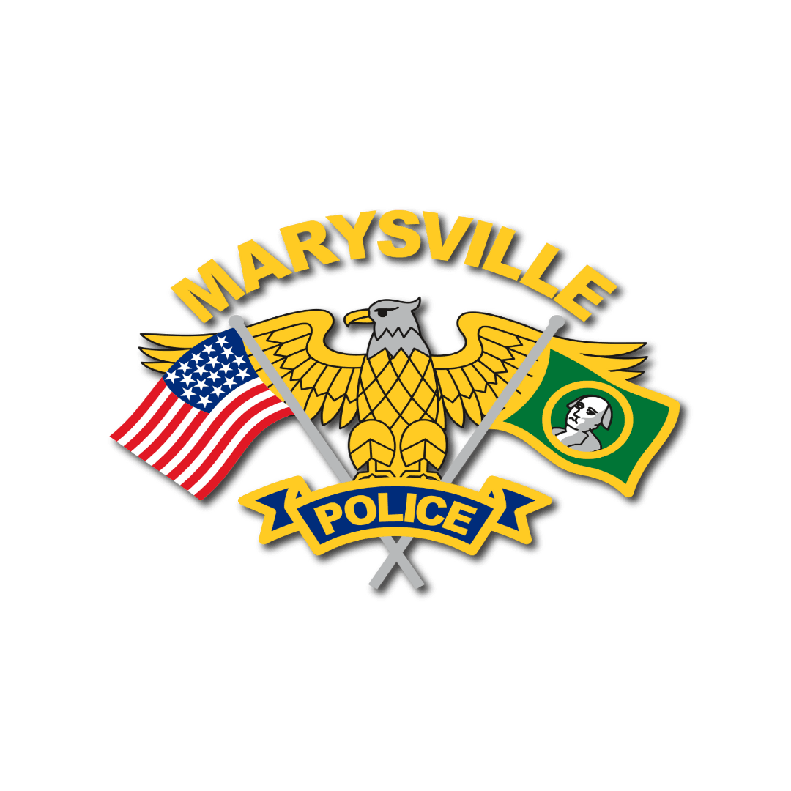

  [Skip to Main Content](https://marysvillewa.gov/CivicAlerts.aspx?AID=1180#contentarea)       Search 

 1.  [I Want To...](https://marysvillewa.gov/70/I-Want-To) 
 1.  [Government](https://marysvillewa.gov/27/Government) 
 1.  [Community](https://marysvillewa.gov/31/Community) 
 1.  [Economic Development](https://marysvillewa.gov/35/Economic-Development) 
 1.  [Visiting](https://marysvillewa.gov/9/Visiting) 

 1.  [Home](https://marysvillewa.gov/) 
 1. News Flash

### Module Search

 Enter Search Terms All categoriesCity news releasesParks and RecreationPolice DepartmentCommunity DevelopmentPublic Notices - Land use

### Tools

 1.  [RSS](https://marysvillewa.gov/rss.aspx#rssCivicAlerts) 
 1.  [Notify Me](https://marysvillewa.gov/civicalerts.aspx?Mode=Subscribe) 
 1. 

### Categories

 1.  [All Categories](https://marysvillewa.gov/CivicAlerts.aspx) 
 1.  [City news releases](https://marysvillewa.gov/CivicAlerts.aspx?CID=1) 
 1.  [Parks and Recreation](https://marysvillewa.gov/CivicAlerts.aspx?CID=6) 
 1.  [Police Department](https://marysvillewa.gov/CivicAlerts.aspx?CID=7) 
 1.  [Community Development](https://marysvillewa.gov/CivicAlerts.aspx?CID=14) 
 1.  [Public Notices - Land use](https://marysvillewa.gov/CivicAlerts.aspx?CID=15) 

# News Flash

## City news releases

 Posted on: January 2, 2025 

### You're invited: Mayor’s State of the City address Jan. 28

    

Mayor Jon Nehring invites you to join him for his State of the City presentation on Tuesday, Jan. 28. He will describe the City of Marysville’s major accomplishments in 2024 and offer a preview of what's ahead in 2025 and beyond. The free program will wrap up with the opportunity for the public to ask questions. 

 * Tuesday, Jan. 28
 * Doors open at 6 p.m.; program starts at 6:30
 * Marysville Civic Center, 501 Delta Ave. (2nd Floor, Council Chambers) and livestream on city Facebook page @MarysvilleWashington

“Marysville is in a solid position to continue serving our residents well with the city services they expect and deserve,” Mayor Nehring said. “I appreciate the shared fiscal values and positive working relationship with our City Council that allow the City of Marysville to continue making progress on long-term priority programs without facing drastic budget cuts or raising taxes.” 

The recorded presentation will be available in February on the city website ( [www.marysvillewa.gov](https://www.marysvillewa.gov) ) and on Marysville public access TV channels, Comcast channel 21 and Ziply channel 25.

         [⇐PreviousMemories await you at Father-Daughter Valentine’s Dance](https://marysvillewa.gov/CivicAlerts.aspx?AID=1186)  [Next⇒MPD achieves professional excellence with state accreditation](https://marysvillewa.gov/CivicAlerts.aspx?AID=1169)  

## Other News in City news releases

    

###  [Mayor Nehring invites you: Coffee Klatch March 24](https://marysvillewa.gov/CivicAlerts.aspx?AID=1191) 

 Posted on: February 11, 2025 | Last Modified on: February 11, 2025    

###  [Spring cleaning? City events can help](https://marysvillewa.gov/CivicAlerts.aspx?AID=1203) 

 Posted on: March 20, 2025    

###  [Nominations open for Marysville Business Awards](https://marysvillewa.gov/CivicAlerts.aspx?AID=1196) 

 Posted on: February 26, 2025   

###  [Help shape future of Marysville parks, programs](https://marysvillewa.gov/CivicAlerts.aspx?AID=1201) 

 Posted on: March 18, 2025    

###  [You can help protect Marysville from disasters](https://marysvillewa.gov/CivicAlerts.aspx?AID=1198) 

 Posted on: March 4, 2025    

###  [Come review plans for Mother Nature’s Window Park](https://marysvillewa.gov/CivicAlerts.aspx?AID=1199) 

 Posted on: March 6, 2025    

###  [New My Marysville mobile app! Engage with city on the go](https://marysvillewa.gov/CivicAlerts.aspx?AID=1187) 

 Posted on: January 29, 2025 | Last Modified on: February 26, 2025    

###  [Opera House, golf course among Best of Snohomish Co](https://marysvillewa.gov/CivicAlerts.aspx?AID=1190) 

 Posted on: February 11, 2025   

###  [Grab Your Girlfriends for the Treat Your Self Women’s Expo](https://marysvillewa.gov/CivicAlerts.aspx?AID=1195) 

 Posted on: February 19, 2025 | Last Modified on: February 20, 2025    

###  [Memories await you at Father-Daughter Valentine’s Dance](https://marysvillewa.gov/CivicAlerts.aspx?AID=1186) 

 Posted on: January 24, 2025   

###  [MPD achieves professional excellence with state accreditation](https://marysvillewa.gov/CivicAlerts.aspx?AID=1169) 

 Posted on: November 26, 2024   

###  [Apply now to serve on city Planning Commission](https://marysvillewa.gov/CivicAlerts.aspx?AID=1182) 

 Posted on: January 6, 2025   

###  [City adopts $450 million biennial budget for 2025-2026](https://marysvillewa.gov/CivicAlerts.aspx?AID=1170) 

 Posted on: December 3, 2024    

###  [Free post-holiday recycling & tree-cycling Jan. 4](https://marysvillewa.gov/CivicAlerts.aspx?AID=1173) 

 Posted on: December 5, 2024    

###  [Make it a Merrysville holiday weekend!](https://marysvillewa.gov/CivicAlerts.aspx?AID=1165) 

 Posted on: November 25, 2024    

###  [State Ave. closure Saturday, Dec. 7, for holiday parade](https://marysvillewa.gov/CivicAlerts.aspx?AID=1166) 

 Posted on: November 25, 2024    

###  [Meet Larry Jubie, holiday parade grand marshal](https://marysvillewa.gov/CivicAlerts.aspx?AID=1168) 

 Posted on: November 26, 2024 | Last Modified on: November 26, 2024    

###  [City strengthens mandatory minimum sentences for repeat offenders](https://marysvillewa.gov/CivicAlerts.aspx?AID=1159) 

 Posted on: November 7, 2024   

###  [Share your input: 2025-26 budget, new Capital Improvements Plan](https://marysvillewa.gov/CivicAlerts.aspx?AID=1146) 

 Posted on: October 11, 2024    

###  [Police increase enforcement amid rise in speed-related crashes](https://marysvillewa.gov/CivicAlerts.aspx?AID=1155) 

 Posted on: November 1, 2024    

###  [Missing child from 2021 located](https://marysvillewa.gov/CivicAlerts.aspx?AID=1148) 

 Posted on: October 23, 2024    

###  [Lockdown lifted following report of threat at Marysville Pilchuck High School](https://marysvillewa.gov/CivicAlerts.aspx?AID=1150) 

 Posted on: October 25, 2024   

###  [Have a monster of a time in Marysville this Halloween Season](https://marysvillewa.gov/CivicAlerts.aspx?AID=1141) 

 Posted on: October 2, 2024   

###  [Hop in the driver's seat at Touch-A-Truck Sept. 14](https://marysvillewa.gov/CivicAlerts.aspx?AID=1126) 

 Posted on: August 12, 2024    

###  [Everett man arrested for attempted kidnapping](https://marysvillewa.gov/CivicAlerts.aspx?AID=1128) 

 Posted on: August 15, 2024    

###  [Body located on Tulalip Reservation](https://marysvillewa.gov/CivicAlerts.aspx?AID=1083) 

 Posted on: April 22, 2024   

###  [Learn about law enforcement at Police Community Academy](https://marysvillewa.gov/CivicAlerts.aspx?AID=1047) 

 Posted on: February 14, 2024 

### Live Edit

   

 1.   [Comments or questions](https://marysvillewa.gov/748/Comments-or-questions)  
 1.   [Emergency information](http://www.marysvillewa.gov/763/Emergencies-and-Inclement-Weather)  
 1.   [Mayor's welcome](https://marysvillewa.gov/342)  
 1.   [Municipal code](http://www.codepublishing.com/wa/marysville/)  
 1.   [Municipal Court](https://marysvillewa.gov/144)  
 1.   [Report abandoned shopping carts](https://www.marysvillewa.gov/FormCenter/Code-violations-8/Code-Violation-reporting-form-Shopping-C-157)  
 1.   [Report graffiti](https://seeclickfix.com/web_portal/Q7ZF315u8rbyzDsTELXyo93T/report/category/55397/location)  
 1.   [Utility billing](https://marysvillewa.gov/340)  
  [Pay Bill](https://marysvillewa.billingdoc.net/login)   [We’re Hiring](https://marysvillewa.gov/137/City-of-Marysville-jobs-and-how-to-apply)   [Garbage & Recycling](https://marysvillewa.gov/172/Solid-Waste-Recycling)   [Parks & Activities](https://marysvillewa.gov/147/Parks-Culture-Recreation)   [Report an Issue](https://marysvillewa.gov/369/Report)   [Subscribe](https://marysvillewa.gov/list.aspx)  

 1.    

     

### Contact Us

 1.    

Marysville City Hall   

 1.    

501 Delta Avenue   

 1.    

Marysville, WA 98270   

 1.    

Phone: [360-363-8000](tel:3603638000)    

 1.    

Fax: [360-651-5033](tel:3606515033)    

 1. 
 1.    

Hours:   

 1.    

Open Monday through Friday   

 1.    

8 a.m. - 4:30 p.m.   

###  [Helpful Links](https://marysvillewa.gov/QuickLinks.aspx?CID=89) 

 1.  [Home](https://marysvillewa.gov/)  
 1.  [Accessibility](https://marysvillewa.gov/accessibility)  
 1.  [ADA accommodation](http://www.marysvillewa.gov/724/ADA-Accommodation)  
 1.  [Contact us](http://marysvillewa.gov/748/CommentsQuestions)  

 1.  [Copyright notices](https://marysvillewa.gov/site/copyright)  
 1.  [Latest news](https://marysvillewa.gov/civicalerts.aspx)  
 1.  [Privacy policy and disclaimer](https://marysvillewa.gov/772/Privacy-Policy-and-Disclaimer)  
 /QuickLinks.aspx 

 1.  [Home](https://marysvillewa.gov/)  

 1.  [Accessibility](https://marysvillewa.gov/accessibility)  

 1.  [ADA accommodation](http://www.marysvillewa.gov/724/ADA-Accommodation)  

 1.  [Contact us](http://marysvillewa.gov/748/CommentsQuestions)  
 /QuickLinks.aspx Government Websites by [CivicPlus®](https://connect.civicplus.com/referral)  Loading Loading Do Not Show AgainClose [] 