  [Skip to Main Content](https://www.redmond.gov/CivicAlerts.aspx?AID=1757#contentarea)   [Info](https://www.redmond.gov/2241)   [Immigration ResourcesClick for more information](https://www.redmond.gov/AlertCenter.aspx?AID=Immigration-Resources-78)     

 1.  [News](https://www.redmond.gov/) 
 1.  [I Want To...](https://www.redmond.gov/9/I-Want-To) 
 1.  [Community](https://www.redmond.gov/101/Community) 
 1.  [Business](https://www.redmond.gov/35/Business) 
 1.  [Government](https://www.redmond.gov/27/Government) 
      

 1.  [Home](https://www.redmond.gov/) 
 1. News Flash

### Module Search

 Enter Search Terms All categoriesHomeParks & RecRedmond Police BlotterEnvironmentNews ReleasesCommunity Resources and Servicescp-testRedmond in the News

### Tools

 1.  [RSS](https://www.redmond.gov/rss.aspx#rssCivicAlerts) 
 1.  [Notify Me®](https://www.redmond.gov/civicalerts.aspx?Mode=Subscribe) 
 1.   [View Archived](https://www.redmond.gov/CivicAlerts.aspx?ARC=L&What=2&CC=2&ItemID=1757&From=AID%3d1757)  

### Categories

 1.  [All Categories](https://www.redmond.gov/CivicAlerts.aspx) 
 1.  [Home](https://www.redmond.gov/CivicAlerts.aspx?CID=1) 
 1.  [Parks & Rec](https://www.redmond.gov/CivicAlerts.aspx?CID=7) 
 1.  [Redmond Police Blotter](https://www.redmond.gov/CivicAlerts.aspx?CID=8) 
 1.  [Environment](https://www.redmond.gov/CivicAlerts.aspx?CID=10) 
 1.  [News Releases](https://www.redmond.gov/CivicAlerts.aspx?CID=11) 
 1.  [Community Resources and Services](https://www.redmond.gov/CivicAlerts.aspx?CID=12) 
 1.  [cp-test](https://www.redmond.gov/CivicAlerts.aspx?CID=13) 
 1.  [Redmond in the News](https://www.redmond.gov/CivicAlerts.aspx?CID=14) 

# News Flash

## News Releases

 Posted on: December 6, 2023 

### Redmond Mayor and City Councilmembers Sworn In

    

 __REDMOND, WA__ – At last night’s Redmond City Council meeting, newly elected Redmond Councilmembers Osman Salahuddin (Council Position No. 1) and Angie Nuevacamina (Council Position No. 7), along with re-elected incumbents Jessica Forsythe (Council Position No. 3), Vanessa Kritzer (Council Position No. 5), and Angela Birney (Mayor) were officially sworn in. Their terms are effective from January 2024 through December 2027.

Birney was re-elected to her second term as Mayor, a position she was first elected to in 2019, after serving on the City Council beginning in 2015, including as Council President from 2018 to 2019. Birney represents Redmond on several regional boards and committees. She grew up in Eastern Washington and moved to Redmond in 1998. Before entering public office, she earned a Master of Education from Heritage University and a Bachelor of Arts in biology education from Eastern Washington University and worked as a middle school science teacher. Birney lives on Education Hill with her husband.

Forsythe is an award-winning Creative Director and owner of a small graphic design studio that works primarily with clients who seek to better their community. Originally from Northeast Ohio, she graduated from Kent State University with a Bachelor of Fine Arts in visual communication design with a concentration in environmental design. Forsythe has worked in environmental design, architecture, and marketing and branding. She is honored to be elected to serve a second term.

Kritzer has been honored to serve on the City Council for the last four years and is looking forward to continuing to provide community-centered leadership in a second term. She has devoted her career to working for social and environmental justice. Kritzer has experience in the nonprofit, government, and private sectors. In addition to her council work, she is currently the Executive Director of the Washington Association of Land Trusts, where she works to protect Washington’s lands, waterways, and wildlife for future generations. Kritzer attended undergrad at Vassar College, earning a Bachelor of Arts in Latin American and Latinx studies and political science, and obtained a Master of Business Administration from the University of Washington Foster School of Business and a Master of Public Administration from the UW Evans School of Public Policy and Governance. Before joining Council, Kritzer served on the City of Redmond’s Planning Commission. She lives in Education Hill with husband and two young kids.

Salahuddin is a lifelong resident of Redmond. After graduating from the Lake Washington School District, he earned a Bachelor of Science in neurobiology with a minor in English from the University of Washington, where he also served as the student body president. His career has included management at a medical device research consulting firm and research at both Fred Hutchinson Cancer Research Center and UW Medicine. He has also volunteered as a member of the Fire Corp with Eastside Fire and Rescue, and helped found the BIPOC Health Careers Ecosystem, a nonprofit. Currently, Salahuddin works as the communications and community engagement manager for King County Councilmember Sarah Perry.

Nuevacamina is a longtime Redmond resident. She is a veteran of the United States Navy, where she served as an aviation electrician and studied philosophy and art history at Oakland University. Nuevacamina's career experience includes working as a financial service professional, consulting small businesses, and previous public service experience serving on the City of Redmond Planning Commission. She lives in Redmond with her family.

For more information about the Redmond City Council, including meeting times, how to participate, Council’s priorities, and how Redmond’s government works, visit [redmond.gov/Council](http://www.redmond.gov/Council).

 __MEDIA CONTACT:__ 

Brant DeLarme, Communications and Marketing Project Administrator  

 [[email protected]](https://www.redmond.gov/cdn-cgi/l/email-protection#412325242d20332c24013324252c2e2f256f262e37) , 425-556-2165

### * * 

         [⇐PreviousRedmond Police Search for More Child Victims in Sex Predator Case](https://www.redmond.gov/CivicAlerts.aspx?AID=1758)  [Next⇒City Accepting Applications for the Library Board of Trustees](https://www.redmond.gov/CivicAlerts.aspx?AID=1750)  

## Other News in News Releases

    

###  [Redmond Announces New Text-to-911 Language Translation Service](https://www.redmond.gov/CivicAlerts.aspx?AID=2450) 

 Posted on: March 20, 2025    

###  [Additional Victims Come Forward in Child Molestation Case](https://www.redmond.gov/CivicAlerts.aspx?AID=2443) 

 Posted on: March 13, 2025 

###  [Redmond Mayor Angela Birney Joins America’s Housing Comeback Advisory Group](https://www.redmond.gov/CivicAlerts.aspx?AID=2442) 

 Posted on: March 13, 2025 

###  [City of Redmond Transitions Teen Programs from Old Fire House](https://www.redmond.gov/CivicAlerts.aspx?AID=2440) 

 Posted on: March 11, 2025 

###  [Eastside Climate Partnership Launches Solarize Eastside](https://www.redmond.gov/CivicAlerts.aspx?AID=2434) 

 Posted on: March 6, 2025 | Last Modified on: March 5, 2025 

###  [Mark Your Calendars: Redmond’s Derby Days is Back This July](https://www.redmond.gov/CivicAlerts.aspx?AID=2433) 

 Posted on: March 6, 2025 | Last Modified on: March 6, 2025    

###  [City Councilmember Melissa Stuart Appointed to Serve on a National League of Cities Committee](https://www.redmond.gov/CivicAlerts.aspx?AID=2398) 

 Posted on: February 5, 2025 

###  [City Seeks Volunteer Arts and Culture Commissioner](https://www.redmond.gov/CivicAlerts.aspx?AID=2396) 

 Posted on: February 5, 2025 | Last Modified on: February 5, 2025 

###  [Redmond Celebrates Arrival of First Electric Fire Engine in Washington State](https://www.redmond.gov/CivicAlerts.aspx?AID=2390) 

 Posted on: February 3, 2025 

###  [City Seeks Two Parks, Trails, and Recreation Commissioners](https://www.redmond.gov/CivicAlerts.aspx?AID=2389) 

 Posted on: January 30, 2025 

###  [City of Redmond and Redmond Fire Department Unveil State's First Electric Fire Truck](https://www.redmond.gov/CivicAlerts.aspx?AID=2388) 

 Posted on: January 28, 2025 

###  [Redmond Recognized as a Silver-Level Bicycle Friendly Community by the League of American Bicyclists](https://www.redmond.gov/CivicAlerts.aspx?AID=2382) 

 Posted on: January 28, 2025 

###  [Redmond Fire Department Deploys Crew to Support California Wildfires](https://www.redmond.gov/CivicAlerts.aspx?AID=2366) 

 Posted on: January 9, 2025 | Last Modified on: January 9, 2025  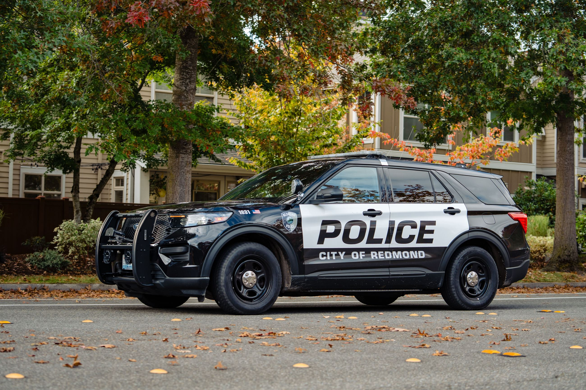  

###  [Redmond Police Department Partners with ForceMetrics to Improve Real-Time Decision-Making](https://www.redmond.gov/CivicAlerts.aspx?AID=2364) 

 Posted on: January 8, 2025 

###  [Human Services Commission Seeks New Members](https://www.redmond.gov/CivicAlerts.aspx?AID=2358) 

 Posted on: January 6, 2025  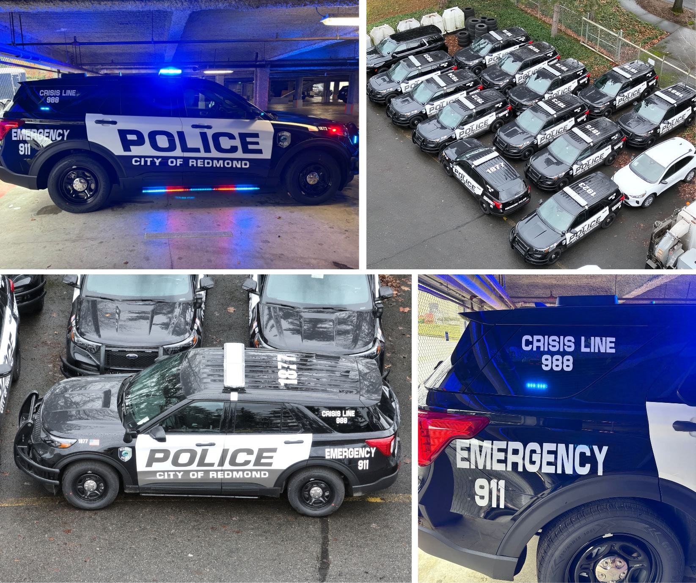  

###  [Redmond Police Patrol Cars Highlight 988 Crisis Lifeline](https://www.redmond.gov/CivicAlerts.aspx?AID=2356) 

 Posted on: January 6, 2025 | Last Modified on: January 6, 2025 

###  [Redmond 2050 Advances Equity and Inclusion](https://www.redmond.gov/CivicAlerts.aspx?AID=2340) 

 Posted on: December 17, 2024 

###  [Redmond Council President Vanessa Kritzer Elected Chair of WRIA 8 Salmon Recovery Council](https://www.redmond.gov/CivicAlerts.aspx?AID=2339) 

 Posted on: December 16, 2024  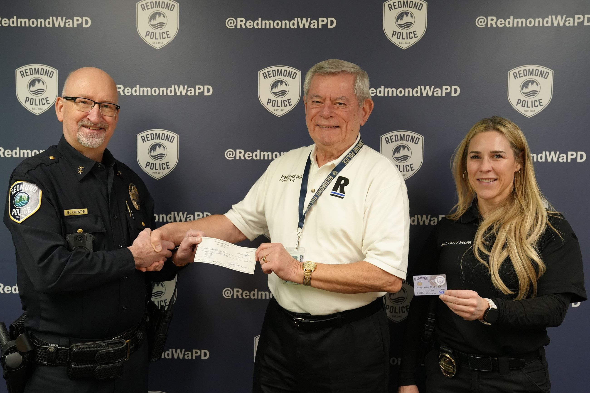  

###  [Redmond Police Department Joins Program to Help Those in Need](https://www.redmond.gov/CivicAlerts.aspx?AID=2337) 

 Posted on: December 16, 2024    

###  [Northshore School District Teacher Arrested for Attempted Child Rape](https://www.redmond.gov/CivicAlerts.aspx?AID=2330) 

 Posted on: December 11, 2024    

###  [Redmond Police Chief Named to Attorney General-Elect Brown’s Transition Committee](https://www.redmond.gov/CivicAlerts.aspx?AID=2328) 

 Posted on: December 10, 2024  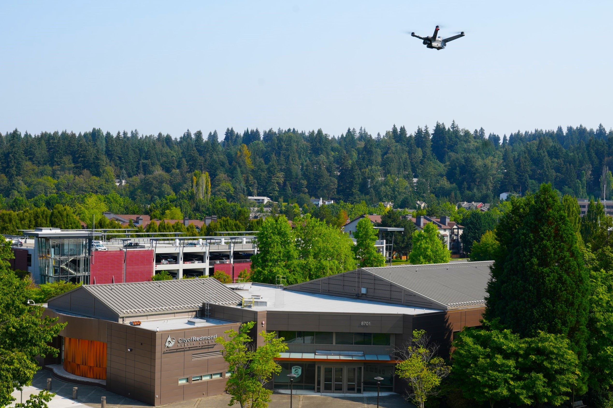  

###  [Redmond Police Department Expands Drone Program with BRINC and Skydio for Enhanced Public Safety](https://www.redmond.gov/CivicAlerts.aspx?AID=2316) 

 Posted on: December 4, 2024    

###  [Two Men Arrested for Burglary of Redmond Home](https://www.redmond.gov/CivicAlerts.aspx?AID=2295) 

 Posted on: November 27, 2024 

###  [Redmond Names Snowplows](https://www.redmond.gov/CivicAlerts.aspx?AID=2294) 

 Posted on: December 2, 2024  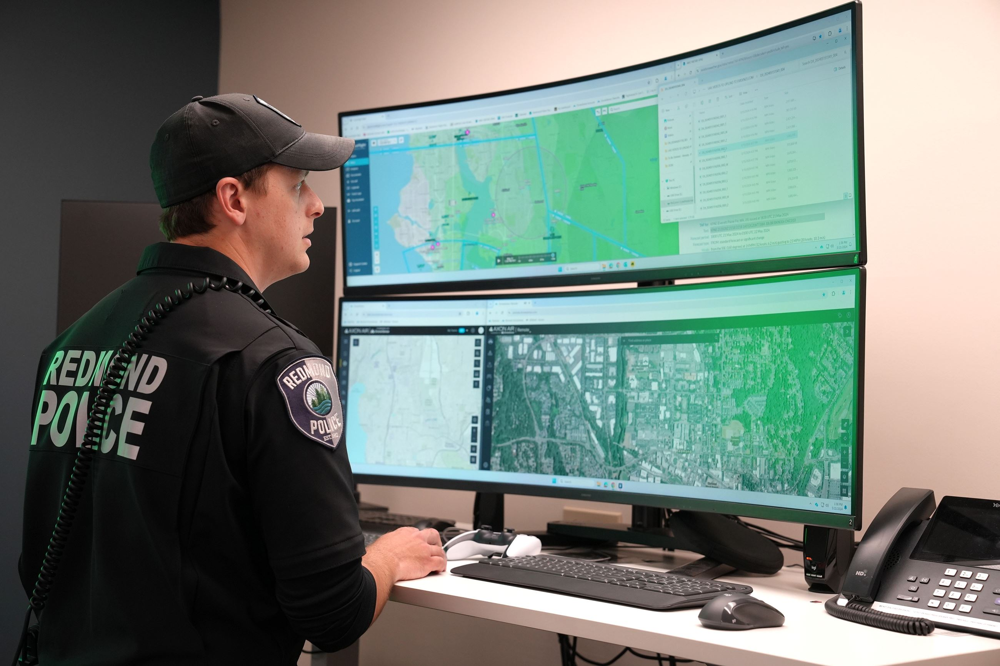  

###  [Redmond First in State to Receive FAA Approval for Drones without Visual Observers](https://www.redmond.gov/CivicAlerts.aspx?AID=2291) 

 Posted on: November 25, 2024 

###  [Redmond Mayor Issues Proclamation of Local Emergency](https://www.redmond.gov/CivicAlerts.aspx?AID=2276) 

 Posted on: November 20, 2024 

###  [Redmond City Council Adopts 2025 – 2026 Budget](https://www.redmond.gov/CivicAlerts.aspx?AID=2275) 

 Posted on: November 20, 2024 

###  [Redmond City Council Adopts Redmond 2050](https://www.redmond.gov/CivicAlerts.aspx?AID=2274) 

 Posted on: November 20, 2024 

###  [Shop Small in Redmond and Win Prizes](https://www.redmond.gov/CivicAlerts.aspx?AID=2262) 

 Posted on: November 18, 2024 

###  [Redmond Firefighters Return from Hurricane Deployment](https://www.redmond.gov/CivicAlerts.aspx?AID=2255) 

 Posted on: November 12, 2024 

###  [Redmond Lights Returns to Downtown Park](https://www.redmond.gov/CivicAlerts.aspx?AID=2240) 

 Posted on: October 23, 2024 

###  [Redmond City Council Adopts Resolution Opposing Washington Initiative 2066](https://www.redmond.gov/CivicAlerts.aspx?AID=2232) 

 Posted on: October 16, 2024  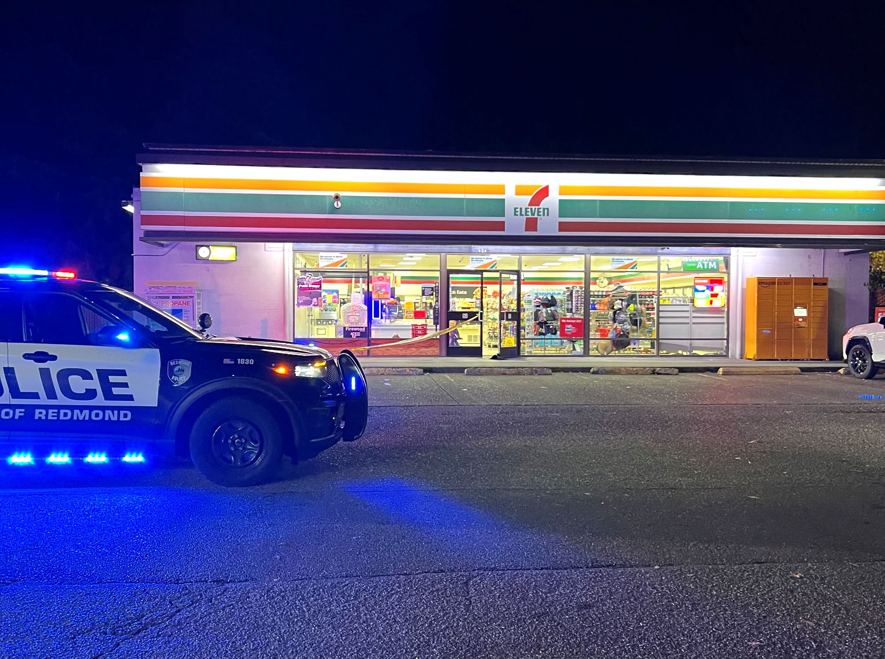  

###  [Armed Robbery at Redmond 7-Eleven Leads to Pursuit; Suspects Still at Large](https://www.redmond.gov/CivicAlerts.aspx?AID=2220) 

 Posted on: October 8, 2024    

###  [Redmond Police Join Forces with Pink Patch Project to Support Breast Cancer Awareness](https://www.redmond.gov/CivicAlerts.aspx?AID=2211) 

 Posted on: October 7, 2024 

###  [Redmond Mayor Angela Birney Introduces Preliminary 2025 – 2026 Budget](https://www.redmond.gov/CivicAlerts.aspx?AID=2210) 

 Posted on: October 2, 2024  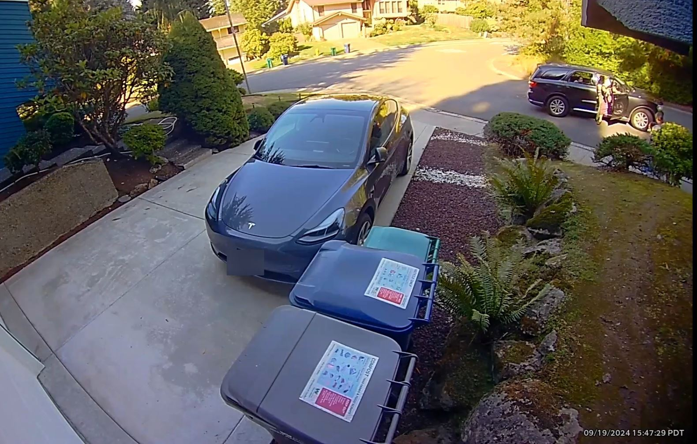  

###  [Redmond Police Warn Public About Organized Crime Group Targeting Asian Community](https://www.redmond.gov/CivicAlerts.aspx?AID=2194) 

 Posted on: September 20, 2024 

###  [Redmond City Council Approves New Projects for Community Facilities District](https://www.redmond.gov/CivicAlerts.aspx?AID=2193) 

 Posted on: September 18, 2024    

###  [Redmond Police Seeks Assistance in Identifying Fatal Hit-and-Run Victim](https://www.redmond.gov/CivicAlerts.aspx?AID=2191) 

 Posted on: September 18, 2024    

###  [YMCA Counselor Arrested for Inappropriate Contact with Children](https://www.redmond.gov/CivicAlerts.aspx?AID=2181) 

 Posted on: September 13, 2024  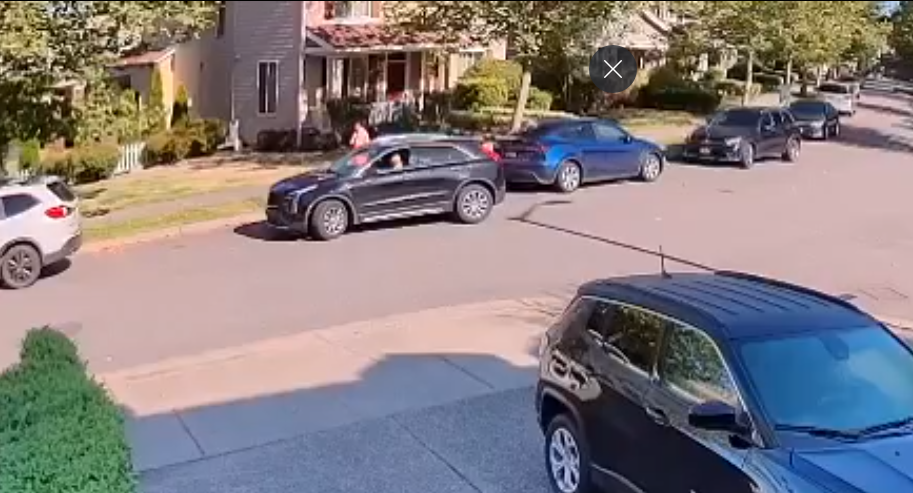  

###  [Police Warn Public about Organized Crime Group Targeting Asian Community](https://www.redmond.gov/CivicAlerts.aspx?AID=2165) 

 Posted on: September 6, 2024 

###  [Redmond City Council Adopts Resolution Opposing Initiative 2117 to Repeal the Climate Commitment Act](https://www.redmond.gov/CivicAlerts.aspx?AID=2164) 

 Posted on: September 4, 2024 

###  [City of Redmond Joins Nearly 350 U.S. Mayors on New Commitment to Electrify Municipal Fleets](https://www.redmond.gov/CivicAlerts.aspx?AID=2145) 

 Posted on: August 13, 2024 

###  [Ching-In Chen Receives Academy of American Poets Laureate Fellowship](https://www.redmond.gov/CivicAlerts.aspx?AID=2134) 

 Posted on: August 8, 2024 

###  [Downtown Redmond Art Walk Returns to Downtown Park](https://www.redmond.gov/CivicAlerts.aspx?AID=2103) 

 Posted on: August 7, 2024  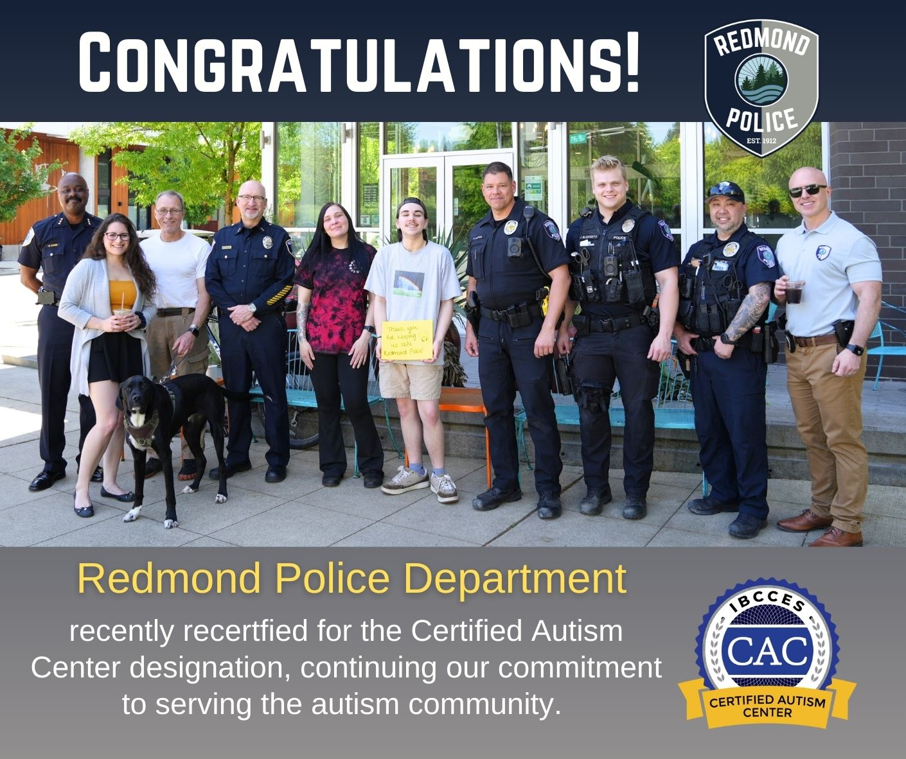  

###  [Redmond Police Department Renews Certified Autism Center™ Designation, Enhancing Inclusivity](https://www.redmond.gov/CivicAlerts.aspx?AID=2101) 

 Posted on: July 22, 2024 | Last Modified on: July 22, 2024 

###  [Apply for 2025 Tourism Grant Funding](https://www.redmond.gov/CivicAlerts.aspx?AID=2093) 

 Posted on: August 1, 2024 | Last Modified on: August 1, 2024 

###  [City Seeks a Youth Advocate for the Parks, Trails, and Recreation Commission](https://www.redmond.gov/CivicAlerts.aspx?AID=2094) 

 Posted on: July 22, 2024    

###  [Redmond Police Seek Public's Help Identifying Shoplift and Assault Suspects](https://www.redmond.gov/CivicAlerts.aspx?AID=2091) 

 Posted on: July 17, 2024  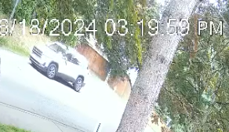  

###  [Redmond Police Searching for Suspects in Recent Robberies Targeting Older Adults](https://www.redmond.gov/CivicAlerts.aspx?AID=2084) 

 Posted on: July 12, 2024 

###  [City Seeks Volunteer to Help Shape and Support Public Safety](https://www.redmond.gov/CivicAlerts.aspx?AID=2083) 

 Posted on: July 9, 2024    

###  [Redmond Police Launches Program to Enhance Safety for Individuals with Cognitive Disabilities](https://www.redmond.gov/CivicAlerts.aspx?AID=2052) 

 Posted on: June 18, 2024 

###  [City Seeks Volunteer Civil Service Commissioner](https://www.redmond.gov/CivicAlerts.aspx?AID=2034) 

 Posted on: June 7, 2024  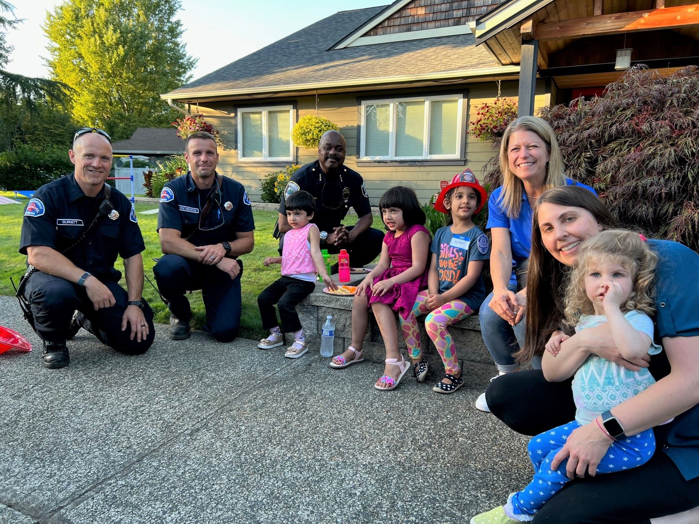  

###  [National Night Out Returns to Redmond on August 6](https://www.redmond.gov/CivicAlerts.aspx?AID=2031) 

 Posted on: June 3, 2024    

###  [Redmond High School Counselor Arrested for Having Inappropriate Relationship with a Student](https://www.redmond.gov/CivicAlerts.aspx?AID=2028) 

 Posted on: May 31, 2024 

###  [Redmond Seeks Volunteer Salary Commissioners](https://www.redmond.gov/CivicAlerts.aspx?AID=2026) 

 Posted on: May 30, 2024  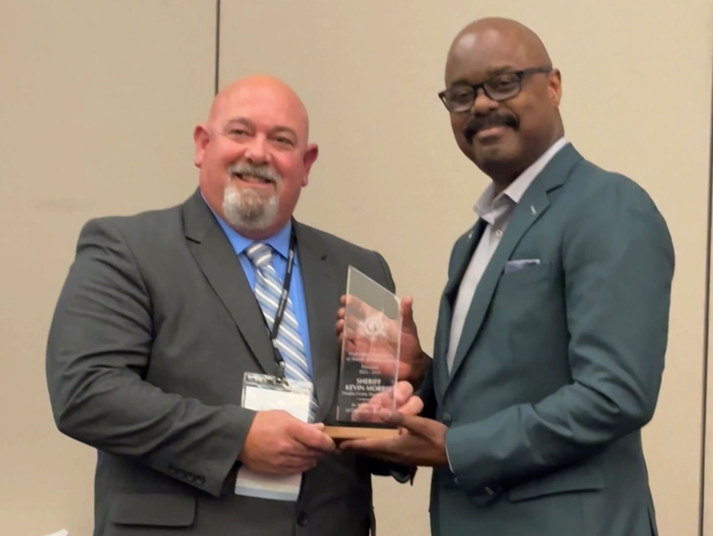  

###  [Redmond Police Chief Darrell Lowe Named President of Statewide Law Enforcement Organization](https://www.redmond.gov/CivicAlerts.aspx?AID=2024) 

 Posted on: May 29, 2024  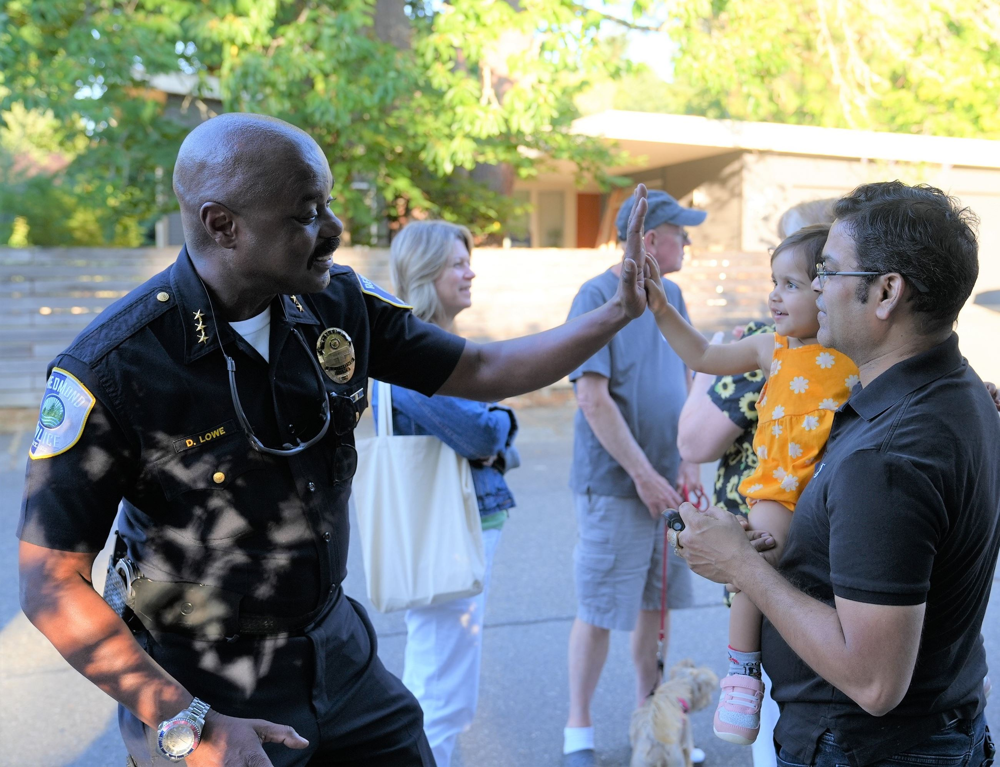  

###  [National Night Out Returns to Redmond on August 6](https://www.redmond.gov/CivicAlerts.aspx?AID=2020) 

 Posted on: June 3, 2024 | Last Modified on: May 30, 2024 

###  [Redmond Downtown Park Receives Award of Excellence](https://www.redmond.gov/CivicAlerts.aspx?AID=2016) 

 Posted on: May 28, 2024 

###  [City of Redmond Earns Housing Development Consortium’s Community Champions Award](https://www.redmond.gov/CivicAlerts.aspx?AID=2007) 

 Posted on: May 15, 2024 

###  [City of Redmond Demonstrates Leadership and Commitment to Environmental Stewardship](https://www.redmond.gov/CivicAlerts.aspx?AID=1990) 

 Posted on: May 8, 2024 

###  [Explore the Overlake Neighborhood with Redmond’s New Overlake Passport Challenge](https://www.redmond.gov/CivicAlerts.aspx?AID=1949) 

 Posted on: April 29, 2024 

###  [Lodging Tax Advisory Commission Seeks New Hotel Members](https://www.redmond.gov/CivicAlerts.aspx?AID=1947) 

 Posted on: April 23, 2024 

###  [New Redmond Technology Station Bridge Opens](https://www.redmond.gov/CivicAlerts.aspx?AID=1946) 

 Posted on: April 22, 2024 

###  [Eastside Cities Take Important Step Toward Coordinated Climate Action](https://www.redmond.gov/CivicAlerts.aspx?AID=1935) 

 Posted on: April 11, 2024 

###  [Pop-Up Dog Parks to Return to Redmond](https://www.redmond.gov/CivicAlerts.aspx?AID=1932) 

 Posted on: April 4, 2024 

###  [New Redmond Senior & Community Center Earns LEED Recognition](https://www.redmond.gov/CivicAlerts.aspx?AID=1915) 

 Posted on: March 27, 2024 

###  [Apply for Redmond’s Derby Days Do-Gooder Scholarship](https://www.redmond.gov/CivicAlerts.aspx?AID=1914) 

 Posted on: April 1, 2024 

###  [New Redmond Senior & Community Center Set to Host Grand Opening Celebrations](https://www.redmond.gov/CivicAlerts.aspx?AID=1913) 

 Posted on: March 28, 2024 

###  [Redmond Gears Up For its Annual Derby Days](https://www.redmond.gov/CivicAlerts.aspx?AID=1905) 

 Posted on: March 14, 2024  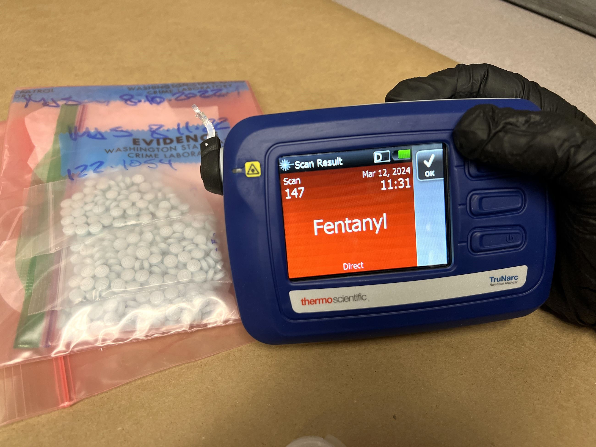  

###  [Redmond Police Department Implements New Tool to Identify Drugs](https://www.redmond.gov/CivicAlerts.aspx?AID=1884) 

 Posted on: March 12, 2024 

###  [Redmond Looks to Take on Supportive Housing Project](https://www.redmond.gov/CivicAlerts.aspx?AID=1857) 

 Posted on: February 14, 2024 

###  [Volunteer Opportunity: Redmond Arts and Culture Commissioner](https://www.redmond.gov/CivicAlerts.aspx?AID=1856) 

 Posted on: February 13, 2024    

###  [Redmond Police Investigating Alleged Threats Toward Rose Hill Middle School](https://www.redmond.gov/CivicAlerts.aspx?AID=1826) 

 Posted on: January 28, 2024 | Last Modified on: January 28, 2024 

###  [City of Redmond and Sound Transit Celebrate Opening of Overlake Village Pedestrian Bridge](https://www.redmond.gov/CivicAlerts.aspx?AID=1825) 

 Posted on: January 25, 2024    

###  [Redmond Police Searching for Additional Victims of Renton Man Charged with Rape](https://www.redmond.gov/CivicAlerts.aspx?AID=1818) 

 Posted on: January 18, 2024 

###  [City Seeks Volunteer Civil Service Commissioner](https://www.redmond.gov/CivicAlerts.aspx?AID=1808) 

 Posted on: January 16, 2024 

###  [City Seeks Volunteer Arts and Culture Commissioner](https://www.redmond.gov/CivicAlerts.aspx?AID=1791) 

 Posted on: January 8, 2024    

###  [Redmond Police Arrest Man Tied to Multiple Residential Burglaries](https://www.redmond.gov/CivicAlerts.aspx?AID=1802) 

 Posted on: January 5, 2024 

###  [Redmond Appoints Ching-In Chen as New Poet Laureate](https://www.redmond.gov/CivicAlerts.aspx?AID=1790) 

 Posted on: January 4, 2024    

###  [Teen Arrested in Fatal Hit-and-Run in Redmond](https://www.redmond.gov/CivicAlerts.aspx?AID=1786) 

 Posted on: December 21, 2023    

###  [2018 Redmond, Washington Officer Involved Shooting Inquest Findings Released](https://www.redmond.gov/CivicAlerts.aspx?AID=1772) 

 Posted on: December 13, 2023  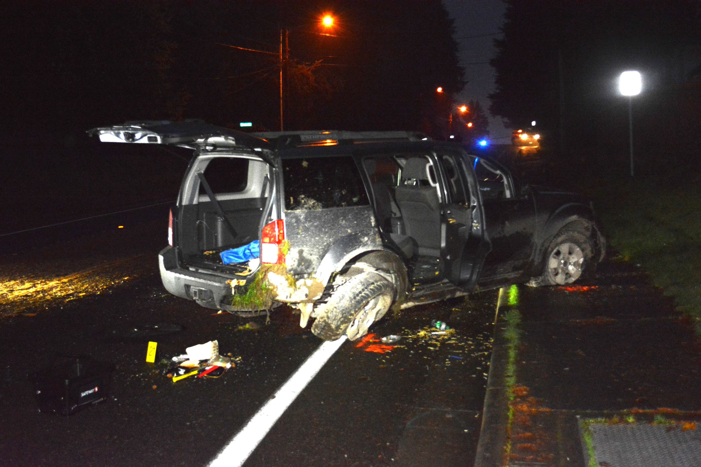  

###  [Redmond Police Seek Public’s Help Locating Fatal Hit-and-Run Driver](https://www.redmond.gov/CivicAlerts.aspx?AID=1788) 

 Posted on: December 7, 2023  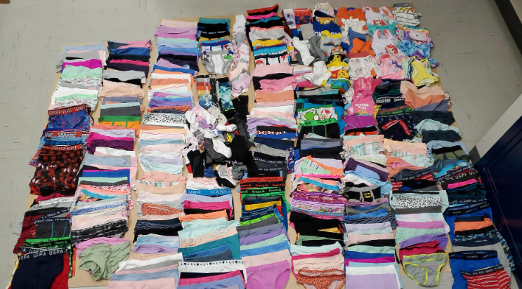  

###  [Redmond Police Search for More Child Victims in Sex Predator Case](https://www.redmond.gov/CivicAlerts.aspx?AID=1758) 

 Posted on: December 5, 2023 

###  [City Accepting Applications for the Library Board of Trustees](https://www.redmond.gov/CivicAlerts.aspx?AID=1750) 

 Posted on: November 30, 2023 

###  [Incentives Program Launches to Help Eastside ‘Make the Switch’ to Heat Pumps](https://www.redmond.gov/CivicAlerts.aspx?AID=1749) 

 Posted on: November 30, 2023 

###  [Redmond Seeks New Planning Commission Members](https://www.redmond.gov/CivicAlerts.aspx?AID=1741) 

 Posted on: November 29, 2023 

###  [Human Services Commission Seeks New Member](https://www.redmond.gov/CivicAlerts.aspx?AID=1728) 

 Posted on: November 6, 2023 

###  [Redmond Lights Returns to Downtown Park](https://www.redmond.gov/CivicAlerts.aspx?AID=1723) 

 Posted on: November 2, 2023  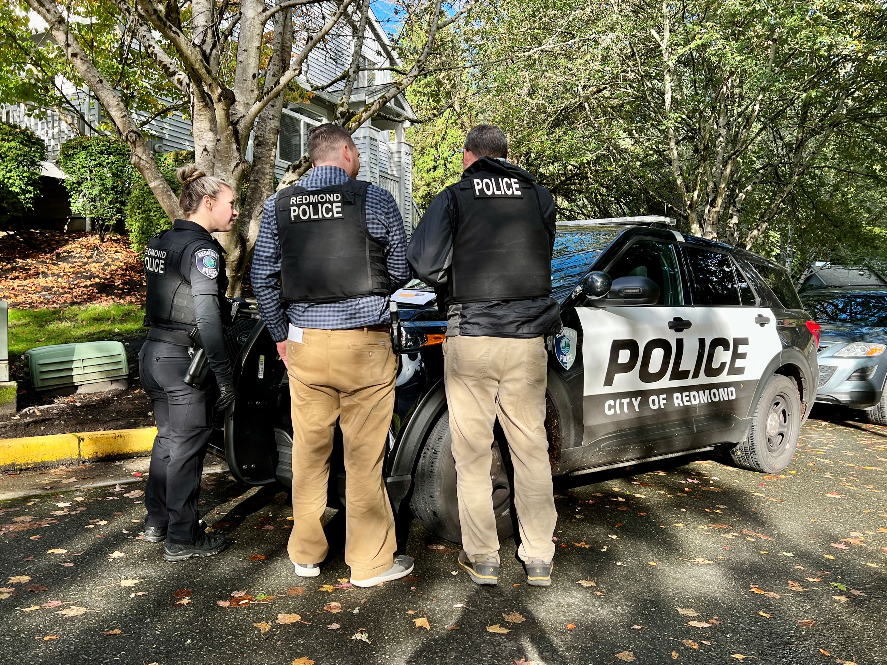  

###  [Domestic Violence Suspects Arrested in Redmond During Annual Sweep](https://www.redmond.gov/CivicAlerts.aspx?AID=1726) 

 Posted on: November 1, 2023 

###  [Esterra Park Opens in Overlake Neighborhood](https://www.redmond.gov/CivicAlerts.aspx?AID=1710) 

 Posted on: October 25, 2023    

###  [Redmond Police Seek Information About Recent Home Burglaries](https://www.redmond.gov/CivicAlerts.aspx?AID=1708) 

 Posted on: October 20, 2023 

###  [Redmond to Launch a Small Business Resiliency Grant Program](https://www.redmond.gov/CivicAlerts.aspx?AID=1688) 

 Posted on: October 12, 2023 

###  [Affordable Housing Committee Recognizes Redmond’s Housing Element](https://www.redmond.gov/CivicAlerts.aspx?AID=1686) 

 Posted on: October 4, 2023    

###  [Redmond Police Join Forces with Pink Patch Project to Support Breast Cancer Awareness](https://www.redmond.gov/CivicAlerts.aspx?AID=1684) 

 Posted on: October 3, 2023    

###  [Redmond Police Arrest 30-Year-Old Man in Operation Targeting Online Child Predators](https://www.redmond.gov/CivicAlerts.aspx?AID=1659) 

 Posted on: September 15, 2023 

###  [City Seeks Feedback on Fee Studies](https://www.redmond.gov/CivicAlerts.aspx?AID=1656) 

 Posted on: September 11, 2023 

###  [City Debuts New Asphalt Artwork in Downtown Redmond](https://www.redmond.gov/CivicAlerts.aspx?AID=1642) 

 Posted on: September 5, 2023  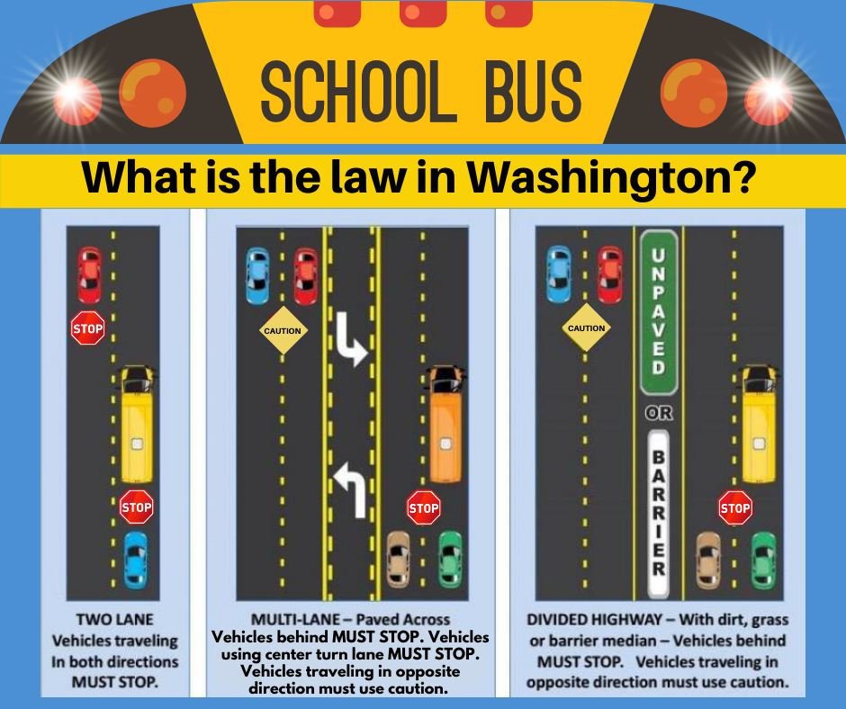  

###  [Redmond Police Remind Everyone to Follow Important School Zone Safety Tips](https://www.redmond.gov/CivicAlerts.aspx?AID=1636) 

 Posted on: August 30, 2023 

###  [City Seeks Applicants for Parks, Trails, and Recreation Commissioners and Youth Advocates](https://www.redmond.gov/CivicAlerts.aspx?AID=1613) 

 Posted on: August 10, 2023 

###  [Redmond Receives Grant from National League of Cities to Support Small Businesses and Entrepreneurs](https://www.redmond.gov/CivicAlerts.aspx?AID=1612) 

 Posted on: August 9, 2023    

###  [Message from Chief of Police Darrell Lowe](https://www.redmond.gov/CivicAlerts.aspx?AID=1606) 

 Posted on: August 7, 2023  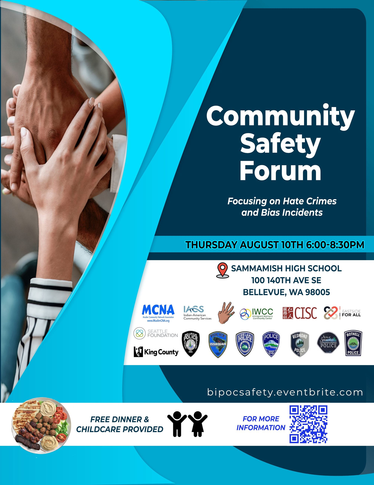  

###  [Area Police Departments Partner with Community Group to Spotlight Hate Crimes and Bias Incidents](https://www.redmond.gov/CivicAlerts.aspx?AID=1598) 

 Posted on: August 3, 2023 

###  [Redmond’s Poet Laureate Receives Academy of American Poets Laureate Fellowship](https://www.redmond.gov/CivicAlerts.aspx?AID=1597) 

 Posted on: August 3, 2023    

###  [Redmond Appoints New Finance Director](https://www.redmond.gov/CivicAlerts.aspx?AID=1589) 

 Posted on: August 3, 2023 

###  [Apply for 2024 Tourism Grant Funding](https://www.redmond.gov/CivicAlerts.aspx?AID=1585) 

 Posted on: July 26, 2023 

###  [Downtown Redmond Art Walk Debuts in the Downtown Corridor](https://www.redmond.gov/CivicAlerts.aspx?AID=1571) 

 Posted on: July 25, 2023  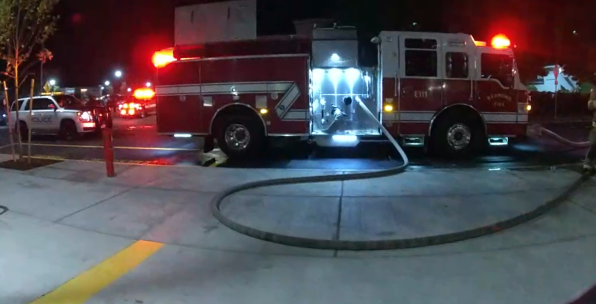  

###  [Woman Charged for Arson at Redmond Apartment Complex](https://www.redmond.gov/CivicAlerts.aspx?AID=1578) 

 Posted on: July 22, 2023  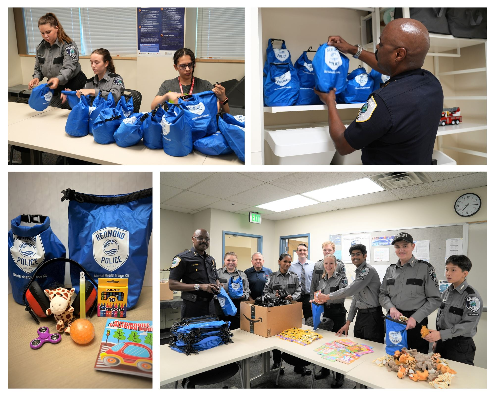  

###  [Mental Health Triage Kits Contain Items to Help Police Comfort Those with Autism and Small Children](https://www.redmond.gov/CivicAlerts.aspx?AID=1574) 

 Posted on: July 19, 2023  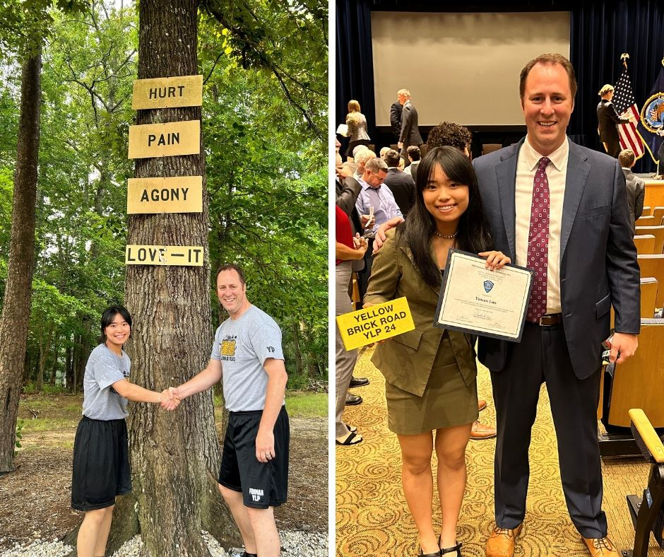  

###  [Redmond High School Student Completes FBI Leadership Program](https://www.redmond.gov/CivicAlerts.aspx?AID=1562) 

 Posted on: July 13, 2023 

###  [Redmond Selected to Participate in National League of Cities Capstone Project](https://www.redmond.gov/CivicAlerts.aspx?AID=1551) 

 Posted on: July 10, 2023 

###  [Redmond Named Most Livable Small City in the United States](https://www.redmond.gov/CivicAlerts.aspx?AID=1539) 

 Posted on: June 29, 2023 

###  [City Seeks Volunteers for the Design Review Board](https://www.redmond.gov/CivicAlerts.aspx?AID=1530) 

 Posted on: June 28, 2023  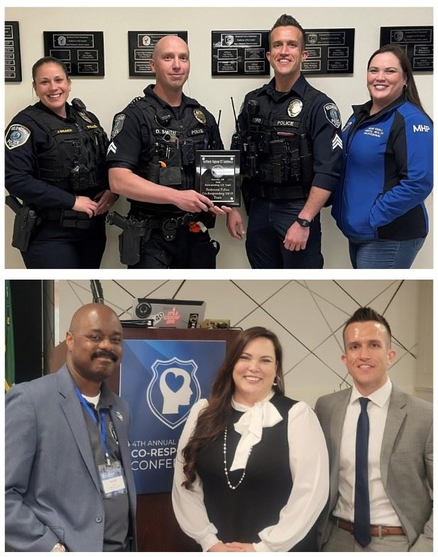  

###  [Redmond Police Department Recognized for Co-Responder Program](https://www.redmond.gov/CivicAlerts.aspx?AID=1518) 

 Posted on: June 16, 2023 

###  [Drone Light Show Returns to Redmond’s Derby Days](https://www.redmond.gov/CivicAlerts.aspx?AID=1515) 

 Posted on: June 21, 2023 

###  [City Selects Pilot Project to Improve Access to Light Rail](https://www.redmond.gov/CivicAlerts.aspx?AID=1492) 

 Posted on: May 31, 2023 

###  [City Seeks New Parks, Trails, and Recreation Commissioner and Youth Advocates](https://www.redmond.gov/CivicAlerts.aspx?AID=1477) 

 Posted on: May 31, 2023 

###  [City Accepting Applications for the Library Board of Trustees](https://www.redmond.gov/CivicAlerts.aspx?AID=1473) 

 Posted on: May 30, 2023 

###  [City Seeks Volunteer Arts and Culture Commissioner](https://www.redmond.gov/CivicAlerts.aspx?AID=1465) 

 Posted on: May 30, 2023 

###  [Redmond Opens First Pop-Up Dog Park](https://www.redmond.gov/CivicAlerts.aspx?AID=1426) 

 Posted on: April 24, 2023    

###  [Awards Ceremony Celebrates Redmond Police Department Staff](https://www.redmond.gov/CivicAlerts.aspx?AID=1422) 

 Posted on: April 20, 2023    

###  [Redmond Police Re-Arrest Local Man on New Child Molestation Charges](https://www.redmond.gov/CivicAlerts.aspx?AID=1410) 

 Posted on: April 17, 2023 

###  [Lodging Tax Advisory Commission Seeks New Hotelier Member](https://www.redmond.gov/CivicAlerts.aspx?AID=1395) 

 Posted on: April 6, 2023 

###  [Redmond Seeks Applicants for Derby Days "Do-Gooder" Scholarship](https://www.redmond.gov/CivicAlerts.aspx?AID=1383) 

 Posted on: March 29, 2023    

###  [Redmond Man Arrested for Attempted Child Rape as Part of Undercover Operation](https://www.redmond.gov/CivicAlerts.aspx?AID=1371) 

 Posted on: March 23, 2023 

###  [Redmond Mayor Working to Identify Housing Solutions](https://www.redmond.gov/CivicAlerts.aspx?AID=1370) 

 Posted on: March 23, 2023    

###  [Redmond Man Arrested for Child Molestation](https://www.redmond.gov/CivicAlerts.aspx?AID=1366) 

 Posted on: March 21, 2023  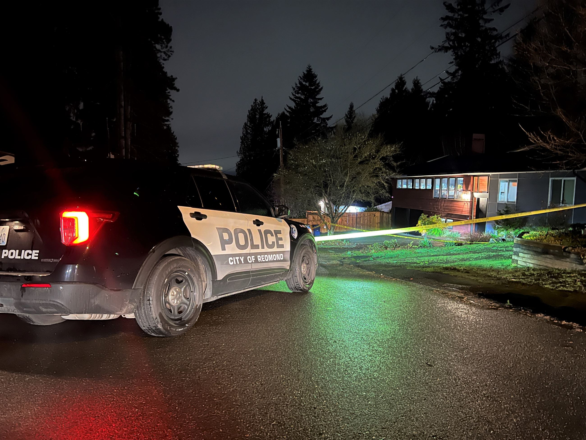  

###  [Three Dead After Shooting in Redmond Home](https://www.redmond.gov/CivicAlerts.aspx?AID=1346) 

 Posted on: March 10, 2023    

###  [Redmond Police to Distribute Steering Wheel Locks to Kia and Hyundai Drivers](https://www.redmond.gov/CivicAlerts.aspx?AID=1339) 

 Posted on: March 7, 2023 

###  [Redmond is Gearing Up for its Annual Derby Days](https://www.redmond.gov/CivicAlerts.aspx?AID=1334) 

 Posted on: March 7, 2023 

###  [Eastside Climate Challenge Extended Into 2023](https://www.redmond.gov/CivicAlerts.aspx?AID=1318) 

 Posted on: February 16, 2023 

###  [City Seeks Volunteers for the Library Board of Trustees](https://www.redmond.gov/CivicAlerts.aspx?AID=1317) 

 Posted on: February 14, 2023 

###  [Redmond Affirms Commitment to Sustainability with the Purchase of an Electric Fire Engine](https://www.redmond.gov/CivicAlerts.aspx?AID=1316) 

 Posted on: February 14, 2023  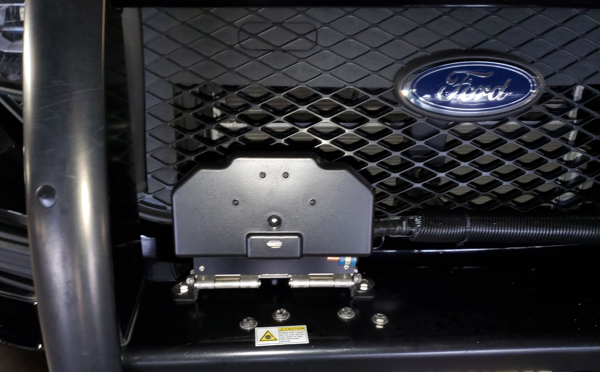  

###  [Redmond Police Department Deploys GPS-based Pursuit Management Technology](https://www.redmond.gov/CivicAlerts.aspx?AID=1298) 

 Posted on: February 3, 2023    

###  [Redmond Police Department Launches Crime Data Dashboards](https://www.redmond.gov/CivicAlerts.aspx?AID=1293) 

 Posted on: February 1, 2023 

###  [City Seeks Volunteer for Landmark Commission](https://www.redmond.gov/CivicAlerts.aspx?AID=1285) 

 Posted on: January 31, 2023 

###  [City Seeks Volunteer Arts and Culture Commissioners](https://www.redmond.gov/CivicAlerts.aspx?AID=1284) 

 Posted on: January 31, 2023 

###  [Redmond Senior & Community Center Celebrates Construction Milestone](https://www.redmond.gov/CivicAlerts.aspx?AID=1281) 

 Posted on: January 25, 2023 

###  [City Seeks New Parks and Trails Commissioner](https://www.redmond.gov/CivicAlerts.aspx?AID=1275) 

 Posted on: January 24, 2023    

###  [Redmond Police Department Kicks Off Community Police Academy](https://www.redmond.gov/CivicAlerts.aspx?AID=1273) 

 Posted on: January 18, 2023 

###  [Human Services Commission Seeks New Member](https://www.redmond.gov/CivicAlerts.aspx?AID=1265) 

 Posted on: January 12, 2023 

###  [Redmond Police Chief Darrell Lowe Elected President of King County Police Chiefs and Sheriffs](https://www.redmond.gov/CivicAlerts.aspx?AID=1246) 

 Posted on: December 28, 2022 

###  [Redmond City Council Adopts 2023 – 2024 Budget](https://www.redmond.gov/CivicAlerts.aspx?AID=1215) 

 Posted on: December 7, 2022 

###  [Volunteers Needed for Redmond Salary Commission](https://www.redmond.gov/CivicAlerts.aspx?AID=1203) 

 Posted on: December 5, 2022    

###  [Redmond Detectives Arrest Suspect in a 2011 Cold Case](https://www.redmond.gov/CivicAlerts.aspx?AID=1177) 

 Posted on: November 17, 2022  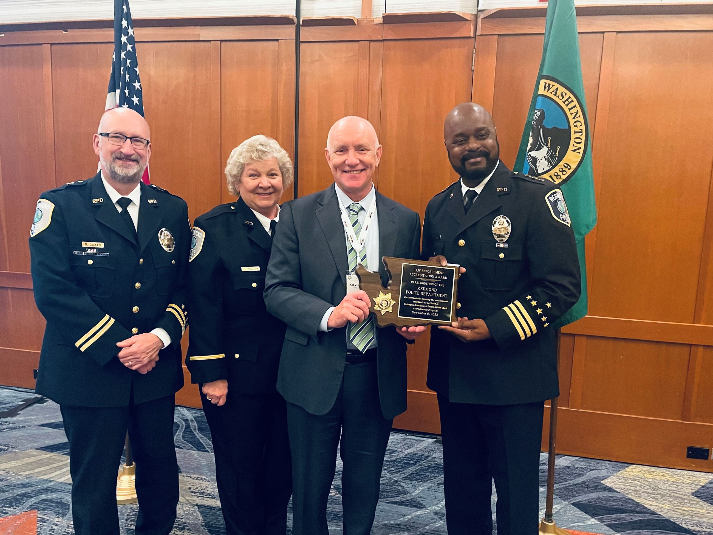  

###  [Redmond Police Department Reaccredited for Highest Professional Standard of Policing](https://www.redmond.gov/CivicAlerts.aspx?AID=1175) 

 Posted on: November 17, 2022 

###  [City Seeks Volunteer Arts and Culture Commissioners](https://www.redmond.gov/CivicAlerts.aspx?AID=1169) 

 Posted on: November 16, 2022 

###  [City of Redmond Celebrates Groundbreaking for Final Phase of Redmond Central Connector](https://www.redmond.gov/CivicAlerts.aspx?AID=1160) 

 Posted on: November 3, 2022 

###  [Redmond Lights Returns to Downtown Park](https://www.redmond.gov/CivicAlerts.aspx?AID=1152) 

 Posted on: November 1, 2022 

###  [Redmond Recognized with Gold Award for Economic Development](https://www.redmond.gov/CivicAlerts.aspx?AID=1144) 

 Posted on: October 24, 2022  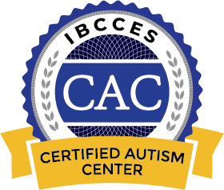  

###  [Redmond Police Department Becomes Washington’s First Autism-Certified Police](https://www.redmond.gov/CivicAlerts.aspx?AID=1137) 

 Posted on: October 13, 2022    

###  [Redmond Police Join Pink Patch Project to Support Breast Cancer Awareness](https://www.redmond.gov/CivicAlerts.aspx?AID=1135) 

 Posted on: October 12, 2022 

###  [Redmond Mayor Angela Birney Introduces Preliminary 2023 – 2024 Budget](https://www.redmond.gov/CivicAlerts.aspx?AID=1119) 

 Posted on: October 5, 2022 

###  [Redmond Celebrates One Year of Adopt-a-Drain](https://www.redmond.gov/CivicAlerts.aspx?AID=1111) 

 Posted on: September 26, 2022 

###  [Redmond Seeks New Planning Commission Member](https://www.redmond.gov/CivicAlerts.aspx?AID=1104) 

 Posted on: September 20, 2022    

###  [Redmond Police Department Deploys Body-Worn and In-Car Camera Systems](https://www.redmond.gov/CivicAlerts.aspx?AID=1102) 

 Posted on: September 15, 2022 

###  [Community Invited to Hear Project Ideas to Enhance Redmond’s Parks and Recreation](https://www.redmond.gov/CivicAlerts.aspx?AID=1100) 

 Posted on: September 26, 2022 

###  [Redmond Celebrates Welcoming Week](https://www.redmond.gov/CivicAlerts.aspx?AID=1078) 

 Posted on: September 7, 2022 

###  [City Council Selects Name for New Community Center](https://www.redmond.gov/CivicAlerts.aspx?AID=1072) 

 Posted on: August 22, 2022 

###  [Apply for Special Event and Tourism Grant Funding](https://www.redmond.gov/CivicAlerts.aspx?AID=1051) 

 Posted on: August 1, 2022 

###  [Redmond City Council Approves Resolution in Support of New Public Safety Levy](https://www.redmond.gov/CivicAlerts.aspx?AID=1041) 

 Posted on: July 21, 2022 

###  [Redmond Hosts Second of Five Public Hearings on City Budget](https://www.redmond.gov/CivicAlerts.aspx?AID=1039) 

 Posted on: July 25, 2022 

###  [Energy Smart Eastside Campaign Brings Savings on Heating and Cooling to Eastside Residents](https://www.redmond.gov/CivicAlerts.aspx?AID=1038) 

 Posted on: July 20, 2022 

###  [Help Plan the Future of Redmond](https://www.redmond.gov/CivicAlerts.aspx?AID=1026) 

 Posted on: July 11, 2022 

###  [Community Invited to Share Feedback on Improving Diversity, Equity, and Inclusion in Redmond](https://www.redmond.gov/CivicAlerts.aspx?AID=1019) 

 Posted on: July 5, 2022 

###  [City Accepting Applications for the Library Board of Trustees](https://www.redmond.gov/CivicAlerts.aspx?AID=1014) 

 Posted on: June 30, 2022 

###  [Register Your Neighborhood for National Night Out](https://www.redmond.gov/CivicAlerts.aspx?AID=1008) 

 Posted on: June 27, 2022    

###  [Man Charged with Murder in 2019 Assault in Redmond](https://www.redmond.gov/CivicAlerts.aspx?AID=998) 

 Posted on: June 21, 2022 

###  [Redmond to Host Four Public Hearings on City Budget](https://www.redmond.gov/CivicAlerts.aspx?AID=995) 

 Posted on: June 21, 2022 

###  [Human Services Commission Seeks New Member](https://www.redmond.gov/CivicAlerts.aspx?AID=994) 

 Posted on: June 16, 2022 

###  [U.S. Conference of Mayors Honors Mayor Angela Birney for Climate Leadership](https://www.redmond.gov/CivicAlerts.aspx?AID=983) 

 Posted on: June 7, 2022 

###  [Letters of Interest Due to Serve on Pro and Con Property Tax Levy Lift Committees](https://www.redmond.gov/CivicAlerts.aspx?AID=975) 

 Posted on: June 1, 2022 

###  [Redmond Community Invited to Attend a Meeting About the Future of Redmond’s Parks and Recreation](https://www.redmond.gov/CivicAlerts.aspx?AID=964) 

 Posted on: May 23, 2022 

###  [City Seeks Community Members for Budget Team - UPDATED: June 16, 2022](https://www.redmond.gov/CivicAlerts.aspx?AID=957) 

 Posted on: May 17, 2022 

###  [Redmond Appoints New Directors of the Parks and Recreation and Public Works Departments](https://www.redmond.gov/CivicAlerts.aspx?AID=956) 

 Posted on: May 18, 2022 

###  [Community Invited to Celebrate Groundbreaking of the New Redmond Senior & Community Center](https://www.redmond.gov/CivicAlerts.aspx?AID=953) 

 Posted on: May 12, 2022    

###  [Message from Chief Lowe on Settlement with Churna Family](https://www.redmond.gov/CivicAlerts.aspx?AID=938) 

 Posted on: April 27, 2022 

###  [Apply Now for the Derby Days Do-Gooder Scholarship](https://www.redmond.gov/CivicAlerts.aspx?AID=927) 

 Posted on: April 20, 2022  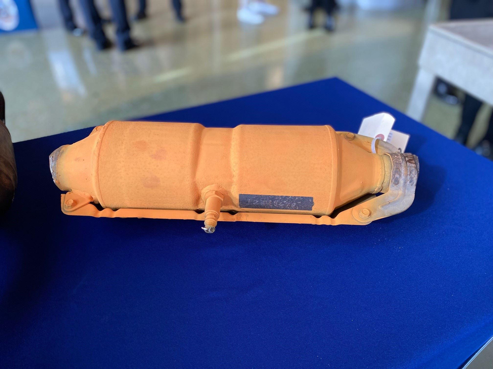  

###  [Redmond Police to Host Community Catalytic Converter Etching Event](https://www.redmond.gov/CivicAlerts.aspx?AID=920) 

 Posted on: April 14, 2022    

###  [Redmond Police Arrest Suspect in Moving Company Scam](https://www.redmond.gov/CivicAlerts.aspx?AID=906) 

 Posted on: March 31, 2022    

###  [Oregon Elementary Teacher Arrested for Attempted Rape of Two Children](https://www.redmond.gov/CivicAlerts.aspx?AID=897) 

 Posted on: March 28, 2022 

###  [Redmond Appoints Laura Da’ as New Poet Laureate](https://www.redmond.gov/CivicAlerts.aspx?AID=823) 

 Posted on: January 10, 2022 

### Live Edit

    [Calendar](https://www.redmond.gov/calendar.aspx)   [Permits](https://www.redmond.gov/898)   [Events](https://www.redmond.gov/294)   [Report an Issue](https://redmondwa.qscend.com/311/)   [UTILITY BILLING](https://www.redmond.gov/449)   [Projects](https://www.redmond.gov/406)  

###  [Popular](https://www.redmond.gov/QuickLinks.aspx?CID=105) 

 1.  [Home](https://www.redmond.gov/)  
 1.  [Events](https://www.redmond.gov/294)  
 1.  [Jobs](https://www.governmentjobs.com/careers/redmondwa)  
 1.  [Recreation Activities](https://www.redmond.gov/184/Activities)  
 /QuickLinks.aspx 

###  [Find](https://www.redmond.gov/QuickLinks.aspx?CID=106) 

 1.  [City Council](https://www.redmond.gov/189)  
 1.  [Parks & Trails](https://www.redmond.gov/186)  
 1.  [Permits](https://www.redmond.gov/898)  
 1.  [Transportation](https://www.redmond.gov/221)  
 /QuickLinks.aspx 

###  [Report / Request](https://www.redmond.gov/QuickLinks.aspx?CID=107) 

 1.  [Report an Issue](https://redmondwa.qscend.com/311/)  
 1.  [Request a Service](https://redmondwa.qscend.com/311/)  
 1.  [Public Record](https://www.redmond.gov/777)  
 1.  [Police Record](https://www.redmond.gov/698)  
 /QuickLinks.aspx 

###  [Helpful Links](https://www.redmond.gov/QuickLinks.aspx?CID=108) 

 1.  [ADA Program](https://www.redmond.gov/871)  
 1.  [Title VI](https://www.redmond.gov/857)  
 1.  [Website Accessibility](https://www.redmond.gov/873/5722/Web-Accessibility)  
 1.  [Website Policies](https://www.redmond.gov/385)  
 /QuickLinks.aspx 

### Sign up for our Newsletters

 1. 
             

 1.   

 1. Phone:  [425-556-2900](tel:425-556-2900) 

 1.  [15670 NE 85th Street](https://goo.gl/maps/CJcLDqJFWRpxZxbL6) 

 1. P.O. Box 97010

 1.  [Redmond, WA 98073-9710](https://goo.gl/maps/CJcLDqJFWRpxZxbL6) 

 1.  [Contact Us](https://www.redmond.gov/directory)  

 1.  [Site Map](https://www.redmond.gov/sitemap)  

 1.  [Website Feedback](https://www.redmond.gov/FormCenter/Communications-12/Website-Feedback-87)  
 /QuickLinks.aspx Loading Loading Do Not Show AgainClose [{"WidgetSkinID":56,"ComponentType":0,"FontFamily":"","FontVariant":"","FontColor":"","FontSize":0.00,"FontStyle":0,"TextAlignment":0,"ShadowColor":"","ShadowBlurRadius":0,"ShadowSpreadRadius":0,"ShadowOffsetX":0,"ShadowOffsetY":0,"ShadowInset":false,"ShadowColor2":"","ShadowBlurRadius2":0,"ShadowSpreadRadius2":0,"ShadowOffsetX2":0,"ShadowOffsetY2":0,"ShadowInset2":false,"ShadowColor3":"","ShadowBlurRadius3":0,"ShadowSpreadRadius3":0,"ShadowOffsetX3":0,"ShadowOffsetY3":0,"ShadowInset3":false,"ShadowColor4":"","ShadowBlurRadius4":0,"ShadowSpreadRadius4":0,"ShadowOffsetX4":0,"ShadowOffsetY4":0,"ShadowInset4":false,"ShadowColor5":"","ShadowBlurRadius5":0,"ShadowSpreadRadius5":0,"ShadowOffsetX5":0,"ShadowOffsetY5":0,"ShadowInset5":false,"Capitalization":0,"HeaderMiscellaneousStyles1":"","HeaderMiscellaneousStyles2":"","HeaderMiscellaneousStyles3":"","BulletStyle":0,"BulletWidth":2.00,"BulletColor":"","LinkNormalColor":"","LinkNormalUnderlined":false,"LinkNormalMiscellaneousStyles":"","LinkVisitedColor":"","LinkVisitedMiscellaneousStyles":"","LinkHoverColor":"","LinkHoverUnderlined":false,"LinkHoverMiscellaneousStyles":"","LinkSelectedUnderlined":false,"ForceReadOnLinkToNewLine":false,"DisplayColumnSeparator":false,"ColumnSeparatorWidth":0.0000,"HoverBackgroundColor":"","HoverBackgroundGradientStartingColor":"","HoverBackgroundGradientEndingColor":"","HoverBackgroundGradientDirection":0,"HoverBackgroundGradientDegrees":0.0000000,"HoverBackgroundImageFileName":"","HoverBackgroundImagePositionXUseKeyword":true,"HoverBackgroundImagePositionXKeyword":0,"HoverBackgroundImagePositionX":{"Value":0.0000,"Unit":0},"HoverBackgroundImagePositionYUseKeyword":true,"HoverBackgroundImagePositionYKeyword":0,"HoverBackgroundImagePositionY":{"Value":0.0000,"Unit":0},"HoverBackgroundImageRepeat":0,"HoverBorderStyle":0,"HoverBorderWidth":0,"HoverBorderColor":"","HoverBorderSides":15,"HoverBorderRadiusTopLeft":{"Value":null,"Unit":1},"HoverBorderRadiusTopRight":{"Value":null,"Unit":1},"HoverBorderRadiusBottomRight":{"Value":null,"Unit":1},"HoverBorderRadiusBottomLeft":{"Value":null,"Unit":1},"SelectedBackgroundColor":"","SelectedBackgroundGradientStartingColor":"","SelectedBackgroundGradientEndingColor":"","SelectedBackgroundGradientDirection":0,"SelectedBackgroundGradientDegrees":0.0000000,"SelectedBackgroundImageFileName":"","SelectedBackgroundImagePositionXUseKeyword":true,"SelectedBackgroundImagePositionXKeyword":0,"SelectedBackgroundImagePositionX":{"Value":0.0000,"Unit":0},"SelectedBackgroundImagePositionYUseKeyword":true,"SelectedBackgroundImagePositionYKeyword":0,"SelectedBackgroundImagePositionY":{"Value":0.0000,"Unit":0},"SelectedBackgroundImageRepeat":0,"SelectedBorderStyle":0,"SelectedBorderWidth":0,"SelectedBorderColor":"","SelectedBorderSides":15,"SelectedBorderRadiusTopLeft":{"Value":null,"Unit":1},"SelectedBorderRadiusTopRight":{"Value":null,"Unit":1},"SelectedBorderRadiusBottomRight":{"Value":null,"Unit":1},"SelectedBorderRadiusBottomLeft":{"Value":null,"Unit":1},"HoverFontFamily":"","HoverFontVariant":"","HoverFontColor":"","HoverFontSize":0.00,"HoverFontStyle":0,"HoverTextAlignment":0,"HoverShadowColor":"","HoverShadowBlurRadius":0,"HoverShadowSpreadRadius":0,"HoverShadowOffsetX":0,"HoverShadowOffsetY":0,"HoverShadowInset":false,"HoverShadowColor2":"","HoverShadowBlurRadius2":0,"HoverShadowSpreadRadius2":0,"HoverShadowOffsetX2":0,"HoverShadowOffsetY2":0,"HoverShadowInset2":false,"HoverShadowColor3":"","HoverShadowBlurRadius3":0,"HoverShadowSpreadRadius3":0,"HoverShadowOffsetX3":0,"HoverShadowOffsetY3":0,"HoverShadowInset3":false,"HoverShadowColor4":"","HoverShadowBlurRadius4":0,"HoverShadowSpreadRadius4":0,"HoverShadowOffsetX4":0,"HoverShadowOffsetY4":0,"HoverShadowInset4":false,"HoverShadowColor5":"","HoverShadowBlurRadius5":0,"HoverShadowSpreadRadius5":0,"HoverShadowOffsetX5":0,"HoverShadowOffsetY5":0,"HoverShadowInset5":false,"HoverCapitalization":0,"SelectedFontFamily":"","SelectedFontVariant":"","SelectedFontColor":"","SelectedFontSize":0.00,"SelectedFontStyle":0,"SelectedShadowColor":"","SelectedShadowBlurRadius":0,"SelectedShadowSpreadRadius":0,"SelectedShadowOffsetX":0,"SelectedShadowOffsetY":0,"SelectedShadowInset":false,"SpaceBetweenTabs":0,"SpaceBetweenTabsUnits":"","Trigger":4,"AnimationId":"00000000-0000-0000-0000-000000000000","AnimationClass":"animation00000000000000000000000000000000","ScrollOffset":80,"TriggerNameLowerCase":"scroll","ParentComponentWithTrigger":null,"BackgroundColor":"rgb(44, 53, 62)","BackgroundGradientStartingColor":"","BackgroundGradientEndingColor":"","BackgroundGradientDirection":0,"BackgroundGradientDegrees":0.0000000,"BackgroundImageFileName":"","BackgroundImagePositionXUseKeyword":true,"BackgroundImagePositionXKeyword":0,"BackgroundImagePositionX":{"Value":0.0,"Unit":0},"BackgroundImagePositionYUseKeyword":true,"BackgroundImagePositionYKeyword":0,"BackgroundImagePositionY":{"Value":0.0,"Unit":0},"BackgroundImageRepeat":0,"BorderStyle":0,"BorderWidth":0,"BorderColor":"","BorderSides":15,"BorderRadiusTopLeft":{"Value":null,"Unit":1},"BorderRadiusTopRight":{"Value":null,"Unit":1},"BorderRadiusBottomRight":{"Value":null,"Unit":1},"BorderRadiusBottomLeft":{"Value":null,"Unit":1},"MarginTop":{"Value":null,"Unit":0},"MarginRight":{"Value":null,"Unit":0},"MarginBottom":{"Value":null,"Unit":0},"MarginLeft":{"Value":null,"Unit":0},"PaddingTop":{"Value":null,"Unit":0},"PaddingRight":{"Value":null,"Unit":0},"PaddingBottom":{"Value":null,"Unit":0},"PaddingLeft":{"Value":null,"Unit":0},"MiscellaneousStyles":"box-shadow: 0px 3px 6px #00000029;","RecordStatus":0}] 