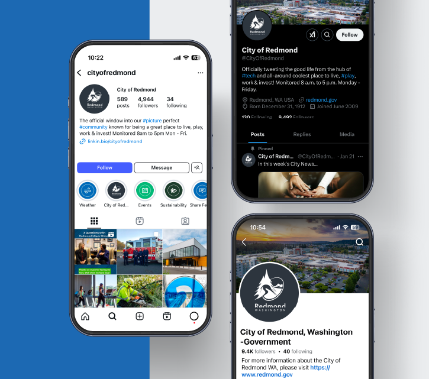
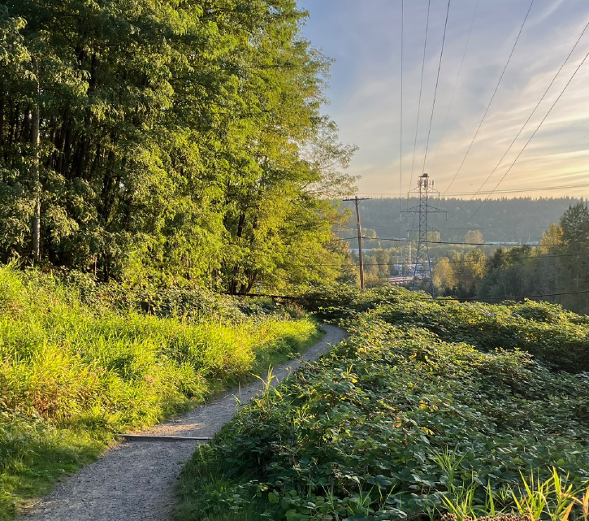
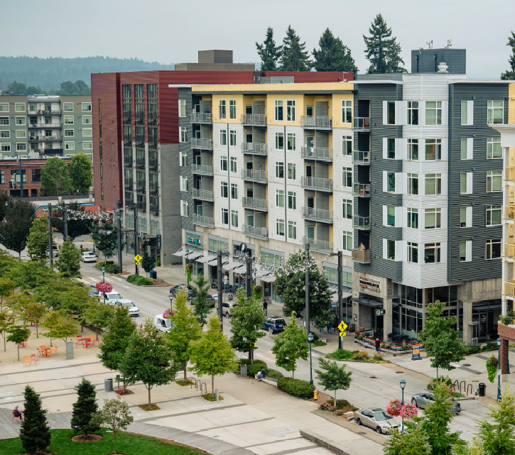
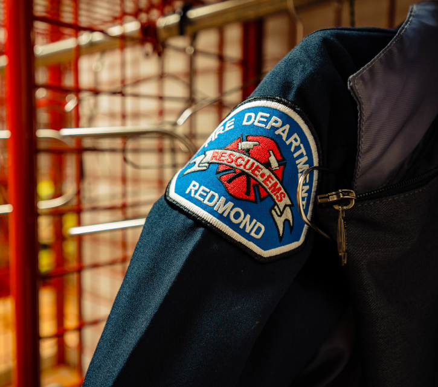
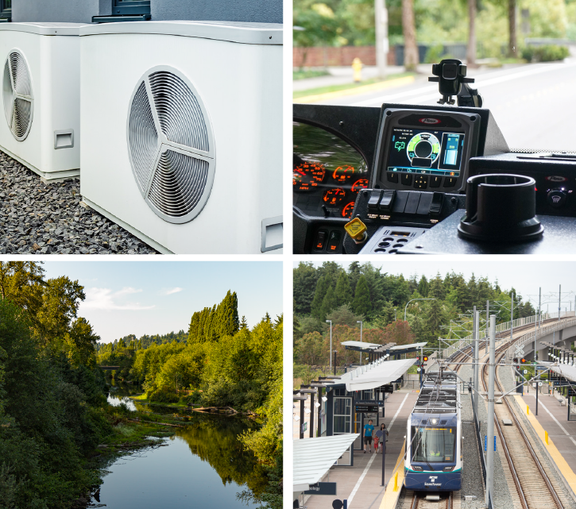
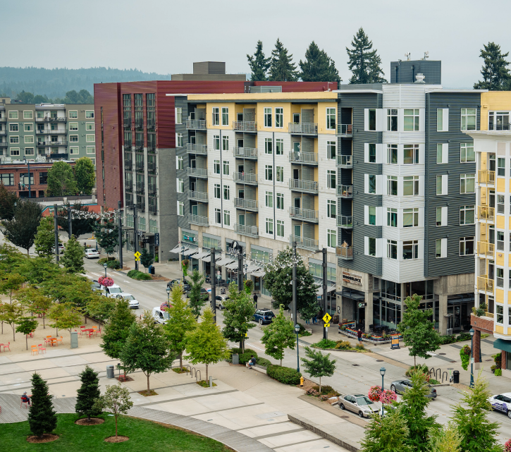
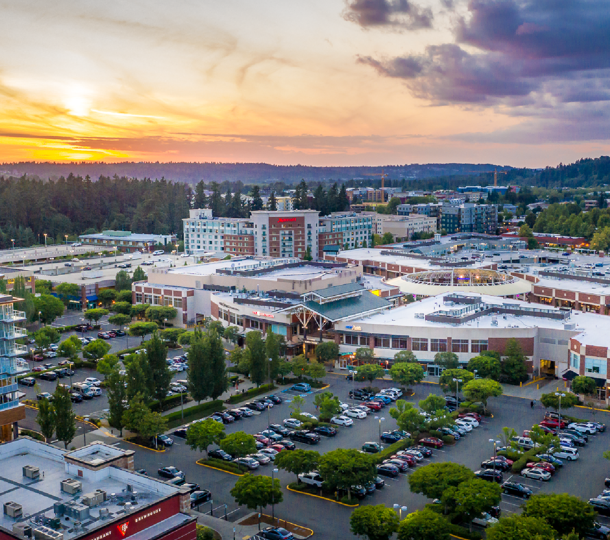
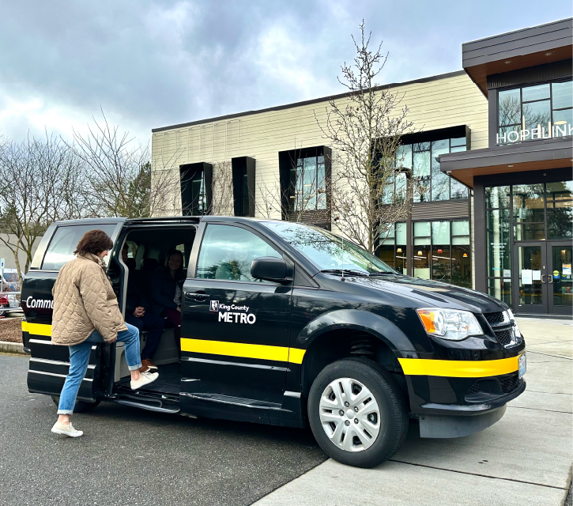

  [Skip to Main Content](https://redmond.gov/CivicAlerts.aspx?AID=2239#contentarea)   [Info](https://redmond.gov/2241)   [Immigration ResourcesClick for more information](https://redmond.gov/AlertCenter.aspx?AID=Immigration-Resources-78)     

 1.  [News](https://redmond.gov/CivicAlerts.aspx?AID=2239) 
 1.  [I Want To...](https://redmond.gov/9/I-Want-To) 
 1.  [Community](https://redmond.gov/101/Community) 
 1.  [Business](https://redmond.gov/35/Business) 
 1.  [Government](https://redmond.gov/27/Government) 
        

 1.  [Home](https://redmond.gov/CivicAlerts.aspx?AID=2239) 
 1. News Flash
   

### Module Search

 Enter Search Terms All categoriesHomeParks & RecRedmond Police BlotterEnvironmentNews ReleasesCommunity Resources and Servicescp-testRedmond in the News

### Tools

 1.  [RSS](https://redmond.gov/rss.aspx#rssCivicAlerts) 
 1.  [Notify Me®](https://redmond.gov/civicalerts.aspx?Mode=Subscribe) 
 1. 

### Categories

 1.  [All Categories](https://redmond.gov/CivicAlerts.aspx) 
 1.  [Home](https://redmond.gov/CivicAlerts.aspx?CID=1) 
 1.  [Parks & Rec](https://redmond.gov/CivicAlerts.aspx?CID=7) 
 1.  [Redmond Police Blotter](https://redmond.gov/CivicAlerts.aspx?CID=8) 
 1.  [Environment](https://redmond.gov/CivicAlerts.aspx?CID=10) 
 1.  [News Releases](https://redmond.gov/CivicAlerts.aspx?CID=11) 
 1.  [Community Resources and Services](https://redmond.gov/CivicAlerts.aspx?CID=12) 
 1.  [cp-test](https://redmond.gov/CivicAlerts.aspx?CID=13) 
 1.  [Redmond in the News](https://redmond.gov/CivicAlerts.aspx?CID=14) 

# News Flash

## Home

 Posted on: October 21, 2024 

### Learn How Mayor Birney is Enhancing Her Leadership

    

Mayor Birney recently earned an Advanced Certificate of Municipal Leadership from the Association of Washington Cities (AWC) for her service on the board of Hopelink. AWC’s Certificate of Municipal Leadership program recognizes city and town elected officials for accomplishing training in five core areas: 

 * Roles, responsibilities, and legal requirements
 * Public sector resource management
 * Community planning and development
 * Effective local leadership
 * Diversity, equity, inclusion, and belonging 

Those who earn the advanced certificate have continued to strive for excellence by attending conferences and trainings, serving their community, and further developing leadership skills.  

  [Learn about AWC](https://www.facebook.com/AWCities/?utm_medium=email&utm_source=govdelivery)          [⇐PreviousFall Back and Change Your Batteries](https://redmond.gov/CivicAlerts.aspx?AID=2241)  [Next⇒City Council Vice President Jessica Forsythe Named Co-Chair of Eastrail](https://redmond.gov/CivicAlerts.aspx?AID=2238)  

## Other News in Home

   

###  [Mayor Birney Joins Greater Seattle Partners Board](https://www.redmond.gov/CivicAlerts.aspx?AID=2452) 

 Posted on: March 24, 2025   

###  [Power Your Home with Solar](https://olysol.org/solarize/eastside/?utm_medium=email&utm_source=govdelivery) 

 Posted on: March 24, 2025   

###  [Have an Egg-cellent Time](https://app.amilia.com/store/en/city-of-redmond/shop/activities/5584291) 

 Posted on: March 24, 2025   

###  [Register for Summer Activities](https://www.redmond.gov/1156/Summer-Camps) 

 Posted on: March 24, 2025   

###  [Redmond Firefighters Climb for a Cure](https://www.lls.org/mission) 

 Posted on: March 24, 2025   

###  [Ride the 2 Line to Marymoor Village and Downtown Redmond](https://www.soundtransit.org/ride-with-us/know-before-you-go/how-to-ride) 

 Posted on: March 17, 2025   

###  [Teen Programs Moving from Old Fire House](https://www.redmond.gov/2262/Teen-Services?utm_medium=email&utm_source=govdelivery) 

 Posted on: March 17, 2025   

###  [Learn How Mayor Birney is Advancing Solutions for Housing Supply Challenges](https://www.redmond.gov/CivicAlerts.aspx?AID=2442&utm_medium=email&utm_source=govdelivery) 

 Posted on: March 17, 2025   

###  [Learn How Redmond's Spaces and Buildings Will be Redesigned](https://www.redmond.gov/1427/Redmond-2050) 

 Posted on: March 17, 2025 | Last Modified on: March 17, 2025   

###  [Drones as First Responders Program Reached New Heights in 2024](https://www.redmond.gov/2161/Drone-Program) 

 Posted on: March 17, 2025   

###  [Register for Summer Activities](https://app.amilia.com/store/en/city-of-redmond/shop/programs/112728) 

 Posted on: March 11, 2025   

###  [Helping Put Food on the Table for Those in Need](https://www.youtube.com/watch?v=Li_Y0KSUHVY) 

 Posted on: March 10, 2025   

###  [Get Involved with Derby Days](https://www.redmond.gov/1174/Get-Involved) 

 Posted on: March 10, 2025   

###  [Register Today for the Beat the Bunny Race](https://app.amilia.com/store/en/city-of-redmond/shop/programs/108545?subCategoryIds=5610392) 

 Posted on: March 10, 2025 | Last Modified on: March 10, 2025   

###  [Help Keep Our Streets Safe](https://www.letsconnectredmond.com/ssap/surveys/traffic-safety-near-schools-and-parks) 

 Posted on: March 10, 2025   

###  [Watch City News Now](https://www.youtube.com/@CityofRedmond) 

 Posted on: March 10, 2025   

###  [Celebrate March Milestones](https://www.redmond.gov/2258/Recognition-Months-Weeks-and-Days?utm_medium=email&utm_source=govdelivery#march) 

 Posted on: March 3, 2025   

###  [Introducing City News Now](https://www.facebook.com/CityOfRedmond?utm_medium=email&utm_source=govdelivery) 

 Posted on: March 3, 2025   

###  [Help Keep Our Streets Safe](https://www.letsconnectredmond.com/ssap/surveys/traffic-safety-near-schools-and-parks?utm_medium=email&utm_source=govdelivery) 

 Posted on: March 3, 2025   

###  [Take Action to Curb Pollution](https://www.redmond.gov/410/NPDES-Stormwater-Permit?utm_medium=email&utm_source=govdelivery#IDDE) 

 Posted on: March 3, 2025   

###  [Learn How You Can Get a Heat Pump in a Qualified Adult Family Home](https://events.gcc.teams.microsoft.com/event/23d3b9a2-fedc-4492-a88c-c23c5a52fc08@222d2edd-8255-45bd-8597-52141b82f713?utm_medium=email&utm_source=govdelivery) 

 Posted on: March 3, 2025 | Last Modified on: March 3, 2025   

###  [Learn How the City is Planning for Safer Streets](https://www.redmond.gov/1152/Safer-Streets-Redmond) 

 Posted on: February 24, 2025   

###  [Meet Our New Electric Fire Engine](https://www.facebook.com/watch/?v=600264416229252&rdid=yF86qTeW5zcDcovk) 

 Posted on: February 24, 2025   

###  [Get Help With Your Taxes](https://www.uwkc.org/need-help/tax-help/?utm_medium=email&utm_source=govdelivery) 

 Posted on: February 24, 2025 | Last Modified on: February 24, 2025   

###  [Learn How Redmond Planned for Light Rail](https://www.redmond.gov/1427/Redmond-2050) 

 Posted on: February 18, 2025   

###  [Review the Stormwater Management Plan](https://www.redmond.gov/410/NPDES-Stormwater-Permit) 

 Posted on: February 18, 2025   

###  [Apply to the Next Startup425 Accelerator](https://www.startup425.org/accelerator) 

 Posted on: February 18, 2025   

###  [Ways to Beat the Winter Blues](https://www.youtube.com/watch?v=t2-0ElDgPzc) 

 Posted on: February 10, 2025   

###  [Redmond Recognized as a Silver-Level Bicycle Friendly Community](https://www.redmond.gov/CivicAlerts.aspx?AID=2382) 

 Posted on: February 10, 2025   

###  [Learn How Redmond 2050 is Planning for Access to Centers and Light Rail](https://www.letsconnectredmond.com/tmp/surveys/2025-transportation-master-plan-transit-questionnaire) 

 Posted on: February 10, 2025    

###  [Observing Presidents Day](https://redmond.gov/CivicAlerts.aspx?AID=2399) 

 Posted on: February 10, 2025   

###  [Celebrate Black History Month](https://asalh.org/black-history-themes/?utm_medium=email&utm_source=govdelivery) 

 Posted on: February 3, 2025   

###  [New Electric Fire Truck Ushers in a New Era of Firefighting](https://www.redmond.gov/CivicAlerts.aspx?AID=2390) 

 Posted on: February 3, 2025   

###  [Save the Date: Ride the Rails to Downtown Redmond in May](https://www.soundtransit.org/get-to-know-us/news-events/news-releases/link-2-line-service-between-redmond-technology-station?utm_medium=email&utm_source=govdelivery) 

 Posted on: February 3, 2025   

###  [Prevent Damage to Your Pipes](https://www.redmond.gov/397/WastewaterSewer?utm_medium=email&utm_source=govdelivery#FOG) 

 Posted on: February 3, 2025    

###  [Thank You for Joining Us at the Council Conversations – Town Hall](https://redmond.gov/CivicAlerts.aspx?AID=2387) 

 Posted on: January 27, 2025   

###  [How Do You Use Transit?](https://www.letsconnectredmond.com/tmp/surveys/2025-transportation-master-plan-transit-questionnaire?utm_medium=email&utm_source=govdelivery) 

 Posted on: January 27, 2025   

###  [Follow Us on Social Media](https://www.facebook.com/CityOfRedmond) 

 Posted on: January 27, 2025   

###  [Affirming Our Commitment to a Welcoming Community](https://www.redmond.gov/2241/Immigration-Resources?utm_medium=email&utm_source=govdelivery) 

 Posted on: January 21, 2025    

###  [Learn How Fire Department Staffing Models Are Enhanced](https://redmond.gov/CivicAlerts.aspx?AID=2374) 

 Posted on: January 21, 2025   

###  [Learn How Redmond 2050 Prepares Our City for Climate Change and Extreme Weather](https://www.redmond.gov/DocumentCenter/View/35171/05---Climate-Resilience-and-Sustainability-Element---draft-50-PDF?utm_medium=email&utm_source=govdelivery) 

 Posted on: January 21, 2025   

###  [Apply for Disaster Assistance: Governor's Proclamation Provides Aid for Bomb Cyclone Victims](https://kcemergency.com/2025/01/07/state-financial-assistance-available-to-those-severely-impacted-by-the-november-bomb-cyclone/?utm_medium=email&utm_source=govdelivery) 

 Posted on: January 21, 2025   

###  [Here in Redmond: Take a Look Back at 2024](https://youtu.be/24dLNko-c4o?si=kzUD1-2k_1XcvNXw) 

 Posted on: January 13, 2025 | Last Modified on: January 13, 2025   

###  [Honoring Martin Luther King Jr.](https://www.redmond.gov/DocumentCenter/View/36085/Martin-Luther-King-Jr-Day-of-Service-Proclamation-12025?utm_medium=email&utm_source=govdelivery) 

 Posted on: January 13, 2025   

###  [Redmond Fire Department Deployed Crew to Support California Wildfires](https://www.redmond.gov/CivicAlerts.aspx?AID=2366&utm_medium=email&utm_source=govdelivery) 

 Posted on: January 13, 2025   

###  [Learn How Redmond 2050 Creates More Access to Outdoor Amenities and Nature](https://www.redmond.gov/1609/Parks-Arts-and-Culture) 

 Posted on: January 13, 2025   

###  [Learn About Zoning and Other Regulatory Changes Effective January 1](https://www.redmond.gov/2132/2024-Code-Updates?utm_medium=email&utm_source=govdelivery) 

 Posted on: January 6, 2025    

###  [Be Prepared for Winter Weather](https://redmond.gov/CivicAlerts.aspx?AID=2362) 

 Posted on: January 6, 2025   

###  [Come Play With Us This Winter](https://app.amilia.com/store/en/city-of-redmond/shop/programs?utm_medium=email&utm_source=govdelivery) 

 Posted on: January 6, 2025   

###  [Reach Your New Year Fitness Goals](https://app.amilia.com/store/en/city-of-redmond/shop/memberships?) 

 Posted on: January 6, 2025   

###  [Make a Difference in Your Neighborhood](https://wa.adopt-a-drain.org/?utm_medium=email&utm_source=govdelivery) 

 Posted on: January 6, 2025    

###  [Share Your Best Photos of 2024](https://redmond.gov/CivicAlerts.aspx?AID=2353) 

 Posted on: December 30, 2024   

###  [Support Available for Residents and Businesses Impacted by the November Windstorm](https://www.sba.gov/article/2024/12/23/sba-offers-disaster-assistance-washington-businesses-residents-affected-bomb-cyclone?utm_medium=email&utm_source=govdelivery) 

 Posted on: December 30, 2024   

###  [Be Aware of Changes to Utility Billing Payment Options](https://www.redmond.gov/FAQ.aspx?TID=107&utm_medium=email&utm_source=govdelivery) 

 Posted on: December 30, 2024   

###  [New Right of Way Use Fees Take Effect](https://www.redmond.gov/372/Right-of-Way-Use-Permit?utm_medium=email&utm_source=govdelivery) 

 Posted on: December 30, 2024 | Last Modified on: December 30, 2024   

###  [Light Rail is Coming to Downtown Redmond](https://www.redmond.gov/2207/Focus---FallWinter-2024?utm_medium=email&utm_source=govdelivery#lightrail) 

 Posted on: December 23, 2024   

###  [Learn About Our New Budget](https://www.redmond.gov/2207/Focus---FallWinter-2024?utm_medium=email&utm_source=govdelivery#budget) 

 Posted on: December 23, 2024   

###  [Check Out How Many Crows Are Roosting in Redmond](https://www.instagram.com/p/DDlRJVEvfdf/?utm_medium=email&utm_source=govdelivery) 

 Posted on: December 23, 2024    

###  [New Card Service Fees Begin on January 2](https://redmond.gov/CivicAlerts.aspx?AID=2345) 

 Posted on: December 23, 2024   

###  [Protect Your Pipes from Winter Weather](https://www.redmond.gov/2207/Focus---FallWinter-2024?utm_medium=email&utm_source=govdelivery#pipes) 

 Posted on: December 16, 2024   

###  [See How Redmond is Implementing Accessibility Improvements](https://www.redmond.gov/2057/31236/Inclusive-Design) 

 Posted on: December 16, 2024   

###  [Learn About New Right of Way Use Fees](https://www.redmond.gov/2157/Right-of-Way-Use-Fee) 

 Posted on: December 16, 2024   

###  [See Concrete Crew Success Stories](https://www.redmond.gov/2207/Focus---FallWinter-2024?utm_medium=email&utm_source=govdelivery#concrete) 

 Posted on: December 9, 2024   

###  [Share Your Thoughts on Electric Vehicles Infrastructure](https://www.letsconnectredmond.com/tmp/surveys/ev-charging?utm_medium=email&utm_source=govdelivery) 

 Posted on: December 9, 2024 | Last Modified on: December 9, 2024   

###  [See How Parks Are Leading the Charge as Climate Heroes](https://www.redmond.gov/2207/Focus---FallWinter-2024?utm_medium=email&utm_source=govdelivery#parks) 

 Posted on: December 9, 2024   

###  [Be Aware of Changes to Utility Billing Payment Options](https://www.redmond.gov/FAQ.aspx?TID=107&utm_medium=email&utm_source=govdelivery) 

 Posted on: December 9, 2024   

###  [Learn About the Two Editions of the Redmond Zoning Code](https://www.redmond.gov/2226/Vesting-to-the-Redmond-Zoning-Code?utm_medium=email&utm_source=govdelivery) 

 Posted on: December 9, 2024    

###  [New Card Service Fees Begin January 2](https://redmond.gov/CivicAlerts.aspx?AID=2322) 

 Posted on: December 9, 2024   

###  [Receive Help with Energy Expenses](https://www.hopelink.org/programs/energy/?utm_medium=email&utm_source=govdelivery) 

 Posted on: December 9, 2024    

###  [Join Us at Redmond Lights](https://redmond.gov/CivicAlerts.aspx?AID=2303) 

 Posted on: December 2, 2024   

###  [Read the Latest Focus Newsletter](https://www.redmond.gov/2207/Focus---FallWinter-2024?utm_medium=email&utm_source=govdelivery) 

 Posted on: December 2, 2024   

###  [Be Prepared for Winter Weather](https://www.redmond.gov/1315/Weather-Alert-Updates?utm_medium=email&utm_source=govdelivery) 

 Posted on: December 2, 2024    

###  [Meet Our New Snowplows](https://redmond.gov/CivicAlerts.aspx?AID=2300) 

 Posted on: December 2, 2024    

###  [Learn How Redmond 2050 Supports Local Businesses](https://redmond.gov/CivicAlerts.aspx?AID=2299) 

 Posted on: December 2, 2024    

###  [Be Aware of Upcoming Construction](https://redmond.gov/CivicAlerts.aspx?AID=2297) 

 Posted on: December 2, 2024   

###  [Celebrate Light and Art at Redmond Lights](https://www.redmond.gov/1139/Redmond-Lights?utm_medium=email&utm_source=govdelivery) 

 Posted on: November 25, 2024   

###  [Shop Local and Show Your Support](https://experienceredmond.com/Shop-Small/?utm_medium=email&utm_source=govdelivery) 

 Posted on: November 25, 2024   

###  [View the Adopted Redmond 2050 Plan](https://www.redmond.gov/CivicAlerts.aspx?AID=2274&utm_medium=email&utm_source=govdelivery) 

 Posted on: November 25, 2024   

###  [Learn About EMS Transport Fees](https://www.redmond.gov/faq.aspx?TID=106&utm_medium=email&utm_source=govdelivery) 

 Posted on: November 25, 2024    

###  [Wishing You a Safe and Happy Holiday](https://redmond.gov/CivicAlerts.aspx?AID=2285) 

 Posted on: November 25, 2024   

###  [Help Others During the Holidays](https://www.redmond.gov/DocumentCenter/View/34804/Holiday-Giving-2024?utm_medium=email&utm_source=govdelivery) 

 Posted on: November 25, 2024   

###  [Learn How Redmond is Implementing Universal Design to Improve Accessibility and Inclusion](https://www.redmond.gov/2057/Inclusive-Design?utm_medium=email&utm_source=govdelivery) 

 Posted on: November 18, 2024    

###  [New Card Service Fees Begin December 2](https://redmond.gov/CivicAlerts.aspx?AID=2266) 

 Posted on: November 18, 2024   

###  [Share How You Get Around Redmond](https://www.letsconnectredmond.com/tmp?utm_medium=email&utm_source=govdelivery) 

 Posted on: November 18, 2024   

###  [Stay Connected on Sustainability, Parks, Growth, and More](https://www.redmond.gov/208/Enews-Subscription?utm_medium=email&utm_source=govdelivery) 

 Posted on: November 18, 2024   

###  [Check out Redmond’s Stylish New Small Business](https://www.youtube.com/watch?v=s-F3WBuCFWg) 

 Posted on: November 12, 2024   

###  [Redmond Firefighters Return from Hurricane Deployments](https://www.redmond.gov/CivicAlerts.aspx?AID=2255&utm_medium=email&utm_source=govdelivery) 

 Posted on: November 12, 2024   

###  [Salary Commission Completes its Work](https://www.redmond.gov/1972/Salary-Commission?utm_medium=email&utm_source=govdelivery) 

 Posted on: November 12, 2024   

###  [Be Aware of Changes to Utility Billing Payment Options](https://www.redmond.gov/FAQ.aspx?TID=107&utm_medium=email&utm_source=govdelivery) 

 Posted on: November 12, 2024   

###  [Sign Up for Emergency Alerts](https://kingcounty.gov/en/dept/executive-services/health-safety/safety-injury-prevention/emergency-preparedness/alert-king-county?utm_medium=email&utm_source=govdelivery) 

 Posted on: November 4, 2024   

###  [Celebrate Native American Heritage Month](https://www.nativeamericanheritagemonth.gov/?utm_medium=email&utm_source=govdelivery) 

 Posted on: November 4, 2024   

###  [Learn How Redmond 2050 Focuses on Equity and Inclusion](https://www.redmond.gov/2057/Inclusive-Design?utm_medium=email&utm_source=govdelivery) 

 Posted on: November 4, 2024    

###  [New Card Service Fees Begin December 2](https://redmond.gov/CivicAlerts.aspx?AID=2249) 

 Posted on: November 4, 2024    

###  [Find Upcoming Opportunities for Redmond Businesses and Job Seekers](https://redmond.gov/CivicAlerts.aspx?AID=2248) 

 Posted on: November 4, 2024   

###  [Learn About the Impact of 2117 on Redmond](https://www.redmond.gov/CivicAlerts.aspx?AID=2164&utm_medium=email&utm_source=govdelivery) 

 Posted on: October 28, 2024   

###  [See Environmental Sustainability Progress](https://www.redmond.gov/2182/2023-Environmental-Sustainability-Annual?utm_medium=email&utm_source=govdelivery) 

 Posted on: October 28, 2024   

###  [Learn How Redmond Zones are Changing](https://www.redmond.gov/2108/Mixed-use-zones?utm_medium=email&utm_source=govdelivery) 

 Posted on: October 28, 2024   

###  [No Lead in Redmond’s Service Lines](https://www.redmond.gov/233/DrinkingWater?utm_medium=email&utm_source=govdelivery#lead) 

 Posted on: October 28, 2024    

###  [Fall Back and Change Your Batteries](https://redmond.gov/CivicAlerts.aspx?AID=2241) 

 Posted on: October 28, 2024    

###  [City Council Vice President Jessica Forsythe Named Co-Chair of Eastrail](https://redmond.gov/CivicAlerts.aspx?AID=2238) 

 Posted on: October 21, 2024   

###  [Learn How Redmond 2050 Will Change Zoning in the City](https://www.redmond.gov/1606/Housing?utm_medium=email&utm_source=govdelivery) 

 Posted on: October 21, 2024   

###  [Stay Warm and Cozy with a Heat Pump](https://www.youtube.com/watch?v=U1bnOUMvrd8) 

 Posted on: October 21, 2024    

###  [Make a Difference in Your Neighborhood](https://redmond.gov/CivicAlerts.aspx?AID=2233) 

 Posted on: October 21, 2024   

###  [Learn Where to Find the Best Pizza in Redmond](https://www.youtube.com/watch?si=1cVJfAsopp2Ldksm&utm_medium=email&utm_source=govdelivery&v=A-pVY__DWi0&feature=youtu.be) 

 Posted on: October 14, 2024    

###  [Honoring Indigenous Peoples Day](https://redmond.gov/CivicAlerts.aspx?AID=2230) 

 Posted on: October 14, 2024   

###  [Drop. Take Cover. Hold On.](https://www.youtube.com/playlist?list=PLs1gMujRSBY2t7JB4VS-AymFwN-6Lvg20) 

 Posted on: October 14, 2024   

###  [Read Local Eat Local](https://www.redmond.gov/2142/Read-Local-Eat-Local?utm_medium=email&utm_source=govdelivery) 

 Posted on: October 7, 2024   

###  [Get Ready to Glow](https://www.redmond.gov/1139/Redmond-Lights?utm_medium=email&utm_source=govdelivery) 

 Posted on: October 7, 2024    

###  [Read the City’s Preliminary Budget](https://redmond.gov/CivicAlerts.aspx?AID=2217) 

 Posted on: October 7, 2024   

###  [Learn About the Impact of Initiative 2117 on Redmond](https://www.redmond.gov/CivicAlerts.aspx?AID=2164) 

 Posted on: October 7, 2024   

###  [Vent to Prevent](https://www.nfpa.org/education-and-research/home-fire-safety/smoke-alarms?utm_medium=email&utm_source=govdelivery) 

 Posted on: October 7, 2024   

###  [Stay Cyber Safe](https://www.cisa.gov/cybersecurity-awareness-month?utm_medium=email&utm_source=govdelivery) 

 Posted on: October 7, 2024   

###  [Learn About Redmond’s Fall Traffic Counts](https://www.redmond.gov/863/Traffic-Counts) 

 Posted on: September 30, 2024   

###  [Participate in SilverSneakers](https://app.amilia.com/store/en/city-of-redmond/shop/memberships/52900) 

 Posted on: September 30, 2024   

###  [Redmond 2050: What’s Changing in Your Neighborhood](https://www.redmond.gov/1427/Redmond-2050) 

 Posted on: September 30, 2024   

###  [Learn About Our Redmond Senior & Community Center Passes](https://content.govdelivery.com/accounts/WAREDMOND/bulletins/3b7148f) 

 Posted on: September 23, 2024   

###  [Redmond 2050: What is a Complete Neighborhood?](https://www.redmond.gov/1427/Redmond-2050?utm_medium=email&utm_source=govdelivery) 

 Posted on: September 23, 2024   

###  [Be Part of the Solution to Homelessness](https://www.youtube.com/watch?v=w_SgXf3a5G8) 

 Posted on: September 23, 2024   

###  [Downtown Redmond Art Walk, Council Conversations, Redmond Lights, and More!](https://content.govdelivery.com/accounts/WAREDMOND/bulletins/3b69195) 

 Posted on: September 18, 2024   

###  [Take Part in Our Bike Friendly Communities Survey](https://www.surveymonkey.com/r/BFC_2024?utm_medium=email&utm_source=govdelivery) 

 Posted on: September 16, 2024   

###  [Learn About Changes to Utility Billing](https://www.redmond.gov/2102/Frequently-Asked-Questions) 

 Posted on: September 16, 2024   

###  [Fall Activities on the Farm, Council Conversations, and More!](https://content.govdelivery.com/accounts/WAREDMOND/bulletins/3b4f2e9) 

 Posted on: September 11, 2024   

###  [A Sense of Home is Meaningful for Everyone](https://www.youtube.com/watch?v=Xd09oa44rDI) 

 Posted on: September 9, 2024    

###  [Remembering September 11](https://redmond.gov/CivicAlerts.aspx?AID=2172) 

 Posted on: September 9, 2024 | Last Modified on: September 9, 2024    

###  [Celebrate Hispanic Heritage Month](https://redmond.gov/CivicAlerts.aspx?AID=2170) 

 Posted on: September 9, 2024   

###  [Learn About the Startup 425 Accelerator](https://www.startup425.org/accelerator) 

 Posted on: September 9, 2024   

###  [Make Back-to-School Safe](https://www.goredmond.com/blog/august-25-2022-1108am/back-school-safety-tips) 

 Posted on: September 3, 2024   

###  [Discover Salmon SEEson](https://experience.arcgis.com/experience/779f2239705a42fba71f198d958da479/?data_id=dataSource_2-Salmon_viewing_sites_8034%3A7) 

 Posted on: September 3, 2024   

###  [Take Control of Your Readiness](https://www.ready.gov/plan) 

 Posted on: September 3, 2024   

###  [Nearing Completion: Learn the Latest About Redmond 2050](https://www.redmond.gov/1427/Redmond-2050) 

 Posted on: August 26, 2024   

###  [Get a Membership to the Redmond Senior & Community Center](https://www.redmond.gov/2127/Hours-and-Operations) 

 Posted on: August 26, 2024    

###  [Help Keep Our Community Safe](https://redmond.gov/CivicAlerts.aspx?AID=2154) 

 Posted on: August 26, 2024   

###  [Learn About Climate Mayors Electric Vehicle Commitment](https://www.climatemayors.org) 

 Posted on: August 19, 2024   

###  [Take Part in Our Bike Friendly Communities Survey](https://www.surveymonkey.com/r/BFC_2024) 

 Posted on: August 19, 2024   

###  [Learn About Changes to Utility Billing](https://www.redmond.gov/2102/Frequently-Asked-Questions) 

 Posted on: August 19, 2024   

###  [Care for Your Car to Protect Our Water](https://www.redmond.gov/1225/Taking-Action?utm_medium=email&utm_source=govdelivery#car) 

 Posted on: August 19, 2024   

###  [Learn About Our Poet Laureate’s National Recognition](https://poets.org/academy-american-poets-2024-poet-laureate-fellows) 

 Posted on: August 12, 2024   

###  [See the Newly Opened NE 40th Street Underpass](https://www.redmond.gov/1151/Light-Rail-Extension) 

 Posted on: August 12, 2024    

###  [Thank You All for National Night Out](https://redmond.gov/CivicAlerts.aspx?AID=2137) 

 Posted on: August 12, 2024   

###  [Keep our Roads Safe](https://www.redmond.gov/2158/Focus---Summer-2024?utm_medium=email&utm_source=govdelivery#driver-pedestrian) 

 Posted on: August 12, 2024   

###  [Use Water Wisely](https://www.redmond.gov/2158/Focus---Summer-2024?utm_medium=email&utm_source=govdelivery#water) 

 Posted on: August 12, 2024   

###  [Find your perfect fall activities and more!](https://content.govdelivery.com/accounts/WAREDMOND/bulletins/3ad380c) 

 Posted on: August 7, 2024   

###  [Keep Loved Ones Safe with the Take Me Home Program](https://www.youtube.com/watch?v=YgjjZc7ATVM) 

 Posted on: August 5, 2024   

###  [Share Your Budget Priorities with Us](https://www.letsconnectredmond.com/budget-2024) 

 Posted on: August 5, 2024   

###  [View the Annual Community Survey Results](https://www.redmond.gov/856/Community-Surveys) 

 Posted on: August 5, 2024   

###  [We Want to Hear from You about Stormwater, Streams, and More](https://www.letsconnectredmond.com/stormwater-surface-water-system-plan) 

 Posted on: August 5, 2024   

###  [Get Free Composting Services for Businesses](https://www.redmond.gov/2158/Focus---Summer-2024?utm_medium=email&utm_source=govdelivery#composting) 

 Posted on: August 5, 2024   

###  [Fall Activity Registration is Open, Redmond Lights, and More!](https://content.govdelivery.com/accounts/WAREDMOND/bulletins/3abf78b) 

 Posted on: July 31, 2024   

###  [Get Help for Summer Meals](https://sunbucks.dshs.wa.gov/en) 

 Posted on: July 29, 2024   

###  [We Want Your Feedback](https://www.letsconnectredmond.com/row) 

 Posted on: July 29, 2024   

###  [Save Thousands on Heat Pumps](https://www.redmond.gov/2158/Focus---Summer-2024?utm_medium=email&utm_source=govdelivery#heat-pumps) 

 Posted on: July 29, 2024   

###  [Ride the Rails to Redmond](https://www.redmond.gov/2158/Focus---Summer-2024?utm_medium=email&utm_source=govdelivery#ride-the-rails) 

 Posted on: July 29, 2024   

###  [Register for Fall Activities, Free Life Jackets, and More!](https://content.govdelivery.com/accounts/WAREDMOND/bulletins/3aa8c0a) 

 Posted on: July 24, 2024   

###  [Join Our Parks, Trails, and Recreation Commission](https://www.redmond.gov/CivicAlerts.aspx?AID=2094) 

 Posted on: July 22, 2024   

###  [Join the Salary Commission](https://www.redmond.gov/1972/Salary-Commission) 

 Posted on: July 22, 2024   

###  [View Redmond’s Economic Development Strategic Plan](https://www.redmond.gov/322/Economic-Development) 

 Posted on: July 22, 2024   

###  [Paws and Play in Redmond](https://www.letsconnectredmond.com/dogpark) 

 Posted on: July 22, 2024   

###  [Share Your Feedback on Stormwater and Surface Water](https://www.letsconnectredmond.com/stormwater-surface-water-system-plan) 

 Posted on: July 22, 2024   

###  [Update on the Lamp Posts Blooming in Overlake](https://www.redmond.gov/2158/Focus---Summer-2024#shining-light) 

 Posted on: July 22, 2024   

###  [Spend Your Summer in Redmond](https://www.redmond.gov/2158/Focus---Summer-2024?utm_medium=email&utm_source=govdelivery#summer-camps) 

 Posted on: July 15, 2024   

###  [Volunteer to Help Redmond Public Safety](https://www.redmond.gov/1164/Civil-Service-Commission) 

 Posted on: July 15, 2024   

###  [Read About How Housing Builds Connections](https://www.redmond.gov/2158/Focus---Summer-2024?utm_medium=email&utm_source=govdelivery#connections) 

 Posted on: July 15, 2024 | Last Modified on: July 15, 2024   

###  [Rockin' on the River, Derby Days Feedback, and More!](https://content.govdelivery.com/accounts/WAREDMOND/bulletins/3a90e60) 

 Posted on: July 17, 2024   

###  [Celebrate National Parks and Recreation Month](https://www.redmond.gov/165/Parks-Recreation?utm_medium=email&utm_source=govdelivery) 

 Posted on: July 8, 2024   

###  [Join Free Cascade Gardener Tours and Classes](https://cascadewater.org/water-efficiency/cascade-gardener/?utm_medium=email&utm_source=govdelivery) 

 Posted on: July 8, 2024   

###  [Don’t Wait to Inflate](https://www.pugetsoundstartshere.org/DontwaittoInflate/?utm_medium=email&utm_source=govdelivery) 

 Posted on: July 8, 2024    

###  [Read the Latest Focus Newsletter](https://redmond.gov/CivicAlerts.aspx?AID=2076) 

 Posted on: July 3, 2024   

###  [Honoring Disability Pride Month](https://thearc.org/blog/why-and-how-to-celebrate-disability-pride-month/?utm_medium=email&utm_source=govdelivery) 

 Posted on: July 1, 2024   

###  [Learn About Right-of-Way Use Fee Proposal](https://www.redmond.gov/2157/Proposed-Right-of-Way-Use-Fee?utm_medium=email&utm_source=govdelivery) 

 Posted on: July 1, 2024   

###  [Register Your Loved One for Take Me Home](https://www.redmond.gov/2149/Take-Me-Home-Program?utm_medium=email&utm_source=govdelivery) 

 Posted on: June 24, 2024   

###  [Drink in the Data for Redmond’s Water](https://www.redmond.gov/DocumentCenter/View/28402/2024-Water-Quality-Report?utm_medium=email&utm_source=govdelivery) 

 Posted on: June 24, 2024   

###  [Review the General Wastewater Plan](https://www.letsconnectredmond.com/general-sewer-plan?utm_medium=email&utm_source=govdelivery) 

 Posted on: June 24, 2024   

###  [Join the Civil Service Commission](https://www.redmond.gov/CivicAlerts.aspx?AID=2034&utm_medium=email&utm_source=govdelivery) 

 Posted on: June 24, 2024   

###  [Learn About New Right of Way Use Fees](https://www.redmond.gov/2157/Right-of-Way-Use-Fee?utm_medium=email&utm_source=govdelivery) 

 Posted on: June 24, 2024   

###  [Relish in the Dog Days of Summer](https://www.youtube.com/watch?feature=youtu.be&utm_medium=email&utm_source=govdelivery&v=NvECG33vsak) 

 Posted on: June 17, 2024 | Last Modified on: June 17, 2024   

###  [Making a Difference on the Eastside Through a Clean Energy Program](https://www.energysmarteastside.org/?utm_medium=email&utm_source=govdelivery) 

 Posted on: June 17, 2024   

###  [View Redmond’s First Tourism Strategic Plan](https://www.redmond.gov/DocumentCenter/View/32918/Redmond-Tourism-Strategic-Plan-FINAL-DRAFT?utm_medium=email&utm_source=govdelivery) 

 Posted on: June 17, 2024   

###  [Be Kind to Birds, Bats, Butterflies, and Bees](https://www.redmond.gov/953/Climate-Resiliency-Sustainability-in-Veg?utm_medium=email&utm_source=govdelivery) 

 Posted on: June 17, 2024 | Last Modified on: June 17, 2024   

###  [Derby Days Music, Summer Radness, Busker Program, and More!](https://content.govdelivery.com/accounts/WAREDMOND/bulletins/3a243dc) 

 Posted on: June 12, 2024   

###  [Celebrate Pride Month](https://www.redmond.gov/DocumentCenter/View/32872/Pride-Proclamation-2024?utm_medium=email&utm_source=govdelivery) 

 Posted on: June 10, 2024   

###  [Explore the Overlake Neighborhood with Redmond's New Overlake Passport Challenge](https://experienceredmond.com/Overlake-Passport-Challenge/?utm_medium=email&utm_source=govdelivery) 

 Posted on: June 10, 2024   

###  [Help Improve Marymoor Park](https://survey123.arcgis.com/share/2ff9323500694fe494b4b8d1b79e3812?utm_medium=email&utm_source=govdelivery) 

 Posted on: June 10, 2024   

###  [Join Us in Honoring Emergency Medical Services Week](https://emsweek.org/?utm_medium=email&utm_source=govdelivery) 

 Posted on: May 20, 2024   

###  [Celebrate National Public Works Week](https://www.redmond.gov/1772/National-Public-Works-Week?utm_medium=email&utm_source=govdelivery) 

 Posted on: May 20, 2024   

###  [Redmond Earns Community Champion Award](https://www.redmond.gov/CivicAlerts.aspx?AID=2007&utm_medium=email&utm_source=govdelivery) 

 Posted on: May 20, 2024   

###  [Attend a Startup and Small Business Coworking Event](https://redmond.gov/CivicAlerts.aspx?AID=2009) 

 Posted on: May 20, 2024   

###  [Enjoy the New Redmond Senior & Community Center](https://redmond.gov/CivicAlerts.aspx?AID=2006) 

 Posted on: May 13, 2024   

###  [Celebrate Asian American, Native Hawaiian, and Pacific Islander Heritage Month](https://redmond.gov/CivicAlerts.aspx?AID=2005) 

 Posted on: May 13, 2024    

###  [Honoring National Police Week](https://redmond.gov/CivicAlerts.aspx?AID=2004) 

 Posted on: May 13, 2024   

###  [Learn About Affordable Housing Week](https://redmond.gov/CivicAlerts.aspx?AID=2003) 

 Posted on: May 13, 2024   

###  [Explore the Overlake Neighborhood with Redmond's New Overlake Passport Challenge](https://experienceredmond.com/Overlake-Passport-Challenge) 

 Posted on: May 13, 2024   

###  [Take a Ride in a Community Van](https://www.goredmond.com/redmond-community-van) 

 Posted on: May 13, 2024   

###  [Learn About the City’s Commitment to Environmental Stewardship](https://redmond.gov/CivicAlerts.aspx?AID=2000) 

 Posted on: May 13, 2024   

###  [Honoring Older Americans Month](https://www.redmond.gov/DocumentCenter/View/32591/Older-Americans-Month-Proclamation---May-2024?utm_medium=email&utm_source=govdelivery) 

 Posted on: May 7, 2024   

###  [Celebrate Bike Everywhere Month](https://cityofredmond.maps.arcgis.com/apps/instant/basic/index.html?47.667=&appid=659e8920e5de4bb3867c577a1a770c9e&center=-122.1201&hiddenLayers=18f0bf745dc-layer-20&level=12&utm_medium=email&utm_source=govdelivery) 

 Posted on: May 7, 2024   

###  [Help Make Roads Safer](https://redmond.gov/CivicAlerts.aspx?AID=1994) 

 Posted on: May 7, 2024   

###  [Celebrate Clean Drinking Water](https://www.redmond.gov/1834/Drinking-Water-Operations?utm_medium=email&utm_source=govdelivery) 

 Posted on: May 7, 2024   

###  [Keep Our Streams Clean](https://www.redmond.gov/1225/Taking-Action?utm_medium=email&utm_source=govdelivery#neighborhood) 

 Posted on: May 7, 2024   

###  [Protect Insects to Protect Birds](https://www.migratorybirdday.org/?utm_medium=email&utm_source=govdelivery) 

 Posted on: May 7, 2024   

###  [Join Us for the Redmond Senior & Community Center Grand Opening](https://www.redmond.gov/1867/Redmond-Senior-Community-Center?utm_medium=email&utm_source=govdelivery) 

 Posted on: April 29, 2024   

###  [Stay Informed About Municipal Campus Parking Changes](https://www.redmond.gov/2124?utm_medium=email&utm_source=govdelivery) 

 Posted on: April 29, 2024   

###  [Explore the Overlake Neighborhood with Redmond's New Overlake Passport Challenge](https://experienceredmond.com/Overlake-Passport Challenge/?utm_medium=email&utm_source=govdelivery) 

 Posted on: April 29, 2024   

###  [Light the Night to Honor Fallen Firefighters](https://weekend.firehero.org/events/memorial-weekend/light-night-fallen-firefighters/?utm_medium=email&utm_source=govdelivery) 

 Posted on: April 29, 2024   

###  [Keep Your Home Safe this Wildfire Season](https://www.nfpa.org/Events/Events/National-Wildfire-Community-Preparedness-Day?utm_medium=email&utm_source=govdelivery) 

 Posted on: April 29, 2024   

###  [Apply for the Regional Summer Planning Academy](https://redmond.gov/CivicAlerts.aspx?AID=1952) 

 Posted on: April 29, 2024   

###  [Grand Opening of the New Redmond Senior & Community Center, Art Walk Muralists, and More!](https://content.govdelivery.com/accounts/WAREDMOND/bulletins/39877bd) 

 Posted on: April 24, 2024   

###  [Earth Day with Green Redmond, Community Paint Day, and More!](https://content.govdelivery.com/accounts/WAREDMOND/bulletins/396fb66) 

 Posted on: April 17, 2024   

###  [Slow Down for National Work Zone Awareness Week](https://wsdot.wa.gov/travel/traffic-safety-methods/work-zone-safety?utm_medium=email&utm_source=govdelivery) 

 Posted on: April 17, 2024   

###  [Learn About Redmond Senior & Community Center and Municipal Campus Parking](https://www.redmond.gov/2124/Municipal-Campus-Parking?utm_medium=email&utm_source=govdelivery) 

 Posted on: April 17, 2024   

###  [Apply for Redmond’s Derby Days Do-Gooder Scholarship](https://www.redmond.gov/1412/Derby-Do-Gooder-Scholarship?utm_medium=email&utm_source=govdelivery) 

 Posted on: April 17, 2024   

###  [Learn About Redmond Demographics](https://www.redmond.gov/818/Demographics-and-Statistics?utm_medium=email&utm_source=govdelivery) 

 Posted on: April 17, 2024   

###  [Learn How Our Community is Changing](https://www.redmond.gov/1427/Redmond-2050?utm_medium=email&utm_source=govdelivery) 

 Posted on: April 17, 2024   

###  [Be Part of Derby Days, Scholarship for High School Seniors, and More!](https://content.govdelivery.com/accounts/WAREDMOND/bulletins/39555e4) 

 Posted on: April 10, 2024   

###  [Pop-up Dog Parks Opening, Earth Day Activities, and More!](https://content.govdelivery.com/accounts/WAREDMOND/bulletins/3942b8a) 

 Posted on: April 5, 2024   

###  [Celebrate Earth Month](https://www.redmond.gov/1725/Earth-Month) 

 Posted on: April 1, 2024   

###  [Grow Healthy Natural Yards](https://www.naturalyardcare.org/?utm_medium=email&utm_source=govdelivery) 

 Posted on: April 1, 2024   

###  [Learn About Redmond Senior & Community Center and Municipal Campus Parking](https://www.redmond.gov/2124/32981/Municipal-Campus-Parking?utm_medium=email&utm_source=govdelivery) 

 Posted on: April 1, 2024   

###  [Recognizing Sexual Assault Awareness Month](https://www.redmond.gov/DocumentCenter/View/32202/Sexual-Assault-Awareness-Month-2024-Proclamation?utm_medium=email&utm_source=govdelivery) 

 Posted on: April 1, 2024   

###  [Participate in National Volunteer Month](https://www.redmond.gov/661/Volunteer-Opportunities?utm_medium=email&utm_source=govdelivery) 

 Posted on: April 1, 2024   

###  [Save a Life by Donating Blood](https://donate.bloodworksnw.org/donor/schedules/sponsor_code?utm_medium=email&utm_source=govdelivery) 

 Posted on: April 1, 2024   

### Live Edit

    

###  [Popular](https://redmond.gov/QuickLinks.aspx?CID=105) 

 1.  [Home](https://redmond.gov/CivicAlerts.aspx?AID=2239)  
 1.  [Events](https://redmond.gov/294)  
 1.  [Jobs](https://www.governmentjobs.com/careers/redmondwa)  
 1.  [Recreation Activities](https://redmond.gov/184/Activities)  
 /QuickLinks.aspx 

###  [Find](https://redmond.gov/QuickLinks.aspx?CID=106) 

 1.  [City Council](https://redmond.gov/189)  
 1.  [Parks & Trails](https://redmond.gov/186)  
 1.  [Permits](https://redmond.gov/898)  
 1.  [Transportation](https://redmond.gov/221)  
 /QuickLinks.aspx 

###  [Report / Request](https://redmond.gov/QuickLinks.aspx?CID=107) 

 1.  [Report an Issue](https://redmondwa.qscend.com/311)  
 1.  [Request a Service](https://redmondwa.qscend.com/311)  
 1.  [Public Record](https://redmond.gov/777)  
 1.  [Police Record](https://redmond.gov/698)  
 /QuickLinks.aspx 

###  [Helpful Links](https://redmond.gov/QuickLinks.aspx?CID=108) 

 1.  [ADA Program](https://redmond.gov/871)  
 1.  [Title VI](https://redmond.gov/857)  
 1.  [Website Accessibility](https://redmond.gov/873/5722/Web-Accessibility)  
 1.  [Website Policies](https://redmond.gov/385)  
 /QuickLinks.aspx 

### Social Media

  [Facebook](https://redmond.gov/facebook)   [X](https://redmond.gov/twitter)   [Instagram](https://redmond.gov/instagram)   [YouTube](https://redmond.gov/youtube)  

### Sign Up For Our Newsletter

 1. 
  

 1.    

     

  

 1. Phone:  [425-556-2900](tel:425-556-2900) 

 1.  [15670 NE 85th Street](https://goo.gl/maps/CJcLDqJFWRpxZxbL6) 

 1. P.O. Box 97010

 1.  [Redmond, WA 98073-9710](https://goo.gl/maps/CJcLDqJFWRpxZxbL6) 
  

 1.  [Contact Us](https://redmond.gov/directory)  

 1.  [Site Map](https://redmond.gov/sitemap)  

 1.  [Website Feedback](https://redmond.gov/FormCenter/Communications-12/Website-Feedback-87)  
 /QuickLinks.aspx Loading Loading Do Not Show AgainClose    [{"WidgetSkinID":56,"ComponentType":0,"FontFamily":"","FontVariant":"","FontColor":"","FontSize":0.00,"FontStyle":0,"TextAlignment":0,"ShadowColor":"","ShadowBlurRadius":0,"ShadowSpreadRadius":0,"ShadowOffsetX":0,"ShadowOffsetY":0,"ShadowInset":false,"ShadowColor2":"","ShadowBlurRadius2":0,"ShadowSpreadRadius2":0,"ShadowOffsetX2":0,"ShadowOffsetY2":0,"ShadowInset2":false,"ShadowColor3":"","ShadowBlurRadius3":0,"ShadowSpreadRadius3":0,"ShadowOffsetX3":0,"ShadowOffsetY3":0,"ShadowInset3":false,"ShadowColor4":"","ShadowBlurRadius4":0,"ShadowSpreadRadius4":0,"ShadowOffsetX4":0,"ShadowOffsetY4":0,"ShadowInset4":false,"ShadowColor5":"","ShadowBlurRadius5":0,"ShadowSpreadRadius5":0,"ShadowOffsetX5":0,"ShadowOffsetY5":0,"ShadowInset5":false,"Capitalization":0,"HeaderMiscellaneousStyles1":"","HeaderMiscellaneousStyles2":"","HeaderMiscellaneousStyles3":"","BulletStyle":0,"BulletWidth":2.00,"BulletColor":"","LinkNormalColor":"","LinkNormalUnderlined":false,"LinkNormalMiscellaneousStyles":"","LinkVisitedColor":"","LinkVisitedMiscellaneousStyles":"","LinkHoverColor":"","LinkHoverUnderlined":false,"LinkHoverMiscellaneousStyles":"","LinkSelectedUnderlined":false,"ForceReadOnLinkToNewLine":false,"DisplayColumnSeparator":false,"ColumnSeparatorWidth":0.0000,"HoverBackgroundColor":"","HoverBackgroundGradientStartingColor":"","HoverBackgroundGradientEndingColor":"","HoverBackgroundGradientDirection":0,"HoverBackgroundGradientDegrees":0.0000000,"HoverBackgroundImageFileName":"","HoverBackgroundImagePositionXUseKeyword":true,"HoverBackgroundImagePositionXKeyword":0,"HoverBackgroundImagePositionX":{"Value":0.0000,"Unit":0},"HoverBackgroundImagePositionYUseKeyword":true,"HoverBackgroundImagePositionYKeyword":0,"HoverBackgroundImagePositionY":{"Value":0.0000,"Unit":0},"HoverBackgroundImageRepeat":0,"HoverBorderStyle":0,"HoverBorderWidth":0,"HoverBorderColor":"","HoverBorderSides":15,"HoverBorderRadiusTopLeft":{"Value":null,"Unit":1},"HoverBorderRadiusTopRight":{"Value":null,"Unit":1},"HoverBorderRadiusBottomRight":{"Value":null,"Unit":1},"HoverBorderRadiusBottomLeft":{"Value":null,"Unit":1},"SelectedBackgroundColor":"","SelectedBackgroundGradientStartingColor":"","SelectedBackgroundGradientEndingColor":"","SelectedBackgroundGradientDirection":0,"SelectedBackgroundGradientDegrees":0.0000000,"SelectedBackgroundImageFileName":"","SelectedBackgroundImagePositionXUseKeyword":true,"SelectedBackgroundImagePositionXKeyword":0,"SelectedBackgroundImagePositionX":{"Value":0.0000,"Unit":0},"SelectedBackgroundImagePositionYUseKeyword":true,"SelectedBackgroundImagePositionYKeyword":0,"SelectedBackgroundImagePositionY":{"Value":0.0000,"Unit":0},"SelectedBackgroundImageRepeat":0,"SelectedBorderStyle":0,"SelectedBorderWidth":0,"SelectedBorderColor":"","SelectedBorderSides":15,"SelectedBorderRadiusTopLeft":{"Value":null,"Unit":1},"SelectedBorderRadiusTopRight":{"Value":null,"Unit":1},"SelectedBorderRadiusBottomRight":{"Value":null,"Unit":1},"SelectedBorderRadiusBottomLeft":{"Value":null,"Unit":1},"HoverFontFamily":"","HoverFontVariant":"","HoverFontColor":"","HoverFontSize":0.00,"HoverFontStyle":0,"HoverTextAlignment":0,"HoverShadowColor":"","HoverShadowBlurRadius":0,"HoverShadowSpreadRadius":0,"HoverShadowOffsetX":0,"HoverShadowOffsetY":0,"HoverShadowInset":false,"HoverShadowColor2":"","HoverShadowBlurRadius2":0,"HoverShadowSpreadRadius2":0,"HoverShadowOffsetX2":0,"HoverShadowOffsetY2":0,"HoverShadowInset2":false,"HoverShadowColor3":"","HoverShadowBlurRadius3":0,"HoverShadowSpreadRadius3":0,"HoverShadowOffsetX3":0,"HoverShadowOffsetY3":0,"HoverShadowInset3":false,"HoverShadowColor4":"","HoverShadowBlurRadius4":0,"HoverShadowSpreadRadius4":0,"HoverShadowOffsetX4":0,"HoverShadowOffsetY4":0,"HoverShadowInset4":false,"HoverShadowColor5":"","HoverShadowBlurRadius5":0,"HoverShadowSpreadRadius5":0,"HoverShadowOffsetX5":0,"HoverShadowOffsetY5":0,"HoverShadowInset5":false,"HoverCapitalization":0,"SelectedFontFamily":"","SelectedFontVariant":"","SelectedFontColor":"","SelectedFontSize":0.00,"SelectedFontStyle":0,"SelectedShadowColor":"","SelectedShadowBlurRadius":0,"SelectedShadowSpreadRadius":0,"SelectedShadowOffsetX":0,"SelectedShadowOffsetY":0,"SelectedShadowInset":false,"SpaceBetweenTabs":0,"SpaceBetweenTabsUnits":"","Trigger":4,"AnimationId":"00000000-0000-0000-0000-000000000000","AnimationClass":"animation00000000000000000000000000000000","ScrollOffset":80,"TriggerNameLowerCase":"scroll","ParentComponentWithTrigger":null,"BackgroundColor":"rgb(44, 53, 62)","BackgroundGradientStartingColor":"","BackgroundGradientEndingColor":"","BackgroundGradientDirection":0,"BackgroundGradientDegrees":0.0000000,"BackgroundImageFileName":"","BackgroundImagePositionXUseKeyword":true,"BackgroundImagePositionXKeyword":0,"BackgroundImagePositionX":{"Value":0.0,"Unit":0},"BackgroundImagePositionYUseKeyword":true,"BackgroundImagePositionYKeyword":0,"BackgroundImagePositionY":{"Value":0.0,"Unit":0},"BackgroundImageRepeat":0,"BorderStyle":0,"BorderWidth":0,"BorderColor":"","BorderSides":15,"BorderRadiusTopLeft":{"Value":null,"Unit":1},"BorderRadiusTopRight":{"Value":null,"Unit":1},"BorderRadiusBottomRight":{"Value":null,"Unit":1},"BorderRadiusBottomLeft":{"Value":null,"Unit":1},"MarginTop":{"Value":null,"Unit":0},"MarginRight":{"Value":null,"Unit":0},"MarginBottom":{"Value":null,"Unit":0},"MarginLeft":{"Value":null,"Unit":0},"PaddingTop":{"Value":null,"Unit":0},"PaddingRight":{"Value":null,"Unit":0},"PaddingBottom":{"Value":null,"Unit":0},"PaddingLeft":{"Value":null,"Unit":0},"MiscellaneousStyles":"box-shadow: 0px 3px 6px #00000029;","RecordStatus":0}] 