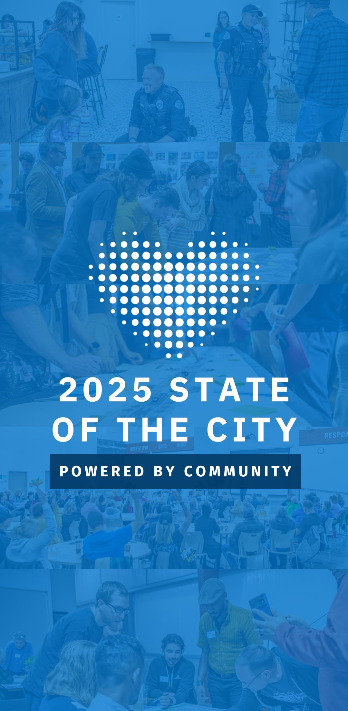

 [Skip to main content](http://www.cityofvancouver.us/stateofthecity#main)  [Skip to search](http://www.cityofvancouver.us/stateofthecity#search)  

# Meeting Details

      Registration Required 

## State of the City

##### Monday, March 24, 2025

 5:30 pm 

 Add to Calendar Monday, March 24, 2025 5:30 pm Monday, March 24, 2025 5:30 pm America/Los_Angeles State of the City Join Vancouver Mayor Anne McEnerny-Ogle and the Vancouver City Council for the 2025 State of the City Address and Council Community Forum. Doors open at 5:30 p.m. The speech begins at 6 p.m. Community forum begins at 6:45 p.m. RSVP Accessibility and interpretation Live American Sign Language interpretation will be provided. If you require any additional accessibility or language interpretation accommodations, please share those when you register or contact William Cooley at william.cooley@cityofvancouver.us or 360-487-8617. Parking Parking at the Firstenburg Community Center is free but may be limited due to the popularity of this active community space. We encourage you… Firstenburg Community Center 

### Event Dates

Firstenburg Community Center

700 N.E. 136th Vancouver, Washington

 [Directions](https://www.google.com/maps/?q=700%20N.E.%20136th%20Vancouver,%20Washington) 

Join Vancouver Mayor Anne McEnerny-Ogle and the Vancouver City Council for the 2025 State of the City Address and Council Community Forum.

 * Doors open at 5:30 p.m.
 * The speech begins at 6 p.m.
 * Community forum begins at 6:45 p.m.
  [RSVP](https://forms.office.com/Pages/ResponsePage.aspx?id=thltv2aShkapOlC1N9xYOshMfVBwBcJGtjvpS0kAK4ZUM01VUU1WOThNM1BKNUpWSkZCMldITTVLUy4u)  

### Accessibility and interpretation

Live American Sign Language interpretation will be provided. If you require any additional accessibility or language interpretation accommodations, please share those when you register or contact William Cooley at [william.cooley@cityofvancouver.us](mailto:William.cooley@cityofvancouver.us) or [360-487-8617](tel:+360-487-8617).

### Parking

Parking at the Firstenburg Community Center is free but may be limited due to the popularity of this active community space. We encourage you to walk, roll, carpool or take C-TRAN.

### Unable to attend?

The address will be streamed live on [Clark/Vancouver Television (CVTV)](http://www.cvtv.org) and the [City’s Facebook account.](http://www.facebook.com/vancouverus) 

 