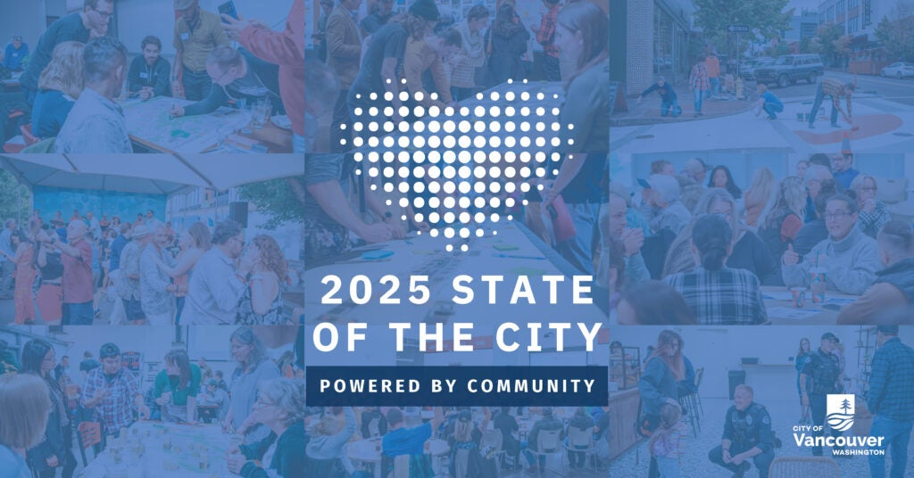

 [Skip to main content](https://www.cityofvancouver.us/vancouvers-state-of-the-city-and-council-community-forum/#main)  [Skip to search](https://www.cityofvancouver.us/vancouvers-state-of-the-city-and-council-community-forum/#search)     

 *  [Utility Bill](https://cityofvancouver.selectpaytoday.com/Utility/) 
 *  [Calendar](https://www.cityofvancouver.us/government/calendar/#tab2) 
 Search               

 *  [Services](https://www.cityofvancouver.us/services/) 
   *  [Utility Billing](https://www.cityofvancouver.us/services/utility-billing/) 
   *  [Parking](https://www.cityofvancouver.us/economic-prosperity-and-housing/parking/) 
     *  [Downtown Parking](https://www.cityofvancouver.us/economic-prosperity-and-housing/parking/downtown-parking/) 
     *  [Parking Tickets](https://www.cityofvancouver.us/economic-prosperity-and-housing/parking/parking-tickets/) 
     *  [Parking Portal](https://cityofvancouver.t2hosted.com/Account/Portal) 
   *  [Water, Sewer and Stormwater](https://www.cityofvancouver.us/government/department/public-works/water-sewer-and-stormwater/) 
   *  [Garbage and Recycling](https://www.cityofvancouver.us/services/garbage-recycling/) 
   *  [Event Planning and Permits](https://www.cityofvancouver.us/government/department/parks-recreation-and-cultural-services/event-planning-and-permits/) 
   *  [Urban Forestry](https://www.cityofvancouver.us/government/department/public-works/urban-forestry/) 
   *  [Report a concern](https://www.cityofvancouver.us/services/report-concern/) 
 *  [Business](https://www.cityofvancouver.us/business/) 
   *  [Economic Development](https://cityofvancouver.us/departments/economic-prosperity-housing/) 
   *  [Building Permits, Licenses, Inspections](https://www.cityofvancouver.us/business/permits-licenses-and-inspections/) 
     *  [ePermits](https://www.cityofvancouver.us/business/permits-licenses-and-inspections/epermits/) 
     *  [ePlans](https://www.cityofvancouver.us/business/permits-licenses-and-inspections/eplans/) 
   *  [Building and Construction](https://www.cityofvancouver.us/business/building-construction/) 
     *  [Residential Building Permits](https://www.cityofvancouver.us/business/building-construction/residential-building-permits/) 
     *  [Commercial Building Permits](https://www.cityofvancouver.us/business/building-construction/commercial-building-permits/) 
   *  [Business and Special Licenses](https://www.cityofvancouver.us/business/permits-licenses-and-inspections/business-and-special-licenses/) 
   *  [Planning, Development and Zoning](https://cityofvancouver.us/planning-development-and-zoning/) 
     *  [Land Use Development](https://www.cityofvancouver.us/business/planning-development-and-zoning/land-use-development/) 
     *  [Long Range Planning](https://cityofvancouver.us/long-range-planning/) 
     *  [Comprehensive Plan](https://www.cityofvancouver.us/business/planning-development-and-zoning/comprehensive-plan/) 
   *  [Procurement Services](https://www.cityofvancouver.us/business/procurement-services/) 
     *  [Bids and Proposals](https://cityofvancouver.bonfirehub.com/portal/?tab=openOpportunities) 
 *  [Government](https://www.cityofvancouver.us/government/) 
 *  [Community](https://www.cityofvancouver.us/community/) 
   *  [Be Heard Vancouver](https://www.beheardvancouver.org/) 
   *  [Newsroom](https://www.cityofvancouver.us/community/news/) 
   *  [Special Events](https://www.cityofvancouver.us/government/department/parks-recreation-and-cultural-services/special-events-in-vancouver/) 
   *  [Recreation Activities](https://www.cityofvancouver.us/government/department/parks-recreation-and-cultural-services/recreation-activities/) 
   *  [Parks and Trails](https://www.cityofvancouver.us/community/parks-trails/parkfinder/) 
     *  [Community Gardens](https://www.cityofvancouver.us/government/department/parks-recreation-and-cultural-services/community-gardens/) 
     *  [Public Art Map](https://city-of-vancouver-wa-geo-hub-cityofvancouver.hub.arcgis.com/apps/fa72863a21ea42c3b114d6e8a2be706a/explore) 
   *  [Culture, Arts and Heritage](https://www.cityofvancouver.us/government/department/parks-recreation-and-cultural-services/culture-arts-and-heritage/) 
   *  [Community Centers](https://www.cityofvancouver.us/community/community-centers/) 
     *  [Firstenburg Community Center](https://www.cityofvancouver.us/community/community-centers/firstenburg-community-center/) 
     *  [Marshall/Luepke Community Center](https://www.cityofvancouver.us/community/community-centers/marshall-luepke-center/) 
     *  [Water Resources Education Center](https://www.cityofvancouver.us/government/department/public-works/water-resources-education-center/) 
   *  [Volunteer Programs](https://www.cityofvancouver.us/government/department/parks-recreation-and-cultural-services/volunteer-programs/) 
   *  [Neighborhood Associations](https://www.cityofvancouver.us/community/neighborhoods/) 
   *  [Homelessness](https://www.cityofvancouver.us/city-managers-office/homeless/) 
   *  [Emergency Preparedness](https://www.cityofvancouver.us/community/emergency-preparedness/) 
   *  [Sister City Joyo, Japan](https://www.cityofvancouver.us/about-vancouver/sister-city-joyo-japan/) 
 *  [Data](https://city-of-vancouver-wa-geo-hub-cityofvancouver.hub.arcgis.com/) 

 *  [Mayor and City Council](https://cityofvancouver.us/departments/mayor-city-council/) 
   *  [Agendas and Minutes](https://www.cityofvancouver.us/government/mayor-and-city-council/meetings-agendas-minutes/) 
   *  [Council Meetings](https://www.cityofvancouver.us/government/calendar/) 
   *  [Community Testimony](https://www.cityofvancouver.us/departments/mayor-city-council/#testimony) 
   *  [Contact Council](https://cityofvancouver.us/departments/mayor-city-council/#form) 
 *  [City Manager’s Office](https://cityofvancouver.us/departments/city-managers-office/) 
   *  [City Liaison](https://www.cityofvancouver.us/city-managers-office/city-liaison-services/) 
   *  [Climate Action](https://www.cityofvancouver.us/city-managers-office/climate-action/) 
   *  [Communications](https://www.cityofvancouver.us/city-managers-office/communication/) 
   *  [Strategic Plan](https://www.cityofvancouver.us/government/strategic-plan/) 

 *  [Departments](https://www.cityofvancouver.us/government/department-directory/) 
   *  [City Attorney’s Office](https://www.cityofvancouver.us/departments/city-attorney/) 
   *  [Community Development](https://www.cityofvancouver.us/departments/community-development/) 
   *  [Economic Prosperity and Housing](https://www.cityofvancouver.us/departments/economic-prosperity-housing/) 
   *  [Financial and Management Services](https://www.cityofvancouver.us/departments/financial-management-services/) 
   *  [Vancouver Fire Department](https://www.cityofvancouver.us/departments/fire-department/) 
   *  [Human Resources](https://www.cityofvancouver.us/departments/hr/) 
   *  [Parks, Recreation and Cultural Services](https://www.cityofvancouver.us/departments/parks-recreation-and-cultural-services/) 
   *  [Vancouver Police Department](https://www.cityofvancouver.us/departments/police/) 
   *  [Public Works](https://www.cityofvancouver.us/departments/public-works/) 

 *  [Boards and Commissions](https://www.cityofvancouver.us/government/boards-commissions/) 
 *  [City Center Redevelopment Authority](https://www.cityofvancouver.us/government/city-center-redevelopment-authority/) 
 *  [Downtown Redevelopment Authority](https://www.cityofvancouver.us/government/downtown-redevelopment-authority/) 
 *  [Public Facilities District Board](https://www.cityofvancouver.us/government/public-facilities-district-board/) 
 *  [Transportation Benefit District](https://www.cityofvancouver.us/business/planning-development-and-zoning/transportation-planning/vancouver-transportation-benefit-district/) 
 *  [Interlocal Agreements](https://www.cityofvancouver.us/government/department/financial-and-management-services/interlocal-agreements/) 
 *  [Municipal Code](https://vancouver.municipal.codes/) 
 *  [City Charter](https://www.cityofvancouver.us/government/city-charter/) 
 *  [Public Records Request](https://www.cityofvancouver.us/government/public-records-request/) 
 *  [Budget](https://www.cityofvancouver.us/government/department/financial-and-management-services/budget/) 
 *  [Awards and Recognition](https://www.cityofvancouver.us/about-vancouver/awards-recognition/) 

 1.  [Home](https://www.cityofvancouver.us) 
 1.  [Community](https://www.cityofvancouver.us/community) 
 1.  [Newsroom](https://www.cityofvancouver.us/news) 
 1. Vancouver’s State of the City and Council Community Forum 

# NEWS DETAILS

## Vancouver’s State of the City and Council Community Forum 

March 13, 2025

  

City of Vancouver Mayor Anne McEnerny-Ogle and the Vancouver City Council will host the 2025 State of the City and Council Community Forum at 6 p.m. Monday, March 24. Mayor McEnerny-Ogle’s address will highlight the progress we’ve made together on key issues – community safety, homelessness, affordable housing and economic opportunity – and how the community’s voice continues to power decisions about Vancouver’s future.

Guests are invited to stay after the speech to meet, in person, with City councilors at the first Council Community Forum of the year. 

 __What:__ 2025 State of the City and Council Community Forum 

 __Who:__ Mayor Anne McEnerny-Ogle will present a brief State of the City address highlighting the progress being made on key issues that are priorities to the community. The mayor’s remarks will be followed by a Council Community Forum, where guests are invited to hold conversations with the mayor and councilors. 

 __When:__ 6 p.m. Monday, March 24. Doors open at 5:30 p.m. Due to space constraints at the venue, RSVPs for the event are encouraged and can be made at [www.cityofvancouver.us/stateofthecity](http://www.cityofvancouver.us/stateofthecity). The City will make every effort to accommodate those who arrive without previously RSVPing to the event. 

The State of the City address will be streamed live–and available for on-demand viewing on Clark/Vancouver Television (CVTV) channel 23 and HD 323 and the City’s  [Facebook](http://www.facebook.com/VANCOUVERUS).   

 __Where:__ Firstenburg Community Center Community Room, 700 N.E 136th Ave., Vancouver. Media may park in the free lot at Firstenburg Community Center but should be aware that seating and space at the venue will be limited.  

***

Media contacts: Laura Shepard, Communications Director, [laura.shepard@cityofvancouver.us](mailto:laura.shepard@cityofvancouver.us)  

Tim Becker, Strategic Communications Manager, [tim.becker@cityofvancouver.us](mailto:tim.becker@cityofvancouver.us)   

    

 *  [Facebook](http://www.facebook.com/VancouverUS) 
 *  [Twitter](http://twitter.com/vancouverUS) 
 *  [Instagram](https://instagram.com/VancouverUS) 
 *  [LinkedIn](https://www.linkedin.com/company/city-of-vancouver-washington) 
 *  [YouTube](https://www.youtube.com/user/CityofVancouverUS) 

 [City Hall415 W. 6th St.Vancouver, WA 98660](https://www.google.com/maps?q=City%20Hall%20415%20W.%206th%20St.,%20WA%2098660) 

  [CONTACT](https://www.cityofvancouver.us/contact/)  

##### RESOURCES

 *  [Accessibility](https://www.cityofvancouver.us/city-managers-office/accessibility-and-inclusion-at-the-city-of-vancouver-for-people-with-disabilities/) 
 *  [ePlans](https://www.cityofvancouver.us/business/permits-licenses-and-inspections/eplans/) 
 *  [Jobs with the City](https://cityofvancouver.us/jobs/) 
 *  [Make a Payment](https://cityofvancouver.us/pay-bills-manage-accounts/) 
 *  [Maps](https://city-of-vancouver-wa-geo-hub-cityofvancouver.hub.arcgis.com/) 
 *  [Municipal Code](https://vancouver.municipal.codes/) 
 *  [Permit Center](https://cityofvancouver.us/business/permits-licenses-and-inspections/) 
 *  [Public Records](https://cityofvancouver.us/government/public-records-request/) 

##### COMMUNITY

 *  [About Vancouver](https://www.cityofvancouver.us/about-vancouver/) 
 *  [Climate Action](https://www.cityofvancouver.us/city-managers-office/climate-action/) 
 *  [Firstenburg Community Center](https://www.cityofvancouver.us/community/community-centers/firstenburg-community-center/) 
 *  [Marshall/Luepke Community Center](https://www.cityofvancouver.us/community/community-centers/marshall-luepke-center/) 
 *  [Neighborhood Associations](https://www.cityofvancouver.us/community/neighborhoods/) 
 *  [Public Art Map](https://city-of-vancouver-wa-geo-hub-cityofvancouver.hub.arcgis.com/apps/fa72863a21ea42c3b114d6e8a2be706a/explore) 
 *  [Water Resources Education Center](https://www.cityofvancouver.us/government/department/public-works/water-resources-education-center/) 

##### DEPARTMENTS

 *  [City Attorney’s Office](https://www.cityofvancouver.us/government/department/city-attorneys-office/) 
 *  [City Manager’s Office](https://www.cityofvancouver.us/city-managers-office/) 
 *  [Community Development](https://www.cityofvancouver.us/government/community-development/) 
 *  [Economic Prosperity and Housing](https://www.cityofvancouver.us/economic-prosperity-and-housing/) 
 *  [Financial and Management Services](https://www.cityofvancouver.us/government/department/financial-and-management-services/) 
 *  [Fire](https://www.cityofvancouver.us/government/department/vancouver-fire-department-vfd/) 
 *  [Human Resources](https://www.cityofvancouver.us/government/department/human-resources-hr/) 
 *  [Parks, Recreation, and Cultural Services](https://www.cityofvancouver.us/government/department/parks-recreation-and-cultural-services/) 
 *  [Police](https://www.cityofvancouver.us/government/department/vancouver-police-department-vpd/) 
 *  [Public Works](https://cityofvancouver.us/departments/public-works/) 

 *  [Employee Portal](https://cityofvancouver.us/employee-portal/) 
 *  [Website Feedback](https://www.cityofvancouver.us/website-feedback/) 
 *  [Policies](https://cityofvancouver.us/policies/) 
 *  [© City of Vancouver]() 
 