 [Skip to main content](https://www.cityofvancouver.us/government/calendar/#main)  [Skip to search](https://www.cityofvancouver.us/government/calendar/#search)     

 *  [Utility Bill](https://cityofvancouver.selectpaytoday.com/Utility/) 
 *  [Calendar](https://www.cityofvancouver.us/government/calendar/#tab2) 
 Search               

 *  [Services](https://www.cityofvancouver.us/services/) 
   *  [Utility Billing](https://www.cityofvancouver.us/services/utility-billing/) 
   *  [Parking](https://www.cityofvancouver.us/economic-prosperity-and-housing/parking/) 
     *  [Downtown Parking](https://www.cityofvancouver.us/economic-prosperity-and-housing/parking/downtown-parking/) 
     *  [Parking Tickets](https://www.cityofvancouver.us/economic-prosperity-and-housing/parking/parking-tickets/) 
     *  [Parking Portal](https://cityofvancouver.t2hosted.com/Account/Portal) 
   *  [Water, Sewer and Stormwater](https://www.cityofvancouver.us/government/department/public-works/water-sewer-and-stormwater/) 
   *  [Garbage and Recycling](https://www.cityofvancouver.us/services/garbage-recycling/) 
   *  [Event Planning and Permits](https://www.cityofvancouver.us/government/department/parks-recreation-and-cultural-services/event-planning-and-permits/) 
   *  [Urban Forestry](https://www.cityofvancouver.us/government/department/public-works/urban-forestry/) 
   *  [Report a concern](https://www.cityofvancouver.us/services/report-concern/) 
 *  [Business](https://www.cityofvancouver.us/business/) 
   *  [Economic Development](https://cityofvancouver.us/departments/economic-prosperity-housing/) 
   *  [Building Permits, Licenses, Inspections](https://www.cityofvancouver.us/business/permits-licenses-and-inspections/) 
     *  [ePermits](https://www.cityofvancouver.us/business/permits-licenses-and-inspections/epermits/) 
     *  [ePlans](https://www.cityofvancouver.us/business/permits-licenses-and-inspections/eplans/) 
   *  [Building and Construction](https://www.cityofvancouver.us/business/building-construction/) 
     *  [Residential Building Permits](https://www.cityofvancouver.us/business/building-construction/residential-building-permits/) 
     *  [Commercial Building Permits](https://www.cityofvancouver.us/business/building-construction/commercial-building-permits/) 
   *  [Business and Special Licenses](https://www.cityofvancouver.us/business/permits-licenses-and-inspections/business-and-special-licenses/) 
   *  [Planning, Development and Zoning](https://cityofvancouver.us/planning-development-and-zoning/) 
     *  [Land Use Development](https://www.cityofvancouver.us/business/planning-development-and-zoning/land-use-development/) 
     *  [Long Range Planning](https://cityofvancouver.us/long-range-planning/) 
     *  [Comprehensive Plan](https://www.cityofvancouver.us/business/planning-development-and-zoning/comprehensive-plan/) 
   *  [Procurement Services](https://www.cityofvancouver.us/business/procurement-services/) 
     *  [Bids and Proposals](https://cityofvancouver.bonfirehub.com/portal/?tab=openOpportunities) 
 *  [Government](https://www.cityofvancouver.us/government/) 
 *  [Community](https://www.cityofvancouver.us/community/) 
   *  [Be Heard Vancouver](https://www.beheardvancouver.org/) 
   *  [Newsroom](https://www.cityofvancouver.us/community/news/) 
   *  [Special Events](https://www.cityofvancouver.us/government/department/parks-recreation-and-cultural-services/special-events-in-vancouver/) 
   *  [Recreation Activities](https://www.cityofvancouver.us/government/department/parks-recreation-and-cultural-services/recreation-activities/) 
   *  [Parks and Trails](https://www.cityofvancouver.us/community/parks-trails/parkfinder/) 
     *  [Community Gardens](https://www.cityofvancouver.us/government/department/parks-recreation-and-cultural-services/community-gardens/) 
     *  [Public Art Map](https://city-of-vancouver-wa-geo-hub-cityofvancouver.hub.arcgis.com/apps/fa72863a21ea42c3b114d6e8a2be706a/explore) 
   *  [Culture, Arts and Heritage](https://www.cityofvancouver.us/government/department/parks-recreation-and-cultural-services/culture-arts-and-heritage/) 
   *  [Community Centers](https://www.cityofvancouver.us/community/community-centers/) 
     *  [Firstenburg Community Center](https://www.cityofvancouver.us/community/community-centers/firstenburg-community-center/) 
     *  [Marshall/Luepke Community Center](https://www.cityofvancouver.us/community/community-centers/marshall-luepke-center/) 
     *  [Water Resources Education Center](https://www.cityofvancouver.us/government/department/public-works/water-resources-education-center/) 
   *  [Volunteer Programs](https://www.cityofvancouver.us/government/department/parks-recreation-and-cultural-services/volunteer-programs/) 
   *  [Neighborhood Associations](https://www.cityofvancouver.us/community/neighborhoods/) 
   *  [Homelessness](https://www.cityofvancouver.us/city-managers-office/homeless/) 
   *  [Emergency Preparedness](https://www.cityofvancouver.us/community/emergency-preparedness/) 
   *  [Sister City Joyo, Japan](https://www.cityofvancouver.us/about-vancouver/sister-city-joyo-japan/) 
 *  [Data](https://city-of-vancouver-wa-geo-hub-cityofvancouver.hub.arcgis.com/) 

 *  [Mayor and City Council](https://cityofvancouver.us/departments/mayor-city-council/) 
   *  [Agendas and Minutes](https://www.cityofvancouver.us/government/mayor-and-city-council/meetings-agendas-minutes/) 
   *  [Council Meetings](https://www.cityofvancouver.us/government/calendar/) 
   *  [Community Testimony](https://www.cityofvancouver.us/departments/mayor-city-council/#testimony) 
   *  [Contact Council](https://cityofvancouver.us/departments/mayor-city-council/#form) 
 *  [City Manager’s Office](https://cityofvancouver.us/departments/city-managers-office/) 
   *  [City Liaison](https://www.cityofvancouver.us/city-managers-office/city-liaison-services/) 
   *  [Climate Action](https://www.cityofvancouver.us/city-managers-office/climate-action/) 
   *  [Communications](https://www.cityofvancouver.us/city-managers-office/communication/) 
   *  [Strategic Plan](https://www.cityofvancouver.us/government/strategic-plan/) 

 *  [Departments](https://www.cityofvancouver.us/government/department-directory/) 
   *  [City Attorney’s Office](https://www.cityofvancouver.us/departments/city-attorney/) 
   *  [Community Development](https://www.cityofvancouver.us/departments/community-development/) 
   *  [Economic Prosperity and Housing](https://www.cityofvancouver.us/departments/economic-prosperity-housing/) 
   *  [Financial and Management Services](https://www.cityofvancouver.us/departments/financial-management-services/) 
   *  [Vancouver Fire Department](https://www.cityofvancouver.us/departments/fire-department/) 
   *  [Human Resources](https://www.cityofvancouver.us/departments/hr/) 
   *  [Parks, Recreation and Cultural Services](https://www.cityofvancouver.us/departments/parks-recreation-and-cultural-services/) 
   *  [Vancouver Police Department](https://www.cityofvancouver.us/departments/police/) 
   *  [Public Works](https://www.cityofvancouver.us/departments/public-works/) 

 *  [Boards and Commissions](https://www.cityofvancouver.us/government/boards-commissions/) 
 *  [City Center Redevelopment Authority](https://www.cityofvancouver.us/government/city-center-redevelopment-authority/) 
 *  [Downtown Redevelopment Authority](https://www.cityofvancouver.us/government/downtown-redevelopment-authority/) 
 *  [Public Facilities District Board](https://www.cityofvancouver.us/government/public-facilities-district-board/) 
 *  [Transportation Benefit District](https://www.cityofvancouver.us/business/planning-development-and-zoning/transportation-planning/vancouver-transportation-benefit-district/) 
 *  [Interlocal Agreements](https://www.cityofvancouver.us/government/department/financial-and-management-services/interlocal-agreements/) 
 *  [Municipal Code](https://vancouver.municipal.codes/) 
 *  [City Charter](https://www.cityofvancouver.us/government/city-charter/) 
 *  [Public Records Request](https://www.cityofvancouver.us/government/public-records-request/) 
 *  [Budget](https://www.cityofvancouver.us/government/department/financial-and-management-services/budget/) 
 *  [Awards and Recognition](https://www.cityofvancouver.us/about-vancouver/awards-recognition/) 

 1.  [Home](https://www.cityofvancouver.us) 
 1.  [Government](https://www.cityofvancouver.us/government/) 
 1. Calendar

# Calendar

 *  [Meetings](https://www.cityofvancouver.us/government/calendar/#tab1) 
 *  [Events](https://www.cityofvancouver.us/government/calendar/#tab2) 

## Meetings

 SEARCH MEETINGS MonthJanuaryFebruaryMarchAprilMayJuneJulyAugustSeptemberOctoberNovemberDecemberYear2025202420232022 FILTER By CategoryBoardCity CouncilCommissionCommitteeConferenceHearing  [✕ Reset](https://www.cityofvancouver.us/calendar)  

#### 

  [< Past](https://www.cityofvancouver.us/government/calendar/?meeting=past#tab1)  Monday Mar 24, 2025

5:30pm Registration Required 

### State of the City

Firstenburg Community Center

      

Monday, March 24, 2025

5:30pm

 700 NE 136th Ave, Vancouver, WA 98684 

  [**Add to Calendar](https://www.cityofvancouver.us/government/calendar/#)  Mar. 24, 2025 5:30pm Mar. 24, 2025 America/Los_Angeles State of the City Join Vancouver Mayor Anne McEnerny-Ogle and the Vancouver City Council for the 2025 State of the City Address and Council Community Forum. Doors open at 5:30 p.m. The speech begins at 6 p.m. Community forum begins at 6:45 p.m. RSVP Accessibility and interpretation Live American Sign Language interpretation will be provided. If you require any additional accessibility or language interpretation accommodations, please share those when you register or contact William Cooley at william.cooley@cityofvancouver.us or 360-487-8617. Parking Parking at the Firstenburg Community Center is free but may be limited due to the popularity of this active community space. We encourage you… Firstenburg Community Center 

Join Vancouver Mayor Anne McEnerny-Ogle and the Vancouver City Council for the 2025 State of the City Address and Council Community Forum.

 * Doors open at 5:30 p.m.
 * The speech begins at 6 p.m.
 * Community forum begins at 6:45 p.m.

  [RSVP](https://forms.office.com/Pages/ResponsePage.aspx?id=thltv2aShkapOlC1N9xYOshMfVBwBcJGtjvpS0kAK4ZUM01VUU1WOThNM1BKNUpWSkZCMldITTVLUy4u)  

### Accessibility and interpretation

Live American Sign Language interpretation will be provided. If you require any additional accessibility or language interpretation accommodations, please share those when you register or contact William Cooley at [william.cooley@cityofvancouver.us](mailto:William.cooley@cityofvancouver.us) or [360-487-8617](tel:+360-487-8617).

### Parking

Parking at the Firstenburg Community Center is free but may be limited due to the popularity of this active community space. We encourage you to walk, roll, carpool or take C-TRAN.

### Unable to attend?

The address will be streamed live on [Clark/Vancouver Television (CVTV)](http://www.cvtv.org) and the [City’s Facebook account.](http://www.facebook.com/vancouverus) 

 [Meeting Details](https://www.cityofvancouver.us/events/state-of-the-city/) 

 Monday Mar 24, 2025

6:45pm - 8:30pm 

### City Council Community Forum

Firstenburg Community Center

      

Monday, March 24, 2025

6:45pm - 8:30pm

 700 NE 136th Ave, Vancouver, WA 98684 

  [**Add to Calendar](https://www.cityofvancouver.us/government/calendar/#)  Mar. 24, 2025 6:45pm Mar. 24, 2025 8:30 pm America/Los_Angeles City Council Community Forum To immediately follow the State of the City. The location of the Vancouver City Council Community Forum will be at the Firstenburg Community Center. Following the State of the City, the City Council will host an in-person Community Forum. The Community forum will run for up to 90 minutes or end earlier if all who wish to speak have had an opportunity. The Community Forum is a special event for the public to discuss with the Council in an informal setting about any topic. Additional information can be found at State of the City -The City of Vancouver, WA Accessibility… Firstenburg Community Center 

To immediately follow the State of the City.

The location of the Vancouver City Council Community Forum will be at the Firstenburg Community Center. Following the State of the City, the City Council will host an in-person Community Forum.

The Community forum will run for up to 90 minutes or end earlier if all who wish to speak have had an opportunity. The Community Forum is a special event for the public to discuss with the Council in an informal setting about any topic.

Additional information can be found at [State of the City -The City of Vancouver, WA](https://www.cityofvancouver.us/events/state-of-the-city/) 

## Accessibility and interpretation

Live American Sign Language, Spanish (Español) and Russian (Русский) interpretation will be provided. If you require any additional accessibility or language interpretation accommodations, please share those when you register or contact William Cooley at [william.cooley@cityofvancouver.us](mailto:William.cooley@cityofvancouver.us) or [360-487-8617](tel:+360-487-8617).

## Parking

Parking at the Firstenburg Community Center is free but may be limited due to the popularity of this active community space. We encourage you to walk, roll, carpool or take C-TRAN.

View all [Council agendas and minutes](https://cityofvancouver.us/government/mayor-and-city-council/meetings-agendas-minutes/).

 [Meeting Details](https://www.cityofvancouver.us/events/city-council-community-forum-9/) 

 Wednesday Mar 26, 2025

6:00pm 

### Special Urban Forestry Commission Meeting

City Hall, Birch Room

      

Wednesday, March 26, 2025

6:00pm

City Hall, Birch Room

  [**Add to Calendar](https://www.cityofvancouver.us/government/calendar/#)  Mar. 26, 2025 6:00pm Mar. 26, 2025 America/Los_Angeles Special Urban Forestry Commission Meeting City Hall, Birch Room 

 Contact: Jessica George at jessica.george@cityofvancouver.us or 360-487-8308

 [Meeting Details](https://www.cityofvancouver.us/events/special-urban-forestry-commission-meeting/) 

 Thursday Mar 27, 2025

9:00am - 11:00am 

### Pre-Application Conference

      

Thursday, March 27, 2025

9:00am - 11:00am

  [**Add to Calendar](https://www.cityofvancouver.us/government/calendar/#)  Mar. 27, 2025 9:00am Mar. 27, 2025 11:00 am America/Los_Angeles Pre-Application Conference 

###  __Agenda:__ 

 *  [Agenda Summary](https://www.cityofvancouver.us/wp-content/uploads/2025/03/03-27-2025-Agenda.pdf) 

 [Meeting Details](https://www.cityofvancouver.us/events/pre-application-conference-58/) 

 Tuesday Apr 1, 2025

4:00pm - 8:00pm 

### Transportation and Mobility Commission Meeting

City Hall, Aspen Room

      

Tuesday, April 1, 2025

4:00pm - 8:00pm

 415 W 6th St, Vancouver, WA 98660 

  [**Add to Calendar](https://www.cityofvancouver.us/government/calendar/#)  Apr. 01, 2025 4:00pm Apr. 01, 2025 8:00 pm America/Los_Angeles Transportation and Mobility Commission Meeting Testify before the Transportation and Mobility Commission View meeting agenda and minutes City Hall, Aspen Room 

 *   

 [Meeting Link](https://us02web.zoom.us/j/89499807796)   

 Contact: Transportation and Mobility Commission at TMC@cityofvancouver.us  

 [Testify before the Transportation and Mobility Commission](https://cityofvancouver.us/government/boards-commissions/testify-before-the-transportation-and-mobility-commission/) 

 [View meeting agenda and minutes](https://vancouverwa.portal.civicclerk.com/?category_id=32) 

 [Meeting Details](https://www.cityofvancouver.us/events/transportation-and-mobility-commission-meeting-35/) 

 Wednesday Apr 2, 2025

1:00pm - 2:00pm 

### Healthcare Benefit Program Governing Board Meeting

City Hall, Cedar Room

      

Wednesday, April 2, 2025

1:00pm - 2:00pm

 415 W 6th St, Vancouver, WA 98660 

  [**Add to Calendar](https://www.cityofvancouver.us/government/calendar/#)  Apr. 02, 2025 1:00pm Apr. 02, 2025 2:00 pm America/Los_Angeles Healthcare Benefit Program Governing Board Meeting City Hall, Cedar Room 

 *   

 [Meeting Link](https://teams.microsoft.com/l/meetup-join/19%3ameeting_MjlkODQwMzctZDc3NC00OTQ2LWFhODktMzI0YmNmZGNhZGM3%40thread.v2/0?context=%7b%22Tid%22%3a%22bf6d19b6-9266-4686-a93a-50b537dc583a%22%2c%22Oid%22%3a%221c4870ed-a8f9-4469-b49b-cf1cdfa1bd94%22%7d)   

 Contact: Iasmina Giurgiev at iasmina.giurgiev@cityofvancouver.us or 360-487-8401  

###  __Agenda:__ 

 *  [Agenda Summary](https://www.cityofvancouver.us/wp-content/uploads/2025/03/4-2-25-Healthcare-Governing-Board-Agenda.pdf) 

 [Meeting Details](https://www.cityofvancouver.us/events/healthcare-benefit-program-governing-board-meeting-49/) 

 Monday Apr 7, 2025

1:30pm - 2:00pm 

### Police Pension Board Meeting

City Hall, Aspen Conference Room

      

Monday, April 7, 2025

1:30pm - 2:00pm

 415 W 6th St, Vancouver, WA 98660 

  [**Add to Calendar](https://www.cityofvancouver.us/government/calendar/#)  Apr. 07, 2025 1:30pm Apr. 07, 2025 2:00 pm America/Los_Angeles Police Pension Board Meeting City Hall, Aspen Conference Room 

 *   

 [Meeting Link](https://teams.microsoft.com/l/meetup-join/19%3ameeting_NTI1ZDhiY2YtZjQwNS00Mjg3LWI0MjktYzY2ZWQ3YzhiMGJm%40thread.v2/0?context=%7b%22Tid%22%3a%22bf6d19b6-9266-4686-a93a-50b537dc583a%22%2c%22Oid%22%3a%221c4870ed-a8f9-4469-b49b-cf1cdfa1bd94%22%7d)   

 Contact: Caylee Trant at caylee.trant@cityofvancouver.us or 360-487-8403  

 [Meeting Details](https://www.cityofvancouver.us/events/police-pension-board-meeting-9/) 

 Monday Apr 7, 2025

2:00pm - 2:30pm 

### Fire Pension Board Meeting

City Hall, Aspen Conference Room

      

Monday, April 7, 2025

2:00pm - 2:30pm

 415 W 6th St, Vancouver, WA 98660 

  [**Add to Calendar](https://www.cityofvancouver.us/government/calendar/#)  Apr. 07, 2025 2:00pm Apr. 07, 2025 2:30 pm America/Los_Angeles Fire Pension Board Meeting City Hall, Aspen Conference Room 

 *   

 [Meeting Link](https://teams.microsoft.com/l/meetup-join/19%3ameeting_YmFlMGM0OTgtMWU2OS00OTVhLThkNzAtOTI4ZDYxMmI5YzZi%40thread.v2/0?context=%7b%22Tid%22%3a%22bf6d19b6-9266-4686-a93a-50b537dc583a%22%2c%22Oid%22%3a%221c4870ed-a8f9-4469-b49b-cf1cdfa1bd94%22%7d)   

 Contact: Caylee Trant at caylee.trant@cityofvancouver.us or 360-487-8403  

 [Meeting Details](https://www.cityofvancouver.us/events/fire-pension-board-meeting-5/) 

 Monday Apr 7, 2025

4:00pm - 6:00pm 

### City Council Workshop

City Hall

      

Monday, April 7, 2025

4:00pm - 6:00pm

 415 W 6th St, Vancouver, WA 98660 

  [**Add to Calendar](https://www.cityofvancouver.us/government/calendar/#)  Apr. 07, 2025 4:00pm Apr. 07, 2025 6:00 pm America/Los_Angeles City Council Workshop View all Council agendas and minutes. City Hall 

View all [Council agendas and minutes](https://www.cityofvancouver.us/government/mayor-and-city-council/meetings-agendas-minutes/).

 [Meeting Details](https://www.cityofvancouver.us/events/city-council-workshop-46/) 

 Monday Apr 7, 2025

6:30pm - 8:30pm 

### City Council Meeting

City Hall

      

Monday, April 7, 2025

6:30pm - 8:30pm

 415 W 6th St, Vancouver, WA 98660 

  [**Add to Calendar](https://www.cityofvancouver.us/government/calendar/#)  Apr. 07, 2025 6:30pm Apr. 07, 2025 8:30 pm America/Los_Angeles City Council Meeting View all Council agendas and minutes. City Hall 

View all [Council agendas and minutes](https://cityofvancouver.us/government/mayor-and-city-council/meetings-agendas-minutes/).

 [Meeting Details](https://www.cityofvancouver.us/events/city-council-meeting-62/) 

 Tuesday Apr 8, 2025

5:00pm - 8:00pm 

### Planning Commission Meeting

City Hall, Council Chambers

      

Tuesday, April 8, 2025

5:00pm - 8:00pm

 415 W 6th St, Vancouver, WA 98660 

  [**Add to Calendar](https://www.cityofvancouver.us/government/calendar/#)  Apr. 08, 2025 5:00pm Apr. 08, 2025 8:00 pm America/Los_Angeles Planning Commission Meeting Testify before the Planning Commission View meeting agenda and minutes City Hall, Council Chambers 

 *   

 [Meeting Link](https://us02web.zoom.us/j/88434725862)   

 Contact: Planning Commission at PlanningCommission@cityofvancouver.us  

 [Testify before the Planning Commission](https://cityofvancouver.us/government/boards-commissions/testify-before-the-planning-commission/) 

 [View meeting agenda and minutes](https://vancouverwa.portal.civicclerk.com/?category_id=30) 

 [Meeting Details](https://www.cityofvancouver.us/events/planning-commission-meeting-35/) 

 Wednesday Apr 9, 2025

8:00am - 9:00am 

### Parking Advisory Committee Meeting

City Hall, Aspen Conference Room

      

Wednesday, April 9, 2025

8:00am - 9:00am

 415 W 6th St, Vancouver, WA 98660 

  [**Add to Calendar](https://www.cityofvancouver.us/government/calendar/#)  Apr. 09, 2025 8:00am Apr. 09, 2025 9:00 am America/Los_Angeles Parking Advisory Committee Meeting View meeting agenda and minutes City Hall, Aspen Conference Room 

 Contact: Tina Picchioni at tina.picchioni@cityofvancouver.us or 360-487-8657

 [View meeting agenda and minutes](https://vancouverwa.portal.civicclerk.com/?category_id=39) 

 [Meeting Details](https://www.cityofvancouver.us/events/parking-advisory-committee-meeting-15/) 

 Monday Apr 14, 2025

4:00pm - 6:00pm 

### City Council Workshop

City Hall

      

Monday, April 14, 2025

4:00pm - 6:00pm

 415 W 6th St, Vancouver, WA 98660 

  [**Add to Calendar](https://www.cityofvancouver.us/government/calendar/#)  Apr. 14, 2025 4:00pm Apr. 14, 2025 6:00 pm America/Los_Angeles City Council Workshop View all Council agendas and minutes. City Hall 

View all [Council agendas and minutes](https://www.cityofvancouver.us/government/mayor-and-city-council/meetings-agendas-minutes/).

 [Meeting Details](https://www.cityofvancouver.us/events/city-council-workshop-47/) 

 Monday Apr 14, 2025

6:30pm - 8:30pm 

### City Council Meeting

City Hall

      

Monday, April 14, 2025

6:30pm - 8:30pm

 415 W 6th St, Vancouver, WA 98660 

  [**Add to Calendar](https://www.cityofvancouver.us/government/calendar/#)  Apr. 14, 2025 6:30pm Apr. 14, 2025 8:30 pm America/Los_Angeles City Council Meeting View all Council agendas and minutes. City Hall 

View all [Council agendas and minutes](https://cityofvancouver.us/government/mayor-and-city-council/meetings-agendas-minutes/).

 [Meeting Details](https://www.cityofvancouver.us/events/city-council-meeting-63/) 

 Wednesday Apr 16, 2025

8:00am - 10:00am 

### Civil Service Commission Meeting

City Hall, Birch Conference Room

      

Wednesday, April 16, 2025

8:00am - 10:00am

 415 W 6th St, Vancouver, WA 98660 

  [**Add to Calendar](https://www.cityofvancouver.us/government/calendar/#)  Apr. 16, 2025 8:00am Apr. 16, 2025 10:00 am America/Los_Angeles Civil Service Commission Meeting View meeting agenda and minutes City Hall, Birch Conference Room 

 *   

 [Meeting Link](https://teams.microsoft.com/l/meetup-join/19%3ameeting_NjRhZWM5MDktNWFjNS00ZGM2LTgwYjItN2I5ZjdiYzYxZmM3%40thread.v2/0?context=%7b%22Tid%22%3a%22bf6d19b6-9266-4686-a93a-50b537dc583a%22%2c%22Oid%22%3a%22a385cff6-dbaf-445b-9d58-29a8d6d06b3d%22%7d)   

 Contact: Megan Mairs at megan.mairs@cityofvancouver.us  

 [View meeting agenda and minutes](https://vancouverwa.portal.civicclerk.com/?category_id=29) 

 [Meeting Details](https://www.cityofvancouver.us/events/civil-service-commission-meeting-19/) 

 Wednesday Apr 16, 2025

4:30pm - 6:00pm 

### Parks and Recreation Advisory Commission Meeting

City Hall, Aspen Room

      

Wednesday, April 16, 2025

4:30pm - 6:00pm

 415 W 6th St, Vancouver, WA 98660 

  [**Add to Calendar](https://www.cityofvancouver.us/government/calendar/#)  Apr. 16, 2025 4:30pm Apr. 16, 2025 6:00 pm America/Los_Angeles Parks and Recreation Advisory Commission Meeting View meeting agenda and minutes City Hall, Aspen Room 

 *   

 [Meeting Link](https://teams.microsoft.com/l/meetup-join/19%3ameeting_NjQ4M2M3MjgtNDI4OS00ZTlhLWE2NzgtMzAzZGYyODI1MDIz%40thread.v2/0?context=%7b%22Tid%22%3a%22bf6d19b6-9266-4686-a93a-50b537dc583a%22%2c%22Oid%22%3a%2257cb9a2b-b877-4cd1-9428-cc20fd77ed83%22%7d)   

 [View meeting agenda and minutes](https://vancouverwa.portal.civicclerk.com/?category_id=31) 

 [Meeting Details](https://www.cityofvancouver.us/events/parks-and-recreation-advisory-commission-meeting-18/) 

 Monday Apr 21, 2025

4:00pm - 6:00pm 

### City Council Workshop

City Hall

      

Monday, April 21, 2025

4:00pm - 6:00pm

 415 W 6th St, Vancouver, WA 98660 

  [**Add to Calendar](https://www.cityofvancouver.us/government/calendar/#)  Apr. 21, 2025 4:00pm Apr. 21, 2025 6:00 pm America/Los_Angeles City Council Workshop View all Council agendas and minutes. City Hall 

View all [Council agendas and minutes](https://www.cityofvancouver.us/government/mayor-and-city-council/meetings-agendas-minutes/).

 [Meeting Details](https://www.cityofvancouver.us/events/city-council-workshop-48/) 

 Monday Apr 21, 2025

6:30pm - 8:30pm 

### City Council Meeting

City Hall

      

Monday, April 21, 2025

6:30pm - 8:30pm

 415 W 6th St, Vancouver, WA 98660 

  [**Add to Calendar](https://www.cityofvancouver.us/government/calendar/#)  Apr. 21, 2025 6:30pm Apr. 21, 2025 8:30 pm America/Los_Angeles City Council Meeting View all Council agendas and minutes. City Hall 

View all [Council agendas and minutes](https://cityofvancouver.us/government/mayor-and-city-council/meetings-agendas-minutes/).

 [Meeting Details](https://www.cityofvancouver.us/events/city-council-meeting-64/) 

 Monday Apr 28, 2025

4:00pm - 6:00pm 

### City Council Workshop

City Hall

      

Monday, April 28, 2025

4:00pm - 6:00pm

 415 W 6th St, Vancouver, WA 98660 

  [**Add to Calendar](https://www.cityofvancouver.us/government/calendar/#)  Apr. 28, 2025 4:00pm Apr. 28, 2025 6:00 pm America/Los_Angeles City Council Workshop View all Council agendas and minutes. City Hall 

View all [Council agendas and minutes](https://www.cityofvancouver.us/government/mayor-and-city-council/meetings-agendas-minutes/).

 [Meeting Details](https://www.cityofvancouver.us/events/city-council-workshop-49/) 

 Monday Apr 28, 2025

6:30pm - 8:30pm 

### City Council Meeting

City Hall

      

Monday, April 28, 2025

6:30pm - 8:30pm

 415 W 6th St, Vancouver, WA 98660 

  [**Add to Calendar](https://www.cityofvancouver.us/government/calendar/#)  Apr. 28, 2025 6:30pm Apr. 28, 2025 8:30 pm America/Los_Angeles City Council Meeting View all Council agendas and minutes. City Hall 

View all [Council agendas and minutes](https://cityofvancouver.us/government/mayor-and-city-council/meetings-agendas-minutes/).

 [Meeting Details](https://www.cityofvancouver.us/events/city-council-meeting-65/) 

 Monday May 5, 2025

2:00pm - 2:30pm 

### Police Pension Board Meeting

City Hall, Aspen Conference Room

      

Monday, May 5, 2025

2:00pm - 2:30pm

 415 W 6th St, Vancouver, WA 98660 

  [**Add to Calendar](https://www.cityofvancouver.us/government/calendar/#)  May. 05, 2025 2:00pm May. 05, 2025 2:30 pm America/Los_Angeles Police Pension Board Meeting City Hall, Aspen Conference Room 

 *   

 [Meeting Link](https://teams.microsoft.com/l/meetup-join/19%3ameeting_NTI1ZDhiY2YtZjQwNS00Mjg3LWI0MjktYzY2ZWQ3YzhiMGJm%40thread.v2/0?context=%7b%22Tid%22%3a%22bf6d19b6-9266-4686-a93a-50b537dc583a%22%2c%22Oid%22%3a%221c4870ed-a8f9-4469-b49b-cf1cdfa1bd94%22%7d)   

 Contact: Caylee Trant at caylee.trant@cityofvancouver.us or 360-487-8403  

 [Meeting Details](https://www.cityofvancouver.us/events/police-pension-board-meeting-10/) 

 Monday May 5, 2025

4:00pm - 6:00pm 

### City Council Workshop

City Hall

      

Monday, May 5, 2025

4:00pm - 6:00pm

 415 W 6th St, Vancouver, WA 98660 

  [**Add to Calendar](https://www.cityofvancouver.us/government/calendar/#)  May. 05, 2025 4:00pm May. 05, 2025 6:00 pm America/Los_Angeles City Council Workshop View all Council agendas and minutes. City Hall 

View all [Council agendas and minutes](https://www.cityofvancouver.us/government/mayor-and-city-council/meetings-agendas-minutes/).

 [Meeting Details](https://www.cityofvancouver.us/events/city-council-workshop-45/) 

 Monday May 5, 2025

6:30pm - 8:30pm 

### City Council Meeting

City Hall

      

Monday, May 5, 2025

6:30pm - 8:30pm

 415 W 6th St, Vancouver, WA 98660 

  [**Add to Calendar](https://www.cityofvancouver.us/government/calendar/#)  May. 05, 2025 6:30pm May. 05, 2025 8:30 pm America/Los_Angeles City Council Meeting View all Council agendas and minutes. City Hall 

View all [Council agendas and minutes](https://cityofvancouver.us/government/mayor-and-city-council/meetings-agendas-minutes/).

 [Meeting Details](https://www.cityofvancouver.us/events/city-council-meeting-66/) 

 Tuesday May 6, 2025

4:00pm - 7:30pm 

### Transportation and Mobility Commission Meeting

City Hall, Aspen Room

      

Tuesday, May 6, 2025

4:00pm - 7:30pm

 415 W 6th St, Vancouver, WA 98660 

  [**Add to Calendar](https://www.cityofvancouver.us/government/calendar/#)  May. 06, 2025 4:00pm May. 06, 2025 7:30 pm America/Los_Angeles Transportation and Mobility Commission Meeting Testify before the Transportation and Mobility Commission View meeting agenda and minutes City Hall, Aspen Room 

 *   

 [Meeting Link](https://us02web.zoom.us/j/88069685264)   

 Contact: Transportation and Mobility Commission at TMC@cityofvancouver.us  

 [Testify before the Transportation and Mobility Commission](https://cityofvancouver.us/government/boards-commissions/testify-before-the-transportation-and-mobility-commission/) 

 [View meeting agenda and minutes](https://vancouverwa.portal.civicclerk.com/?category_id=32) 

 [Meeting Details](https://www.cityofvancouver.us/events/transportation-and-mobility-commission-meeting-36/) 

 Monday May 12, 2025

4:00pm - 6:00pm 

### City Council Workshop

City Hall

      

Monday, May 12, 2025

4:00pm - 6:00pm

 415 W 6th St, Vancouver, WA 98660 

  [**Add to Calendar](https://www.cityofvancouver.us/government/calendar/#)  May. 12, 2025 4:00pm May. 12, 2025 6:00 pm America/Los_Angeles City Council Workshop View all Council agendas and minutes. City Hall 

View all [Council agendas and minutes](https://www.cityofvancouver.us/government/mayor-and-city-council/meetings-agendas-minutes/).

 [Meeting Details](https://www.cityofvancouver.us/events/city-council-workshop-50/) 

 Monday May 12, 2025

6:30pm - 8:30pm 

### City Council Meeting

City Hall

      

Monday, May 12, 2025

6:30pm - 8:30pm

 415 W 6th St, Vancouver, WA 98660 

  [**Add to Calendar](https://www.cityofvancouver.us/government/calendar/#)  May. 12, 2025 6:30pm May. 12, 2025 8:30 pm America/Los_Angeles City Council Meeting View all Council agendas and minutes. City Hall 

View all [Council agendas and minutes](https://cityofvancouver.us/government/mayor-and-city-council/meetings-agendas-minutes/).

 [Meeting Details](https://www.cityofvancouver.us/events/city-council-meeting-67/) 

 Tuesday May 13, 2025

4:30pm - 7:30pm 

### Planning Commission Meeting

City Hall, Council Chambers

      

Tuesday, May 13, 2025

4:30pm - 7:30pm

 415 W 6th St, Vancouver, WA 98660 

  [**Add to Calendar](https://www.cityofvancouver.us/government/calendar/#)  May. 13, 2025 4:30pm May. 13, 2025 7:30 pm America/Los_Angeles Planning Commission Meeting Testify before the Planning Commission View meeting agenda and minutes City Hall, Council Chambers 

 Contact: Planning Commission at PlanningCommission@cityofvancouver.us

 [Testify before the Planning Commission](https://cityofvancouver.us/government/boards-commissions/testify-before-the-planning-commission/) 

 [View meeting agenda and minutes](https://vancouverwa.portal.civicclerk.com/?category_id=30) 

 [Meeting Details](https://www.cityofvancouver.us/events/planning-commission-meeting-36/) 

 Wednesday May 14, 2025

8:00am - 9:00am 

### Parking Advisory Committee Meeting

City Hall, Aspen Conference Room

      

Wednesday, May 14, 2025

8:00am - 9:00am

 415 W 6th St, Vancouver, WA 98660 

  [**Add to Calendar](https://www.cityofvancouver.us/government/calendar/#)  May. 14, 2025 8:00am May. 14, 2025 9:00 am America/Los_Angeles Parking Advisory Committee Meeting View meeting agenda and minutes City Hall, Aspen Conference Room 

 Contact: Tina Picchioni at tina.picchioni@cityofvancouver.us or 360-487-8657

 [View meeting agenda and minutes](https://vancouverwa.portal.civicclerk.com/?category_id=39) 

 [Meeting Details](https://www.cityofvancouver.us/events/parking-advisory-committee-meeting-16/) 

 Monday May 19, 2025

4:00pm - 6:00pm 

### City Council Workshop

City Hall

      

Monday, May 19, 2025

4:00pm - 6:00pm

 415 W 6th St, Vancouver, WA 98660 

  [**Add to Calendar](https://www.cityofvancouver.us/government/calendar/#)  May. 19, 2025 4:00pm May. 19, 2025 6:00 pm America/Los_Angeles City Council Workshop View all Council agendas and minutes. City Hall 

View all [Council agendas and minutes](https://www.cityofvancouver.us/government/mayor-and-city-council/meetings-agendas-minutes/).

 [Meeting Details](https://www.cityofvancouver.us/events/city-council-workshop-51/) 

 Monday May 19, 2025

6:30pm - 8:30pm 

### City Council Meeting

City Hall

      

Monday, May 19, 2025

6:30pm - 8:30pm

 415 W 6th St, Vancouver, WA 98660 

  [**Add to Calendar](https://www.cityofvancouver.us/government/calendar/#)  May. 19, 2025 6:30pm May. 19, 2025 8:30 pm America/Los_Angeles City Council Meeting View all Council agendas and minutes. City Hall 

View all [Council agendas and minutes](https://cityofvancouver.us/government/mayor-and-city-council/meetings-agendas-minutes/).

 [Meeting Details](https://www.cityofvancouver.us/events/city-council-meeting-68/) 

 Wednesday May 21, 2025

8:00am - 10:00am 

### Civil Service Commission Meeting

City Hall, Birch Conference Room

      

Wednesday, May 21, 2025

8:00am - 10:00am

 415 W 6th St, Vancouver, WA 98660 

  [**Add to Calendar](https://www.cityofvancouver.us/government/calendar/#)  May. 21, 2025 8:00am May. 21, 2025 10:00 am America/Los_Angeles Civil Service Commission Meeting View meeting agenda and minutes City Hall, Birch Conference Room 

 *   

 [Meeting Link](https://teams.microsoft.com/l/meetup-join/19%3ameeting_NjRhZWM5MDktNWFjNS00ZGM2LTgwYjItN2I5ZjdiYzYxZmM3%40thread.v2/0?context=%7b%22Tid%22%3a%22bf6d19b6-9266-4686-a93a-50b537dc583a%22%2c%22Oid%22%3a%22a385cff6-dbaf-445b-9d58-29a8d6d06b3d%22%7d)   

 Contact: Megan Mairs at megan.mairs@cityofvancouver.us  

 [View meeting agenda and minutes](https://vancouverwa.portal.civicclerk.com/?category_id=29) 

 [Meeting Details](https://www.cityofvancouver.us/events/civil-service-commission-meeting-20/) 

 Wednesday May 21, 2025

4:30pm - 6:00pm 

### Parks and Recreation Advisory Commission Meeting

City Hall, Aspen Room

      

Wednesday, May 21, 2025

4:30pm - 6:00pm

 415 W 6th St, Vancouver, WA 98660 

  [**Add to Calendar](https://www.cityofvancouver.us/government/calendar/#)  May. 21, 2025 4:30pm May. 21, 2025 6:00 pm America/Los_Angeles Parks and Recreation Advisory Commission Meeting View meeting agenda and minutes City Hall, Aspen Room 

 *   

 [Meeting Link](https://teams.microsoft.com/l/meetup-join/19%3ameeting_NjQ4M2M3MjgtNDI4OS00ZTlhLWE2NzgtMzAzZGYyODI1MDIz%40thread.v2/0?context=%7b%22Tid%22%3a%22bf6d19b6-9266-4686-a93a-50b537dc583a%22%2c%22Oid%22%3a%2257cb9a2b-b877-4cd1-9428-cc20fd77ed83%22%7d)   

 [View meeting agenda and minutes](https://vancouverwa.portal.civicclerk.com/?category_id=31) 

 [Meeting Details](https://www.cityofvancouver.us/events/parks-and-recreation-advisory-commission-meeting-19/) 

 Monday Jun 2, 2025

2:00pm - 2:30pm 

### Police Pension Board Meeting

City Hall, Aspen Conference Room

      

Monday, June 2, 2025

2:00pm - 2:30pm

 415 W 6th St, Vancouver, WA 98660 

  [**Add to Calendar](https://www.cityofvancouver.us/government/calendar/#)  Jun. 02, 2025 2:00pm Jun. 02, 2025 2:30 pm America/Los_Angeles Police Pension Board Meeting City Hall, Aspen Conference Room 

 *   

 [Meeting Link](https://teams.microsoft.com/l/meetup-join/19%3ameeting_NTI1ZDhiY2YtZjQwNS00Mjg3LWI0MjktYzY2ZWQ3YzhiMGJm%40thread.v2/0?context=%7b%22Tid%22%3a%22bf6d19b6-9266-4686-a93a-50b537dc583a%22%2c%22Oid%22%3a%221c4870ed-a8f9-4469-b49b-cf1cdfa1bd94%22%7d)   

 Contact: Caylee Trant at caylee.trant@cityofvancouver.us or 360-487-8403  

 [Meeting Details](https://www.cityofvancouver.us/events/police-pension-board-meeting-11/) 

 Monday Jun 2, 2025

4:00pm - 6:00pm 

### City Council Workshop

City Hall

      

Monday, June 2, 2025

4:00pm - 6:00pm

 415 W 6th St, Vancouver, WA 98660 

  [**Add to Calendar](https://www.cityofvancouver.us/government/calendar/#)  Jun. 02, 2025 4:00pm Jun. 02, 2025 6:00 pm America/Los_Angeles City Council Workshop View all Council agendas and minutes. City Hall 

View all [Council agendas and minutes](https://www.cityofvancouver.us/government/mayor-and-city-council/meetings-agendas-minutes/).

 [Meeting Details](https://www.cityofvancouver.us/events/city-council-workshop-52/) 

 Monday Jun 2, 2025

6:30pm - 8:30pm 

### City Council Meeting

City Hall

      

Monday, June 2, 2025

6:30pm - 8:30pm

 415 W 6th St, Vancouver, WA 98660 

  [**Add to Calendar](https://www.cityofvancouver.us/government/calendar/#)  Jun. 02, 2025 6:30pm Jun. 02, 2025 8:30 pm America/Los_Angeles City Council Meeting View all Council agendas and minutes. City Hall 

View all [Council agendas and minutes](https://cityofvancouver.us/government/mayor-and-city-council/meetings-agendas-minutes/).

 [Meeting Details](https://www.cityofvancouver.us/events/city-council-meeting-69/) 

 Tuesday Jun 3, 2025

4:00pm - 7:30pm 

### Transportation and Mobility Commission Meeting

City Hall, Aspen Room

      

Tuesday, June 3, 2025

4:00pm - 7:30pm

 415 W 6th St, Vancouver, WA 98660 

  [**Add to Calendar](https://www.cityofvancouver.us/government/calendar/#)  Jun. 03, 2025 4:00pm Jun. 03, 2025 7:30 pm America/Los_Angeles Transportation and Mobility Commission Meeting Testify before the Transportation and Mobility Commission View meeting agenda and minutes City Hall, Aspen Room 

 *   

 [Meeting Link](https://us02web.zoom.us/j/88069685264)   

 Contact: Transportation and Mobility Commission at TMC@cityofvancouver.us  

 [Testify before the Transportation and Mobility Commission](https://cityofvancouver.us/government/boards-commissions/testify-before-the-transportation-and-mobility-commission/) 

 [View meeting agenda and minutes](https://vancouverwa.portal.civicclerk.com/?category_id=32) 

 [Meeting Details](https://www.cityofvancouver.us/events/transportation-and-mobility-commission-meeting-37/) 

 Monday Jun 9, 2025

4:00pm - 6:00pm 

### City Council Workshop

City Hall

      

Monday, June 9, 2025

4:00pm - 6:00pm

 415 W 6th St, Vancouver, WA 98660 

  [**Add to Calendar](https://www.cityofvancouver.us/government/calendar/#)  Jun. 09, 2025 4:00pm Jun. 09, 2025 6:00 pm America/Los_Angeles City Council Workshop View all Council agendas and minutes. City Hall 

View all [Council agendas and minutes](https://www.cityofvancouver.us/government/mayor-and-city-council/meetings-agendas-minutes/).

 [Meeting Details](https://www.cityofvancouver.us/events/city-council-workshop-53/) 

 Monday Jun 9, 2025

6:30pm - 8:30pm 

### City Council Meeting

City Hall

      

Monday, June 9, 2025

6:30pm - 8:30pm

 415 W 6th St, Vancouver, WA 98660 

  [**Add to Calendar](https://www.cityofvancouver.us/government/calendar/#)  Jun. 09, 2025 6:30pm Jun. 09, 2025 8:30 pm America/Los_Angeles City Council Meeting View all Council agendas and minutes. City Hall 

View all [Council agendas and minutes](https://cityofvancouver.us/government/mayor-and-city-council/meetings-agendas-minutes/).

 [Meeting Details](https://www.cityofvancouver.us/events/city-council-meeting-70/) 

 Tuesday Jun 10, 2025

4:30pm - 7:30pm 

### Planning Commission Meeting

City Hall, Council Chambers

      

Tuesday, June 10, 2025

4:30pm - 7:30pm

 415 W 6th St, Vancouver, WA 98660 

  [**Add to Calendar](https://www.cityofvancouver.us/government/calendar/#)  Jun. 10, 2025 4:30pm Jun. 10, 2025 7:30 pm America/Los_Angeles Planning Commission Meeting Testify before the Planning Commission View meeting agenda and minutes City Hall, Council Chambers 

 Contact: Planning Commission at PlanningCommission@cityofvancouver.us

 [Testify before the Planning Commission](https://cityofvancouver.us/government/boards-commissions/testify-before-the-planning-commission/) 

 [View meeting agenda and minutes](https://vancouverwa.portal.civicclerk.com/?category_id=30) 

 [Meeting Details](https://www.cityofvancouver.us/events/planning-commission-meeting-37/) 

 Wednesday Jun 11, 2025

8:00am - 9:00am 

### Parking Advisory Committee Meeting

City Hall, Aspen Conference Room

      

Wednesday, June 11, 2025

8:00am - 9:00am

 415 W 6th St, Vancouver, WA 98660 

  [**Add to Calendar](https://www.cityofvancouver.us/government/calendar/#)  Jun. 11, 2025 8:00am Jun. 11, 2025 9:00 am America/Los_Angeles Parking Advisory Committee Meeting View meeting agenda and minutes City Hall, Aspen Conference Room 

 Contact: Tina Picchioni at tina.picchioni@cityofvancouver.us or 360-487-8657

 [View meeting agenda and minutes](https://vancouverwa.portal.civicclerk.com/?category_id=39) 

 [Meeting Details](https://www.cityofvancouver.us/events/parking-advisory-committee-meeting-17/) 

 Monday Jun 16, 2025

4:00pm - 6:00pm 

### City Council Workshop

City Hall

      

Monday, June 16, 2025

4:00pm - 6:00pm

 415 W 6th St, Vancouver, WA 98660 

  [**Add to Calendar](https://www.cityofvancouver.us/government/calendar/#)  Jun. 16, 2025 4:00pm Jun. 16, 2025 6:00 pm America/Los_Angeles City Council Workshop View all Council agendas and minutes. City Hall 

View all [Council agendas and minutes](https://www.cityofvancouver.us/government/mayor-and-city-council/meetings-agendas-minutes/).

 [Meeting Details](https://www.cityofvancouver.us/events/city-council-workshop-54/) 

 Monday Jun 16, 2025

6:30pm - 8:30pm 

### City Council Meeting

City Hall

      

Monday, June 16, 2025

6:30pm - 8:30pm

 415 W 6th St, Vancouver, WA 98660 

  [**Add to Calendar](https://www.cityofvancouver.us/government/calendar/#)  Jun. 16, 2025 6:30pm Jun. 16, 2025 8:30 pm America/Los_Angeles City Council Meeting View all Council agendas and minutes. City Hall 

View all [Council agendas and minutes](https://cityofvancouver.us/government/mayor-and-city-council/meetings-agendas-minutes/).

 [Meeting Details](https://www.cityofvancouver.us/events/city-council-meeting-71/) 

 Wednesday Jun 18, 2025

8:00am - 10:00am 

### Civil Service Commission Meeting

City Hall, Birch Conference Room

      

Wednesday, June 18, 2025

8:00am - 10:00am

 415 W 6th St, Vancouver, WA 98660 

  [**Add to Calendar](https://www.cityofvancouver.us/government/calendar/#)  Jun. 18, 2025 8:00am Jun. 18, 2025 10:00 am America/Los_Angeles Civil Service Commission Meeting View meeting agenda and minutes City Hall, Birch Conference Room 

 *   

 [Meeting Link](https://teams.microsoft.com/l/meetup-join/19%3ameeting_NjRhZWM5MDktNWFjNS00ZGM2LTgwYjItN2I5ZjdiYzYxZmM3%40thread.v2/0?context=%7b%22Tid%22%3a%22bf6d19b6-9266-4686-a93a-50b537dc583a%22%2c%22Oid%22%3a%22a385cff6-dbaf-445b-9d58-29a8d6d06b3d%22%7d)   

 Contact: Megan Mairs at megan.mairs@cityofvancouver.us  

 [View meeting agenda and minutes](https://vancouverwa.portal.civicclerk.com/?category_id=29) 

 [Meeting Details](https://www.cityofvancouver.us/events/civil-service-commission-meeting-21/) 

 Wednesday Jun 18, 2025

4:30pm - 6:00pm 

### Parks and Recreation Advisory Commission Meeting

City Hall, Aspen Room

      

Wednesday, June 18, 2025

4:30pm - 6:00pm

 415 W 6th St, Vancouver, WA 98660 

  [**Add to Calendar](https://www.cityofvancouver.us/government/calendar/#)  Jun. 18, 2025 4:30pm Jun. 18, 2025 6:00 pm America/Los_Angeles Parks and Recreation Advisory Commission Meeting View meeting agenda and minutes City Hall, Aspen Room 

 *   

 [Meeting Link](https://teams.microsoft.com/l/meetup-join/19%3ameeting_NjQ4M2M3MjgtNDI4OS00ZTlhLWE2NzgtMzAzZGYyODI1MDIz%40thread.v2/0?context=%7b%22Tid%22%3a%22bf6d19b6-9266-4686-a93a-50b537dc583a%22%2c%22Oid%22%3a%2257cb9a2b-b877-4cd1-9428-cc20fd77ed83%22%7d)   

 [View meeting agenda and minutes](https://vancouverwa.portal.civicclerk.com/?category_id=31) 

 [Meeting Details](https://www.cityofvancouver.us/events/parks-and-recreation-advisory-commission-meeting-20/) 

 Monday Jun 23, 2025

6:30pm - 8:30pm 

### City Council Community Forum

City Hall

      

Monday, June 23, 2025

6:30pm - 8:30pm

 415 W 6th St, Vancouver, WA 98660 

  [**Add to Calendar](https://www.cityofvancouver.us/government/calendar/#)  Jun. 23, 2025 6:30pm Jun. 23, 2025 8:30 pm America/Los_Angeles City Council Community Forum View all Council agendas and minutes. City Hall 

View all [Council agendas and minutes](https://cityofvancouver.us/government/mayor-and-city-council/meetings-agendas-minutes/).

 [Meeting Details](https://www.cityofvancouver.us/events/city-council-community-forum-10/) 

 Tuesday Jul 1, 2025

4:00pm - 7:30pm 

### Transportation and Mobility Commission Meeting

City Hall, Aspen Room

      

Tuesday, July 1, 2025

4:00pm - 7:30pm

 415 W 6th St, Vancouver, WA 98660 

  [**Add to Calendar](https://www.cityofvancouver.us/government/calendar/#)  Jul. 01, 2025 4:00pm Jul. 01, 2025 7:30 pm America/Los_Angeles Transportation and Mobility Commission Meeting Testify before the Transportation and Mobility Commission View meeting agenda and minutes City Hall, Aspen Room 

 *   

 [Meeting Link](https://us02web.zoom.us/j/88069685264)   

 Contact: Transportation and Mobility Commission at TMC@cityofvancouver.us  

 [Testify before the Transportation and Mobility Commission](https://cityofvancouver.us/government/boards-commissions/testify-before-the-transportation-and-mobility-commission/) 

 [View meeting agenda and minutes](https://vancouverwa.portal.civicclerk.com/?category_id=32) 

 [Meeting Details](https://www.cityofvancouver.us/events/transportation-and-mobility-commission-meeting-38/) 

 Monday Jul 7, 2025

2:00pm - 2:30pm 

### Police Pension Board Meeting

City Hall, Aspen Conference Room

      

Monday, July 7, 2025

2:00pm - 2:30pm

 415 W 6th St, Vancouver, WA 98660 

  [**Add to Calendar](https://www.cityofvancouver.us/government/calendar/#)  Jul. 07, 2025 2:00pm Jul. 07, 2025 2:30 pm America/Los_Angeles Police Pension Board Meeting City Hall, Aspen Conference Room 

 *   

 [Meeting Link](https://teams.microsoft.com/l/meetup-join/19%3ameeting_NTI1ZDhiY2YtZjQwNS00Mjg3LWI0MjktYzY2ZWQ3YzhiMGJm%40thread.v2/0?context=%7b%22Tid%22%3a%22bf6d19b6-9266-4686-a93a-50b537dc583a%22%2c%22Oid%22%3a%221c4870ed-a8f9-4469-b49b-cf1cdfa1bd94%22%7d)   

 Contact: Caylee Trant at caylee.trant@cityofvancouver.us or 360-487-8403  

 [Meeting Details](https://www.cityofvancouver.us/events/police-pension-board-meeting-12/) 

 Monday Jul 7, 2025

4:00pm - 6:00pm 

### City Council Workshop

City Hall

      

Monday, July 7, 2025

4:00pm - 6:00pm

 415 W 6th St, Vancouver, WA 98660 

  [**Add to Calendar](https://www.cityofvancouver.us/government/calendar/#)  Jul. 07, 2025 4:00pm Jul. 07, 2025 6:00 pm America/Los_Angeles City Council Workshop View all Council agendas and minutes. City Hall 

View all [Council agendas and minutes](https://www.cityofvancouver.us/government/mayor-and-city-council/meetings-agendas-minutes/).

 [Meeting Details](https://www.cityofvancouver.us/events/city-council-workshop-55/) 

 Monday Jul 7, 2025

6:30pm - 8:30pm 

### City Council Meeting

City Hall

      

Monday, July 7, 2025

6:30pm - 8:30pm

 415 W 6th St, Vancouver, WA 98660 

  [**Add to Calendar](https://www.cityofvancouver.us/government/calendar/#)  Jul. 07, 2025 6:30pm Jul. 07, 2025 8:30 pm America/Los_Angeles City Council Meeting View all Council agendas and minutes. City Hall 

View all [Council agendas and minutes](https://cityofvancouver.us/government/mayor-and-city-council/meetings-agendas-minutes/).

 [Meeting Details](https://www.cityofvancouver.us/events/city-council-meeting-72/) 

 Tuesday Jul 8, 2025

4:30pm - 7:30pm 

### Planning Commission Meeting

City Hall, Council Chambers

      

Tuesday, July 8, 2025

4:30pm - 7:30pm

 415 W 6th St, Vancouver, WA 98660 

  [**Add to Calendar](https://www.cityofvancouver.us/government/calendar/#)  Jul. 08, 2025 4:30pm Jul. 08, 2025 7:30 pm America/Los_Angeles Planning Commission Meeting Testify before the Planning Commission View meeting agenda and minutes City Hall, Council Chambers 

 Contact: Planning Commission at PlanningCommission@cityofvancouver.us

 [Testify before the Planning Commission](https://cityofvancouver.us/government/boards-commissions/testify-before-the-planning-commission/) 

 [View meeting agenda and minutes](https://vancouverwa.portal.civicclerk.com/?category_id=30) 

 [Meeting Details](https://www.cityofvancouver.us/events/planning-commission-meeting-38/) 

 Wednesday Jul 9, 2025

8:00am - 9:00am 

### Parking Advisory Committee Meeting

City Hall, Aspen Conference Room

      

Wednesday, July 9, 2025

8:00am - 9:00am

 415 W 6th St, Vancouver, WA 98660 

  [**Add to Calendar](https://www.cityofvancouver.us/government/calendar/#)  Jul. 09, 2025 8:00am Jul. 09, 2025 9:00 am America/Los_Angeles Parking Advisory Committee Meeting View meeting agenda and minutes City Hall, Aspen Conference Room 

 Contact: Tina Picchioni at tina.picchioni@cityofvancouver.us or 360-487-8657

 [View meeting agenda and minutes](https://vancouverwa.portal.civicclerk.com/?category_id=39) 

 [Meeting Details](https://www.cityofvancouver.us/events/parking-advisory-committee-meeting-18/) 

 Monday Jul 14, 2025

4:00pm - 6:00pm 

### City Council Workshop

City Hall

      

Monday, July 14, 2025

4:00pm - 6:00pm

 415 W 6th St, Vancouver, WA 98660 

  [**Add to Calendar](https://www.cityofvancouver.us/government/calendar/#)  Jul. 14, 2025 4:00pm Jul. 14, 2025 6:00 pm America/Los_Angeles City Council Workshop View all Council agendas and minutes. City Hall 

View all [Council agendas and minutes](https://www.cityofvancouver.us/government/mayor-and-city-council/meetings-agendas-minutes/).

 [Meeting Details](https://www.cityofvancouver.us/events/city-council-workshop-56/) 

 Monday Jul 14, 2025

6:30pm - 8:30pm 

### City Council Meeting

City Hall

      

Monday, July 14, 2025

6:30pm - 8:30pm

 415 W 6th St, Vancouver, WA 98660 

  [**Add to Calendar](https://www.cityofvancouver.us/government/calendar/#)  Jul. 14, 2025 6:30pm Jul. 14, 2025 8:30 pm America/Los_Angeles City Council Meeting View all Council agendas and minutes. City Hall 

View all [Council agendas and minutes](https://cityofvancouver.us/government/mayor-and-city-council/meetings-agendas-minutes/).

 [Meeting Details](https://www.cityofvancouver.us/events/city-council-meeting-73/) 

 Wednesday Jul 16, 2025

8:00am - 10:00am 

### Civil Service Commission Meeting

City Hall, Birch Conference Room

      

Wednesday, July 16, 2025

8:00am - 10:00am

 415 W 6th St, Vancouver, WA 98660 

  [**Add to Calendar](https://www.cityofvancouver.us/government/calendar/#)  Jul. 16, 2025 8:00am Jul. 16, 2025 10:00 am America/Los_Angeles Civil Service Commission Meeting View meeting agenda and minutes City Hall, Birch Conference Room 

 *   

 [Meeting Link](https://teams.microsoft.com/l/meetup-join/19%3ameeting_NjRhZWM5MDktNWFjNS00ZGM2LTgwYjItN2I5ZjdiYzYxZmM3%40thread.v2/0?context=%7b%22Tid%22%3a%22bf6d19b6-9266-4686-a93a-50b537dc583a%22%2c%22Oid%22%3a%22a385cff6-dbaf-445b-9d58-29a8d6d06b3d%22%7d)   

 Contact: Megan Mairs at megan.mairs@cityofvancouver.us  

 [View meeting agenda and minutes](https://vancouverwa.portal.civicclerk.com/?category_id=29) 

 [Meeting Details](https://www.cityofvancouver.us/events/civil-service-commission-meeting-22/) 

 Wednesday Jul 16, 2025

4:30pm - 6:00pm 

### Parks and Recreation Advisory Commission Meeting

City Hall, Aspen Room

      

Wednesday, July 16, 2025

4:30pm - 6:00pm

 415 W 6th St, Vancouver, WA 98660 

  [**Add to Calendar](https://www.cityofvancouver.us/government/calendar/#)  Jul. 16, 2025 4:30pm Jul. 16, 2025 6:00 pm America/Los_Angeles Parks and Recreation Advisory Commission Meeting View meeting agenda and minutes City Hall, Aspen Room 

 *   

 [Meeting Link](https://teams.microsoft.com/l/meetup-join/19%3ameeting_NjQ4M2M3MjgtNDI4OS00ZTlhLWE2NzgtMzAzZGYyODI1MDIz%40thread.v2/0?context=%7b%22Tid%22%3a%22bf6d19b6-9266-4686-a93a-50b537dc583a%22%2c%22Oid%22%3a%2257cb9a2b-b877-4cd1-9428-cc20fd77ed83%22%7d)   

 [View meeting agenda and minutes](https://vancouverwa.portal.civicclerk.com/?category_id=31) 

 [Meeting Details](https://www.cityofvancouver.us/events/parks-and-recreation-advisory-commission-meeting-21/) 

 Monday Jul 21, 2025

4:00pm - 6:00pm 

### City Council Workshop

City Hall

      

Monday, July 21, 2025

4:00pm - 6:00pm

 415 W 6th St, Vancouver, WA 98660 

  [**Add to Calendar](https://www.cityofvancouver.us/government/calendar/#)  Jul. 21, 2025 4:00pm Jul. 21, 2025 6:00 pm America/Los_Angeles City Council Workshop View all Council agendas and minutes. City Hall 

View all [Council agendas and minutes](https://www.cityofvancouver.us/government/mayor-and-city-council/meetings-agendas-minutes/).

 [Meeting Details](https://www.cityofvancouver.us/events/city-council-workshop-57/) 

 Monday Jul 21, 2025

6:30pm - 8:30pm 

### City Council Meeting

City Hall

      

Monday, July 21, 2025

6:30pm - 8:30pm

 415 W 6th St, Vancouver, WA 98660 

  [**Add to Calendar](https://www.cityofvancouver.us/government/calendar/#)  Jul. 21, 2025 6:30pm Jul. 21, 2025 8:30 pm America/Los_Angeles City Council Meeting View all Council agendas and minutes. City Hall 

View all [Council agendas and minutes](https://cityofvancouver.us/government/mayor-and-city-council/meetings-agendas-minutes/).

 [Meeting Details](https://www.cityofvancouver.us/events/city-council-meeting-74/) 

 Monday Jul 28, 2025

4:00pm - 6:00pm 

### City Council Workshop

City Hall

      

Monday, July 28, 2025

4:00pm - 6:00pm

 415 W 6th St, Vancouver, WA 98660 

  [**Add to Calendar](https://www.cityofvancouver.us/government/calendar/#)  Jul. 28, 2025 4:00pm Jul. 28, 2025 6:00 pm America/Los_Angeles City Council Workshop View all Council agendas and minutes. City Hall 

View all [Council agendas and minutes](https://www.cityofvancouver.us/government/mayor-and-city-council/meetings-agendas-minutes/).

 [Meeting Details](https://www.cityofvancouver.us/events/city-council-workshop-58/) 

 Monday Jul 28, 2025

6:30pm - 8:30pm 

### City Council Meeting

City Hall

      

Monday, July 28, 2025

6:30pm - 8:30pm

 415 W 6th St, Vancouver, WA 98660 

  [**Add to Calendar](https://www.cityofvancouver.us/government/calendar/#)  Jul. 28, 2025 6:30pm Jul. 28, 2025 8:30 pm America/Los_Angeles City Council Meeting View all Council agendas and minutes. City Hall 

View all [Council agendas and minutes](https://cityofvancouver.us/government/mayor-and-city-council/meetings-agendas-minutes/).

 [Meeting Details](https://www.cityofvancouver.us/events/city-council-meeting-75/) 

 Monday Aug 4, 2025

2:00pm - 2:30pm 

### Police Pension Board Meeting

City Hall, Aspen Conference Room

      

Monday, August 4, 2025

2:00pm - 2:30pm

 415 W 6th St, Vancouver, WA 98660 

  [**Add to Calendar](https://www.cityofvancouver.us/government/calendar/#)  Aug. 04, 2025 2:00pm Aug. 04, 2025 2:30 pm America/Los_Angeles Police Pension Board Meeting City Hall, Aspen Conference Room 

 *   

 [Meeting Link](https://teams.microsoft.com/l/meetup-join/19%3ameeting_NTI1ZDhiY2YtZjQwNS00Mjg3LWI0MjktYzY2ZWQ3YzhiMGJm%40thread.v2/0?context=%7b%22Tid%22%3a%22bf6d19b6-9266-4686-a93a-50b537dc583a%22%2c%22Oid%22%3a%221c4870ed-a8f9-4469-b49b-cf1cdfa1bd94%22%7d)   

 Contact: Caylee Trant at caylee.trant@cityofvancouver.us or 360-487-8403  

 [Meeting Details](https://www.cityofvancouver.us/events/police-pension-board-meeting-13/) 

 Monday Aug 4, 2025

4:00pm - 6:00pm 

### City Council Workshop

City Hall

      

Monday, August 4, 2025

4:00pm - 6:00pm

 415 W 6th St, Vancouver, WA 98660 

  [**Add to Calendar](https://www.cityofvancouver.us/government/calendar/#)  Aug. 04, 2025 4:00pm Aug. 04, 2025 6:00 pm America/Los_Angeles City Council Workshop View all Council agendas and minutes. City Hall 

View all [Council agendas and minutes](https://www.cityofvancouver.us/government/mayor-and-city-council/meetings-agendas-minutes/).

 [Meeting Details](https://www.cityofvancouver.us/events/city-council-workshop-59/) 

 Monday Aug 4, 2025

6:30pm - 8:30pm 

### City Council Meeting

City Hall

      

Monday, August 4, 2025

6:30pm - 8:30pm

 415 W 6th St, Vancouver, WA 98660 

  [**Add to Calendar](https://www.cityofvancouver.us/government/calendar/#)  Aug. 04, 2025 6:30pm Aug. 04, 2025 8:30 pm America/Los_Angeles City Council Meeting View all Council agendas and minutes. City Hall 

View all [Council agendas and minutes](https://cityofvancouver.us/government/mayor-and-city-council/meetings-agendas-minutes/).

 [Meeting Details](https://www.cityofvancouver.us/events/city-council-meeting-76/) 

 Tuesday Aug 5, 2025

4:00pm - 7:30pm 

### Transportation and Mobility Commission Meeting

City Hall, Aspen Room

      

Tuesday, August 5, 2025

4:00pm - 7:30pm

 415 W 6th St, Vancouver, WA 98660 

  [**Add to Calendar](https://www.cityofvancouver.us/government/calendar/#)  Aug. 05, 2025 4:00pm Aug. 05, 2025 7:30 pm America/Los_Angeles Transportation and Mobility Commission Meeting Testify before the Transportation and Mobility Commission View meeting agenda and minutes City Hall, Aspen Room 

 *   

 [Meeting Link](https://us02web.zoom.us/j/88069685264)   

 Contact: Transportation and Mobility Commission at TMC@cityofvancouver.us  

 [Testify before the Transportation and Mobility Commission](https://cityofvancouver.us/government/boards-commissions/testify-before-the-transportation-and-mobility-commission/) 

 [View meeting agenda and minutes](https://vancouverwa.portal.civicclerk.com/?category_id=32) 

 [Meeting Details](https://www.cityofvancouver.us/events/transportation-and-mobility-commission-meeting-39/) 

 Monday Aug 11, 2025

4:00pm - 6:00pm 

### City Council Workshop

City Hall

      

Monday, August 11, 2025

4:00pm - 6:00pm

 415 W 6th St, Vancouver, WA 98660 

  [**Add to Calendar](https://www.cityofvancouver.us/government/calendar/#)  Aug. 11, 2025 4:00pm Aug. 11, 2025 6:00 pm America/Los_Angeles City Council Workshop View all Council agendas and minutes. City Hall 

View all [Council agendas and minutes](https://www.cityofvancouver.us/government/mayor-and-city-council/meetings-agendas-minutes/).

 [Meeting Details](https://www.cityofvancouver.us/events/city-council-workshop-60/) 

 Monday Aug 11, 2025

6:30pm - 8:30pm 

### City Council Meeting

City Hall

      

Monday, August 11, 2025

6:30pm - 8:30pm

 415 W 6th St, Vancouver, WA 98660 

  [**Add to Calendar](https://www.cityofvancouver.us/government/calendar/#)  Aug. 11, 2025 6:30pm Aug. 11, 2025 8:30 pm America/Los_Angeles City Council Meeting View all Council agendas and minutes. City Hall 

View all [Council agendas and minutes](https://cityofvancouver.us/government/mayor-and-city-council/meetings-agendas-minutes/).

 [Meeting Details](https://www.cityofvancouver.us/events/city-council-meeting-77/) 

 Tuesday Aug 12, 2025

4:30pm - 7:30pm 

### Planning Commission Meeting

City Hall, Council Chambers

      

Tuesday, August 12, 2025

4:30pm - 7:30pm

 415 W 6th St, Vancouver, WA 98660 

  [**Add to Calendar](https://www.cityofvancouver.us/government/calendar/#)  Aug. 12, 2025 4:30pm Aug. 12, 2025 7:30 pm America/Los_Angeles Planning Commission Meeting Testify before the Planning Commission View meeting agenda and minutes City Hall, Council Chambers 

 Contact: Planning Commission at PlanningCommission@cityofvancouver.us

 [Testify before the Planning Commission](https://cityofvancouver.us/government/boards-commissions/testify-before-the-planning-commission/) 

 [View meeting agenda and minutes](https://vancouverwa.portal.civicclerk.com/?category_id=30) 

 [Meeting Details](https://www.cityofvancouver.us/events/planning-commission-meeting-39/) 

 Wednesday Aug 13, 2025

8:00am - 9:00am 

### Parking Advisory Committee Meeting

City Hall, Aspen Conference Room

      

Wednesday, August 13, 2025

8:00am - 9:00am

 415 W 6th St, Vancouver, WA 98660 

  [**Add to Calendar](https://www.cityofvancouver.us/government/calendar/#)  Aug. 13, 2025 8:00am Aug. 13, 2025 9:00 am America/Los_Angeles Parking Advisory Committee Meeting View meeting agenda and minutes City Hall, Aspen Conference Room 

 Contact: Tina Picchioni at tina.picchioni@cityofvancouver.us or 360-487-8657

 [View meeting agenda and minutes](https://vancouverwa.portal.civicclerk.com/?category_id=39) 

 [Meeting Details](https://www.cityofvancouver.us/events/parking-advisory-committee-meeting-19/) 

 Monday Aug 18, 2025

4:00pm - 6:00pm 

### City Council Workshop

City Hall

      

Monday, August 18, 2025

4:00pm - 6:00pm

 415 W 6th St, Vancouver, WA 98660 

  [**Add to Calendar](https://www.cityofvancouver.us/government/calendar/#)  Aug. 18, 2025 4:00pm Aug. 18, 2025 6:00 pm America/Los_Angeles City Council Workshop View all Council agendas and minutes. City Hall 

View all [Council agendas and minutes](https://www.cityofvancouver.us/government/mayor-and-city-council/meetings-agendas-minutes/).

 [Meeting Details](https://www.cityofvancouver.us/events/city-council-workshop-61/) 

 Monday Aug 18, 2025

6:30pm - 8:30pm 

### City Council Meeting

City Hall

      

Monday, August 18, 2025

6:30pm - 8:30pm

 415 W 6th St, Vancouver, WA 98660 

  [**Add to Calendar](https://www.cityofvancouver.us/government/calendar/#)  Aug. 18, 2025 6:30pm Aug. 18, 2025 8:30 pm America/Los_Angeles City Council Meeting View all Council agendas and minutes. City Hall 

View all [Council agendas and minutes](https://cityofvancouver.us/government/mayor-and-city-council/meetings-agendas-minutes/).

 [Meeting Details](https://www.cityofvancouver.us/events/city-council-meeting-78/) 

 Wednesday Aug 20, 2025

8:00am - 10:00am 

### Civil Service Commission Meeting

City Hall, Birch Conference Room

      

Wednesday, August 20, 2025

8:00am - 10:00am

 415 W 6th St, Vancouver, WA 98660 

  [**Add to Calendar](https://www.cityofvancouver.us/government/calendar/#)  Aug. 20, 2025 8:00am Aug. 20, 2025 10:00 am America/Los_Angeles Civil Service Commission Meeting View meeting agenda and minutes City Hall, Birch Conference Room 

 *   

 [Meeting Link](https://teams.microsoft.com/l/meetup-join/19%3ameeting_NjRhZWM5MDktNWFjNS00ZGM2LTgwYjItN2I5ZjdiYzYxZmM3%40thread.v2/0?context=%7b%22Tid%22%3a%22bf6d19b6-9266-4686-a93a-50b537dc583a%22%2c%22Oid%22%3a%22a385cff6-dbaf-445b-9d58-29a8d6d06b3d%22%7d)   

 Contact: Megan Mairs at megan.mairs@cityofvancouver.us  

 [View meeting agenda and minutes](https://vancouverwa.portal.civicclerk.com/?category_id=29) 

 [Meeting Details](https://www.cityofvancouver.us/events/civil-service-commission-meeting-23/) 

 Wednesday Aug 20, 2025

4:30pm - 6:00pm 

### Parks and Recreation Advisory Commission Meeting

City Hall, Aspen Room

      

Wednesday, August 20, 2025

4:30pm - 6:00pm

 415 W 6th St, Vancouver, WA 98660 

  [**Add to Calendar](https://www.cityofvancouver.us/government/calendar/#)  Aug. 20, 2025 4:30pm Aug. 20, 2025 6:00 pm America/Los_Angeles Parks and Recreation Advisory Commission Meeting View meeting agenda and minutes City Hall, Aspen Room 

 *   

 [Meeting Link](https://teams.microsoft.com/l/meetup-join/19%3ameeting_NjQ4M2M3MjgtNDI4OS00ZTlhLWE2NzgtMzAzZGYyODI1MDIz%40thread.v2/0?context=%7b%22Tid%22%3a%22bf6d19b6-9266-4686-a93a-50b537dc583a%22%2c%22Oid%22%3a%2257cb9a2b-b877-4cd1-9428-cc20fd77ed83%22%7d)   

 [View meeting agenda and minutes](https://vancouverwa.portal.civicclerk.com/?category_id=31) 

 [Meeting Details](https://www.cityofvancouver.us/events/parks-and-recreation-advisory-commission-meeting-22/) 

 Monday Aug 25, 2025

4:00pm - 6:00pm 

### City Council Workshop

City Hall

      

Monday, August 25, 2025

4:00pm - 6:00pm

 415 W 6th St, Vancouver, WA 98660 

  [**Add to Calendar](https://www.cityofvancouver.us/government/calendar/#)  Aug. 25, 2025 4:00pm Aug. 25, 2025 6:00 pm America/Los_Angeles City Council Workshop View all Council agendas and minutes. City Hall 

View all [Council agendas and minutes](https://www.cityofvancouver.us/government/mayor-and-city-council/meetings-agendas-minutes/).

 [Meeting Details](https://www.cityofvancouver.us/events/city-council-workshop-62/) 

 Monday Aug 25, 2025

6:30pm - 8:30pm 

### City Council Meeting

City Hall

      

Monday, August 25, 2025

6:30pm - 8:30pm

 415 W 6th St, Vancouver, WA 98660 

  [**Add to Calendar](https://www.cityofvancouver.us/government/calendar/#)  Aug. 25, 2025 6:30pm Aug. 25, 2025 8:30 pm America/Los_Angeles City Council Meeting View all Council agendas and minutes. City Hall 

View all [Council agendas and minutes](https://cityofvancouver.us/government/mayor-and-city-council/meetings-agendas-minutes/).

 [Meeting Details](https://www.cityofvancouver.us/events/city-council-meeting-79/) 

 Tuesday Sep 2, 2025

2:00pm - 2:30pm 

### Police Pension Board Special Meeting

City Hall, Aspen Conference Room

      

Tuesday, September 2, 2025

2:00pm - 2:30pm

 415 W 6th St, Vancouver, WA 98660 

  [**Add to Calendar](https://www.cityofvancouver.us/government/calendar/#)  Sep. 02, 2025 2:00pm Sep. 02, 2025 2:30 pm America/Los_Angeles Police Pension Board Special Meeting City Hall, Aspen Conference Room 

 *   

 [Meeting Link](https://teams.microsoft.com/l/meetup-join/19%3ameeting_NTI1ZDhiY2YtZjQwNS00Mjg3LWI0MjktYzY2ZWQ3YzhiMGJm%40thread.v2/0?context=%7b%22Tid%22%3a%22bf6d19b6-9266-4686-a93a-50b537dc583a%22%2c%22Oid%22%3a%221c4870ed-a8f9-4469-b49b-cf1cdfa1bd94%22%7d)   

 Contact: Caylee Trant at caylee.trant@cityofvancouver.us or 360-487-8403  

 [Meeting Details](https://www.cityofvancouver.us/events/police-pension-board-special-meeting-4/) 

 Tuesday Sep 2, 2025

4:00pm - 7:30pm 

### Transportation and Mobility Commission Meeting

City Hall, Aspen Room

      

Tuesday, September 2, 2025

4:00pm - 7:30pm

 415 W 6th St, Vancouver, WA 98660 

  [**Add to Calendar](https://www.cityofvancouver.us/government/calendar/#)  Sep. 02, 2025 4:00pm Sep. 02, 2025 7:30 pm America/Los_Angeles Transportation and Mobility Commission Meeting Testify before the Transportation and Mobility Commission View meeting agenda and minutes City Hall, Aspen Room 

 *   

 [Meeting Link](https://us02web.zoom.us/j/88069685264)   

 Contact: Transportation and Mobility Commission at TMC@cityofvancouver.us  

 [Testify before the Transportation and Mobility Commission](https://cityofvancouver.us/government/boards-commissions/testify-before-the-transportation-and-mobility-commission/) 

 [View meeting agenda and minutes](https://vancouverwa.portal.civicclerk.com/?category_id=32) 

 [Meeting Details](https://www.cityofvancouver.us/events/transportation-and-mobility-commission-meeting-40/) 

 Monday Sep 8, 2025

4:00pm - 6:00pm 

### City Council Workshop

City Hall

      

Monday, September 8, 2025

4:00pm - 6:00pm

 415 W 6th St, Vancouver, WA 98660 

  [**Add to Calendar](https://www.cityofvancouver.us/government/calendar/#)  Sep. 08, 2025 4:00pm Sep. 08, 2025 6:00 pm America/Los_Angeles City Council Workshop View all Council agendas and minutes. City Hall 

View all [Council agendas and minutes](https://www.cityofvancouver.us/government/mayor-and-city-council/meetings-agendas-minutes/).

 [Meeting Details](https://www.cityofvancouver.us/events/city-council-workshop-63/) 

 Monday Sep 8, 2025

6:30pm - 8:30pm 

### City Council Meeting

City Hall

      

Monday, September 8, 2025

6:30pm - 8:30pm

 415 W 6th St, Vancouver, WA 98660 

  [**Add to Calendar](https://www.cityofvancouver.us/government/calendar/#)  Sep. 08, 2025 6:30pm Sep. 08, 2025 8:30 pm America/Los_Angeles City Council Meeting View all Council agendas and minutes. City Hall 

View all [Council agendas and minutes](https://cityofvancouver.us/government/mayor-and-city-council/meetings-agendas-minutes/).

 [Meeting Details](https://www.cityofvancouver.us/events/city-council-meeting-80/) 

 Tuesday Sep 9, 2025

4:30pm - 7:30pm 

### Planning Commission Meeting

City Hall, Council Chambers

      

Tuesday, September 9, 2025

4:30pm - 7:30pm

 415 W 6th St, Vancouver, WA 98660 

  [**Add to Calendar](https://www.cityofvancouver.us/government/calendar/#)  Sep. 09, 2025 4:30pm Sep. 09, 2025 7:30 pm America/Los_Angeles Planning Commission Meeting Testify before the Planning Commission View meeting agenda and minutes City Hall, Council Chambers 

 Contact: Planning Commission at PlanningCommission@cityofvancouver.us

 [Testify before the Planning Commission](https://cityofvancouver.us/government/boards-commissions/testify-before-the-planning-commission/) 

 [View meeting agenda and minutes](https://vancouverwa.portal.civicclerk.com/?category_id=30) 

 [Meeting Details](https://www.cityofvancouver.us/events/planning-commission-meeting-40/) 

 Wednesday Sep 10, 2025

8:00am - 9:00am 

### Parking Advisory Committee Meeting

City Hall, Aspen Conference Room

      

Wednesday, September 10, 2025

8:00am - 9:00am

 415 W 6th St, Vancouver, WA 98660 

  [**Add to Calendar](https://www.cityofvancouver.us/government/calendar/#)  Sep. 10, 2025 8:00am Sep. 10, 2025 9:00 am America/Los_Angeles Parking Advisory Committee Meeting View meeting agenda and minutes City Hall, Aspen Conference Room 

 Contact: Tina Picchioni at tina.picchioni@cityofvancouver.us or 360-487-8657

 [View meeting agenda and minutes](https://vancouverwa.portal.civicclerk.com/?category_id=39) 

 [Meeting Details](https://www.cityofvancouver.us/events/parking-advisory-committee-meeting-20/) 

 Monday Sep 15, 2025

4:00pm - 6:00pm 

### City Council Workshop

City Hall

      

Monday, September 15, 2025

4:00pm - 6:00pm

 415 W 6th St, Vancouver, WA 98660 

  [**Add to Calendar](https://www.cityofvancouver.us/government/calendar/#)  Sep. 15, 2025 4:00pm Sep. 15, 2025 6:00 pm America/Los_Angeles City Council Workshop View all Council agendas and minutes. City Hall 

View all [Council agendas and minutes](https://www.cityofvancouver.us/government/mayor-and-city-council/meetings-agendas-minutes/).

 [Meeting Details](https://www.cityofvancouver.us/events/city-council-workshop-64/) 

 Monday Sep 15, 2025

6:30pm - 8:30pm 

### City Council Meeting

City Hall

      

Monday, September 15, 2025

6:30pm - 8:30pm

 415 W 6th St, Vancouver, WA 98660 

  [**Add to Calendar](https://www.cityofvancouver.us/government/calendar/#)  Sep. 15, 2025 6:30pm Sep. 15, 2025 8:30 pm America/Los_Angeles City Council Meeting View all Council agendas and minutes. City Hall 

View all [Council agendas and minutes](https://cityofvancouver.us/government/mayor-and-city-council/meetings-agendas-minutes/).

 [Meeting Details](https://www.cityofvancouver.us/events/city-council-meeting-81/) 

 Wednesday Sep 17, 2025

8:00am - 10:00am 

### Civil Service Commission Meeting

City Hall, Birch Conference Room

      

Wednesday, September 17, 2025

8:00am - 10:00am

 415 W 6th St, Vancouver, WA 98660 

  [**Add to Calendar](https://www.cityofvancouver.us/government/calendar/#)  Sep. 17, 2025 8:00am Sep. 17, 2025 10:00 am America/Los_Angeles Civil Service Commission Meeting View meeting agenda and minutes City Hall, Birch Conference Room 

 *   

 [Meeting Link](https://teams.microsoft.com/l/meetup-join/19%3ameeting_NjRhZWM5MDktNWFjNS00ZGM2LTgwYjItN2I5ZjdiYzYxZmM3%40thread.v2/0?context=%7b%22Tid%22%3a%22bf6d19b6-9266-4686-a93a-50b537dc583a%22%2c%22Oid%22%3a%22a385cff6-dbaf-445b-9d58-29a8d6d06b3d%22%7d)   

 Contact: Megan Mairs at megan.mairs@cityofvancouver.us  

 [View meeting agenda and minutes](https://vancouverwa.portal.civicclerk.com/?category_id=29) 

 [Meeting Details](https://www.cityofvancouver.us/events/civil-service-commission-meeting-24/) 

 Wednesday Sep 17, 2025

4:30pm - 6:00pm 

### Parks and Recreation Advisory Commission Meeting

City Hall, Aspen Room

      

Wednesday, September 17, 2025

4:30pm - 6:00pm

 415 W 6th St, Vancouver, WA 98660 

  [**Add to Calendar](https://www.cityofvancouver.us/government/calendar/#)  Sep. 17, 2025 4:30pm Sep. 17, 2025 6:00 pm America/Los_Angeles Parks and Recreation Advisory Commission Meeting View meeting agenda and minutes City Hall, Aspen Room 

 *   

 [Meeting Link](https://teams.microsoft.com/l/meetup-join/19%3ameeting_NjQ4M2M3MjgtNDI4OS00ZTlhLWE2NzgtMzAzZGYyODI1MDIz%40thread.v2/0?context=%7b%22Tid%22%3a%22bf6d19b6-9266-4686-a93a-50b537dc583a%22%2c%22Oid%22%3a%2257cb9a2b-b877-4cd1-9428-cc20fd77ed83%22%7d)   

 [View meeting agenda and minutes](https://vancouverwa.portal.civicclerk.com/?category_id=31) 

 [Meeting Details](https://www.cityofvancouver.us/events/parks-and-recreation-advisory-commission-meeting-23/) 

 Monday Sep 22, 2025

4:00pm - 6:00pm 

### City Council Workshop

City Hall

      

Monday, September 22, 2025

4:00pm - 6:00pm

 415 W 6th St, Vancouver, WA 98660 

  [**Add to Calendar](https://www.cityofvancouver.us/government/calendar/#)  Sep. 22, 2025 4:00pm Sep. 22, 2025 6:00 pm America/Los_Angeles City Council Workshop View all Council agendas and minutes. City Hall 

View all [Council agendas and minutes](https://www.cityofvancouver.us/government/mayor-and-city-council/meetings-agendas-minutes/).

 [Meeting Details](https://www.cityofvancouver.us/events/city-council-workshop-65/) 

 Monday Sep 22, 2025

6:30pm - 8:30pm 

### City Council Meeting

City Hall

      

Monday, September 22, 2025

6:30pm - 8:30pm

 415 W 6th St, Vancouver, WA 98660 

  [**Add to Calendar](https://www.cityofvancouver.us/government/calendar/#)  Sep. 22, 2025 6:30pm Sep. 22, 2025 8:30 pm America/Los_Angeles City Council Meeting View all Council agendas and minutes. City Hall 

View all [Council agendas and minutes](https://cityofvancouver.us/government/mayor-and-city-council/meetings-agendas-minutes/).

 [Meeting Details](https://www.cityofvancouver.us/events/city-council-meeting-82/) 

 Monday Sep 29, 2025

6:30pm - 8:30pm 

### City Council Community Forum

City Hall

      

Monday, September 29, 2025

6:30pm - 8:30pm

 415 W 6th St, Vancouver, WA 98660 

  [**Add to Calendar](https://www.cityofvancouver.us/government/calendar/#)  Sep. 29, 2025 6:30pm Sep. 29, 2025 8:30 pm America/Los_Angeles City Council Community Forum View all Council agendas and minutes. City Hall 

View all [Council agendas and minutes](https://cityofvancouver.us/government/mayor-and-city-council/meetings-agendas-minutes/).

 [Meeting Details](https://www.cityofvancouver.us/events/city-council-community-forum-11/) 

 Monday Oct 6, 2025

2:00pm - 2:30pm 

### Police Pension Board Meeting

City Hall, Aspen Conference Room

      

Monday, October 6, 2025

2:00pm - 2:30pm

 415 W 6th St, Vancouver, WA 98660 

  [**Add to Calendar](https://www.cityofvancouver.us/government/calendar/#)  Oct. 06, 2025 2:00pm Oct. 06, 2025 2:30 pm America/Los_Angeles Police Pension Board Meeting City Hall, Aspen Conference Room 

 *   

 [Meeting Link](https://teams.microsoft.com/l/meetup-join/19%3ameeting_NTI1ZDhiY2YtZjQwNS00Mjg3LWI0MjktYzY2ZWQ3YzhiMGJm%40thread.v2/0?context=%7b%22Tid%22%3a%22bf6d19b6-9266-4686-a93a-50b537dc583a%22%2c%22Oid%22%3a%221c4870ed-a8f9-4469-b49b-cf1cdfa1bd94%22%7d)   

 Contact: Caylee Trant at caylee.trant@cityofvancouver.us or 360-487-8403  

 [Meeting Details](https://www.cityofvancouver.us/events/police-pension-board-meeting-14/) 

 Monday Oct 6, 2025

4:00pm - 6:00pm 

### City Council Workshop

City Hall

      

Monday, October 6, 2025

4:00pm - 6:00pm

 415 W 6th St, Vancouver, WA 98660 

  [**Add to Calendar](https://www.cityofvancouver.us/government/calendar/#)  Oct. 06, 2025 4:00pm Oct. 06, 2025 6:00 pm America/Los_Angeles City Council Workshop View all Council agendas and minutes. City Hall 

View all [Council agendas and minutes](https://www.cityofvancouver.us/government/mayor-and-city-council/meetings-agendas-minutes/).

 [Meeting Details](https://www.cityofvancouver.us/events/city-council-workshop-66/) 

 Monday Oct 6, 2025

6:30pm - 8:30pm 

### City Council Meeting

City Hall

      

Monday, October 6, 2025

6:30pm - 8:30pm

 415 W 6th St, Vancouver, WA 98660 

  [**Add to Calendar](https://www.cityofvancouver.us/government/calendar/#)  Oct. 06, 2025 6:30pm Oct. 06, 2025 8:30 pm America/Los_Angeles City Council Meeting View all Council agendas and minutes. City Hall 

View all [Council agendas and minutes](https://cityofvancouver.us/government/mayor-and-city-council/meetings-agendas-minutes/).

 [Meeting Details](https://www.cityofvancouver.us/events/city-council-meeting-83/) 

 Tuesday Oct 7, 2025

4:00pm - 7:30pm 

### Transportation and Mobility Commission Meeting

City Hall, Aspen Room

      

Tuesday, October 7, 2025

4:00pm - 7:30pm

 415 W 6th St, Vancouver, WA 98660 

  [**Add to Calendar](https://www.cityofvancouver.us/government/calendar/#)  Oct. 07, 2025 4:00pm Oct. 07, 2025 7:30 pm America/Los_Angeles Transportation and Mobility Commission Meeting Testify before the Transportation and Mobility Commission View meeting agenda and minutes City Hall, Aspen Room 

 *   

 [Meeting Link](https://us02web.zoom.us/j/88069685264)   

 Contact: Transportation and Mobility Commission at TMC@cityofvancouver.us  

 [Testify before the Transportation and Mobility Commission](https://cityofvancouver.us/government/boards-commissions/testify-before-the-transportation-and-mobility-commission/) 

 [View meeting agenda and minutes](https://vancouverwa.portal.civicclerk.com/?category_id=32) 

 [Meeting Details](https://www.cityofvancouver.us/events/transportation-and-mobility-commission-meeting-41/) 

 Wednesday Oct 8, 2025

8:00am - 9:00am 

### Parking Advisory Committee Meeting

City Hall, Aspen Conference Room

      

Wednesday, October 8, 2025

8:00am - 9:00am

 415 W 6th St, Vancouver, WA 98660 

  [**Add to Calendar](https://www.cityofvancouver.us/government/calendar/#)  Oct. 08, 2025 8:00am Oct. 08, 2025 9:00 am America/Los_Angeles Parking Advisory Committee Meeting View meeting agenda and minutes City Hall, Aspen Conference Room 

 Contact: Tina Picchioni at tina.picchioni@cityofvancouver.us or 360-487-8657

 [View meeting agenda and minutes](https://vancouverwa.portal.civicclerk.com/?category_id=39) 

 [Meeting Details](https://www.cityofvancouver.us/events/parking-advisory-committee-meeting-21/) 

 Monday Oct 13, 2025

4:00pm - 6:00pm 

### City Council Workshop

City Hall

      

Monday, October 13, 2025

4:00pm - 6:00pm

 415 W 6th St, Vancouver, WA 98660 

  [**Add to Calendar](https://www.cityofvancouver.us/government/calendar/#)  Oct. 13, 2025 4:00pm Oct. 13, 2025 6:00 pm America/Los_Angeles City Council Workshop View all Council agendas and minutes. City Hall 

View all [Council agendas and minutes](https://www.cityofvancouver.us/government/mayor-and-city-council/meetings-agendas-minutes/).

 [Meeting Details](https://www.cityofvancouver.us/events/city-council-workshop-67/) 

 Monday Oct 13, 2025

6:30pm - 8:30pm 

### City Council Meeting

City Hall

      

Monday, October 13, 2025

6:30pm - 8:30pm

 415 W 6th St, Vancouver, WA 98660 

  [**Add to Calendar](https://www.cityofvancouver.us/government/calendar/#)  Oct. 13, 2025 6:30pm Oct. 13, 2025 8:30 pm America/Los_Angeles City Council Meeting View all Council agendas and minutes. City Hall 

View all [Council agendas and minutes](https://cityofvancouver.us/government/mayor-and-city-council/meetings-agendas-minutes/).

 [Meeting Details](https://www.cityofvancouver.us/events/city-council-meeting-84/) 

 Tuesday Oct 14, 2025

4:30pm - 7:30pm 

### Planning Commission Meeting

City Hall, Council Chambers

      

Tuesday, October 14, 2025

4:30pm - 7:30pm

 415 W 6th St, Vancouver, WA 98660 

  [**Add to Calendar](https://www.cityofvancouver.us/government/calendar/#)  Oct. 14, 2025 4:30pm Oct. 14, 2025 7:30 pm America/Los_Angeles Planning Commission Meeting Testify before the Planning Commission View meeting agenda and minutes City Hall, Council Chambers 

 Contact: Planning Commission at PlanningCommission@cityofvancouver.us

 [Testify before the Planning Commission](https://cityofvancouver.us/government/boards-commissions/testify-before-the-planning-commission/) 

 [View meeting agenda and minutes](https://vancouverwa.portal.civicclerk.com/?category_id=30) 

 [Meeting Details](https://www.cityofvancouver.us/events/planning-commission-meeting-41/) 

 Wednesday Oct 15, 2025

8:00am - 10:00am 

### Civil Service Commission Meeting

City Hall, Birch Conference Room

      

Wednesday, October 15, 2025

8:00am - 10:00am

 415 W 6th St, Vancouver, WA 98660 

  [**Add to Calendar](https://www.cityofvancouver.us/government/calendar/#)  Oct. 15, 2025 8:00am Oct. 15, 2025 10:00 am America/Los_Angeles Civil Service Commission Meeting View meeting agenda and minutes City Hall, Birch Conference Room 

 *   

 [Meeting Link](https://teams.microsoft.com/l/meetup-join/19%3ameeting_NjRhZWM5MDktNWFjNS00ZGM2LTgwYjItN2I5ZjdiYzYxZmM3%40thread.v2/0?context=%7b%22Tid%22%3a%22bf6d19b6-9266-4686-a93a-50b537dc583a%22%2c%22Oid%22%3a%22a385cff6-dbaf-445b-9d58-29a8d6d06b3d%22%7d)   

 Contact: Megan Mairs at megan.mairs@cityofvancouver.us  

 [View meeting agenda and minutes](https://vancouverwa.portal.civicclerk.com/?category_id=29) 

 [Meeting Details](https://www.cityofvancouver.us/events/civil-service-commission-meeting-25/) 

 Wednesday Oct 15, 2025

4:30pm - 6:00pm 

### Parks and Recreation Advisory Commission Meeting

City Hall, Aspen Room

      

Wednesday, October 15, 2025

4:30pm - 6:00pm

 415 W 6th St, Vancouver, WA 98660 

  [**Add to Calendar](https://www.cityofvancouver.us/government/calendar/#)  Oct. 15, 2025 4:30pm Oct. 15, 2025 6:00 pm America/Los_Angeles Parks and Recreation Advisory Commission Meeting View meeting agenda and minutes City Hall, Aspen Room 

 *   

 [Meeting Link](https://teams.microsoft.com/l/meetup-join/19%3ameeting_NjQ4M2M3MjgtNDI4OS00ZTlhLWE2NzgtMzAzZGYyODI1MDIz%40thread.v2/0?context=%7b%22Tid%22%3a%22bf6d19b6-9266-4686-a93a-50b537dc583a%22%2c%22Oid%22%3a%2257cb9a2b-b877-4cd1-9428-cc20fd77ed83%22%7d)   

 [View meeting agenda and minutes](https://vancouverwa.portal.civicclerk.com/?category_id=31) 

 [Meeting Details](https://www.cityofvancouver.us/events/parks-and-recreation-advisory-commission-meeting-24/) 

 Monday Oct 20, 2025

4:00pm - 6:00pm 

### City Council Workshop

City Hall

      

Monday, October 20, 2025

4:00pm - 6:00pm

 415 W 6th St, Vancouver, WA 98660 

  [**Add to Calendar](https://www.cityofvancouver.us/government/calendar/#)  Oct. 20, 2025 4:00pm Oct. 20, 2025 6:00 pm America/Los_Angeles City Council Workshop View all Council agendas and minutes. City Hall 

View all [Council agendas and minutes](https://www.cityofvancouver.us/government/mayor-and-city-council/meetings-agendas-minutes/).

 [Meeting Details](https://www.cityofvancouver.us/events/city-council-workshop-68/) 

 Monday Oct 20, 2025

6:30pm - 8:30pm 

### City Council Meeting

City Hall

      

Monday, October 20, 2025

6:30pm - 8:30pm

 415 W 6th St, Vancouver, WA 98660 

  [**Add to Calendar](https://www.cityofvancouver.us/government/calendar/#)  Oct. 20, 2025 6:30pm Oct. 20, 2025 8:30 pm America/Los_Angeles City Council Meeting View all Council agendas and minutes. City Hall 

View all [Council agendas and minutes](https://cityofvancouver.us/government/mayor-and-city-council/meetings-agendas-minutes/).

 [Meeting Details](https://www.cityofvancouver.us/events/city-council-meeting-85/) 

 Monday Oct 27, 2025

4:00pm - 6:00pm 

### City Council Workshop

City Hall

      

Monday, October 27, 2025

4:00pm - 6:00pm

 415 W 6th St, Vancouver, WA 98660 

  [**Add to Calendar](https://www.cityofvancouver.us/government/calendar/#)  Oct. 27, 2025 4:00pm Oct. 27, 2025 6:00 pm America/Los_Angeles City Council Workshop View all Council agendas and minutes. City Hall 

View all [Council agendas and minutes](https://www.cityofvancouver.us/government/mayor-and-city-council/meetings-agendas-minutes/).

 [Meeting Details](https://www.cityofvancouver.us/events/city-council-workshop-69/) 

 Monday Oct 27, 2025

6:30pm - 8:30pm 

### City Council Meeting

City Hall

      

Monday, October 27, 2025

6:30pm - 8:30pm

 415 W 6th St, Vancouver, WA 98660 

  [**Add to Calendar](https://www.cityofvancouver.us/government/calendar/#)  Oct. 27, 2025 6:30pm Oct. 27, 2025 8:30 pm America/Los_Angeles City Council Meeting View all Council agendas and minutes. City Hall 

View all [Council agendas and minutes](https://cityofvancouver.us/government/mayor-and-city-council/meetings-agendas-minutes/).

 [Meeting Details](https://www.cityofvancouver.us/events/city-council-meeting-86/) 

 Monday Nov 3, 2025

2:00pm - 2:30pm 

### Police Pension Board Meeting

City Hall, Aspen Conference Room

      

Monday, November 3, 2025

2:00pm - 2:30pm

 415 W 6th St, Vancouver, WA 98660 

  [**Add to Calendar](https://www.cityofvancouver.us/government/calendar/#)  Nov. 03, 2025 2:00pm Nov. 03, 2025 2:30 pm America/Los_Angeles Police Pension Board Meeting City Hall, Aspen Conference Room 

 *   

 [Meeting Link](https://teams.microsoft.com/l/meetup-join/19%3ameeting_NTI1ZDhiY2YtZjQwNS00Mjg3LWI0MjktYzY2ZWQ3YzhiMGJm%40thread.v2/0?context=%7b%22Tid%22%3a%22bf6d19b6-9266-4686-a93a-50b537dc583a%22%2c%22Oid%22%3a%221c4870ed-a8f9-4469-b49b-cf1cdfa1bd94%22%7d)   

 Contact: Caylee Trant at caylee.trant@cityofvancouver.us or 360-487-8403  

 [Meeting Details](https://www.cityofvancouver.us/events/police-pension-board-meeting-15/) 

 Monday Nov 3, 2025

4:00pm - 6:00pm 

### City Council Workshop

City Hall

      

Monday, November 3, 2025

4:00pm - 6:00pm

 415 W 6th St, Vancouver, WA 98660 

  [**Add to Calendar](https://www.cityofvancouver.us/government/calendar/#)  Nov. 03, 2025 4:00pm Nov. 03, 2025 6:00 pm America/Los_Angeles City Council Workshop View all Council agendas and minutes. City Hall 

View all [Council agendas and minutes](https://www.cityofvancouver.us/government/mayor-and-city-council/meetings-agendas-minutes/).

 [Meeting Details](https://www.cityofvancouver.us/events/city-council-workshop-70/) 

 Monday Nov 3, 2025

6:30pm - 8:30pm 

### City Council Meeting

City Hall

      

Monday, November 3, 2025

6:30pm - 8:30pm

 415 W 6th St, Vancouver, WA 98660 

  [**Add to Calendar](https://www.cityofvancouver.us/government/calendar/#)  Nov. 03, 2025 6:30pm Nov. 03, 2025 8:30 pm America/Los_Angeles City Council Meeting View all Council agendas and minutes. City Hall 

View all [Council agendas and minutes](https://cityofvancouver.us/government/mayor-and-city-council/meetings-agendas-minutes/).

 [Meeting Details](https://www.cityofvancouver.us/events/city-council-meeting-87/) 

 Tuesday Nov 4, 2025

4:00pm - 7:30pm 

### Transportation and Mobility Commission Meeting

City Hall, Aspen Room

      

Tuesday, November 4, 2025

4:00pm - 7:30pm

 415 W 6th St, Vancouver, WA 98660 

  [**Add to Calendar](https://www.cityofvancouver.us/government/calendar/#)  Nov. 04, 2025 4:00pm Nov. 04, 2025 7:30 pm America/Los_Angeles Transportation and Mobility Commission Meeting Testify before the Transportation and Mobility Commission View meeting agenda and minutes City Hall, Aspen Room 

 *   

 [Meeting Link](https://us02web.zoom.us/j/88069685264)   

 Contact: Transportation and Mobility Commission at TMC@cityofvancouver.us  

 [Testify before the Transportation and Mobility Commission](https://cityofvancouver.us/government/boards-commissions/testify-before-the-transportation-and-mobility-commission/) 

 [View meeting agenda and minutes](https://vancouverwa.portal.civicclerk.com/?category_id=32) 

 [Meeting Details](https://www.cityofvancouver.us/events/transportation-and-mobility-commission-meeting-42/) 

 Monday Nov 10, 2025

4:00pm - 6:00pm 

### City Council Workshop

City Hall

      

Monday, November 10, 2025

4:00pm - 6:00pm

 415 W 6th St, Vancouver, WA 98660 

  [**Add to Calendar](https://www.cityofvancouver.us/government/calendar/#)  Nov. 10, 2025 4:00pm Nov. 10, 2025 6:00 pm America/Los_Angeles City Council Workshop View all Council agendas and minutes. City Hall 

View all [Council agendas and minutes](https://www.cityofvancouver.us/government/mayor-and-city-council/meetings-agendas-minutes/).

 [Meeting Details](https://www.cityofvancouver.us/events/city-council-workshop-71/) 

 Monday Nov 10, 2025

6:30pm - 8:30pm 

### City Council Meeting

City Hall

      

Monday, November 10, 2025

6:30pm - 8:30pm

 415 W 6th St, Vancouver, WA 98660 

  [**Add to Calendar](https://www.cityofvancouver.us/government/calendar/#)  Nov. 10, 2025 6:30pm Nov. 10, 2025 8:30 pm America/Los_Angeles City Council Meeting View all Council agendas and minutes. City Hall 

View all [Council agendas and minutes](https://cityofvancouver.us/government/mayor-and-city-council/meetings-agendas-minutes/).

 [Meeting Details](https://www.cityofvancouver.us/events/city-council-meeting-88/) 

 Tuesday Nov 11, 2025

4:30pm - 7:30pm 

### Planning Commission Meeting

City Hall, Council Chambers

      

Tuesday, November 11, 2025

4:30pm - 7:30pm

 415 W 6th St, Vancouver, WA 98660 

  [**Add to Calendar](https://www.cityofvancouver.us/government/calendar/#)  Nov. 11, 2025 4:30pm Nov. 11, 2025 7:30 pm America/Los_Angeles Planning Commission Meeting Testify before the Planning Commission View meeting agenda and minutes City Hall, Council Chambers 

 Contact: Planning Commission at PlanningCommission@cityofvancouver.us

 [Testify before the Planning Commission](https://cityofvancouver.us/government/boards-commissions/testify-before-the-planning-commission/) 

 [View meeting agenda and minutes](https://vancouverwa.portal.civicclerk.com/?category_id=30) 

 [Meeting Details](https://www.cityofvancouver.us/events/planning-commission-meeting-42/) 

 Wednesday Nov 12, 2025

8:00am - 9:00am 

### Parking Advisory Committee Meeting

City Hall, Aspen Conference Room

      

Wednesday, November 12, 2025

8:00am - 9:00am

 415 W 6th St, Vancouver, WA 98660 

  [**Add to Calendar](https://www.cityofvancouver.us/government/calendar/#)  Nov. 12, 2025 8:00am Nov. 12, 2025 9:00 am America/Los_Angeles Parking Advisory Committee Meeting View meeting agenda and minutes City Hall, Aspen Conference Room 

 Contact: Tina Picchioni at tina.picchioni@cityofvancouver.us or 360-487-8657

 [View meeting agenda and minutes](https://vancouverwa.portal.civicclerk.com/?category_id=39) 

 [Meeting Details](https://www.cityofvancouver.us/events/parking-advisory-committee-meeting-22/) 

 Monday Nov 17, 2025

4:00pm - 6:00pm 

### City Council Workshop

City Hall

      

Monday, November 17, 2025

4:00pm - 6:00pm

 415 W 6th St, Vancouver, WA 98660 

  [**Add to Calendar](https://www.cityofvancouver.us/government/calendar/#)  Nov. 17, 2025 4:00pm Nov. 17, 2025 6:00 pm America/Los_Angeles City Council Workshop View all Council agendas and minutes. City Hall 

View all [Council agendas and minutes](https://www.cityofvancouver.us/government/mayor-and-city-council/meetings-agendas-minutes/).

 [Meeting Details](https://www.cityofvancouver.us/events/city-council-workshop-72/) 

 Monday Nov 17, 2025

6:30pm - 8:30pm 

### City Council Meeting

City Hall

      

Monday, November 17, 2025

6:30pm - 8:30pm

 415 W 6th St, Vancouver, WA 98660 

  [**Add to Calendar](https://www.cityofvancouver.us/government/calendar/#)  Nov. 17, 2025 6:30pm Nov. 17, 2025 8:30 pm America/Los_Angeles City Council Meeting View all Council agendas and minutes. City Hall 

View all [Council agendas and minutes](https://cityofvancouver.us/government/mayor-and-city-council/meetings-agendas-minutes/).

 [Meeting Details](https://www.cityofvancouver.us/events/city-council-meeting-89/) 

 Wednesday Nov 19, 2025

8:00am - 10:00am 

### Civil Service Commission Meeting

City Hall, Birch Conference Room

      

Wednesday, November 19, 2025

8:00am - 10:00am

 415 W 6th St, Vancouver, WA 98660 

  [**Add to Calendar](https://www.cityofvancouver.us/government/calendar/#)  Nov. 19, 2025 8:00am Nov. 19, 2025 10:00 am America/Los_Angeles Civil Service Commission Meeting View meeting agenda and minutes City Hall, Birch Conference Room 

 *   

 [Meeting Link](https://teams.microsoft.com/l/meetup-join/19%3ameeting_NjRhZWM5MDktNWFjNS00ZGM2LTgwYjItN2I5ZjdiYzYxZmM3%40thread.v2/0?context=%7b%22Tid%22%3a%22bf6d19b6-9266-4686-a93a-50b537dc583a%22%2c%22Oid%22%3a%22a385cff6-dbaf-445b-9d58-29a8d6d06b3d%22%7d)   

 Contact: Megan Mairs at megan.mairs@cityofvancouver.us  

 [View meeting agenda and minutes](https://vancouverwa.portal.civicclerk.com/?category_id=29) 

 [Meeting Details](https://www.cityofvancouver.us/events/civil-service-commission-meeting-26/) 

 Wednesday Nov 19, 2025

4:30pm - 6:00pm 

### Parks and Recreation Advisory Commission Meeting

City Hall, Aspen Room

      

Wednesday, November 19, 2025

4:30pm - 6:00pm

 415 W 6th St, Vancouver, WA 98660 

  [**Add to Calendar](https://www.cityofvancouver.us/government/calendar/#)  Nov. 19, 2025 4:30pm Nov. 19, 2025 6:00 pm America/Los_Angeles Parks and Recreation Advisory Commission Meeting View meeting agenda and minutes City Hall, Aspen Room 

 *   

 [Meeting Link](https://teams.microsoft.com/l/meetup-join/19%3ameeting_NjQ4M2M3MjgtNDI4OS00ZTlhLWE2NzgtMzAzZGYyODI1MDIz%40thread.v2/0?context=%7b%22Tid%22%3a%22bf6d19b6-9266-4686-a93a-50b537dc583a%22%2c%22Oid%22%3a%2257cb9a2b-b877-4cd1-9428-cc20fd77ed83%22%7d)   

 [View meeting agenda and minutes](https://vancouverwa.portal.civicclerk.com/?category_id=31) 

 [Meeting Details](https://www.cityofvancouver.us/events/parks-and-recreation-advisory-commission-meeting-25/) 

 Monday Nov 24, 2025

6:30pm - 8:30pm 

### City Council Community Forum

City Hall

      

Monday, November 24, 2025

6:30pm - 8:30pm

 415 W 6th St, Vancouver, WA 98660 

  [**Add to Calendar](https://www.cityofvancouver.us/government/calendar/#)  Nov. 24, 2025 6:30pm Nov. 24, 2025 8:30 pm America/Los_Angeles City Council Community Forum View all Council agendas and minutes. City Hall 

View all [Council agendas and minutes](https://cityofvancouver.us/government/mayor-and-city-council/meetings-agendas-minutes/).

 [Meeting Details](https://www.cityofvancouver.us/events/city-council-community-forum-12/) 

 Monday Dec 1, 2025

2:00pm - 2:30pm 

### Police Pension Board Meeting

City Hall, Aspen Conference Room

      

Monday, December 1, 2025

2:00pm - 2:30pm

 415 W 6th St, Vancouver, WA 98660 

  [**Add to Calendar](https://www.cityofvancouver.us/government/calendar/#)  Dec. 01, 2025 2:00pm Dec. 01, 2025 2:30 pm America/Los_Angeles Police Pension Board Meeting City Hall, Aspen Conference Room 

 *   

 [Meeting Link](https://teams.microsoft.com/l/meetup-join/19%3ameeting_NTI1ZDhiY2YtZjQwNS00Mjg3LWI0MjktYzY2ZWQ3YzhiMGJm%40thread.v2/0?context=%7b%22Tid%22%3a%22bf6d19b6-9266-4686-a93a-50b537dc583a%22%2c%22Oid%22%3a%221c4870ed-a8f9-4469-b49b-cf1cdfa1bd94%22%7d)   

 Contact: Caylee Trant at caylee.trant@cityofvancouver.us or 360-487-8403  

 [Meeting Details](https://www.cityofvancouver.us/events/police-pension-board-meeting-16/) 

 Monday Dec 1, 2025

4:00pm - 6:00pm 

### City Council Workshop

City Hall

      

Monday, December 1, 2025

4:00pm - 6:00pm

 415 W 6th St, Vancouver, WA 98660 

  [**Add to Calendar](https://www.cityofvancouver.us/government/calendar/#)  Dec. 01, 2025 4:00pm Dec. 01, 2025 6:00 pm America/Los_Angeles City Council Workshop View all Council agendas and minutes. City Hall 

View all [Council agendas and minutes](https://www.cityofvancouver.us/government/mayor-and-city-council/meetings-agendas-minutes/).

 [Meeting Details](https://www.cityofvancouver.us/events/city-council-workshop-73/) 

 Monday Dec 1, 2025

6:30pm - 8:30pm 

### City Council Meeting

City Hall

      

Monday, December 1, 2025

6:30pm - 8:30pm

 415 W 6th St, Vancouver, WA 98660 

  [**Add to Calendar](https://www.cityofvancouver.us/government/calendar/#)  Dec. 01, 2025 6:30pm Dec. 01, 2025 8:30 pm America/Los_Angeles City Council Meeting View all Council agendas and minutes. City Hall 

View all [Council agendas and minutes](https://cityofvancouver.us/government/mayor-and-city-council/meetings-agendas-minutes/).

 [Meeting Details](https://www.cityofvancouver.us/events/city-council-meeting-90/) 

 Tuesday Dec 2, 2025

4:00pm - 7:30pm 

### Transportation and Mobility Commission Meeting

City Hall, Aspen Room

      

Tuesday, December 2, 2025

4:00pm - 7:30pm

 415 W 6th St, Vancouver, WA 98660 

  [**Add to Calendar](https://www.cityofvancouver.us/government/calendar/#)  Dec. 02, 2025 4:00pm Dec. 02, 2025 7:30 pm America/Los_Angeles Transportation and Mobility Commission Meeting Testify before the Transportation and Mobility Commission View meeting agenda and minutes City Hall, Aspen Room 

 *   

 [Meeting Link](https://us02web.zoom.us/j/88069685264)   

 Contact: Transportation and Mobility Commission at TMC@cityofvancouver.us  

 [Testify before the Transportation and Mobility Commission](https://cityofvancouver.us/government/boards-commissions/testify-before-the-transportation-and-mobility-commission/) 

 [View meeting agenda and minutes](https://vancouverwa.portal.civicclerk.com/?category_id=32) 

 [Meeting Details](https://www.cityofvancouver.us/events/transportation-and-mobility-commission-meeting-43/) 

 Monday Dec 8, 2025

4:00pm - 6:00pm 

### City Council Workshop

City Hall

      

Monday, December 8, 2025

4:00pm - 6:00pm

 415 W 6th St, Vancouver, WA 98660 

  [**Add to Calendar](https://www.cityofvancouver.us/government/calendar/#)  Dec. 08, 2025 4:00pm Dec. 08, 2025 6:00 pm America/Los_Angeles City Council Workshop View all Council agendas and minutes. City Hall 

View all [Council agendas and minutes](https://www.cityofvancouver.us/government/mayor-and-city-council/meetings-agendas-minutes/).

 [Meeting Details](https://www.cityofvancouver.us/events/city-council-workshop-74/) 

 Monday Dec 8, 2025

6:30pm - 8:30pm 

### City Council Meeting

City Hall

      

Monday, December 8, 2025

6:30pm - 8:30pm

 415 W 6th St, Vancouver, WA 98660 

  [**Add to Calendar](https://www.cityofvancouver.us/government/calendar/#)  Dec. 08, 2025 6:30pm Dec. 08, 2025 8:30 pm America/Los_Angeles City Council Meeting View all Council agendas and minutes. City Hall 

View all [Council agendas and minutes](https://cityofvancouver.us/government/mayor-and-city-council/meetings-agendas-minutes/).

 [Meeting Details](https://www.cityofvancouver.us/events/city-council-meeting-91/) 

 Tuesday Dec 9, 2025

4:30pm - 7:30pm 

### Planning Commission Meeting

City Hall, Council Chambers

      

Tuesday, December 9, 2025

4:30pm - 7:30pm

 415 W 6th St, Vancouver, WA 98660 

  [**Add to Calendar](https://www.cityofvancouver.us/government/calendar/#)  Dec. 09, 2025 4:30pm Dec. 09, 2025 7:30 pm America/Los_Angeles Planning Commission Meeting Testify before the Planning Commission View meeting agenda and minutes City Hall, Council Chambers 

 Contact: Planning Commission at PlanningCommission@cityofvancouver.us

 [Testify before the Planning Commission](https://cityofvancouver.us/government/boards-commissions/testify-before-the-planning-commission/) 

 [View meeting agenda and minutes](https://vancouverwa.portal.civicclerk.com/?category_id=30) 

 [Meeting Details](https://www.cityofvancouver.us/events/planning-commission-meeting-43/) 

 Wednesday Dec 10, 2025

8:00am - 9:00am 

### Parking Advisory Committee Meeting

City Hall, Aspen Conference Room

      

Wednesday, December 10, 2025

8:00am - 9:00am

 415 W 6th St, Vancouver, WA 98660 

  [**Add to Calendar](https://www.cityofvancouver.us/government/calendar/#)  Dec. 10, 2025 8:00am Dec. 10, 2025 9:00 am America/Los_Angeles Parking Advisory Committee Meeting View meeting agenda and minutes City Hall, Aspen Conference Room 

 Contact: Tina Picchioni at tina.picchioni@cityofvancouver.us or 360-487-8657

 [View meeting agenda and minutes](https://vancouverwa.portal.civicclerk.com/?category_id=39) 

 [Meeting Details](https://www.cityofvancouver.us/events/parking-advisory-committee-meeting-23/) 

 Monday Dec 15, 2025

4:00pm - 6:00pm 

### City Council Workshop

City Hall

      

Monday, December 15, 2025

4:00pm - 6:00pm

 415 W 6th St, Vancouver, WA 98660 

  [**Add to Calendar](https://www.cityofvancouver.us/government/calendar/#)  Dec. 15, 2025 4:00pm Dec. 15, 2025 6:00 pm America/Los_Angeles City Council Workshop View all Council agendas and minutes. City Hall 

View all [Council agendas and minutes](https://www.cityofvancouver.us/government/mayor-and-city-council/meetings-agendas-minutes/).

 [Meeting Details](https://www.cityofvancouver.us/events/city-council-workshop-75/) 

 Monday Dec 15, 2025

6:30pm - 8:30pm 

### City Council Meeting

City Hall

      

Monday, December 15, 2025

6:30pm - 8:30pm

 415 W 6th St, Vancouver, WA 98660 

  [**Add to Calendar](https://www.cityofvancouver.us/government/calendar/#)  Dec. 15, 2025 6:30pm Dec. 15, 2025 8:30 pm America/Los_Angeles City Council Meeting View all Council agendas and minutes. City Hall 

View all [Council agendas and minutes](https://cityofvancouver.us/government/mayor-and-city-council/meetings-agendas-minutes/).

 [Meeting Details](https://www.cityofvancouver.us/events/city-council-meeting-92/) 

 Wednesday Dec 17, 2025

8:00am - 10:00am 

### Civil Service Commission Meeting

City Hall, Birch Conference Room

      

Wednesday, December 17, 2025

8:00am - 10:00am

 415 W 6th St, Vancouver, WA 98660 

  [**Add to Calendar](https://www.cityofvancouver.us/government/calendar/#)  Dec. 17, 2025 8:00am Dec. 17, 2025 10:00 am America/Los_Angeles Civil Service Commission Meeting View meeting agenda and minutes City Hall, Birch Conference Room 

 *   

 [Meeting Link](https://teams.microsoft.com/l/meetup-join/19%3ameeting_NjRhZWM5MDktNWFjNS00ZGM2LTgwYjItN2I5ZjdiYzYxZmM3%40thread.v2/0?context=%7b%22Tid%22%3a%22bf6d19b6-9266-4686-a93a-50b537dc583a%22%2c%22Oid%22%3a%22a385cff6-dbaf-445b-9d58-29a8d6d06b3d%22%7d)   

 Contact: Megan Mairs at megan.mairs@cityofvancouver.us  

 [View meeting agenda and minutes](https://vancouverwa.portal.civicclerk.com/?category_id=29) 

 [Meeting Details](https://www.cityofvancouver.us/events/civil-service-commission-meeting-27/) 

 Wednesday Dec 17, 2025

4:30pm - 6:00pm 

### Parks and Recreation Advisory Commission Meeting

City Hall, Aspen Room

      

Wednesday, December 17, 2025

4:30pm - 6:00pm

 415 W 6th St, Vancouver, WA 98660 

  [**Add to Calendar](https://www.cityofvancouver.us/government/calendar/#)  Dec. 17, 2025 4:30pm Dec. 17, 2025 6:00 pm America/Los_Angeles Parks and Recreation Advisory Commission Meeting View meeting agenda and minutes City Hall, Aspen Room 

 *   

 [Meeting Link](https://teams.microsoft.com/l/meetup-join/19%3ameeting_NjQ4M2M3MjgtNDI4OS00ZTlhLWE2NzgtMzAzZGYyODI1MDIz%40thread.v2/0?context=%7b%22Tid%22%3a%22bf6d19b6-9266-4686-a93a-50b537dc583a%22%2c%22Oid%22%3a%2257cb9a2b-b877-4cd1-9428-cc20fd77ed83%22%7d)   

 [View meeting agenda and minutes](https://vancouverwa.portal.civicclerk.com/?category_id=31) 

 [Meeting Details](https://www.cityofvancouver.us/events/parks-and-recreation-advisory-commission-meeting-26/) 

## Events

 FILTER MonthJanuaryFebruaryMarchAprilMayJuneJulyAugustSeptemberOctoberNovemberDecemberYear2025202420232022 FILTER By CategoryCityParks, Recreation and Cultural ServicesPublic WorksUrban ForestryVolunteerWater Resources Education Center  [✕ Reset](https://www.cityofvancouver.us/calendar/#tab2)        [**< Past](https://www.cityofvancouver.us/government/calendar/?meeting=past#tab2)  

 *  [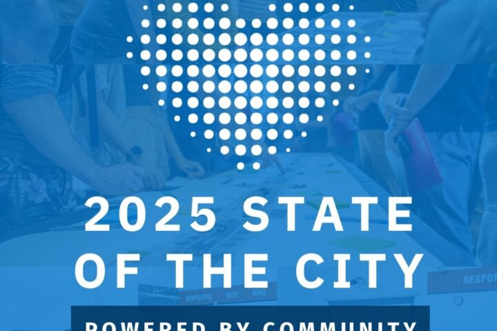    Registration Required   

###### Meetings  

### State of the City  

##### Monday, March 24, 2025  

Join Vancouver Mayor Anne McEnerny-Ogle and the Vancouver City Council for the 2025 State of the City Address and Council Community Forum. Doors open at 5:30 p.m. The speech begins…](https://www.cityofvancouver.us/government/calendar/#section1) 
 *  [    Registration Required   

###### Volunteer  

### Fruit Tree Pruning Education & Volunteer Work  

##### Thursday, March 27, 2025  

Advance registration is required. RSVP today! Join us for a series of volunteer events where you’ll have the opportunity to learn the essential skills of pruning fruit trees and work…](https://www.cityofvancouver.us/government/calendar/#section2) 
 *  [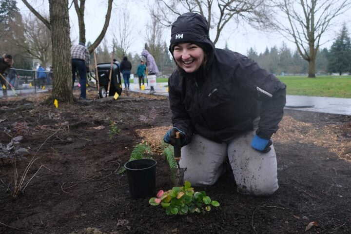    Registration Required   

###### Volunteer  

### Grandmother Camus Median Flora & Fauna Friday  

##### Friday, March 28, 2025  

Advance registration is required.  RSVP today! *This is an outside work party* at the Grandmother Camus median where volunteers and the Vancouver Bee Project will distribute mulch, pick up litter…](https://www.cityofvancouver.us/government/calendar/#section3) 
 *  [    Registration Required   

###### Parks, Recreation and Cultural Services  

### Girls on the Rock  

##### Friday, March 28, 2025  

Advance registration is required, and space is limited. RSVP today. This all-girls climbing event offers a fun and supportive environment for youth to build confidence, make friends, and try something…](https://www.cityofvancouver.us/government/calendar/#section4) 
 *  [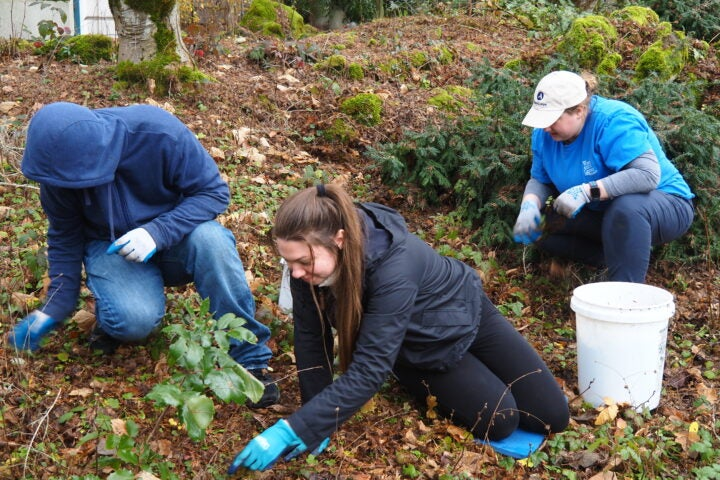    Registration Required   

###### Water Resources Education Center  

### Water Center Garden Cleanup  

##### Saturday, March 29, 2025  

Join Water Center staff outdoors to help keep our beautiful Backyard Habitat Certified gardens in tip-top shape. Volunteer activities will focus on weeding, trimming, and small blackberry removal projects. All…](https://www.cityofvancouver.us/government/calendar/#section5) 
 *  [    Registration Required   

###### Volunteer  

### David Douglas Park Cleanup  

##### Saturday, March 29, 2025  

Advance registration is required, and space is limited. RSVP today. Join the City of Vancouver’s volunteers from our Adopt-A-Park program for a morning of litter cleanup and invasive plant removal.…](https://www.cityofvancouver.us/government/calendar/#section6) 
 *  [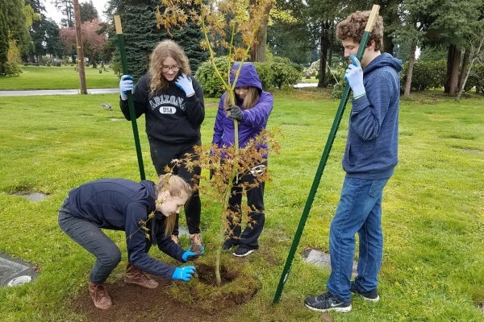    Registration Required   

###### Urban Forestry  

### Kevanna Park Tree Planting  

##### Saturday, March 29, 2025  

Registration required. RSVP today! Join the City of Vancouver’s Urban Forestry Department and amazing volunteers for a morning of planting new street and park trees at Kevanna Park. The newly…](https://www.cityofvancouver.us/government/calendar/#section7) 
 *  [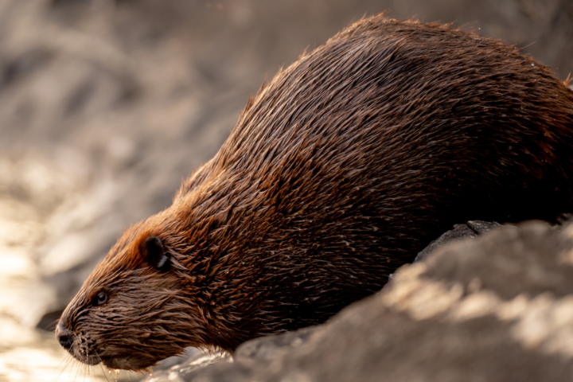    Registration Full   

###### Water Resources Education Center  

### Beavers in Action: Nature’s Engineers   

##### Tuesday, April 1, 2025  

Did you know that beavers are environmental superheroes? They are excellent builders and considered keystone species due to their incredible ability to shape the environment. Join us for an exciting…](https://www.cityofvancouver.us/government/calendar/#section8) 
 *  [    Registration Required   

###### Volunteer  

### Burnt Bridge Creek Litter Cleanup Walk  

##### Thursday, April 3, 2025  

Advance registration is required. RSVP today! Join the City of Vancouver’s Volunteer Programs staff and volunteers from our Adopt-A-Park program for a morning of litter cleanup along the Burnt Bridge…](https://www.cityofvancouver.us/government/calendar/#section9) 
 *  [    Registration Required   

###### Water Resources Education Center  

### Water Bug Wonders: Macroinvertebrate Exploration  

##### Thursday, April 3, 2025  

Are you ready for an exciting spring break adventure in the wetlands? Come explore the Water Center’s watery outdoor habitats and discover the tiny creatures that call them home! Dive…](https://www.cityofvancouver.us/government/calendar/#section10) 
 *  [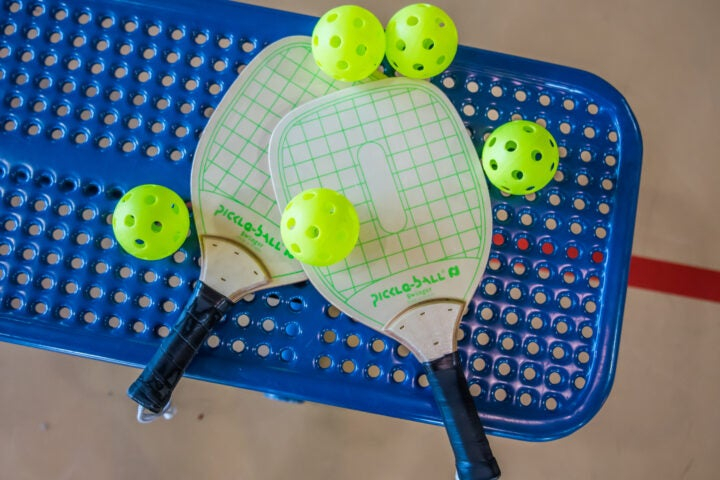    Registration Required   

###### Parks, Recreation and Cultural Services  

### Family Pickleball Night at Firstenburg  

##### Thursday, April 3, 2025  

Bring your family, call your friends, and come play pickleball, the fastest-growing sport in the nation! This all-ages event is an opportunity to spend time with your family and friends…](https://www.cityofvancouver.us/government/calendar/#section11) 
 *  [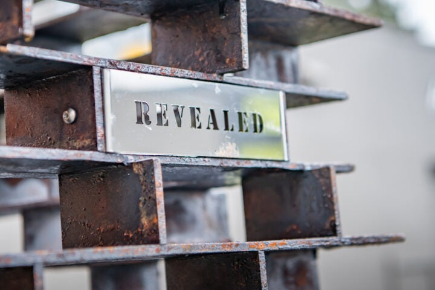      

###### Parks, Recreation and Cultural Services  

### “Revealed” Sculpture Dedication  

##### Friday, April 4, 2025  

Join us for the dedication of Revealed, a new sculpture by artist Randy Walker. The dedication is at 3 p.m., followed by a reception at Brickhouse (109 W 15th St.)…](https://www.cityofvancouver.us/government/calendar/#section12) 
 *  [    Registration Required   

###### Water Resources Education Center  

### Spring Beak Nature Walk  

##### Saturday, April 5, 2025  

As spring break winds down, come to the Water Center in search of spring beaks! The birds are becoming active as the days get longer. Songs echo through the wetlands,…](https://www.cityofvancouver.us/government/calendar/#section13) 
 *  [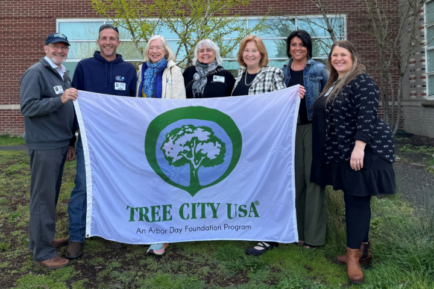      

###### Urban Forestry  

### Arbor Day Celebration  

##### Wednesday, April 9, 2025  

In 2025, the City is recognized as a Tree City USA for the 36th consecutive year. Join the Urban Forestry Commission at Jane Webber Evergreen Arboretum to celebrate Arbor Day…](https://www.cityofvancouver.us/government/calendar/#section14) 
 *  [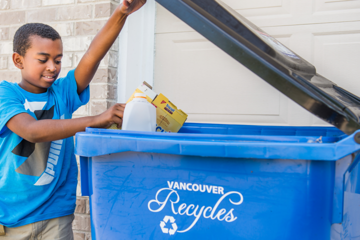      

###### Public Works  

### Recycling 101: Learn the Basics  

##### Thursday, April 10, 2025  

Live in an apartment? Rent? Own? Everyone is invited to join this informative Recycling 101 class. Get all the details about our regional garbage and recycling system. Learn the basics…](https://www.cityofvancouver.us/government/calendar/#section15) 
 *  [    Registration Required   

###### Volunteer  

### Campus Community Garden Flora & Fauna Friday  

##### Friday, April 11, 2025  

Advance registration is required. RSVP today! *This is an outside work party* where volunteers will distribute mulch, pick up litter and pull invasive plants at Campus community garden! Join the…](https://www.cityofvancouver.us/government/calendar/#section16) 
 *  [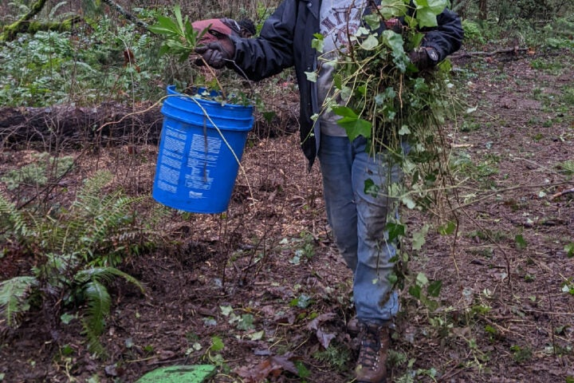    Registration Required   

###### Volunteer  

### Ivy Removal at Behrens Woods  

##### Saturday, April 12, 2025  

Registration is required. Sign up today! Join the City of Vancouver’s Volunteer Programs department and our Naturespaces volunteers for a morning of removing invasive plants. Training, gloves, tools, water, and…](https://www.cityofvancouver.us/government/calendar/#section17) 
 *  [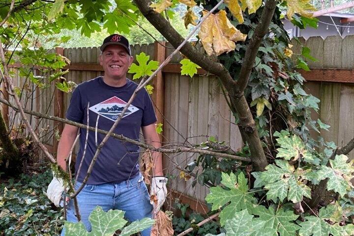    Registration Required   

###### Volunteer  

### Ellsworth Springs East Ivy Pull  

##### Saturday, April 12, 2025  

Advance registration is required and space is limited. RSVP today. Join the City of Vancouver’s Volunteer Programs staff and volunteers from our Adopt-A-Park program for a morning of invasive plant…](https://www.cityofvancouver.us/government/calendar/#section18) 
 *  [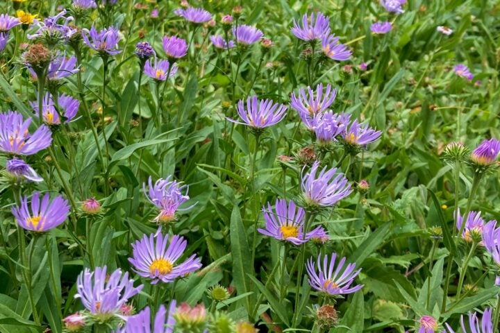    Registration Full   

###### Water Resources Education Center  

### Meadow Mastery: Identifying Weeds, Bees, and Native Plants for a Thriving Landscape  

##### Saturday, April 12, 2025  

Join the Vancouver Bee Project and Water Center staff in nurturing our newly planted pollinator meadows! This hands-on workshop will introduce participants to the fundamentals of meadowscaping and explore how…](https://www.cityofvancouver.us/government/calendar/#section19) 
 *  [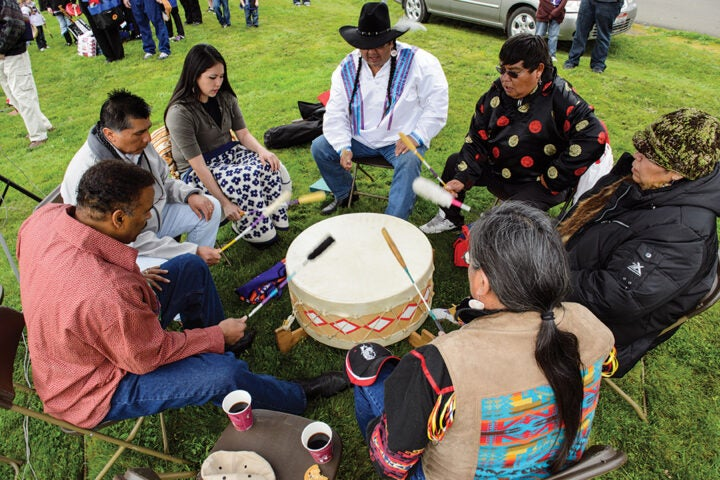      

###### Parks, Recreation and Cultural Services  

### Chief Redheart Memorial Ceremony  

##### Saturday, April 19, 2025  

Join the Nez Perce Tribe in their annual memorial to remember Chief Redheart’s band with singing, a drum circle and recognition of veterans. Each year Nez Perce tribal members travel…](https://www.cityofvancouver.us/government/calendar/#section20) 
 *  [    Registration Required   

###### Volunteer  

### Ellsworth Springs West Ivy Pull  

##### Saturday, April 19, 2025  

Advance registration is required and space is limited. RSVP today! Join the City of Vancouver’s Volunteer Programs staff and volunteers from our Adopt-A-Park program for a morning of invasive plant…](https://www.cityofvancouver.us/government/calendar/#section21) 
 *  [    Registration Required   

###### Volunteer  

### David Douglas Park Cleanup  

##### Saturday, April 19, 2025  

Advance registration is required, and space is limited. RSVP today! Join the City of Vancouver’s volunteers from our Adopt-A-Park program for a morning of litter cleanup and invasive plant removal.…](https://www.cityofvancouver.us/government/calendar/#section22) 
 *  [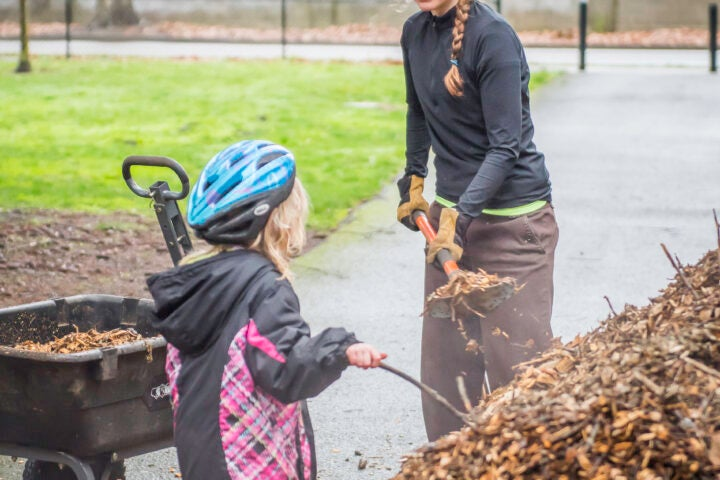    Registration Required   

###### Volunteer  

### Adopt-A-Park Event at LeRoy Haagen  

##### Saturday, April 26, 2025  

Advance registration is required and space is limited. RSVP today. Join the City of Vancouver’s Volunteer Programs staff and volunteers from our Adopt-A-Park program for a morning of beautifying LeRoy…](https://www.cityofvancouver.us/government/calendar/#section23) 
 *  [    Registration Required   

###### Volunteer  

### David Douglas Park Cleanup  

##### Saturday, April 26, 2025  

Advance registration is required, and space is limited. RSVP today! Join the City of Vancouver’s volunteers from our Adopt-A-Park program for a morning of litter cleanup and invasive plant removal.…](https://www.cityofvancouver.us/government/calendar/#section24) 
 *  [    Registration Required   

###### Water Resources Education Center  

### City Nature Challenge, Burnt Bridge Creek Exploration  

##### Saturday, April 26, 2025  

The City Nature Challenge is a global, community-science event aimed at observing and documenting as many plants and wildlife as possible within a 4-day period. Join Water Center staff for…](https://www.cityofvancouver.us/government/calendar/#section25) 
 *  [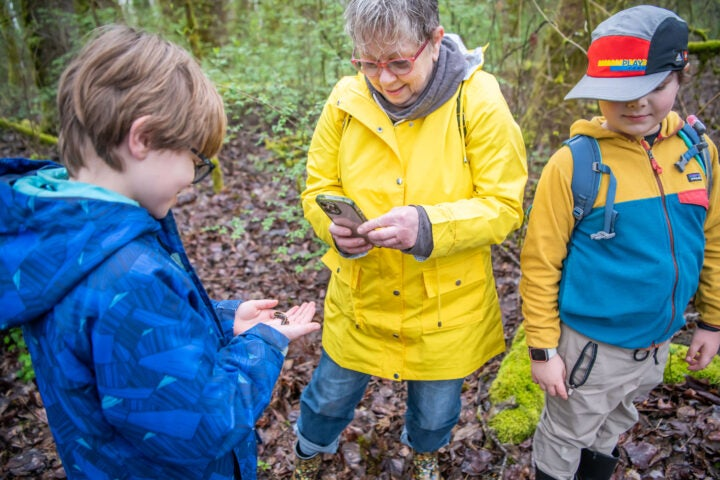    Registration Required   

###### Water Resources Education Center  

### City Nature Challenge, Water Center Nature Trails  

##### Saturday, April 26, 2025  

The City Nature Challenge is a global, community-science event aimed at observing and documenting as many plants and wildlife as possible within a 4-day period. Join Water Center staff for…](https://www.cityofvancouver.us/government/calendar/#section26) 
 *  [    Registration Required   

###### Volunteer  

### Biddlewood Park Natural Area Flora & Fauna Friday  

##### Friday, May 2, 2025  

*This is an outside work party.* RSVP today! Join our team as we distribute mulch, pick up litter and pull invasive plants at Biddlewood park and natural area! Important Note:…](https://www.cityofvancouver.us/government/calendar/#section27) 
 *  [    Registration Required   

###### Volunteer  

### Spruce the Couve  

##### Saturday, May 10, 2025  

Advance registration is required. RSVP today! Join the City of Vancouver’s Volunteer Programs department, Vancouver’s Downtown Association, the Hilton and the Parks Foundation of Clark County for our annual Spruce…](https://www.cityofvancouver.us/government/calendar/#section28) 
 *  [    Registration Required   

###### Volunteer  

### David Douglas Park Cleanup  

##### Saturday, May 10, 2025  

Advance registration is required, and space is limited. RSVP today! Join the City of Vancouver’s volunteers from our Adopt-A-Park program for a morning of litter cleanup and invasive plant removal.…](https://www.cityofvancouver.us/government/calendar/#section29) 
 *  [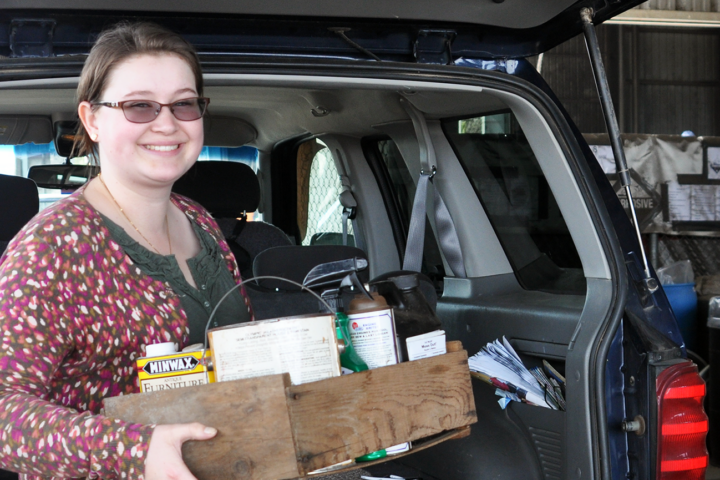      

###### Public Works  

### Recycling 101 & 201: Learn the Basics and Beyond  

##### Wednesday, May 14, 2025  

This combined class brings Recycling 101 and Recycling 201 together for your convenience! Live in an apartment? Rent? Own? Everyone is invited to join this informative class. Get all the…](https://www.cityofvancouver.us/government/calendar/#section30) 
 *  [    Registration Required   

###### Volunteer  

### David Douglas Park Cleanup  

##### Saturday, May 17, 2025  

Advance registration is required, and space is limited. RSVP today! Join the City of Vancouver’s volunteers from our Adopt-A-Park program for a morning of litter cleanup and invasive plant removal.…](https://www.cityofvancouver.us/government/calendar/#section31) 
 *  [    Registration Required   

###### Volunteer  

### Adopt-A-Park Event at LeRoy Haagen  

##### Saturday, May 24, 2025  

Advance registration is required and space is limited. RSVP today. Join the City of Vancouver’s Volunteer Programs staff and volunteers from our Adopt-A-Park program for a morning of beautifying LeRoy…](https://www.cityofvancouver.us/government/calendar/#section32) 
 *  [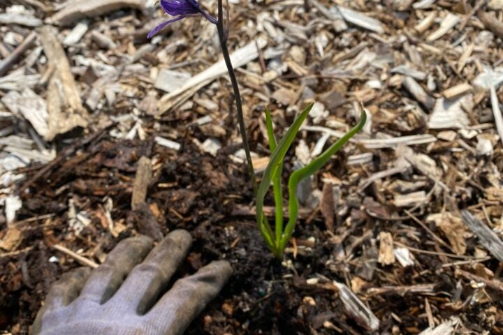    Registration Required   

###### Volunteer  

### Adopt-A-Park Event at St. Helens Park  

##### Saturday, June 7, 2025  

Advance registration is required and space is limited. RSVP today! Join the City of Vancouver’s Volunteer Programs staff and volunteers from our Adopt-A-Park program for a morning of beautifying St…](https://www.cityofvancouver.us/government/calendar/#section33) 
 *  [    Registration Required   

###### Volunteer  

### David Douglas Park Cleanup  

##### Saturday, June 7, 2025  

Advance registration is required, and space is limited. RSVP today! Join the City of Vancouver’s volunteers from our Adopt-A-Park program for a morning of litter cleanup and invasive plant removal.…](https://www.cityofvancouver.us/government/calendar/#section34) 
 *  [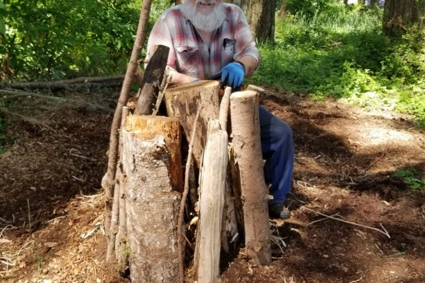    Registration Required   

###### Volunteer  

### Countryside Spring Cleanup  

##### Saturday, June 7, 2025  

Advanced registration is required and space is limited. RSVP today! Join the City of Vancouver’s Volunteer Programs department and our Naturespaces volunteers for the annual Spring Cleanup of Countryside Park!…](https://www.cityofvancouver.us/government/calendar/#section35) 
 *  [      

###### Public Works  

### Recycling 101: Learn the Basics  

##### Wednesday, June 25, 2025  

Live in an apartment? Rent? Own? Everyone is invited to join this informative Recycling 101 class. Get all the details about our regional garbage and recycling system. Learn the basics…](https://www.cityofvancouver.us/government/calendar/#section36) 
 *  [    Registration Required   

###### Volunteer  

### Adopt-A-Park Event at LeRoy Haagen  

##### Saturday, June 28, 2025  

Advance registration is required and space is limited. RSVP today. Join the City of Vancouver’s Volunteer Programs staff and volunteers from our Adopt-A-Park program for a morning of beautifying LeRoy…](https://www.cityofvancouver.us/government/calendar/#section37) 
 *  [    Registration Required   

###### Volunteer  

### Fruit Tree Pruning Education & Volunteer Work  

##### Tuesday, July 15, 2025  

Advance registration is required. RSVP today! Join us for a series of volunteer events where you’ll have the opportunity to learn the essential skills of pruning fruit trees and work…](https://www.cityofvancouver.us/government/calendar/#section38) 
 *  [    Registration Required   

###### Volunteer  

### Fruit Harvest at Raymond Shaffer  

##### Tuesday, August 26, 2025  

Advance registration is recommended. RSVP today! Join us for a series of volunteer events where you’ll have the opportunity to learn the essential skills of pruning fruit trees and work…](https://www.cityofvancouver.us/government/calendar/#section39) 
 *  [    Registration Required   

###### Volunteer  

### Oakbrook Naturespaces Planting  

##### Saturday, October 25, 2025  

Save the date to join the City of Vancouver’s Naturespaces program for planting Oakbrook’s new Naturespace! We will be planting on Oct. 25, Nov. 1 and Nov. 15. Training, gloves, tools,…](https://www.cityofvancouver.us/government/calendar/#section40) 

### State of the City

##### Monday, March 24, 2025

 5:30 pm 

 Add to Calendar Monday, March 24, 2025 5:30 pm Monday, March 24, 2025 5:30 pm America/Los_Angeles State of the City Join Vancouver Mayor Anne McEnerny-Ogle and the Vancouver City Council for the 2025 State of the City Address and Council Community Forum. Doors open at 5:30 p.m. The speech begins at 6 p.m. Community forum begins at 6:45 p.m. RSVP Accessibility and interpretation Live American Sign Language interpretation will be provided. If you require any additional accessibility or language interpretation accommodations, please share those when you register or contact William Cooley at william.cooley@cityofvancouver.us or 360-487-8617. Parking Parking at the Firstenburg Community Center is free but may be limited due to the popularity of this active community space. We encourage you… 

#### Firstenburg Community Center 700 NE 136th Ave Vancouver , WA 98684

Join Vancouver Mayor Anne McEnerny-Ogle and the Vancouver City Council for the 2025 State of the City Address and Council Community Forum. Doors open at 5:30 p.m. The speech begins at 6 p.m. Community forum begins at 6:45 p.m. RSVP Accessibility and interpretation Live American Sign Language interpretation will be provided. If you require any additional accessibility or language interpretation…

 [Learn More](https://www.cityofvancouver.us/events/state-of-the-city/)  

### Fruit Tree Pruning Education & Volunteer Work

##### Thursday, March 27, 2025

 12:00 pm - 2:00 pm 

 Add to Calendar Thursday, March 27, 2025 12:00 pm Thursday, March 27, 2025 12:00 pm America/Los_Angeles Fruit Tree Pruning Education & Volunteer Work Advance registration is required. RSVP today! Join us for a series of volunteer events where you’ll have the opportunity to learn the essential skills of pruning fruit trees and work alongside our expert urban forestry team. Whether you’re a seasoned gardener or just starting, these hands-on events are designed to teach you both winter and summer pruning techniques, helping to ensure the health and vitality of our urban forest. Attend one or all the events, each focused on different aspects of tree care throughout the seasons. The final event of the series will be especially exciting, as we’ll harvest the… 

#### Raymond E. Shaffer Park 7806 NE 58th St Vancouver , WA 98662

Advance registration is required. RSVP today! Join us for a series of volunteer events where you’ll have the opportunity to learn the essential skills of pruning fruit trees and work alongside our expert urban forestry team. Whether you’re a seasoned gardener or just starting, these hands-on events are designed to teach you both winter and summer pruning techniques, helping to…

 [Learn More](https://www.cityofvancouver.us/events/fruit-tree-pruning-education-volunteer-work/)  

### Grandmother Camus Median Flora & Fauna Friday

##### Friday, March 28, 2025

 10:00 am - 12:30 pm 

#### Grandmother Camus Median Vancouver , WA 98661

Advance registration is required.  RSVP today! *This is an outside work party* at the Grandmother Camus median where volunteers and the Vancouver Bee Project will distribute mulch, pick up litter and pull invasive plants! Join the City of Vancouver’s Volunteer Programs and Naturespaces for our mid-day volunteer event series: Flora and Fauna Fridays! We’re excited to host our bi-weekly work…

 [Learn More](https://www.cityofvancouver.us/events/grandmother-camus-median-flora-fauna-friday/)  

### Girls on the Rock

##### Friday, March 28, 2025

 5:00 pm - 6:45 pm 

 Add to Calendar Friday, March 28, 2025 5:00 pm Friday, March 28, 2025 5:00 pm America/Los_Angeles Girls on the Rock Advance registration is required, and space is limited. RSVP today. This all-girls climbing event offers a fun and supportive environment for youth to build confidence, make friends, and try something new. Participants will explore climbing techniques and tackle exciting challenges with guidance from experienced staff. Perfect for all skill levels, this session is designed to encourage growth and adventure in a safe space. No prior experience or equipment is needed. Cost is $19 for Vancouver residents, and $24 for non-residents. Ages 12 to 18. 

#### Firstenburg Community Center 700 NE 136th Ave Vancouver , WA 98684

Advance registration is required, and space is limited. RSVP today. This all-girls climbing event offers a fun and supportive environment for youth to build confidence, make friends, and try something new. Participants will explore climbing techniques and tackle exciting challenges with guidance from experienced staff. Perfect for all skill levels, this session is designed to encourage growth and adventure in…

 [Learn More](https://www.cityofvancouver.us/events/girls-on-the-rock/)  

### Water Center Garden Cleanup

##### Saturday, March 29, 2025

 9:30 am - 11:30 am 

 Add to Calendar Saturday, March 29, 2025 9:30 am Saturday, March 29, 2025 9:30 am America/Los_Angeles Water Center Garden Cleanup Join Water Center staff outdoors to help keep our beautiful Backyard Habitat Certified gardens in tip-top shape. Volunteer activities will focus on weeding, trimming, and small blackberry removal projects. All necessary tools and gloves will be provided. Registration is required. Sign up today! All ages welcome.  Youth under 18 must provide a signed minor consent form. Youth under 13 must have an adult guardian present. 

#### Water Resources Education Center 4600 SE Columbia Way Vancouver , WA 98661

Join Water Center staff outdoors to help keep our beautiful Backyard Habitat Certified gardens in tip-top shape. Volunteer activities will focus on weeding, trimming, and small blackberry removal projects. All necessary tools and gloves will be provided. Registration is required. Sign up today! All ages welcome.  Youth under 18 must provide a signed minor consent form. Youth under 13 must…

 [Learn More](https://www.cityofvancouver.us/events/water-center-garden-cleanup-12/)  

### David Douglas Park Cleanup

##### Saturday, March 29, 2025

 10:00 am - 1:00 pm 

 Add to Calendar Saturday, March 29, 2025 10:00 am Saturday, March 29, 2025 10:00 am America/Los_Angeles David Douglas Park Cleanup Advance registration is required, and space is limited. RSVP today. Join the City of Vancouver’s volunteers from our Adopt-A-Park program for a morning of litter cleanup and invasive plant removal. Training, gloves, tools, water, and snacks will be provided. This opportunity is family-friendly and great for teens. Volunteers should dress for the weather and wear long pants and closed-toe shoes. Youth under 18 must bring a signed minor consent form. Accessibility is important to us and we’ve taken it into account while planning this event. This location is partially wheelchair accessible, and work is primarily done in a quiet natural area… 

#### David Douglas Park 1016 N Garrison Rd Vancouver , WA 98664

Advance registration is required, and space is limited. RSVP today. Join the City of Vancouver’s volunteers from our Adopt-A-Park program for a morning of litter cleanup and invasive plant removal. Training, gloves, tools, water, and snacks will be provided. This opportunity is family-friendly and great for teens. Volunteers should dress for the weather and wear long pants and closed-toe shoes.…

 [Learn More](https://www.cityofvancouver.us/events/david-douglas-park-cleanup-8/)  

### Kevanna Park Tree Planting

##### Saturday, March 29, 2025

 10:00 am - 12:00 pm 

 Add to Calendar Saturday, March 29, 2025 10:00 am Saturday, March 29, 2025 10:00 am America/Los_Angeles Kevanna Park Tree Planting Registration required. RSVP today! Join the City of Vancouver’s Urban Forestry Department and amazing volunteers for a morning of planting new street and park trees at Kevanna Park. The newly planted trees will help shade pavement, clean the air, and manage stormwater runoff at this park nestled along Burnt Bridge Creek. Join the fun and make a big impact in two short hours. Dress for the weather and wear long pants and closed-toe shoes. Gloves, tools and guidance will be provided, as well as light refreshments. This opportunity is family-friendly and great for teens – people of all ages and… 

#### Kevanna Park 10500 NE 51st Cir Vancouver , WA 98682

Registration required. RSVP today! Join the City of Vancouver’s Urban Forestry Department and amazing volunteers for a morning of planting new street and park trees at Kevanna Park. The newly planted trees will help shade pavement, clean the air, and manage stormwater runoff at this park nestled along Burnt Bridge Creek. Join the fun and make a big impact in…

 [Learn More](https://www.cityofvancouver.us/events/kevanna-park-tree-planting/)  

### Beavers in Action: Nature’s Engineers 

##### Tuesday, April 1, 2025

 10:00 am - 12:00 pm 

 Add to Calendar Tuesday, April 1, 2025 10:00 am Tuesday, April 1, 2025 10:00 am America/Los_Angeles Beavers in Action: Nature’s Engineers  Did you know that beavers are environmental superheroes? They are excellent builders and considered keystone species due to their incredible ability to shape the environment. Join us for an exciting spring break adventure at the Water Center’s wetlands where we’ll dive into the fascinating world of these amazing creatures! In this hands-on exploration, we’ll discover how beavers create their homes, build dams, and transform wetlands into thriving ecosystems. You’ll learn how their work helps other wildlife, cleans the water, and even impacts the landscape around us. This program is perfect for kids aged 6-12. All youth need to be accompanied… 

#### Water Resources Education Center 4600 SE Columbia Way Vancouver , WA 98661

Did you know that beavers are environmental superheroes? They are excellent builders and considered keystone species due to their incredible ability to shape the environment. Join us for an exciting spring break adventure at the Water Center’s wetlands where we’ll dive into the fascinating world of these amazing creatures! In this hands-on exploration, we’ll discover how beavers create their homes,…

 [Learn More](https://www.cityofvancouver.us/events/beavers-in-action-natures-engineers/)  

### Burnt Bridge Creek Litter Cleanup Walk

##### Thursday, April 3, 2025

 9:00 am - 11:30 am 

 Add to Calendar Thursday, April 3, 2025 9:00 am Thursday, April 3, 2025 9:00 am America/Los_Angeles Burnt Bridge Creek Litter Cleanup Walk Advance registration is required. RSVP today! Join the City of Vancouver’s Volunteer Programs staff and volunteers from our Adopt-A-Park program for a morning of litter cleanup along the Burnt Bridge Creek Trail. Volunteers will meet at the Parkrose Hardware parking lot at 8000 E. Mill Plain Blvd. to sign in with the volunteer leader, receive tools and split up into groups to walk the trail. Training, gloves, tools, and water will be provided. This opportunity is family-friendly and great for teens. Volunteers should dress for the weather and wear long pants and closed-toe shoes. Youth under 18 must bring a… 

#### Burnt Bridge Creek 8000 E Mill Plain Blvd Vancouver , WA 98664

Advance registration is required. RSVP today! Join the City of Vancouver’s Volunteer Programs staff and volunteers from our Adopt-A-Park program for a morning of litter cleanup along the Burnt Bridge Creek Trail. Volunteers will meet at the Parkrose Hardware parking lot at 8000 E. Mill Plain Blvd. to sign in with the volunteer leader, receive tools and split up into…

 [Learn More](https://www.cityofvancouver.us/events/burnt-bridge-creek-litter-cleanup-walk-3/)  

### Water Bug Wonders: Macroinvertebrate Exploration

##### Thursday, April 3, 2025

 10:00 am - 12:00 pm 

 Add to Calendar Thursday, April 3, 2025 10:00 am Thursday, April 3, 2025 10:00 am America/Los_Angeles Water Bug Wonders: Macroinvertebrate Exploration Are you ready for an exciting spring break adventure in the wetlands? Come explore the Water Center’s watery outdoor habitats and discover the tiny creatures that call them home! Dive into the world of macroinvertebrates—those fascinating “big bugs” without backbones—and learn how macros tell us about the health of the environment. This program is perfect for kids ages 8-12. All youth need to be accompanied by an adult during the entire program. Advanced registration is required. Sign up today! This program will be indoors and outdoors, with the majority of time spent outside. Program will happen rain or shine. Participants… 

#### Water Resources Education Center 4600 SE Columbia Way Vancouver , WA 98661

Are you ready for an exciting spring break adventure in the wetlands? Come explore the Water Center’s watery outdoor habitats and discover the tiny creatures that call them home! Dive into the world of macroinvertebrates—those fascinating “big bugs” without backbones—and learn how macros tell us about the health of the environment. This program is perfect for kids ages 8-12. All…

 [Learn More](https://www.cityofvancouver.us/events/wetland-wonders-macroinvertebrate-exploration/)  

### Family Pickleball Night at Firstenburg

##### Thursday, April 3, 2025

 6:00 pm - 7:30 pm 

 Add to Calendar Thursday, April 3, 2025 6:00 pm Thursday, April 3, 2025 6:00 pm America/Los_Angeles Family Pickleball Night at Firstenburg Bring your family, call your friends, and come play pickleball, the fastest-growing sport in the nation! This all-ages event is an opportunity to spend time with your family and friends in a non-competitive environment and practice the sport of pickleball. Advance registration is required, and space is limited. RSVP today. How to Register: Participants will register individually and by court (1-6). Please coordinate with fellow friends and family members to make sure your party signs up for the same court. Only 4 players may play on a court at a time. If your party has 5-6 players that share a… 

#### Firstenburg Community Center 700 NE 136th Ave Vancouver , WA 98684

Bring your family, call your friends, and come play pickleball, the fastest-growing sport in the nation! This all-ages event is an opportunity to spend time with your family and friends in a non-competitive environment and practice the sport of pickleball. Advance registration is required, and space is limited. RSVP today. How to Register: Participants will register individually and by court…

 [Learn More](https://www.cityofvancouver.us/events/family-pickleball-night-at-firstenbur/)  

### “Revealed” Sculpture Dedication

##### Friday, April 4, 2025

 3:00 pm 

 Add to Calendar Friday, April 4, 2025 3:00 pm Friday, April 4, 2025 3:00 pm America/Los_Angeles “Revealed” Sculpture Dedication Join us for the dedication of Revealed, a new sculpture by artist Randy Walker. The dedication is at 3 p.m., followed by a reception at Brickhouse (109 W 15th St.) Commissioned by the City of Vancouver to honor the legacy of the Hidden Brick Company, this interactive sculpture features steel bricks etched with words that reveal the history of Clark County. During the dedication, the Vancouver NAACP will add the first new word to the sculpture, symbolizing the ongoing evolution of our community’s story. After the dedication, continue supporting Vancouver arts, culture and local businesses at Clark County Historical Museum’s… 

#### Clark County Historical Museum 1511 Main St Vancouver , WA 98663

Join us for the dedication of Revealed, a new sculpture by artist Randy Walker. The dedication is at 3 p.m., followed by a reception at Brickhouse (109 W 15th St.) Commissioned by the City of Vancouver to honor the legacy of the Hidden Brick Company, this interactive sculpture features steel bricks etched with words that reveal the history of Clark…

 [Learn More](https://www.cityofvancouver.us/events/revealed-sculpture-dedication/)  

### Spring Beak Nature Walk

##### Saturday, April 5, 2025

 10:00 am - 12:00 pm 

 Add to Calendar Saturday, April 5, 2025 10:00 am Saturday, April 5, 2025 10:00 am America/Los_Angeles Spring Beak Nature Walk As spring break winds down, come to the Water Center in search of spring beaks! The birds are becoming active as the days get longer. Songs echo through the wetlands, nests are being built, and baby bird season is just around the corner. Take a leisurely spring break weekend walk in search of all the birds that call this water ecosystem home. Binoculars will be on hand for participants to borrow. Registration required. Sign up today! Walk is suitable for individuals and families with youth ages 6 and older. All minors should be accompanied by an adult. Expect to walk… 

#### Water Resources Education Center 4600 SE Columbia Way Vancouver , WA 98661

As spring break winds down, come to the Water Center in search of spring beaks! The birds are becoming active as the days get longer. Songs echo through the wetlands, nests are being built, and baby bird season is just around the corner. Take a leisurely spring break weekend walk in search of all the birds that call this water…

 [Learn More](https://www.cityofvancouver.us/events/spring-beak-nature-walk-3/)  

### Arbor Day Celebration

##### Wednesday, April 9, 2025

 11:30 am - 12:30 pm 

 Add to Calendar Wednesday, April 9, 2025 11:30 am Wednesday, April 9, 2025 11:30 am America/Los_Angeles Arbor Day Celebration In 2025, the City is recognized as a Tree City USA for the 36th consecutive year. Join the Urban Forestry Commission at Jane Webber Evergreen Arboretum to celebrate Arbor Day and plant trees! The event begins with a recognition ceremony, including the Gordon and Sylvia MacWilliams Evergreen Award presentation and the Mayor accepting the Tree City USA award. After the recognition, join us for a service project to plant the Arbor Day tree and co-plant pollinator plants at the arboretum. Gloves, tools and guidance will be provided. This opportunity is family-friendly. People of all ages and abilities are welcome! Limited… 

#### Jane Weber Evergreen Arboretum 9215 SE Evergreen Hwy Vancouver , WA 98664

In 2025, the City is recognized as a Tree City USA for the 36th consecutive year. Join the Urban Forestry Commission at Jane Webber Evergreen Arboretum to celebrate Arbor Day and plant trees! The event begins with a recognition ceremony, including the Gordon and Sylvia MacWilliams Evergreen Award presentation and the Mayor accepting the Tree City USA award. After the…

 [Learn More](https://www.cityofvancouver.us/events/arbor-day-celebration/)  

### Recycling 101: Learn the Basics

##### Thursday, April 10, 2025

 6:00 pm 

 Add to Calendar Thursday, April 10, 2025 6:00 pm Thursday, April 10, 2025 6:00 pm America/Los_Angeles Recycling 101: Learn the Basics Live in an apartment? Rent? Own? Everyone is invited to join this informative Recycling 101 class. Get all the details about our regional garbage and recycling system. Learn the basics about what to recycle curbside and why, and where items go after being picked up. If you are unsure if certain items can be recycled, bring those questions to this class. Sign up for this free RecycleU class today! Check out other regional workshops. Contact Solid Waste Analyst, Liz, at elizabeth.erickson@cityofvancouver.us for additional information. 

#### Waste Connections and Virtual Meeting Hybrid Class 9411 NE 94th Ave Vancouver , WA 98662

Live in an apartment? Rent? Own? Everyone is invited to join this informative Recycling 101 class. Get all the details about our regional garbage and recycling system. Learn the basics about what to recycle curbside and why, and where items go after being picked up. If you are unsure if certain items can be recycled, bring those questions to this…

 [Learn More](https://www.cityofvancouver.us/events/recycling-101-learn-the-basics-11/)  

### Campus Community Garden Flora & Fauna Friday

##### Friday, April 11, 2025

 10:00 am - 12:30 pm 

#### Campus Community Garden NE Campus Dr Vancouver , WA 98661

Advance registration is required. RSVP today! *This is an outside work party* where volunteers will distribute mulch, pick up litter and pull invasive plants at Campus community garden! Join the City of Vancouver’s Volunteer Programs and Naturespaces for our mid-day volunteer event series: Flora and Fauna Fridays! We’re excited to host our bi-weekly work parties that allow you to roll…

 [Learn More](https://www.cityofvancouver.us/events/campus-community-garden-flora-fauna-friday/)  

### Ivy Removal at Behrens Woods

##### Saturday, April 12, 2025

 9:00 am - 11:30 am 

#### Behrens Woods 3005 SE Bella Vista Pl Vancouver , WA 98683

Registration is required. Sign up today! Join the City of Vancouver’s Volunteer Programs department and our Naturespaces volunteers for a morning of removing invasive plants. Training, gloves, tools, water, and snacks will be provided. This opportunity is family-friendly and great for teens. Volunteers should dress for the weather and wear long pants and closed-toe shoes. Youth under 18 must bring…

 [Learn More](https://www.cityofvancouver.us/events/ivy-removal-at-behrens-woods-34/)  

### Ellsworth Springs East Ivy Pull

##### Saturday, April 12, 2025

 10:00 am - 12:00 pm 

 Add to Calendar Saturday, April 12, 2025 10:00 am Saturday, April 12, 2025 10:00 am America/Los_Angeles Ellsworth Springs East Ivy Pull Advance registration is required and space is limited. RSVP today. Join the City of Vancouver’s Volunteer Programs staff and volunteers from our Adopt-A-Park program for a morning of invasive plant removal. We will be removing ivy with a focus on the trees. Training, gloves, tools, water, and snacks will be provided. This opportunity is family-friendly and great for teens. Volunteers should dress for the weather and wear long pants and closed-toe shoes. Youth under 18 must bring a signed minor consent form. Accessibility is important to us and we’ve taken it into account while planning this event. This location is wheelchair… 

#### Ellsworth Springs East 1200 SE 98th Ave Vancouver , WA 98664

Advance registration is required and space is limited. RSVP today. Join the City of Vancouver’s Volunteer Programs staff and volunteers from our Adopt-A-Park program for a morning of invasive plant removal. We will be removing ivy with a focus on the trees. Training, gloves, tools, water, and snacks will be provided. This opportunity is family-friendly and great for teens. Volunteers…

 [Learn More](https://www.cityofvancouver.us/events/ellsworth-springs-east-ivy-pull-7/)  

### Meadow Mastery: Identifying Weeds, Bees, and Native Plants for a Thriving Landscape

##### Saturday, April 12, 2025

 10:30 am - 12:00 pm 

 Add to Calendar Saturday, April 12, 2025 10:30 am Saturday, April 12, 2025 10:30 am America/Los_Angeles Meadow Mastery: Identifying Weeds, Bees, and Native Plants for a Thriving Landscape Join the Vancouver Bee Project and Water Center staff in nurturing our newly planted pollinator meadows! This hands-on workshop will introduce participants to the fundamentals of meadowscaping and explore how these spaces support pollinators. Together, we’ll identify common weedy species in newly planted meadows and work to remove them. Afterward, we’ll take a guided tour of the Center’s backyard habitat-certified gardens and riparian zone, where you’ll learn to recognize native plant species common to our region. Registration required. Sign up today! Expect to be mostly stationary in the garden for the first half of the program.  Garden gloves will be… 

#### Water Resources Education Center 4600 SE Columbia Way Vancouver , WA 98661

Join the Vancouver Bee Project and Water Center staff in nurturing our newly planted pollinator meadows! This hands-on workshop will introduce participants to the fundamentals of meadowscaping and explore how these spaces support pollinators. Together, we’ll identify common weedy species in newly planted meadows and work to remove them. Afterward, we’ll take a guided tour of the Center’s backyard habitat-certified…

 [Learn More](https://www.cityofvancouver.us/events/meadow-mastery-identifying-weeds-bees-and-native-plants-for-a-thriving-landscape/)  

### Chief Redheart Memorial Ceremony

##### Saturday, April 19, 2025

 10:00 am - 12:00 pm 

 Add to Calendar Saturday, April 19, 2025 10:00 am Saturday, April 19, 2025 10:00 am America/Los_Angeles Chief Redheart Memorial Ceremony Join the Nez Perce Tribe in their annual memorial to remember Chief Redheart’s band with singing, a drum circle and recognition of veterans. Each year Nez Perce tribal members travel to important historical sites to conduct memorials. This event honors Chief Redheart’s band, who were imprisoned for eight months without cause at Fort Vancouver in 1877-78.  This event is free and open to the public. This event is hosted by the Nez Perce Tribe with support from the National Park Service, Community Military Appreciation Committee, the Historic Trust and the City of Vancouver.  

#### Fort Vancouver National Historic Site 1001 E 5th St Vancouver , WA 98661

Join the Nez Perce Tribe in their annual memorial to remember Chief Redheart’s band with singing, a drum circle and recognition of veterans. Each year Nez Perce tribal members travel to important historical sites to conduct memorials. This event honors Chief Redheart’s band, who were imprisoned for eight months without cause at Fort Vancouver in 1877-78.  This event is free…

 [Learn More](https://www.cityofvancouver.us/events/chief-redheart-memorial-ceremony/)  

### Ellsworth Springs West Ivy Pull

##### Saturday, April 19, 2025

 10:00 am - 12:00 pm 

 Add to Calendar Saturday, April 19, 2025 10:00 am Saturday, April 19, 2025 10:00 am America/Los_Angeles Ellsworth Springs West Ivy Pull Advance registration is required and space is limited. RSVP today! Join the City of Vancouver’s Volunteer Programs staff and volunteers from our Adopt-A-Park program for a morning of invasive plant removal. We will be removing ivy with a focus on the trees. Training, gloves, tools, water, and snacks will be provided. This opportunity is family-friendly and great for teens. Volunteers should dress for the weather and wear long pants and closed-toe shoes. Youth under 18 must bring a signed minor consent form. Accessibility is important to us and we’ve taken it into account while planning this event. This location is wheelchair… 

#### Ellsworth Springs West Vancouver , WA 98664

Advance registration is required and space is limited. RSVP today! Join the City of Vancouver’s Volunteer Programs staff and volunteers from our Adopt-A-Park program for a morning of invasive plant removal. We will be removing ivy with a focus on the trees. Training, gloves, tools, water, and snacks will be provided. This opportunity is family-friendly and great for teens. Volunteers…

 [Learn More](https://www.cityofvancouver.us/events/ellsworth-springs-west-ivy-pull-3/)  

### David Douglas Park Cleanup

##### Saturday, April 19, 2025

 10:00 am - 12:00 pm 

 Add to Calendar Saturday, April 19, 2025 10:00 am Saturday, April 19, 2025 10:00 am America/Los_Angeles David Douglas Park Cleanup Advance registration is required, and space is limited. RSVP today! Join the City of Vancouver’s volunteers from our Adopt-A-Park program for a morning of litter cleanup and invasive plant removal. Training, gloves, tools, water, and snacks will be provided. This opportunity is family-friendly and great for teens. Volunteers should dress for the weather and wear long pants and closed-toe shoes. Youth under 18 must bring a signed minor consent form. Accessibility is important to us and we’ve taken it into account while planning this event. This location is partially wheelchair accessible, and work is primarily done in a quiet natural area… 

#### David Douglas Park 1016 N Garrison Rd Vancouver , WA 98664

Advance registration is required, and space is limited. RSVP today! Join the City of Vancouver’s volunteers from our Adopt-A-Park program for a morning of litter cleanup and invasive plant removal. Training, gloves, tools, water, and snacks will be provided. This opportunity is family-friendly and great for teens. Volunteers should dress for the weather and wear long pants and closed-toe shoes.…

 [Learn More](https://www.cityofvancouver.us/events/david-douglas-park-cleanup-9/)  

### Adopt-A-Park Event at LeRoy Haagen

##### Saturday, April 26, 2025

 10:00 am - 12:00 pm 

 Add to Calendar Saturday, April 26, 2025 10:00 am Saturday, April 26, 2025 10:00 am America/Los_Angeles Adopt-A-Park Event at LeRoy Haagen Advance registration is required and space is limited. RSVP today. Join the City of Vancouver’s Volunteer Programs staff and volunteers from our Adopt-A-Park program for a morning of beautifying LeRoy Haagen Memorial Community Park’s natural area. We will be removing ivy and other non-native plants and spreading mulch. Training, gloves, tools, water, and snacks will be provided. This opportunity is family-friendly and great for teens. Volunteers should dress for the weather and wear long pants and closed-toe shoes. Youth under 18 must bring a signed minor consent form. Accessibility is important to us and we’ve taken it into account while planning… 

#### LeRoy Haagen Memorial Community Park 13200 NE LeRoy Haagen Memorial Drive Vancouver , WA 98684

Advance registration is required and space is limited. RSVP today. Join the City of Vancouver’s Volunteer Programs staff and volunteers from our Adopt-A-Park program for a morning of beautifying LeRoy Haagen Memorial Community Park’s natural area. We will be removing ivy and other non-native plants and spreading mulch. Training, gloves, tools, water, and snacks will be provided. This opportunity is…

 [Learn More](https://www.cityofvancouver.us/events/adopt-a-park-event-at-leroy-haagen-20/)  

### David Douglas Park Cleanup

##### Saturday, April 26, 2025

 10:00 am - 12:00 pm 

 Add to Calendar Saturday, April 26, 2025 10:00 am Saturday, April 26, 2025 10:00 am America/Los_Angeles David Douglas Park Cleanup Advance registration is required, and space is limited. RSVP today! Join the City of Vancouver’s volunteers from our Adopt-A-Park program for a morning of litter cleanup and invasive plant removal. Training, gloves, tools, water, and snacks will be provided. This opportunity is family-friendly and great for teens. Volunteers should dress for the weather and wear long pants and closed-toe shoes. Youth under 18 must bring a signed minor consent form. Accessibility is important to us and we’ve taken it into account while planning this event. This location is partially wheelchair accessible, and work is primarily done in a quiet natural area… 

#### David Douglas Park 1016 N Garrison Rd Vancouver , WA 98664

Advance registration is required, and space is limited. RSVP today! Join the City of Vancouver’s volunteers from our Adopt-A-Park program for a morning of litter cleanup and invasive plant removal. Training, gloves, tools, water, and snacks will be provided. This opportunity is family-friendly and great for teens. Volunteers should dress for the weather and wear long pants and closed-toe shoes.…

 [Learn More](https://www.cityofvancouver.us/events/david-douglas-park-cleanup-10/)  

### City Nature Challenge, Burnt Bridge Creek Exploration

##### Saturday, April 26, 2025

 10:00 am - 12:00 pm 

 Add to Calendar Saturday, April 26, 2025 10:00 am Saturday, April 26, 2025 10:00 am America/Los_Angeles City Nature Challenge, Burnt Bridge Creek Exploration The City Nature Challenge is a global, community-science event aimed at observing and documenting as many plants and wildlife as possible within a 4-day period. Join Water Center staff for a guided exploration of a hidden gem in our urban environment: the lower portion of the Burnt Bridge Creek trailhead at Stewart Glen. Participants will learn how to use the iNaturalist app to document the flora and fauna in this forested ecosystem. We will focus our attention on plants and birds during this walk. No experience is necessary! Just download the iNaturalist app before the walk, and we’ll teach you… 

#### NW Lakeshore Avenue NW Lakeshore Ave Vancouver , WA 98663

The City Nature Challenge is a global, community-science event aimed at observing and documenting as many plants and wildlife as possible within a 4-day period. Join Water Center staff for a guided exploration of a hidden gem in our urban environment: the lower portion of the Burnt Bridge Creek trailhead at Stewart Glen. Participants will learn how to use the…

 [Learn More](https://www.cityofvancouver.us/events/city-nature-challenge-burnt-bridge-creek-exploration/)  

### City Nature Challenge, Water Center Nature Trails

##### Saturday, April 26, 2025

 2:00 pm - 4:00 pm 

 Add to Calendar Saturday, April 26, 2025 2:00 pm Saturday, April 26, 2025 2:00 pm America/Los_Angeles City Nature Challenge, Water Center Nature Trails The City Nature Challenge is a global, community-science event aimed at observing and documenting as many plants and wildlife as possible within a 4-day period. Join Water Center staff for a guided exploration of our wetland and river habitat around the Center and have fun documenting the amazing diversity of life that the water supports. Participants will learn how to use the iNaturalist app to document the flora and fauna in this aquatic ecosystem. No experience is necessary! Just download the iNaturalist app before the walk, and we’ll teach you how to use it. Registration required. Sign up today! This… 

#### Water Resources Education Center 4600 SE Columbia Way Vancouver , WA 98661

The City Nature Challenge is a global, community-science event aimed at observing and documenting as many plants and wildlife as possible within a 4-day period. Join Water Center staff for a guided exploration of our wetland and river habitat around the Center and have fun documenting the amazing diversity of life that the water supports. Participants will learn how to…

 [Learn More](https://www.cityofvancouver.us/events/city-nature-challenge-water-center-nature-trails/)  

### Biddlewood Park Natural Area Flora & Fauna Friday

##### Friday, May 2, 2025

 10:00 am - 12:30 pm 

#### Board Room SE Riveridge Dr Vancouver , WA 98683

*This is an outside work party.* RSVP today! Join our team as we distribute mulch, pick up litter and pull invasive plants at Biddlewood park and natural area! Important Note: Every other week, we switch gears and offer Educational and Outreach Opportunities. This is your chance to engage with the community, share knowledge, or participate in learning sessions designed to…

 [Learn More](https://www.cityofvancouver.us/events/biddlewood-park-natural-area-flora-fauna-friday/)  

### Spruce the Couve

##### Saturday, May 10, 2025

 9:00 am - 11:30 am 

 Add to Calendar Saturday, May 10, 2025 9:00 am Saturday, May 10, 2025 9:00 am America/Los_Angeles Spruce the Couve Advance registration is required. RSVP today! Join the City of Vancouver’s Volunteer Programs department, Vancouver’s Downtown Association, the Hilton and the Parks Foundation of Clark County for our annual Spruce the Couve event. Volunteers will be planting flowers in Esther Short Park and working in teams to clean up downtown. Training, gloves, tools, water and snacks will be provided. This opportunity is family-friendly and great for teens – people of all ages are welcome. We also accept group registration so bring your friends, families and coworkers for a morning of volunteer service. Youth under 18 must bring a signed minor… 

#### Esther Short Park 605 Esther St Vancouver , WA 98660

Advance registration is required. RSVP today! Join the City of Vancouver’s Volunteer Programs department, Vancouver’s Downtown Association, the Hilton and the Parks Foundation of Clark County for our annual Spruce the Couve event. Volunteers will be planting flowers in Esther Short Park and working in teams to clean up downtown. Training, gloves, tools, water and snacks will be provided. This…

 [Learn More](https://www.cityofvancouver.us/events/spruce-the-couve-2/)  

### David Douglas Park Cleanup

##### Saturday, May 10, 2025

 10:00 am - 12:00 pm 

 Add to Calendar Saturday, May 10, 2025 10:00 am Saturday, May 10, 2025 10:00 am America/Los_Angeles David Douglas Park Cleanup Advance registration is required, and space is limited. RSVP today! Join the City of Vancouver’s volunteers from our Adopt-A-Park program for a morning of litter cleanup and invasive plant removal. Training, gloves, tools, water, and snacks will be provided. This opportunity is family-friendly and great for teens. Volunteers should dress for the weather and wear long pants and closed-toe shoes. Youth under 18 must bring a signed minor consent form. Accessibility is important to us and we’ve taken it into account while planning this event. This location is partially wheelchair accessible, and work is primarily done in a quiet natural area… 

#### David Douglas Park 1016 N Garrison Rd Vancouver , WA 98664

Advance registration is required, and space is limited. RSVP today! Join the City of Vancouver’s volunteers from our Adopt-A-Park program for a morning of litter cleanup and invasive plant removal. Training, gloves, tools, water, and snacks will be provided. This opportunity is family-friendly and great for teens. Volunteers should dress for the weather and wear long pants and closed-toe shoes.…

 [Learn More](https://www.cityofvancouver.us/events/david-douglas-park-cleanup-11/)  

### Recycling 101 & 201: Learn the Basics and Beyond

##### Wednesday, May 14, 2025

 6:00 pm - 7:30 pm 

 Add to Calendar Wednesday, May 14, 2025 6:00 pm Wednesday, May 14, 2025 6:00 pm America/Los_Angeles Recycling 101 & 201: Learn the Basics and Beyond This combined class brings Recycling 101 and Recycling 201 together for your convenience! Live in an apartment? Rent? Own? Everyone is invited to join this informative class. Get all the info about our regional garbage and recycling system. Learn the basics about what to recycle curbside and why, and where items go after being picked up. If you are unsure if certain items can be recycled, bring those questions to this class. Take the next step during this workshop, and go beyond the basics of curbside recycling. Discover a variety of convenient recycling and reuse options locally for plastic bags,… 

#### Cascade Park Community Library 600 NE 136th Ave Vancouver , WA 98684

This combined class brings Recycling 101 and Recycling 201 together for your convenience! Live in an apartment? Rent? Own? Everyone is invited to join this informative class. Get all the info about our regional garbage and recycling system. Learn the basics about what to recycle curbside and why, and where items go after being picked up. If you are unsure…

 [Learn More](https://www.cityofvancouver.us/events/recycling-101-201-learn-the-basics-and-beyond/)  

### David Douglas Park Cleanup

##### Saturday, May 17, 2025

 10:00 am - 12:00 pm 

 Add to Calendar Saturday, May 17, 2025 10:00 am Saturday, May 17, 2025 10:00 am America/Los_Angeles David Douglas Park Cleanup Advance registration is required, and space is limited. RSVP today! Join the City of Vancouver’s volunteers from our Adopt-A-Park program for a morning of litter cleanup and invasive plant removal. Training, gloves, tools, water, and snacks will be provided. This opportunity is family-friendly and great for teens. Volunteers should dress for the weather and wear long pants and closed-toe shoes. Youth under 18 must bring a signed minor consent form. Accessibility is important to us and we’ve taken it into account while planning this event. This location is partially wheelchair accessible, and work is primarily done in a quiet natural area… 

#### David Douglas Park 1016 N Garrison Rd Vancouver , WA 98664

Advance registration is required, and space is limited. RSVP today! Join the City of Vancouver’s volunteers from our Adopt-A-Park program for a morning of litter cleanup and invasive plant removal. Training, gloves, tools, water, and snacks will be provided. This opportunity is family-friendly and great for teens. Volunteers should dress for the weather and wear long pants and closed-toe shoes.…

 [Learn More](https://www.cityofvancouver.us/events/david-douglas-park-cleanup-12/)  

### Adopt-A-Park Event at LeRoy Haagen

##### Saturday, May 24, 2025

 10:00 am - 12:00 pm 

 Add to Calendar Saturday, May 24, 2025 10:00 am Saturday, May 24, 2025 10:00 am America/Los_Angeles Adopt-A-Park Event at LeRoy Haagen Advance registration is required and space is limited. RSVP today. Join the City of Vancouver’s Volunteer Programs staff and volunteers from our Adopt-A-Park program for a morning of beautifying LeRoy Haagen Memorial Community Park’s natural area. We will be removing ivy and other non-native plants and spreading mulch. Training, gloves, tools, water, and snacks will be provided. This opportunity is family-friendly and great for teens. Volunteers should dress for the weather and wear long pants and closed-toe shoes. Youth under 18 must bring a signed minor consent form. Accessibility is important to us and we’ve taken it into account while planning… 

#### LeRoy Haagen Memorial Community Park 13200 NE LeRoy Haagen Memorial Drive Vancouver , WA 98684

Advance registration is required and space is limited. RSVP today. Join the City of Vancouver’s Volunteer Programs staff and volunteers from our Adopt-A-Park program for a morning of beautifying LeRoy Haagen Memorial Community Park’s natural area. We will be removing ivy and other non-native plants and spreading mulch. Training, gloves, tools, water, and snacks will be provided. This opportunity is…

 [Learn More](https://www.cityofvancouver.us/events/adopt-a-park-event-at-leroy-haagen-21/)  

### Adopt-A-Park Event at St. Helens Park

##### Saturday, June 7, 2025

 10:00 am - 12:00 pm 

 Add to Calendar Saturday, June 7, 2025 10:00 am Saturday, June 7, 2025 10:00 am America/Los_Angeles Adopt-A-Park Event at St. Helens Park Advance registration is required and space is limited. RSVP today! Join the City of Vancouver’s Volunteer Programs staff and volunteers from our Adopt-A-Park program for a morning of beautifying St Helens Park. We will be removing ivy and spreading mulch around trees and landscape beds. Training, gloves, tools, water, and snacks will be provided. This opportunity is family-friendly and great for teens. Volunteers should dress for the weather and wear long pants and closed-toe shoes. Youth under 18 must bring a signed minor consent form. Accessibility is important to us and we’ve taken it into account while planning this event. This… 

#### Board Room Vancouver , WA 98661

Advance registration is required and space is limited. RSVP today! Join the City of Vancouver’s Volunteer Programs staff and volunteers from our Adopt-A-Park program for a morning of beautifying St Helens Park. We will be removing ivy and spreading mulch around trees and landscape beds. Training, gloves, tools, water, and snacks will be provided. This opportunity is family-friendly and great…

 [Learn More](https://www.cityofvancouver.us/events/adopt-a-park-event-at-st-helens-park/)  

### David Douglas Park Cleanup

##### Saturday, June 7, 2025

 10:00 am - 12:00 pm 

 Add to Calendar Saturday, June 7, 2025 10:00 am Saturday, June 7, 2025 10:00 am America/Los_Angeles David Douglas Park Cleanup Advance registration is required, and space is limited. RSVP today! Join the City of Vancouver’s volunteers from our Adopt-A-Park program for a morning of litter cleanup and invasive plant removal. Training, gloves, tools, water, and snacks will be provided. This opportunity is family-friendly and great for teens. Volunteers should dress for the weather and wear long pants and closed-toe shoes. Youth under 18 must bring a signed minor consent form. Accessibility is important to us and we’ve taken it into account while planning this event. This location is partially wheelchair accessible, and work is primarily done in a quiet natural area… 

#### David Douglas Park 1016 N Garrison Rd Vancouver , WA 98664

Advance registration is required, and space is limited. RSVP today! Join the City of Vancouver’s volunteers from our Adopt-A-Park program for a morning of litter cleanup and invasive plant removal. Training, gloves, tools, water, and snacks will be provided. This opportunity is family-friendly and great for teens. Volunteers should dress for the weather and wear long pants and closed-toe shoes.…

 [Learn More](https://www.cityofvancouver.us/events/david-douglas-park-cleanup-13/)  

### Countryside Spring Cleanup

##### Saturday, June 7, 2025

 10:00 am - 2:00 pm 

 Add to Calendar Saturday, June 7, 2025 10:00 am Saturday, June 7, 2025 10:00 am America/Los_Angeles Countryside Spring Cleanup Advanced registration is required and space is limited. RSVP today! Join the City of Vancouver’s Volunteer Programs department and our Naturespaces volunteers for the annual Spring Cleanup of Countryside Park! Tasks will include invasive plant removal (ivy, blackberry, tansy, burdock), scrubbing down the picnic tables, graffiti removal, leveling out the woodchips under the playground equipment, and general cleanup and maintenance in the park. Training, gloves, tools, water, and snacks will be provided. This opportunity is family-friendly and great for teens. Volunteers should dress for the weather and wear long pants and closed-toe shoes. Youth under 18 must bring a signed minor… 

#### Countryside Park 15298 NE 7th St Vancouver , WA 98684

Advanced registration is required and space is limited. RSVP today! Join the City of Vancouver’s Volunteer Programs department and our Naturespaces volunteers for the annual Spring Cleanup of Countryside Park! Tasks will include invasive plant removal (ivy, blackberry, tansy, burdock), scrubbing down the picnic tables, graffiti removal, leveling out the woodchips under the playground equipment, and general cleanup and maintenance…

 [Learn More](https://www.cityofvancouver.us/events/countryside-spring-cleanup/)  

### Recycling 101: Learn the Basics

##### Wednesday, June 25, 2025

 11:30 am 

 Add to Calendar Wednesday, June 25, 2025 11:30 am Wednesday, June 25, 2025 11:30 am America/Los_Angeles Recycling 101: Learn the Basics Live in an apartment? Rent? Own? Everyone is invited to join this informative Recycling 101 class. Get all the details about our regional garbage and recycling system. Learn the basics about what to recycle curbside and why, and where items go after being picked up. If you are unsure if certain items can be recycled, bring those questions to this class. Sign up for this free RecycleU class! This workshop will have a hybrid option to attend online or in-person, with the location to be announced soon. Check out other regional workshops. Contact Solid Waste Analyst, Liz, at elizabeth.erickson@cityofvancouver.us for additional… 

Live in an apartment? Rent? Own? Everyone is invited to join this informative Recycling 101 class. Get all the details about our regional garbage and recycling system. Learn the basics about what to recycle curbside and why, and where items go after being picked up. If you are unsure if certain items can be recycled, bring those questions to this…

 [Learn More](https://www.cityofvancouver.us/events/recycling-101-learn-the-basics-12/)  

### Adopt-A-Park Event at LeRoy Haagen

##### Saturday, June 28, 2025

 10:00 am - 12:00 pm 

 Add to Calendar Saturday, June 28, 2025 10:00 am Saturday, June 28, 2025 10:00 am America/Los_Angeles Adopt-A-Park Event at LeRoy Haagen Advance registration is required and space is limited. RSVP today. Join the City of Vancouver’s Volunteer Programs staff and volunteers from our Adopt-A-Park program for a morning of beautifying LeRoy Haagen Memorial Community Park’s natural area. We will be removing ivy and other non-native plants and spreading mulch. Training, gloves, tools, water, and snacks will be provided. This opportunity is family-friendly and great for teens. Volunteers should dress for the weather and wear long pants and closed-toe shoes. Youth under 18 must bring a signed minor consent form. Accessibility is important to us and we’ve taken it into account while planning… 

#### LeRoy Haagen Memorial Community Park 13200 NE LeRoy Haagen Memorial Drive Vancouver , WA 98684

Advance registration is required and space is limited. RSVP today. Join the City of Vancouver’s Volunteer Programs staff and volunteers from our Adopt-A-Park program for a morning of beautifying LeRoy Haagen Memorial Community Park’s natural area. We will be removing ivy and other non-native plants and spreading mulch. Training, gloves, tools, water, and snacks will be provided. This opportunity is…

 [Learn More](https://www.cityofvancouver.us/events/adopt-a-park-event-at-leroy-haagen-22/)  

### Fruit Tree Pruning Education & Volunteer Work

##### Tuesday, July 15, 2025

 9:00 am - 11:00 am 

 Add to Calendar Tuesday, July 15, 2025 9:00 am Tuesday, July 15, 2025 9:00 am America/Los_Angeles Fruit Tree Pruning Education & Volunteer Work Advance registration is required. RSVP today! Join us for a series of volunteer events where you’ll have the opportunity to learn the essential skills of pruning fruit trees and work alongside our expert urban forestry team. Whether you’re a seasoned gardener or just starting, these hands-on events are designed to teach you both winter and summer pruning techniques, helping to ensure the health and vitality of our urban forest. Attend one or all the events, each focused on different aspects of tree care throughout the seasons. The final event of the series will be especially exciting, as we’ll harvest the… 

#### Raymond E. Shaffer Park 7806 NE 58th St Vancouver , WA 98662

Advance registration is required. RSVP today! Join us for a series of volunteer events where you’ll have the opportunity to learn the essential skills of pruning fruit trees and work alongside our expert urban forestry team. Whether you’re a seasoned gardener or just starting, these hands-on events are designed to teach you both winter and summer pruning techniques, helping to…

 [Learn More](https://www.cityofvancouver.us/events/fruit-tree-pruning-education-volunteer-work-2/)  

### Fruit Harvest at Raymond Shaffer

##### Tuesday, August 26, 2025

 9:00 am - 11:00 am 

 Add to Calendar Tuesday, August 26, 2025 9:00 am Tuesday, August 26, 2025 9:00 am America/Los_Angeles Fruit Harvest at Raymond Shaffer Advance registration is recommended. RSVP today! Join us for a series of volunteer events where you’ll have the opportunity to learn the essential skills of pruning fruit trees and work alongside our expert urban forestry team. Whether you’re a seasoned gardener or just starting, these hands-on events are designed to teach you both winter and summer pruning techniques, helping to ensure the health and vitality of our urban forest. Attend one or all the events, each focused on different aspects of tree care throughout the seasons. The final event of the series will be especially exciting, as we’ll harvest the… 

#### Raymond E. Shaffer Park 7806 NE 58th St Vancouver , WA 98662

Advance registration is recommended. RSVP today! Join us for a series of volunteer events where you’ll have the opportunity to learn the essential skills of pruning fruit trees and work alongside our expert urban forestry team. Whether you’re a seasoned gardener or just starting, these hands-on events are designed to teach you both winter and summer pruning techniques, helping to…

 [Learn More](https://www.cityofvancouver.us/events/fruit-harvest-at-raymond-shaffer/)  

### Oakbrook Naturespaces Planting

##### Saturday, October 25, 2025

 9:00 am - 11:30 am 

 Add to Calendar Saturday, October 25, 2025 9:00 am Saturday, October 25, 2025 9:00 am America/Los_Angeles Oakbrook Naturespaces Planting Save the date to join the City of Vancouver’s Naturespaces program for planting Oakbrook’s new Naturespace! We will be planting on Oct. 25, Nov. 1 and Nov. 15. Training, gloves, tools, water, and snacks will be provided. This opportunity is family-friendly and great for teens – people of all ages and abilities are welcome. Youth under 18 must bring a signed minor consent form. Advance registration will be required. Please check this page in early fall for more details and registration instructions. 

#### Oakbrook Park 3103 NE 99th Ave Vancouver , WA 98662

Save the date to join the City of Vancouver’s Naturespaces program for planting Oakbrook’s new Naturespace! We will be planting on Oct. 25, Nov. 1 and Nov. 15. Training, gloves, tools, water, and snacks will be provided. This opportunity is family-friendly and great for teens – people of all ages and abilities are welcome. Youth under 18 must bring a signed minor consent…

 [Learn More](https://www.cityofvancouver.us/events/oakbrook-naturespaces-planting/)   [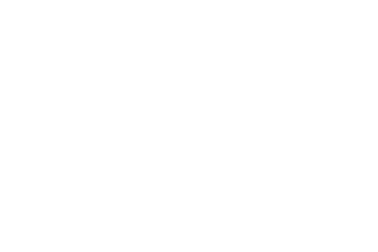](https://www.cityofvancouver.us)  

 *  [Facebook](http://www.facebook.com/VancouverUS) 
 *  [Twitter](http://twitter.com/vancouverUS) 
 *  [Instagram](https://instagram.com/VancouverUS) 
 *  [LinkedIn](https://www.linkedin.com/company/city-of-vancouver-washington) 
 *  [YouTube](https://www.youtube.com/user/CityofVancouverUS) 

 [City Hall415 W. 6th St.Vancouver, WA 98660](https://www.google.com/maps?q=City%20Hall%20415%20W.%206th%20St.,%20WA%2098660) 

  [CONTACT](https://www.cityofvancouver.us/contact/)  

##### RESOURCES

 *  [Accessibility](https://www.cityofvancouver.us/city-managers-office/accessibility-and-inclusion-at-the-city-of-vancouver-for-people-with-disabilities/) 
 *  [ePlans](https://www.cityofvancouver.us/business/permits-licenses-and-inspections/eplans/) 
 *  [Jobs with the City](https://cityofvancouver.us/jobs/) 
 *  [Make a Payment](https://cityofvancouver.us/pay-bills-manage-accounts/) 
 *  [Maps](https://city-of-vancouver-wa-geo-hub-cityofvancouver.hub.arcgis.com/) 
 *  [Municipal Code](https://vancouver.municipal.codes/) 
 *  [Permit Center](https://cityofvancouver.us/business/permits-licenses-and-inspections/) 
 *  [Public Records](https://cityofvancouver.us/government/public-records-request/) 

##### COMMUNITY

 *  [About Vancouver](https://www.cityofvancouver.us/about-vancouver/) 
 *  [Climate Action](https://www.cityofvancouver.us/city-managers-office/climate-action/) 
 *  [Firstenburg Community Center](https://www.cityofvancouver.us/community/community-centers/firstenburg-community-center/) 
 *  [Marshall/Luepke Community Center](https://www.cityofvancouver.us/community/community-centers/marshall-luepke-center/) 
 *  [Neighborhood Associations](https://www.cityofvancouver.us/community/neighborhoods/) 
 *  [Public Art Map](https://city-of-vancouver-wa-geo-hub-cityofvancouver.hub.arcgis.com/apps/fa72863a21ea42c3b114d6e8a2be706a/explore) 
 *  [Water Resources Education Center](https://www.cityofvancouver.us/government/department/public-works/water-resources-education-center/) 

##### DEPARTMENTS

 *  [City Attorney’s Office](https://www.cityofvancouver.us/government/department/city-attorneys-office/) 
 *  [City Manager’s Office](https://www.cityofvancouver.us/city-managers-office/) 
 *  [Community Development](https://www.cityofvancouver.us/government/community-development/) 
 *  [Economic Prosperity and Housing](https://www.cityofvancouver.us/economic-prosperity-and-housing/) 
 *  [Financial and Management Services](https://www.cityofvancouver.us/government/department/financial-and-management-services/) 
 *  [Fire](https://www.cityofvancouver.us/government/department/vancouver-fire-department-vfd/) 
 *  [Human Resources](https://www.cityofvancouver.us/government/department/human-resources-hr/) 
 *  [Parks, Recreation, and Cultural Services](https://www.cityofvancouver.us/government/department/parks-recreation-and-cultural-services/) 
 *  [Police](https://www.cityofvancouver.us/government/department/vancouver-police-department-vpd/) 
 *  [Public Works](https://cityofvancouver.us/departments/public-works/) 

 *  [Employee Portal](https://cityofvancouver.us/employee-portal/) 
 *  [Website Feedback](https://www.cityofvancouver.us/website-feedback/) 
 *  [Policies](https://cityofvancouver.us/policies/) 
 *  [© City of Vancouver]() 
 