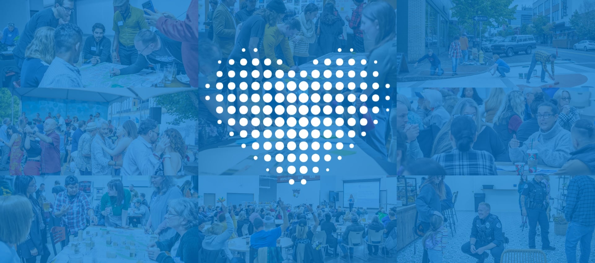
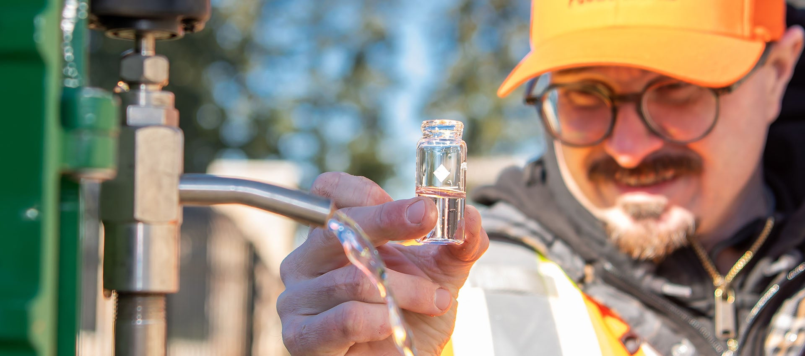
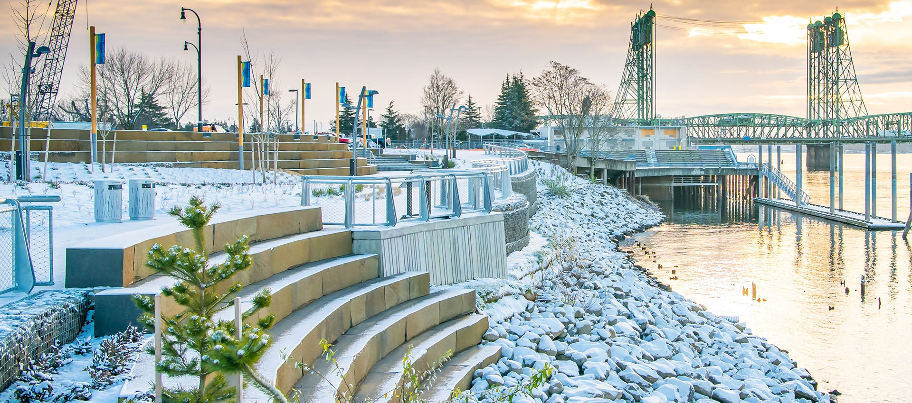
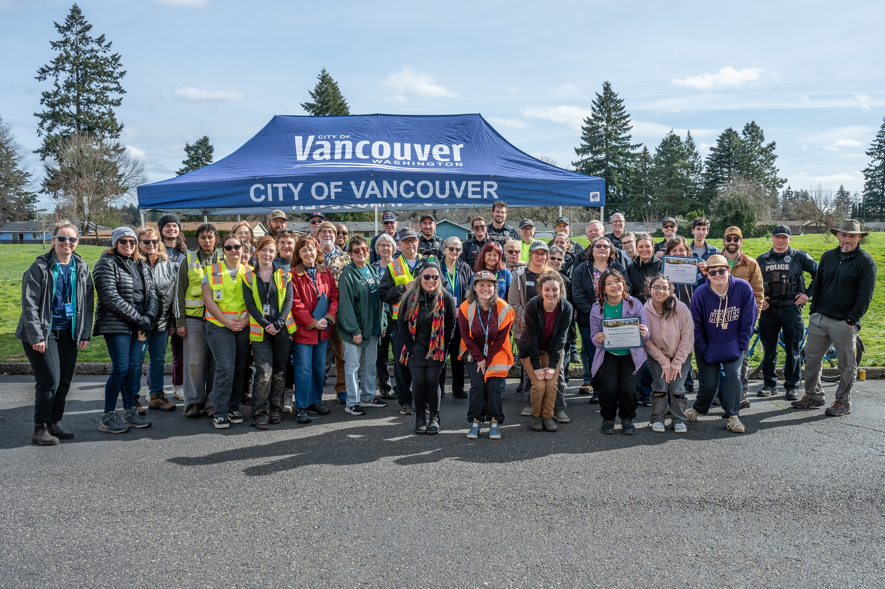
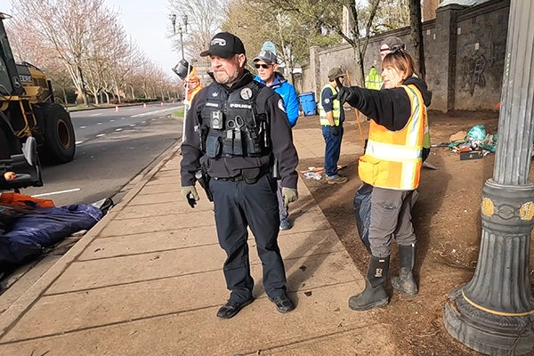
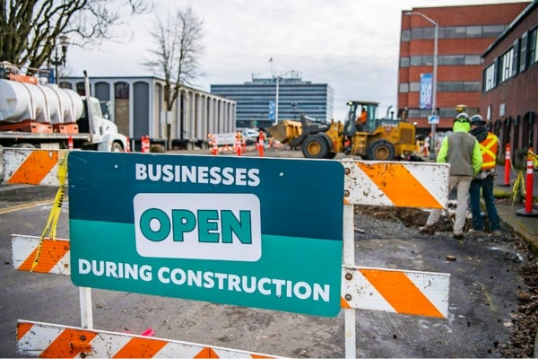
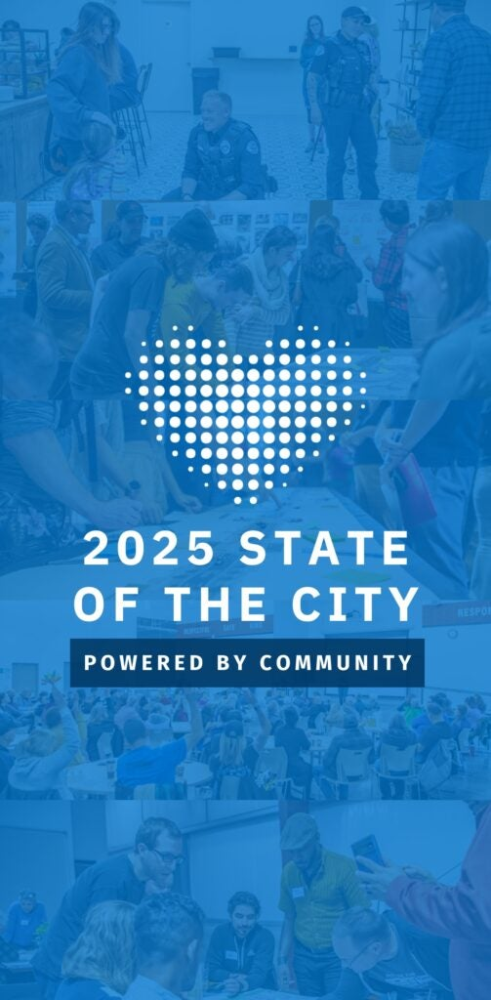
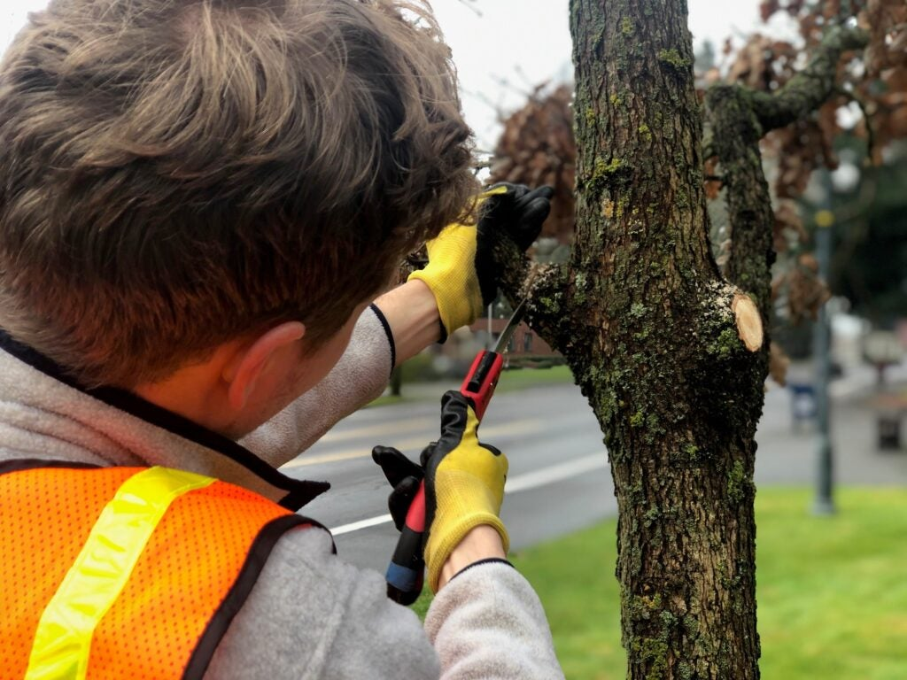
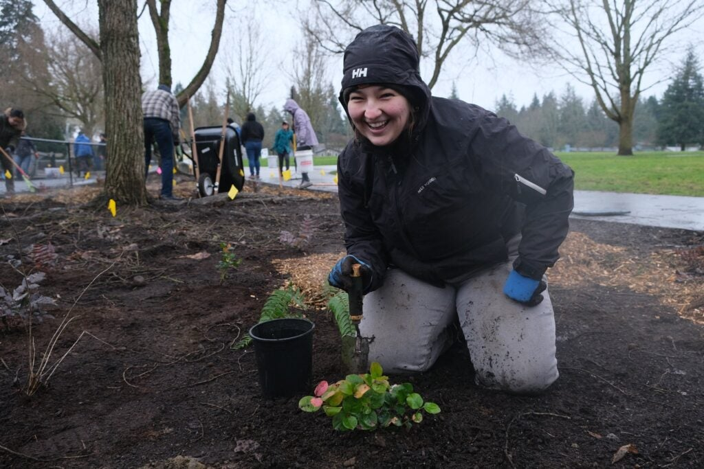

 [Skip to main content](https://www.cityofvancouver.us/#main)  [Skip to search](https://www.cityofvancouver.us/#search)     

 *  [Utility Bill](https://cityofvancouver.selectpaytoday.com/Utility/) 
 *  [Calendar](https://www.cityofvancouver.us/government/calendar/#tab2) 
 Search               

 *  [Services](https://www.cityofvancouver.us/services/) 
   *  [Utility Billing](https://www.cityofvancouver.us/services/utility-billing/) 
   *  [Parking](https://www.cityofvancouver.us/economic-prosperity-and-housing/parking/) 
     *  [Downtown Parking](https://www.cityofvancouver.us/economic-prosperity-and-housing/parking/downtown-parking/) 
     *  [Parking Tickets](https://www.cityofvancouver.us/economic-prosperity-and-housing/parking/parking-tickets/) 
     *  [Parking Portal](https://cityofvancouver.t2hosted.com/Account/Portal) 
   *  [Water, Sewer and Stormwater](https://www.cityofvancouver.us/government/department/public-works/water-sewer-and-stormwater/) 
   *  [Garbage and Recycling](https://www.cityofvancouver.us/services/garbage-recycling/) 
   *  [Event Planning and Permits](https://www.cityofvancouver.us/government/department/parks-recreation-and-cultural-services/event-planning-and-permits/) 
   *  [Urban Forestry](https://www.cityofvancouver.us/government/department/public-works/urban-forestry/) 
   *  [Report a concern](https://www.cityofvancouver.us/services/report-concern/) 
 *  [Business](https://www.cityofvancouver.us/business/) 
   *  [Economic Development](https://cityofvancouver.us/departments/economic-prosperity-housing/) 
   *  [Building Permits, Licenses, Inspections](https://www.cityofvancouver.us/business/permits-licenses-and-inspections/) 
     *  [ePermits](https://www.cityofvancouver.us/business/permits-licenses-and-inspections/epermits/) 
     *  [ePlans](https://www.cityofvancouver.us/business/permits-licenses-and-inspections/eplans/) 
   *  [Building and Construction](https://www.cityofvancouver.us/business/building-construction/) 
     *  [Residential Building Permits](https://www.cityofvancouver.us/business/building-construction/residential-building-permits/) 
     *  [Commercial Building Permits](https://www.cityofvancouver.us/business/building-construction/commercial-building-permits/) 
   *  [Business and Special Licenses](https://www.cityofvancouver.us/business/permits-licenses-and-inspections/business-and-special-licenses/) 
   *  [Planning, Development and Zoning](https://cityofvancouver.us/planning-development-and-zoning/) 
     *  [Land Use Development](https://www.cityofvancouver.us/business/planning-development-and-zoning/land-use-development/) 
     *  [Long Range Planning](https://cityofvancouver.us/long-range-planning/) 
     *  [Comprehensive Plan](https://www.cityofvancouver.us/business/planning-development-and-zoning/comprehensive-plan/) 
   *  [Procurement Services](https://www.cityofvancouver.us/business/procurement-services/) 
     *  [Bids and Proposals](https://cityofvancouver.bonfirehub.com/portal/?tab=openOpportunities) 
 *  [Government](https://www.cityofvancouver.us/government/) 
 *  [Community](https://www.cityofvancouver.us/community/) 
   *  [Be Heard Vancouver](https://www.beheardvancouver.org/) 
   *  [Newsroom](https://www.cityofvancouver.us/community/news/) 
   *  [Special Events](https://www.cityofvancouver.us/government/department/parks-recreation-and-cultural-services/special-events-in-vancouver/) 
   *  [Recreation Activities](https://www.cityofvancouver.us/government/department/parks-recreation-and-cultural-services/recreation-activities/) 
   *  [Parks and Trails](https://www.cityofvancouver.us/community/parks-trails/parkfinder/) 
     *  [Community Gardens](https://www.cityofvancouver.us/government/department/parks-recreation-and-cultural-services/community-gardens/) 
     *  [Public Art Map](https://city-of-vancouver-wa-geo-hub-cityofvancouver.hub.arcgis.com/apps/fa72863a21ea42c3b114d6e8a2be706a/explore) 
   *  [Culture, Arts and Heritage](https://www.cityofvancouver.us/government/department/parks-recreation-and-cultural-services/culture-arts-and-heritage/) 
   *  [Community Centers](https://www.cityofvancouver.us/community/community-centers/) 
     *  [Firstenburg Community Center](https://www.cityofvancouver.us/community/community-centers/firstenburg-community-center/) 
     *  [Marshall/Luepke Community Center](https://www.cityofvancouver.us/community/community-centers/marshall-luepke-center/) 
     *  [Water Resources Education Center](https://www.cityofvancouver.us/government/department/public-works/water-resources-education-center/) 
   *  [Volunteer Programs](https://www.cityofvancouver.us/government/department/parks-recreation-and-cultural-services/volunteer-programs/) 
   *  [Neighborhood Associations](https://www.cityofvancouver.us/community/neighborhoods/) 
   *  [Homelessness](https://www.cityofvancouver.us/city-managers-office/homeless/) 
   *  [Emergency Preparedness](https://www.cityofvancouver.us/community/emergency-preparedness/) 
   *  [Sister City Joyo, Japan](https://www.cityofvancouver.us/about-vancouver/sister-city-joyo-japan/) 
 *  [Data](https://city-of-vancouver-wa-geo-hub-cityofvancouver.hub.arcgis.com/) 

 *  [Mayor and City Council](https://cityofvancouver.us/departments/mayor-city-council/) 
   *  [Agendas and Minutes](https://www.cityofvancouver.us/government/mayor-and-city-council/meetings-agendas-minutes/) 
   *  [Council Meetings](https://www.cityofvancouver.us/government/calendar/) 
   *  [Community Testimony](https://www.cityofvancouver.us/departments/mayor-city-council/#testimony) 
   *  [Contact Council](https://cityofvancouver.us/departments/mayor-city-council/#form) 
 *  [City Manager’s Office](https://cityofvancouver.us/departments/city-managers-office/) 
   *  [City Liaison](https://www.cityofvancouver.us/city-managers-office/city-liaison-services/) 
   *  [Climate Action](https://www.cityofvancouver.us/city-managers-office/climate-action/) 
   *  [Communications](https://www.cityofvancouver.us/city-managers-office/communication/) 
   *  [Strategic Plan](https://www.cityofvancouver.us/government/strategic-plan/) 

 *  [Departments](https://www.cityofvancouver.us/government/department-directory/) 
   *  [City Attorney’s Office](https://www.cityofvancouver.us/departments/city-attorney/) 
   *  [Community Development](https://www.cityofvancouver.us/departments/community-development/) 
   *  [Economic Prosperity and Housing](https://www.cityofvancouver.us/departments/economic-prosperity-housing/) 
   *  [Financial and Management Services](https://www.cityofvancouver.us/departments/financial-management-services/) 
   *  [Vancouver Fire Department](https://www.cityofvancouver.us/departments/fire-department/) 
   *  [Human Resources](https://www.cityofvancouver.us/departments/hr/) 
   *  [Parks, Recreation and Cultural Services](https://www.cityofvancouver.us/departments/parks-recreation-and-cultural-services/) 
   *  [Vancouver Police Department](https://www.cityofvancouver.us/departments/police/) 
   *  [Public Works](https://www.cityofvancouver.us/departments/public-works/) 

 *  [Boards and Commissions](https://www.cityofvancouver.us/government/boards-commissions/) 
 *  [City Center Redevelopment Authority](https://www.cityofvancouver.us/government/city-center-redevelopment-authority/) 
 *  [Downtown Redevelopment Authority](https://www.cityofvancouver.us/government/downtown-redevelopment-authority/) 
 *  [Public Facilities District Board](https://www.cityofvancouver.us/government/public-facilities-district-board/) 
 *  [Transportation Benefit District](https://www.cityofvancouver.us/business/planning-development-and-zoning/transportation-planning/vancouver-transportation-benefit-district/) 
 *  [Interlocal Agreements](https://www.cityofvancouver.us/government/department/financial-and-management-services/interlocal-agreements/) 
 *  [Municipal Code](https://vancouver.municipal.codes/) 
 *  [City Charter](https://www.cityofvancouver.us/government/city-charter/) 
 *  [Public Records Request](https://www.cityofvancouver.us/government/public-records-request/) 
 *  [Budget](https://www.cityofvancouver.us/government/department/financial-and-management-services/budget/) 
 *  [Awards and Recognition](https://www.cityofvancouver.us/about-vancouver/awards-recognition/) 
       [# State of the City 2025Join us on March 24 for the State of the City address and Council Community Forum](http://www.cityofvancouver.us/stateofthecity)        [# Learn about PFAsView recent sampling and read about actions being taken to protect water quality.](https://www.cityofvancouver.us/government/department/public-works/learn-about-pfas/)        [# Vancouver Connects newsletterStay informed! Subscribe for a once-a-month email update from the City.](http://www.cityofvancouver.us/vancouverconnects)        [    

#### Apply for a Job](https://www.cityofvancouver.us/government/department/human-resources-hr/jobs/)   [    

#### Building Permits](https://cityofvancouver.us/business/permits-licenses-and-inspections/)   [    

#### City Council](https://cityofvancouver.us/departments/mayor-city-council/)   [    

#### Find a Park](https://cityofvancouver.us/parks-trails-and-biking/parkfinder/)   [    

#### Garbage and Recycling](https://cityofvancouver.us/services/garbage-recycling/)   [    

#### Report a Concern](https://cityofvancouver.us/services/report-concern/)   [    

#### Payments](https://cityofvancouver.us/services/utility-billing/)   [    

#### Public Records Request](https://cityofvancouver.us/government/public-records-request/)  

## Latest News

     [###### City News

### Vancouver honors volunteers with tree planting 

##### March 19, 2025

City of Vancouver Volunteer and Urban Forestry programs added seven trees to the Volunteer Grove at Centerpointe Park (N.E. Fourth Plain Boulevard at Pacific Way) to recognize civically minded community members who dedicate their time to the city. Now in its eighth year, the Volunteer Grove tree planting...](https://www.cityofvancouver.us/vancouver-honors-volunteers-with-tree-planting-2/)      [###### City News

### Vancouver’s State of the City and Council Community Forum 

##### March 13, 2025

City of Vancouver Mayor Anne McEnerny-Ogle and the Vancouver City Council will host the 2025 State of the City and Council Community Forum at 6 p.m. Monday, March 24. Mayor McEnerny-Ogle’s address will highlight the progress we’ve made together on key issues – community safety, homelessness, affordable housing...](https://www.cityofvancouver.us/vancouvers-state-of-the-city-and-council-community-forum/)      [###### City News

### City Manager Update: March 2025

##### March 7, 2025

Staying the course During this time of ambiguity and transition, I want to reinforce that Vancouver is committed to the course for the future that we plotted before the recent change of federal administrations, built around the core policy themes of climate, equity and community safety. We are also...](https://www.cityofvancouver.us/city-manager-update-march-2025/)  Page 1 of 106 1  [2](https://www.cityofvancouver.us/page/2/)  [3](https://www.cityofvancouver.us/page/3/)  [4](https://www.cityofvancouver.us/page/4/)  [5](https://www.cityofvancouver.us/page/5/) ...  [10](https://www.cityofvancouver.us/page/10/)  [20](https://www.cityofvancouver.us/page/20/)  [30](https://www.cityofvancouver.us/page/30/) ...  [»](https://www.cityofvancouver.us/page/2/)  [Last »](https://www.cityofvancouver.us/page/106/)   [View All News](https://www.cityofvancouver.us/news/)      [### Watch: Mill Plain sound wall camp closureOn March 5, the City closed the encampment along the Mill Plain sound wall. Like all our homelessness emergency response efforts, this closure prioritized compassionate outreach and connecting people living outside to services.](https://youtu.be/3BkSObW900M)  X CLOSE 

     [### Watch: Main Street Promise virtual sneak peekIn January 2025, construction began to improve Main Street in downtown Vancouver, between 5th Street and 15th Street. We are investing in making Main Street safer, more accessible and connected for businesses, residents and visitors. That is the Main Street Promise.](https://youtu.be/knXoUYTkGdo?si=4ovJ9pbQ5dpKgYJg)  X CLOSE 

## Upcoming Events

  [  Registration Required###### City

### State of the City

##### March 24, 2025

Join Vancouver Mayor Anne McEnerny-Ogle and the Vancouver City Council for the 2025 State of the City Address and Council Community Forum. Doors open at 5:30 p.m. The speech begins…](https://www.cityofvancouver.us/events/state-of-the-city/)   [  Registration Required###### Events

### Fruit Tree Pruning Education & Volunteer Work

##### March 27, 2025

Advance registration is required. RSVP today! Join us for a series of volunteer events where you’ll have the opportunity to learn the essential skills of pruning fruit trees and work…](https://www.cityofvancouver.us/events/fruit-tree-pruning-education-volunteer-work/)   [  Registration Required###### Events

### Grandmother Camus Median Flora & Fauna Friday

##### March 28, 2025

Advance registration is required.  RSVP today! *This is an outside work party* at the Grandmother Camus median where volunteers and the Vancouver Bee Project will distribute mulch, pick up litter…](https://www.cityofvancouver.us/events/grandmother-camus-median-flora-fauna-friday/)   [View All Events](https://www.cityofvancouver.us/government/calendar/#tab2)  

## Upcoming Meetings

### State of the City

##### Mon, Mar 24, 2025

 5:30 pm - 12:00 AM 

Firstenburg Community Center

 Registration Required  ** Add to Calendar March 24, 2025 5:30 pm March 24, 2025 UTC State of the City Join Vancouver Mayor Anne McEnerny-Ogle and the Vancouver City Council for the 2025 State of the City Address and Council Community Forum. Doors open at 5:30 p.m. The speech begins at 6 p.m. Community forum begins at 6:45 p.m. RSVP Accessibility and interpretation Live American Sign Language interpretation will be provided. If you require any additional accessibility or language interpretation accommodations, please share those when you register or contact William Cooley at william.cooley@cityofvancouver.us or 360-487-8617. Parking Parking at the Firstenburg Community Center is free but may be limited due to the popularity of this active community space. We encourage you… Firstenburg Community Center 

 [Meeting Details](https://www.cityofvancouver.us/events/state-of-the-city/) 

### City Council Community Forum

##### Mon, Mar 24, 2025

 6:45 pm - 8:30 PM 

Firstenburg Community Center

  ** Add to Calendar March 24, 2025 6:45 pm March 24, 2025 8:30 pm UTC City Council Community Forum To immediately follow the State of the City. The location of the Vancouver City Council Community Forum will be at the Firstenburg Community Center. Following the State of the City, the City Council will host an in-person Community Forum. The Community forum will run for up to 90 minutes or end earlier if all who wish to speak have had an opportunity. The Community Forum is a special event for the public to discuss with the Council in an informal setting about any topic. Additional information can be found at State of the City -The City of Vancouver, WA Accessibility… Firstenburg Community Center 

 [Meeting Details](https://www.cityofvancouver.us/events/city-council-community-forum-9/) 

### Special Urban Forestry Commission Meeting

##### Wed, Mar 26, 2025

 6:00 pm - 12:00 AM 

City Hall, Birch Room

  ** Add to Calendar March 26, 2025 6:00 pm March 26, 2025 UTC Special Urban Forestry Commission Meeting City Hall, Birch Room 

 [Meeting Details](https://www.cityofvancouver.us/events/special-urban-forestry-commission-meeting/) 

### Pre-Application Conference

##### Thu, Mar 27, 2025

 9:00 am - 11:00 AM 

  ** Add to Calendar March 27, 2025 9:00 am March 27, 2025 11:00 am UTC Pre-Application Conference 

#### Agenda

######  [Agenda Summary](https://www.cityofvancouver.us/wp-content/uploads/2025/03/03-27-2025-Agenda.pdf) 

 [Meeting Details](https://www.cityofvancouver.us/events/pre-application-conference-58/) 

  [View All Meetings](https://vancouverwa.portal.civicclerk.com/)  

### Sign Up for Vancouver Connects

Sign up to receive the latest news and information from your City straight to your inbox.

 

 name email CAPTCHA Email This field is for validation purposes and should be left unchanged. 

 

    

 *  [Facebook](http://www.facebook.com/VancouverUS) 
 *  [Twitter](http://twitter.com/vancouverUS) 
 *  [Instagram](https://instagram.com/VancouverUS) 
 *  [LinkedIn](https://www.linkedin.com/company/city-of-vancouver-washington) 
 *  [YouTube](https://www.youtube.com/user/CityofVancouverUS) 

 [City Hall415 W. 6th St.Vancouver, WA 98660](https://www.google.com/maps?q=City%20Hall%20415%20W.%206th%20St.,%20WA%2098660) 

  [CONTACT](https://www.cityofvancouver.us/contact/)  

##### RESOURCES

 *  [Accessibility](https://www.cityofvancouver.us/city-managers-office/accessibility-and-inclusion-at-the-city-of-vancouver-for-people-with-disabilities/) 
 *  [ePlans](https://www.cityofvancouver.us/business/permits-licenses-and-inspections/eplans/) 
 *  [Jobs with the City](https://cityofvancouver.us/jobs/) 
 *  [Make a Payment](https://cityofvancouver.us/pay-bills-manage-accounts/) 
 *  [Maps](https://city-of-vancouver-wa-geo-hub-cityofvancouver.hub.arcgis.com/) 
 *  [Municipal Code](https://vancouver.municipal.codes/) 
 *  [Permit Center](https://cityofvancouver.us/business/permits-licenses-and-inspections/) 
 *  [Public Records](https://cityofvancouver.us/government/public-records-request/) 

##### COMMUNITY

 *  [About Vancouver](https://www.cityofvancouver.us/about-vancouver/) 
 *  [Climate Action](https://www.cityofvancouver.us/city-managers-office/climate-action/) 
 *  [Firstenburg Community Center](https://www.cityofvancouver.us/community/community-centers/firstenburg-community-center/) 
 *  [Marshall/Luepke Community Center](https://www.cityofvancouver.us/community/community-centers/marshall-luepke-center/) 
 *  [Neighborhood Associations](https://www.cityofvancouver.us/community/neighborhoods/) 
 *  [Public Art Map](https://city-of-vancouver-wa-geo-hub-cityofvancouver.hub.arcgis.com/apps/fa72863a21ea42c3b114d6e8a2be706a/explore) 
 *  [Water Resources Education Center](https://www.cityofvancouver.us/government/department/public-works/water-resources-education-center/) 

##### DEPARTMENTS

 *  [City Attorney’s Office](https://www.cityofvancouver.us/government/department/city-attorneys-office/) 
 *  [City Manager’s Office](https://www.cityofvancouver.us/city-managers-office/) 
 *  [Community Development](https://www.cityofvancouver.us/government/community-development/) 
 *  [Economic Prosperity and Housing](https://www.cityofvancouver.us/economic-prosperity-and-housing/) 
 *  [Financial and Management Services](https://www.cityofvancouver.us/government/department/financial-and-management-services/) 
 *  [Fire](https://www.cityofvancouver.us/government/department/vancouver-fire-department-vfd/) 
 *  [Human Resources](https://www.cityofvancouver.us/government/department/human-resources-hr/) 
 *  [Parks, Recreation, and Cultural Services](https://www.cityofvancouver.us/government/department/parks-recreation-and-cultural-services/) 
 *  [Police](https://www.cityofvancouver.us/government/department/vancouver-police-department-vpd/) 
 *  [Public Works](https://cityofvancouver.us/departments/public-works/) 

 *  [Employee Portal](https://cityofvancouver.us/employee-portal/) 
 *  [Website Feedback](https://www.cityofvancouver.us/website-feedback/) 
 *  [Policies](https://cityofvancouver.us/policies/) 
 *  [© City of Vancouver]() 
 