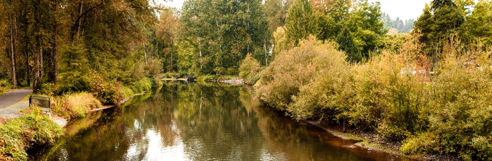

   

Loading

  [Skip to Main Content](http://www.bothellwa.gov/directory.aspx?EID=302#contentarea)  

 [Create a Website Account](http://www.bothellwa.gov/MyAccount/ProfileCreate)  - Manage notification subscriptions, save form progress and more.    

 *  [Website Sign In](http://www.bothellwa.gov/MyAccount) 
    

 1.  [Your Government](http://www.bothellwa.gov/27/Your-Government) 
 1.  [City Services](http://www.bothellwa.gov/101/City-Services) 
 1.  [Doing Business](http://www.bothellwa.gov/35/Doing-Business) 
 1.  [Your Community](http://www.bothellwa.gov/148/Your-Community) 
 1.  [How Do I...](http://www.bothellwa.gov/9/How-Do-I) 
   Search    

 1.  [Home](http://www.bothellwa.gov/directory.aspx?EID=302) 
 1. Staff Directory
    

# Mason Thompson

   [City Council](http://www.bothellwa.gov/Directory.aspx?DID=25) 

Title: Mayor, Position 2

Phone: [425-471-8723]() 

 [Email](mailto:mason.thompson@bothellwa.gov)  

 Councilmember Thompson has previously served as the Chair of the Parks & Recreation Board and on the Capital Facilities Planning Committee. He is also a member of the Executive Committee for the Sierra Club Washington State.  

 

 Mason graduated from the Foster School of Business at the University of Washington and currently works for a software company. He enjoys using his bicycle as transportation to and from his home in Queensgate where he lives with his wife and two children. 

  

 [Return to Staff Directory](http://www.bothellwa.gov/Directory.aspx) 

 1.   [News and Information](http://www.bothellwa.gov/248/News-and-Information)  
 1.   [Legal Stuff](http://www.bothellwa.gov/705/Legal-Stuff)  
 1.   [Title VI Non-Discrimination](http://www.bothellwa.gov/761/Title-VI-Non-Discrimination)    
    1.   [Title VI Public Involvement Form](http://www.bothellwa.gov/2128/Title-VI-Public-Involvement-Form)  
 1.   [Past Virtual Meeting Agendas with Public Comment](http://weblink.bothellwa.gov/weblink/Browse.aspx?id=326834&dbid=0&cr=1)  
  [Utilities](http://www.bothellwa.gov/808/Utilities)   [Permits](http://www.bothellwa.gov/337/Permit-Center)   [Subscribe](http://www.bothellwa.gov/list.aspx)   [Meetings & Agendas](http://www.bothellwa.gov/AgendaCenter)   [Records Request](https://bothellwa.mycusthelp.com/WEBAPP/_rs/(S(pyhfykehjvgohubijgzjgggn))/SupportHome.aspx)   [Jobs](http://agency.governmentjobs.com/bothellwa/default.cfm)   [Maps](http://www.bothellwa.gov/233/Maps-GIS)   [Parks](http://www.bothellwa.gov/249/Parks-Recreation)   [Police](http://www.bothellwa.gov/266/Police-Department)   [Court](http://www.bothellwa.gov/1553/Visit-the-Court)   [Report a Concern](http://www.bothellwa.gov/FormCenter/Customer-Action-Request-12/Customer-Action-Request-286)   [Fire](http://www.ci.bothell.wa.us/415/Fire-Department)      

 Stay Informed, Subscribe Today  [Bothell News](http://www.bothellwa.gov/civicalerts.aspx)   [Emergency Alerts](http://www.bothellwa.gov/1261/Emergency-Alerts)  

 1.    

     

                

### Contact Us

 1.    

 __Bothell City Hall__    

18415 101st Avenue NE   

Bothell, WA 98011   

Phone: [425-806-6100]()    

 [Contact Us](http://www.bothellwa.gov/directory.aspx)    

###  [Quick Links](http://www.bothellwa.gov/QuickLinks.aspx?CID=76,70) 

 1.  [Attend Events](http://www.bothellwa.gov/calendar.aspx?CID=23,)  
 1.  [Boards and Commissions](http://www.bothellwa.gov/263/Boards-Commissions)  
 1.  [City Council](http://www.bothellwa.gov/261/City-Council)  
 1.  [City Services](http://www.bothellwa.gov/101/Services)  
 1.  [Fun Things to Do in Bothell](http://www.explorebothell.com)  
 1.  [Bothell Municipal Code](http://www.codepublishing.com/WA/Bothell)  
 /QuickLinks.aspx 

###  [Helpful Links](http://www.bothellwa.gov/QuickLinks.aspx?CID=38) 

 1.  [Home](http://www.bothellwa.gov/directory.aspx?EID=302)  
 1.  [Site Map](http://www.bothellwa.gov/sitemap)  
 1.  [Accessibility](http://www.bothellwa.gov/Accessibility)  
 1.  [Copyright Notices](http://www.bothellwa.gov/site/copyright)  
 1.  [Employee Access](http://www.bothellwa.gov/72/Intranet)  
 /QuickLinks.aspx Government Websites by [CivicPlus®](https://connect.civicplus.com/referral)  Loading Loading Do Not Show Again Close Select LanguageAbkhazAcehneseAcholiAfarAfrikaansAlbanianAlurAmharicArabicArmenianAssameseAvarAwadhiAymaraAzerbaijaniBalineseBaluchiBambaraBaouléBashkirBasqueBatak KaroBatak SimalungunBatak TobaBelarusianBembaBengaliBetawiBhojpuriBikolBosnianBretonBulgarianBuryatCantoneseCatalanCebuanoChamorroChechenChichewaChinese (Simplified)Chinese (Traditional)ChuukeseChuvashCorsicanCrimean Tatar (Cyrillic)Crimean Tatar (Latin)CroatianCzechDanishDariDhivehiDinkaDogriDombeDutchDyulaDzongkhaEsperantoEstonianEweFaroeseFijianFilipinoFinnishFonFrenchFrench (Canada)FrisianFriulianFulaniGaGalicianGeorgianGermanGreekGuaraniGujaratiHaitian CreoleHakha ChinHausaHawaiianHebrewHiligaynonHindiHmongHungarianHunsrikIbanIcelandicIgboIlocanoIndonesianInuktut (Latin)Inuktut (Syllabics)IrishItalianJamaican PatoisJapaneseJavaneseJingpoKalaallisutKannadaKanuriKapampanganKazakhKhasiKhmerKigaKikongoKinyarwandaKitubaKokborokKomiKonkaniKoreanKrioKurdish (Kurmanji)Kurdish (Sorani)KyrgyzLaoLatgalianLatinLatvianLigurianLimburgishLingalaLithuanianLombardLugandaLuoLuxembourgishMacedonianMadureseMaithiliMakassarMalagasyMalayMalay (Jawi)MalayalamMalteseMamManxMaoriMarathiMarshalleseMarwadiMauritian CreoleMeadow MariMeiteilon (Manipuri)MinangMizoMongolianMyanmar (Burmese)Nahuatl (Eastern Huasteca)NdauNdebele (South)Nepalbhasa (Newari)NepaliNKoNorwegianNuerOccitanOdia (Oriya)OromoOssetianPangasinanPapiamentoPashtoPersianPolishPortuguese (Brazil)Portuguese (Portugal)Punjabi (Gurmukhi)Punjabi (Shahmukhi)QuechuaQʼeqchiʼRomaniRomanianRundiRussianSami (North)SamoanSangoSanskritSantali (Latin)Santali (Ol Chiki)Scots GaelicSepediSerbianSesothoSeychellois CreoleShanShonaSicilianSilesianSindhiSinhalaSlovakSlovenianSomaliSpanishSundaneseSusuSwahiliSwatiSwedishTahitianTajikTamazightTamazight (Tifinagh)TamilTatarTeluguTetumThaiTibetanTigrinyaTivTok PisinTonganTshilubaTsongaTswanaTuluTumbukaTurkishTurkmenTuvanTwiUdmurtUkrainianUrduUyghurUzbekVendaVenetianVietnameseWarayWelshWolofXhosaYakutYiddishYorubaYucatec MayaZapotecZulu Powered by  [Translate](https://translate.google.com)  

### Live Edit

      Original text Rate this translation Your feedback will be used to help improve Google Translate 