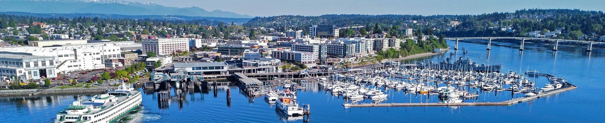

   

Loading

  [Skip to Main Content](https://bremertonwa.gov/CivicAlerts.aspx?AID=838#contentarea)  

 [Create a Website Account](https://bremertonwa.gov/MyAccount/ProfileCreate)  - Manage notification subscriptions, save form progress and more.    

 *  [Website Sign In](https://bremertonwa.gov/MyAccount) 
    

 1.  [Our Government](https://bremertonwa.gov/27/Our-Government) 
 1.  [City Services](https://bremertonwa.gov/101/City-Services) 
 1.  [Doing Business](https://bremertonwa.gov/35/Doing-Business) 
 1.  [Discover Bremerton](https://bremertonwa.gov/31/Discover-Bremerton) 
 1.  [How Do I...](https://bremertonwa.gov/9/How-Do-I) 
               Search    

 1.  [Home](https://bremertonwa.gov/CivicAlerts.aspx?AID=838) 
 1. News Flash

# News Flash

## Public Notices

 Posted on: February 23, 2024 

### Message from Mayor Wheeler

I am pleased to present to you my 2024 initiatives for the City of Bremerton! These initiatives continue to advance long-term City projects, support essential services for our residents, and create a framework for improving safety, economic stability, and quality of life in our community.

The first Mayor’s Initiatives were developed in 2018 my first year in office, and they continue to be updated annually. I hope you’ll take a moment to view my 2024 initiatives for our City!

Please see my initiatives for 2024 here:  [https://bit.ly/3T9vdCI](https://bit.ly/3T9vdCI).

  

Greg Wheeler

Mayor

         [⇐PreviousKitsap Lake Algae Control Treatment](https://bremertonwa.gov/CivicAlerts.aspx?AID=844)  [Next⇒Message from Mayor Wheeler](https://bremertonwa.gov/CivicAlerts.aspx?AID=843)  

## Other News in Public Notices

###  [Bremerton Parks, Recreation and Open Space (PROS) Plan](https://bremertonwa.gov/CivicAlerts.aspx?AID=864) 

 Posted on: February 19, 2025 

###  [Message from Mayor Wheeler](https://bremertonwa.gov/CivicAlerts.aspx?AID=870) 

 Posted on: March 6, 2025 

###  [Message from Mayor Wheeler](https://bremertonwa.gov/CivicAlerts.aspx?AID=868) 

 Posted on: February 27, 2025 

###  [Bremerton Wastewater Comprehensive Plan](https://bremertonwa.gov/CivicAlerts.aspx?AID=866) 

 Posted on: February 27, 2025 

###  [Message from Mayor Wheeler](https://bremertonwa.gov/CivicAlerts.aspx?AID=865) 

 Posted on: February 13, 2025 

###  [Message from Mayor Wheeler](https://bremertonwa.gov/CivicAlerts.aspx?AID=863) 

 Posted on: February 6, 2025 

###  [Message from Mayor Wheeler](https://bremertonwa.gov/CivicAlerts.aspx?AID=862) 

 Posted on: January 14, 2025 

###  [Message from Mayor Wheeler](https://bremertonwa.gov/CivicAlerts.aspx?AID=860) 

 Posted on: January 15, 2025 

###  [Message from Mayor Wheeler](https://bremertonwa.gov/CivicAlerts.aspx?AID=859) 

 Posted on: January 9, 2025 

###  [Message from Mayor Wheeler](https://bremertonwa.gov/CivicAlerts.aspx?AID=858) 

 Posted on: November 22, 2024 

###  [Message from Mayor Wheeler](https://bremertonwa.gov/CivicAlerts.aspx?AID=857) 

 Posted on: November 4, 2024 

###  [Message from Mayor Wheeler](https://bremertonwa.gov/CivicAlerts.aspx?AID=855) 

 Posted on: October 31, 2024 

###  [Energy-Saving Tree Program](https://bremertonwa.gov/CivicAlerts.aspx?AID=852) 

 Posted on: September 3, 2024 

###  [Beautify Bremerton Cleanup – Sat., Sept. 14](https://bremertonwa.gov/CivicAlerts.aspx?AID=851) 

 Posted on: August 28, 2024 

###  [Haddon Park Playground Planning Meeting](https://bremertonwa.gov/CivicAlerts.aspx?AID=850) 

 Posted on: August 13, 2024 | Last Modified on: August 13, 2024 

###  [Kiwanis Park Playground Dedication Ceremony](https://bremertonwa.gov/CivicAlerts.aspx?AID=848) 

 Posted on: July 3, 2024 

###  [July Fourth in the City of Bremerton](https://bremertonwa.gov/CivicAlerts.aspx?AID=847) 

 Posted on: June 28, 2024 

###  [Kitsap Lake Algae Control Treatment](https://bremertonwa.gov/CivicAlerts.aspx?AID=844) 

 Posted on: May 17, 2024 

###  [Message from Mayor Wheeler](https://bremertonwa.gov/CivicAlerts.aspx?AID=843) 

 Posted on: May 3, 2024 

###  [Bremerton Planning Commission April 15](https://bremertonwa.gov/CivicAlerts.aspx?AID=840) 

 Posted on: April 9, 2024 

###  [2024 Parking Lot Rate Updates](https://bremertonwa.gov/CivicAlerts.aspx?AID=836) 

 Posted on: January 4, 2024 

###  [Message from Mayor Wheeler](https://bremertonwa.gov/CivicAlerts.aspx?AID=835) 

 Posted on: December 29, 2023 

###  [Message from Mayor Wheeler](https://bremertonwa.gov/CivicAlerts.aspx?AID=834) 

 Posted on: December 15, 2023 

###  [Message from Mayor Wheeler](https://bremertonwa.gov/CivicAlerts.aspx?AID=831) 

 Posted on: October 19, 2023 

###  [Message from Mayor Wheeler](https://bremertonwa.gov/CivicAlerts.aspx?AID=829) 

 Posted on: September 14, 2023 

###  [Message from Mayor Wheeler](https://bremertonwa.gov/CivicAlerts.aspx?AID=827) 

 Posted on: July 28, 2023 

###  [Message from Mayor Wheeler](https://bremertonwa.gov/CivicAlerts.aspx?AID=826) 

 Posted on: July 26, 2023 

###  [West Kitsap Way Planning Study](https://bremertonwa.gov/CivicAlerts.aspx?AID=824) 

 Posted on: June 15, 2023 

###  [Message from Mayor Wheeler](https://bremertonwa.gov/CivicAlerts.aspx?AID=813) 

 Posted on: April 3, 2023 

###  [Message from Mayor Wheeler](https://bremertonwa.gov/CivicAlerts.aspx?AID=801) 

 Posted on: December 22, 2022 

###  [Message from Mayor Wheeler](https://bremertonwa.gov/CivicAlerts.aspx?AID=800) 

 Posted on: December 21, 2022 

###  [Message from Mayor Wheeler](https://bremertonwa.gov/CivicAlerts.aspx?AID=799) 

 Posted on: December 20, 2022 

###  [Message from Mayor Wheeler](https://bremertonwa.gov/CivicAlerts.aspx?AID=798) 

 Posted on: December 19, 2022 

###  [Message from Mayor Wheeler](https://bremertonwa.gov/CivicAlerts.aspx?AID=795) 

 Posted on: November 29, 2022 

###  [Message from Mayor Wheeler](https://bremertonwa.gov/CivicAlerts.aspx?AID=792) 

 Posted on: October 20, 2022 

###  [Message from Mayor Wheeler](https://bremertonwa.gov/CivicAlerts.aspx?AID=791) 

 Posted on: October 3, 2022 

###  [Message from Mayor Wheeler](https://bremertonwa.gov/CivicAlerts.aspx?AID=790) 

 Posted on: September 19, 2022 

###  [Proposed Zoning Code Amendments](https://bremertonwa.gov/CivicAlerts.aspx?AID=788) 

 Posted on: September 2, 2022 

###  [Wayfinding Survey](https://bremertonwa.gov/CivicAlerts.aspx?AID=785) 

 Posted on: August 29, 2022 

###  [July Fourth in the City of Bremerton](https://bremertonwa.gov/CivicAlerts.aspx?AID=777) 

 Posted on: June 28, 2022 

###  [Evergreen Rotary Park Boat Launch and Parking Lots Closure](https://bremertonwa.gov/CivicAlerts.aspx?AID=778) 

 Posted on: June 16, 2022 

###  [Kitsap Lake Algae Control and Aquatic Vegetation Management](https://bremertonwa.gov/CivicAlerts.aspx?AID=775) 

 Posted on: May 20, 2022 

###  [Broadband, Internet and Cable Survey](https://bremertonwa.gov/CivicAlerts.aspx?AID=774) 

 Posted on: May 23, 2022 

###  [Notice of Public Hearing](https://bremertonwa.gov/CivicAlerts.aspx?AID=773) 

 Posted on: May 17, 2022 

###  [Kitsap Lake Closure](https://bremertonwa.gov/CivicAlerts.aspx?AID=772) 

 Posted on: May 10, 2022 

###  [Broadband, Internet and Cable Survey](https://bremertonwa.gov/CivicAlerts.aspx?AID=768) 

 Posted on: April 25, 2022 

###  [Message from Mayor Wheeler](https://bremertonwa.gov/CivicAlerts.aspx?AID=764) 

 Posted on: February 28, 2022 

### Module Search

 Enter Search Terms All categoriesPublic NoticesCDBG

### Tools

 1.  [RSS](https://bremertonwa.gov/rss.aspx#rssCivicAlerts) 
 1.  [Notify Me®](https://bremertonwa.gov/civicalerts.aspx?Mode=Subscribe) 
 1. 

### Categories

 1.  [All Categories](https://bremertonwa.gov/CivicAlerts.aspx) 
 1.  [Public Notices](https://bremertonwa.gov/CivicAlerts.aspx?CID=1) 
 1.  [CDBG](https://bremertonwa.gov/CivicAlerts.aspx?CID=19) 

 1.   [Athletics](https://bremertonwa.gov/249/Athletics)  
 1.   [Comments & Feedback](https://bremertonwa.gov/FormCenter/General-7/Comment-Form-49)  
 1.   [Current Jobs](https://bremertonwa.gov/169/Current-Jobs)  
 1.   [Customer Response (Bremerton1)](http://bremerton1.bremertonwa.gov)  
 1.   [Tax & Licensing](https://bremertonwa.gov/419/Tax-License-Division)  
 1.   [Utility Billing](https://bremertonwa.gov/524/Utility-Billing)  
 1.   [Watch City Council Live](https://bremertonwa.gov/1077/Watch-City-Council-Live)  
  [Online Payments Pay utility bills, licensing, taxes, fines, and registration fees online](https://bremertonwa.gov/137/Online-Payments)   [Employment Learn about current job opportunities and apply online](https://bremertonwa.gov/169/Current-Jobs)   [Report an Issue Discover online services](https://bremertonwa.gov/869/Online-Services)   [Agendas & Minutes Download City Council, Commission, and Committee agendas, minutes, and media](https://bremertonwa.gov/868/Agendas-Minutes)   [Parks & Recreation Explore city parks, and access athletics and recreation information](https://bremertonwa.gov/210/Parks-Recreation)   [Emergency Management Contact Police and Fire and learn about emergency services](https://bremertonwa.gov/166/Emergency-Management)  

 1.    

     

### Contact Us

 1.    

 __Bremerton__    

345 6th Street,   

Suite 100   

Bremerton, WA 98337   

### Connect With Us

  [Facebook](https://bremertonwa.gov/facebook)   [LinkedIn](https://bremertonwa.gov/linkedin)   [X](https://bremertonwa.gov/twitter)   [YouTube](https://bremertonwa.gov/youtube)  

###  [Quick Links](https://bremertonwa.gov/QuickLinks.aspx?CID=178) 

 1.  [City Employment](https://bremertonwa.gov/169/Current-Jobs)  
 1.  [Council Meetings](https://bremertonwa.gov/691/Council-Meetings)  
 1.  [Codes & Ordinances](https://bremertonwa.gov/148/Codes-Ordinances)  
 1.  [Parks & Rec Registration](https://bremertonwa.gov/274/Registration)  
 1.  [Disclaimer](https://bremertonwa.gov/125/Disclaimer)  
 /QuickLinks.aspx 

###  [FAQs](https://bremertonwa.gov/Faq.aspx?TID=15) 

 1.  [Where is City Hall located?](https://bremertonwa.gov/Faq.aspx?QID=155) 
 1.  [Is my property within City limits?](https://bremertonwa.gov/Faq.aspx?QID=162) 
 1.  [I am a city resident. What Council District do I belong to?](https://bremertonwa.gov/Faq.aspx?QID=163) 
 /FAQ.aspx 

###  [Site Links](https://bremertonwa.gov/QuickLinks.aspx?CID=130) 

 1.  [Contact Us](https://bremertonwa.gov/directory.aspx)  
 1.  [Document Center](https://bremertonwa.gov/DocumentCenter)  
 1.  [Form Center](https://bremertonwa.gov/FormCenter)  
 1.  [Pay Your Bill](https://bremertonwa.gov/137/Online-Payments)  
 1.  [Submit a Comment](https://bremertonwa.gov/FormCenter/General-7/Comment-Form-49)  
 /QuickLinks.aspx Government Websites by [CivicPlus®](https://connect.civicplus.com/referral)  Loading Loading Do Not Show Again Close Powered by  [Translate](https://translate.google.com)  

### Live Edit

      Original text Rate this translation Your feedback will be used to help improve Google Translate      