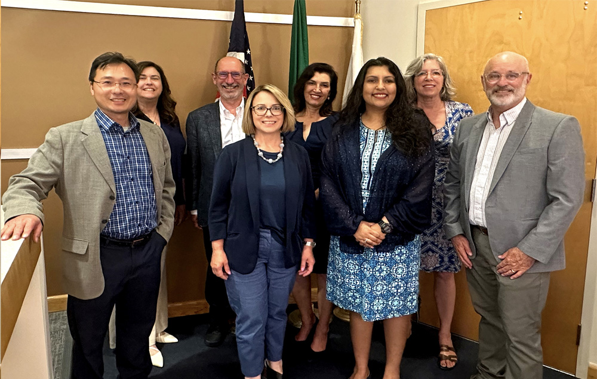

  [Skip to Content](http://edmondswa.gov/government/city_council#page)      [City of Edmonds Washington](http://edmondswa.gov/government/city_council)  

 *  [Facebook](https://www.facebook.com/cityofedmonds) 
 *  [Twitter](https://twitter.com/waedmonds?lang=en) 
  [Open Search Box]()      [Language]()  Select LanguageAbkhazAcehneseAcholiAfarAfrikaansAlbanianAlurAmharicArabicArmenianAssameseAvarAwadhiAymaraAzerbaijaniBalineseBaluchiBambaraBaouléBashkirBasqueBatak KaroBatak SimalungunBatak TobaBelarusianBembaBengaliBetawiBhojpuriBikolBosnianBretonBulgarianBuryatCantoneseCatalanCebuanoChamorroChechenChichewaChinese (Simplified)Chinese (Traditional)ChuukeseChuvashCorsicanCrimean Tatar (Cyrillic)Crimean Tatar (Latin)CroatianCzechDanishDariDhivehiDinkaDogriDombeDutchDyulaDzongkhaEnglishEsperantoEstonianEweFaroeseFijianFilipinoFinnishFonFrenchFrench (Canada)FrisianFriulianFulaniGaGalicianGeorgianGermanGreekGuaraniGujaratiHaitian CreoleHakha ChinHausaHawaiianHebrewHiligaynonHindiHmongHungarianHunsrikIbanIcelandicIgboIlocanoIndonesianInuktut (Latin)Inuktut (Syllabics)IrishItalianJamaican PatoisJapaneseJavaneseJingpoKalaallisutKannadaKanuriKapampanganKazakhKhasiKhmerKigaKikongoKinyarwandaKitubaKokborokKomiKonkaniKoreanKrioKurdish (Kurmanji)Kurdish (Sorani)KyrgyzLaoLatgalianLatvianLigurianLimburgishLingalaLithuanianLombardLugandaLuoLuxembourgishMacedonianMadureseMaithiliMakassarMalagasyMalayMalay (Jawi)MalayalamMalteseMamManxMaoriMarathiMarshalleseMarwadiMauritian CreoleMeadow MariMeiteilon (Manipuri)MinangMizoMongolianMyanmar (Burmese)Nahuatl (Eastern Huasteca)NdauNdebele (South)Nepalbhasa (Newari)NepaliNKoNorwegianNuerOccitanOdia (Oriya)OromoOssetianPangasinanPapiamentoPashtoPersianPolishPortuguese (Brazil)Portuguese (Portugal)Punjabi (Gurmukhi)Punjabi (Shahmukhi)QuechuaQʼeqchiʼRomaniRomanianRundiRussianSami (North)SamoanSangoSanskritSantali (Latin)Santali (Ol Chiki)Scots GaelicSepediSerbianSesothoSeychellois CreoleShanShonaSicilianSilesianSindhiSinhalaSlovakSlovenianSomaliSpanishSundaneseSusuSwahiliSwatiSwedishTahitianTajikTamazightTamazight (Tifinagh)TamilTatarTeluguTetumThaiTibetanTigrinyaTivTok PisinTonganTshilubaTsongaTswanaTuluTumbukaTurkishTurkmenTuvanTwiUdmurtUkrainianUrduUyghurUzbekVendaVenetianVietnameseWarayWelshWolofXhosaYakutYiddishYorubaYucatec MayaZapotecZulu   Powered by  [Translate](https://translate.google.com)  

 *  [Home](http://edmondswa.gov/home) 
 *  [Government](http://edmondswa.gov/government)  
   *   [Mayor](http://edmondswa.gov/government/mayor)  
   *   [City Employment](http://edmondswa.gov/government/city_employment)  
   *   [Departments](http://edmondswa.gov/government/departments)  
     *   [Mayor's Office](http://edmondswa.gov/government/departments/mayors_office)  
     *   [Cultural Services](http://edmondswa.gov/government/departments/cultural_services)  
     *   [Finance](http://edmondswa.gov/government/departments/finance)  
     *   [City Clerk](http://edmondswa.gov/government/departments/city_clerk)  
     *   [Community Services](http://edmondswa.gov/government/departments/community_services)  
     *   [Planning and Development](http://edmondswa.gov/government/departments/development_services)  
     *   [Economic Development](http://edmondswa.gov/government/departments/economic_development)  
     *   [Human Resources](http://edmondswa.gov/government/departments/human_resources)  
     *   [Human Services](http://edmondswa.gov/government/departments/human_services)  
     *   [Municipal Court](http://edmondswa.gov/government/departments/municipal_court)  
     *   [Parks & Recreation](http://edmondswa.gov/government/departments/parks_and_recreation)  
     *   [Police Department](http://edmondswa.gov/government/departments/police_department)  
     *   [Public Works and Utilities](http://edmondswa.gov/government/departments/public_works_and_utilities)  
   *   [Municipal Court](http://edmondswa.gov/government/municipal_court)  
   *   [City Codes](http://edmondswa.gov/government/city_codes)  
   *   [Meeting Agendas](http://edmondswa.gov/government/meeting_agendas)  
   *   [City Council](http://edmondswa.gov/government/city_council)  
     *   [Agendas & Packets](http://edmondswa.gov/government/city_council/agendas_packets)  
     *   [City Council Meetings Overview](http://edmondswa.gov/government/city_council/meetings_overview)  
     *   [City Council Resources](http://edmondswa.gov/government/city_council/city_council_resources)  
     *   [Contact City Council Members](http://edmondswa.gov/government/city_council/contact_city_council_members)  
     *   [Council Meeting Minutes](http://edmondswa.gov/government/city_council/council_meeting_minutes)  
     *   [Agenda Planner](http://edmondswa.gov/government/city_council/agenda_planner)  
     *   [Mission & Purpose](http://edmondswa.gov/government/city_council/mission__purpose___contact)  
     *   [Ordinances & Resolutions](http://edmondswa.gov/government/city_council/ordinances___resolutions)  
     *   [Online Public Comment](http://edmondswa.gov/government/city_council/online_public_comment)  
   *   [Fire/EMS Annexation Ballot Info](http://edmondswa.gov/government/fire__e_m_s_annexation_ballot_info)  
     *   [Cost Calculator](http://edmondswa.gov/government/fire__e_m_s_annexation_ballot_info/cost_calculator)  
   *   [City Budget](http://edmondswa.gov/government/city_budget)  
     *   [Blue Ribbon Panel](http://edmondswa.gov/government/city_budget/blue_ribbon_panel)  
     *   [Community Advisory Panel](http://edmondswa.gov/government/city_budget/community_advisory_group)  
     *   [Community Survey](http://edmondswa.gov/government/city_budget/community_survey)  
     *   [Budgeting by Priority](http://edmondswa.gov/government/city_budget/budgeting_by_priority)  
   *   [Districts](http://edmondswa.gov/government/districts)  
   *   [Communications](http://edmondswa.gov/government/communications)  
     *   [Press Releases](http://edmondswa.gov/government/communications/press_releases)  
     *   [Police Press Releases](http://edmondswa.gov/government/communications/police_press_releases)  
     *   [City Chat Column](http://edmondswa.gov/government/communications/city_of_edmonds_blog)  
     *   [Our Edmonds Newsletter](http://edmondswa.gov/government/communications/our_edmonds_newsletter)  
     *   [Government Channel](http://edmondswa.gov/government/communications/government_channel)  
     *   [News](http://edmondswa.gov/government/communications/news)  
     *   [Calendars](http://edmondswa.gov/government/communications/calendars)  
     *   [Historical Proclamations](http://edmondswa.gov/government/communications/historical_proclamations)  
   *   [Boards and Commissions](http://edmondswa.gov/government/boards_and_commissions)  
     *   [Boards & Commissions Openings](http://edmondswa.gov/government/boards_and_commissions/boards_commissions_openings)  
     *   [Agendas](http://edmondswa.gov/government/boards_and_commissions/agendas)  
     *   [Architectural Design Board (Suspended)](http://edmondswa.gov/government/boards_and_commissions/architectural_design_board)  
     *   [Arts Commission (Suspended)](http://edmondswa.gov/government/boards_and_commissions/arts_commission)  
     *   [Cemetery Board](http://edmondswa.gov/government/boards_and_commissions/cemetery_board)  
     *   [Civil Service Commission](http://edmondswa.gov/government/boards_and_commissions/civil_service_commission)  
     *   [LEOFF 1 Disability Board](http://edmondswa.gov/government/boards_and_commissions/disability_board)  
     *   [Diversity, Equity, Inclusion, and Accessibility](http://edmondswa.gov/government/boards_and_commissions/diversity__equity__inclusion__and_accessibility)  
     *   [Economic Development Commission](http://edmondswa.gov/government/boards_and_commissions/economic_development_commission)  
     *   [Hearing Examiner](http://edmondswa.gov/government/boards_and_commissions/hearing_examiner)  
     *   [Historic Preservation Commission (Suspended)](http://edmondswa.gov/government/boards_and_commissions/historic_preservation_commission)  
     *   [Lodging Tax advisory Committee](http://edmondswa.gov/government/boards_and_commissions/lodging_tax_committee)  
     *   [Mayors' Climate Protection Committee](http://edmondswa.gov/government/boards_and_commissions/mayor_s_climate_protection_committee)  
     *   [Planning Board](http://edmondswa.gov/government/boards_and_commissions/planning_board)  
     *   [Salary Commission](http://edmondswa.gov/government/boards_and_commissions/salary_commission)  
     *   [Sister City Commission](http://edmondswa.gov/government/boards_and_commissions/sister_city_commission)  
     *   [Tree Board (Suspended)](http://edmondswa.gov/government/boards_and_commissions/tree_board)  
     *   [Youth Commission](http://edmondswa.gov/government/boards_and_commissions/youth_commission)  
     *   [Transportation Committee](http://edmondswa.gov/government/boards_and_commissions/transportation_committee)  
   *   [Festivals and Events](http://edmondswa.gov/government/festivals_and_events)  
 *  [Services](http://edmondswa.gov/services)  
   *   [Human Services](http://edmondswa.gov/services/human_services)  
   *   [Utility Payments](http://edmondswa.gov/services/utility_payments)  
   *   [Police Department](http://edmondswa.gov/services/police)  
   *   [Fire](http://edmondswa.gov/services/fire)  
   *   [Permit Assistance](http://edmondswa.gov/services/permit_assistance)  
     *   [Permit Record Search](http://edmondswa.gov/services/permit_assistance/permit_record_search)  
     *   [Apply For A Permit](http://edmondswa.gov/services/permit_assistance/apply_for_a_permit)  
     *   [Permit Information, Forms & Fees](http://edmondswa.gov/services/permit_assistance/permit_information___forms)  
     *   [Codes and Standards](http://edmondswa.gov/services/permit_assistance/codes_and_standards)  
     *   [Construction & Inspections](http://edmondswa.gov/services/permit_assistance/construction_inspections)  
     *   [GIS Web Map - Utility Map](http://edmondswa.gov/services/permit_assistance/gis_web_map_-_utility_map)  
   *   [Maps/GIS](http://edmondswa.gov/services/maps_gis)  
     *   [GIS Web Map](http://edmondswa.gov/services/maps_gis/gis_web_map)  
     *   [GIS Data Request Form](http://edmondswa.gov/services/maps_gis/gis_data_request_form)  
     *   [Maps](http://edmondswa.gov/services/maps_gis/maps)  
   *   [Public Involvement](http://edmondswa.gov/services/public_involvement)  
     *   [City Council Information](http://edmondswa.gov/services/public_involvement/city_council_information)  
     *   [Boards and Commissions](http://edmondswa.gov/services/public_involvement/boards_and_commissions)  
     *   [Meeting Agendas and Materials](http://edmondswa.gov/services/public_involvement/meeting_agendas_and_materials)  
     *   [Public Notices](http://edmondswa.gov/services/public_involvement/public_notices)  
     *   [Citizen Liaison Program](http://edmondswa.gov/services/public_involvement/citizen_liaison_program)  
   *   [Sustainability](http://edmondswa.gov/services/sustainability)  
     *   [Sustainability Initiatives](http://edmondswa.gov/services/sustainability/sustainability)  
     *   [Climate Change](http://edmondswa.gov/services/sustainability/climate)  
     *   [Water](http://edmondswa.gov/services/sustainability/water)  
     *   [Energy](http://edmondswa.gov/services/sustainability/energy)  
     *   [Trees](http://edmondswa.gov/services/sustainability/trees)  
   *   [Cemetery](http://edmondswa.gov/services/cemetery)  
     *   [Services and Prices](http://edmondswa.gov/services/cemetery/services_and_prices)  
     *   [Grave Search](http://edmondswa.gov/services/cemetery/grave_search)  
     *   [Abandoned Lot Program](http://edmondswa.gov/services/cemetery/abandoned_lot_program)  
   *   [Community Resources](http://edmondswa.gov/services/community_resources)  
     *   [Community Resource Guide](http://edmondswa.gov/services/community_resources/community_resource_guide)  
     *   [Website Feedback Form](http://edmondswa.gov/services/community_resources/website_feedback_form)  
     *   [Website Accessibility](http://edmondswa.gov/services/community_resources/accessibility)  
   *   [Environmental Resources Portal](http://edmondswa.gov/services/environmental_resource_portal)  
     *   [Leadership and Volunteering](http://edmondswa.gov/services/environmental_resource_portal/leadership_and_volunteering)  Environmental Resource Page 
     *   [Conservation At Home](http://edmondswa.gov/services/environmental_resource_portal/conservation_at_home)  
     *   [Parks and Greenspaces](http://edmondswa.gov/services/environmental_resource_portal/parks_and_greenspaces)  
     *   [Plants and Wildlife](http://edmondswa.gov/services/environmental_resource_portal/plants_and_wildlife)  
   *   [Emergency Management](http://edmondswa.gov/services/emergency_management)  
     *   [Disaster Videos](http://edmondswa.gov/services/emergency_management/disaster_videos)  
     *   [Disaster Preparation](http://edmondswa.gov/services/emergency_management/disaster_preparation)  
 *  [Doing Business](http://edmondswa.gov/doing_business)  
   *   [Start/Expand Your Business](http://edmondswa.gov/doing_business/start__expand_your_business)  
   *   [Community and Business Resources](http://edmondswa.gov/doing_business/community_and_business_resources)  
   *   [Business Licenses](http://edmondswa.gov/doing_business/business_licenses)  
   *   [Bids, RFP's, and RFQ's](http://edmondswa.gov/doing_business/bids_rfp_s_and_rfq_s)  
   *   [Edmonds Taxes and Incentives](http://edmondswa.gov/doing_business/edmonds_taxes_and_incentives)  
   *   [Multi-Family Tax Exemption](http://edmondswa.gov/doing_business/multi-_family_tax_exemption)  
   *   [Visit Our Business Districts](http://edmondswa.gov/doing_business/visit_our_business_districts)  
   *   [Edmonds Creative District](http://edmondswa.gov/doing_business/edmonds_creative_district)  
     *   [4th Avenue Cultural Corridor](http://edmondswa.gov/doing_business/edmonds_creative_district/4th_avenue_cultural_corridor)  
   *   [Edmonds Businesses Reopen](http://edmondswa.gov/doing_business/edmonds_businesses_reopen)  
 *  [I Want To…](http://edmondswa.gov/i_want_to_) 
 *  [Explore Edmonds](http://edmondswa.gov/visit_edmonds) 
 *  [City Jobs](http://edmondswa.gov/city_jobs) 
  [**MENU](http://edmondswa.gov/government/city_council#mobile-nav)  [MENU]()  

 *  [Home](http://edmondswa.gov/home) 
 *  [Government](http://edmondswa.gov/government)  [Government]() 
   *  [Mayor](http://edmondswa.gov/government/mayor) 
   *  [City Employment](http://edmondswa.gov/government/city_employment) 
   *  [Departments](http://edmondswa.gov/government/departments)  [Departments]() 
     *  [Mayor's Office](http://edmondswa.gov/government/departments/mayors_office) 
     *  [Cultural Services](http://edmondswa.gov/government/departments/cultural_services) 
     *  [Finance](http://edmondswa.gov/government/departments/finance) 
     *  [City Clerk](http://edmondswa.gov/government/departments/city_clerk) 
     *  [Community Services](http://edmondswa.gov/government/departments/community_services) 
     *  [Planning and Development](http://edmondswa.gov/government/departments/development_services) 
     *  [Economic Development](http://edmondswa.gov/government/departments/economic_development) 
     *  [Human Resources](http://edmondswa.gov/government/departments/human_resources) 
     *  [Human Services](http://edmondswa.gov/government/departments/human_services) 
     *  [Municipal Court](http://edmondswa.gov/government/departments/municipal_court) 
     *  [Parks & Recreation](http://edmondswa.gov/government/departments/parks_and_recreation) 
     *  [Police Department](http://edmondswa.gov/government/departments/police_department) 
     *  [Public Works and Utilities](http://edmondswa.gov/government/departments/public_works_and_utilities) 
   *  [Municipal Court](http://edmondswa.gov/government/municipal_court) 
   *  [City Codes](http://edmondswa.gov/government/city_codes) 
   *  [Meeting Agendas](http://edmondswa.gov/government/meeting_agendas) 
   *  [City Council](http://edmondswa.gov/government/city_council#)  [City Council]() 
     *  [Agendas & Packets](http://edmondswa.gov/government/city_council/agendas_packets) 
     *  [City Council Meetings Overview](http://edmondswa.gov/government/city_council/meetings_overview) 
     *  [City Council Resources](http://edmondswa.gov/government/city_council/city_council_resources) 
     *  [Contact City Council Members](http://edmondswa.gov/government/city_council/contact_city_council_members) 
     *  [Council Meeting Minutes](http://edmondswa.gov/government/city_council/council_meeting_minutes) 
     *  [Agenda Planner](http://edmondswa.gov/government/city_council/agenda_planner) 
     *  [Mission & Purpose](http://edmondswa.gov/government/city_council/mission__purpose___contact) 
     *  [Ordinances & Resolutions](http://edmondswa.gov/government/city_council/ordinances___resolutions) 
     *  [Online Public Comment](http://edmondswa.gov/government/city_council/online_public_comment) 
   *  [Fire/EMS Annexation Ballot Info](http://edmondswa.gov/government/fire__e_m_s_annexation_ballot_info)  [Fire/EMS Annexation Ballot Info]() 
     *  [Cost Calculator](http://edmondswa.gov/government/fire__e_m_s_annexation_ballot_info/cost_calculator) 
   *  [City Budget](http://edmondswa.gov/government/city_budget)  [City Budget]() 
     *  [Blue Ribbon Panel](http://edmondswa.gov/government/city_budget/blue_ribbon_panel) 
     *  [Community Advisory Panel](http://edmondswa.gov/government/city_budget/community_advisory_group) 
     *  [Community Survey](http://edmondswa.gov/government/city_budget/community_survey) 
     *  [Budgeting by Priority](http://edmondswa.gov/government/city_budget/budgeting_by_priority) 
   *  [Districts](http://edmondswa.gov/government/districts) 
   *  [Communications](http://edmondswa.gov/government/communications)  [Communications]() 
     *  [Press Releases](http://edmondswa.gov/government/communications/press_releases) 
     *  [Police Press Releases](http://edmondswa.gov/government/communications/police_press_releases) 
     *  [City Chat Column](http://edmondswa.gov/government/communications/city_of_edmonds_blog) 
     *  [Our Edmonds Newsletter](http://edmondswa.gov/government/communications/our_edmonds_newsletter) 
     *  [Government Channel](http://edmondswa.gov/government/communications/government_channel) 
     *  [News](http://edmondswa.gov/government/communications/News) 
     *  [Calendars](http://edmondswa.gov/government/communications/calendars) 
     *  [Historical Proclamations](http://edmondswa.gov/government/communications/historical_proclamations) 
   *  [Boards and Commissions](http://edmondswa.gov/government/boards_and_commissions)  [Boards and Commissions]() 
     *  [Boards & Commissions Openings](http://edmondswa.gov/government/boards_and_commissions/boards_commissions_openings) 
     *  [Agendas](http://edmondswa.gov/government/boards_and_commissions/agendas) 
     *  [Architectural Design Board (Suspended)](http://edmondswa.gov/government/boards_and_commissions/architectural_design_board) 
     *  [Arts Commission (Suspended)](http://edmondswa.gov/government/boards_and_commissions/arts_commission) 
     *  [Cemetery Board](http://edmondswa.gov/government/boards_and_commissions/cemetery_board) 
     *  [Civil Service Commission](http://edmondswa.gov/government/boards_and_commissions/civil_service_commission) 
     *  [LEOFF 1 Disability Board](http://edmondswa.gov/government/boards_and_commissions/disability_board) 
     *  [Diversity, Equity, Inclusion, and Accessibility](http://edmondswa.gov/government/boards_and_commissions/diversity__equity__inclusion__and_accessibility) 
     *  [Economic Development Commission](http://edmondswa.gov/government/boards_and_commissions/economic_development_commission) 
     *  [Hearing Examiner](http://edmondswa.gov/government/boards_and_commissions/hearing_examiner) 
     *  [Historic Preservation Commission (Suspended)](http://edmondswa.gov/government/boards_and_commissions/historic_preservation_commission) 
     *  [Lodging Tax advisory Committee](http://edmondswa.gov/government/boards_and_commissions/lodging_tax_committee) 
     *  [Mayors' Climate Protection Committee](http://edmondswa.gov/government/boards_and_commissions/mayor_s_climate_protection_committee) 
     *  [Planning Board](http://edmondswa.gov/government/boards_and_commissions/planning_board) 
     *  [Salary Commission](http://edmondswa.gov/government/boards_and_commissions/salary_commission) 
     *  [Sister City Commission](http://edmondswa.gov/government/boards_and_commissions/sister_city_commission) 
     *  [Tree Board (Suspended)](http://edmondswa.gov/government/boards_and_commissions/tree_board) 
     *  [Youth Commission](http://edmondswa.gov/government/boards_and_commissions/youth_commission) 
     *  [Transportation Committee](http://edmondswa.gov/government/boards_and_commissions/transportation_committee) 
   *  [Festivals and Events](http://edmondswa.gov/government/festivals_and_events) 
 *  [Services](http://edmondswa.gov/services)  [Services]() 
   *  [Human Services](http://edmondswa.gov/services/human_services) 
   *  [Utility Payments](http://edmondswa.gov/services/utility_payments) 
   *  [Police Department](http://edmondswa.gov/services/police) 
   *  [Fire](http://edmondswa.gov/services/fire) 
   *  [Permit Assistance](http://edmondswa.gov/services/permit_assistance)  [Permit Assistance]() 
     *  [Permit Record Search](http://edmondswa.gov/services/permit_assistance/permit_record_search) 
     *  [Apply For A Permit](http://edmondswa.gov/services/permit_assistance/apply_for_a_permit) 
     *  [Permit Information, Forms & Fees](http://edmondswa.gov/services/permit_assistance/permit_information___forms) 
     *  [Codes and Standards](http://edmondswa.gov/services/permit_assistance/codes_and_standards) 
     *  [Construction & Inspections](http://edmondswa.gov/services/permit_assistance/construction_inspections) 
     *  [GIS Web Map - Utility Map](http://edmondswa.gov/services/permit_assistance/gis_web_map_-_utility_map) 
   *  [Maps/GIS](http://edmondswa.gov/services/maps_gis)  [Maps/GIS]() 
     *  [GIS Web Map](http://edmondswa.gov/services/maps_gis/gis_web_map) 
     *  [GIS Data Request Form](http://edmondswa.gov/services/maps_gis/gis_data_request_form) 
     *  [Maps](http://edmondswa.gov/services/maps_gis/maps) 
   *  [Public Involvement](http://edmondswa.gov/services/public_involvement)  [Public Involvement]() 
     *  [City Council Information](http://edmondswa.gov/services/public_involvement/city_council_information) 
     *  [Boards and Commissions](http://edmondswa.gov/services/public_involvement/boards_and_commissions) 
     *  [Meeting Agendas and Materials](http://edmondswa.gov/services/public_involvement/meeting_agendas_and_materials) 
     *  [Public Notices](http://edmondswa.gov/services/public_involvement/public_notices) 
     *  [Citizen Liaison Program](http://edmondswa.gov/services/public_involvement/citizen_liaison_program) 
   *  [Sustainability](http://edmondswa.gov/services/sustainability)  [Sustainability]() 
     *  [Sustainability Initiatives](http://edmondswa.gov/services/sustainability/sustainability) 
     *  [Climate Change](http://edmondswa.gov/services/sustainability/climate) 
     *  [Water](http://edmondswa.gov/services/sustainability/water) 
     *  [Energy](http://edmondswa.gov/services/sustainability/energy) 
     *  [Trees](http://edmondswa.gov/services/sustainability/trees) 
   *  [Cemetery](http://edmondswa.gov/services/cemetery)  [Cemetery]() 
     *  [Services and Prices](http://edmondswa.gov/services/cemetery/services_and_prices) 
     *  [Grave Search](http://edmondswa.gov/services/cemetery/grave_search) 
     *  [Abandoned Lot Program](http://edmondswa.gov/services/cemetery/abandoned_lot_program) 
   *  [Community Resources](http://edmondswa.gov/services/community_resources)  [Community Resources]() 
     *  [Community Resource Guide](http://edmondswa.gov/services/community_resources/community_resource_guide) 
     *  [Website Feedback Form](http://edmondswa.gov/services/community_resources/website_feedback_form) 
     *  [Website Accessibility](http://edmondswa.gov/services/community_resources/accessibility) 
   *  [Environmental Resources Portal](http://edmondswa.gov/services/environmental_resource_portal)  [Environmental Resources Portal]() 
     *  [Leadership and Volunteering](http://edmondswa.gov/services/environmental_resource_portal/leadership_and_volunteering) 
     *  [Conservation At Home](http://edmondswa.gov/services/environmental_resource_portal/conservation_at_home) 
     *  [Parks and Greenspaces](http://edmondswa.gov/services/environmental_resource_portal/parks_and_greenspaces) 
     *  [Plants and Wildlife](http://edmondswa.gov/services/environmental_resource_portal/plants_and_wildlife) 
   *  [Emergency Management](http://edmondswa.gov/services/emergency_management)  [Emergency Management]() 
     *  [Disaster Videos](http://edmondswa.gov/services/emergency_management/disaster_videos) 
     *  [Disaster Preparation](http://edmondswa.gov/services/emergency_management/disaster_preparation) 
 *  [Doing Business](http://edmondswa.gov/doing_business)  [Doing Business]() 
   *  [Start/Expand Your Business](http://edmondswa.gov/doing_business/start__expand_your_business) 
   *  [Community and Business Resources](http://edmondswa.gov/doing_business/community_and_business_resources) 
   *  [Business Licenses](http://edmondswa.gov/doing_business/business_licenses) 
   *  [Bids, RFP's, and RFQ's](http://edmondswa.gov/doing_business/bids_rfp_s_and_rfq_s) 
   *  [Edmonds Taxes and Incentives](http://edmondswa.gov/doing_business/edmonds_taxes_and_incentives) 
   *  [Multi-Family Tax Exemption](http://edmondswa.gov/doing_business/multi-_family_tax_exemption) 
   *  [Visit Our Business Districts](http://edmondswa.gov/doing_business/visit_our_business_districts) 
   *  [Edmonds Creative District](http://edmondswa.gov/doing_business/edmonds_creative_district)  [Edmonds Creative District]() 
     *  [4th Avenue Cultural Corridor](http://edmondswa.gov/doing_business/edmonds_creative_district/4th_avenue_cultural_corridor) 
   *  [Edmonds Businesses Reopen](http://edmondswa.gov/doing_business/edmonds_businesses_reopen) 
 *  [I Want To…](http://edmondswa.gov/i_want_to_) 
 *  [Explore Edmonds](http://edmondswa.gov/visit_edmonds) 
 *  [City Jobs](http://edmondswa.gov/city_jobs) 
 {1}  [##LOC[OK]##]()      

# City of Edmonds - Washington

  [Side Navigation**]()   [Skip Sidebar Navigation](http://edmondswa.gov/government/city_council#ctl00_ContentPlaceHolder1_ctl04_linkLastNav)   [Home](http://edmondswa.gov/home)   [Government](http://edmondswa.gov/government)   [City Council](http://edmondswa.gov/government/city_council)   [Agendas & Packets](http://edmondswa.gov/government/city_council/agendas_packets)   [City Council Meetings Overview](http://edmondswa.gov/government/city_council/meetings_overview)   [City Council Resources](http://edmondswa.gov/government/city_council/city_council_resources)   [Contact City Council Members](http://edmondswa.gov/government/city_council/contact_city_council_members)   [Council Meeting Minutes](http://edmondswa.gov/government/city_council/council_meeting_minutes)   [Agenda Planner](http://edmondswa.gov/government/city_council/agenda_planner)   [Mission & Purpose](http://edmondswa.gov/government/city_council/mission__purpose___contact)   [Ordinances & Resolutions](http://edmondswa.gov/government/city_council/ordinances___resolutions)   [Online Public Comment](http://edmondswa.gov/government/city_council/online_public_comment)   [Last item for navigation](http://edmondswa.gov/government/portlets/#)   [City of Edmonds, WA](http://edmondswa.gov/government/city_council)  */*  [Government](http://edmondswa.gov/government)  */*  City Council 

## City Council

  

  [Neil Tibbott - Council President Position #3](https://www.edmondswa.gov/cms/One.aspx?portalId=16495016&pageId=17263732)   [Chris Eck Position #1](http://edmondswa.gov/cms/One.aspx?portalId=16495016&pageId=17260795)   [Will Chen Position #2](http://edmondswa.gov/cms/One.aspx?portalId=16495016&pageId=17263464)   [Michelle Dotsch Position #4](https://www.edmondswa.gov/cms/One.aspx?portalId=16495016&pageId=17266511)   [Vivian Olson Position #5](https://www.edmondswa.gov/cms/One.aspx?portalId=16495016&pageId=17266522)   [Susan Paine Position #6](https://www.edmondswa.gov/cms/One.aspx?portalId=16495016&pageId=17266571)   [Jenna Nand Position #7](https://www.edmondswa.gov/cms/One.aspx?portalId=16495016&pageId=17266593)  

 __ *Click on the councilmember's portrait to view their contact information and committee assignments.*__ 

    [City of Edmonds Washington](http://edmondswa.gov/government/city_council)  City Hall 121 5th Ave N Edmonds, WA 98020 425-775-2525 Additional Links 

 *  [Watch Council Meetings](https://edmondswa.iqm2.com/Citizens/default.aspx) 
 *  [Website Feedback](http://edmondswa.gov/cms/one.aspx?portalId=16495016&pageId=17292115) 
 *  [Contact Us](http://edmondswa.gov/cms/one.aspx?portalId=16495016&pageId=17296115) 
 *  [Privacy Policy](http://edmondswa.gov/i_want_to_/privacy_policy) 
 *  [Website Accessibility](http://edmondswa.gov/cms/one.aspx?portalid=16495016&pageid=20281376) 
 Stay connected 

 *  [Facebook](https://www.facebook.com/cityofedmonds) 
 *  [Twitter](https://twitter.com/waedmonds?lang=en) 
  [Staff Login](http://edmondswa.gov/gateway/Login.aspx?returnUrl=%2fgovernment%2fcity_council)  City of Edmonds WA, USA l Rights Reserved | Powered By [CivicLive©](https://www.civiclive.com)  2025 PowerSchool Corporation    Original text Rate this translation Your feedback will be used to help improve Google Translate 