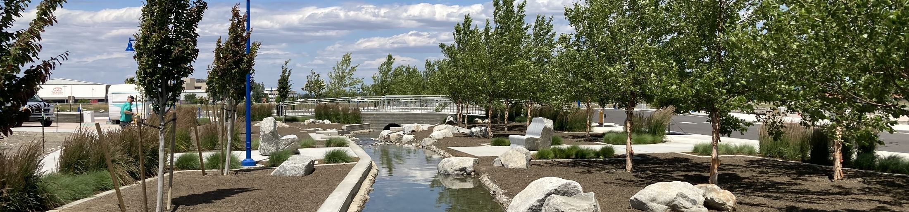

   

Loading

  [Skip to Main Content](https://www.go2kennewick.com/867/Gretl-Crawford-Bio-Page#cca905acfb-00ed-4817-bc83-4ed3d6c85353)     

 1.  [Your Government](https://www.go2kennewick.com/27/Your-Government) 
 1.  [City Services](https://www.go2kennewick.com/101/City-Services) 
 1.  [Our Community](https://www.go2kennewick.com/31/Our-Community) 
 1.  [Business](https://www.go2kennewick.com/1493/Economic-Development) 
 1.  [How Do I...](https://www.go2kennewick.com/9/How-Do-I) 
               Search    

 1.   [Council Calendar](https://kennewickwa.portal.civicclerk.com)  
 1.   [Council Meetings & Information](https://www.go2kennewick.com/581/Council-Meetings-Information)  
 1.   [Current Agenda](https://kennewickwa.portal.civicclerk.com)  
 1.   [Council Meeting Broadcasts](https://www.go2kennewick.com/1256/Council-Meeting-Broadcasts)  
 1.   [Meeting Guidelines](https://www.go2kennewick.com/550/Meeting-Guidelines)  

 1.  [Home](https://www.go2kennewick.com/867/Gretl-Crawford-Bio-Page) 
 1.  [Your Government](https://www.go2kennewick.com/27/Your-Government) 
 1.  [City Council](https://www.go2kennewick.com/531/City-Council) 
 1. Gretl Crawford Bio Page
    

## Gretl Crawford  

City Council

Title: Mayor

Phone: 509-531-0454

 [Email Ms. Crawford](mailto:gretl.crawford@ci.kennewick.wa.us) 

### Address

 PO Box 6108  

 Kennewick, WA 99336  

### Biography

 I have lived in the Tri-Cities area since 1982.  I grew up along the Snake River on an apple orchard with my parents, Dave and Donna Hovde and 3 sisters.   I graduated from Kamiakin High School in 1991 and continued my education at University of Washington and then Washington State University.  I graduated with a degree in Interior Design, with minors in Fine arts and Business.  

 My husband of 25 years, Scott Crawford, is a local farmer, and we have raised our 3 boys here in the Tri-Cities.  My boys are just starting out in life: Graduating high school,  one is still in college and one is entering the work force.   

 I run 2 businesses in Kennewick, have invested in this community and want the best for Kennewick and the future of our community.  I started my construction company, Gretl Crawford Homes, in 1998, and my second business, It’s all in the Details, retail store in 2015.  I have a passion for Design, construction and business and hope to bring that experience to the city to encourage others.  I am an ASID accredited professional member, have been a member of the Home Builders Association for over 15 years and am a member of the Chamber of commerce. 

 My busy family and my businesses have kept me busy for the past 24 years, and now it is my time to give back to this great community for future generations and ensure that there is opportunity here and that this is a place that they want to come back to. I am hopeful that my past experiences will help lead the City of Kennewick for the next 4 years. 

### Boards and Commissions

 Ms. Crawford is currently serving on the Benton Franklin Council of Governments, Fire Pension Board, and the LEOFF Disability Board. She also serves as alternate on the Historic Downtown Kennewick Board, Tri-Cities National Park Committee, and Tri Cities Regional Chamber of Commerce Board.  

  [Notify Me®](https://www.go2kennewick.com/list.aspx)   [Employment](https://www.governmentjobs.com/careers/kennewick)   [Utility

Information](https://www.go2kennewick.com/752/Utilities)   [Report a

Concern](https://cityofkennewickwa.tylerportico.com/TIM/Portal/portal-home)   [Permitting

Self Service Portal](https://selfservice.ci.kennewick.wa.us/EnerGov_Prod/SelfService#/home)   [Agendas

& Minutes](https://kennewickwa.portal.civicclerk.com)  

 1.    

     

### Contact Us

 1.    

## City Hall   

 1.    

210 W 6th Ave   

 1.    

Kennewick, WA 99336   

 1.    

Phone: [509-585-4200]()    

 1.    

Hours: 8:30am-4:30pm M-F   

###  [Quick Links](https://www.go2kennewick.com/QuickLinks.aspx?CID=12,19) 

 1.  [Jobs](https://www.governmentjobs.com/careers/kennewick)  
 1.  [Municipal Code](https://library.municode.com/wa/kennewick/codes/code_of_ordinances)  
 1.  [Frequently Asked Questions](https://www.go2kennewick.com/FAQ.aspx)  
 1.  [Employee Email](https://owa.ci.kennewick.wa.us/owa)  
 1.  [Police](https://www.go2kennewick.com/1491/Police-Department)  
 /QuickLinks.aspx 

###  [Site Links](https://www.go2kennewick.com/QuickLinks.aspx?CID=12) 

 1.  [Site Map](https://www.go2kennewick.com/sitemap)  
 1.  [Accessibility](https://www.go2kennewick.com/accessibility)  
 1.  [Privacy Policy](https://www.go2kennewick.com/site/privacy)  
 1.  [Copyright Notices](https://www.go2kennewick.com/site/copyright)  
 1.  [Social Media Policy](https://www.go2kennewick.com/1025)  
 /QuickLinks.aspx Government Websites by [CivicPlus®](https://connect.civicplus.com/referral)  Loading Loading Do Not Show Again Close Select LanguageAbkhazAcehneseAcholiAfarAfrikaansAlbanianAlurAmharicArabicArmenianAssameseAvarAwadhiAymaraAzerbaijaniBalineseBaluchiBambaraBaouléBashkirBasqueBatak KaroBatak SimalungunBatak TobaBelarusianBembaBengaliBetawiBhojpuriBikolBosnianBretonBulgarianBuryatCantoneseCatalanCebuanoChamorroChechenChichewaChinese (Simplified)Chinese (Traditional)ChuukeseChuvashCorsicanCrimean Tatar (Cyrillic)Crimean Tatar (Latin)CroatianCzechDanishDariDhivehiDinkaDogriDombeDutchDyulaDzongkhaEsperantoEstonianEweFaroeseFijianFilipinoFinnishFonFrenchFrench (Canada)FrisianFriulianFulaniGaGalicianGeorgianGermanGreekGuaraniGujaratiHaitian CreoleHakha ChinHausaHawaiianHebrewHiligaynonHindiHmongHungarianHunsrikIbanIcelandicIgboIlocanoIndonesianInuktut (Latin)Inuktut (Syllabics)IrishItalianJamaican PatoisJapaneseJavaneseJingpoKalaallisutKannadaKanuriKapampanganKazakhKhasiKhmerKigaKikongoKinyarwandaKitubaKokborokKomiKonkaniKoreanKrioKurdish (Kurmanji)Kurdish (Sorani)KyrgyzLaoLatgalianLatinLatvianLigurianLimburgishLingalaLithuanianLombardLugandaLuoLuxembourgishMacedonianMadureseMaithiliMakassarMalagasyMalayMalay (Jawi)MalayalamMalteseMamManxMaoriMarathiMarshalleseMarwadiMauritian CreoleMeadow MariMeiteilon (Manipuri)MinangMizoMongolianMyanmar (Burmese)Nahuatl (Eastern Huasteca)NdauNdebele (South)Nepalbhasa (Newari)NepaliNKoNorwegianNuerOccitanOdia (Oriya)OromoOssetianPangasinanPapiamentoPashtoPersianPolishPortuguese (Brazil)Portuguese (Portugal)Punjabi (Gurmukhi)Punjabi (Shahmukhi)QuechuaQʼeqchiʼRomaniRomanianRundiRussianSami (North)SamoanSangoSanskritSantali (Latin)Santali (Ol Chiki)Scots GaelicSepediSerbianSesothoSeychellois CreoleShanShonaSicilianSilesianSindhiSinhalaSlovakSlovenianSomaliSpanishSundaneseSusuSwahiliSwatiSwedishTahitianTajikTamazightTamazight (Tifinagh)TamilTatarTeluguTetumThaiTibetanTigrinyaTivTok PisinTonganTshilubaTsongaTswanaTuluTumbukaTurkishTurkmenTuvanTwiUdmurtUkrainianUrduUyghurUzbekVendaVenetianVietnameseWarayWelshWolofXhosaYakutYiddishYorubaYucatec MayaZapotecZulu Powered by  [Translate](https://translate.google.com)  

    Original text Rate this translation Your feedback will be used to help improve Google Translate      