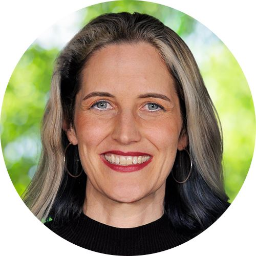
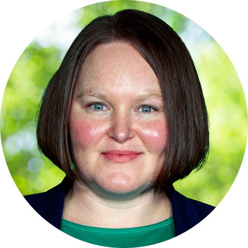

   

Loading

  [Skip to Main Content](https://redmond.gov/189#ccb03e192a-bfc9-4325-9aeb-d94c6d08bde1)   [Info](https://redmond.gov/2241)   [Immigration ResourcesClick for more information](https://redmond.gov/AlertCenter.aspx?AID=Immigration-Resources-78)     

 1.  [News](https://redmond.gov/189) 
 1.  [I Want To...](https://redmond.gov/9/I-Want-To) 
 1.  [Community](https://redmond.gov/101/Community) 
 1.  [Business](https://redmond.gov/35/Business) 
 1.  [Government](https://redmond.gov/27/Government) 

|||[×]()| |---|---||| |
|---|---|---|

    

 1.   [Agendas & Minutes](https://redmond.legistar.com)  
 1.   [Committee of the Whole](https://redmond.gov/805/Committee-of-the-Whole)  
 1.   [How Do I Participate?](https://redmond.gov/1301/How-Do-I-Participate)    
    1.   [Addressing Council](https://redmond.gov/1304/Addressing-Council)  
    1.   [Meeting Terminology](https://redmond.gov/1305/Meeting-Terminology)  
 1.   [How Redmond's Government Works](https://redmond.gov/1302/How-Redmonds-Government-Works)  
 1.   [Learn About Redmond's City Council](https://redmond.gov/1300/Learn-About-Redmonds-City-Council)  
 1.   [Meeting Information Center](https://redmond.legistar.com)  
 1.   [Meeting Videos](https://redmond.gov/1165/OnDemand-Meetings)  
 1.   [Regional Committees](https://redmond.gov/732/Regional-Committees)    
    1.   [A Regional Coalition for Housing (ARCH)](https://redmond.gov/733/A-Regional-Coalition-for-Housing-ARCH)  
    1.   [Cascade Water Alliance Board of Directors (CWA)](https://redmond.gov/734/Cascade-Water-Alliance-Board-of-Director)  
    1.   [Domestic Violence Initiative Regional Task Force (DVI)](https://redmond.gov/735/Domestic-Violence-Initiative-Regional-Ta)  
    1.   [Eastside Human Services Forum](https://redmond.gov/736/Eastside-Human-Services-Forum)  
    1.   [Eastside Transportation Partnership (ETP)](https://redmond.gov/737/Eastside-Transportation-Partnership-ETP)  
    1.   [Eastside Public Safety Communications Agency (EPSCA)](https://redmond.gov/738/Eastside-Public-Safety-Communications-Ag)  
    1.   [Emergency Management Advisory Committee (EMAC)](https://redmond.gov/750/Emergency-Management-Advisory-Committee-)  
    1.   [King County Council Regional Policy Committee (RPC)](https://redmond.gov/752/King-County-Council-RegionalPolicy-Commi)  
    1.   [King County Council Regional Transit Committee (RTC)](https://redmond.gov/753/King-County-Council-Regional-Transit-Com)  
    1.   [Puget Sound Regional Council (PSRC)](https://redmond.gov/764/Puget-Sound-Regional-Council-PSRC)    
       1.   [Puget Sound Regional Council Executive Board](https://redmond.gov/765/Puget-Sound-Regional-Council-Executive-B)  
    1.   [Sound Cities Association (SCA) Public Issues Committee](https://redmond.gov/774/Sound-Cities-Association-SCA-Public-Issu)  
    1.   [Water Resource Inventory Area 8 (WRIA 8) Salmon Recovery Council](https://redmond.gov/775/Water-Resource-Inventory-Area-8-WRIA-8-S)  
 1.   [What Are Council's Priorities](https://redmond.gov/1303/What-Are-Councils-Priorities)  
 1.   [Council Conversations](https://redmond.gov/189)  

 1.  [Home](https://redmond.gov/189) 
 1.  [Government](https://redmond.gov/27/Government) 
 1. City Council

# City Council

 Attend in person at Redmond City Hall Council Chambers, listen live by dialing 1-510-335-7371, or watch live on RCTV at  [Redmond.gov/rctvlive](https://redmond.gov/rctvlive) and Facebook Live (@CityofRedmond), and on Comcast Channel 321 and Ziply Channel 34. 

 __How to submit an "Item from the Audience":__ 

To provide comment in-person, please sign in on the sheet in the Council chambers at the time of the meeting.

In the event of difficulty attending a meeting in person, please contact the City Clerk ( [cityclerk@redmond.gov](mailto:cityclerk@redmond.gov) ) by 2 p.m. the day of the meeting for remote comment registration form.

Written comment may be emailed to [cityclerk@redmond.gov](mailto:cityclerk@redmond.gov) by 2 p.m. on the day of the meeting (500 word limit - please label as "Items from the Audience"). Comments will be distributed to the City Council and entered into the record. Comments will not be read during the meeting. 

## For full agendas and materials, visit the [Meeting Information Center](https://redmond.legistar.com).

  [ ## Learn About Redmond's City CouncilExplore the role of the City Council and review the rules and processes governing the City council.](https://redmond.gov/1300)   [ ## How Do I Participate?Find schedules and agendas for upcoming meetings, and information on the rules and purposes of different meeting types. ](https://redmond.gov/1301)   [ ## How Redmond's Government WorksFind information on the legislative process, budget process, and city planning. Also, learn about the role of regional boards and commissions, and Redmond's own boards. ](https://redmond.gov/1302)   [ ## What are Council's Priorities?Learn about key issues facing the City and the Council's strategies for addressing them. Also, find information on citywide initiatives. ](https://redmond.gov/1303)  

## Meet the Council

   

### Jeralee Anderson

Position #6

Council Term Expires 12/31/25

 [Email Jeralee Anderson](mailto:janderson@redmond.gov) 

Phone: 425-588-1619

Boards/Committees: WA Public Works Board

Read bio...

Jeralee Anderson is the President/CEO and Co-Founder of Greenroads Foundation, a Redmond nonprofit organization focused on sustainability education, performance management, and strategic programming for transportation capital projects. She received her doctorate in sustainability and civil engineering from the University of Washington in 2012 and is a licensed professional engineer. Ms. Anderson worked in a variety of structural, geotechnical, green building, and construction engineering positions after receiving her undergraduate engineering degree from Cal Poly San Luis Obispo with a minor in music performance. She was recognized in 2013 by the Obama Administration as a Transportation Champion of Change for the 21st Century for her domestic and international work with Greenroads. She serves as an Association of Washington Cities (AWC) representative on the State Public Works Board.

Councilmember Anderson has been a resident of Redmond since 2010 and is an active volunteer for Seattle Beagle Rescue. She enjoys reading, health and nutrition, crochet, weightlifting, cycling, teaching, and walking her dogs.

   

### Steve Fields

Position #2

Council Term Expires 12/31/25

 [Email Steve Fields](mailto:sfields@redmond.gov) 

Phone: 425-403-9476

Boards/Committees: Presiding Officer of the City's Finance, Administration and Communications Committee, Lodging Tax Advisory Committee (LTAC)

Read bio...

Steve Fields has worked across all functions of government in his positions at King County and the City of Seattle in the Executive offices. Fields guided elected officials on policy, budget, and operational improvements. He advised department heads and their staff to help the government perform better.

Councilmember Fields has lived in Redmond for over 30 years.

   

### Jessica Forsythe

Position #3

Vice President, City Council

Council Term Expires 12/31/27

 [Email Jessica Forsythe](mailto:jforsythe@redmond.gov) 

Phone: 425-305-7206

Office Hours: By Appointment (feel free to email)

Boards/Committees: AWC Federal Priorities Committee, Eastrail Regional Advisory Committee, Eastside Transportation Partnership, Disability Board

Past Boards/Committees: Council President 2022-2023, PSRC Executive Board Alternate, Growth Management Policy Board, Redmond Senior & Community Center Stakeholder Group, Parks and Human Services Committee Chair, Eastside Human Services Forum Representative

City Council 2024 Subcommittees: Alternative Crisis Response Planning, Multi-Modal Transportation Planning

Read bio...

Jessica Forsythe is an award-winning Creative Director and owner of a small graphic design studio that works primarily with clients who seek to better their community. Ms. Forsythe is a thoughtful, creative thinker who takes a holistic approach to every project. She believes strongly in being involved at the local level and knows first-hand the impact one person can have on their community.

Originally from Northeast Ohio, Jessica graduated from Kent State University with a Bachelor of Fine Arts in Visual Communication Design with a concentration in Environmental Design. She has worked in environmental design, architecture, and branding and was the Art Director for the Seattle Symphony. She grew up volunteering before she even knew what it meant and has maintained that connection with community organizations throughout her life, no matter where she’s lived. Most notably, her decade-long involvement with Help Portrait International, for which she is the Founder of the Redmond, Washington Chapter. Jessica has also served on various nonprofit boards, including the League of Women Voters Seattle-King County Executive Board and as the c3 Treasurer.

Council Vice President Forsythe enjoys hiking, running, cycling, kayaking, skiing, rowing, and rock climbing.

   

### Vanessa Kritzer

Position #5

President, City Council

Council Term Expires 12/31/27

 [Email Vanessa Kritzer](mailto:vkritzer@redmond.gov) 

Phone: 425-305-9892

Boards/Committees: Community Facilities District Board of Supervisors, Eastside Transportation Partnership, OneRedmond Board of Directors, Water Resource Inventory Area (WRIA) 8 Salmon Recovery Council, Lake Sammamish Kokanee Interlocal Agreement Management Committee, King Conservation District Advisory Committee

City Council 2024 Subcommittees: Public Safety Funding Planning, Multi-Modal Transportation Planning

Read bio...

In addition to her work on Council, Vanessa Kritzer serves as Executive Director of the Washington Association of Land Trusts, which represents over 30 environmental conservation groups across the state that work to protect and steward our beautiful lands and waterways. Before joining the Council, Vanessa served on the City of Redmond’s Planning Commission. She brings experience from the public, private, and nonprofit sectors. Vanessa spent years working in D.C. for environmental and international human rights organizations, including the League of Conservation Voters and the Latin America Working Group. She has also worked at Microsoft on smart city and healthcare technology that helps make communities healthier, safer, and more sustainable.

Vanessa holds MBA and MPA degrees from the University of Washington’s Foster School of Business and Evans School of Public Policy and Governance. During graduate school, she was appointed by Governor Inslee to serve as the sole student member of the University of Washington Board of Regents. She loves volunteering and has served on the boards of numerous nonprofits.

Council President Kritzer lives with her husband and two young kids in Education Hill. She also lived for years in Downtown Redmond and loves spending time with her family in both our urban centers and residential neighborhoods. An avid outdoor enthusiast, you’ll often see Vanessa walking around Redmond’s trails with her toddler in a hiking backpack in her spare time. And, if she’s not outside, she is probably indoors playing a strategic board game.

   

### Angie Nuevacamina

Position #7

City Council

Council Term Expires 12/31/27

 [Email Angie Nuevacamina](mailto:anuevacamina@redmond.gov) 

Phone: 425-556-5846

Boards/Committees: Presiding Officer of the City's Parks and Environmental Sustainability Committee, Cascade Water Alliance (CWA), Disability Board

City Council 2024 Subcommittees: Alternative Crisis Response Planning

Read bio...

Angie Nuevacamina is a longtime Redmond resident. She is a veteran of the United States Navy, where she served as an aviation electrician, and studied philosophy and art history at Oakland University. Angie's professional experience includes working as a financial service professional, consulting small businesses, and previous public service experience serving on the City of Redmond Planning Commission.

Councilmember Nuevacamina lives in Redmond with her family.

   

### Osman Salahuddin

Position #1

City Council

Council Term Expires 12/31/27

 [Email Osman Salahuddin](mailto:osalahuddin@redmond.gov) 

Phone: 425-556-5845

Office Hours: By Appointment (please send an email to schedule)

Boards/Committees: Presiding Officer of the City's Public Safety and Human Services Committee, Community Facilities Districts Board of Supervisors, Eastside Transportation Partnership, OneRedmond Foundation Board, Sound Cities Association Public Issues Committee (Alternate)

City Council 2024 Subcommittees: Public Safety Funding Planning, Alternative Crisis Response Planning

Read bio...

Osman Salahuddin is a lifelong resident of Redmond. After graduating from local public schools in the Lake Washington School District, Osman attended the University of Washington, where he graduated with a bachelor’s in neurobiology and a minor in English while also serving as Student Body President, representing more than 45,000 students at the administrative, local, and state levels.

Osman has brought his healthcare and community service background into his previous roles, including working as a manager at a medical device research consulting firm, conducting research at Fred Hutchinson Cancer Research Center and the UW Medicine’s Emergency Department, serving as a Volunteer Fire Corp Member with Eastside Fire & Rescue, and helping found the BIPOC Health Careers Ecosystem, a nonprofit to help underrepresented students find a pathway in the healthcare field. He works as the Communications and Community Engagement Manager for King County Councilmember Sarah Perry, and he has brought his experience in communication, community organizing, and social impact initiatives to serve over 250,000 residents across East King County.

Councilmember Salahuddin is dedicated to engaging with community members, and he applies his expertise in communication, community organizing, youth engagement, and social impact initiatives to serve residents all across the community. In his free time, he enjoys fitness, photography, playing soccer, hiking, watching sports, and spending time with family and friends.

   

### Melissa Stuart

Position #4

Council Term Expires 12/31/25

 [Email Melissa Stuart](mailto:mstuart@redmond.gov) 

Phone: 425-588-6550

Office Hours: 3 - 5 p.m. on the 2nd and 4th Thursdays at the Redmond Library. No office hours on April 24, 2025.

Boards/Committees: Presiding Officer of the City's Planning and Public Works Committee, Community Facilities Districts Board of Supervisors, King County Growth Management Planning Council, Puget Sound Regional Council Growth Management Policy Board, Sound Cities Association Public Issues Committee, Association of Washington Cities Legislative Priorities Committee, OneRedmond Government Affairs Committee, National League of Cities Energy, Environment, and Natural Resources Committee

City Council 2024 Subcommittees: Public Safety Funding Planning, Multi-Modal Transportation Planning

Read bio...

Melissa Stuart was elected to Redmond City Council in 2021 and quickly earned a Certificate of Municipal Leadership from the Association of Washington Cities. In addition to representing Redmond on the above boards and committees, Melissa serves on the board of Together Center in Downtown Redmond. She earned her Masters of Non-Profit Leadership from Seattle University and has more than a decade of experience as a philanthropic leader at Treehouse, Boys & Girls Clubs of King County, and Youth Eastside Services. Melissa served in the U.S. Peace Corps as a Community & Organizational Development Advisor in Moldova. Prior to serving on the Council, she served on the board of Zero Waste Washington and the Redmond Library Board of Trustees.

Councilmember Stuart lives in the Overlake Village neighborhood with her husband and stepson.

###  [Alerts](https://redmond.gov/AlertCenter.aspx?CID=4) 

 1.  [Immigration Resources](https://redmond.gov/AlertCenter.aspx?AID=78) 
 /AlertCenter.aspx 

 1.    

## Contact   

 [Email the Council and Mayor](mailto:MayorCouncil@redmond.gov)  ⓘ Message all council members and the Mayor's office. A designated council member and/or the Mayor's office will follow up as needed.      

 [Email the Council](mailto:council@redmond.gov)  ⓘ Message all council members. A designated council member will follow up as needed.      

 [Contact Individual Council Members](https://redmond.gov/Directory.aspx?did=33)  ⓘ Message or call council members individually.      

 [Report an Issue](https://redmond.gov/158)  ⓘ Report   

non-emergency issues, (streetlight out, code enforcement concerns, parking concerns, etc.), make requests (ADA accommodations, street sweeping, general information, etc.), and find answers to common questions.    

## Ombud for April   

Name: Melissa Stuart   

Phone: 425-588-6550   

 [Email Melissa Stuart](mailto:mstuart@redmond.gov)    

## Subscribe   

 [Sign-up](https://public.govdelivery.com/accounts/WAREDMOND/subscriber/new) to receive City Council agendas and other city information.   

## Share Your Thoughts   

Join the online conversation and add your feedback at [LetsConnectRedmond.com](https://www.letsconnectredmond.com).   

## Helpful Links   

    *  [Meeting Information Center](https://redmond.legistar.com) 
    *  [Meeting Videos](https://redmond.gov/1165) 
    *  [Public Meetings Participation Guide](https://redmond.gov/DocumentCenter/View/9076) 
    *  [Budget Priorities](https://redmond.gov/988) 
    *  [Adopted 2025 Legislative Agenda (PDF)](https://redmond.gov/DocumentCenter/View/35878/Adopted-2025-Legislative-Agenda) 
    *  [Extended Meeting Calendar (PDF)](https://redmond.gov/DocumentCenter/View/20956) 
    *  [Council Rules of Procedure (PDF)](https://redmond.gov/DocumentCenter/View/166) 
    *  [One Page Summaries](https://redmond.gov/DocumentCenter/Index/256) 

###  [Popular](https://redmond.gov/QuickLinks.aspx?CID=105) 

 1.  [Home](https://redmond.gov/189)  
 1.  [Events](https://redmond.gov/294)  
 1.  [Jobs](https://www.governmentjobs.com/careers/redmondwa)  
 1.  [Recreation Activities](https://redmond.gov/184/Activities)  
 /QuickLinks.aspx 

###  [Find](https://redmond.gov/QuickLinks.aspx?CID=106) 

 1.  [City Council](https://redmond.gov/189)  
 1.  [Parks & Trails](https://redmond.gov/186)  
 1.  [Permits](https://redmond.gov/898)  
 1.  [Transportation](https://redmond.gov/221)  
 /QuickLinks.aspx 

###  [Report / Request](https://redmond.gov/QuickLinks.aspx?CID=107) 

 1.  [Report an Issue](https://redmondwa.qscend.com/311)  
 1.  [Request a Service](https://redmondwa.qscend.com/311)  
 1.  [Public Record](https://redmond.gov/777)  
 1.  [Police Record](https://redmond.gov/698)  
 /QuickLinks.aspx 

###  [Helpful Links](https://redmond.gov/QuickLinks.aspx?CID=108) 

 1.  [ADA Program](https://redmond.gov/871)  
 1.  [Title VI](https://redmond.gov/857)  
 1.  [Website Accessibility](https://redmond.gov/873/5722/Web-Accessibility)  
 1.  [Website Policies](https://redmond.gov/385)  
 /QuickLinks.aspx 

### Social Media

  [Facebook](https://redmond.gov/facebook)   [X](https://redmond.gov/twitter)   [Instagram](https://redmond.gov/instagram)   [YouTube](https://redmond.gov/youtube)  

### Sign Up For Our Newsletter

 1. 

 1.    

     

 1. Phone:  [425-556-2900]() 

 1.  [15670 NE 85th Street](https://goo.gl/maps/CJcLDqJFWRpxZxbL6) 

 1. P.O. Box 97010

 1.  [Redmond, WA 98073-9710](https://goo.gl/maps/CJcLDqJFWRpxZxbL6) 

 1.  [Contact Us](https://redmond.gov/directory)  

 1.  [Site Map](https://redmond.gov/sitemap)  

 1.  [Website Feedback](https://redmond.gov/FormCenter/Communications-12/Website-Feedback-87)  
 /QuickLinks.aspx Loading Loading Do Not Show Again Close Select LanguageAbkhazAcehneseAcholiAfarAfrikaansAlbanianAlurAmharicArabicArmenianAssameseAvarAwadhiAymaraAzerbaijaniBalineseBaluchiBambaraBaouléBashkirBasqueBatak KaroBatak SimalungunBatak TobaBelarusianBembaBengaliBetawiBhojpuriBikolBosnianBretonBulgarianBuryatCantoneseCatalanCebuanoChamorroChechenChichewaChinese (Simplified)Chinese (Traditional)ChuukeseChuvashCorsicanCrimean Tatar (Cyrillic)Crimean Tatar (Latin)CroatianCzechDanishDariDhivehiDinkaDogriDombeDutchDyulaDzongkhaEsperantoEstonianEweFaroeseFijianFilipinoFinnishFonFrenchFrench (Canada)FrisianFriulianFulaniGaGalicianGeorgianGermanGreekGuaraniGujaratiHaitian CreoleHakha ChinHausaHawaiianHebrewHiligaynonHindiHmongHungarianHunsrikIbanIcelandicIgboIlocanoIndonesianInuktut (Latin)Inuktut (Syllabics)IrishItalianJamaican PatoisJapaneseJavaneseJingpoKalaallisutKannadaKanuriKapampanganKazakhKhasiKhmerKigaKikongoKinyarwandaKitubaKokborokKomiKonkaniKoreanKrioKurdish (Kurmanji)Kurdish (Sorani)KyrgyzLaoLatgalianLatinLatvianLigurianLimburgishLingalaLithuanianLombardLugandaLuoLuxembourgishMacedonianMadureseMaithiliMakassarMalagasyMalayMalay (Jawi)MalayalamMalteseMamManxMaoriMarathiMarshalleseMarwadiMauritian CreoleMeadow MariMeiteilon (Manipuri)MinangMizoMongolianMyanmar (Burmese)Nahuatl (Eastern Huasteca)NdauNdebele (South)Nepalbhasa (Newari)NepaliNKoNorwegianNuerOccitanOdia (Oriya)OromoOssetianPangasinanPapiamentoPashtoPersianPolishPortuguese (Brazil)Portuguese (Portugal)Punjabi (Gurmukhi)Punjabi (Shahmukhi)QuechuaQʼeqchiʼRomaniRomanianRundiRussianSami (North)SamoanSangoSanskritSantali (Latin)Santali (Ol Chiki)Scots GaelicSepediSerbianSesothoSeychellois CreoleShanShonaSicilianSilesianSindhiSinhalaSlovakSlovenianSomaliSpanishSundaneseSusuSwahiliSwatiSwedishTahitianTajikTamazightTamazight (Tifinagh)TamilTatarTeluguTetumThaiTibetanTigrinyaTivTok PisinTonganTshilubaTsongaTswanaTuluTumbukaTurkishTurkmenTuvanTwiUdmurtUkrainianUrduUyghurUzbekVendaVenetianVietnameseWarayWelshWolofXhosaYakutYiddishYorubaYucatec MayaZapotecZulu Powered by  [Translate](https://translate.google.com)  

|||
|---|---|

           Original text Rate this translation Your feedback will be used to help improve Google Translate         