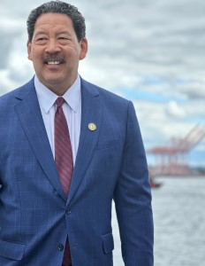

 

#  [Office of the Mayor](https://seattle.gov/mayor) 

 *  [One Seattle Initiatives](https://seattle.gov/mayor/one-seattle-initiatives) 
 *  [Contact](https://seattle.gov/mayor/contact) 
 *  [Mayor's Team](https://seattle.gov/mayor/team) 
 *  [About the Mayor](https://seattle.gov/mayor/about) 

## Stay up-to-date with the latest news

 Receive the latest updates from the Mayor’s Office as they happen – directly from the source. Sign up below to receive future newsletters from Mayor Harrell.  [Subscribe to Mayor's Newsletter](https://public.govdelivery.com/accounts/WASEATTLE/subscriber/new?topic_id=WASEATTLE_389)  

## A Message from Mayor Harrell

  

Seattle is a global destination and leader in industry, innovation, and creativity. As your Mayor, I am committed to uniting our diverse communities around shared priorities and meaningful progress on our biggest challenges. Through our focus on a back-to-basics approach like restoring public safety, helping people move indoors, keeping parks open and welcoming, and fixing potholes, we can build a strong foundation and bright future for our city and our families.

We recognize change does not come quickly or easily. But improvement is possible if we act boldly, intentionally – and together. We can change the course of our city if we are willing to work collaboratively, to turn common ground into common cause, to think – and act – big.

That’s my vision for * __One Seattle__* , to turn our city’s pioneering spirit into progress, I hope you’ll join me in creating the Seattle we all want to see.

 - Mayor Bruce Harrell

## Mayor Bruce Harrell

 Phone: [(206) 684-4000]()  Address: [Office](https://seattle.gov/mayor#tileMailing_x133611)  |  [Mailing](https://seattle.gov/mayor#tileOffice_x133611)  

### Follow Us

        __Street Address:__ 

600 4th Ave, Seattle, WA

7th Floor

Seattle, WA 98104

  __Mailing Address:__ 

P.O. Box 94749

Seattle, WA 98124-4749 

## Press Releases

 Mayor's Office Press Releases  [TODAY: City Leaders Celebrate Grand Opening of Cheryl Chow Park](https://content.govdelivery.com/bulletins/gd/WASEATTLE-3da8100?wgt_ref=WASEATTLE_WIDGET_93)  

 * 04/05/2025 09:00 AM PDT
  [TOMORROW: City Leaders Celebrate Grand Opening of Cheryl Chow Park](https://content.govdelivery.com/bulletins/gd/WASEATTLE-3da736b?wgt_ref=WASEATTLE_WIDGET_93)  

 * 04/04/2025 12:00 PM PDT
  [City of Seattle Celebrates Tenth Anniversary of Minimum Wage and Wage Theft Ordinances](https://content.govdelivery.com/bulletins/gd/WASEATTLE-3d9adba?wgt_ref=WASEATTLE_WIDGET_93)  

 * 04/01/2025 10:02 AM PDT
  [Mayor Harrell Signs Legislation Fortifying Local Protections for People Seeking Gender-Affirming and Reproductive Health Care](https://content.govdelivery.com/bulletins/gd/WASEATTLE-3d9a4c7?wgt_ref=WASEATTLE_WIDGET_93)  

 * 03/31/2025 01:30 PM PDT
  [TODAY: Mayor Harrell Signs Legislation Fortifying Local Protections for People Seeking Gender-Affirming and Reproductive Health Care](https://content.govdelivery.com/bulletins/gd/WASEATTLE-3d94da6?wgt_ref=WASEATTLE_WIDGET_93)  

 * 03/31/2025 07:30 AM PDT
  [MONDAY: Mayor Harrell Signs Legislation Fortifying Local Protections for People Seeking Gender-Affirming and Reproductive Health Care](https://content.govdelivery.com/bulletins/gd/WASEATTLE-3d941b6?wgt_ref=WASEATTLE_WIDGET_93)  

 * 03/28/2025 12:30 PM PDT
  [ICYMI: Seattle Office of Immigrant and Refugee Affairs Denounces Cutting of Unaccompanied Children Program Funding](https://content.govdelivery.com/bulletins/gd/WASEATTLE-3d9161e?wgt_ref=WASEATTLE_WIDGET_93)  

 * 03/27/2025 02:34 PM PDT
  [Mayor Bruce Harrell and City of Seattle Launch Groundbreaking AI Incubator to Propel the Next Generation of AI Entrepreneurs](https://content.govdelivery.com/bulletins/gd/WASEATTLE-3d8e768?wgt_ref=WASEATTLE_WIDGET_93)  

 * 03/26/2025 02:55 PM PDT
  [TODAY: Mayor Bruce Harrell and City of Seattle to Launch Groundbreaking AI Incubator Downtown  ](https://content.govdelivery.com/bulletins/gd/WASEATTLE-3d8b40c?wgt_ref=WASEATTLE_WIDGET_93)  

 * 03/26/2025 07:00 AM PDT
  [Statements from Mayor Bruce Harrell and Budget Chair Dan Strauss on 2024 Year-End Revenue Report](https://content.govdelivery.com/bulletins/gd/WASEATTLE-3d8b9b6?wgt_ref=WASEATTLE_WIDGET_93)  

 * 03/25/2025 04:20 PM PDT
  [TOMORROW: Mayor Bruce Harrell and City of Seattle to Launch Groundbreaking AI Incubator Downtown  ](https://content.govdelivery.com/bulletins/gd/WASEATTLE-3d8ab4f?wgt_ref=WASEATTLE_WIDGET_93)  

 * 03/25/2025 11:21 AM PDT
  [Mayor Harrell Celebrates the Expansion of CARE Responders Citywide](https://content.govdelivery.com/bulletins/gd/WASEATTLE-3d7bd3b?wgt_ref=WASEATTLE_WIDGET_93)  

 * 03/19/2025 01:02 PM PDT
  [Today: Mayor Harrell Celebrates the Expansion of CARE Responders to South and Southwest Seattle](https://content.govdelivery.com/bulletins/gd/WASEATTLE-3d7adbc?wgt_ref=WASEATTLE_WIDGET_93)  

 * 03/19/2025 07:55 AM PDT
  [Tomorrow: Mayor Harrell Celebrates the Expansion of CARE Responders to South and Southwest Seattle](https://content.govdelivery.com/bulletins/gd/WASEATTLE-3d77d34?wgt_ref=WASEATTLE_WIDGET_93)  

 * 03/18/2025 08:15 AM PDT
  [Award-Winning Seattle Preschool Program Expanding for 2025-26 School Year](https://content.govdelivery.com/bulletins/gd/WASEATTLE-3d7015e?wgt_ref=WASEATTLE_WIDGET_93)  

 * 03/14/2025 01:30 PM PDT
  [TODAY: Mayor Harrell to Announce Seattle Preschool Program Expansion and Opening of 2025-2026 Applications](https://content.govdelivery.com/bulletins/gd/WASEATTLE-3d6d0b6?wgt_ref=WASEATTLE_WIDGET_93)  

 * 03/14/2025 07:30 AM PDT
  [FRIDAY: Mayor Harrell to Announce Seattle Preschool Program Expansion and Opening of 2025-2026 Applications](https://content.govdelivery.com/bulletins/gd/WASEATTLE-3d6c5a4?wgt_ref=WASEATTLE_WIDGET_93)  

 * 03/13/2025 12:00 PM PDT
  [FRIDAY: Mayor Harrell to Announce Seattle Preschool Program Expansion and Opening of 2025-2026 Applications](https://content.govdelivery.com/bulletins/gd/WASEATTLE-3d6a609?wgt_ref=WASEATTLE_WIDGET_93)  

 * 03/13/2025 09:00 AM PDT
  [Mayor Harrell Proposes Renewal of Seattle’s First-in-Nation Democracy Voucher Program](https://content.govdelivery.com/bulletins/gd/WASEATTLE-3d632a2?wgt_ref=WASEATTLE_WIDGET_93)  

 * 03/10/2025 01:00 PM PDT
  [TODAY: Mayor Harrell Announces Proposal to Renew Seattle’s First-in-Nation Democracy Voucher Program ](https://content.govdelivery.com/bulletins/gd/WASEATTLE-3d6289a?wgt_ref=WASEATTLE_WIDGET_93)  

 * 03/10/2025 09:37 AM PDT

Receive Email Updates

      

Copy the code below and paste it into your blog or Web page:

 [close](https://seattle.gov/mayor#)  

##  [Latest News - Mayor's Blog](https://harrell.seattle.gov) 

  [Mayor Harrell Signs Legislation Fortifying Local Protections for People Seeking Gender-Affirming and Reproduct... 

Seattle – Today, Mayor Bruce Harrell joined City leade...

 Posted Mar. 31  ](https://harrell.seattle.gov/2025/03/31/mayor-harrell-signs-legislation-fortifying-local-protections-for-people-seeking-gender-affirming-and-reproductive-health-care)   [Mayor Bruce Harrell and City of Seattle Launch Groundbreaking AI Incubator to Propel the Next Genera... 

A new public-private partnership on Seattle’s wat...

 Posted Mar. 27  ](https://harrell.seattle.gov/2025/03/27/mayor-bruce-harrell-and-city-of-seattle-launch-groundbreaking-ai-incubator-to-propel-the-next-generation-of-ai-entrepreneurs)   [Statements from Mayor Bruce Harrell and Budget Chair Dan Strauss on 2024 Year-End Revenue Report  

Seattle – Today, Mayor Bruce Harrell released the foll...

 Posted Mar. 25](https://harrell.seattle.gov/2025/03/25/statements-from-mayor-bruce-harrell-and-budget-chair-dan-strauss-on-2024-year-end-revenue-report)   [Statement from Seattle Mayor Bruce Harrell on the passing of former Washington State House Speaker Frank Chopp 

Seattle – Today, Mayor Bruce Harrell released the...

 Posted Mar. 23](https://harrell.seattle.gov/2025/03/23/statement-from-seattle-mayor-bruce-harrell-on-the-passing-of-former-washington-state-house-speaker-frank-chopp)  

## Requests and Services

## Requests and Services

  [Send a Message to the Mayor](https://seattlegov.powerappsportals.us/contact-mayor)   [Request the Mayor to Attend an Event](https://web8.seattle.gov/MORequest)   [Service on Legal Documents on the City of Seattle](https://seattle.gov/mayor/service-of-legal-documents)   [Request Proclamation or Letter](https://forms.office.com/Pages/ResponsePage.aspx?id=RR7meOtrCUCPmTWdi1T0GyBsffvOIRZHo10mP-LPxldUNTFUQ1EwOERRRjM3STFZSTNRVTRIR09aSC4u)  

 *  [About Seattle](https://seattle.gov/opcd/population-and-demographics/about-seattle) 
 *  [Downtown Campus Map](https://seattle.gov/customer-service-bureau/downtown-campus-map) 
 *  [City Jobs](https://www.governmentjobs.com/careers/seattle) 
 *  [Seattle Facts](https://seattle.gov/cityarchives/seattle-facts) 

## Mayor Bruce Harrell

 Address:  [600 4th Ave, Seattle, WA, 7th Floor, Seattle, WA, 98104](https://www.google.com/maps/place/600%25204th%2520Ave,%2520Seattle,%2520WA,%25207th%2520Floor,%2520Seattle,%2520WA,%252098104) 

 Mailing Address: P.O. Box 94749, Seattle, WA, 98124-4749

 Phone:  [(206) 684-4000]() 

        

Newsletter Updates

 [Subscribe](https://public.govdelivery.com/accounts/WASEATTLE/subscriber/topics?qsp=WASEATTLE_12) 

Sign up for the latest updates from Mayor Bruce Harrell

## Citywide Information

 *  [Elected Officials](https://seattle.gov/elected-officials) 
 *  [Open Data Portal](https://data.seattle.gov) 
 *  [Public Records](https://seattle.gov/public-records) 
 *  [City Holidays and Closures](https://seattle.gov/holidays-and-closures) 

 *  [City News Feed](https://news.seattle.gov) 
 *  [City Event Calendar](https://seattle.gov/event-calendar) 
 *  [All City Newsletters](https://public.govdelivery.com/accounts/WASEATTLE/subscriber/topics?qsp=CODE_RED) 
 *  [View the Departments & Agencies List](https://seattle.gov/departments) 

### Popular Pages

 1.  [Power Outages](https://seattle.gov/city-light/outages) 
 1.  [Police Jobs](https://seattle.gov/police/police-jobs) 
 1.  [Pay My Ticket](https://seattle.gov/courts/tickets-and-payments/pay-my-ticket) 
 1.  [Adopt a Pet](https://seattle.gov/animal-shelter/find-an-animal/adopt) 
 1.  [Utility Bills & Payments](https://seattle.gov/utilities/your-services/accounts-and-payments/bills-and-payments) 

Seattle's Mayor is the head of the Executive department. The Mayor directs and controls all City offices and departments except where that authority is granted to another office by the City Charter.

## Policies

  [About Our Digital Properties](https://seattle.gov/about-our-digital-properties)   [Privacy Policy](https://seattle.gov/tech/data-privacy/privacy-statement)   [Title II: Americans with Disabilities Act](https://seattle.gov/americans-with-disabilities-act)   [Title VI: Civil Rights Act](https://seattle.gov/civilrights/laws-we-enforce/title-vi-civil-rights-act)   [Sitemap](https://www.seattle.gov/sitemap)     Original text Rate this translation Your feedback will be used to help improve Google Translate 