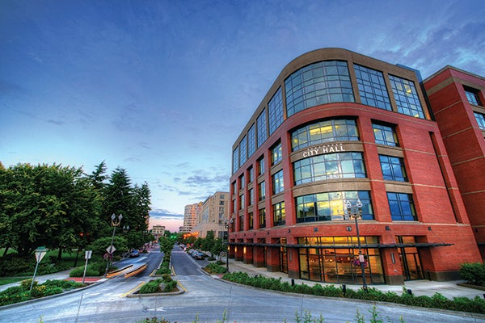

 [Skip to main content](https://www.cityofvancouver.us/departments/city-managers-office/#main)  [Skip to search](https://www.cityofvancouver.us/departments/city-managers-office/#search)     

 *  [Utility Bill](https://cityofvancouver.selectpaytoday.com/Utility) 
 *  [Calendar](https://www.cityofvancouver.us/government/calendar/#tab2) 
 TRANSLATEAfrikaansShqipአማርኛالعربيةՀայերենAzərbaycan diliEuskaraБеларуская моваবাংলাBosanskiБългарскиCatalàCebuanoChichewa简体中文繁體中文CorsuHrvatskiČeština‎DanskNederlandsEnglishEsperantoEestiFilipinoSuomiFrançaisFryskGalegoქართულიDeutschΕλληνικάગુજરાતીKreyol ayisyenHarshen HausaŌlelo Hawaiʻiעִבְרִיתहिन्दीHmongMagyarÍslenskaIgboBahasa IndonesiaGaeilgeItaliano日本語Basa Jawaಕನ್ನಡҚазақ тіліភាសាខ្មែរ한국어كوردی‎КыргызчаພາສາລາວLatinLatviešu valodaLietuvių kalbaLëtzebuergeschМакедонски јазикMalagasyBahasa MelayuമലയാളംMalteseTe Reo MāoriमराठीМонголဗမာစာनेपालीNorsk bokmålپښتوفارسیPolskiPortuguêsਪੰਜਾਬੀRomânăРусскийSamoanGàidhligСрпски језикSesothoShonaسنڌيසිංහලSlovenčinaSlovenščinaAfsoomaaliEspañolBasa SundaKiswahiliSvenskaТоҷикӣதமிழ்తెలుగుไทยTürkçeУкраїнськаاردوO‘zbekchaTiếng ViệtCymraegisiXhosaיידישYorùbáZulu Search         

 *  [Services](https://www.cityofvancouver.us/services) 
   *  [Utility Billing](https://www.cityofvancouver.us/services/utility-billing) 
   *  [Parking](https://www.cityofvancouver.us/economic-prosperity-and-housing/parking) 
     *  [Downtown Parking](https://www.cityofvancouver.us/economic-prosperity-and-housing/parking/downtown-parking) 
     *  [Parking Tickets](https://www.cityofvancouver.us/economic-prosperity-and-housing/parking/parking-tickets) 
     *  [Parking Portal](https://cityofvancouver.t2hosted.com/Account/Portal)  
   *  [Water, Sewer and Stormwater](https://www.cityofvancouver.us/government/department/public-works/water-sewer-and-stormwater) 
   *  [Garbage and Recycling](https://www.cityofvancouver.us/services/garbage-recycling) 
   *  [Event Planning and Permits](https://www.cityofvancouver.us/government/department/parks-recreation-and-cultural-services/event-planning-and-permits) 
   *  [Urban Forestry](https://www.cityofvancouver.us/government/department/public-works/urban-forestry) 
   *  [Report a concern](https://www.cityofvancouver.us/services/report-concern)  
 *  [Business](https://www.cityofvancouver.us/business) 
   *  [Economic Development](https://cityofvancouver.us/departments/economic-prosperity-housing) 
   *  [Building Permits, Licenses, Inspections](https://www.cityofvancouver.us/business/permits-licenses-and-inspections) 
     *  [ePermits](https://www.cityofvancouver.us/business/permits-licenses-and-inspections/epermits) 
     *  [ePlans](https://www.cityofvancouver.us/business/permits-licenses-and-inspections/eplans)  
   *  [Building and Construction](https://www.cityofvancouver.us/business/building-construction) 
     *  [Residential Building Permits](https://www.cityofvancouver.us/business/building-construction/residential-building-permits) 
     *  [Commercial Building Permits](https://www.cityofvancouver.us/business/building-construction/commercial-building-permits)  
   *  [Business and Special Licenses](https://www.cityofvancouver.us/business/permits-licenses-and-inspections/business-and-special-licenses) 
   *  [Planning, Development and Zoning](https://cityofvancouver.us/planning-development-and-zoning) 
     *  [Land Use Development](https://www.cityofvancouver.us/business/planning-development-and-zoning/land-use-development) 
     *  [Long Range Planning](https://cityofvancouver.us/long-range-planning) 
     *  [Comprehensive Plan](https://www.cityofvancouver.us/business/planning-development-and-zoning/comprehensive-plan)  
   *  [Procurement Services](https://www.cityofvancouver.us/business/procurement-services) 
     *  [Bids and Proposals](https://cityofvancouver.bonfirehub.com/portal/?tab=openOpportunities)  
 *  [Government](https://www.cityofvancouver.us/government)  
   *  [Mayor and City Council](https://cityofvancouver.us/departments/mayor-city-council) 
     *  [Agendas and Minutes](https://www.cityofvancouver.us/government/mayor-and-city-council/meetings-agendas-minutes) 
     *  [Council Meetings](https://www.cityofvancouver.us/government/calendar) 
     *  [Community Testimony](https://www.cityofvancouver.us/departments/mayor-city-council/#testimony) 
     *  [Contact Council](https://cityofvancouver.us/departments/mayor-city-council/#form)  
   *  [City Manager’s Office](https://cityofvancouver.us/departments/city-managers-office) 
     *  [City Liaison](https://www.cityofvancouver.us/city-managers-office/city-liaison-services) 
     *  [Climate Action](https://www.cityofvancouver.us/city-managers-office/climate-action) 
     *  [Communications](https://www.cityofvancouver.us/city-managers-office/communication) 
     *  [Strategic Plan](https://www.cityofvancouver.us/government/strategic-plan)  
   *  [Departments](https://www.cityofvancouver.us/government/department-directory) 
     *  [City Attorney’s Office](https://www.cityofvancouver.us/departments/city-attorney) 
     *  [Community Development](https://www.cityofvancouver.us/departments/community-development) 
     *  [Economic Prosperity and Housing](https://www.cityofvancouver.us/departments/economic-prosperity-housing) 
     *  [Financial and Management Services](https://www.cityofvancouver.us/departments/financial-management-services) 
     *  [Vancouver Fire Department](https://www.cityofvancouver.us/departments/fire-department) 
     *  [Human Resources](https://www.cityofvancouver.us/departments/hr) 
     *  [Parks, Recreation and Cultural Services](https://www.cityofvancouver.us/departments/parks-recreation-and-cultural-services) 
     *  [Vancouver Police Department](https://www.cityofvancouver.us/departments/police) 
     *  [Public Works](https://www.cityofvancouver.us/departments/public-works)  
   *  [Boards and Commissions](https://www.cityofvancouver.us/government/boards-commissions) 
   *  [City Center Redevelopment Authority](https://www.cityofvancouver.us/government/city-center-redevelopment-authority) 
   *  [Downtown Redevelopment Authority](https://www.cityofvancouver.us/government/downtown-redevelopment-authority) 
   *  [Public Facilities District Board](https://www.cityofvancouver.us/government/public-facilities-district-board) 
   *  [Transportation Benefit District](https://www.cityofvancouver.us/business/planning-development-and-zoning/transportation-planning/vancouver-transportation-benefit-district) 
   *  [Interlocal Agreements](https://www.cityofvancouver.us/government/department/financial-and-management-services/interlocal-agreements) 
   *  [Municipal Code](https://vancouver.municipal.codes) 
   *  [City Charter](https://www.cityofvancouver.us/government/city-charter) 
   *  [Public Records Request](https://www.cityofvancouver.us/government/public-records-request) 
   *  [Budget](https://www.cityofvancouver.us/government/department/financial-and-management-services/budget) 
   *  [Awards and Recognition](https://www.cityofvancouver.us/about-vancouver/awards-recognition)  
 *  [Community](https://www.cityofvancouver.us/community) 
   *  [Be Heard Vancouver](https://www.beheardvancouver.org) 
   *  [Newsroom](https://www.cityofvancouver.us/community/news) 
   *  [Special Events](https://www.cityofvancouver.us/government/department/parks-recreation-and-cultural-services/special-events-in-vancouver) 
   *  [Recreation Activities](https://www.cityofvancouver.us/government/department/parks-recreation-and-cultural-services/recreation-activities) 
   *  [Parks and Trails](https://www.cityofvancouver.us/community/parks-trails/parkfinder) 
     *  [Community Gardens](https://www.cityofvancouver.us/government/department/parks-recreation-and-cultural-services/community-gardens) 
     *  [Public Art Map](https://city-of-vancouver-wa-geo-hub-cityofvancouver.hub.arcgis.com/apps/fa72863a21ea42c3b114d6e8a2be706a/explore)  
   *  [Culture, Arts and Heritage](https://www.cityofvancouver.us/government/department/parks-recreation-and-cultural-services/culture-arts-and-heritage) 
   *  [Community Centers](https://www.cityofvancouver.us/community/community-centers) 
     *  [Firstenburg Community Center](https://www.cityofvancouver.us/community/community-centers/firstenburg-community-center) 
     *  [Marshall/Luepke Community Center](https://www.cityofvancouver.us/community/community-centers/marshall-luepke-center) 
     *  [Water Resources Education Center](https://www.cityofvancouver.us/government/department/public-works/water-resources-education-center)  
   *  [Volunteer Programs](https://www.cityofvancouver.us/government/department/parks-recreation-and-cultural-services/volunteer-programs) 
   *  [Neighborhood Associations](https://www.cityofvancouver.us/community/neighborhoods) 
   *  [Homelessness](https://www.cityofvancouver.us/city-managers-office/homeless) 
   *  [Emergency Preparedness](https://www.cityofvancouver.us/community/emergency-preparedness) 
   *  [Sister City Joyo, Japan](https://www.cityofvancouver.us/about-vancouver/sister-city-joyo-japan)  
 *  [Data](https://city-of-vancouver-wa-geo-hub-cityofvancouver.hub.arcgis.com) 

# City Manager’s Office

 1.  [Home](https://www.cityofvancouver.us) 
 1.  [Government](https://www.cityofvancouver.us/government) 
 1.  [Department Directory](https://www.cityofvancouver.us/departments) 
 1. City Manager’s Office

## The City of Vancouver operates under a council-manager form of government

The Vancouver [City Council](https://cityofvancouver.us/departments/mayor-city-council) appoints the city manager to serve as the Chief Executive Officer of the City. The role and responsibilities of the city manager are defined in the [City Charter](https://cityofvancouver.us/government/city-charter) and the [Revised Code of Washington](https://app.leg.wa.gov/rcw/default.aspx?Cite=35).

The city manager is responsible for developing the biennial budget, advising council on policy issues and carrying our council’s policy direction through the day-to-day management and operations of all [City departments](https://cityofvancouver.us/government/department-directory).

In addition to overseeing citywide operations, the Vancouver City Manager oversees City [Communications](https://cityofvancouver.us/city-managers-office/communication) and [Clark/Vancouver Television (CVTV)](https://www.cvtv.org) , [Emergency Management](https://cityofvancouver.us/emergency-preparedness) , the government affairs program, the historic preservation program, policy and program management and the historic [Pearson Field Airport](https://cityofvancouver.us/pearson-field-airport).

The City Manager’s Office conducts [City Hall Field Trips](https://www.cityofvancouver.us/city-managers-office/city-hall-field-trip) for local schools.

## Services

  [Accessibility and Inclusion for People with Disabilities](https://www.cityofvancouver.us/city-managers-office/accessibility-and-inclusion-at-the-city-of-vancouver-for-people-with-disabilities)   [City Liaison](https://www.cityofvancouver.us/city-managers-office/city-liaison-services)   [Homelessness](https://www.cityofvancouver.us/city-managers-office/homeless)   [Neighborhood Associations](https://www.cityofvancouver.us/community/neighborhoods)  

## Initiatives

  [### Budget](https://www.cityofvancouver.us/government/department/financial-and-management-services/budget)   [### Climate Action](https://www.cityofvancouver.us/city-managers-office/climate-action)   [### Emergency Declaration](https://www.cityofvancouver.us/city-managers-office/emergency-declaration)   [### Police Community Advisory Committee](https://www.cityofvancouver.us/city-managers-office/police-community-advisory-committee)   [### Strategic Plan](https://www.cityofvancouver.us/government/strategic-plan)  

## City Leadership

 *  [    

###### Lon Pluckhahn City Manager](https://www.cityofvancouver.us/departments/city-managers-office/#section1) 
 *  [    

###### Lisa Brandl Deputy City Manager](https://www.cityofvancouver.us/departments/city-managers-office/#section2) 

###### Lon Pluckhahn

##### City Manager

Lon Pluckhahn oversees the city’s community development, parks, recreation and cultural services, economic development, and policy and program management teams.

Lon brings more than 25 years of public sector experience to Vancouver, including economic development, parks and planning, collective bargaining, and financing for capital projects.

He has served as city manager for 14 years in Marion, Iowa—a growing community of 40,000 residents in the second largest metro in the state. Lon has also held city manager positions in Platteville, Wisconsin, and West Liberty, Iowa.

Lon is a credentialed manager through the International City Manager’s Association and holds a bachelor’s degree in political science, a master’s degree in public administration and a master’s degree in community and regional planning, all from Iowa State University.

 *  __Main :__  [360-487-8600]() 
 *  [lon.pluckhahn@cityofvancouver.us](mailto:lon.pluckhahn@cityofvancouver.us) 

###### Lisa Brandl

##### Deputy City Manager

As deputy city manager of enterprise services, Lisa Brandl oversees the city’s information technology, human resources, emergency management, general services, diversity, equity and inclusion and communications teams.

Lisa has 30 years of progressively responsible local government experience, including serving as Chief Operating Officer for Riverside County, California, a county with 22,000 government employees serving nearly 2.5 million people.

Her professional experience also includes work in procurement, facilities, economic development, financial services and public administration.

Lisa has a master’s degree in public administration from California Baptist University and a bachelor’s degree in business administration, accounting and finance from California State University-San Bernardino, as well as number of other professional certifications.

 *  __Main :__  [360-487-8600]() 
 *  [lisa.brandl@cityofvancouver.us](mailto:lisa.brandl@cityofvancouver.us) 
  [Close](https://www.cityofvancouver.us/departments/city-managers-office/#)     

### Contact Us

###### 

 [415 W 6th StVancouver WA 98660](https://maps.google.com/maps?q=415%2520West%25206th%2520Street,%2520Vancouver,%2520WA%252098660)  

 __Main:__  [360-487-8600]() 

 __Relay:__  [711]() 

 [CMO@cityofvancouver.us](mailto:CMO@cityofvancouver.us) 

 *   
 *   
 *   
 *   
  [####]()     

 *  [Facebook](http://www.facebook.com/VancouverUS) 
 *  [Twitter](http://twitter.com/vancouverUS) 
 *  [Instagram](https://instagram.com/VancouverUS) 
 *  [LinkedIn](https://www.linkedin.com/company/city-of-vancouver-washington) 
 *  [YouTube](https://www.youtube.com/user/CityofVancouverUS) 

 [City Hall415 W. 6th St.Vancouver, WA 98660](https://www.google.com/maps?q=City%2520Hall%2520415%2520W.%25206th%2520St.,%2520WA%252098660) 

  [CONTACT](https://www.cityofvancouver.us/contact)  

##### RESOURCES

 *  [Accessibility](https://www.cityofvancouver.us/city-managers-office/accessibility-and-inclusion-at-the-city-of-vancouver-for-people-with-disabilities) 
 *  [ePlans](https://www.cityofvancouver.us/business/permits-licenses-and-inspections/eplans) 
 *  [Jobs with the City](https://cityofvancouver.us/jobs) 
 *  [Make a Payment](https://cityofvancouver.us/pay-bills-manage-accounts) 
 *  [Maps](https://city-of-vancouver-wa-geo-hub-cityofvancouver.hub.arcgis.com) 
 *  [Municipal Code](https://vancouver.municipal.codes) 
 *  [Permit Center](https://cityofvancouver.us/business/permits-licenses-and-inspections) 
 *  [Public Records](https://cityofvancouver.us/government/public-records-request) 

##### COMMUNITY

 *  [About Vancouver](https://www.cityofvancouver.us/about-vancouver) 
 *  [Climate Action](https://www.cityofvancouver.us/city-managers-office/climate-action) 
 *  [Firstenburg Community Center](https://www.cityofvancouver.us/community/community-centers/firstenburg-community-center) 
 *  [Marshall/Luepke Community Center](https://www.cityofvancouver.us/community/community-centers/marshall-luepke-center) 
 *  [Neighborhood Associations](https://www.cityofvancouver.us/community/neighborhoods) 
 *  [Public Art Map](https://city-of-vancouver-wa-geo-hub-cityofvancouver.hub.arcgis.com/apps/fa72863a21ea42c3b114d6e8a2be706a/explore) 
 *  [Water Resources Education Center](https://www.cityofvancouver.us/government/department/public-works/water-resources-education-center) 

##### DEPARTMENTS

 *  [City Attorney’s Office](https://www.cityofvancouver.us/government/department/city-attorneys-office) 
 *  [City Manager’s Office](https://www.cityofvancouver.us/city-managers-office) 
 *  [Community Development](https://www.cityofvancouver.us/government/community-development) 
 *  [Economic Prosperity and Housing](https://www.cityofvancouver.us/economic-prosperity-and-housing) 
 *  [Financial and Management Services](https://www.cityofvancouver.us/government/department/financial-and-management-services) 
 *  [Fire](https://www.cityofvancouver.us/government/department/vancouver-fire-department-vfd) 
 *  [Human Resources](https://www.cityofvancouver.us/government/department/human-resources-hr) 
 *  [Parks, Recreation, and Cultural Services](https://www.cityofvancouver.us/government/department/parks-recreation-and-cultural-services) 
 *  [Police](https://www.cityofvancouver.us/government/department/vancouver-police-department-vpd) 
 *  [Public Works](https://cityofvancouver.us/departments/public-works) 

 *  [Employee Portal](https://cityofvancouver.us/employee-portal) 
 *  [Website Feedback](https://www.cityofvancouver.us/website-feedback) 
 *  [Policies](https://cityofvancouver.us/policies) 
 *  [© City of Vancouver]() 
               