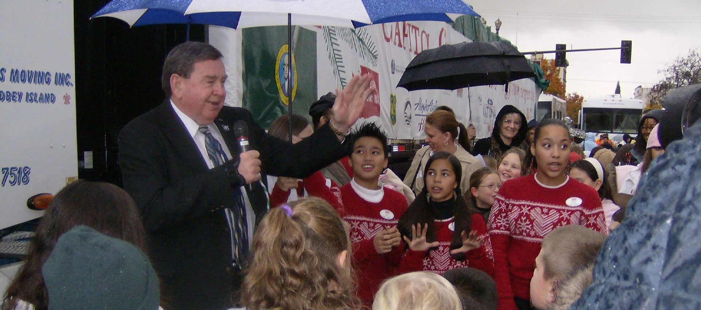

 [Skip to main content](https://www.cityofvancouver.us#main)  [Skip to search](https://www.cityofvancouver.us#search)     

 *  [Utility Bill](https://cityofvancouver.selectpaytoday.com/Utility) 
 *  [Calendar](https://www.cityofvancouver.us/government/calendar/#tab2) 
 TRANSLATEAfrikaansShqipአማርኛالعربيةՀայերենAzərbaycan diliEuskaraБеларуская моваবাংলাBosanskiБългарскиCatalàCebuanoChichewa简体中文繁體中文CorsuHrvatskiČeština‎DanskNederlandsEnglishEsperantoEestiFilipinoSuomiFrançaisFryskGalegoქართულიDeutschΕλληνικάગુજરાતીKreyol ayisyenHarshen HausaŌlelo Hawaiʻiעִבְרִיתहिन्दीHmongMagyarÍslenskaIgboBahasa IndonesiaGaeilgeItaliano日本語Basa Jawaಕನ್ನಡҚазақ тіліភាសាខ្មែរ한국어كوردی‎КыргызчаພາສາລາວLatinLatviešu valodaLietuvių kalbaLëtzebuergeschМакедонски јазикMalagasyBahasa MelayuമലയാളംMalteseTe Reo MāoriमराठीМонголဗမာစာनेपालीNorsk bokmålپښتوفارسیPolskiPortuguêsਪੰਜਾਬੀRomânăРусскийSamoanGàidhligСрпски језикSesothoShonaسنڌيසිංහලSlovenčinaSlovenščinaAfsoomaaliEspañolBasa SundaKiswahiliSvenskaТоҷикӣதமிழ்తెలుగుไทยTürkçeУкраїнськаاردوO‘zbekchaTiếng ViệtCymraegisiXhosaיידישYorùbáZulu Search         

 *  [Services](https://www.cityofvancouver.us/services) 
   *  [Utility Billing](https://www.cityofvancouver.us/services/utility-billing) 
   *  [Parking](https://www.cityofvancouver.us/economic-prosperity-and-housing/parking) 
     *  [Downtown Parking](https://www.cityofvancouver.us/economic-prosperity-and-housing/parking/downtown-parking) 
     *  [Parking Tickets](https://www.cityofvancouver.us/economic-prosperity-and-housing/parking/parking-tickets) 
     *  [Parking Portal](https://cityofvancouver.t2hosted.com/Account/Portal)  
   *  [Water, Sewer and Stormwater](https://www.cityofvancouver.us/government/department/public-works/water-sewer-and-stormwater) 
   *  [Garbage and Recycling](https://www.cityofvancouver.us/services/garbage-recycling) 
   *  [Event Planning and Permits](https://www.cityofvancouver.us/government/department/parks-recreation-and-cultural-services/event-planning-and-permits) 
   *  [Urban Forestry](https://www.cityofvancouver.us/government/department/public-works/urban-forestry) 
   *  [Report a concern](https://www.cityofvancouver.us/services/report-concern)  
 *  [Business](https://www.cityofvancouver.us/business) 
   *  [Economic Development](https://cityofvancouver.us/departments/economic-prosperity-housing) 
   *  [Building Permits, Licenses, Inspections](https://www.cityofvancouver.us/business/permits-licenses-and-inspections) 
     *  [ePermits](https://www.cityofvancouver.us/business/permits-licenses-and-inspections/epermits) 
     *  [ePlans](https://www.cityofvancouver.us/business/permits-licenses-and-inspections/eplans)  
   *  [Building and Construction](https://www.cityofvancouver.us/business/building-construction) 
     *  [Residential Building Permits](https://www.cityofvancouver.us/business/building-construction/residential-building-permits) 
     *  [Commercial Building Permits](https://www.cityofvancouver.us/business/building-construction/commercial-building-permits)  
   *  [Business and Special Licenses](https://www.cityofvancouver.us/business/permits-licenses-and-inspections/business-and-special-licenses) 
   *  [Planning, Development and Zoning](https://cityofvancouver.us/planning-development-and-zoning) 
     *  [Land Use Development](https://www.cityofvancouver.us/business/planning-development-and-zoning/land-use-development) 
     *  [Long Range Planning](https://cityofvancouver.us/long-range-planning) 
     *  [Comprehensive Plan](https://www.cityofvancouver.us/business/planning-development-and-zoning/comprehensive-plan)  
   *  [Procurement Services](https://www.cityofvancouver.us/business/procurement-services) 
     *  [Bids and Proposals](https://cityofvancouver.bonfirehub.com/portal/?tab=openOpportunities)  
 *  [Government](https://www.cityofvancouver.us/government)  
   *  [Mayor and City Council](https://cityofvancouver.us/departments/mayor-city-council) 
     *  [Agendas and Minutes](https://www.cityofvancouver.us/government/mayor-and-city-council/meetings-agendas-minutes) 
     *  [Council Meetings](https://www.cityofvancouver.us/government/calendar) 
     *  [Community Testimony](https://www.cityofvancouver.us/departments/mayor-city-council/#testimony) 
     *  [Contact Council](https://cityofvancouver.us/departments/mayor-city-council/#form)  
   *  [City Manager’s Office](https://cityofvancouver.us/departments/city-managers-office) 
     *  [City Liaison](https://www.cityofvancouver.us/city-managers-office/city-liaison-services) 
     *  [Climate Action](https://www.cityofvancouver.us/city-managers-office/climate-action) 
     *  [Communications](https://www.cityofvancouver.us/city-managers-office/communication) 
     *  [Strategic Plan](https://www.cityofvancouver.us/government/strategic-plan)  
   *  [Departments](https://www.cityofvancouver.us/government/department-directory) 
     *  [City Attorney’s Office](https://www.cityofvancouver.us/departments/city-attorney) 
     *  [Community Development](https://www.cityofvancouver.us/departments/community-development) 
     *  [Economic Prosperity and Housing](https://www.cityofvancouver.us/departments/economic-prosperity-housing) 
     *  [Financial and Management Services](https://www.cityofvancouver.us/departments/financial-management-services) 
     *  [Vancouver Fire Department](https://www.cityofvancouver.us/departments/fire-department) 
     *  [Human Resources](https://www.cityofvancouver.us/departments/hr) 
     *  [Parks, Recreation and Cultural Services](https://www.cityofvancouver.us/departments/parks-recreation-and-cultural-services) 
     *  [Vancouver Police Department](https://www.cityofvancouver.us/departments/police) 
     *  [Public Works](https://www.cityofvancouver.us/departments/public-works)  
   *  [Boards and Commissions](https://www.cityofvancouver.us/government/boards-commissions) 
   *  [City Center Redevelopment Authority](https://www.cityofvancouver.us/government/city-center-redevelopment-authority) 
   *  [Downtown Redevelopment Authority](https://www.cityofvancouver.us/government/downtown-redevelopment-authority) 
   *  [Public Facilities District Board](https://www.cityofvancouver.us/government/public-facilities-district-board) 
   *  [Transportation Benefit District](https://www.cityofvancouver.us/business/planning-development-and-zoning/transportation-planning/vancouver-transportation-benefit-district) 
   *  [Interlocal Agreements](https://www.cityofvancouver.us/government/department/financial-and-management-services/interlocal-agreements) 
   *  [Municipal Code](https://vancouver.municipal.codes) 
   *  [City Charter](https://www.cityofvancouver.us/government/city-charter) 
   *  [Public Records Request](https://www.cityofvancouver.us/government/public-records-request) 
   *  [Budget](https://www.cityofvancouver.us/government/department/financial-and-management-services/budget) 
   *  [Awards and Recognition](https://www.cityofvancouver.us/about-vancouver/awards-recognition)  
 *  [Community](https://www.cityofvancouver.us/community) 
   *  [Be Heard Vancouver](https://www.beheardvancouver.org) 
   *  [Newsroom](https://www.cityofvancouver.us/community/news) 
   *  [Special Events](https://www.cityofvancouver.us/government/department/parks-recreation-and-cultural-services/special-events-in-vancouver) 
   *  [Recreation Activities](https://www.cityofvancouver.us/government/department/parks-recreation-and-cultural-services/recreation-activities) 
   *  [Parks and Trails](https://www.cityofvancouver.us/community/parks-trails/parkfinder) 
     *  [Community Gardens](https://www.cityofvancouver.us/government/department/parks-recreation-and-cultural-services/community-gardens) 
     *  [Public Art Map](https://city-of-vancouver-wa-geo-hub-cityofvancouver.hub.arcgis.com/apps/fa72863a21ea42c3b114d6e8a2be706a/explore)  
   *  [Culture, Arts and Heritage](https://www.cityofvancouver.us/government/department/parks-recreation-and-cultural-services/culture-arts-and-heritage) 
   *  [Community Centers](https://www.cityofvancouver.us/community/community-centers) 
     *  [Firstenburg Community Center](https://www.cityofvancouver.us/community/community-centers/firstenburg-community-center) 
     *  [Marshall/Luepke Community Center](https://www.cityofvancouver.us/community/community-centers/marshall-luepke-center) 
     *  [Water Resources Education Center](https://www.cityofvancouver.us/government/department/public-works/water-resources-education-center)  
   *  [Volunteer Programs](https://www.cityofvancouver.us/government/department/parks-recreation-and-cultural-services/volunteer-programs) 
   *  [Neighborhood Associations](https://www.cityofvancouver.us/community/neighborhoods) 
   *  [Homelessness](https://www.cityofvancouver.us/city-managers-office/homeless) 
   *  [Emergency Preparedness](https://www.cityofvancouver.us/community/emergency-preparedness) 
   *  [Sister City Joyo, Japan](https://www.cityofvancouver.us/about-vancouver/sister-city-joyo-japan)  
 *  [Data](https://city-of-vancouver-wa-geo-hub-cityofvancouver.hub.arcgis.com) 
     [# Public memorial for Mayor Royce PollardAll are invited to a memorial and community reception for former Mayor Royce Pollard.](https://www.cityofvancouver.us/remembering-mayor-royce-pollard)      [# Help design Vancouver's next flagVancouver wants your help creating a new city flag.](https://www.cityofvancouver.us/help-design-vancouvers-next-flag)      [# Learn about PFAsView recent sampling and read about actions being taken to protect water quality.](https://www.cityofvancouver.us/government/department/public-works/learn-about-pfas)      [# Vancouver Connects newsletterStay informed! Subscribe for a once-a-month email update from the City.](http://www.cityofvancouver.us/vancouverconnects)        [  

#### Apply for a Job](https://www.cityofvancouver.us/government/department/human-resources-hr/jobs)   [  

#### Building Permits](https://cityofvancouver.us/business/permits-licenses-and-inspections)   [  

#### City Council](https://cityofvancouver.us/departments/mayor-city-council)   [  

#### Find a Park](https://cityofvancouver.us/parks-trails-and-biking/parkfinder)   [  

#### Garbage and Recycling](https://cityofvancouver.us/services/garbage-recycling)   [  

#### Report a Concern](https://cityofvancouver.us/services/report-concern)   [  

#### Payments](https://cityofvancouver.us/services/utility-billing)   [  

#### Public Records Request](https://cityofvancouver.us/government/public-records-request)  

## Latest News

     [###### City News

### Vancouver dedicates new sculpture ‘Revealed’ honoring local history

##### April 9, 2025

The City of Vancouver officially dedicated “Revealed,” a sculpture by artist Randy Walker, during a public ceremony at the Clark County Historical Museum on April 4. Commissioned to honor the legacy of the Hidden Brick Company, the sculpture is located on the museum lawn and invites visitors to...](https://www.cityofvancouver.us/vancouver-dedicates-new-sculpture-revealed-honoring-local-history)      [###### City News

### Laurel Manor: A safe place to call home

##### April 8, 2025

Starla, 68, had a tough year. She broke several bones, experienced a back injury and could no longer live on her own. With her daughter’s help, she found a new home at Laurel Manor, 3333 N.E. 66th Ave. This special apartment community opened in January and offers 82...](https://www.cityofvancouver.us/laurel-manor-a-safe-place-to-call-home)      [###### City News

### City Manager update: April 2025

##### April 8, 2025

Winter shelter program provided warmth, safety to 200+ As the City continues to tackle homelessness, we are always looking for ways to make measurable progress. Over the winter months, we opened two city-owned buildings for the first time as temporary overnight shelters to better shield our unhoused residents...](https://www.cityofvancouver.us/city-manager-update-april-2025)  Page 1 of 109 1  [2](https://www.cityofvancouver.us/page/2)  [3](https://www.cityofvancouver.us/page/3)  [4](https://www.cityofvancouver.us/page/4)  [5](https://www.cityofvancouver.us/page/5) ...  [10](https://www.cityofvancouver.us/page/10)  [20](https://www.cityofvancouver.us/page/20)  [30](https://www.cityofvancouver.us/page/30) ...  [»](https://www.cityofvancouver.us/page/2)  [Last »](https://www.cityofvancouver.us/page/109)   [View All News](https://www.cityofvancouver.us/news)      [### Watch: 2025 State of the CityVancouver’s future is powered by community. Watch as Mayor Anne McEnerny-Ogle reflects on the progress we’ve made and how we’re working together to strengthen public safety, expand housing options and invest in infrastructure that supports our growing city.  ](https://youtu.be/srPwJVTqABM)  X CLOSE 

     [### Watch: 4 exciting projects taking shape across VancouverVancouver is growing! By creating good jobs and affordable homes, supporting small businesses and encouraging new ideas, we’re building a city for everyone.](https://youtu.be/mICUn91iX0E)  X CLOSE 

## Upcoming Events

  [###### Urban Forestry

### Arbor Day Celebration

##### April 9, 2025

In 2025, the City is recognized as a Tree City USA for the 36th consecutive year. Join the Urban Forestry Commission at Jane Weber Evergreen Arboretum to celebrate Arbor Day…](https://www.cityofvancouver.us/events/arbor-day-celebration)   [###### Public Works

### Recycling 101: Learn the Basics

##### April 10, 2025

Live in an apartment? Rent? Own? Everyone is invited to join this informative Recycling 101 class. Get all the details about our regional garbage and recycling system. Learn the basics…](https://www.cityofvancouver.us/events/recycling-101-learn-the-basics-11)   [Registration Required###### Events

### Campus Community Garden Flora & Fauna Friday

##### April 11, 2025

Advance registration is required. RSVP today! *This is an outside work party* where volunteers will distribute mulch, pick up litter and pull invasive plants at Campus community garden! Join the…](https://www.cityofvancouver.us/events/campus-community-garden-flora-fauna-friday)   [View All Events](https://www.cityofvancouver.us/government/calendar/#tab2)  

## Upcoming Meetings

### Parking Advisory Committee Meeting

##### Wed, Apr 9, 2025

 8:00 am - 9:00 AM 

City Hall, Aspen Conference Room

 [Meeting Details](https://www.cityofvancouver.us/events/parking-advisory-committee-meeting-15) 

### Lodging Tax Advisory Committee Meeting

##### Wed, Apr 9, 2025

 12:00 pm - 1:00 PM 

City Hall, Aspen Room

 [Meeting Details](https://www.cityofvancouver.us/events/lodging-tax-advisory-committee-meeting-22) 

### Culture, Arts & Heritage Commission Meeting

##### Thu, Apr 10, 2025

 12:00 pm - 1:00 PM 

City Hall, Aspen Room

  ** Add to Calendar April 10, 2025 12:00 pm April 10, 2025 1:00 pm UTC Culture, Arts & Heritage Commission Meeting View meeting agenda and minutes City Hall, Aspen Room 

 [Meeting Details](https://www.cityofvancouver.us/events/culture-arts-heritage-commission-meeting-9) 

### City Council Meeting

##### Mon, Apr 14, 2025

 6:30 pm - 8:30 PM 

City Hall

  ** Add to Calendar April 14, 2025 6:30 pm April 14, 2025 8:30 pm UTC City Council Meeting View all Council agendas and minutes. City Hall 

 [Meeting Details](https://www.cityofvancouver.us/events/city-council-meeting-63) 

  [View All Meetings](https://vancouverwa.portal.civicclerk.com)  

### Sign Up for Vancouver Connects

Sign up to receive the latest news and information from your City straight to your inbox.

 

 name email CAPTCHA Email This field is for validation purposes and should be left unchanged. 

 

    

 *  [Facebook](http://www.facebook.com/VancouverUS) 
 *  [Twitter](http://twitter.com/vancouverUS) 
 *  [Instagram](https://instagram.com/VancouverUS) 
 *  [LinkedIn](https://www.linkedin.com/company/city-of-vancouver-washington) 
 *  [YouTube](https://www.youtube.com/user/CityofVancouverUS) 

 [City Hall415 W. 6th St.Vancouver, WA 98660](https://www.google.com/maps?q=City%2520Hall%2520415%2520W.%25206th%2520St.,%2520WA%252098660) 

  [CONTACT](https://www.cityofvancouver.us/contact)  

##### RESOURCES

 *  [Accessibility](https://www.cityofvancouver.us/city-managers-office/accessibility-and-inclusion-at-the-city-of-vancouver-for-people-with-disabilities) 
 *  [ePlans](https://www.cityofvancouver.us/business/permits-licenses-and-inspections/eplans) 
 *  [Jobs with the City](https://cityofvancouver.us/jobs) 
 *  [Make a Payment](https://cityofvancouver.us/pay-bills-manage-accounts) 
 *  [Maps](https://city-of-vancouver-wa-geo-hub-cityofvancouver.hub.arcgis.com) 
 *  [Municipal Code](https://vancouver.municipal.codes) 
 *  [Permit Center](https://cityofvancouver.us/business/permits-licenses-and-inspections) 
 *  [Public Records](https://cityofvancouver.us/government/public-records-request) 

##### COMMUNITY

 *  [About Vancouver](https://www.cityofvancouver.us/about-vancouver) 
 *  [Climate Action](https://www.cityofvancouver.us/city-managers-office/climate-action) 
 *  [Firstenburg Community Center](https://www.cityofvancouver.us/community/community-centers/firstenburg-community-center) 
 *  [Marshall/Luepke Community Center](https://www.cityofvancouver.us/community/community-centers/marshall-luepke-center) 
 *  [Neighborhood Associations](https://www.cityofvancouver.us/community/neighborhoods) 
 *  [Public Art Map](https://city-of-vancouver-wa-geo-hub-cityofvancouver.hub.arcgis.com/apps/fa72863a21ea42c3b114d6e8a2be706a/explore) 
 *  [Water Resources Education Center](https://www.cityofvancouver.us/government/department/public-works/water-resources-education-center) 

##### DEPARTMENTS

 *  [City Attorney’s Office](https://www.cityofvancouver.us/government/department/city-attorneys-office) 
 *  [City Manager’s Office](https://www.cityofvancouver.us/city-managers-office) 
 *  [Community Development](https://www.cityofvancouver.us/government/community-development) 
 *  [Economic Prosperity and Housing](https://www.cityofvancouver.us/economic-prosperity-and-housing) 
 *  [Financial and Management Services](https://www.cityofvancouver.us/government/department/financial-and-management-services) 
 *  [Fire](https://www.cityofvancouver.us/government/department/vancouver-fire-department-vfd) 
 *  [Human Resources](https://www.cityofvancouver.us/government/department/human-resources-hr) 
 *  [Parks, Recreation, and Cultural Services](https://www.cityofvancouver.us/government/department/parks-recreation-and-cultural-services) 
 *  [Police](https://www.cityofvancouver.us/government/department/vancouver-police-department-vpd) 
 *  [Public Works](https://cityofvancouver.us/departments/public-works) 

 *  [Employee Portal](https://cityofvancouver.us/employee-portal) 
 *  [Website Feedback](https://www.cityofvancouver.us/website-feedback) 
 *  [Policies](https://cityofvancouver.us/policies) 
 *  [© City of Vancouver]() 

Notifications

               