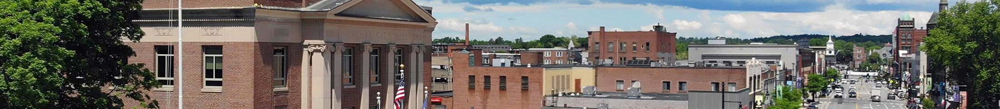
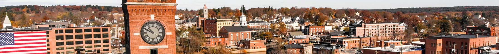

 

Loading

  [Skip to Main Content](https://www.nashuanh.gov/804/City-Officials/)     

 [Create a Website Account](https://www.nashuanh.gov/MyAccount/ProfileCreate)  - Manage notification subscriptions, save form progress and more.    

 *  [Website Sign In](https://www.nashuanh.gov/MyAccount) 
      Search       

 1.  [Services](https://www.nashuanh.gov/101/Services) 
 1.  [Community](https://www.nashuanh.gov/31/Community) 
 1.  [Government](https://www.nashuanh.gov/27/Government) 
 1.  [I Want To...](https://www.nashuanh.gov/9/I-Want-To) 

 1.   
 1.   
 1.   

 1.  [Home](https://www.nashuanh.gov/) 
 1.  [Government](https://www.nashuanh.gov/27/Government) 
 1. City Officials

# City Officials

 1.    

####  [Mayor's Office](https://www.nashuanh.gov/148/Mayors-Office)    

Meet Mayor Jim Donchess   

 1.    

####  [Board of Aldermen](https://www.nashuanh.gov/514/Board-of-Aldermen)    

The Board of Aldermen is the governing body of the City of Nashua and as such is the policy-making entity of the City, except where otherwise expressed in the City Charter.    

 1.    

####  [Board of Education](https://www.nashua.edu/domain/190)    

They shall perform all duties as a School Committee is required by law to perform and have the power to protect the health and safety of children attending the public schools.   

 1.    

####  [Board of Fire Commissioners](https://www.nashuanh.gov/575/Board-of-Fire-Commissioners)    

The Fire Commission is responsible for the hiring and promotion process of the department. They shall make such rules and regulations for their own government and for the government of all other officers and members of the Fire Department, also they have the sole power to select and purchase land for the purpose of the Fire Department once the Board of Aldermen have secured an adequate appropriation.   

 1.    

####  [Board of Public Works](https://www.nashuanh.gov/389/Board-of-Public-Works)    

The Board of Public Works is responsible for the maintenance of the streets, highways, bridges and sidewalks.   

    *      

####  [Retirement System Trustees](https://www.nashuanh.gov/394/Retirement-System-Trustees)      

The Board of Public Works Trustees shall administer the retirement system of the Board of Public Works.     

 1.    

####  [Police Commission](https://www.nashuanh.gov/828/Police-Commission)    

The Police Commissioners shall have full power to make all rules for the government of the police force and enforce said rules.   

 1.    

####  [Volunteer Boards & Commissions](https://www.nashuanh.gov/513/Volunteer-Boards-Commissions)    

Browse through a list of boards and committees to find meeting information, agendas and minutes, a list of members, and about each committee.   

 1.   [Mayor's Office](https://www.nashuanh.gov/148/Mayors-Office)  
    1.   [Mayor's Initiatives](https://www.nashuanh.gov/660/Mayors-Initiatives)  
       1.   [Mayor's Opioid Task Force](https://www.nashuanh.gov/987/Mayors-Opioid-Task-Force)  
       1.   [Mayor's Youth Council](https://www.nashuanh.gov/1544/Mayors-Youth-Council)  
       1.   [Nashua City Academy](https://www.nashuanh.gov/1117/Nashua-City-Academy)  
       1.   [Mayor's Summer Intern Program](https://www.nashuanh.gov/1190/Mayors-Summer-Intern-Program)  
       1.   [Welcoming City Initiative](https://www.nashuanh.gov/1113/Welcoming-City-Initiative)  
       1.   [Mayor’s Winter Reading Challenge](https://www.nashuanh.gov/1290/Mayors-Winter-Reading-Challenge)  
       1.   [Past Initiatives](https://www.nashuanh.gov/1437/Past-Initiatives)  
          1.   [Complete Count Committee](https://www.nashuanh.gov/1245/Complete-Count-Committee)  
          1.   [My Brother's Keeper Community Challenge](https://www.nashuanh.gov/1087/My-Brothers-Keeper-Community-Challenge)  
    1.   [News & Events](https://www.nashuanh.gov/545/News-Events)  
       1.   [Mayor's Virtual Book Club](https://www.nashuanh.gov/1421/Mayors-Virtual-Book-Club)  
       1.   [Gate City Light Award](https://www.nashuanh.gov/541/Gate-City-Light-Award)  
       1.   [Inauguration](https://www.nashuanh.gov/1306/Inauguration)  
       1.   [State of the City Addresses](https://www.nashuanh.gov/Archive.aspx?AMID=47)  
       1.   [Nashua Multicultural Festival](https://www.nashuanh.gov/1237/Nashua-Multicultural-Festival)  
    1.   [Budgets](https://www.nashuanh.gov/1451/Budgets)  
    1.   [Invite the Mayor](https://www.nashuanh.gov/536/Invite-the-Mayor)  
    1.   [Request a Recognition](https://www.nashuanh.gov/1453/Request-a-Recognition)  
 1.   [Board of Aldermen](https://www.nashuanh.gov/514/Board-of-Aldermen)  
 1.   [Board of Education](https://www.nashua.edu/domain/190)  
 1.   [Board of Fire Commissioners](https://www.nashuanh.gov/575/Board-of-Fire-Commissioners)  
 1.   [Board of Public Works](https://www.nashuanh.gov/389/Board-of-Public-Works)  
 1.   [Police Commission](https://www.nashuanh.gov/828/Police-Commission)  
 1.   [Boards, Committees, and Commissions](https://www.nashuanh.gov/513/Boards-Committees-and-Commissions)  
    1.   [201 Main Street Financing Corp.](https://www.nashuanh.gov/1616/201-Main-Street-Financing-Corp)  
    1.   [201 Main Street Real Estate Corp.](https://www.nashuanh.gov/1615/201-Main-Street-Real-Estate-Corp)  
    1.   [Ad Hoc Joint Mayoral - Board of Aldermen Committee on Capital Expenditures & Debt Service Plan](https://www.nashuanh.gov/1635/Ad-Hoc-Joint-Mayoral---Board-of-Aldermen)  
    1.   [Airport Authority](https://www.nashuanh.gov/861/Airport-Authority)  
    1.   [Ambulance Advisory Committee](https://www.nashuanh.gov/619/Ambulance-Advisory-Committee)  
    1.   [Animal and Dog Park](https://www.nashuanh.gov/1276/Animal-and-Dog-Park)  
    1.   [Arts Commission](https://www.nashuanh.gov/346/Arts-Commission)  
       1.   [2025 Grant Application](https://www.nashuanh.gov/1150/2025-Grant-Application)  
       1.   [Nashua Arts & Culture Plan](https://www.nashuanh.gov/1509/Nashua-Arts-Culture-Plan)  
       1.   [Americans for the Arts Survey Results](https://www.nashuanh.gov/1610/Americans-for-the-Arts-Survey-Results)  
    1.   [Auditorium Commission](https://www.nashuanh.gov/623/Auditorium-Commission)  
    1.   [Board of Aldermen](https://www.nashuanh.gov/514/Board-of-Aldermen)  
       1.   [Committee Membership (PDF)](https://www.nashuanh.gov/DocumentCenter/Index/2577)  
       1.   [Legislation](https://www.nashuanh.gov/quicklinks.aspx?CID=30)  
       1.   [Ward Map](https://www.nashuanh.gov/DocumentCenter/View/3836)  
       1.   [Budget Review Committee](https://www.nashuanh.gov/AgendaCenter/Budget-Review-Committee-15)  
       1.   [Committee on Infrastructure](https://www.nashuanh.gov/AgendaCenter/Committee-on-Infrastructure-34)  
       1.   [Finance Committee](https://www.nashuanh.gov/AgendaCenter/Finance-Committee-32)  
       1.   [Human Affairs Committee](https://www.nashuanh.gov/AgendaCenter/Human-Affairs-Committee-33)  
       1.   [Joint Special School Building Committee](https://www.nashuanh.gov/AgendaCenter/Joint-Special-School-Building-Committee-37)  
       1.   [Pennichuck Water Special Committee](https://www.nashuanh.gov/AgendaCenter/Pennichuck-Water-Special-Committee-40)  
       1.   [Personnel/Administrative Affairs Committee](https://www.nashuanh.gov/AgendaCenter/PersonnelAdministrative-Affairs-Committe-36)  
       1.   [Planning & Economic Development Committee](https://www.nashuanh.gov/AgendaCenter/Planning-Economic-Development-Committee-35)  
       1.   [School Construction Projects Committee](https://www.nashuanh.gov/AgendaCenter/School-Construction-Projects-Committee-39)  
       1.   [Substandard Living Conditions Special Committee](https://www.nashuanh.gov/AgendaCenter/Substandard-Living-Conditions-Special-Co-38)  
    1.   [Board of Assessors](https://www.nashuanh.gov/572/Board-of-Assessors)  
    1.   [Board of Building and Fire Codes Appeals](https://www.nashuanh.gov/1614/Board-of-Building-and-Fire-Codes-Appeals)  
    1.   [Board of Education](https://www.nashua.edu/Page/2046)  
    1.   [Board of Fire Commissioners](https://www.nashuanh.gov/575/Board-of-Fire-Commissioners)  
    1.   [Board of Health](https://www.nashuanh.gov/624/Board-of-Health)  
    1.   [Board of Public Works](https://www.nashuanh.gov/389/Board-of-Public-Works)  
       1.   [Retirement System Trustees](https://www.nashuanh.gov/394/Retirement-System-Trustees)  
    1.   [Board of Public Works Retirement System Trustees](https://www.nashuanh.gov/394)  
    1.   [Board of Registrars](https://www.nashuanh.gov/625/Board-of-Registrars)  
    1.   [Budget Review Committee](https://www.nashuanh.gov/581/Budget-Review-Committee)  
    1.   [Business & Industrial Development Authority (BIDA)](https://www.nashuanh.gov/627/Business-Industrial-Development-Authorit)  
    1.   [Cable Television Advisory Board](https://www.nashuanh.gov/582/Cable-Television-Advisory-Board)  
       1.   [Comcast Franchise Renewal](https://www.nashuanh.gov/1484/Comcast-Franchise-Renewal)  
    1.   [Capital Equipment Reserve Fund](https://www.nashuanh.gov/628/Capital-Equipment-Reserve-Fund)  
    1.   [Capital Improvement Committee](https://www.nashuanh.gov/590/Capital-Improvement-Committee)  
    1.   [Citizen’s Advisory Commission (Review & Comment)](https://www.nashuanh.gov/637/Citizens-Advisory-Commission-Review-Comm)  
    1.   [Committee on Infrastructure](https://www.nashuanh.gov/856/Committee-on-Infrastructure)  
    1.   [Conservation Commission](https://www.nashuanh.gov/594/Conservation-Commission)  
    1.   [Conway Ice Arena Commission](https://www.nashuanh.gov/629/Conway-Ice-Arena-Commission)  
    1.   [Cultural Connections Committee](https://www.nashuanh.gov/618/Cultural-Connections-Committee)  
       1.   [Gate City Immigrant Initiative Sub-Committee](https://www.nashuanh.gov/1137/Gate-City-Immigrant-Initiative-Sub-Commi)  
    1.   [Downtown Improvement Committee](https://www.nashuanh.gov/630/Downtown-Improvement-Committee)  
    1.   [Edgewood/Suburban Cemetery Trustees](https://www.nashuanh.gov/191/EdgewoodSuburban-Cemetery-Trustees)  
    1.   [Electric Aggregation Committee](https://www.nashuanh.gov/1468/Electric-Aggregation-Committee)  
    1.   [Environment and Energy Committee](https://www.nashuanh.gov/1141/Environment-and-Energy-Committee)  
    1.   [Ethics Review Committee](https://www.nashuanh.gov/1591/Ethics-Review-Committee)  
    1.   [Finance Committee](https://www.nashuanh.gov/601/Finance-Committee)  
    1.   [Greeley Park Advisory Committee](https://www.nashuanh.gov/1602/Greeley-Park-Advisory-Committee)  
    1.   [Historic District Commission](https://www.nashuanh.gov/603/Historic-District-Commission)  
    1.   [Housing Revolving Fund](https://www.nashuanh.gov/1547/Housing-Revolving-Fund)  
    1.   [Human Affairs Committee](https://www.nashuanh.gov/849/Human-Affairs-Committee)  
    1.   [Hunt Legacy Trustees](https://www.nashuanh.gov/631/Hunt-Legacy-Trustees)  
    1.   [Hunt Memorial Building Board of Trustees](https://www.nashuanh.gov/632/Hunt-Memorial-Building-Board-of-Trustees)  
    1.   [Ira F. Harris Lecture Trustees](https://www.nashuanh.gov/633/Ira-F-Harris-Lecture-Trustees)  
    1.   [Joint Board Public Works Cmte on Infrastructure](https://www.nashuanh.gov/1645/Joint-Board-Public-Works-Cmte-on-Infrast)  
    1.   [Joint Committee on Infrastructure and Police Comm.](https://www.nashuanh.gov/1618/Joint-Committee-on-Infrastructure-and-Po)  
    1.   [Joint Special School Building Committee](https://www.nashuanh.gov/852/Joint-Special-School-Building-Committee)  
    1.   [Local Emergency Planning Committee](https://www.nashuanh.gov/972/Nashua-Local-Emergency-Planning-Committe)  
    1.   [Mine Falls Park Advisory Committee](https://www.nashuanh.gov/812/Mine-Falls-Park-Advisory-Committee)  
    1.   [Nashua Center for the Arts Board of Trustees](https://www.nashuanh.gov/1588/Nashua-Center-for-the-Arts-Board-of-Trus)  
    1.   [Nashua Housing and Redevelopment Authority](https://www.nashuanh.gov/635/Nashua-Housing-and-Redevelopment-Authori)  
    1.   [Nashua Rail Committee](https://www.nashuanh.gov/1178/Nashua-Rail-Committee)  
    1.   [Nashua Regional Planning Commission](https://www.nashuanh.gov/827/Nashua-Regional-Planning-Commission)  
    1.   [NPAC Corp.](https://www.nashuanh.gov/1617/NPAC-Corp)  
    1.   [Pennichuck Water Special Committee](https://www.nashuanh.gov/1604/Pennichuck-Water-Special-Committee)  
    1.   [Performing Arts Center Steering Committee](https://www.nashuanh.gov/1240/Performing-Arts-Center-Steering-Committe)  
    1.   [Personnel/Administrative Affairs Committee](https://www.nashuanh.gov/851/PersonnelAdministrative-Affairs-Committe)  
    1.   [Planning & Economic Development Committee](https://www.nashuanh.gov/850/Planning-Economic-Development-Committee)  
    1.   [Planning Board](https://www.nashuanh.gov/613/Planning-Board)  
    1.   [Police Commission](https://www.nashuanh.gov/828/Police-Commission)  
    1.   [Public Library Trustees](https://www.nashuanh.gov/829/Public-Library-Trustees)  
    1.   [Tax Increment Financing Advisory Board](https://www.nashuanh.gov/639/Tax-Increment-Financing-Advisory-Board)  
    1.   [Woodlawn/Pinewood Cemetery Trustees](https://www.nashuanh.gov/189/WoodlawnPinewood-Cemetery-Trustees)  
    1.   [Zoning Board](https://www.nashuanh.gov/616/Zoning-Board)  
  [Pay Bills](https://www.nashuanh.gov/131/Online-Payments)   [Alerts &

Notifications](https://www.nashuanh.gov/alertcenter.aspx)   [Motor Vehicle](https://www.nashuanh.gov/404/Motor-Vehicle-Registration)   [Road Work

News](https://www.nashuanh.gov/civicalerts.aspx?CID=10)   [Maps / GIS](https://www.nashuanh.gov/698/Maps)   [Agendas

& Minutes

Portal](https://nashuanh.portal.civicclerk.com/)   [Assessing

Values & Taxes](https://www.nashuanh.gov/150/Assessing-Department)   [City Clerk

Vital Records](https://www.nashuanh.gov/241/Vital-Records)   [Trash &

Recycling](https://www.nashuanh.gov/436/Trash-Recycling-Schedule)   [Budget &

Financial

Reports](https://www.nashuanh.gov/460/City-Financial-Reports)   [Public Record & Service Requests](https://www.nashuanh.gov/1660/Record-and-Service-Requests)   [Bus Routes

& Schedules](https://www.nashuanh.gov/456/Routes-Schedules)  

 1.   

### Contact Us

 1.    

229 Main Street   

Nashua, NH 03060   

 [__City Government__](https://www.nashuanh.gov/27/Government)  __   

 [Directions to City Hall](https://www.google.com/maps/place/Nashua,+NH/@42.7528691,-71.5317298,13z/data=!3m1!4b1!4m5!3m4!1s0x89e3b0e42dfabf85:0xb6660811428bea55!8m2!3d42.7653662!4d-71.467566)    

 [Emergency Alert System](https://nashuanh.genasys.com/portal/en)__    

###  [Quick Links](https://www.nashuanh.gov/QuickLinks.aspx?CID=100) 

 1.  [City Officials](https://www.nashuanh.gov/804/City-Officials)  
 1.  [Elections](https://www.nashuanh.gov/195/Elections)  
 1.  [Career Opportunities](https://www.nashuanh.gov/1561/Career-Opportunities)  
 1.  [ADA Services](https://www.nashuanh.gov/1511/ADA)  
 1.  [Ordinances & Resolutions](https://www.nashuanh.gov/quicklinks.aspx?CID=30)  
 /QuickLinks.aspx 

###  [Helpful Links](https://www.nashuanh.gov/QuickLinks.aspx?CID=101) 

 1.  [Home](https://www.nashuanh.gov/)  
 1.  [Site Map](https://www.nashuanh.gov/sitemap)  
 1.  [Contact Us](https://www.nashuanh.gov/directory.aspx)  
 1.  [Accessibility](https://www.nashuanh.gov/accessibility)  
 1.  [Employee Email Access](https://mail.nashuanh.gov/owa)  
 1.  [Employee Self Service](https://employee.nashuanh.gov/lawson/portal/)  
 1.  [Privacy Policy](https://www.nashuanh.gov/privacy)  
 /QuickLinks.aspx Government Websites by [CivicPlus®](https://connect.civicplus.com/referral)   [Enable Google Translate](https://www.nashuanh.gov/804/City-Officials/)  Loading Loading Do Not Show Again Close 

 