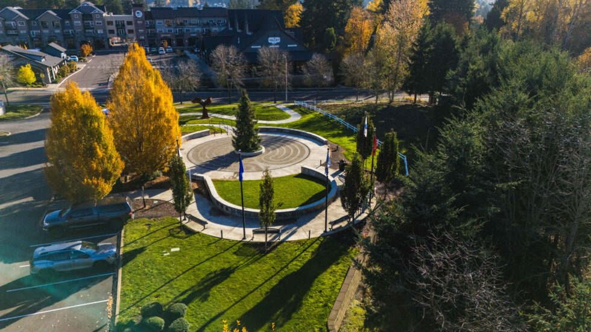

 Press Alt+1 for screen-reader mode, Alt+0 to cancel  [Accessibility Screen-Reader Guide, Feedback, and Issue Reporting](https://accessibe.com/blog/knowledgebase/screen-reader-guide)  

 *  [City Hall](https://www.happyvalleyor.gov/city-hall/) 
 *  [Business](https://www.happyvalleyor.gov/business/) 
 *  [Community](https://www.happyvalleyor.gov/community/) 
 *  [How Do I](https://www.happyvalleyor.gov/city-hall/city-council/a-message-from-the-mayor/) 
 *  [Search](https://www.happyvalleyor.gov/city-hall/city-council/a-message-from-the-mayor/) 
 Dark 

## City Hall

 [Explore](https://www.happyvalleyor.gov/city-hall/)  

###### General

 *  [Advertisements, Bids and Proposals](https://www.happyvalleyor.gov/business/engineering-division/bid-advertisements/) 
 *  [City Council](https://www.happyvalleyor.gov/city-hall/city-council/) 
 *  [City Manager](https://www.happyvalleyor.gov/city-hall/city-manager/) 
 *  [City Recorder](https://www.happyvalleyor.gov/city-hall/city-recorder/) 
 *  [Fee Schedule](https://www.happyvalleyor.gov/city-hall/fee-schedule/) 
 *  [Management Team](https://www.happyvalleyor.gov/city-hall/management-team/) 
 *  [Meeting Agendas & Videos](https://www.happyvalleyor.gov/city-hall/agendas-minutes-packets/) 
 *  [Municipal Code](https://www.happyvalleyor.gov/city-hall/municipal-code/) 
 *  [Youth Council](https://www.happyvalleyor.gov/city-hall/boards-commissions/youth-council/) 

###### Departments

 *  [Building Division](https://www.happyvalleyor.gov/business/building-division/) 
 *  [Code Enforcement](https://www.happyvalleyor.gov/services/code-enforcement/) 
 *  [Community Services](https://www.happyvalleyor.gov/community/community-services/) 
 *  [Economic & Community Development](https://www.happyvalleyor.gov/business/economic-community-development/) 
 *  [Engineering Division](https://www.happyvalleyor.gov/business/engineering-division/engineering-division/) 
 *  [Finance](https://www.happyvalleyor.gov/city-hall/finance/) 
 *  [Human Resources](https://www.happyvalleyor.gov/city-hall/human-resource-office/) 
 *  [Municipal Court](https://www.happyvalleyor.gov/services/municipal-court/) 
 *  [Planning Division](https://www.happyvalleyor.gov/business/planning-division/) 
 *  [Police](https://www.happyvalleyor.gov/services/police-department/) 
 *  [Public Works](https://www.happyvalleyor.gov/services/public-works/) 
 *  [All Departments & Divisions](https://www.happyvalleyor.gov/city-hall/all-departments-divisions/) 

###### Boards & Commissions

 *  [Budget Committee](https://www.happyvalleyor.gov/city-hall/boards-commissions/budget-committee/) 
 *  [Design Review Board Committee](https://www.happyvalleyor.gov/city-hall/boards-commissions/design-review-board/) 
 *  [Hearings Officer](https://www.happyvalleyor.gov/business/planning-division/land-use-hearings/hearings-officer/) 
 *  [Library Board](https://www.happyvalleyor.gov/city-hall/boards-commissions/library-advisory-board/) 
 *  [Parks Advisory Committee](https://www.happyvalleyor.gov/city-hall/boards-commissions/parks-advisory-committee/) 
 *  [Planning Commission](https://www.happyvalleyor.gov/city-hall/boards-commissions/planning-commission/) 
 *  [Public Art Committee](https://www.happyvalleyor.gov/city-hall/boards-commissions/public-art-committee/) 
 *  [Traffic & Public Safety Committee](https://www.happyvalleyor.gov/city-hall/boards-commissions/traffic-public-safety-committee) 

## Business

 [Grow Your Business](https://www.happyvalleyor.gov/business/)  

###### General

 *  [Business Licenses](https://www.happyvalleyor.gov/business/business-licenses/) 
 *  [OLCC](https://docs.happyvalleyor.gov/Forms/LiquorLicense) 
 *  [SDCs & Excise Taxes](https://www.happyvalleyor.gov/business/building-division/sdcs-excise-taxes/) 

###### Resources

 *  [Demographic Information](https://www.happyvalleyor.gov/community/city-overview/) 
 *  [Government and Local Business](https://www.happyvalleyor.gov/business/business-services/) 
 *  [Happy Valley Business Alliance (HVBA)](https://www.happyvalleyor.gov/hvba/) 
 *  [North Clackamas Chamber of Commerce](https://www.yourchamber.com/) 

###### Divisions

 *  [Economic & Community Development](https://www.happyvalleyor.gov/business/economic-community-development/) 
 *  [Economic Development Division](https://www.happyvalleyor.gov/business/economic-development-division/) 
 *  [Planning Division](https://www.happyvalleyor.gov/business/planning-division/) 
 *  [Engineering Division](https://www.happyvalleyor.gov/business/engineering-division/engineering-division/) 
 *  [Building Division](https://www.happyvalleyor.gov/business/building-division/) 

## Community

 [Be Involved](https://www.happyvalleyor.gov/community/)  

###### General

 *  [City History](https://www.happyvalleyor.gov/community/city-overview/city-history/) 
 *  [City Overview](https://www.happyvalleyor.gov/community/city-overview/) 
 *  [Commitment to Community and Inclusivity](https://www.happyvalleyor.gov/city-hall/commitment-to-community-and-inclusivity-2/) 
 *  [Community Newspaper](https://www.happyvalleyor.gov/community/newsletters/) 
 *  [Events Calendar](https://www.happyvalleyor.gov/events-calendar/) 
 *  [Houseless Resources](https://www.happyvalleyor.gov/houseless-resources/) 
 *  [New in Town?](https://www.happyvalleyor.gov/community/community-services/new-in-town/) 
 *  [Veterans](https://www.happyvalleyor.gov/community/community-services/veterans/) 
 *  [Volunteer Opportunities](https://www.happyvalleyor.gov/community/volunteer-opportunities/) 
 * 

###### Amenities

 *  [City Store](https://www.happyvalleyor.gov/community/city-store/) 
 *  [Community Events](https://www.happyvalleyor.gov/community/community-services/community-events/) 
 *  [Community Programs](https://www.happyvalleyor.gov/community/programs/) 
 *  [HV Public Art](https://www.happyvalleyor.gov/community/programs/hv-public-art/) 
 *  [Library](https://www.happyvalleyor.gov/community/happy-valley-library/) 
 *  [Parks and Recreation](https://www.happyvalleyor.gov/services/parks/) 
 *  [Park & Trail Maps](https://www.happyvalleyor.gov/community/parks-trails/) 

###### Services

 *  [Animal Services](https://www.happyvalleyor.gov/services/animal-services/) 
 *  [Code Enforcement](https://www.happyvalleyor.gov/services/code-enforcement/) 
 *  [Community Service](https://www.happyvalleyor.gov/community/community-services/) 
 *  [Passport Service](https://www.happyvalleyor.gov/services/passport-service/) 

## How Do I?

 *  [Apply for a Building Permit](https://www.happyvalleyor.gov/business/building-division/) 
 *  [Apply for a Business License](https://www.happyvalleyor.gov/business/business-licenses/) 
 *  [Apply for a Job with the City](https://www.governmentjobs.com/careers/happyvalleyor) 
 *  [Apply for or Renew an OLCC](https://docs.happyvalleyor.gov/Forms/LiquorLicense) 
 *  [Apply for or Renew a Passport](https://www.happyvalleyor.gov/services/passport-service/forms/passport-applications/) 
 *  [Apply for a Special Event Permit](https://www.happyvalleyor.gov/community/community-services/special-event-application/) 
 *  [Check City Zoning](https://www.happyvalleyor.gov/business/planning-division/zoning-map/) 
 * 

 *  [Find out what is Under Construction](https://www.happyvalleyor.gov/services/public-works/construction-projects/) 
 *  [Find the City Municipal Code](https://www.happyvalleyor.gov/city-hall/municipal-code/) 
 *  [Find HV Works](https://happyvalleyor-energovweb.tylerhost.net/apps/selfservice) 
 *  [Find Upcoming Meetings](https://www.happyvalleyor.gov/events-calendar/) 
 *  [Find Veterans Resources](https://www.happyvalleyor.gov/community/nw-veterans-resources/) 
 *  [Get Involved or Run for City Council](https://www.happyvalleyor.gov/city-hall/boards-commissions/) 
 *  [Know if my Address is in Happy Valley](https://happyvalley.maps.arcgis.com/apps/webappviewer/index.html?id=1043b407912e4e4c94890813846da69b)  __ * [(City Limits Explained)](https://www.happyvalleyor.gov/city-limits-explained/)*__ 
 * 

 * 

 *  [Make a Court payment](https://www.happyvalleyor.gov/services/municipal-court/payment-options/) 
 *  [Make a Park Reservation](https://www.happyvalleyor.gov/services/parks-and-recreation-2/happy-valley-park/) 
 *  [Renew or Obtain a Dog License](https://www.happyvalleyor.gov/services/code-enforcement/animal-services/license-your-pet/) 
 *  [Report a Concern](https://www.happyvalleyor.gov/report-a-concern/) 
 *  [Request Public Records](https://docs.happyvalleyor.gov/Forms/PublicRecordsRequest) 
 *  [Sign up for Notifications](https://www.happyvalleyor.gov/signup-for-notifications/) 
 *  [Start a Business](https://www.happyvalleyor.gov/business/support-for-businesses/) 
 *  [Submit a Public Meetings Law Violation](https://www.happyvalleyor.gov/city-hall/city-recorder/public-meeting-law-pml-grievances/) 
 *  [Understand Real Property Taxes](https://www.happyvalleyor.gov/real-property-tax-explained/) 
 *  [Visit the Library](https://www.happyvalleyor.gov/community/happy-valley-library/) 
 Select LanguageChinese (Simplified)RussianSpanishUkrainianVietnamese   Powered by  [Translate](https://translate.google.com/)  

 *  [City Hall](https://www.happyvalleyor.gov/city-hall/)  
   *  [All in City Hall](https://www.happyvalleyor.gov/city-hall/) 
   *  [General](https://www.happyvalleyor.gov/city-hall/city-council/a-message-from-the-mayor/) 
   *  [Bids and Proposals](https://www.happyvalleyor.gov/business/engineering-division/bid-advertisements/) 
   *  [City Council](https://www.happyvalleyor.gov/city-hall/city-council/) 
   *  [City Manager](https://www.happyvalleyor.gov/city-hall/city-manager/) 
   *  [City Recorder](https://www.happyvalleyor.gov/city-hall/city-recorder/) 
   *  [Fee Schedule](https://www.happyvalleyor.gov/city-hall/fee-schedule/) 
   *  [Management Team](https://www.happyvalleyor.gov/city-hall/management-team/) 
   *  [Meeting Agendas & Videos](https://www.happyvalleyor.gov/city-hall/agendas-minutes-packets/) 
   *  [Municipal Code](https://www.happyvalleyor.gov/city-hall/municipal-code/) 
   *  [Youth Council](https://www.happyvalleyor.gov/city-hall/boards-commissions/youth-council/) 
   *  [Departments](https://www.happyvalleyor.gov/city-hall/city-council/a-message-from-the-mayor/) 
   *  [Building Division](https://www.happyvalleyor.gov/business/building-division/) 
   *  [Code Enforcement](https://www.happyvalleyor.gov/services/code-enforcement/) 
   *  [Economic & Community Development](https://www.happyvalleyor.gov/business/economic-community-development/) 
   *  [Engineering Division](https://www.happyvalleyor.gov/business/engineering-division/engineering-division/) 
   *  [Finance](https://www.happyvalleyor.gov/city-hall/finance/) 
   *  [Human Resources](https://www.happyvalleyor.gov/city-hall/human-resource-office/) 
   *  [Municipal Court](https://www.happyvalleyor.gov/services/municipal-court/) 
   *  [Planning Division](https://www.happyvalleyor.gov/business/planning-division/) 
   *  [Police Department](https://www.happyvalleyor.gov/services/police-department/) 
   *  [Public Works](https://www.happyvalleyor.gov/services/public-works/) 
   *  [All Departments & Divisions](https://www.happyvalleyor.gov/city-hall/all-departments-divisions/) 
   *  [Boards & Commissions](https://www.happyvalleyor.gov/city-hall/city-council/a-message-from-the-mayor/) 
   *  [Budget Committee](https://www.happyvalleyor.gov/city-hall/boards-commissions/budget-committee/) 
   *  [Design Review Board](https://www.happyvalleyor.gov/city-hall/boards-commissions/design-review-board/) 
   *  [Hearings Officer Virtual Meeting](https://www.happyvalleyor.gov/business/planning-division/land-use-hearings/hearings-officer/) 
   *  [Library Board](https://www.happyvalleyor.gov/city-hall/boards-commissions/library-advisory-board/) 
   *  [Parks Advisory Committee](https://www.happyvalleyor.gov/city-hall/boards-commissions/parks-advisory-committee/) 
   *  [Planning Commission](https://www.happyvalleyor.gov/city-hall/boards-commissions/planning-commission/) 
   *  [Public Art Committee](https://www.happyvalleyor.gov/city-hall/boards-commissions/public-art-committee/) 
   *  [Traffic & Public Safety Committee](https://www.happyvalleyor.gov/city-hall/boards-commissions/traffic-public-safety-committee/) 
 *  [Business](https://www.happyvalleyor.gov/city-hall/city-council/a-message-from-the-mayor/)  
   *  [All in Business](https://www.happyvalleyor.gov/business/) 
   *  [General](https://www.happyvalleyor.gov/city-hall/city-council/a-message-from-the-mayor/) 
   *  [Business Licenses](https://www.happyvalleyor.gov/business/business-licenses/) 
   *  [OLCC](https://docs.happyvalleyor.gov/Forms/LiquorLicense) 
   *  [SDCs & Excise Taxes](https://www.happyvalleyor.gov/business/building-division/sdcs-excise-taxes/) 
   *  [Resources](https://www.happyvalleyor.gov/city-hall/city-council/a-message-from-the-mayor/) 
   *  [Business Services](https://www.happyvalleyor.gov/business/business-services/) 
   *  [Demographics](https://www.happyvalleyor.gov/community/city-overview/) 
   *  [Happy Valley Business Alliance (HVBA)](https://www.happyvalleyor.gov/community/community-services/happy-valley-business-alliance/) 
   *  [North Clackamas Chamber of Commerce](https://www.yourchamber.com/) 
   *  [Divisions](https://www.happyvalleyor.gov/city-hall/city-council/a-message-from-the-mayor/) 
   *  [Economic & Community Development](https://www.happyvalleyor.gov/business/economic-community-development/) 
   *  [Economic Development Division](https://www.happyvalleyor.gov/business/economic-development-division/) 
   *  [Engineering Division](https://www.happyvalleyor.gov/business/engineering-division/engineering-division/) 
   *  [Planning Division](https://www.happyvalleyor.gov/business/planning-division/) 
   *  [Building Division](https://www.happyvalleyor.gov/business/building-division/) 
 *  [Community](https://www.happyvalleyor.gov/city-hall/city-council/a-message-from-the-mayor/)  
   *  [All in Community](https://www.happyvalleyor.gov/community/) 
   *  [General](https://www.happyvalleyor.gov/city-hall/city-council/a-message-from-the-mayor/) 
   *  [City History](https://www.happyvalleyor.gov/community/city-overview/city-history/) 
   *  [City Overview](https://www.happyvalleyor.gov/community/city-overview/) 
   *  [Commitment to Community and Inclusivity](https://www.happyvalleyor.gov/city-hall/commitment-to-community-and-inclusivity/) 
   *  [Community Newspaper](https://www.happyvalleyor.gov/community/newsletters/) 
   *  [Events Calendar](https://www.happyvalleyor.gov/events-calendar/) 
   *  [Houseless Resources](https://www.happyvalleyor.gov/community/community-services/houseless-resources/) 
   *  [Inclement Weather Procedures](https://www.happyvalleyor.gov/services/public-works/inclement-weather-services/) 
   *  [New in Town?](https://www.happyvalleyor.gov/community/community-services/new-in-town/) 
   *  [Veterans](https://www.happyvalleyor.gov/community/community-services/veterans/) 
   *  [Volunteer Opportunities](https://www.happyvalleyor.gov/community/volunteer-opportunities/) 
   *  [Amenities](https://www.happyvalleyor.gov/city-hall/city-council/a-message-from-the-mayor/) 
   *  [City Store](https://www.happyvalleyor.gov/community/city-store/) 
   *  [Community Events](https://www.happyvalleyor.gov/community/community-services/community-events/) 
   *  [Community Programs](https://www.happyvalleyor.gov/community/programs/) 
   *  [Library](https://www.happyvalleyor.gov/community/happy-valley-library/) 
   *  [Parks & Recreation](https://www.happyvalleyor.gov/services/parks/) 
   *  [Park & Trail Maps](https://www.happyvalleyor.gov/services/neighborhood-parks/) 
   *  [Services](https://www.happyvalleyor.gov/city-hall/city-council/a-message-from-the-mayor/) 
   *  [Animal Control Services](https://www.happyvalleyor.gov/services/code-enforcement/animal-services/) 
   *  [Code Enforcement](https://www.happyvalleyor.gov/services/code-enforcement/) 
   *  [Community Service](https://www.happyvalleyor.gov/community/community-services/) 
   *  [Passport Service](https://www.happyvalleyor.gov/services/passport-service/) 
   *  [Demographic Information](https://www.happyvalleyor.gov/community/city-overview/) 
 *  [How Do I?](https://www.happyvalleyor.gov/city-hall/city-council/a-message-from-the-mayor/)  
   *  [Apply for a building permit](https://www.happyvalleyor.gov/business/building-division/) 
   *  [Apply for a business license](https://www.happyvalleyor.gov/business/business-licenses/) 
   *  [Apply for a job with the city](https://www.happyvalleyor.gov/community/employment-opportunities/) 
   *  [Apply for a special event permit](https://www.happyvalleyor.gov/community/community-services/special-event-application/) 
   *  [Apply for or renew an OLCC](https://docs.happyvalleyor.gov/Forms/LiquorLicense) 
   *  [Apply for or renew a passport](https://www.happyvalleyor.gov/services/passport-service/forms/passport-applications/) 
   *  [Check city zoning](https://experience.arcgis.com/experience/b0928361612b41f381722e0408b20138) 
   *  [Find HV Works](https://happyvalleyor-energovweb.tylerhost.net/apps/selfservice) 
   *  [Find out what is under construction](https://www.happyvalleyor.gov/services/public-works/construction-projects/) 
   *  [Find the city code](https://www.happyvalleyor.gov/city-hall/municipal-code/) 
   *  [Find upcoming meetings](https://www.happyvalleyor.gov/events-calendar/) 
   *  [Find veterans resources](https://www.happyvalleyor.gov/community/community-services/veterans/nw-veterans-resources/) 
   *  [Get involved or run for city council](https://www.happyvalleyor.gov/city-hall/city-council/) 
   *  [Know if my address is in Happy Valley?](https://experience.arcgis.com/experience/b0928361612b41f381722e0408b20138) 
   *  [Make a court payment](https://www.happyvalleyor.gov/services/municipal-court/payment-options/) 
   *  [Make a park reservation](https://www.happyvalleyor.gov/services/parks-and-recreation-2/happy-valley-park/) 
   *  [Renew or obtain a dog license](https://www.happyvalleyor.gov/services/code-enforcement/animal-services/license-your-pet/) 
   *  [Report a concern](https://www.happyvalleyor.gov/report-your-concern/) 
   *  [Request Public Records](https://docs.happyvalleyor.gov/Forms/PublicRecordsRequest) 
   *  [Sign up for notifications](https://www.happyvalleyor.gov/signup-for-notifications/) 
   *  [Start a business](https://www.happyvalleyor.gov/business/support-for-businesses/) 
   *  [Understand Real Property Tax](https://www.happyvalleyor.gov/real-property-tax-explained/) 
   *  [View employment opportunities](https://www.governmentjobs.com/careers/happyvalleyor) 
   *  [Visit the library](https://www.happyvalleyor.gov/community/happy-valley-library/) 

# A Message from the Mayor

 __Memorial Day Message__ 

 *Honoring our heroes* 

Memorial Day will be observed later this month. This day has significant importance as we remember and honor the brave men and women who made the ultimate sacrifice in the line of duty.

I am always moved by the stories of courage and dedication exhibited by our Armed Forces. Their efforts are a testament to the strength and resilience of our nation and their commitment to our country has ensured our freedoms and safeguarded our way of life.

As Mayor, I am committed to ensuring that the legacy of our fallen heroes is honored and upheld. I also want to highlight the families who have experienced firsthand the weight of these heroes’ sacrifice.

On behalf of the City of Happy Valley, I extend my deepest gratitude to our servicemen and servicewomen. Thank you for your service, your sacrifice, and your commitment to our country.

For those wishing to honor our fallen heroes, I encourage you to visit the Happy Valley Veterans Memorial Park, located adjacent to City Hall. This is a wonderful place to peacefully reflect and honor the memory of the brave individuals who sacrificed their lives for our country.

Mayor Ellis

   

Happy Valley Oregon -November 5th, 2024. Justin Tucker /Nine84

 *   

### City of Happy Valley  

   *  [Parks and Recreation](https://www.happyvalleyor.gov/services/parks-and-recreation-2/) 
   *  [Public Works](https://www.happyvalleyor.gov/services/public-works/) 
   *  [Staff Directory](https://www.happyvalleyor.gov/staff/) 
   *  [Privacy Policy](https://www.happyvalleyor.gov/privacy-policy/) 
   *  [Media Requests](https://www.happyvalleyor.gov/media-requests/)  

 *   

### Government  

   *  [City Council](https://www.happyvalleyor.gov/city-hall/city-council/) 
   *  [Boards & Commissions](https://www.happyvalleyor.gov/city-hall/boards-commissions/) 
   *  [Human Resources](https://www.happyvalleyor.gov/city-hall/human-resource-office/) 
   *  [Zoning Map](https://experience.arcgis.com/experience/b0928361612b41f381722e0408b20138) 
   *  [Municipal Code](https://www.happyvalleyor.gov/city-hall/municipal-code/)  

 *   

### Take Action  

   *  [Report a Concern](https://www.happyvalleyor.gov/report-your-concern/) 
   *  [Make a Court Payment](https://www.happyvalleyor.gov/services/municipal-court/payment-options/) 
   *  [Sign Up for Notifications](https://www.happyvalleyor.gov/signup-for-notifications/)  

####  [16000 SE Misty Drive, Happy Valley, OR 97086](https://goo.gl/maps/oHkkn2f4bb7YfrDz6) 

####  |  [info@happyvalleyor.gov](mailto:info@happyvalleyor.gov) 

 © 2025 Happy Valley, OR

 [Digital Marketing Agency Credit](https://sproutbox.co/) 

Notifications

 Original text Rate this translation Your feedback will be used to help improve Google Translate 