  [Skip to Main Content](https://www.hillsboro-oregon.gov/)  

# City of Hillsboro, OR

 [Home](https://www.hillsboro-oregon.gov/home)  [Menu]()   [How Do I …]()   [Close]() 

## 

### How Do I …

 Select a Category Apply For Attend Contact Engage With Find Learn About Pay Report Request Reserve Sign Up For Visit 

### Select a Category...

### 

 [Learn More](https://www.hillsboro-oregon.gov/)   [Go]()   [CLOSE](https://www.hillsboro-oregon.gov/) 

## Most Requested

 *  [HiLight Internet Service](https://www.hillsboro-oregon.gov/services/hilight) 
 *  [Hidden Creek Community Center](https://www.hillsboro-oregon.gov/our-city/departments/parks-recreation/facilities-rentals/hidden-creek) 
 *  [SHARC](https://www.hillsboro-oregon.gov/our-city/departments/parks-recreation/facilities-rentals/shute-park-aquatic-recreation-center) 
 *  [Library](https://www.hillsboro-oregon.gov/our-city/departments/library) 
 *  [Utility Bill Payment Options](https://www.hillsboro-oregon.gov/our-city/departments/finance/utility-billing/payment-options) 
 *  [Activities Guide](https://www.hillsboro-oregon.gov/our-city/departments/parks-recreation/classes-programs/activities-guide) 
 *  [Aquatics](https://www.hillsboro-oregon.gov/our-city/departments/parks-recreation/facilities-rentals/shute-park-aquatic-recreation-center/aquatics) 
 *  [Parks & Recreation](https://www.hillsboro-oregon.gov/our-city/departments/parks-recreation) 
  [Jobs](https://www.hillsboro-oregon.gov/our-city/departments/human-resources/join-our-team)  [Contact Us](https://www.hillsboro-oregon.gov/services/contact-us)  [Sign Up For Email Updates](https://public.govdelivery.com/accounts/ORHILLSBORO/subscriber/new?topic_id=ORHILLSBORO_16)  [Translate](https://translate.google.com/translate?js=y&prev=_t&hl=en&ie=UTF-8&layout=1&eotf=1&sl=en&tl=es&u=https://www.hillsboro-oregon.gov/)   [How Do I …]()  

 *  [Home](https://www.hillsboro-oregon.gov/home) 
 *  [Community]()  
   *  [News & Announcements](https://www.hillsboro-oregon.gov/community/news-announcements) 
     *  [Noticias en español](https://www.hillsboro-oregon.gov/community/news-announcements/noticias-en-espa-ol) 
   *  [Events](https://www.hillsboro-oregon.gov/community/events) 
   *  [2035 Community Plan](https://www.hillsboro-oregon.gov/community/2035-community-plan) 
   *  [American Rescue Plan](https://www.hillsboro-oregon.gov/community/american-rescue-plan) 
   *  [Burning & Air Quality](https://www.hillsboro-oregon.gov/community/burning-air-quality) 
   *  [Community Partners](https://www.hillsboro-oregon.gov/community/community-partners) 
     *  [Hillsboro School District](https://www.hillsboro-oregon.gov/community/community-partners/hillsboro-school-district) 
     *  [Washington County](https://www.hillsboro-oregon.gov/community/community-partners/washington-county) 
     *  [Washington County Chamber of Commerce](https://www.hillsboro-oregon.gov/community/community-partners/washington-county-chamber-of-commerce) 
   *  [Community Resources](https://www.hillsboro-oregon.gov/community/community-resources) 
   *  [Community Spaces](https://www.hillsboro-oregon.gov/community/community-spaces) 
     *  [Meeting & Study Rooms](https://www.hillsboro-oregon.gov/community/community-spaces/meeting-study-rooms) 
     *  [Parks](https://www.hillsboro-oregon.gov/community/community-spaces/parks) 
     *  [Rentals](https://www.hillsboro-oregon.gov/community/community-spaces/rentals) 
   *  [Cultural Arts](https://www.hillsboro-oregon.gov/community/cultural-arts) 
     *  [Hillsboro Arts Month](https://www.hillsboro-oregon.gov/community/cultural-arts/hillsboro-arts-month) 
   *  [Data & Demographics](https://www.hillsboro-oregon.gov/community/data-demographics) 
   *  [Emergency Management](https://www.hillsboro-oregon.gov/community/emergency-management) 
   *  [Fire Safety & Education](https://www.hillsboro-oregon.gov/community/fire-safety-education) 
   *  [Garbage and Recycling](https://www.hillsboro-oregon.gov/community/garbage-and-recycling) 
   *  [Get Involved!](https://www.hillsboro-oregon.gov/community/get-involved) 
     *  [Engage Hillsboro](https://www.hillsboro-oregon.gov/community/get-involved/engage-hillsboro) 
     *  [Volunteer](https://www.hillsboro-oregon.gov/community/get-involved/volunteer) 
   *  [Getting Around](https://www.hillsboro-oregon.gov/community/getting-around) 
     *  [Bike Commuting Facility](https://www.hillsboro-oregon.gov/community/getting-around/bike-commuting-facility) 
   *  [History](https://www.hillsboro-oregon.gov/community/history) 
   *  [New to Hillsboro](https://www.hillsboro-oregon.gov/community/new-to-hillsboro) 
   *  [Programs & Events](https://www.hillsboro-oregon.gov/community/programs-events) 
   *  [Police Services](https://www.hillsboro-oregon.gov/community/police-services) 
   *  [Recreation & Fun](https://www.hillsboro-oregon.gov/community/recreation-fun) 
   *  [South Hillsboro](https://www.hillsboro-oregon.gov/community/south-hillsboro) 
   *  [Sustainability](https://www.hillsboro-oregon.gov/community/sustainability) 
     *  [Climate Change](https://www.hillsboro-oregon.gov/community/sustainability/climate-change) 
     *  [Home Energy Score](https://www.hillsboro-oregon.gov/community/sustainability/home-energy-score) 
   *  [Visit Hillsboro](https://www.hillsboro-oregon.gov/community/visit-hillsboro)  
 *  [Business]()  
   *  [Choose Hillsboro](https://www.hillsboro-oregon.gov/business/choose-hillsboro) 
     *  [Infrastructure & Utilities](https://www.hillsboro-oregon.gov/business/choose-hillsboro/infrastructure-utilities) 
     *  [Key Industries](https://www.hillsboro-oregon.gov/business/choose-hillsboro/key-industries-4288) 
     *  [Quality of Life](https://www.hillsboro-oregon.gov/business/choose-hillsboro/quality-of-life) 
     *  [Transportation](https://www.hillsboro-oregon.gov/business/choose-hillsboro/transportation) 
     *  [Taxes & Incentives](https://www.hillsboro-oregon.gov/business/choose-hillsboro/taxes-incentives) 
     *  [Workforce & Training](https://www.hillsboro-oregon.gov/business/choose-hillsboro/workforce-training) 
   *  [American Rescue Plan](https://www.hillsboro-oregon.gov/business/american-rescue-plan) 
   *  [Bids & RFPs](https://www.hillsboro-oregon.gov/business/bids-rfps) 
   *  [Business Licenses](https://www.hillsboro-oregon.gov/business/business-licenses) 
   *  [Business News](https://www.hillsboro-oregon.gov/business/business-news) 
   *  [Code & Charter](https://www.hillsboro-oregon.gov/business/code-charter) 
   *  [Data & Demographics](https://www.hillsboro-oregon.gov/business/data-demographics) 
   *  [Development Areas](https://www.hillsboro-oregon.gov/business/development-areas) 
   *  [Garbage and Recycling](https://www.hillsboro-oregon.gov/business/garbage-and-recycling) 
   *  [Supplier Diversity](https://www.hillsboro-oregon.gov/business/supplier-diversity) 
     *  [Minority & Women Business Directory](https://www.hillsboro-oregon.gov/business/supplier-diversity/minority-women-owned-businesses) 
   *  [Small Business Support](https://www.hillsboro-oregon.gov/business/small-business-support) 
     *  [Support for Entrepreneurs](https://www.hillsboro-oregon.gov/business/small-business-support/support-for-entrepreneurs) 
   *  [HiLight Internet](https://www.hillsboro-oregon.gov/business/hilight-internet)  
 *  [Our City]()  
   *  [About Us](https://www.hillsboro-oregon.gov/our-city/about-us) 
   *  [American Rescue Plan](https://www.hillsboro-oregon.gov/our-city/american-rescue-plan) 
   *  [City Council](https://www.hillsboro-oregon.gov/our-city/city-council) 
     *  [Council Meetings](https://www.hillsboro-oregon.gov/our-city/city-council/council-meetings) 
     *  [Council Priorities](https://www.hillsboro-oregon.gov/our-city/city-council/council-priorities) 
     *  [Council Wards](https://www.hillsboro-oregon.gov/our-city/city-council/council-wards) 
   *  [City Recorder's Office](https://www.hillsboro-oregon.gov/our-city/city-recorder-s-office) 
   *  [City Code & Charter](https://www.hillsboro-oregon.gov/our-city/city-code-charter) 
   *  [Commissions, Committees & Boards](https://www.hillsboro-oregon.gov/our-city/commissions-committees-boards) 
     *  [Agendas & Minutes](https://www.hillsboro-oregon.gov/our-city/commissions-committees-boards/agendas-minutes) 
     *  [Civic Leadership Academy](https://www.hillsboro-oregon.gov/our-city/commissions-committees-boards/civic-leadership-academy) 
     *  [Youth Advisory Council](https://www.hillsboro-oregon.gov/our-city/commissions-committees-boards/youth-advisory-council) 
   *  [Contact Us](https://www.hillsboro-oregon.gov/our-city/contact-us) 
   *  [Departments](https://www.hillsboro-oregon.gov/our-city/departments) 
     *  [City Manager's Office](https://www.hillsboro-oregon.gov/our-city/departments/city-manager-s-office) 
     *  [Community Development](https://www.hillsboro-oregon.gov/our-city/departments/community-development) 
     *  [Economic Development](https://www.hillsboro-oregon.gov/our-city/departments/economic-development) 
     *  [Finance](https://www.hillsboro-oregon.gov/our-city/departments/finance) 
     *  [Fire](https://www.hillsboro-oregon.gov/our-city/departments/fire) 
       *  [Join Our Team](https://www.hillsboro-oregon.gov/our-city/departments/fire/join-our-team) 
     *  [Human Resources](https://www.hillsboro-oregon.gov/our-city/departments/human-resources) 
       *  [Join Our Team](https://www.hillsboro-oregon.gov/our-city/departments/human-resources/join-our-team) 
       *  [Employee Portal](https://www.hillsboro-oregon.gov/our-city/departments/human-resources/employee-portal) 
     *  [Library](https://www.hillsboro-oregon.gov/our-city/departments/library) 
     *  [Parks & Recreation](https://www.hillsboro-oregon.gov/our-city/departments/parks-recreation) 
     *  [Police](https://www.hillsboro-oregon.gov/our-city/departments/police) 
       *  [Join Our Team](https://www.hillsboro-oregon.gov/our-city/departments/police/join-our-team) 
     *  [Public Works](https://www.hillsboro-oregon.gov/our-city/departments/public-works) 
     *  [Water](https://www.hillsboro-oregon.gov/our-city/departments/water) 
   *  [Diversity, Equity, and Inclusion](https://www.hillsboro-oregon.gov/our-city/diversity-equity-and-inclusion) 
     *  [Arab American Heritage Month](https://www.hillsboro-oregon.gov/our-city/diversity-equity-and-inclusion/arab-american-heritage-month) 
   *  [Event Calendar](https://www.hillsboro-oregon.gov/our-city/event-calendar) 
   *  [Fees & Charges](https://www.hillsboro-oregon.gov/our-city/fees-charges) 
   *  [Get Involved!](https://www.hillsboro-oregon.gov/our-city/get-involved) 
     *  [Engage Hillsboro](https://www.hillsboro-oregon.gov/our-city/get-involved/engage-hillsboro) 
   *  [Hillsboro Major Projects](https://www.hillsboro-oregon.gov/our-city/hillsboro-major-projects) 
     *  [Emerald Ash Borer](https://www.hillsboro-oregon.gov/our-city/hillsboro-major-projects/emerald-ash-borer) 
     *  [Housing Needs Analysis](https://www.hillsboro-oregon.gov/our-city/hillsboro-major-projects/housing-needs-analysis) 
     *  [Hillsboro Hops Ballpark Project](https://www.hillsboro-oregon.gov/our-city/hillsboro-major-projects/hillsboro-hops-ballpark-project) 
     *  [Oak/Baseline/10th Avenue Corridor Study](https://www.hillsboro-oregon.gov/our-city/hillsboro-major-projects/oak-baseline-10th-avenue-corridor-study) 
   *  [Strategic Plan](https://www.hillsboro-oregon.gov/our-city/strategic-plan) 
   *  [News & Announcements](https://www.hillsboro-oregon.gov/our-city/news-announcements) 
     *  [Guides](https://www.hillsboro-oregon.gov/our-city/news-announcements/guides) 
     *  [Newsletters](https://www.hillsboro-oregon.gov/our-city/news-announcements/newsletters) 
     *  [Social Media Feeds & Videos](https://www.hillsboro-oregon.gov/our-city/news-announcements/social-media-feeds-videos) 
     *  [Public Notices](https://www.hillsboro-oregon.gov/our-city/news-announcements/public-notices) 
   *  [Volunteer Opportunities](https://www.hillsboro-oregon.gov/our-city/volunteer-opportunities) 
   *  [Website Terms Of Use, Notices, And Disclaimer](https://www.hillsboro-oregon.gov/our-city/website-terms-of-use-notices-and-disclaimer) 
   *  [Website Privacy Policy](https://www.hillsboro-oregon.gov/our-city/website-privacy-policy) 
     *  [Credit Card Processing, Refund and Security Policy](https://www.hillsboro-oregon.gov/our-city/website-privacy-policy/credit-card-processing-refund-and-security-policy) 
   *  [Site Map](https://www.hillsboro-oregon.gov/our-city/site-map)  
 *  [Services]()  
   *  [Americans With Disabilities Act](https://www.hillsboro-oregon.gov/services/americans-with-disabilities-act) 
   *  [Bids & RFPs](https://www.hillsboro-oregon.gov/services/bids-rfps) 
   *  [Budget](https://www.hillsboro-oregon.gov/services/budget) 
   *  [Business Licenses](https://www.hillsboro-oregon.gov/services/business-licenses) 
   *  [Business Resources](https://www.hillsboro-oregon.gov/services/business-resources) 
   *  [Citywide Fees and Charges Schedule](https://www.hillsboro-oregon.gov/services/citywide-fees-and-charges-schedule) 
   *  [Community Information](https://www.hillsboro-oregon.gov/services/community-information) 
   *  [Community Resources](https://www.hillsboro-oregon.gov/services/community-resources) 
   *  [Community Support](https://www.hillsboro-oregon.gov/services/community-support) 
     *  [Affordable Housing](https://www.hillsboro-oregon.gov/services/community-support/affordable-housing) 
     *  [Homelessness Initiatives](https://www.hillsboro-oregon.gov/services/community-support/homelessness-initiatives) 
     *  [Emergency Shelter Siting](https://www.hillsboro-oregon.gov/services/community-support/emergency-shelter-siting) 
     *  [Grants](https://www.hillsboro-oregon.gov/services/community-support/grants) 
   *  [Community Planning](https://www.hillsboro-oregon.gov/services/community-planning) 
   *  [Contact Us](https://www.hillsboro-oregon.gov/services/contact-us) 
   *  [Data Privacy](https://www.hillsboro-oregon.gov/services/data-privacy) 
   *  [Development Services](https://www.hillsboro-oregon.gov/services/development-services) 
   *  [Economic Development](https://www.hillsboro-oregon.gov/services/economic-development) 
   *  [Engagement Projects](https://www.hillsboro-oregon.gov/services/engagement-projects) 
   *  [Employment](https://www.hillsboro-oregon.gov/services/employment) 
   *  [Emergency Management](https://www.hillsboro-oregon.gov/services/emergency-management) 
     *  [Prepare Now!](https://www.hillsboro-oregon.gov/services/emergency-management/prepare-now) 
     *  [Community Wildfire Protection Plan](https://www.hillsboro-oregon.gov/services/emergency-management/community-wildfire-protection-plan) 
   *  [Cooling Resources](https://www.hillsboro-oregon.gov/services/cooling-resources) 
   *  [Fire Safety & Education](https://www.hillsboro-oregon.gov/services/fire-safety-education) 
   *  [Garbage and Recycling](https://www.hillsboro-oregon.gov/services/garbage-and-recycling) 
   *  [Generation Hillsboro](https://www.hillsboro-oregon.gov/services/generation-hillsboro) 
   *  [HiLight](https://www.hillsboro-oregon.gov/services/hilight) 
     *  [Rates and Services](https://www.hillsboro-oregon.gov/services/hilight/rates-and-services) 
     *  [Customer Support](https://www.hillsboro-oregon.gov/services/hilight/customer-support) 
   *  [Hillsboro Obituary Finder](https://www.hillsboro-oregon.gov/services/hillsboro-obituary-finder) 
   *  [Leaf Pickup](https://www.hillsboro-oregon.gov/services/leaf-pickup) 
   *  [Library Checkouts](https://www.hillsboro-oregon.gov/services/library-checkouts) 
   *  [Memberships](https://www.hillsboro-oregon.gov/services/memberships) 
   *  [Mediation Program](https://www.hillsboro-oregon.gov/services/mediation-program) 
   *  [Municipal Court Citation Information](https://www.hillsboro-oregon.gov/services/municipal-court-citation-information) 
   *  [Maps](https://www.hillsboro-oregon.gov/services/maps) 
     *  [Address Check](https://www.hillsboro-oregon.gov/services/maps/address-check) 
     *  [Construction Projects](https://www.hillsboro-oregon.gov/services/maps/construction-projects) 
     *  [Council Wards](https://www.hillsboro-oregon.gov/services/maps/council-wards) 
     *  [Cultural Resource Inventory](https://www.hillsboro-oregon.gov/services/maps/cultural-resource-inventory) 
     *  [Facilities Map](https://www.hillsboro-oregon.gov/services/maps/facilities-map) 
     *  [Facilities and Parks Status Map](https://www.hillsboro-oregon.gov/services/maps/facilities-and-parks-status-map) 
     *  [HiLight Availability](https://www.hillsboro-oregon.gov/services/maps/hilight-availability) 
     *  [Hillsboro Base Map](https://www.hillsboro-oregon.gov/services/maps/hillsboro-base-map) 
     *  [Hillsboro Maps](https://www.hillsboro-oregon.gov/services/maps/hillsboro-maps) 
     *  [Hillsboro Small Business Support](https://www.hillsboro-oregon.gov/services/maps/hillsboro-small-business-support) 
     *  [Parks Map](https://www.hillsboro-oregon.gov/services/maps/parks-map) 
     *  [Public Camping](https://www.hillsboro-oregon.gov/services/maps/camping) 
     *  [Semiconductor Cluster](https://www.hillsboro-oregon.gov/services/maps/semiconductor-cluster) 
     *  [Transportation Safety Action Plan](https://www.hillsboro-oregon.gov/services/maps/transportation-safety-action-plan) 
     *  [Water Service Line Inventory](https://www.hillsboro-oregon.gov/services/maps/water-service-line-inventory) 
   *  [Natural Resources](https://www.hillsboro-oregon.gov/services/natural-resources) 
   *  [Recreation & Fun](https://www.hillsboro-oregon.gov/services/recreation-fun) 
     *  [Walters Cultural Art Center](https://www.hillsboro-oregon.gov/services/recreation-fun/walters-cultural-art-center) 
   *  [Pay Bills Online](https://www.hillsboro-oregon.gov/services/pay-bills-online) 
   *  [Permitting Center](https://www.hillsboro-oregon.gov/services/permitting-center) 
   *  [Public Safety](https://www.hillsboro-oregon.gov/services/public-safety) 
   *  [Public Works, Sewer & Streets](https://www.hillsboro-oregon.gov/services/public-works-sewer-streets) 
   *  [Road Updates](https://www.hillsboro-oregon.gov/services/road-updates) 
   *  [Strategic Plan Data](https://www.hillsboro-oregon.gov/services/strategic-plan-data) 
   *  [Transportation](https://www.hillsboro-oregon.gov/services/transportation) 
   *  [Utility Billing](https://www.hillsboro-oregon.gov/services/utility-billing) 
     *  [Start or Stop Service](https://www.hillsboro-oregon.gov/services/utility-billing/start-or-stop-service) 
     *  [Payment Options](https://www.hillsboro-oregon.gov/services/utility-billing/payment-options) 
     *  [Utility Rate Adjustments](https://www.hillsboro-oregon.gov/services/utility-billing/utility-rate-adjustments) 
   *  [Utility Assistance](https://www.hillsboro-oregon.gov/services/utility-assistance) 
   *  [Video Library - YouTube](https://www.hillsboro-oregon.gov/services/video-library-youtube) 
   *  [Volunteer Opportunities](https://www.hillsboro-oregon.gov/services/volunteer-opportunities) 
   *  [Weather Resources](https://www.hillsboro-oregon.gov/services/weather-resources)  
   

 *  [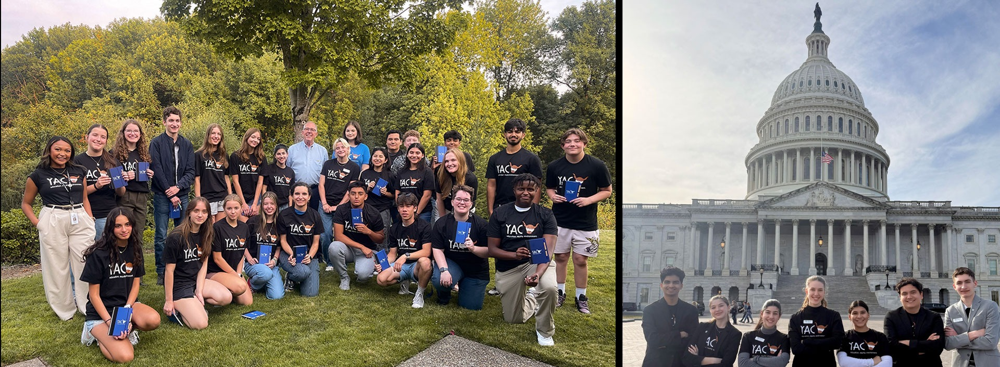](https://engage.hillsboro-oregon.gov/yac-2)    

## Join Hillsboro's Youth Advisory Council  

High school students connect with local government, learn leadership skills, and make a positive impact with the Youth Advisory Council! Apply by May 18.  

 [Apply](https://engage.hillsboro-oregon.gov/yac-2)  
 *  [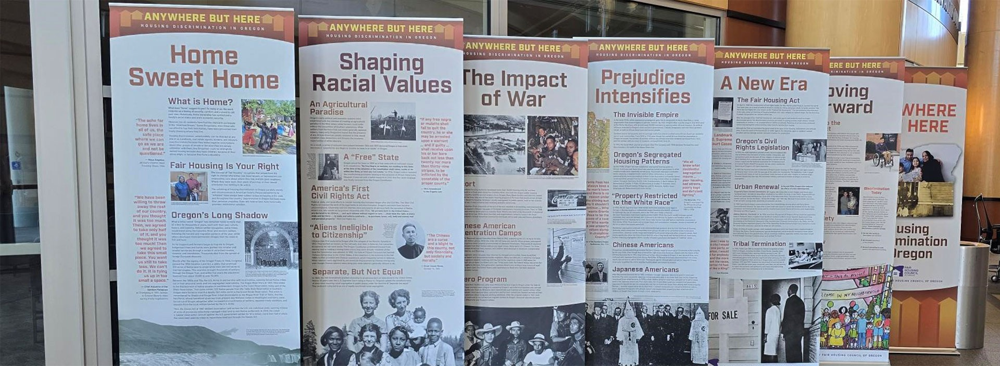](https://www.hillsboro-oregon.gov/Home/Components/News/News/15441/4300)    

## Anywhere but Here Exhibit  

Visit the Civic Center through April 30 to learn about Oregon's largely unknown history of housing discrimination, segregation, and displacement.  

 [Fair Housing Month](https://www.hillsboro-oregon.gov/Home/Components/News/News/15441/4300)  
 *  [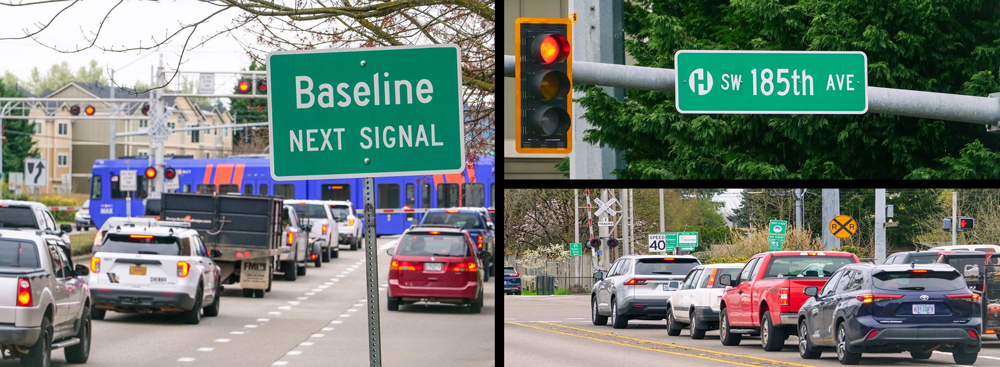](https://www.hillsboro-oregon.gov/Home/Components/News/News/16431/4300)    

## Help Reduce Traffic on SW 185th  

Take Metro's online survey to support investment in the Smart 185th Avenue ITS and Better Bus Project.  

 [Learn More](https://www.hillsboro-oregon.gov/Home/Components/News/News/16431/4300)  
 *  [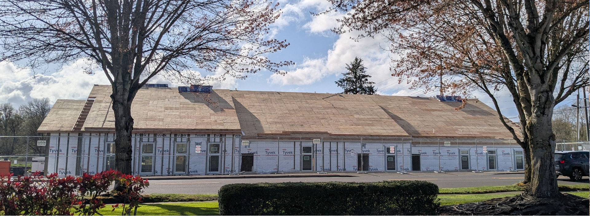](https://www.hillsboro-oregon.gov/Home/Components/News/News/16481/4300)    

## Year-Round Shelter Project Gains Momentum  

Construction of Hillsboro's future year-round shelter is advancing rapidly & operator selection is underway.  

 [Latest Updates](https://www.hillsboro-oregon.gov/Home/Components/News/News/16481/4300)  
 *      

## Celebrate Arab American Heritage Month  

Learn about Arab American scientists & activists who made a difference, try local restaurants, explore reading & resources, and more!  

 [Celebrate](https://www.hillsboro-oregon.gov/our-city/departments/parks-recreation/events/festivals-celebrations/arab-american-heritage-month)  

 1.  [1]() 
 1.  [2]() 
 1.  [3]() 
 1.  [4]() 
 1.  [5]() 

 *  [Previous](https://www.hillsboro-oregon.gov/) 
 *  [Next](https://www.hillsboro-oregon.gov/) 
  [Pause]()  

 *  [Diversity, Equity, & Inclusion](https://www.hillsboro-oregon.gov/our-city/diversity-equity-and-inclusion) 
 *  [Engage With Us](https://engage.hillsboro-oregon.gov/) 
 *  [Community Development](https://www.hillsboro-oregon.gov/our-city/departments/community-development) 
 *  [Committees & Boards](https://www.hillsboro-oregon.gov/our-city/commissions-committees-boards) 
 *  [Departments](https://www.hillsboro-oregon.gov/our-city/departments) 
 *  [Noticias en español](https://www.hillsboro-oregon.gov/our-city/about-us/creciendo-juntos/noticias) 
 *  [Pay Bills Online](https://www.hillsboro-oregon.gov/services/pay-bills-online) 
 *  [Utility Bill Assistance](https://www.hillsboro-oregon.gov/services/utility-assistance) 

 *  [News](https://www.hillsboro-oregon.gov/our-city/news-announcements) 
 *  [Events](https://www.hillsboro-oregon.gov/our-city/event-calendar) 
 *  [Online Bill Pay](https://www.hillsboro-oregon.gov/services/pay-bills-online) 
 *  [Departments](https://www.hillsboro-oregon.gov/our-city/departments) 
 *  [Diversity, Equity & Inclusion](https://www.hillsboro-oregon.gov/our-city/diversity-equity-and-inclusion) 
 *  [Utility Bill Assistance](https://www.hillsboro-oregon.gov/services/utility-assistance) 
 *  [Noticias en español](https://www.hillsboro-oregon.gov/our-city/about-us/creciendo-juntos/noticias) 
 *  [Engage with Us](https://engage.hillsboro-oregon.gov/) 
 *  [HiLight Internet Service](https://www.hillsboro-oregon.gov/services/hilight) 
 *  [Committees & Boards](https://www.hillsboro-oregon.gov/our-city/commissions-committees-boards) 
 *  [Community Development](https://www.hillsboro-oregon.gov/our-city/departments/community-development) 
 *  [Data & Demographics](https://www.hillsboro-oregon.gov/community/data-demographics) 
 *  [Public Notices](https://www.hillsboro-oregon.gov/our-city/news-announcements/public-notices) 
 *  [Newsletters](https://www.hillsboro-oregon.gov/our-city/news-announcements/city-views-newsletter) 
 *  [Contact Us](https://www.hillsboro-oregon.gov/services/contact-us) 
 * 
 * 
 * 
 * 
 * 
 * 
  [News and Announcements](https://www.hillsboro-oregon.gov/)  

## News & Announcements

  [Hillsboro is a Sanctuary City](https://www.hillsboro-oregon.gov/Home/Components/News/News/16282/4300)   [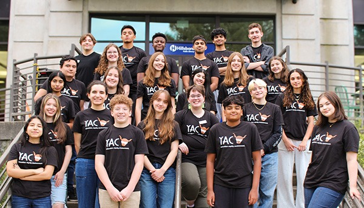Join Hillsboro's Youth Advisory Council! Apply by May 18](https://www.hillsboro-oregon.gov/Home/Components/News/News/16520/4300)   [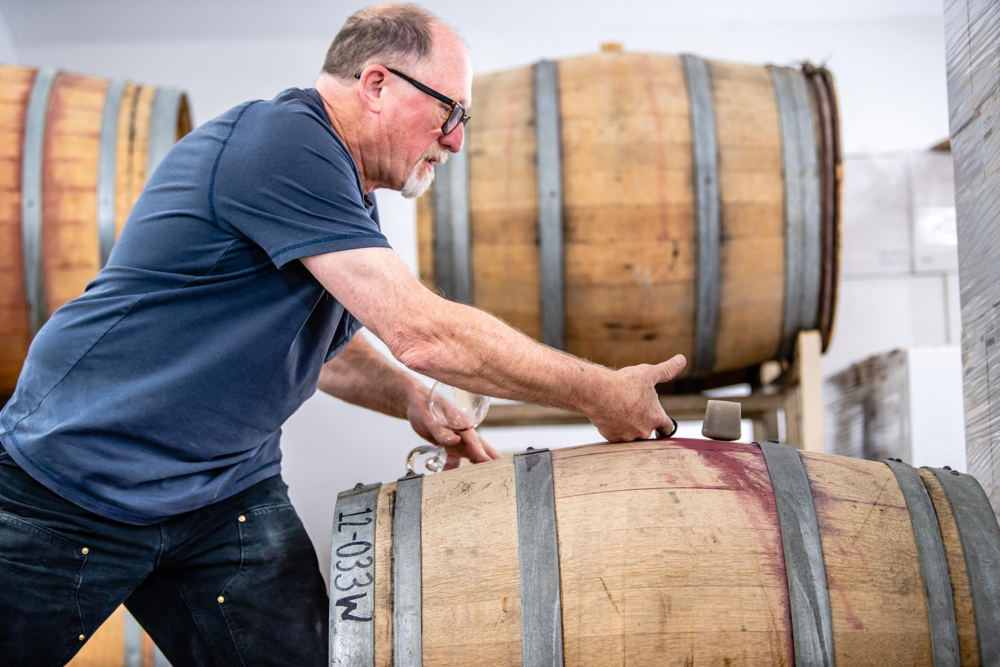Downtown Hillsboro Pours On the Charm for Oregon Wine Month](https://www.hillsboro-oregon.gov/Home/Components/News/News/14620/4300)   [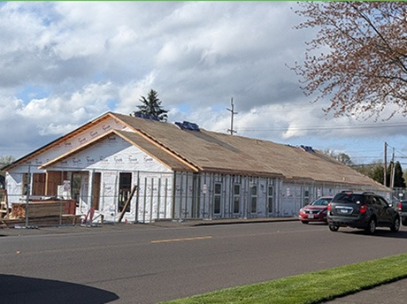Year-Round Shelter Project Gains Momentum](https://www.hillsboro-oregon.gov/Home/Components/News/News/16481/4300)   [Celebrate Día de los niños (Children’s Day) with Hillsboro Public Library](https://www.hillsboro-oregon.gov/Home/Components/News/News/16490/4300)   [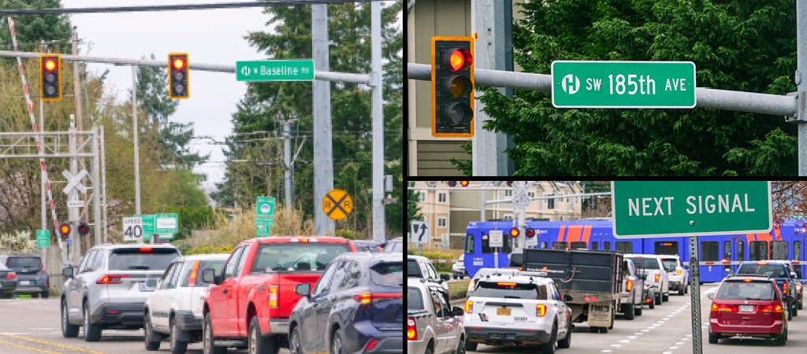Help Reduce Traffic Congestion in Hillsboro: Smart 185th Avenue Project](https://www.hillsboro-oregon.gov/Home/Components/News/News/16431/4300)   [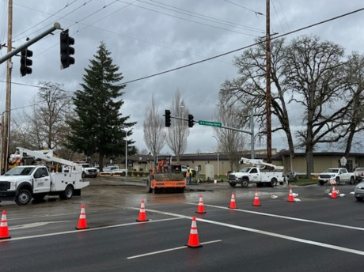Cornelius Pass Road & Frances Street Water Line Leak Repairs Underway](https://www.hillsboro-oregon.gov/Home/Components/News/News/16456/4300)   [Survey Results: HiLight Customers are Far More Satisfied than Peers](https://www.hillsboro-oregon.gov/Home/Components/News/News/16446/4300)   [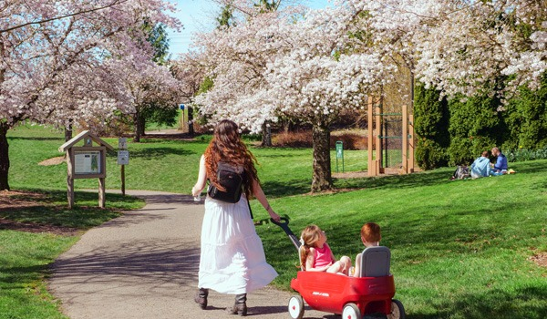Best Parks to See Cherry Blossoms in Hillsboro](https://www.hillsboro-oregon.gov/Home/Components/News/News/16435/4300)  PreviousNext  [All News](https://www.hillsboro-oregon.gov/our-city/news-announcements)  

 *  [Events](https://www.hillsboro-oregon.gov/) 
 *  [Meetings](https://www.hillsboro-oregon.gov/) 

## 

 *  [Wednesday April 16Exhibit - Anywhere but Here: The History of Housing Discrimination in Oregon  

All Day to until Apr, 30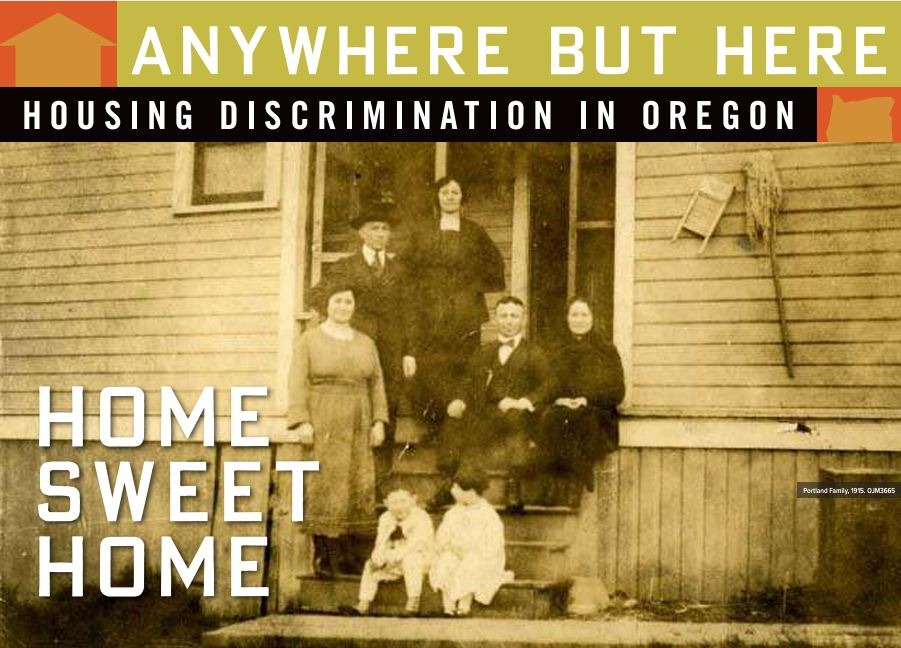](https://www.hillsboro-oregon.gov/Home/Components/Calendar/Event/129420/4855) 
 *  [Tuesday May 6Hillsboro Art Walk: First Tuesday  

5:00 pm to 8:00 pm](https://www.hillsboro-oregon.gov/Home/Components/Calendar/Event/134556/4855) 
 *  [Saturday May 10Shred Event  

8:00 am to 1:00 pm](https://www.hillsboro-oregon.gov/Home/Components/Calendar/Event/128860/4855) 
 *  [Tuesday May 13Free Food Market  

1:30 pm to 2:30 pm](https://www.hillsboro-oregon.gov/Home/Components/Calendar/Event/135341/4855) 
 *  [Friday May 23Salsa Night with Dina y Los Rumberos  

7:00 pm to 10:00 pm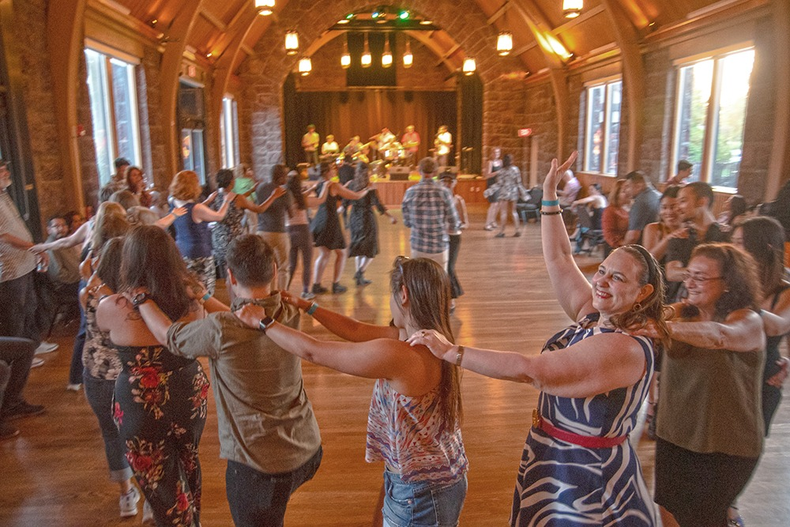](https://www.hillsboro-oregon.gov/Home/Components/Calendar/Event/130676/4855) 
 *  [Monday May 26Memorial Day: SHARC open 10 am to 4 pm; City offices, libraries, Hidden Creek, and other recreation centers closed  

All Day](https://www.hillsboro-oregon.gov/Home/Components/Calendar/Event/137040/4855) 
 [All Events](https://www.hillsboro-oregon.gov/our-city/event-calendar/event-calendar-featured)  

## 

 *  [Tuesday May 6City Council Meeting  

6:00 pm to 10:00 pm](https://www.hillsboro-oregon.gov/Home/Components/Calendar/Event/134803/4816) 
 *  [Tuesday May 13Finance Committee Meeting  

6:00 pm to 7:00 pm](https://www.hillsboro-oregon.gov/Home/Components/Calendar/Event/135149/4816) 
 *  [Wednesday May 14Budget Committee Meeting  

6:00 pm to 10:00 pm](https://www.hillsboro-oregon.gov/Home/Components/Calendar/Event/135371/4816) 
 *  [Thursday May 15Hillsboro Public Library Board Meeting  

6:00 pm to 8:00 pm](https://www.hillsboro-oregon.gov/Home/Components/Calendar/Event/135039/4816) 
 *  [Tuesday May 20City Council Meeting  

6:00 pm to 10:00 pm](https://www.hillsboro-oregon.gov/Home/Components/Calendar/Event/134802/4816) 
 *  [Wednesday May 21Historic Landmarks Advisory Committee  

6:30 pm to 7:30 pm](https://www.hillsboro-oregon.gov/Home/Components/Calendar/Event/135049/4816) 
 [All Meetings](https://www.hillsboro-oregon.gov/our-city/event-calendar)   [503-681-6100]()  [150 E. Main Street, Hillsboro, Oregon 97123](https://goo.gl/maps/dERZYRKYjkc78pudA)  [Contact Us](https://www.hillsboro-oregon.gov/services/contact-us)           

Website Design By [Granicus](https://www.granicus.com/) - Connecting People & Government

  [View Full Site]()    Close subscription dialog 

Be the First to Know What’s Happening in Hillsboro!

Choose from our email updates, including:

|* Happening in Hillsboro  * Homelessness Initiatives  * Library information|* Parks & Recreation news  * Fire & Rescue updates  * and more!|
|---|---|

 No Thanks Remind Me Later 

Thank you for subscribing. You will begin receiving updates shortly.

Continue

 Loading... 