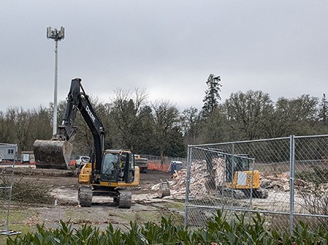
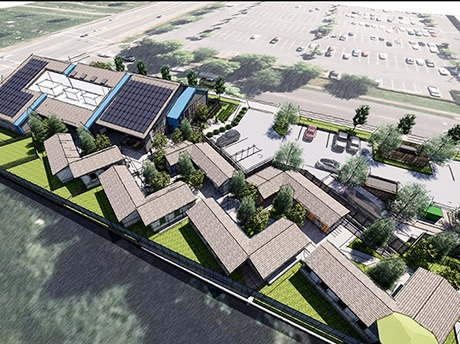
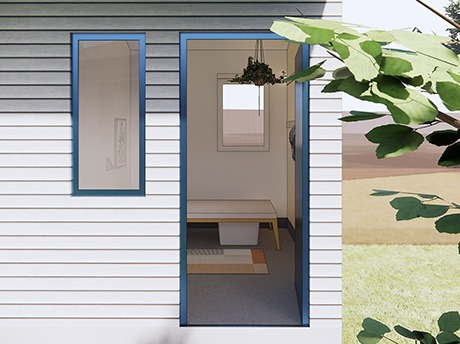
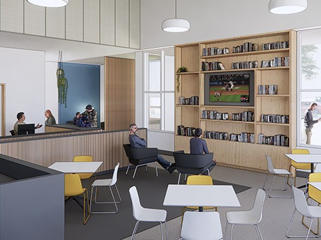
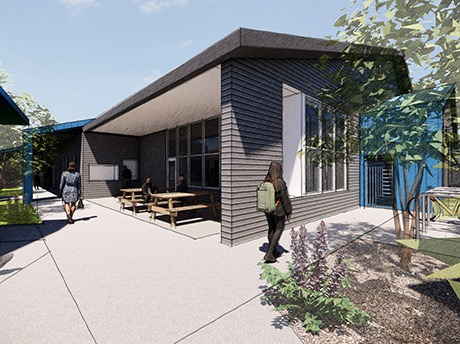

  [Skip to Main Content](https://www.hillsboro-oregon.gov/Home/Components/News/News/16274/4300/)  

# City of Hillsboro, OR

 [Home](https://www.hillsboro-oregon.gov/home)  [Menu]()   [How Do I …]()   [Close]() 

## 

### How Do I …

 Select a Category Apply For Attend Contact Engage With Find Learn About Pay Report Request Reserve Sign Up For Visit 

### Select a Category...

### 

 [Learn More](https://www.hillsboro-oregon.gov/Home/Components/News/News/16274/4300/)   [Go]()   [CLOSE](https://www.hillsboro-oregon.gov/Home/Components/News/News/16274/4300/) 

## Most Requested

 *  [HiLight Internet Service](https://www.hillsboro-oregon.gov/services/hilight) 
 *  [Hidden Creek Community Center](https://www.hillsboro-oregon.gov/our-city/departments/parks-recreation/facilities-rentals/hidden-creek) 
 *  [SHARC](https://www.hillsboro-oregon.gov/our-city/departments/parks-recreation/facilities-rentals/shute-park-aquatic-recreation-center) 
 *  [Library](https://www.hillsboro-oregon.gov/our-city/departments/library) 
 *  [Utility Bill Payment Options](https://www.hillsboro-oregon.gov/our-city/departments/finance/utility-billing/payment-options) 
 *  [Activities Guide](https://www.hillsboro-oregon.gov/our-city/departments/parks-recreation/classes-programs/activities-guide) 
 *  [Aquatics](https://www.hillsboro-oregon.gov/our-city/departments/parks-recreation/facilities-rentals/shute-park-aquatic-recreation-center/aquatics) 
 *  [Parks & Recreation](https://www.hillsboro-oregon.gov/our-city/departments/parks-recreation) 
  [Jobs](https://www.hillsboro-oregon.gov/our-city/departments/human-resources/join-our-team)  [Contact Us](https://www.hillsboro-oregon.gov/services/contact-us)  [Sign Up For Email Updates](https://public.govdelivery.com/accounts/ORHILLSBORO/subscriber/new?topic_id=ORHILLSBORO_16)  [Translate](https://translate.google.com/translate?js=y&prev=_t&hl=en&ie=UTF-8&layout=1&eotf=1&sl=en&tl=es&u=https://www.hillsboro-oregon.gov/Home/Components/News/News/16274/4300)   [How Do I …]()  

 *  [Home](https://www.hillsboro-oregon.gov/home) 
 *  [Community]()  
   *  [News & Announcements](https://www.hillsboro-oregon.gov/community/news-announcements) 
     *  [Noticias en español](https://www.hillsboro-oregon.gov/community/news-announcements/noticias-en-espa-ol) 
   *  [Events](https://www.hillsboro-oregon.gov/community/events) 
   *  [2035 Community Plan](https://www.hillsboro-oregon.gov/community/2035-community-plan) 
   *  [American Rescue Plan](https://www.hillsboro-oregon.gov/community/american-rescue-plan) 
   *  [Burning & Air Quality](https://www.hillsboro-oregon.gov/community/burning-air-quality) 
   *  [Community Partners](https://www.hillsboro-oregon.gov/community/community-partners) 
     *  [Hillsboro School District](https://www.hillsboro-oregon.gov/community/community-partners/hillsboro-school-district) 
     *  [Washington County](https://www.hillsboro-oregon.gov/community/community-partners/washington-county) 
     *  [Washington County Chamber of Commerce](https://www.hillsboro-oregon.gov/community/community-partners/washington-county-chamber-of-commerce) 
   *  [Community Resources](https://www.hillsboro-oregon.gov/community/community-resources) 
   *  [Community Spaces](https://www.hillsboro-oregon.gov/community/community-spaces) 
     *  [Meeting & Study Rooms](https://www.hillsboro-oregon.gov/community/community-spaces/meeting-study-rooms) 
     *  [Parks](https://www.hillsboro-oregon.gov/community/community-spaces/parks) 
     *  [Rentals](https://www.hillsboro-oregon.gov/community/community-spaces/rentals) 
   *  [Cultural Arts](https://www.hillsboro-oregon.gov/community/cultural-arts) 
     *  [Hillsboro Arts Month](https://www.hillsboro-oregon.gov/community/cultural-arts/hillsboro-arts-month) 
   *  [Data & Demographics](https://www.hillsboro-oregon.gov/community/data-demographics) 
   *  [Emergency Management](https://www.hillsboro-oregon.gov/community/emergency-management) 
   *  [Fire Safety & Education](https://www.hillsboro-oregon.gov/community/fire-safety-education) 
   *  [Garbage and Recycling](https://www.hillsboro-oregon.gov/community/garbage-and-recycling) 
   *  [Get Involved!](https://www.hillsboro-oregon.gov/community/get-involved) 
     *  [Engage Hillsboro](https://www.hillsboro-oregon.gov/community/get-involved/engage-hillsboro) 
     *  [Volunteer](https://www.hillsboro-oregon.gov/community/get-involved/volunteer) 
   *  [Getting Around](https://www.hillsboro-oregon.gov/community/getting-around) 
     *  [Bike Commuting Facility](https://www.hillsboro-oregon.gov/community/getting-around/bike-commuting-facility) 
   *  [History](https://www.hillsboro-oregon.gov/community/history) 
   *  [New to Hillsboro](https://www.hillsboro-oregon.gov/community/new-to-hillsboro) 
   *  [Programs & Events](https://www.hillsboro-oregon.gov/community/programs-events) 
   *  [Police Services](https://www.hillsboro-oregon.gov/community/police-services) 
   *  [Recreation & Fun](https://www.hillsboro-oregon.gov/community/recreation-fun) 
   *  [South Hillsboro](https://www.hillsboro-oregon.gov/community/south-hillsboro) 
   *  [Sustainability](https://www.hillsboro-oregon.gov/community/sustainability) 
     *  [Climate Change](https://www.hillsboro-oregon.gov/community/sustainability/climate-change) 
     *  [Home Energy Score](https://www.hillsboro-oregon.gov/community/sustainability/home-energy-score) 
   *  [Visit Hillsboro](https://www.hillsboro-oregon.gov/community/visit-hillsboro)  
 *  [Business]()  
   *  [Choose Hillsboro](https://www.hillsboro-oregon.gov/business/choose-hillsboro) 
     *  [Infrastructure & Utilities](https://www.hillsboro-oregon.gov/business/choose-hillsboro/infrastructure-utilities) 
     *  [Key Industries](https://www.hillsboro-oregon.gov/business/choose-hillsboro/key-industries-4288) 
     *  [Quality of Life](https://www.hillsboro-oregon.gov/business/choose-hillsboro/quality-of-life) 
     *  [Transportation](https://www.hillsboro-oregon.gov/business/choose-hillsboro/transportation) 
     *  [Taxes & Incentives](https://www.hillsboro-oregon.gov/business/choose-hillsboro/taxes-incentives) 
     *  [Workforce & Training](https://www.hillsboro-oregon.gov/business/choose-hillsboro/workforce-training) 
   *  [American Rescue Plan](https://www.hillsboro-oregon.gov/business/american-rescue-plan) 
   *  [Bids & RFPs](https://www.hillsboro-oregon.gov/business/bids-rfps) 
   *  [Business Licenses](https://www.hillsboro-oregon.gov/business/business-licenses) 
   *  [Business News](https://www.hillsboro-oregon.gov/business/business-news) 
   *  [Code & Charter](https://www.hillsboro-oregon.gov/business/code-charter) 
   *  [Data & Demographics](https://www.hillsboro-oregon.gov/business/data-demographics) 
   *  [Development Areas](https://www.hillsboro-oregon.gov/business/development-areas) 
   *  [Garbage and Recycling](https://www.hillsboro-oregon.gov/business/garbage-and-recycling) 
   *  [Supplier Diversity](https://www.hillsboro-oregon.gov/business/supplier-diversity) 
     *  [Minority & Women Business Directory](https://www.hillsboro-oregon.gov/business/supplier-diversity/minority-women-owned-businesses) 
   *  [Small Business Support](https://www.hillsboro-oregon.gov/business/small-business-support) 
     *  [Support for Entrepreneurs](https://www.hillsboro-oregon.gov/business/small-business-support/support-for-entrepreneurs) 
   *  [HiLight Internet](https://www.hillsboro-oregon.gov/business/hilight-internet)  
 *  [Our City]()  
   *  [About Us](https://www.hillsboro-oregon.gov/our-city/about-us) 
   *  [American Rescue Plan](https://www.hillsboro-oregon.gov/our-city/american-rescue-plan) 
   *  [City Council](https://www.hillsboro-oregon.gov/our-city/city-council) 
     *  [Council Meetings](https://www.hillsboro-oregon.gov/our-city/city-council/council-meetings) 
     *  [Council Priorities](https://www.hillsboro-oregon.gov/our-city/city-council/council-priorities) 
     *  [Council Wards](https://www.hillsboro-oregon.gov/our-city/city-council/council-wards) 
   *  [City Recorder's Office](https://www.hillsboro-oregon.gov/our-city/city-recorder-s-office) 
   *  [City Code & Charter](https://www.hillsboro-oregon.gov/our-city/city-code-charter) 
   *  [Commissions, Committees & Boards](https://www.hillsboro-oregon.gov/our-city/commissions-committees-boards) 
     *  [Agendas & Minutes](https://www.hillsboro-oregon.gov/our-city/commissions-committees-boards/agendas-minutes) 
     *  [Civic Leadership Academy](https://www.hillsboro-oregon.gov/our-city/commissions-committees-boards/civic-leadership-academy) 
     *  [Youth Advisory Council](https://www.hillsboro-oregon.gov/our-city/commissions-committees-boards/youth-advisory-council) 
   *  [Contact Us](https://www.hillsboro-oregon.gov/our-city/contact-us) 
   *  [Departments](https://www.hillsboro-oregon.gov/our-city/departments) 
     *  [City Manager's Office](https://www.hillsboro-oregon.gov/our-city/departments/city-manager-s-office) 
     *  [Community Development](https://www.hillsboro-oregon.gov/our-city/departments/community-development) 
     *  [Economic Development](https://www.hillsboro-oregon.gov/our-city/departments/economic-development) 
     *  [Finance](https://www.hillsboro-oregon.gov/our-city/departments/finance) 
     *  [Fire](https://www.hillsboro-oregon.gov/our-city/departments/fire) 
       *  [Join Our Team](https://www.hillsboro-oregon.gov/our-city/departments/fire/join-our-team) 
     *  [Human Resources](https://www.hillsboro-oregon.gov/our-city/departments/human-resources) 
       *  [Join Our Team](https://www.hillsboro-oregon.gov/our-city/departments/human-resources/join-our-team) 
       *  [Employee Portal](https://www.hillsboro-oregon.gov/our-city/departments/human-resources/employee-portal) 
     *  [Library](https://www.hillsboro-oregon.gov/our-city/departments/library) 
     *  [Parks & Recreation](https://www.hillsboro-oregon.gov/our-city/departments/parks-recreation) 
     *  [Police](https://www.hillsboro-oregon.gov/our-city/departments/police) 
       *  [Join Our Team](https://www.hillsboro-oregon.gov/our-city/departments/police/join-our-team) 
     *  [Public Works](https://www.hillsboro-oregon.gov/our-city/departments/public-works) 
     *  [Water](https://www.hillsboro-oregon.gov/our-city/departments/water) 
   *  [Diversity, Equity, and Inclusion](https://www.hillsboro-oregon.gov/our-city/diversity-equity-and-inclusion) 
     *  [Arab American Heritage Month](https://www.hillsboro-oregon.gov/our-city/diversity-equity-and-inclusion/arab-american-heritage-month) 
   *  [Event Calendar](https://www.hillsboro-oregon.gov/our-city/event-calendar) 
   *  [Fees & Charges](https://www.hillsboro-oregon.gov/our-city/fees-charges) 
   *  [Get Involved!](https://www.hillsboro-oregon.gov/our-city/get-involved) 
     *  [Engage Hillsboro](https://www.hillsboro-oregon.gov/our-city/get-involved/engage-hillsboro) 
   *  [Hillsboro Major Projects](https://www.hillsboro-oregon.gov/our-city/hillsboro-major-projects) 
     *  [Emerald Ash Borer](https://www.hillsboro-oregon.gov/our-city/hillsboro-major-projects/emerald-ash-borer) 
     *  [Housing Needs Analysis](https://www.hillsboro-oregon.gov/our-city/hillsboro-major-projects/housing-needs-analysis) 
     *  [Hillsboro Hops Ballpark Project](https://www.hillsboro-oregon.gov/our-city/hillsboro-major-projects/hillsboro-hops-ballpark-project) 
     *  [Oak/Baseline/10th Avenue Corridor Study](https://www.hillsboro-oregon.gov/our-city/hillsboro-major-projects/oak-baseline-10th-avenue-corridor-study) 
   *  [Strategic Plan](https://www.hillsboro-oregon.gov/our-city/strategic-plan) 
   *  [News & Announcements](https://www.hillsboro-oregon.gov/our-city/news-announcements) 
     *  [Guides](https://www.hillsboro-oregon.gov/our-city/news-announcements/guides) 
     *  [Newsletters](https://www.hillsboro-oregon.gov/our-city/news-announcements/newsletters) 
     *  [Social Media Feeds & Videos](https://www.hillsboro-oregon.gov/our-city/news-announcements/social-media-feeds-videos) 
     *  [Public Notices](https://www.hillsboro-oregon.gov/our-city/news-announcements/public-notices) 
   *  [Volunteer Opportunities](https://www.hillsboro-oregon.gov/our-city/volunteer-opportunities) 
   *  [Website Terms Of Use, Notices, And Disclaimer](https://www.hillsboro-oregon.gov/our-city/website-terms-of-use-notices-and-disclaimer) 
   *  [Website Privacy Policy](https://www.hillsboro-oregon.gov/our-city/website-privacy-policy) 
     *  [Credit Card Processing, Refund and Security Policy](https://www.hillsboro-oregon.gov/our-city/website-privacy-policy/credit-card-processing-refund-and-security-policy) 
   *  [Site Map](https://www.hillsboro-oregon.gov/our-city/site-map)  
 *  [Services]()  
   *  [Americans With Disabilities Act](https://www.hillsboro-oregon.gov/services/americans-with-disabilities-act) 
   *  [Bids & RFPs](https://www.hillsboro-oregon.gov/services/bids-rfps) 
   *  [Budget](https://www.hillsboro-oregon.gov/services/budget) 
   *  [Business Licenses](https://www.hillsboro-oregon.gov/services/business-licenses) 
   *  [Business Resources](https://www.hillsboro-oregon.gov/services/business-resources) 
   *  [Citywide Fees and Charges Schedule](https://www.hillsboro-oregon.gov/services/citywide-fees-and-charges-schedule) 
   *  [Community Information](https://www.hillsboro-oregon.gov/services/community-information) 
   *  [Community Resources](https://www.hillsboro-oregon.gov/services/community-resources) 
   *  [Community Support](https://www.hillsboro-oregon.gov/services/community-support) 
     *  [Affordable Housing](https://www.hillsboro-oregon.gov/services/community-support/affordable-housing) 
     *  [Homelessness Initiatives](https://www.hillsboro-oregon.gov/services/community-support/homelessness-initiatives) 
     *  [Emergency Shelter Siting](https://www.hillsboro-oregon.gov/services/community-support/emergency-shelter-siting) 
     *  [Grants](https://www.hillsboro-oregon.gov/services/community-support/grants) 
   *  [Community Planning](https://www.hillsboro-oregon.gov/services/community-planning) 
   *  [Contact Us](https://www.hillsboro-oregon.gov/services/contact-us) 
   *  [Data Privacy](https://www.hillsboro-oregon.gov/services/data-privacy) 
   *  [Development Services](https://www.hillsboro-oregon.gov/services/development-services) 
   *  [Economic Development](https://www.hillsboro-oregon.gov/services/economic-development) 
   *  [Engagement Projects](https://www.hillsboro-oregon.gov/services/engagement-projects) 
   *  [Employment](https://www.hillsboro-oregon.gov/services/employment) 
   *  [Emergency Management](https://www.hillsboro-oregon.gov/services/emergency-management) 
     *  [Prepare Now!](https://www.hillsboro-oregon.gov/services/emergency-management/prepare-now) 
     *  [Community Wildfire Protection Plan](https://www.hillsboro-oregon.gov/services/emergency-management/community-wildfire-protection-plan) 
   *  [Cooling Resources](https://www.hillsboro-oregon.gov/services/cooling-resources) 
   *  [Fire Safety & Education](https://www.hillsboro-oregon.gov/services/fire-safety-education) 
   *  [Garbage and Recycling](https://www.hillsboro-oregon.gov/services/garbage-and-recycling) 
   *  [Generation Hillsboro](https://www.hillsboro-oregon.gov/services/generation-hillsboro) 
   *  [HiLight](https://www.hillsboro-oregon.gov/services/hilight) 
     *  [Rates and Services](https://www.hillsboro-oregon.gov/services/hilight/rates-and-services) 
     *  [Customer Support](https://www.hillsboro-oregon.gov/services/hilight/customer-support) 
   *  [Hillsboro Obituary Finder](https://www.hillsboro-oregon.gov/services/hillsboro-obituary-finder) 
   *  [Leaf Pickup](https://www.hillsboro-oregon.gov/services/leaf-pickup) 
   *  [Library Checkouts](https://www.hillsboro-oregon.gov/services/library-checkouts) 
   *  [Memberships](https://www.hillsboro-oregon.gov/services/memberships) 
   *  [Mediation Program](https://www.hillsboro-oregon.gov/services/mediation-program) 
   *  [Municipal Court Citation Information](https://www.hillsboro-oregon.gov/services/municipal-court-citation-information) 
   *  [Maps](https://www.hillsboro-oregon.gov/services/maps) 
     *  [Address Check](https://www.hillsboro-oregon.gov/services/maps/address-check) 
     *  [Construction Projects](https://www.hillsboro-oregon.gov/services/maps/construction-projects) 
     *  [Council Wards](https://www.hillsboro-oregon.gov/services/maps/council-wards) 
     *  [Cultural Resource Inventory](https://www.hillsboro-oregon.gov/services/maps/cultural-resource-inventory) 
     *  [Facilities Map](https://www.hillsboro-oregon.gov/services/maps/facilities-map) 
     *  [Facilities and Parks Status Map](https://www.hillsboro-oregon.gov/services/maps/facilities-and-parks-status-map) 
     *  [HiLight Availability](https://www.hillsboro-oregon.gov/services/maps/hilight-availability) 
     *  [Hillsboro Base Map](https://www.hillsboro-oregon.gov/services/maps/hillsboro-base-map) 
     *  [Hillsboro Maps](https://www.hillsboro-oregon.gov/services/maps/hillsboro-maps) 
     *  [Hillsboro Small Business Support](https://www.hillsboro-oregon.gov/services/maps/hillsboro-small-business-support) 
     *  [Parks Map](https://www.hillsboro-oregon.gov/services/maps/parks-map) 
     *  [Public Camping](https://www.hillsboro-oregon.gov/services/maps/camping) 
     *  [Semiconductor Cluster](https://www.hillsboro-oregon.gov/services/maps/semiconductor-cluster) 
     *  [Transportation Safety Action Plan](https://www.hillsboro-oregon.gov/services/maps/transportation-safety-action-plan) 
     *  [Water Service Line Inventory](https://www.hillsboro-oregon.gov/services/maps/water-service-line-inventory) 
   *  [Natural Resources](https://www.hillsboro-oregon.gov/services/natural-resources) 
   *  [Recreation & Fun](https://www.hillsboro-oregon.gov/services/recreation-fun) 
     *  [Walters Cultural Art Center](https://www.hillsboro-oregon.gov/services/recreation-fun/walters-cultural-art-center) 
   *  [Pay Bills Online](https://www.hillsboro-oregon.gov/services/pay-bills-online) 
   *  [Permitting Center](https://www.hillsboro-oregon.gov/services/permitting-center) 
   *  [Public Safety](https://www.hillsboro-oregon.gov/services/public-safety) 
   *  [Public Works, Sewer & Streets](https://www.hillsboro-oregon.gov/services/public-works-sewer-streets) 
   *  [Road Updates](https://www.hillsboro-oregon.gov/services/road-updates) 
   *  [Strategic Plan Data](https://www.hillsboro-oregon.gov/services/strategic-plan-data) 
   *  [Transportation](https://www.hillsboro-oregon.gov/services/transportation) 
   *  [Utility Billing](https://www.hillsboro-oregon.gov/services/utility-billing) 
     *  [Start or Stop Service](https://www.hillsboro-oregon.gov/services/utility-billing/start-or-stop-service) 
     *  [Payment Options](https://www.hillsboro-oregon.gov/services/utility-billing/payment-options) 
     *  [Utility Rate Adjustments](https://www.hillsboro-oregon.gov/services/utility-billing/utility-rate-adjustments) 
   *  [Utility Assistance](https://www.hillsboro-oregon.gov/services/utility-assistance) 
   *  [Video Library - YouTube](https://www.hillsboro-oregon.gov/services/video-library-youtube) 
   *  [Volunteer Opportunities](https://www.hillsboro-oregon.gov/services/volunteer-opportunities) 
   *  [Weather Resources](https://www.hillsboro-oregon.gov/services/weather-resources)  
   

 [Our City](https://www.hillsboro-oregon.gov/our-city) 

#  News & Announcements 

  [Print]()  [Feedback]()   [Font Size:]()  [+]()  [-]()  

## Year-Round Shelter Construction is Now Underway

 Post Date: 01/16/2025 

 [Lea este artículo en español](https://www.hillsboro-oregon.gov/Home/Components/News/News/16276/3561).

  

Construction activity is underway on [SW 17th Avenue near Winco & Dairy Creek Park](https://www.google.com/maps/place/311+SW+17th+Ave,+Hillsboro,+OR+97123/@45.5191423,-123.0071901,17z/data=!4m5!3m4!1s0x54951a91bd6fccb5:0x13247a1675748a07!8m2!3d45.5194929!4d-123.0080719) as the City of Hillsboro and Washington County work to create Hillsboro’s first permanent [year-round shelter](https://engage.hillsboro-oregon.gov/yearroundshelter) for adults experiencing homelessness. 

Since construction began on January 6, two vacant buildings on the property that were unsuitable for reuse have been demolished and temporary fencing is complete.

Elected officials and City & County leaders will celebrate the groundbreaking in early March. 

  

The future shelter will meet critical community needs by offering __safe sleeping spaces, meals, wrap-around support, and housing assessments__ to connect guests with pathways to long-term housing support.

  

Planned amenities & services include:

  

 * Safe sleeping spaces for up to __75 guests__ :  

   *  __35 indoor sleeping areas__ in a congregate setting    

   *  __40 individual shelter pods__     

 * Culturally-responsive & trauma-informed support through __24/7 onsite staff__   

 * Onsite __mental, behavioral, and physical health services__   

 *  __Centralized location__ with access to public transportation, employment opportunities, food, medical care, and nearby support services  

 * A warming kitchen, communal dining area, and __computer access__   

 * Bathrooms, showers, __laundry, and storage__ for personal belongings  

 *  __Outdoor seating, recreation, and pet areas__ 

Once open, the shelter will be operated by a service provider and funded through Washington County's allocation of the [Supportive Housing Services Measure](https://www.oregonmetro.gov/public-projects/supportive-housing-services). 

### Engaging Our Community 

  

Plans for the shelter's design, architecture, and amenities have been informed by community engagement through [stakeholder focus groups and a community-wide survey](https://engage.hillsboro-oregon.gov/yearroundshelter/news_feed/spring-2024-feedback-report). See the  [July 2024 artist renderings](https://www.hillsboro-oregon.gov/home/showpublisheddocument/30969/638568213172270000)  to explore the design.

Community input will continue to shape: 

 * Operator selection & qualifications  

 * Elements of the shelter's [Neighborhood Plan](https://www.washingtoncountyor.gov/housing/homeless-services-division/neighborhood-plans) 

We're also inviting community members to [ask us a question](https://engage.hillsboro-oregon.gov/yearroundshelter?tool=qanda) and sharing those questions and our responses on [Engage Hillsboro](https://engage.hillsboro-oregon.gov/yearroundshelter).

### The Safe Rest Pods — Now Closed — Served 190+ Community Members

  

The temporary [Safe Rest Pods on SW 17th Avenue](https://www.hillsboro-oregon.gov/services/community-support/homelessness-initiatives/shelters) provided emergency shelter at the project site while year-round shelter development moved forward.

During two rounds of operation, the Safe Rest Pods: 

 * Provided __emergency shelter for 196 community members__   

 *  __Connected 178 guests to housing assessments__ 

The Pods closed at the end of October to clear the property for construction. Washington County is storing the portable shelters while exploring opportunities for future locations.

### Next Steps

  

 * The City of Hillsboro & Washington County will open a Request for Proposals for a shelter operator in the coming weeks.  

 * Operator selection is expected to conclude by late spring.  

 *  [Neighborhood Plan](https://www.washingtoncountyor.gov/housing/homeless-services-division/neighborhood-plans) community engagement is planned for next summer.

The shelter is expected to welcome its first guests in winter 2025-26 following a community open house.

 *Photos, from top to bottom, include: construction activity at future year-round shelter site, artist rendering of aerial view of future shelter, artist rendering of an individual shelter pod, artist rendering of indoor sleeping areas,  *artist rendering of community room, * former Safe Rest Pods on SW 17th Avenue, artist rendering of outdoor dining and gathering area. * 

***

### Stay Informed

 [Visit Engage Hillsboro](https://engage.hillsboro-oregon.gov/yearroundshelter) to see the full project timeline, learn more about the plans, or ask us a question.

 [Get monthly email updates](https://public.govdelivery.com/accounts/ORHILLSBORO/subscriber/new?topic_id=ORHILLSBORO_17) on the City's homelessness initiatives. 

### Learn More

 *  [Safe Rest Pods on SW 17th Avenue](https://www.hillsboro-oregon.gov/services/community-support/homelessness-initiatives/shelters) 
 *  [Hillsboro’s Homelessness Initiatives](https://www.hillsboro-oregon.gov/services/community-support/homelessness-initiatives) 
 *  [Washington County Neighborhood Plans](https://www.washingtoncountyor.gov/housing/homeless-services-division/neighborhood-plans) 
 *  [Washington County Emergency Shelters](https://www.washingtoncountyor.gov/housing/shelters) 
 *  [Washington County Day Centers & Homeless Resources](https://www.washingtoncountyor.gov/housing/efforts-end-homelessness/day-centers-homeless-resources) 
  [Return to full list >>](https://www.hillsboro-oregon.gov/our-city/news-announcements)  

## Quicklinks

 *  [City Views](https://www.hillsboro-oregon.gov/our-city/news-announcements/city-views-newsletter) 
 *  [Sign Up for Email Updates](https://www.hillsboro-oregon.gov/our-city/news-announcements/happening-in-hillsboro-e-updates) 
 *  [Newsletters](https://www.hillsboro-oregon.gov/our-city/news-announcements/newsletters) 
 *  [Public Notices](https://www.hillsboro-oregon.gov/our-city/news-announcements/public-notices) 
 *  [Social Media](https://www.hillsboro-oregon.gov/our-city/news-announcements/social-media-feeds-videos) 

Free viewers are required for some of the attached documents.

They can be downloaded by clicking on the icons below.

 [Acrobat Reader](http://get.adobe.com/reader/)  [Windows Media Player](http://windows.microsoft.com/en-us/windows/windows-media-player)   [Word Viewer](https://products.office.com/en-US/office-online/documents-spreadsheets-presentations-office-online)  [Excel Viewer](https://products.office.com/en-US/office-online/documents-spreadsheets-presentations-office-online)  [PowerPoint Viewer](https://products.office.com/en-US/office-online/documents-spreadsheets-presentations-office-online)   [search]()  [settings]()  

 1. Search separators:
 1. Search field name:(All)News Title

## Featured Stories

## Contact Us

 __Monday through Friday__ 

8 am to 5 pm

 __Phone:__ 

503-681-6100

 __Email:__ 

 [Email the City Manager's Office](https://www.hillsboro-oregon.gov/our-city/departments/city-manager-s-office/contact-us/cmo-contact-form) 

 [Media Inquiries](https://www.hillsboro-oregon.gov/services/contact-us/media-inquiries) 

 __Address:__ 

City of Hillsboro Civic Center

 [150 E. Main Street](https://goo.gl/maps/nSuQTw5YKrRErs8N9) 

Hillsboro, Oregon 97123

## Subscribe to the City of Hillsboro's email updates!

 [Choose the topics you want:](https://public.govdelivery.com/accounts/ORHILLSBORO/subscriber/new) 

 * Happening in Hillsboro (community events & news)
 * Homelessness Initiatives
 * Police info
 * Parks & Recreation news
 * Fire & Rescue updates
 * Library info
 * Hillsboro 2035 updates
 * Creciendo Juntos — Noticias en español

  [503-681-6100]()  [150 E. Main Street, Hillsboro, Oregon 97123](https://goo.gl/maps/dERZYRKYjkc78pudA)  [Contact Us](https://www.hillsboro-oregon.gov/services/contact-us)           

Website Design By [Granicus](https://www.granicus.com/) - Connecting People & Government

  [View Full Site]()    Close subscription dialog 

Be the First to Know What’s Happening in Hillsboro!

Choose from our email updates, including:

|* Happening in Hillsboro  * Homelessness Initiatives  * Library information|* Parks & Recreation news  * Fire & Rescue updates  * and more!|
|---|---|

 No Thanks Remind Me Later 

Thank you for subscribing. You will begin receiving updates shortly.

Continue

 Loading... 