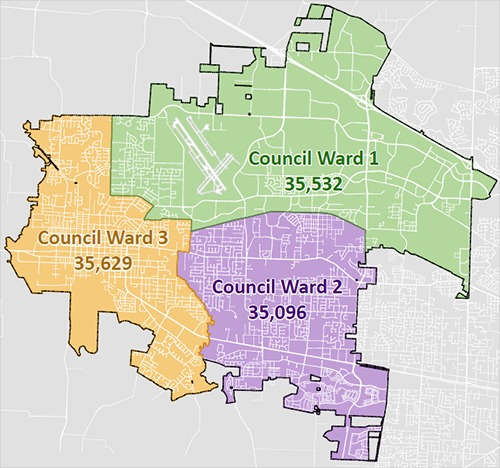

  [Skip to Main Content](https://www.hillsboro-oregon.gov/our-city/city-council/council-wards/)  

# City of Hillsboro, OR

 [Home](https://www.hillsboro-oregon.gov/home)  [Menu]()   [How Do I …]()   [Close]() 

## 

### How Do I …

 Select a Category Apply For Attend Contact Engage With Find Learn About Pay Report Request Reserve Sign Up For Visit 

### Select a Category...

### 

 [Learn More](https://www.hillsboro-oregon.gov/our-city/city-council/council-wards/)   [Go]()   [CLOSE](https://www.hillsboro-oregon.gov/our-city/city-council/council-wards/) 

## Most Requested

 *  [HiLight Internet Service](https://www.hillsboro-oregon.gov/services/hilight) 
 *  [Hidden Creek Community Center](https://www.hillsboro-oregon.gov/our-city/departments/parks-recreation/facilities-rentals/hidden-creek) 
 *  [SHARC](https://www.hillsboro-oregon.gov/our-city/departments/parks-recreation/facilities-rentals/shute-park-aquatic-recreation-center) 
 *  [Library](https://www.hillsboro-oregon.gov/our-city/departments/library) 
 *  [Utility Bill Payment Options](https://www.hillsboro-oregon.gov/our-city/departments/finance/utility-billing/payment-options) 
 *  [Activities Guide](https://www.hillsboro-oregon.gov/our-city/departments/parks-recreation/classes-programs/activities-guide) 
 *  [Aquatics](https://www.hillsboro-oregon.gov/our-city/departments/parks-recreation/facilities-rentals/shute-park-aquatic-recreation-center/aquatics) 
 *  [Parks & Recreation](https://www.hillsboro-oregon.gov/our-city/departments/parks-recreation) 
  [Jobs](https://www.hillsboro-oregon.gov/our-city/departments/human-resources/join-our-team)  [Contact Us](https://www.hillsboro-oregon.gov/services/contact-us)  [Sign Up For Email Updates](https://public.govdelivery.com/accounts/ORHILLSBORO/subscriber/new?topic_id=ORHILLSBORO_16)  [Translate](https://translate.google.com/translate?js=y&prev=_t&hl=en&ie=UTF-8&layout=1&eotf=1&sl=en&tl=es&u=https://www.hillsboro-oregon.gov/our-city/departments/city-manager-s-office/hillsboro-101/council-wards-redistricting)   [How Do I …]()  

 *  [Home](https://www.hillsboro-oregon.gov/home) 
 *  [Community]()  
   *  [News & Announcements](https://www.hillsboro-oregon.gov/community/news-announcements) 
     *  [Noticias en español](https://www.hillsboro-oregon.gov/community/news-announcements/noticias-en-espa-ol) 
   *  [Events](https://www.hillsboro-oregon.gov/community/events) 
   *  [2035 Community Plan](https://www.hillsboro-oregon.gov/community/2035-community-plan) 
   *  [American Rescue Plan](https://www.hillsboro-oregon.gov/community/american-rescue-plan) 
   *  [Burning & Air Quality](https://www.hillsboro-oregon.gov/community/burning-air-quality) 
   *  [Community Partners](https://www.hillsboro-oregon.gov/community/community-partners) 
     *  [Hillsboro School District](https://www.hillsboro-oregon.gov/community/community-partners/hillsboro-school-district) 
     *  [Washington County](https://www.hillsboro-oregon.gov/community/community-partners/washington-county) 
     *  [Washington County Chamber of Commerce](https://www.hillsboro-oregon.gov/community/community-partners/washington-county-chamber-of-commerce) 
   *  [Community Resources](https://www.hillsboro-oregon.gov/community/community-resources) 
   *  [Community Spaces](https://www.hillsboro-oregon.gov/community/community-spaces) 
     *  [Meeting & Study Rooms](https://www.hillsboro-oregon.gov/community/community-spaces/meeting-study-rooms) 
     *  [Parks](https://www.hillsboro-oregon.gov/community/community-spaces/parks) 
     *  [Rentals](https://www.hillsboro-oregon.gov/community/community-spaces/rentals) 
   *  [Cultural Arts](https://www.hillsboro-oregon.gov/community/cultural-arts) 
     *  [Hillsboro Arts Month](https://www.hillsboro-oregon.gov/community/cultural-arts/hillsboro-arts-month) 
   *  [Data & Demographics](https://www.hillsboro-oregon.gov/community/data-demographics) 
   *  [Emergency Management](https://www.hillsboro-oregon.gov/community/emergency-management) 
   *  [Fire Safety & Education](https://www.hillsboro-oregon.gov/community/fire-safety-education) 
   *  [Garbage and Recycling](https://www.hillsboro-oregon.gov/community/garbage-and-recycling) 
   *  [Get Involved!](https://www.hillsboro-oregon.gov/community/get-involved) 
     *  [Engage Hillsboro](https://www.hillsboro-oregon.gov/community/get-involved/engage-hillsboro) 
     *  [Volunteer](https://www.hillsboro-oregon.gov/community/get-involved/volunteer) 
   *  [Getting Around](https://www.hillsboro-oregon.gov/community/getting-around) 
     *  [Bike Commuting Facility](https://www.hillsboro-oregon.gov/community/getting-around/bike-commuting-facility) 
   *  [History](https://www.hillsboro-oregon.gov/community/history) 
   *  [New to Hillsboro](https://www.hillsboro-oregon.gov/community/new-to-hillsboro) 
   *  [Programs & Events](https://www.hillsboro-oregon.gov/community/programs-events) 
   *  [Police Services](https://www.hillsboro-oregon.gov/community/police-services) 
   *  [Recreation & Fun](https://www.hillsboro-oregon.gov/community/recreation-fun) 
   *  [South Hillsboro](https://www.hillsboro-oregon.gov/community/south-hillsboro) 
   *  [Sustainability](https://www.hillsboro-oregon.gov/community/sustainability) 
     *  [Climate Change](https://www.hillsboro-oregon.gov/community/sustainability/climate-change) 
     *  [Home Energy Score](https://www.hillsboro-oregon.gov/community/sustainability/home-energy-score) 
   *  [Visit Hillsboro](https://www.hillsboro-oregon.gov/community/visit-hillsboro)  
 *  [Business]()  
   *  [Choose Hillsboro](https://www.hillsboro-oregon.gov/business/choose-hillsboro) 
     *  [Infrastructure & Utilities](https://www.hillsboro-oregon.gov/business/choose-hillsboro/infrastructure-utilities) 
     *  [Key Industries](https://www.hillsboro-oregon.gov/business/choose-hillsboro/key-industries-4288) 
     *  [Quality of Life](https://www.hillsboro-oregon.gov/business/choose-hillsboro/quality-of-life) 
     *  [Transportation](https://www.hillsboro-oregon.gov/business/choose-hillsboro/transportation) 
     *  [Taxes & Incentives](https://www.hillsboro-oregon.gov/business/choose-hillsboro/taxes-incentives) 
     *  [Workforce & Training](https://www.hillsboro-oregon.gov/business/choose-hillsboro/workforce-training) 
   *  [American Rescue Plan](https://www.hillsboro-oregon.gov/business/american-rescue-plan) 
   *  [Bids & RFPs](https://www.hillsboro-oregon.gov/business/bids-rfps) 
   *  [Business Licenses](https://www.hillsboro-oregon.gov/business/business-licenses) 
   *  [Business News](https://www.hillsboro-oregon.gov/business/business-news) 
   *  [Code & Charter](https://www.hillsboro-oregon.gov/business/code-charter) 
   *  [Data & Demographics](https://www.hillsboro-oregon.gov/business/data-demographics) 
   *  [Development Areas](https://www.hillsboro-oregon.gov/business/development-areas) 
   *  [Garbage and Recycling](https://www.hillsboro-oregon.gov/business/garbage-and-recycling) 
   *  [Supplier Diversity](https://www.hillsboro-oregon.gov/business/supplier-diversity) 
     *  [Minority & Women Business Directory](https://www.hillsboro-oregon.gov/business/supplier-diversity/minority-women-owned-businesses) 
   *  [Small Business Support](https://www.hillsboro-oregon.gov/business/small-business-support) 
     *  [Support for Entrepreneurs](https://www.hillsboro-oregon.gov/business/small-business-support/support-for-entrepreneurs) 
   *  [HiLight Internet](https://www.hillsboro-oregon.gov/business/hilight-internet)  
 *  [Our City]()  
   *  [About Us](https://www.hillsboro-oregon.gov/our-city/about-us) 
   *  [American Rescue Plan](https://www.hillsboro-oregon.gov/our-city/american-rescue-plan) 
   *  [City Council](https://www.hillsboro-oregon.gov/our-city/city-council) 
     *  [Council Meetings](https://www.hillsboro-oregon.gov/our-city/city-council/council-meetings) 
     *  [Council Priorities](https://www.hillsboro-oregon.gov/our-city/city-council/council-priorities) 
     *  [Council Wards](https://www.hillsboro-oregon.gov/our-city/city-council/council-wards) 
   *  [City Recorder's Office](https://www.hillsboro-oregon.gov/our-city/city-recorder-s-office) 
   *  [City Code & Charter](https://www.hillsboro-oregon.gov/our-city/city-code-charter) 
   *  [Commissions, Committees & Boards](https://www.hillsboro-oregon.gov/our-city/commissions-committees-boards) 
     *  [Agendas & Minutes](https://www.hillsboro-oregon.gov/our-city/commissions-committees-boards/agendas-minutes) 
     *  [Civic Leadership Academy](https://www.hillsboro-oregon.gov/our-city/commissions-committees-boards/civic-leadership-academy) 
     *  [Youth Advisory Council](https://www.hillsboro-oregon.gov/our-city/commissions-committees-boards/youth-advisory-council) 
   *  [Contact Us](https://www.hillsboro-oregon.gov/our-city/contact-us) 
   *  [Departments](https://www.hillsboro-oregon.gov/our-city/departments) 
     *  [City Manager's Office](https://www.hillsboro-oregon.gov/our-city/departments/city-manager-s-office) 
     *  [Community Development](https://www.hillsboro-oregon.gov/our-city/departments/community-development) 
     *  [Economic Development](https://www.hillsboro-oregon.gov/our-city/departments/economic-development) 
     *  [Finance](https://www.hillsboro-oregon.gov/our-city/departments/finance) 
     *  [Fire](https://www.hillsboro-oregon.gov/our-city/departments/fire) 
       *  [Join Our Team](https://www.hillsboro-oregon.gov/our-city/departments/fire/join-our-team) 
     *  [Human Resources](https://www.hillsboro-oregon.gov/our-city/departments/human-resources) 
       *  [Join Our Team](https://www.hillsboro-oregon.gov/our-city/departments/human-resources/join-our-team) 
       *  [Employee Portal](https://www.hillsboro-oregon.gov/our-city/departments/human-resources/employee-portal) 
     *  [Library](https://www.hillsboro-oregon.gov/our-city/departments/library) 
     *  [Parks & Recreation](https://www.hillsboro-oregon.gov/our-city/departments/parks-recreation) 
     *  [Police](https://www.hillsboro-oregon.gov/our-city/departments/police) 
       *  [Join Our Team](https://www.hillsboro-oregon.gov/our-city/departments/police/join-our-team) 
     *  [Public Works](https://www.hillsboro-oregon.gov/our-city/departments/public-works) 
     *  [Water](https://www.hillsboro-oregon.gov/our-city/departments/water) 
   *  [Diversity, Equity, and Inclusion](https://www.hillsboro-oregon.gov/our-city/diversity-equity-and-inclusion) 
     *  [Arab American Heritage Month](https://www.hillsboro-oregon.gov/our-city/diversity-equity-and-inclusion/arab-american-heritage-month) 
   *  [Event Calendar](https://www.hillsboro-oregon.gov/our-city/event-calendar) 
   *  [Fees & Charges](https://www.hillsboro-oregon.gov/our-city/fees-charges) 
   *  [Get Involved!](https://www.hillsboro-oregon.gov/our-city/get-involved) 
     *  [Engage Hillsboro](https://www.hillsboro-oregon.gov/our-city/get-involved/engage-hillsboro) 
   *  [Hillsboro Major Projects](https://www.hillsboro-oregon.gov/our-city/hillsboro-major-projects) 
     *  [Emerald Ash Borer](https://www.hillsboro-oregon.gov/our-city/hillsboro-major-projects/emerald-ash-borer) 
     *  [Housing Needs Analysis](https://www.hillsboro-oregon.gov/our-city/hillsboro-major-projects/housing-needs-analysis) 
     *  [Hillsboro Hops Ballpark Project](https://www.hillsboro-oregon.gov/our-city/hillsboro-major-projects/hillsboro-hops-ballpark-project) 
     *  [Oak/Baseline/10th Avenue Corridor Study](https://www.hillsboro-oregon.gov/our-city/hillsboro-major-projects/oak-baseline-10th-avenue-corridor-study) 
   *  [Strategic Plan](https://www.hillsboro-oregon.gov/our-city/strategic-plan) 
   *  [News & Announcements](https://www.hillsboro-oregon.gov/our-city/news-announcements) 
     *  [Guides](https://www.hillsboro-oregon.gov/our-city/news-announcements/guides) 
     *  [Newsletters](https://www.hillsboro-oregon.gov/our-city/news-announcements/newsletters) 
     *  [Social Media Feeds & Videos](https://www.hillsboro-oregon.gov/our-city/news-announcements/social-media-feeds-videos) 
     *  [Public Notices](https://www.hillsboro-oregon.gov/our-city/news-announcements/public-notices) 
   *  [Volunteer Opportunities](https://www.hillsboro-oregon.gov/our-city/volunteer-opportunities) 
   *  [Website Terms Of Use, Notices, And Disclaimer](https://www.hillsboro-oregon.gov/our-city/website-terms-of-use-notices-and-disclaimer) 
   *  [Website Privacy Policy](https://www.hillsboro-oregon.gov/our-city/website-privacy-policy) 
     *  [Credit Card Processing, Refund and Security Policy](https://www.hillsboro-oregon.gov/our-city/website-privacy-policy/credit-card-processing-refund-and-security-policy) 
   *  [Site Map](https://www.hillsboro-oregon.gov/our-city/site-map)  
 *  [Services]()  
   *  [Americans With Disabilities Act](https://www.hillsboro-oregon.gov/services/americans-with-disabilities-act) 
   *  [Bids & RFPs](https://www.hillsboro-oregon.gov/services/bids-rfps) 
   *  [Budget](https://www.hillsboro-oregon.gov/services/budget) 
   *  [Business Licenses](https://www.hillsboro-oregon.gov/services/business-licenses) 
   *  [Business Resources](https://www.hillsboro-oregon.gov/services/business-resources) 
   *  [Citywide Fees and Charges Schedule](https://www.hillsboro-oregon.gov/services/citywide-fees-and-charges-schedule) 
   *  [Community Information](https://www.hillsboro-oregon.gov/services/community-information) 
   *  [Community Resources](https://www.hillsboro-oregon.gov/services/community-resources) 
   *  [Community Support](https://www.hillsboro-oregon.gov/services/community-support) 
     *  [Affordable Housing](https://www.hillsboro-oregon.gov/services/community-support/affordable-housing) 
     *  [Homelessness Initiatives](https://www.hillsboro-oregon.gov/services/community-support/homelessness-initiatives) 
     *  [Emergency Shelter Siting](https://www.hillsboro-oregon.gov/services/community-support/emergency-shelter-siting) 
     *  [Grants](https://www.hillsboro-oregon.gov/services/community-support/grants) 
   *  [Community Planning](https://www.hillsboro-oregon.gov/services/community-planning) 
   *  [Contact Us](https://www.hillsboro-oregon.gov/services/contact-us) 
   *  [Data Privacy](https://www.hillsboro-oregon.gov/services/data-privacy) 
   *  [Development Services](https://www.hillsboro-oregon.gov/services/development-services) 
   *  [Economic Development](https://www.hillsboro-oregon.gov/services/economic-development) 
   *  [Engagement Projects](https://www.hillsboro-oregon.gov/services/engagement-projects) 
   *  [Employment](https://www.hillsboro-oregon.gov/services/employment) 
   *  [Emergency Management](https://www.hillsboro-oregon.gov/services/emergency-management) 
     *  [Prepare Now!](https://www.hillsboro-oregon.gov/services/emergency-management/prepare-now) 
     *  [Community Wildfire Protection Plan](https://www.hillsboro-oregon.gov/services/emergency-management/community-wildfire-protection-plan) 
   *  [Cooling Resources](https://www.hillsboro-oregon.gov/services/cooling-resources) 
   *  [Fire Safety & Education](https://www.hillsboro-oregon.gov/services/fire-safety-education) 
   *  [Garbage and Recycling](https://www.hillsboro-oregon.gov/services/garbage-and-recycling) 
   *  [Generation Hillsboro](https://www.hillsboro-oregon.gov/services/generation-hillsboro) 
   *  [HiLight](https://www.hillsboro-oregon.gov/services/hilight) 
     *  [Rates and Services](https://www.hillsboro-oregon.gov/services/hilight/rates-and-services) 
     *  [Customer Support](https://www.hillsboro-oregon.gov/services/hilight/customer-support) 
   *  [Hillsboro Obituary Finder](https://www.hillsboro-oregon.gov/services/hillsboro-obituary-finder) 
   *  [Leaf Pickup](https://www.hillsboro-oregon.gov/services/leaf-pickup) 
   *  [Library Checkouts](https://www.hillsboro-oregon.gov/services/library-checkouts) 
   *  [Memberships](https://www.hillsboro-oregon.gov/services/memberships) 
   *  [Mediation Program](https://www.hillsboro-oregon.gov/services/mediation-program) 
   *  [Municipal Court Citation Information](https://www.hillsboro-oregon.gov/services/municipal-court-citation-information) 
   *  [Maps](https://www.hillsboro-oregon.gov/services/maps) 
     *  [Address Check](https://www.hillsboro-oregon.gov/services/maps/address-check) 
     *  [Construction Projects](https://www.hillsboro-oregon.gov/services/maps/construction-projects) 
     *  [Council Wards](https://www.hillsboro-oregon.gov/services/maps/council-wards) 
     *  [Cultural Resource Inventory](https://www.hillsboro-oregon.gov/services/maps/cultural-resource-inventory) 
     *  [Facilities Map](https://www.hillsboro-oregon.gov/services/maps/facilities-map) 
     *  [Facilities and Parks Status Map](https://www.hillsboro-oregon.gov/services/maps/facilities-and-parks-status-map) 
     *  [HiLight Availability](https://www.hillsboro-oregon.gov/services/maps/hilight-availability) 
     *  [Hillsboro Base Map](https://www.hillsboro-oregon.gov/services/maps/hillsboro-base-map) 
     *  [Hillsboro Maps](https://www.hillsboro-oregon.gov/services/maps/hillsboro-maps) 
     *  [Hillsboro Small Business Support](https://www.hillsboro-oregon.gov/services/maps/hillsboro-small-business-support) 
     *  [Parks Map](https://www.hillsboro-oregon.gov/services/maps/parks-map) 
     *  [Public Camping](https://www.hillsboro-oregon.gov/services/maps/camping) 
     *  [Semiconductor Cluster](https://www.hillsboro-oregon.gov/services/maps/semiconductor-cluster) 
     *  [Transportation Safety Action Plan](https://www.hillsboro-oregon.gov/services/maps/transportation-safety-action-plan) 
     *  [Water Service Line Inventory](https://www.hillsboro-oregon.gov/services/maps/water-service-line-inventory) 
   *  [Natural Resources](https://www.hillsboro-oregon.gov/services/natural-resources) 
   *  [Recreation & Fun](https://www.hillsboro-oregon.gov/services/recreation-fun) 
     *  [Walters Cultural Art Center](https://www.hillsboro-oregon.gov/services/recreation-fun/walters-cultural-art-center) 
   *  [Pay Bills Online](https://www.hillsboro-oregon.gov/services/pay-bills-online) 
   *  [Permitting Center](https://www.hillsboro-oregon.gov/services/permitting-center) 
   *  [Public Safety](https://www.hillsboro-oregon.gov/services/public-safety) 
   *  [Public Works, Sewer & Streets](https://www.hillsboro-oregon.gov/services/public-works-sewer-streets) 
   *  [Road Updates](https://www.hillsboro-oregon.gov/services/road-updates) 
   *  [Strategic Plan Data](https://www.hillsboro-oregon.gov/services/strategic-plan-data) 
   *  [Transportation](https://www.hillsboro-oregon.gov/services/transportation) 
   *  [Utility Billing](https://www.hillsboro-oregon.gov/services/utility-billing) 
     *  [Start or Stop Service](https://www.hillsboro-oregon.gov/services/utility-billing/start-or-stop-service) 
     *  [Payment Options](https://www.hillsboro-oregon.gov/services/utility-billing/payment-options) 
     *  [Utility Rate Adjustments](https://www.hillsboro-oregon.gov/services/utility-billing/utility-rate-adjustments) 
   *  [Utility Assistance](https://www.hillsboro-oregon.gov/services/utility-assistance) 
   *  [Video Library - YouTube](https://www.hillsboro-oregon.gov/services/video-library-youtube) 
   *  [Volunteer Opportunities](https://www.hillsboro-oregon.gov/services/volunteer-opportunities) 
   *  [Weather Resources](https://www.hillsboro-oregon.gov/services/weather-resources)  
   

## MENU...

 *  [City Manager's Office](https://www.hillsboro-oregon.gov/our-city/departments/city-manager-s-office)  [-]() 
   *  [About Us](https://www.hillsboro-oregon.gov/our-city/departments/city-manager-s-office/about-us) 
   *  [City Council](https://www.hillsboro-oregon.gov/our-city/departments/city-manager-s-office/city-council) 
   *  [Hillsboro 101](https://www.hillsboro-oregon.gov/our-city/departments/city-manager-s-office/hillsboro-101)  [-]() 
     *  [Commissions, Committees & Boards](https://www.hillsboro-oregon.gov/our-city/departments/city-manager-s-office/hillsboro-101/commissions-committees-boards) 
     *  [Council Meetings](https://www.hillsboro-oregon.gov/our-city/departments/city-manager-s-office/hillsboro-101/council-meetings) 
     *  [Council Priorities](https://www.hillsboro-oregon.gov/our-city/departments/city-manager-s-office/hillsboro-101/council-priorities)  [+]() 
       *  [Racial Equity](https://www.hillsboro-oregon.gov/our-city/departments/city-manager-s-office/hillsboro-101/council-priorities/racial-equity) 
       *  [Strategic Plan](https://www.hillsboro-oregon.gov/our-city/departments/city-manager-s-office/hillsboro-101/council-priorities/strategic-plan) 
       *  [Public Safety](https://www.hillsboro-oregon.gov/our-city/departments/city-manager-s-office/hillsboro-101/council-priorities/public-safety) 
       *  [Housing & Homelessness](https://www.hillsboro-oregon.gov/our-city/departments/city-manager-s-office/hillsboro-101/council-priorities/housing-homelessness) 
       *  [Community Engagement & Outreach](https://www.hillsboro-oregon.gov/our-city/departments/city-manager-s-office/hillsboro-101/council-priorities/community-engagement-outreach) 
       *  [Economic Development](https://www.hillsboro-oregon.gov/our-city/departments/city-manager-s-office/hillsboro-101/council-priorities/economic-development) 
       *  [Environmental Sustainability](https://www.hillsboro-oregon.gov/our-city/departments/city-manager-s-office/hillsboro-101/council-priorities/environmental-sustainability) 
     *  [Council Wards Redistricting](https://www.hillsboro-oregon.gov/our-city/departments/city-manager-s-office/hillsboro-101/council-wards-redistricting) 
     *  [Contact the City Council](https://www.hillsboro-oregon.gov/our-city/departments/city-manager-s-office/hillsboro-101/contact-the-city-council) 
     *  [State of the City](https://www.hillsboro-oregon.gov/our-city/departments/city-manager-s-office/hillsboro-101/state-of-the-city) 
     *  [Community Conversations](https://www.hillsboro-oregon.gov/our-city/departments/city-manager-s-office/hillsboro-101/community-conversations) 
   *  [City Records/City Recorder](https://www.hillsboro-oregon.gov/our-city/departments/city-manager-s-office/city-records-city-recorder)  [+]() 
     *  [Pioneer Cemetery](https://www.hillsboro-oregon.gov/our-city/departments/city-manager-s-office/city-records-city-recorder/pioneer-cemetery) 
     *  [City History](https://www.hillsboro-oregon.gov/our-city/departments/city-manager-s-office/city-records-city-recorder/city-history) 
     *  [Cultural Resource Inventory](https://www.hillsboro-oregon.gov/our-city/departments/city-manager-s-office/city-records-city-recorder/cultural-resource-inventory) 
   *  [City Code & Charter](https://www.hillsboro-oregon.gov/our-city/departments/city-manager-s-office/city-code-charter) 
   *  [Social Services Grant Programs](https://www.hillsboro-oregon.gov/our-city/departments/city-manager-s-office/social-services-grant-programs)  [+]() 
     *  [Community Services Grants](https://www.hillsboro-oregon.gov/our-city/departments/city-manager-s-office/social-services-grant-programs/community-services-grants) 
     *  [Community Impact Grant](https://www.hillsboro-oregon.gov/our-city/departments/city-manager-s-office/social-services-grant-programs/community-impact-grant) 
   *  [Sustainability](https://www.hillsboro-oregon.gov/our-city/departments/city-manager-s-office/sustainability)  [+]() 
     *  [Climate Change](https://www.hillsboro-oregon.gov/our-city/departments/city-manager-s-office/sustainability/climate-change) 
     *  [Burning and Air Quality](https://www.hillsboro-oregon.gov/our-city/departments/city-manager-s-office/sustainability/burning-and-air-quality) 
     *  [Garbage and Recycling](https://www.hillsboro-oregon.gov/our-city/departments/city-manager-s-office/sustainability/garbage-and-recycling) 
     *  [Home Energy Score Program](https://www.hillsboro-oregon.gov/our-city/departments/city-manager-s-office/sustainability/home-energy-score-program) 
     *  [Energy Efficiency Grant](https://www.hillsboro-oregon.gov/our-city/departments/city-manager-s-office/sustainability/energy-efficiency-grant) 
     *  [Sustainability Goals & Initiatives](https://www.hillsboro-oregon.gov/our-city/departments/city-manager-s-office/sustainability/sustainability-goals-initiatives) 
   *  [News](https://www.hillsboro-oregon.gov/our-city/departments/city-manager-s-office/news)  [+]() 
     *  [Happening in Hillsboro](https://www.hillsboro-oregon.gov/our-city/departments/city-manager-s-office/news/happening-in-hillsboro) 
     *  [City Views Newsletter](https://www.hillsboro-oregon.gov/our-city/departments/city-manager-s-office/news/city-views-newsletter) 
     *  [Notices](https://www.hillsboro-oregon.gov/our-city/departments/city-manager-s-office/news/notices) 
   *  [Contact Us](https://www.hillsboro-oregon.gov/our-city/departments/city-manager-s-office/contact-us) 

 [Our City](https://www.hillsboro-oregon.gov/our-city) » [Departments](https://www.hillsboro-oregon.gov/our-city/departments) » [City Manager's Office](https://www.hillsboro-oregon.gov/our-city/departments/city-manager-s-office) » [Hillsboro 101](https://www.hillsboro-oregon.gov/our-city/departments/city-manager-s-office/hillsboro-101) 

#  Council Wards Redistricting 

  [Print]()  [Feedback]()   [Font Size:]()  [+]()  [-]()  

Where and how City Council ward boundaries are drawn affects who is likely to be elected as a City Councilor and how your neighborhood participates in city government. 

## New Interactive Map

Use the [interactive City Council Wards Map](https://www.hillsboro-oregon.gov/services/maps/council-wards) to locate your ward and explore the updated boundaries. 

## Updated Boundaries

Hillsboro City Council adopted  [new ward boundaries](https://www.hillsboro-oregon.gov/services/maps/council-wards)  on January 3, 2023.

 * The new boundaries were informed by community engagement and recommended by graduates of the [2022 Civic Leadership Academy](https://www.hillsboro-oregon.gov/our-city/commissions-committees-boards/civic-leadership-academy) , who spent six weeks working with Portland State University (PSU) to develop their proposal.

 *  [Ordinance 6411](https://hillsboro-oregon.civicweb.net/document/55199/Ordinance%20No.%206441.pdf?handle=594E74E010734EAD8C2C526070779146)  is in effect and applicable for upcoming elections.

Hillsboro embarked on the ward update after results of the 2020 U.S. Census showed imbalanced population counts between the three wards.

## Council Wards Map

In effect as of January 2023. Numbers reflect estimated population.

  

 * Explore the [interactive City Council Wards Map](https://gis.hillsboro-oregon.gov/councilwards/). Click the magnifying glass icon on the top right to search an address or use the zoom functions on the top left to explore the  map.

 *  [View the previous Ward Boundary Map](https://www.hillsboro-oregon.gov/home/showpublisheddocument/28328/637868212932100000).
 Ward Boundary Update Process  **  

 * In October 2021, the City Council determined the City's Civic Leadership Academy would serve as the Citizen Review Board Blue Ribbon Committee to follow the extensive adjustment process.  

 * The City worked with Oregon's Kitchen Table, a program of PSU, to engage with more than 600 community members in a variety of settings to gather residents' input and feedback. Results are available below.  

 * Hillsboro City Council updated the ward boundary criteria in September 2022 to meet statewide legal requirements and include collected community input.

 * The City worked with Portland State University (PSU), to develop initial proposed maps that helped inform the Civic Leadership Academy's recommendation.  

 * Civic Leadership Academy graduates presented their proposed ward boundaries to Hillsboro City Council in November 2022. [Ordinance 6433](https://hillsboro-oregon.civicweb.net/document/52507/1.%20Ordinance%20No.%206433.pdf?handle=C6384FEFD0324B4B9A5E9CE3DB96F376) adopting the revised boundaries was approved by first reading on December 6, 2022 and second reading on January 3, 2023.  

 * When updating the interactive map, staff recommended revising the ordinance language to clarify the intent of the Civic Leadership Academy’s recommendation. [Ordinance 6433](https://hillsboro-oregon.civicweb.net/document/52507/1.%20Ordinance%20No.%206433.pdf?handle=C6384FEFD0324B4B9A5E9CE3DB96F376)  was repealed and  replaced by  [Ordinance 6411](https://hillsboro-oregon.civicweb.net/document/55199/Ordinance%20No.%206441.pdf?handle=594E74E010734EAD8C2C526070779146) on March 7, 2023.

***

## Community Engagement

Your voices are important! Your input guided the changes to the boundaries and helped people find out about city services, programs, and decision-making.

 Civic Leadership Academy  **  

2022 Hillsboro Civic Leadership Academy members presented recommendations for new Hillsboro City Council Ward boundaries during the November 15 City Council Work Session.

Thirteen Academy members spent six weeks meeting with key stakeholders, reviewing 2020 Census data, and reviewing boundary criteria passed by City Council based on the community engagement conducted earlier this year. 

 [Visit the Civic Leadership Academy webpage](https://www.hillsboro-oregon.gov/our-city/commissions-committees-boards/civic-leadership-academy) to learn more.

 Community Engagement Results  **  

Together, the City of Hillsboro and Oregon’s Kitchen Table hosted a variety of engagement activities, including:

 * Two public forums
 * An online survey in four languages (Chinese, English, Spanish and Vietnamese)
 * Community conversations
 * Nine culturally-specific and community festivals and events

About 620 people participated in the engagement activities. Based on the results of the public engagement process, recommendations have been developed for criteria to guide redrawing the City of Hillsboro’s Council Ward Boundaries.

 [View the Community Engagement Results](https://www.oregonskitchentable.org/sites/default/files/results/okt-report-hillsboro-wards.pdf).

***

 2020 Hillsboro Census Information  **  

## 2020 Council Ward Population

|Ward|Current Population|% Difference from Ward 1|% Difference from Ward 2|% Difference from Ward 3|
|---|---|---|---|---|
|Ward 1|43,012|--|33.6%|26.9%|
|Ward 2|30,632|33.6%|--|6.9%|
|Ward 3|32,823|26.9%|6.9%|--|

## 

***

Hillsboro Population by Race/Ethnicity (2020 Decennial Census)

|Race|Population|
|---|---|
|White alone|56,716|
|Hispanic or Latino|25,618|
|Asian alone|13,293|
|Two or more races|6,307|
|Black or African American|2,950|
|Some other race alone|588|
|Native Hawaiian and Other Pacific Islander alone|514|
|American Indian and Alaska Native alone|461|
|__Total__|__106,447__|

   

Free viewers are required for some of the attached documents.

They can be downloaded by clicking on the icons below.

 [Acrobat Reader](http://get.adobe.com/reader/)  [Windows Media Player](http://windows.microsoft.com/en-us/windows/windows-media-player)   [Word Viewer](https://products.office.com/en-US/office-online/documents-spreadsheets-presentations-office-online)  [Excel Viewer](https://products.office.com/en-US/office-online/documents-spreadsheets-presentations-office-online)  [PowerPoint Viewer](https://products.office.com/en-US/office-online/documents-spreadsheets-presentations-office-online)   [503-681-6100]()  [150 E. Main Street, Hillsboro, Oregon 97123](https://goo.gl/maps/dERZYRKYjkc78pudA)  [Contact Us](https://www.hillsboro-oregon.gov/services/contact-us)           

Website Design By [Granicus](https://www.granicus.com/) - Connecting People & Government

  [View Full Site]()    Close subscription dialog 

Be the First to Know What’s Happening in Hillsboro!

Choose from our email updates, including:

|* Happening in Hillsboro  * Homelessness Initiatives  * Library information|* Parks & Recreation news  * Fire & Rescue updates  * and more!|
|---|---|

 No Thanks Remind Me Later 

Thank you for subscribing. You will begin receiving updates shortly.

Continue

 Loading... 