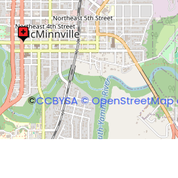
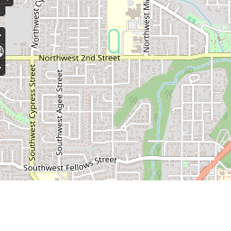
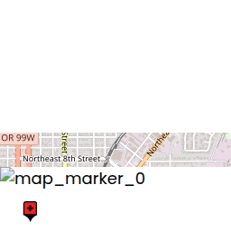
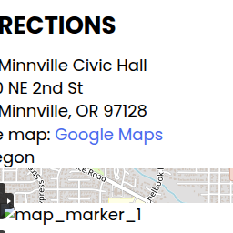
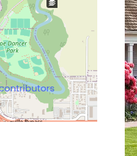
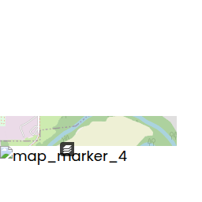
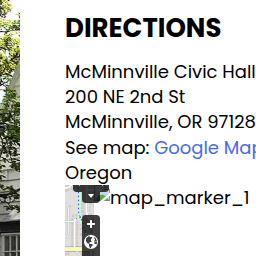
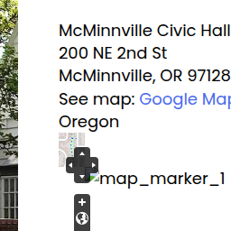

  [Skip to main content](https://www.mcminnvilleoregon.gov/citycouncil/page/canceled-city-council-work-session-meeting-1/)  Navigation     [503-434-2342]()   [Facebook](https://www.facebook.com/TheCityofMcMinnville)  [LinkedIn](https://www.linkedin.com/company/city-of-mcminnville/)  [Instagram](https://www.instagram.com/city_of_mcminnville/)      [Select Language​▼](https://www.mcminnvilleoregon.gov/citycouncil/page/canceled-city-council-work-session-meeting-1/)  

 *  [Government]()    

Column 1  

   *  __ [City Charter](http://www.mcminnvilleoregon.gov/sites/default/files/fileattachments/city_council/page/1396/city_charter.pdf)__ 
   *  __ [City Council](https://www.mcminnvilleoregon.gov/citycouncil)__ 
   *  [Agendas and Minutes](http://www.mcminnvilleoregon.gov/meetings?field_microsite_tid_1=27) 
   *  [Ordinances](https://www.mcminnvilleoregon.gov/ordinances) 
   *  [Resolutions](https://www.mcminnvilleoregon.gov/resolutions) 
   *  __ [Boards and Commissions](https://www.mcminnvilleoregon.gov/bc)__ 
   *  [Agendas and Minutes](https://www.mcminnvilleoregon.gov/meetings) 
   *  __ [McMinnville Water and Light](https://www.mc-power.com/)__ 
   *  __ [City Street Closures](https://www.mcminnvilleoregon.gov/ops/page/construction-updates)__ 
   *  __ [FAQs](https://www.mcminnvilleoregon.gov/faqs)__   

Column 2  

   *  __ [ADA Accessibility](https://www.mcminnvilleoregon.gov/ada)__ 
   *  __ [Departments]()__ 
   *  [City Manager](https://www.mcminnvilleoregon.gov/citymanager) 
   *  [   City Attorney](https://www.mcminnvilleoregon.gov/attorney) 
   *  [   City Recorder](https://www.mcminnvilleoregon.gov/cityrecorder) 
   *  [Public Works](https://www.mcminnvilleoregon.gov/publicworks) 
   *  [   Airport](https://www.mcminnvilleoregon.gov/airport) 
   *  [   Engineering](https://www.mcminnvilleoregon.gov/engineering) 
   *  [   Operations](https://www.mcminnvilleoregon.gov/ops) 
   *  [   Wastewater Services](https://www.mcminnvilleoregon.gov/wastewater) 
   *  [Finance](https://www.mcminnvilleoregon.gov/finance) 
   *  [Human Resources](https://www.mcminnvilleoregon.gov/hr) 
   *  [Library](https://www.mcminnvilleoregon.gov/library)   

Column 3  

   *  
   *  [Municipal Court](https://www.mcminnvilleoregon.gov/municipalcourt) 
   *  [Parks & Recreation](https://www.mcminnvilleoregon.gov/parksrec) 
   *  [   Aquatic Center](https://www.mcminnvilleoregon.gov/aquatic) 
   *  [   Community Center](https://www.mcminnvilleoregon.gov/communitycenter) 
   *  [   Culture, Parks & Rec](https://www.mcminnvilleoregon.gov/macpac) 
   *  [   Recreational Sports](https://www.mcminnvilleoregon.gov/parksrec/page/recreational-sports) 
   *  [   Senior Center](https://www.mcminnvilleoregon.gov/seniorcenter) 
   *  [Community Development](https://www.mcminnvilleoregon.gov/cd) 
   *  [   Building](https://www.mcminnvilleoregon.gov/building) 
   *  [   Code Compliance](https://www.mcminnvilleoregon.gov/cd/page/code-compliance-community-relations) 
   *  [   Planning](https://www.mcminnvilleoregon.gov/cd/planning) 
   *  [   Urban Renewal](http://www.mcminnvilleoregon.gov/cd/page/urban-renewal) 
   *  [Police Department](https://www.mcminnvilleoregon.gov/police)  
 *  [Business]()    

Column 1  

   *  __ [Chamber of Commerce](http://mcminnville.org/)__ 
   *  __ [McMinnville Economic Development Partnership](https://www.mcminnvillebusiness.com/)__ 
   *  __ [McMinnville Downtown Association](https://downtownmcminnville.com/)__ 
   *  __ [Visit McMinnville](https://visitmcminnville.com/)__   

Column 2  

   *  __ City Resources__ 
   *  [Sign Ordinance](https://www.mcminnvilleoregon.gov/cd/page/sign-ordinance) 
   *  [Zoning Ordinance](https://www.mcminnvilleoregon.gov/cd/page/zoning-ordinance) 
   *  [Planning Commission](https://www.mcminnvilleoregon.gov/pc) 
   *  [Urban Renewal](https://www.mcminnvilleoregon.gov/cd/page/urban-renewal) 
   *  [Maps & GIS](https://www.mcminnvilleoregon.gov/engineering/page/gis-and-mapping) 
   *  __ [Downtown Parking Map](http://www.mcminnvilleoregon.gov/sites/default/files/fileattachments/community/page/1499/downtown_parking_map.pdf)__   

Column 3  

   *  __ [Bids & Requests for Proposals](https://www.demandstar.com/app/agencies/oregon/city-of-mcminnville/procurement-opportunities/3bce23de-d24b-4a5f-9248-b0a0a23f533e/)__ 
   *  __ [Current Job Openings](http://www.mcminnvilleoregon.gov/jobs)__  
 *  [Community]()    

Column 1  

   *  __ [Historic McMinnville]()__ 
   *  Events and Activities 
   *  [City Calendar](https://www.mcminnvilleoregon.gov/calendar) 
   *  [Library Calendar](https://www.mcminnvilleoregon.gov/calendar/month?field_microsite_tid=95) 
   *  [Community Events](https://www.mcminnvilleoregon.gov/calendar/month?field_microsite_tid=26&field_microsite_tid_1=All) 
   *  __ [Special Events](http://visitmcminnville.com/events/)__ 
   *  __ [Summer Fun](https://www.mcminnvilleoregon.gov/summerfun)__ 
   *  __ [Boletín MAC de la Comunidad Latina](http://www.mcminnvilleoregon.gov/community/page/bolet%C3%ADn-mac-de-la-comunidad-latina)__   

Column 2  

   *  __ [Parks & Recreation](https://www.mcminnvilleoregon.gov/parksrec)__ 
   *  [Aquatic Center](https://www.mcminnvilleoregon.gov/aquatic) 
   *  [Community Center](https://www.mcminnvilleoregon.gov/communitycenter) 
   *  [Current Activity Guide](https://www.mcminnvilleoregon.gov/sites/default/files/media/activity-guide-eng/index.html) 
   *  [Guía de Actividades](https://www.mcminnvilleoregon.gov/sites/default/files/media/activity-guide-spa/index.html) 
   *  [Online Registration](https://activenet020.active.com/mcminnvilleparksandrec/) 
   *  [Parks & Amenities](https://www.mcminnvilleoregon.gov/parksites) 
   *  [Recreational Sports](https://www.mcminnvilleoregon.gov/parksrec/page/recreational-sports) 
   *  [Senior Center](https://www.mcminnvilleoregon.gov/seniorcenter) 
   *  __ [Library](https://www.mcminnvilleoregon.gov/library)__ 
   *  __ [Municipal Court](https://www.mcminnvilleoregon.gov/municipalcourt)__   

Column 3  

   *  __ [McMinnville Community Media](http://www.mcm11.org/)__ 
   *  __ [McMinnville Fire District](https://mcminnvillefiredistrict.org/)__ 
   *  __ [McMinnville School District](http://www.msd.k12.or.us/)__ 
   *  __ [Transportation](http://www.yctransitarea.org/)__ 
   *  __ [Utilities and Services](https://www.mcminnvilleoregon.gov/community/page/hook-local-utilities-listing)__ 
   *  __ [Yamhill County](http://www.yamhillcounty.gov/)__  
 *  [I Want To...]()    

Column 1  

   *  __ [Search the Website](https://www.mcminnvilleoregon.gov/search)__ 
   *  __ [Apply For a Job](https://www.governmentjobs.com/careers/Mcminnville)__ 
   *  __ [Get Involved](https://www.mcminnvilleoregon.gov/community/page/get-involved-0)__ 
   *  Find Hours For 
   *  [Aquatic Center](https://www.mcminnvilleoregon.gov/aquatic/page/weekly-schedule) 
   *  [City Hall](https://www.mcminnvilleoregon.gov/cityadmin/custom-contact-page/city-administration-contact-information) 
   *  [Community Center](https://www.mcminnvilleoregon.gov/communitycenter/custom-contact-page/community-center-contact-information) 
   *  [Library](https://www.mcminnvilleoregon.gov/library/custom-contact-page/library-contact-information) 
   *  [Police Department](https://www.mcminnvilleoregon.gov/police/custom-contact-page/police-contact-information) 
   *  [Senior Center](https://www.mcminnvilleoregon.gov/seniorcenter/custom-contact-page/senior-center-contact-information)   

Column 2  

   *  __ [Contact the City](https://www.mcminnvilleoregon.gov/contact)__ 
   *  [Contact Submission Form](https://www.mcminnvilleoregon.gov/contact) 
   *  [Office Hours](https://www.mcminnvilleoregon.gov/contact) 
   *  [Staff Directory](https://www.mcminnvilleoregon.gov/directory) 
   *  __ [Report a Crime](https://www.mcminnvilleoregon.gov/police/webform/citizen-crime-report)__ 
   *  __ [Report Fraud](https://www.mcminnvilleoregon.gov/cityadmin/webform/report-fraud-city-resources)__ 
   *  __ [Receive Alerts & Notifications](https://www.mcminnvilleoregon.gov/newsletter/subscriptions)__ 
   *  __ [Be Prepared for an Emergency](https://www.mcminnvilleoregon.gov/fire/page/emergency-management)__   

Column 3  

   *  __ [Visit McMinnville](http://visitmcminnville.com/)__ 
   *  __ [Start a Business](http://www.mcminnvillebusiness.com/)__ 
   *  __ [Submit a Records Request](https://mcminnvilleor.govqa.us/WEBAPP/_rs/(S(ckjxol0c1e1tui3t55sdayls))/SupportHome.aspx?sSessionID=)__ 
   *  __ [Get a Street Use Permit](https://www.mcminnvilleoregon.gov/publicworks/webform/application-street-usepublic-right-way-use)__ 
   *  __ [Sign up for a Recreation Program](https://apm.activecommunities.com/mcminnvilleparksandrec/Home)__ 
   *  __ [Apply for a Special Events Permit](https://www.mcminnvilleoregon.gov/police/page/application-packet-special-event-permit)__  
 Search form Search Website  [City Council](https://www.mcminnvilleoregon.gov/citycouncil)     

# CANCELED - City Council Work Session Meeting

###### Calendar Date:

 Tuesday, May 13, 2025 - 6:00pm 

Add to your calendar:  

  [Outlook (iCal)](https://www.mcminnvilleoregon.gov/calendar/ical/node/25982/calendar.ics)  -  [Google](http://www.google.com/calendar/render?cid=webcal://www.mcminnvilleoregon.gov/calendar/ical/node/25982/calendar.ics)   [Back to calendar](https://www.mcminnvilleoregon.gov/calendar)  

 __May 13, 2025 - CITY COUNCIL WORK SESSION CANCELED__ 

#### Directions

 McMinnville Civic Hall 200 NE 2nd St McMinnville, OR 97128 See map: [Google Maps](http://maps.google.com/?q=200+NE+2nd+St,+McMinnville,+OR,+97128,+us)  Oregon                  Base Layer OSM Mapnik

 Overlays       © [CCBYSA](http://creativecommons.org/licenses/by-sa/2.0/)  [© OpenStreetMap contributors](http://www.openstreetmap.org/copyright)                       

 *   

 *  [City Charter](http://www.mcminnvilleoregon.gov/sites/default/files/fileattachments/city_council/page/1396/city_charter.pdf) 
 *  [Municipal Code](https://www.mcminnvilleoregon.gov/node/1426/) 
 *  [Council Goals](https://www.mcminnvilleoregon.gov/sites/default/files/fileattachments/city_council/page/18721/council_goals_and_objectives.pdf) 
 *  [Mission and Values](https://www.mcminnvilleoregon.gov/sites/default/files/fileattachments/city_administration/page/9441/mission_vision_values_-_final_-_adopted.pdf) 
 *  [Council Guidelines](https://www.mcminnvilleoregon.gov/node/1425/) 
 *  [Strategic Plan](https://www.mcminnvilleoregon.gov/sites/default/files/fileattachments/city_administration/page/9441/mcm-strategic_plan-final-2032.pdf) 
 *   [City Accomplishments](https://www.mcminnvilleoregon.gov/citycouncil/page/city-accomplishments) 
   *  [2016 Accomplishments](http://www.mcminnvilleoregon.gov/sites/default/files/fileattachments/city_administration/page/1260/2016_accomplishments.pdf) 
   *  [2017 Accomplishments](https://www.mcminnvilleoregon.gov/sites/default/files/fileattachments/city_administration/page/7357/2017_accomplishments.pdf) 
   *  [2018 Accomplishments](https://www.mcminnvilleoregon.gov/citycouncil/page/2018-accomplishments-0) 
   *  [2019 Accomplishments](https://www.mcminnvilleoregon.gov/citycouncil/page/2019-accomplishments-0) 
   *  [2020 Accomplishments](https://www.mcminnvilleoregon.gov/citycouncil/page/2020-accomplishments) 
 *   [Mayor's Awards](https://www.mcminnvilleoregon.gov/citycouncil/page/mayors-awards) 
   *  [Mayor's Awards 2018](https://www.mcminnvilleoregon.gov/citycouncil/page/mayors-awards-2018) 
   *  [Mayor's Awards 2019](https://www.mcminnvilleoregon.gov/citycouncil/page/mayors-awards-2019) 
   *  [Mayor's Awards 2020](https://www.mcminnvilleoregon.gov/citycouncil/page/mayors-awards-2020) 
   *  [Mayor's Awards 2021](https://www.mcminnvilleoregon.gov/citycouncil/page/mayors-awards-2021) 
   *  [Mayor's Awards 2022](https://www.mcminnvilleoregon.gov/citycouncil/page/mayors-awards-2022) 
   *  [Mayor's Awards 2023](https://www.mcminnvilleoregon.gov/citycouncil/page/mayors-awards-2023) 
   *  [Mayor's Awards 2024](https://www.mcminnvilleoregon.gov/citycouncil/page/mayors-awards-2024) 
 *  [Citizen Survey](https://www.mcminnvilleoregon.gov/node/1424/) 
 *  [Council Agendas & Minutes](https://www.mcminnvilleoregon.gov/meetings?field_microsite_tid_1=27) 
 *  [Committees / Boards / Commissions](http://www.mcminnvilleoregon.gov/bc) 
 *  [Ward Boundaries Map](https://www.mcminnvilleoregon.gov/sites/default/files/fileattachments/city_council/page/1388/wards2025.pdf) 
 *   [Elections](https://www.mcminnvilleoregon.gov/citycouncil/page/elections) 
   *  [ORESTAR - Campaign Finance](https://www.mcminnvilleoregon.gov/citycouncil/page/orestar-campaign-finance) 

## Contact Information

 __City Council and Mayor __ 

City Hall 

230 NE 2nd Street 

McMinnville, OR 97128

  [View Full Contact Details](https://www.mcminnvilleoregon.gov/citycouncil/custom-contact-page/city-council-contact-information)  

## Upcoming Events

 *   [Possible Quorum of City Council on 05/07](https://www.mcminnvilleoregon.gov/citycouncil/page/possible-quorum-city-council-0507)  05/07/2025 - 8:00am 
 *   [CANCELED - City Council Work Session Meeting](https://www.mcminnvilleoregon.gov/citycouncil/page/canceled-city-council-work-session-meeting-1)  05/13/2025 - 6:00pm 
 *   [City Council Regular Meeting (7:00 PM)](https://www.mcminnvilleoregon.gov/citycouncil/page/city-council-regular-meeting-700-pm-25)  05/13/2025 - 7:00pm 

 [View the City Council Calendar](https://www.mcminnvilleoregon.gov/calendar?field_microsite_tid_1=27) 

  [Contact Directory](https://www.mcminnvilleoregon.gov/directory) 

 [Hours](https://www.mcminnvilleoregon.gov/contact)  

 *  [Home](https://www.mcminnvilleoregon.gov/) 
 *  [Staff Login](https://www.mcminnvilleoregon.gov/user/login?current=node/25982) 
 *  [Accessibility](https://www.mcminnvilleoregon.gov/) 
    

230 NE Second Street

McMinnville, OR 97128

  [Government Websites by CivicPlus®](http://civicplus.com/)  Original text Rate this translation Your feedback will be used to help improve Google Translate 