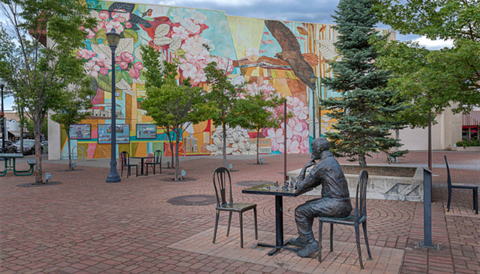

           [Skip to main content](https://www.medfordoregon.gov/Home/)  opens in new tab or window           [English (United States)Select this as your preferred language](https://www.medfordoregon.gov/Home?oc_lang=en-US)  [SpanishSelect this as your preferred language](https://www.medfordoregon.gov/Home?oc_lang=es)  English (United States)  **  is your current preferred language. 

 * 
 *  [SpanishSelect this as your preferred language](https://www.medfordoregon.gov/Home?oc_lang=es) 
  [City of Medford - Home - Logo](https://www.medfordoregon.gov/Home)   **  Open Search  **  Menu Search 

 *  [**Residents](https://www.medfordoregon.gov/Residents)  **  Sub-menu 
   *  [Back to  Residents](https://www.medfordoregon.gov/Home/) 
   *  [Communications](https://www.medfordoregon.gov/Residents/Communications)  **  Sub-menu 
     *  [Back to Communications](https://www.medfordoregon.gov/Home/) 
     *  [News & Media](https://www.medfordoregon.gov/Residents/Communications/News-Media) 
     *  [Utility Bill Insert](https://www.medfordoregon.gov/Residents/Communications/Utility-Bill-Insert) 
     *  [Medford eNews](https://www.medfordoregon.gov/Residents/Communications/Medford-eNews) 
     *  [Social Media Center](https://www.medfordoregon.gov/Residents/Communications/Social-Media-Center) 
     *  [Citizen Academy](https://www.medfordoregon.gov/Residents/Communications/Citizen-Academy) 
     *  [Town Halls](https://www.medfordoregon.gov/Residents/Communications/Town-Halls) 
     *  [Join a City Board, Commission or Committee](https://www.medfordoregon.gov/Residents/Communications/BC-Get-Involved) 
     *  [Become a Volunteer](https://www.medfordoregon.gov/Residents/Communications/Become-a-Volunteer) 
     *  [Attend City Meetings](https://www.medfordoregon.gov/Residents/Communications/Attend-City-Meetings) 
   *  [What's Happening In My Neighborhood?](https://www.medfordoregon.gov/Residents/Whats-Happening-In-My-Neighborhood) 
   *  [Emergency Preparedness](https://www.medfordoregon.gov/Residents/Emergency-Preparedness) 
   *  [Play Medford](https://www.medfordoregon.gov/Residents/Play-Medford-Directory) 
   *  [Volunteer](https://www.medfordoregon.gov/Residents/Volunteer)  **  Sub-menu 
     *  [Back to Volunteer](https://www.medfordoregon.gov/Home/) 
     *  [Boards and Commissions](https://www.medfordoregon.gov/Residents/Volunteer/Boards-and-Commissions) 
     *  [Medford Police Volunteer Program](https://www.medfordoregon.gov/Residents/Volunteer/Medford-Police-Volunteer-Program) 
     *  [Parks, Recreation and Facilities Volunteers](https://www.medfordoregon.gov/Residents/Volunteer/Parks-Recreation-and-Facilities-Volunteers) 
 *  [Government](https://www.medfordoregon.gov/Government)  **  Sub-menu 
   *  [Back to Government](https://www.medfordoregon.gov/Home/) 
   *  [Agendas and Minutes](https://www.medfordoregon.gov/Government/Agendas-and-Minutes)  **  Sub-menu 
     *  [Back to Agendas and Minutes](https://www.medfordoregon.gov/Home/) 
     *  [Active Transportation Advisory Committee](https://www.medfordoregon.gov/Government/Agendas-and-Minutes/Active-Transportation) 
     *  [Budget Committee](https://www.medfordoregon.gov/Government/Agendas-and-Minutes/Budget-Committee) 
     *  [Cemetery Commission](https://www.medfordoregon.gov/Government/Agendas-and-Minutes/Cemetery-Commission) 
     *  [City Council](https://www.medfordoregon.gov/Government/Agendas-and-Minutes/City-Council) 
     *  [Commission on Access, Diversity, Equity and Inclusion](https://www.medfordoregon.gov/Government/Agendas-and-Minutes/CADEI) 
     *  [Community Services and Development Commission](https://www.medfordoregon.gov/Government/Agendas-and-Minutes/Community-Services-and-Development-Commission) 
     *  [Housing Advisory Commission](https://www.medfordoregon.gov/Government/Agendas-and-Minutes/Housing-Advisory-Commission) 
     *  [Hospital Facilities Authority Board](https://www.medfordoregon.gov/Government/Agendas-and-Minutes/Hospital-Facilities-Authority-Board) 
     *  [Landmarks and Historic Preservation Commission](https://www.medfordoregon.gov/Government/Agendas-and-Minutes/LHPC) 
     *  [Medford Urban Renewal Agency Board](https://www.medfordoregon.gov/Government/Agendas-and-Minutes/MURA) 
     *  [Medford Urban Renewal Agency Advisory Committee](https://www.medfordoregon.gov/Government/Agendas-and-Minutes/MURA-AC) 
     *  [Parking Committee](https://www.medfordoregon.gov/Government/Agendas-and-Minutes/Parking-Committee) 
     *  [Planning Commission](https://www.medfordoregon.gov/Government/Agendas-and-Minutes/Planning-Commission) 
     *  [Parks and Recreation Commission](https://www.medfordoregon.gov/Government/Agendas-and-Minutes/Parks-and-Recreation-Commission) 
     *  [Police Advisory Committee](https://www.medfordoregon.gov/Government/Agendas-and-Minutes/Police-Advisory-Committee) 
     *  [Public Art Selection Committee](https://www.medfordoregon.gov/Government/Agendas-and-Minutes/Public-Arts) 
     *  [Site Plan and Architectural Commission](https://www.medfordoregon.gov/Government/Agendas-and-Minutes/Site-Plan-and-Architectural-Commission) 
     *  [Traffic Coordinating Committee](https://www.medfordoregon.gov/Government/Agendas-and-Minutes/Traffic-Coordinating-Committee) 
     *  [Transportation Commission](https://www.medfordoregon.gov/Government/Agendas-and-Minutes/Transportation-Commission) 
     *  [Tree Committee](https://www.medfordoregon.gov/Government/Agendas-and-Minutes/Tree-Committee) 
     *  [Medford 2040 Vision Implementation Committee](https://www.medfordoregon.gov/Government/Agendas-and-Minutes/Medford-2040-VTF-VIC) 
     *  [Parking Evaluation Committee Agenda](https://www.medfordoregon.gov/Government/Agendas-and-Minutes/Parking-Evaluation-Committee) 
   *  [Boards and Commissions](https://www.medfordoregon.gov/Government/Boards-and-Commissions)  **  Sub-menu 
     *  [Back to Boards and Commissions](https://www.medfordoregon.gov/Home/) 
     *  [Active Transportation Advisory Committee](https://www.medfordoregon.gov/Government/Boards-and-Commissions/ATAC) 
     *  [Budget Committee](https://www.medfordoregon.gov/Government/Boards-and-Commissions/Budget-Committee) 
     *  [Cemetery Commission](https://www.medfordoregon.gov/Government/Boards-and-Commissions/Cemetery-Commission) 
     *  [Commission on Access, Diversity, Equity & Inclusion](https://www.medfordoregon.gov/Government/Boards-and-Commissions/CADEI) 
     *  [Community Services & Development Commission](https://www.medfordoregon.gov/Government/Boards-and-Commissions/CSDC) 
     *  [Hospital Facilities Authority Board](https://www.medfordoregon.gov/Government/Boards-and-Commissions/Hospital-Facilities-Authority-Board) 
     *  [Housing Advisory Commission](https://www.medfordoregon.gov/Government/Boards-and-Commissions/Housing-Advisory-Commission) 
     *  [Landmarks & Historic Preservation Commission](https://www.medfordoregon.gov/Government/Boards-and-Commissions/Landmarks-Historic-Preservation-Commission) 
     *  [Medford 2040 Vision Implementation Committee](https://www.medfordoregon.gov/Government/Boards-and-Commissions/Medford-2040-Vision-Implementation-Committee) 
     *  [Medford Urban Renewal Agency](https://www.medfordoregon.gov/Government/Boards-and-Commissions/MURA) 
     *  [Medford Urban Renewal Agency Advisory Committee](https://www.medfordoregon.gov/Government/Boards-and-Commissions/MURAAC) 
     *  [Medford Urban Renewal Agency Budget Committee](https://www.medfordoregon.gov/Government/Boards-and-Commissions/MURA-Budget) 
     *  [Parking Committee](https://www.medfordoregon.gov/Government/Boards-and-Commissions/Parking-Committee) 
     *  [Parks & Recreation Commission](https://www.medfordoregon.gov/Government/Boards-and-Commissions/Parks-Recreation-Commission) 
     *  [Planning Commission](https://www.medfordoregon.gov/Government/Boards-and-Commissions/Planning) 
     *  [Police Advisory Committee](https://www.medfordoregon.gov/Government/Boards-and-Commissions/Police-Advisory-Committee) 
     *  [Public Art Selection Committee](https://www.medfordoregon.gov/Government/Boards-and-Commissions/Public-Arts) 
     *  [Sister City Committee](https://www.medfordoregon.gov/Government/Boards-and-Commissions/Sister-City-Committee) 
     *  [Site Plan & Architectural Commission](https://www.medfordoregon.gov/Government/Boards-and-Commissions/SPAC) 
     *  [Traffic Coordinating Committee](https://www.medfordoregon.gov/Government/Boards-and-Commissions/Traffic-Coordinating-Committee) 
     *  [Transportation Commission](https://www.medfordoregon.gov/Government/Boards-and-Commissions/Transportation-Commission) 
     *  [Tree Committee](https://www.medfordoregon.gov/Government/Boards-and-Commissions/Tree-Committee) 
     *  [Unified Appeal Board](https://www.medfordoregon.gov/Government/Boards-and-Commissions/Unified-Appeal-Board) 
     *  [Water Commission](https://www.medfordoregon.gov/Government/Boards-and-Commissions/Water-Commission) 
   *  [City Code](https://www.medfordoregon.gov/Government/Medford-Municipal-Code) 
   *  [Departments](https://www.medfordoregon.gov/Government/Departments)  **  Sub-menu 
     *  [Back to Departments](https://www.medfordoregon.gov/Home/) 
     *  [Building Safety](https://www.medfordoregon.gov/Government/Departments/Building-Safety) 
     *  [City Attorney's Office](https://www.medfordoregon.gov/Government/Departments/City-Attorneys-Office) 
     *  [City Manager's Office](https://www.medfordoregon.gov/Government/Departments/City-Managers-Office) 
     *  [City Recorder's Office](https://www.medfordoregon.gov/Government/Departments/City-Recorders-Office) 
     *  [Finance](https://www.medfordoregon.gov/Government/Departments/Finance) 
     *  [Fire](https://www.medfordoregon.gov/Government/Departments/Fire) 
     *  [Human Resources](https://www.medfordoregon.gov/Government/Departments/Human-Resources) 
     *  [Medford Urban Renewal Agency](https://www.medfordoregon.gov/Government/Departments/Medford-Urban-Renewal-Agency) 
     *  [Parks, Recreation and Facilities](https://www.medfordoregon.gov/Government/Departments/Parks-Recreation-and-Facilities) 
     *  [Planning](https://www.medfordoregon.gov/Government/Departments/Planning) 
     *  [Police](https://www.medfordoregon.gov/Government/Departments/Police) 
     *  [Public Works](https://www.medfordoregon.gov/Government/Departments/Public-Works) 
   *  [Mayor & City Council](https://www.medfordoregon.gov/Government/Mayor-City-Council) 
   *  [Meetings](https://www.medfordoregon.gov/Government/Meeting-Calendar) 
   *  [Municipal Court](https://www.medfordoregon.gov/Government/Municipal-Court-Services)  **  Sub-menu 
     *  [Back to Municipal Court](https://www.medfordoregon.gov/Home/) 
     *  [Skip the Line/Pay A Ticket](https://www.medfordoregon.gov/Government/Municipal-Court-Services/Skip-the-LinePay-A-Ticket) 
     *  [Photo Radar/Redlight Violations](https://www.medfordoregon.gov/Government/Municipal-Court-Services/Photo-Radar-and-Redlight-Violations) 
     *  [Online Dockets & Record Search](https://www.medfordoregon.gov/Government/Municipal-Court-Services/Online-Dockets-Record-Search) 
     *  [Traffic Violations](https://www.medfordoregon.gov/Government/Municipal-Court-Services/Traffic-Violations) 
     *  [Appearance & Plea](https://www.medfordoregon.gov/Government/Municipal-Court-Services/Appearance-Plea) 
     *  [Outreach Court](https://www.medfordoregon.gov/Government/Municipal-Court-Services/Outreach-Court) 
   *  [Proclamations](https://www.medfordoregon.gov/Government/Proclamations) 
   *  [Public Records Request](https://www.medfordoregon.gov/Government/Public-Records-Request) 
   *  [Watch City Meetings](https://www.medfordoregon.gov/Government/Watch-City-Meetings)  **  Sub-menu 
     *  [Back to Watch City Meetings](https://www.medfordoregon.gov/Home/) 
     *  [Live Stream Government Channel](https://www.medfordoregon.gov/Government/Watch-City-Meetings/Live-Stream-Government-Channel) 
     *  [City Council Meetings](https://www.medfordoregon.gov/Government/Watch-City-Meetings/City-Council) 
     *  [Planning Commission Meetings](https://www.medfordoregon.gov/Government/Watch-City-Meetings/Planning-Commission-Meetings) 
     *  [Site Plan & Architectural Commission Meetings](https://www.medfordoregon.gov/Government/Watch-City-Meetings/Site-Plan-Architectural-Commission-Meetings) 
     *  [Urban Renewal Meetings](https://www.medfordoregon.gov/Government/Watch-City-Meetings/Urban-Renewal-Meetings) 
   *  [Privacy Policy](https://www.medfordoregon.gov/Government/New-page-1) 
 *  [Business](https://www.medfordoregon.gov/Business)  **  Sub-menu 
   *  [Back to Business](https://www.medfordoregon.gov/Home/) 
   *  [Development Services](https://www.medfordoregon.gov/Business/Development-Services)  **  Sub-menu 
     *  [Back to Development Services](https://www.medfordoregon.gov/Home/) 
     *  [Building Permits](https://www.medfordoregon.gov/Business/Development-Services/Residential-Commercial-Permits) 
     *  [Business Licensing](https://www.medfordoregon.gov/Business/Development-Services/Business-Licensing) 
     *  [Planning & Zoning](https://www.medfordoregon.gov/Business/Development-Services/Planning-Zoning-Dev-Services) 
     *  [Public Improvement Plan Review & Plat Review](https://www.medfordoregon.gov/Business/Development-Services/Public-Improvement-Plan-Review-Plat-Review) 
     *  [Public Works Permits](https://www.medfordoregon.gov/Business/Development-Services/Public-Works-Permits) 
     *  [Online Building Permit Services](https://www.medfordoregon.gov/Business/Development-Services/Online-Building-Permit-Services) 
     *  [Request an Inspection](https://www.medfordoregon.gov/Business/Development-Services/Request-an-Inspection) 
     *  [Maps](https://www.medfordoregon.gov/Business/Development-Services/Maps) 
   *  [Bid Opportunities](https://www.medfordoregon.gov/Business/Bid-Opportunities) 
   *  [Business Licensing](https://www.medfordoregon.gov/Business/Business-Licensing) 
   *  [Vendor Registration](https://www.medfordoregon.gov/Business/Vendor-Registration) 
 *  [Services](https://www.medfordoregon.gov/Services)  **  Sub-menu 
   *  [Back to Services](https://www.medfordoregon.gov/Home/) 
   *  [Make a Payment](https://www.medfordoregon.gov/Services/Make-a-Payment)  **  Sub-menu 
     *  [Back to Make a Payment](https://www.medfordoregon.gov/Home/) 
     *  [Utility Bill](https://www.medfordoregon.gov/Services/Make-a-Payment/Pay-Utility-Bill) 
     *  [Municipal Court Citation](https://www.medfordoregon.gov/Services/Make-a-Payment/Pay-Municipal-Court-Citation) 
     *  [Parking Citation](https://www.medfordoregon.gov/Services/Make-a-Payment/Pay-Parking-Citation) 
     *  [Renew Business License](https://www.medfordoregon.gov/Services/Make-a-Payment/Renew-Business-License) 
     *  [Building Permit Fees](https://www.medfordoregon.gov/Services/Make-a-Payment/Pay-Building-Permit-Fees) 
   *  [Maps](https://www.medfordoregon.gov/Services/Geographic-Information-System) 
   *  [Solve a Problem](https://www.medfordoregon.gov/Services/Solve-a-Problem) 
   *  [Contact Us](https://www.medfordoregon.gov/Services/Contact-Us) 

Select the Escape key to close the menu. Focus will then be set to the first menu item.

# Home

  [**Do it online](https://www.medfordoregon.gov/Home/)  [**Meetings](https://www.medfordoregon.gov/Home/)  [**Public Notices](https://www.medfordoregon.gov/Home/)  

# Do it online

  [**## Apply for a PermitBuilding permits, maps, planning, zoning, ProjectDox, remodeling and more.](https://www.medfordoregon.gov/Business/Development-Services)   [**## Make a PaymentPay utility bill, parking and municipal court citations, and business license renewal fee.](https://www.medfordoregon.gov/Services/Make-a-Payment)   [**## Solve a ProblemReport a pothole, code violations, and more.](https://www.medfordoregon.gov/Services/Solve-a-Problem)   [**## Parks and RecreationFind parks, reserve a facility, register for programs.](https://www.medfordoregon.gov/Government/Departments/Parks-Recreation-and-Facilities)   [**## Apply for a JobView city job openings and apply online.](https://www.governmentjobs.com/careers/medfordor)   [**## Watch City MeetingsWatch live and recorded City Council and Commission meetings.](https://www.medfordoregon.gov/Government/Watch-City-Meetings)   [**## File a Police ReportSubmit an incident to MPD and print your own police report.](https://medfordpd.mypdconnect.com/)   [**## Who to Call at City HallDirectory of who to call for City services.](https://www.medfordoregon.gov/Services/Contact-Us)   [**## Our GovernmentSubmit a Public Records Request, learn about your City leaders, and more.](https://www.medfordoregon.gov/Government)  

# Meetings

### Upcoming Meetings 

  [## Planning Commission Study SessionApril 28, 2025, 12:00 PMThis Commission typically holds study sessions the second and fourth Monday of the month.](https://www.medfordoregon.gov/Government/Agendas-and-Minutes/Planning-Commission/2025/Mar-Apr-2025/04-28-2025-Planning-SS-Virtual-Cancelled)   [## Site Plan and Architectural Commission MeetingMay 02, 2025, 12:00 PMThis Commission typically meets the first and third Friday of the month.](https://www.medfordoregon.gov/Government/Agendas-and-Minutes/Site-Plan-and-Architectural-Commission/2025/Apr-Jun-2025/05-02-2025-SPAC-Chambers)   [## Budget Committee MeetingMay 03, 2025, 09:00 AMThe Budget Committee typically holds meetings four to five times during odd years to review the preliminary budget for the biennium. Additional meetings are held as needed.](https://www.medfordoregon.gov/Government/Agendas-and-Minutes/Budget-Committee/2025/05-03-2025-Budget-Prescott-Room)   [## Community Services & Development Commission MeetingMay 06, 2025, 12:00 PMThis Commission typically meets the first Tuesday of the month.](https://www.medfordoregon.gov/Government/Agendas-and-Minutes/Community-Services-and-Development-Commission/2025/Apr-Jun-2025/05-06-2025-CSDC-Virtual)   [## Landmarks and Historic Preservation Commission MeetingMay 06, 2025, 05:30 PMThis Commission typically meets the first Tuesday of the month.](https://www.medfordoregon.gov/Government/Agendas-and-Minutes/LHPC/2025/Jan-Jun-2025/05-06-2025-LHPC-Chambers)   [## City Council MeetingMay 07, 2025, 06:00 PMThe City Council holds meetings the first and third Wednesday of the month.](https://www.medfordoregon.gov/Government/Agendas-and-Minutes/City-Council/2025-CC-Minutes-Agendas/May-Jun-2025/05-07-2025)   [View More Meetings](https://www.medfordoregon.gov/Government/Meeting-Calendar)  

# Public Notices

  [## The Backyard Community Food courtConsideration of plans for a semi-permanent pod development—The Backyard Community Food Court—on two contiguous parcels totaling approximately 0.32 acres (gross: 0.45 acres) and zoned C-H (Heavy Commercial). The property is located at 807 & 812 Riverside Avenue.](https://www.medfordoregon.gov/Government/Public-Notices/SPAC-Template)   [## Freight LogisticsConsideration of plans for the construction of three new office buildings, totaling approximately 6,100 square feet on three separate parcels totaling 0.93 acres. The subject parcels are located at 251, 280 and 281 Commercial Court, approximately 250 feet east of Riverside Avenue and Commercial Court intersection within the Heavy Commercial zoning district.](https://www.medfordoregon.gov/Government/Public-Notices/SPAC)   [## Airport Chey Oil, Lube, Detail ShopConsideration of plans for the construction of a new commercial building to be used as a repair, carwash, and detail shop to be sited northwest of the existing Airport Chevrolet auto dealership building. The site is located at 3001 Biddle Road and consists of a single parcel totaling approximately 5.53 acres, developed with the Airport Chevrolet auto dealership.](https://www.medfordoregon.gov/Government/Public-Notices/SPAC-2)   [View More Public Notices](https://www.medfordoregon.gov/Government/Public-Notices)  

Press left and right keys to move between tabs. Press down to focus tab content.

# Latest News

  [## Volunteers Remove Nearly 1.4K Pounds of Trash, Debris from City ParksPublished on April 28, 2025Twenty-seven volunteers dedicated over 140 hours in March to cleaning up City parks and Eastwood Cemetery, removing nearly 1,400 pounds of trash and natural debris.](https://www.medfordoregon.gov/News-Articles/Volunteers-Remove-Nearly-1.4K-Pounds-of-Trash-Debris-from-City-Parks)   [## Medford Fire Celebrates Excellence at 2025 Annual Awards BanquetPublished on April 24, 2025The Medford Fire Department honored its team of exceptional first responders during its 2025 Annual Awards Banquet—an evening that recognized outstanding service, leadership, and dedication across the organization.](https://www.medfordoregon.gov/News-Articles/Medford-Fire-Celebrates-Excellence-at-2025-Annual-Awards-Banquet)   [## City of Medford Announces New LeadershipPublished on April 22, 2025The City of Medford is pleased to announce three recently filled leadership positions: Assistant City Manager, Economic Development Director, and Planning Director.](https://www.medfordoregon.gov/News-Articles/City-of-Medford-Announces-New-Leadership)   [View More News](https://www.medfordoregon.gov/News-articles)  

# Around Medford

  [## Join a Board or CommissionGet involved in our community by joining one of our many advisory boards or commissions.](https://medford.prelive.opencities.com/Government/Boards-and-Commissions)   [## Foothill Road Improvement ProjectGet the latest updates and traffic alerts related to this project.](https://www.oregon.gov/odot/projects/pages/project-details.aspx?project=19231)   [## Medford 2040 Community VisionA plan for the future, developed by people who live, work, and seek services in the our community.](https://www.medfordoregon.gov/files/assets/public/communications/news-article-attachments/medford-2040-community-vision-and-action-plan.pdf)   [**Back to top](https://www.medfordoregon.gov/Home/)  

### City Hall

41 1 W 8th Street

Medford, Oregon 97501

541.774.2000

Monday - Friday  8 a.m. to 5 p.m.

 [Observed holidays](https://www.medfordoregon.gov/Home/Tabs/Do-it-online/Who-to-Call-at-City-Hall/City-Observed-Holidays) 

### Share & connect

 *  [**Medford Facebook](https://www.facebook.com/CityofMedford) 
 *  [**Medford Instagram](https://www.instagram.com/cityofmedfordor/) 
 *  [**Medford Twitter](https://twitter.com/cityofmedford?lang=en) 
 *  [**Medford Youtube](https://www.youtube.com/user/cityofmedfordor) 

### Contact Us

 [City Directory](https://www.medfordoregon.gov/Home/Tabs/Do-it-online/Who-to-Call-at-City-Hall/Who-to-Call-at-City-Hall) 

 [Subscribe to City News](https://www.medfordoregon.gov/Residents/Communications/Medford-eNews) 

  [Website Disclaimer](https://www.medfordoregon.gov/Home)  | [Sitemap](https://www.medfordoregon.gov/Home)  © 2025 City of Medford |  Powered by [Granicus](https://granicus.com/solution/govaccess/opencities/)  Ready   Close subscription dialog 

Sign up here for the latest Medford, Oregon news

 No Thanks Remind Me Later 

 __Thank You!__ 

You are now signed up to receive updates.

Continue

 