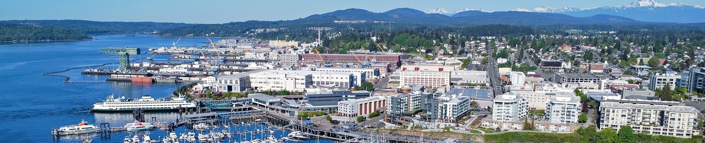
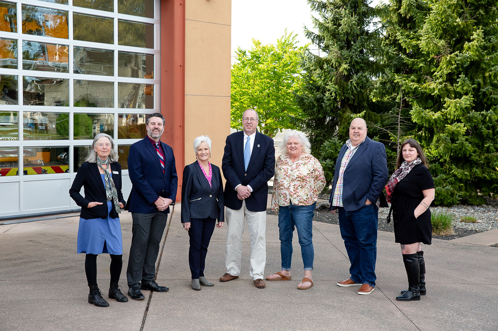
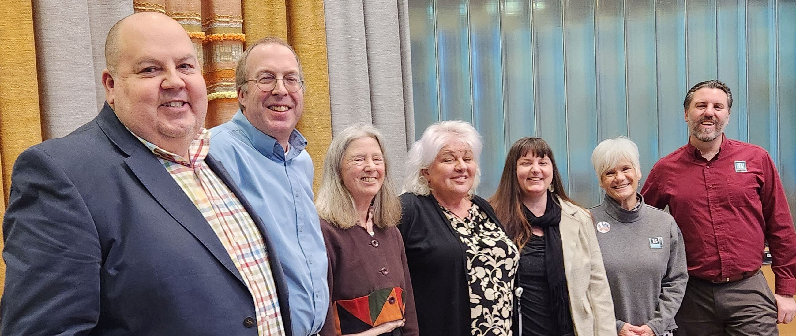
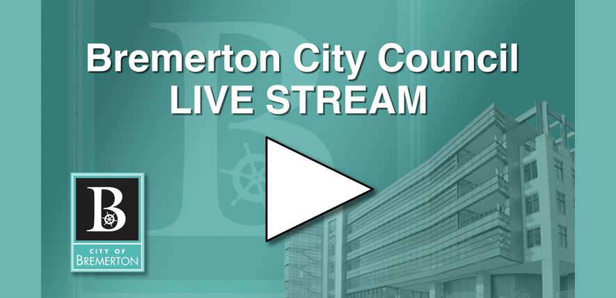

 

This website is AudioEye enabled and is being optimized for accessibility. To open the AudioEye Toolbar, press "shift + =". Some assistive technologies may require the use of a passthrough function before this keystroke. For more information, activate the button labeled “Explore your accessibility options”.

  [Skip To Main Content](https://bremertonwa.gov/155/City-Council/#mainWrapTS)    

Loading

  [Skip to Main Content](https://bremertonwa.gov/155/City-Council/#cc2f06abda-c801-4400-90e3-ef1d48644d89)  

 [Create a Website Account](https://bremertonwa.gov/MyAccount/ProfileCreate)  - Manage notification subscriptions, save form progress and more.    

 *  [Website Sign In](https://bremertonwa.gov/MyAccount) 
    Accessible Menu

 1.  [Our Government](https://bremertonwa.gov/27/Our-Government) 
 1.  [City Services](https://bremertonwa.gov/101/City-Services) 
 1.  [Doing Business](https://bremertonwa.gov/35/Doing-Business) 
 1.  [Discover Bremerton](https://bremertonwa.gov/31/Discover-Bremerton) 
 1.  [How Do I...](https://bremertonwa.gov/9/How-Do-I) 
               Search    

 1.  [Home](https://bremertonwa.gov) 
 1.  [Our Government](https://bremertonwa.gov/27/Our-Government) 
 1. City Council

# City Council

    

## 2025 Council Members

Left to right: District 6, Anna Mockler; District 3, Jeff Coughlin; District 2, Denise Frey; District 7, Eric Younger; District 4, Jane Rebelowski; District 5, Michael Goodnow; and District 1, Jennifer Chamberlin.  

## 2025 Council Committee Appointments

 __Parks, Finance, Investment & Parking Committee __ 

(Meets 4th Tue at 1:30pm)

 * Jeff Coughlin (Chair)
 * Michael Goodnow (Vice Chair)
 * Jane Rebelowski

 __Public Works Committee__ 

(Meets 3rd Tue at 2pm)

 * Jane Rebelowski (Chair)
 * Jeff Coughlin (Vice Chair)
 * Denise Frey

 __Public Safety Committee__ 

(Meets 1st Thur at 1pm)

 * Michael Goodnow (Chair)
 * Anna Mockler (Vice Chair)
 * Denise Frey

 __Audit Committee__ 

(Meets 4th Mon at 5pm)

 * Anna Mockler (Chair)
 * Jennifer Chamberlin

 __Lodging Tax Advisory Committee__ 

(Meets several meetings mostly summer and fall)

 * Jennifer Chamberlin (Chair)

 __Police Pension Board__ 

(Meets quarterly)

 * Eric Younger - Council President

 __Fire Pension Board__ 

(Meets quarterly)

 * Jeff Coughlin

 __Kitsap Transit Board of Commissioners__ 

(Meets 1st and 3rd Tue at 8:30am)

 * Anna Mockler

 __Kitsap 911 Board of Directors__ 

(Meets 1st Tue in Mar & Dec from 12:30-2:15pm; and Jun & Sep from 12:30-1:30pm)

 * Jennifer Chamberlin
 * Eric Younger - Council President

 __KEDA Board of Directors  __ 

(Meets quarterly on 3rd Thursday at 3pm)

 * Eric Younger - Council President

 __CDBG Project Review Committee__ 

 * Jeff Coughlin

 __Kitsap Regional Coordinating Council (KRCC) Executive Board of Directors__ 

(Meets 1st Tue in Feb, Mar, May, Jun, Oct, Nov, and Dec from 10:15am-12:15pm)

 * Jennifer Chamberlin
 * Jeff Coughlin

 __KRCC Transportation Policy Board__ 

(Meets 3rd Thu in Mar, Jun, and Oct from 3-4:30pm)

 * Greg Wheeler
 * Jeff Coughlin - Alternate

 __KRCC Planning Policy Board__ 

(Meets 3rd Tue in Jan, Apr, May or Jun, and Oct from 1:30-3:00pm)

 * Greg Wheeler
 * Jennifer Chamberlin - Alternate

 *The following Boards are by appointment of the Mayor:* 

 __West Sound Partners for Ecosystem Recovery (WSPER) Executive Committee__ 

(Meetings to be announced in Mar, Jun, Aug, and Oct from 9:30 to 11am)

 * Mayor Wheeler
 * Anna Mockler - Alternate

 __Puget Sound Regional Council (PSRC)__ 

 __PSRC Executive Board__ (Meets 4th Thu from 10am-Noon)

 * Mayor Wheeler
 * Eric Younger - Alternate

 __PSRC Transportation Policy Board__ 

(Meets 2nd Thu from 9:30-11:30am)

 * Mayor Wheeler
 * Eric Younger - Alternate

 __PSRC Growth Management Board__ 

(Meets 1st Thu from 10am-Noon)

 * Mayor Wheeler
 * Eric Younger - Alternate

 __PSRC (Central Puget Sound) Economic Development Board __ 

(Meets 1st Wed in Mar, Jun, Sept, and Dec from 10am-Noon)

 * Mayor Wheeler
 * Eric Younger - Alternate
 City Council Members are elected by the citizens of Bremerton to perform the legislative function of local government. This includes establishing goals, priorities, and policies; adopting ordinances and resolutions; as well as approving the annual budget and monitoring expenditures related to City business throughout the year.    

### Contact Us

 1.    

 __City Council Office__    

Office: 345 6th St., Suite 600   

Mailing: 345 6th St., Suite 100   

Bremerton, WA 98337   

 [Email](mailto:City.Council@ci.bremerton.wa.us)    

 *To email your Council Member, or the full Bremerton City Council, please contact:   

 [City.Council@ci.bremerton.wa.us](mailto:City.Council@ci.bremerton.wa.us).*    

Ph: 360-473-5280   

 __Christine Grenier__    

Legislative Assistant   

 __Hours__    

Monday - Friday   

8 a.m. - 5 p.m.   

 [Staff Directory](https://bremertonwa.gov/Directory.aspx?DID=38)    

###  [Quick Links](https://bremertonwa.gov/QuickLinks.aspx?CID=88) 

 1.  [Boards & Commissions](https://bremertonwa.gov/228/Boards-Commissions)  
 1.  [City Council Meeting Schedule](https://bremertonwa.gov/702/City-Council-Meeting-Schedule)  
 1.  [How Do I...](https://bremertonwa.gov/1366)  
 1.  [Individual District Contacts](https://bremertonwa.gov/635/Council-Districts)  
 1.  [Watch City Council Live](https://bremertonwa.gov/1077/Watch-City-Council-Live)  
 /QuickLinks.aspx    

 1.   [2025-2026 Biennial Budget](https://bremertonwa.gov/1375/2025-2026-Biennial-Budget)  
 1.   [Council President](https://bremertonwa.gov/693/Council-President)  
 1.   [Council Districts](https://bremertonwa.gov/635/Council-Districts)  
 1.   [Council Statement on Supporting All Residents](https://bremertonwa.gov/DocumentCenter/View/12020/City-Council-Statement-on-Supporting-All-Residents-PDF)  
 1.   [Council Goals & Priorities](https://bremertonwa.gov/674/Council-Goals-Priorities)  
 1.   [Council Meetings](https://bremertonwa.gov/691/Council-Meetings)    
    1.   [City Council Meeting Schedule](https://bremertonwa.gov/702/City-Council-Meeting-Schedule)  
 1.   [Watch City Council Live](https://bremertonwa.gov/1077/Watch-City-Council-Live)  
 1.   [Meeting Archives](https://bremertonwa.gov/694/Meeting-Archives)    
    1.   [Agenda / Packet](https://bremertonwa.gov/706/Agenda-Packet)  
    1.   [Media](https://bremertonwa.gov/1234/Media)  
    1.   [Minutes](https://bremertonwa.gov/707/Minutes)  
 1.   [Boards & Commission](https://bremertonwa.gov/228/Boards-Commissions)  
  [Online Payments Pay utility bills, licensing, taxes, fines, and registration fees online](https://bremertonwa.gov/137/Online-Payments)   [Employment Learn about current job opportunities and apply online](https://bremertonwa.gov/169/Current-Jobs)   [Report an Issue Discover online services](https://bremertonwa.gov/869/Online-Services)   [Agendas & Minutes Download City Council, Commission, and Committee agendas, minutes, and media](https://bremertonwa.gov/868/Agendas-Minutes)   [Parks & Recreation Explore city parks, and access athletics and recreation information](https://bremertonwa.gov/210/Parks-Recreation)   [Emergency Management Contact Police and Fire and learn about emergency services](https://bremertonwa.gov/166/Emergency-Management)  

 1.    

     

### Contact Us

 1.    

 __Bremerton__    

345 6th Street,   

Suite 100   

Bremerton, WA 98337   

### Connect With Us

  [Facebook](https://bremertonwa.gov/facebook)   [LinkedIn](https://bremertonwa.gov/linkedin)   [X](https://bremertonwa.gov/twitter)   [YouTube](https://bremertonwa.gov/youtube)  

###  [Quick Links](https://bremertonwa.gov/QuickLinks.aspx?CID=178) 

 1.  [City Employment](https://bremertonwa.gov/169/Current-Jobs)  
 1.  [Council Meetings](https://bremertonwa.gov/691/Council-Meetings)  
 1.  [Codes & Ordinances](https://bremertonwa.gov/148/Codes-Ordinances)  
 1.  [Parks & Rec Registration](https://bremertonwa.gov/274/Registration)  
 1.  [Disclaimer](https://bremertonwa.gov/125/Disclaimer)  
 /QuickLinks.aspx 

###  [FAQs](https://bremertonwa.gov/Faq.aspx?TID=15) 

 1.  [Where is City Hall located?](https://bremertonwa.gov/Faq.aspx?QID=155) 
 1.  [Is my property within City limits?](https://bremertonwa.gov/Faq.aspx?QID=162) 
 1.  [I am a city resident. What Council District do I belong to?](https://bremertonwa.gov/Faq.aspx?QID=163) 
 /FAQ.aspx 

###  [Site Links](https://bremertonwa.gov/QuickLinks.aspx?CID=130) 

 1.  [Contact Us](https://bremertonwa.gov/directory.aspx)  
 1.  [Document Center](https://bremertonwa.gov/DocumentCenter)  
 1.  [Form Center](https://bremertonwa.gov/FormCenter)  
 1.  [Pay Your Bill](https://bremertonwa.gov/137/Online-Payments)  
 1.  [Submit a Comment](https://bremertonwa.gov/FormCenter/General-7/Comment-Form-49)  
 /QuickLinks.aspx Government Websites by [CivicPlus®](https://connect.civicplus.com/referral)  Loading Loading Do Not Show Again Close Select LanguageAbkhazAcehneseAcholiAfarAfrikaansAlbanianAlurAmharicArabicArmenianAssameseAvarAwadhiAymaraAzerbaijaniBalineseBaluchiBambaraBaouléBashkirBasqueBatak KaroBatak SimalungunBatak TobaBelarusianBembaBengaliBetawiBhojpuriBikolBosnianBretonBulgarianBuryatCantoneseCatalanCebuanoChamorroChechenChichewaChinese (Simplified)Chinese (Traditional)ChuukeseChuvashCorsicanCrimean Tatar (Cyrillic)Crimean Tatar (Latin)CroatianCzechDanishDariDhivehiDinkaDogriDombeDutchDyulaDzongkhaEsperantoEstonianEweFaroeseFijianFilipinoFinnishFonFrenchFrench (Canada)FrisianFriulianFulaniGaGalicianGeorgianGermanGreekGuaraniGujaratiHaitian CreoleHakha ChinHausaHawaiianHebrewHiligaynonHindiHmongHungarianHunsrikIbanIcelandicIgboIlocanoIndonesianInuktut (Latin)Inuktut (Syllabics)IrishItalianJamaican PatoisJapaneseJavaneseJingpoKalaallisutKannadaKanuriKapampanganKazakhKhasiKhmerKigaKikongoKinyarwandaKitubaKokborokKomiKonkaniKoreanKrioKurdish (Kurmanji)Kurdish (Sorani)KyrgyzLaoLatgalianLatinLatvianLigurianLimburgishLingalaLithuanianLombardLugandaLuoLuxembourgishMacedonianMadureseMaithiliMakassarMalagasyMalayMalay (Jawi)MalayalamMalteseMamManxMaoriMarathiMarshalleseMarwadiMauritian CreoleMeadow MariMeiteilon (Manipuri)MinangMizoMongolianMyanmar (Burmese)Nahuatl (Eastern Huasteca)NdauNdebele (South)Nepalbhasa (Newari)NepaliNKoNorwegianNuerOccitanOdia (Oriya)OromoOssetianPangasinanPapiamentoPashtoPersianPolishPortuguese (Brazil)Portuguese (Portugal)Punjabi (Gurmukhi)Punjabi (Shahmukhi)QuechuaQʼeqchiʼRomaniRomanianRundiRussianSami (North)SamoanSangoSanskritSantali (Latin)Santali (Ol Chiki)Scots GaelicSepediSerbianSesothoSeychellois CreoleShanShonaSicilianSilesianSindhiSinhalaSlovakSlovenianSomaliSpanishSundaneseSusuSwahiliSwatiSwedishTahitianTajikTamazightTamazight (Tifinagh)TamilTatarTeluguTetumThaiTibetanTigrinyaTivTok PisinTonganTshilubaTsongaTswanaTuluTumbukaTurkishTurkmenTuvanTwiUdmurtUkrainianUrduUyghurUzbekVendaVenetianVietnameseWarayWelshWolofXhosaYakutYiddishYorubaYucatec MayaZapotecZulu Powered by  [Translate](https://translate.google.com)  

    Original text Rate this translation Your feedback will be used to help improve Google Translate      Opens in new window PDF Download Word Download Excel Download PowerPoint Download Document Download Explore your accessibility options 