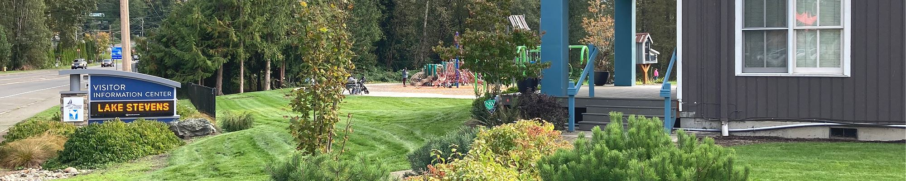
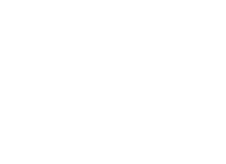

   

Loading

  [Skip to Main Content](https://www.lakestevenswa.gov/directory.aspx?EID=57/#contentarea)  

 [Create a Website Account](https://www.lakestevenswa.gov/MyAccount/ProfileCreate)  - Manage notification subscriptions, save form progress and more.    

 *  [Website Sign In](https://www.lakestevenswa.gov/MyAccount) 
  [Menu](https://www.lakestevenswa.gov/directory.aspx?EID=57/#nav)  

 1.  [Government](https://www.lakestevenswa.gov/31/Government) 
 1.  [Our Community](https://www.lakestevenswa.gov/9/Our-Community) 
 1.  [Lake Management](https://www.lakestevenswa.gov/408/Lake-Management) 
 1.  [How Do I...](https://www.lakestevenswa.gov/27/How-Do-I) 

#   

            Search       

 1.  [Home - v3](https://www.lakestevenswa.gov) 
 1. Staff Directory

# Gary Petershagen

   [City Council](https://www.lakestevenswa.gov/Directory.aspx?DID=10) 

Title: Council Position #2

Phone: [(425) 407-3327]() 

 [gpetershagen@lakestevenswa.gov](mailto:gpetershagen@lakestevenswa.gov)  

   __ Biography  __ 

Gary has been a lifelong resident of the Everett/Lake Stevens area, settling full time in Lake Stevens since 1995. Gary is married to his wife Jeanne and together they have two children, both proud graduates of Lake Stevens Schools. 

Having been involved in various aspects of the real estate industry in the past 38+ years, his experiences include banking, 

land entitlement/development and 12 years in homebuilding. Currently Gary is the principal owner of Alexander Reed, LLC, specializing in land development and CD21S, LLC which provides the construction industry with inspection services and due diligence. Gary is also a licensed Real Estate Broker in the State of Washington. 

With past business activities primarily in the Marysville area, Gary was involved in Marysville Noon Rotary Club for 18 years earning a Paul Harris Award for Community Service. He also served as the Chairman of the Board in '04-'05 for the Marysville Tulalip Chamber of Commerce. Other activities involved the Economic Development Council of Snohomish County along with his service of 6 years on the Lake Stevens Planning Commission. 

Having served on the City Council since January of 2017, Gary was re-elected in 2021 to serve another 4 year term. 

  

 [Return to Staff Directory](https://www.lakestevenswa.gov/Directory.aspx) 

 1.  [Agendas and Minutes](https://www.lakestevenswa.gov/329/Agendas-and-Minutes) 
 1.  [City Council](https://www.lakestevenswa.gov/319/City-Council) 
 1.  [City Maps](https://www.lakestevenswa.gov/187/City-Maps) 
 1.  [Municipal Code](https://www.codepublishing.com/WA/LakeStevens/) 
 1.  [Form Center](https://www.lakestevenswa.gov/FormCenter) 
  [Sewer Information](https://www.lakestevenswa.gov/474/Sewer-Information)   [City Services](https://www.lakestevenswa.gov/233/City-Services)   [Contact Us](https://www.lakestevenswa.gov/directory.aspx)   [Job Openings](https://www.lakestevenswa.gov/95/How-to-Apply)   [Online Permit Center](https://www.lakestevenswa.gov/158)   [Parks & Recreation](https://www.lakestevenswa.gov/157)  

 1.        

 1.    

 __City Hall and Permit Counter Hours__    

 Monday through Thursday   

9 am to 12 pm, 1 pm to 4 pm   

 Friday   

9 am - 12 pm   

 1.    

 __City Hall__      

1812 Main Street (physical)   

P.O. Box 257 (mailing)   

Lake Stevens, WA 98258   

Phone: (425) 622-9400   

 1.    

 __Police Department__    

 1825 S Lake Stevens Road   

Lake Stevens, WA 98258   

Phone: (425) 622-9401   

     [Select Language​▼](https://www.lakestevenswa.gov/directory.aspx?EID=57)  

###   

###   

 1.  [Home](https://www.lakestevenswa.gov)  

 1.  [Site Map](https://www.lakestevenswa.gov/sitemap.aspx)  

 1.  [Accessibility](https://www.lakestevenswa.gov/accessibility.aspx)  

 1.  [Copyright Notices](https://www.lakestevenswa.gov/site/copyright)  

 1.  [Government Websites by CivicPlus®](http://civicplus.com/referral)  

 /QuickLinks.aspx Loading Loading Do Not Show Again Close 

### Live Edit

   

 1.  [Facebook](https://www.lakestevenswa.gov/Layout/WidgetShare/ShareLink/Facebook) 
 1.  [Twitter](https://www.lakestevenswa.gov/Layout/WidgetShare/ShareLink/Twitter) 
 1.  [Pinterest](https://www.lakestevenswa.gov/Layout/WidgetShare/ShareLink/Pinterest) 
 1.  [Delicious](https://www.lakestevenswa.gov/Layout/WidgetShare/ShareLink/Delicious) 
 1.  [Blogger](https://www.lakestevenswa.gov/Layout/WidgetShare/ShareLink/Blogger) 
 1.  [LinkedIn](https://www.lakestevenswa.gov/Layout/WidgetShare/ShareLink/LinkedIn) 
    Original text Rate this translation Your feedback will be used to help improve Google Translate 

 1.  [Home](https://www.lakestevenswa.gov) 
 1.  [My Account](https://www.lakestevenswa.gov/MyAccount) 
 1.  [Printer Friendly](https://www.lakestevenswa.gov/directory.aspx?EID=57/#PrinterFriendly62e50871-92bf-441e-986d-1eb79699f41a) 
 1.  [Email Page](https://www.lakestevenswa.gov/EmailPage) 
 1.  [Contact Us](https://www.lakestevenswa.gov/directory.aspx) 
 1.  [RSS](https://www.lakestevenswa.gov/rss.aspx) 
 1.  [Site Map](https://www.lakestevenswa.gov/SiteMap) 
 1.  [Translate Page](https://www.lakestevenswa.gov/directory.aspx?EID=57/#TranslatePage62e50871-92bf-441e-986d-1eb79699f41a) 
 1.  [Notifications](https://www.lakestevenswa.gov/list.aspx) 
 1.  [Documents](https://www.lakestevenswa.gov/DocumentCenter) 
      