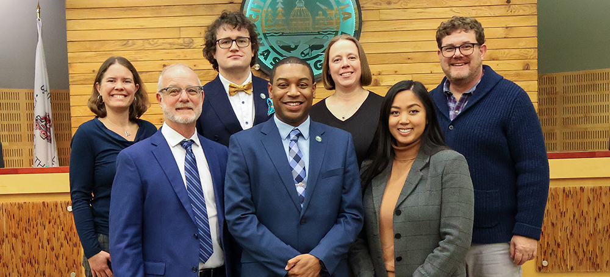

           [Skip to main content](https://olympiawa.gov/government/city_council___mayor/government/city_council___mayor/index.php#freeform-wrap)     

 *  [Community](https://olympiawa.gov/government/city_council___mayor/community/index.php)   
   *  [About Olympia](https://olympiawa.gov/government/city_council___mayor/community/about_olympia.php)   
     *  [Sanctuary City](https://olympiawa.gov/government/city_council___mayor/community/sanctuary_city.php) 
   *  [Arts, Culture & Heritage](https://olympiawa.gov/government/city_council___mayor/community/arts,_culture___heritage/index.php)   
     *  [Arts Walk](https://olympiawa.gov/government/city_council___mayor/community/arts,_culture___heritage/arts_walk.php) 
     *  [Historic Preservation](https://olympiawa.gov/government/city_council___mayor/community/arts,_culture___heritage/historic_preservation/index.php) 
     *  [Inspire Olympia](https://olympiawa.gov/government/city_council___mayor/community/arts,_culture___heritage/cultural_access.php) 
     *  [Olympia Armory](https://olympiawa.gov/government/city_council___mayor/community/arts,_culture___heritage/olympia_armory.php) 
     *  [Poet Laureate](https://olympiawa.gov/government/city_council___mayor/community/arts,_culture___heritage/poet_laureate.php) 
     *  [Public Art](https://olympiawa.gov/government/city_council___mayor/community/arts,_culture___heritage/public_art/index.php) 
   *  [Climate Change Response](https://olympiawa.gov/government/city_council___mayor/community/climate_change_response/index.php)   
     *  [Energize Olympia](https://olympiawa.gov/government/city_council___mayor/community/climate_change_response/energize_olympia.php) 
     *  [Sea Level Rise](https://olympiawa.gov/government/city_council___mayor/services/water_utilities/storm___surface_water/sea_level_rise.php) 
     *  [Solar](https://olympiawa.gov/government/city_council___mayor/community/climate_change_response/solar/index.php) 
   *  [Construction in Olympia](https://olympiawa.gov/government/city_council___mayor/info/construction_in_olympia/index.php) 
   *  [Diversity, Equity & Inclusion](https://olympiawa.gov/government/city_council___mayor/community/diversity,_equity___inclusion.php) 
   *  [Downtown](https://olympiawa.gov/government/city_council___mayor/community/downtown/index.php)   
     *  [Downtown Flooding](https://olympiawa.gov/government/city_council___mayor/community/downtown/downtown_flooding.php) 
   *  [Events & Activities](https://olympiawa.gov/government/city_council___mayor/community/events___activities/index.php)   
     *  [Arts Walk](https://olympiawa.gov/government/city_council___mayor/community/arts,_culture___heritage/arts_walk.php) 
     *  [Cultural Events](https://olympiawa.gov/government/city_council___mayor/community/events___activities/cultural_events.php) 
     *  [Experience Olympia & Beyond](https://www.experienceolympia.com) 
     *  [Experience Washington](http://www.experiencewa.com) 
     *  [Visiting the Capitol](https://capitol.wa.gov) 
     *  [Wander Olympia's Waterfront](https://storymaps.arcgis.com/stories/f0ba81d655434194a78ceacaa07416b8) 
   *  [Getting Around](https://olympiawa.gov/government/city_council___mayor/community/getting_around/index.php)   
     *  [Biking](https://olympiawa.gov/government/city_council___mayor/community/getting_around/biking.php) 
     *  [Intercity Transit](https://www.intercitytransit.com) 
     *  [Walking](https://olympiawa.gov/government/city_council___mayor/community/getting_around/walking/index.php) 
     *  [Where Can I Park?](https://olympiawa.gov/government/city_council___mayor/services/parking_services/where_can_i_park.php) 
   *  [Housing & Homelessness](https://olympiawa.gov/government/city_council___mayor/community/housing___homelessness/index.php)   
     *  [Affordable Housing](https://olympiawa.gov/government/city_council___mayor/community/housing___homelessness/affordable_housing.php) 
     *  [Homeless Response](https://olympiawa.gov/government/city_council___mayor/community/housing___homelessness/homeless_response.php) 
     *  [Tenant Protections](https://olympiawa.gov/government/city_council___mayor/community/housing___homelessness/tenant_protections.php) 
   *  [Maps](https://olympiawa.gov/government/city_council___mayor/community/maps.php) 
   *  [Neighborhood Associations](https://olympiawa.gov/government/city_council___mayor/community/neighborhood_associations/index.php) 
   *  [Parks & Recreation](https://olympiawa.gov/government/city_council___mayor/services/parks___recreation/index.php)   
     *  [Facility Reservations](https://olympiawa.gov/government/city_council___mayor/services/parks___recreation/facility_rentals.php) 
     *  [Parks & Trails](https://olympiawa.gov/government/city_council___mayor/services/parks___recreation/parks___trails/index.php) 
     *  [Percival Landing](https://olympiawa.gov/government/city_council___mayor/services/parks___recreation/percival_landing/index.php) 
     *  [Recreation Classes & Activities](https://olympiawa.gov/government/city_council___mayor/services/parks___recreation/recreation/index.php) 
     *  [The Olympia Center](https://olympiawa.gov/government/city_council___mayor/services/parks___recreation/the_olympia_center/index.php) 
   *  [Urban Agriculture](https://olympiawa.gov/government/city_council___mayor/community/urban_agriculture.php) 
   *  [Volunteer Opportunities](https://olympiawa.gov/government/city_council___mayor/info/employment___volunteering/volunteer_opportunities.php) 
 *  [Services](https://olympiawa.gov/government/city_council___mayor/services/index.php)   
   *  [Building Permits & Land Use Review](https://olympiawa.gov/government/city_council___mayor/services/building_permits___land_use_review/index.php)   
     *  [Online Permit Portal](https://ci-olympia-wa.smartgovcommunity.com/Public/Home) 
   *  [Code Enforcement](https://olympiawa.gov/government/city_council___mayor/services/code_enforcement.php) 
   *  [Fire Department](https://olympiawa.gov/government/city_council___mayor/services/fire_department/index.php)   
     *  [Disaster and Emergency Preparedness](https://olympiawa.gov/government/city_council___mayor/services/fire_department/disaster_and_emergency_preparedness/index.php) 
     *  [EMS Billing Services](https://www.emspatient.com/cityofolympia) 
     *  [Fire Prevention](https://olympiawa.gov/government/city_council___mayor/services/fire_department/fire_prevention/index.php) 
     *  [OFD C.A.R.E.S.](https://olympiawa.gov/government/city_council___mayor/services/fire_department/cares.php) 
     *  [Station Locations](https://olympiawa.gov/government/city_council___mayor/services/fire_department/station_locations.php) 
   *  [Garbage & Recycling](https://olympiawa.gov/government/city_council___mayor/services/garbage___recycling/index.php)   
     *  [Carts & Containers](https://olympiawa.gov/government/city_council___mayor/services/garbage___recycling/carts___containers.php) 
     *  [Organics & Yard Waste](https://olympiawa.gov/government/city_council___mayor/services/garbage___recycling/organics___yard_waste/index.php) 
     *  [Saturday Drop-off Site](https://olympiawa.gov/government/city_council___mayor/services/garbage___recycling/saturday_drop-off_site.php) 
   *  [Online Services](https://olympiawa.gov/government/city_council___mayor/services/online_services/index.php)   
     *  [Online Service Requests](https://olympiawa.qscend.com/311) 
   *  [Parking Services](https://olympiawa.gov/government/city_council___mayor/services/parking_services/index.php)   
     *  [Pay or Appeal Tickets](https://olympiawa.gov/government/city_council___mayor/services/parking_services/pay_or_appeal_tickets.php) 
     *  [Permits & Leased Lots](https://olympiawa.gov/government/city_council___mayor/services/parking_services/permits.php) 
     *  [Residential Parking](https://olympiawa.gov/government/city_council___mayor/services/parking_services/residential_parking.php) 
     *  [Where Can I Park?](https://olympiawa.gov/government/city_council___mayor/services/parking_services/where_can_i_park.php) 
   *  [Parks & Recreation](https://olympiawa.gov/government/city_council___mayor/services/parks___recreation/index.php)   
     *  [Donations & Scholarships](https://olympiawa.gov/government/city_council___mayor/services/parks___recreation/donations___scholarships.php) 
     *  [Facility Reservations](https://olympiawa.gov/government/city_council___mayor/services/parks___recreation/facility_rentals.php) 
     *  [Park Rangers](https://olympiawa.gov/government/city_council___mayor/services/parks___recreation/park_stewardship.php) 
     *  [Park Rules](https://olympiawa.gov/government/city_council___mayor/services/parks___recreation/park_rules/index.php) 
     *  [Park Shelters](https://olympiawa.gov/government/city_council___mayor/services/parks___recreation/park_shelters.php) 
     *  [Parks & Trails](https://olympiawa.gov/government/city_council___mayor/services/parks___recreation/parks___trails/index.php) 
     *  [Percival Landing](https://olympiawa.gov/government/city_council___mayor/services/parks___recreation/percival_landing/index.php) 
     *  [Recreation](https://olympiawa.gov/government/city_council___mayor/services/parks___recreation/recreation/index.php) 
     *  [The Olympia Center](https://olympiawa.gov/government/city_council___mayor/services/parks___recreation/the_olympia_center/index.php) 
     *  [Volunteering](https://olympiawa.gov/government/city_council___mayor/services/parks___recreation/volunteering.php) 
   *  [Police Department](https://olympiawa.gov/government/city_council___mayor/services/police_department/index.php)   
     *  [Accountability & Transparancy](https://olympiawa.gov/government/city_council___mayor/services/police_department/accountability___transparancy.php) 
     *  [Block Watch](https://olympiawa.gov/government/city_council___mayor/services/police_department/block_watch.php) 
     *  [Concealed Pistol License](https://olympiawa.gov/government/city_council___mayor/services/police_department/concealed_pistol_license.php) 
     *  [Crisis Response & Peer Specialists](https://olympiawa.gov/government/city_council___mayor/services/police_department/crisis_response.php) 
     *  [File a Complaint](https://olympiawa.gov/government/city_council___mayor/services/police_department/file_a_complaint.php) 
     *  [Online Records & Services](https://olympiawa.gov/government/city_council___mayor/services/police_department/online_records___services.php) 
     *  [Police Oversight](https://olympiawa.gov/government/city_council___mayor/community/police_oversight.php) 
     *  [Safe Olympia](https://olympiawa.gov/government/city_council___mayor/services/police_department/safe_olympia/index.php) 
     *  [Vacation Checks](https://olympiawa.gov/government/city_council___mayor/services/police_department/vacation_checks.php) 
   *  [Public Works](https://olympiawa.gov/government/city_council___mayor/services/public_works.php) 
   *  [Transportation](https://olympiawa.gov/government/city_council___mayor/services/transportation/index.php)   
     *  [Sidewalks](https://olympiawa.gov/government/city_council___mayor/services/transportation/sidewalks.php) 
     *  [Snow and Ice](https://olympiawa.gov/government/city_council___mayor/services/transportation/snow_and_ice/index.php) 
     *  [Speeding Concerns](https://olympiawa.gov/government/city_council___mayor/services/transportation/speeding_concerns.php) 
     *  [Walking, Biking & Transit](https://olympiawa.gov/government/city_council___mayor/community/getting_around/index.php) 
   *  [Street Banners](https://olympiawa.gov/government/city_council___mayor/services/street_banners.php) 
   *  [Urban Forestry](https://olympiawa.gov/government/city_council___mayor/services/urban_forestry.php) 
   *  [Utility Billing](https://olympiawa.gov/government/city_council___mayor/services/utility_billing/index.php)   
     *  [Pay bill online](https://ipn.paymentus.com/cp/olym) 
     *  [Utility Assistance Programs](https://olympiawa.gov/government/city_council___mayor/services/utility_billing/utility_assistance.php) 
   *  [Water Utilities](https://olympiawa.gov/government/city_council___mayor/services/water_utilities/index.php)   
     *  [Drinking Water](https://olympiawa.gov/government/city_council___mayor/services/water_utilities/drinking_water/index.php) 
     *  [Frozen Pipes](https://olympiawa.gov/government/city_council___mayor/services/water_utilities/drinking_water/frozen_pipes.php) 
     *  [Pollution Prevention](https://olympiawa.gov/government/city_council___mayor/services/water_utilities/storm___surface_water/pollution_prevention.php) 
     *  [Report Spills](https://olympiawa.gov/government/city_council___mayor/services/water_utilities/storm___surface_water/reporting_spills.php) 
     *  [Storm & Surface Water](https://olympiawa.gov/government/city_council___mayor/services/water_utilities/storm___surface_water/index.php) 
     *  [Wastewater](https://olympiawa.gov/government/city_council___mayor/services/water_utilities/wastewater/index.php) 
     *  [Water Conservation](https://olympiawa.gov/government/city_council___mayor/services/water_utilities/drinking_water/water_conservation.php) 
     *  [Water Plans, Regulations & Reports](https://olympiawa.gov/government/city_council___mayor/services/water_utilities/water_plans,_regulations___reports/index.php) 
 *  [Government](https://olympiawa.gov/government/city_council___mayor/government/index.php)   
   *  [Advisory Committees](https://olympiawa.gov/government/city_council___mayor/government/advisory_committees/index.php)   
     *  [Arts Commission](https://olympiawa.gov/government/city_council___mayor/government/advisory_committees/arts_commission.php) 
     *  [Bicycle & Pedestrian Advisory Committee](https://olympiawa.gov/government/city_council___mayor/government/advisory_committees/bicycle___pedestrian_advisory_committee.php) 
     *  [Civil Service Commission](https://olympiawa.gov/government/city_council___mayor/government/advisory_committees/civil_service_commission.php) 
     *  [Cultural Access Advisory Board](https://olympiawa.gov/government/city_council___mayor/government/advisory_committees/cultural_access_advisory_board.php) 
     *  [Design Review Board](https://olympiawa.gov/government/city_council___mayor/government/advisory_committees/design_review_board.php) 
     *  [Heritage Commission](https://olympiawa.gov/government/city_council___mayor/government/advisory_committees/heritage_commission.php) 
     *  [LEOFF Disability Board](https://olympiawa.gov/government/city_council___mayor/government/advisory_committees/leoff_disability_board.php) 
     *  [Lodging Tax Advisory Committee](https://olympiawa.gov/government/city_council___mayor/government/advisory_committees/lodging_tax_advisory_committee.php) 
     *  [Parking & Business Improvement Area Board](https://olympiawa.gov/government/city_council___mayor/government/advisory_committees/parking___business_improvement_area_board.php) 
     *  [Parks & Recreation Advisory Committee](https://olympiawa.gov/government/city_council___mayor/government/advisory_committees/parks___recreation_advisory_committee.php) 
     *  [Planning Commission](https://olympiawa.gov/government/city_council___mayor/government/advisory_committees/planning_commission.php) 
     *  [Salary Commission](https://olympiawa.gov/government/city_council___mayor/government/advisory_committees/salary_commission.php) 
     *  [Social Justice & Equity Commission](https://olympiawa.gov/government/city_council___mayor/government/advisory_committees/social_justice___equity_commission.php) 
     *  [Utility Advisory Committee](https://olympiawa.gov/government/city_council___mayor/government/advisory_committees/utility_advisory_committee.php) 
   *  [Agendas & Minutes](https://olympia.legistar.com/Calendar.aspx) 
   *  [Budget & Performance](https://olympiawa.gov/government/city_council___mayor/info/budget___performance.php) 
   *  [City Clerk](https://olympiawa.gov/government/city_council___mayor/government/city_clerk/index.php)   
     *  [Domestic Partner Registry](https://olympiawa.gov/government/city_council___mayor/government/city_clerk/domestic_partner_registry.php) 
     *  [Public Records Requests](https://olympiawa.gov/publicrecords) 
   *  [City Council & Mayor](https://olympiawa.gov/government/city_council___mayor/government/city_council___mayor/index.php)   
     *  [Dontae Payne, Mayor](https://olympiawa.gov/government/city_council___mayor/government/city_council___mayor/dontae_payne.php) 
     *  [Yến Huỳnh, Mayor Pro-tem](https://olympiawa.gov/government/city_council___mayor/government/city_council___mayor/yen_huynh.php) 
     *  [Dani Madrone](https://olympiawa.gov/government/city_council___mayor/government/city_council___mayor/dani_madrone.php) 
     *  [Clark Gilman](https://olympiawa.gov/government/city_council___mayor/government/city_council___mayor/clark_gilman.php) 
     *  [Kelly Green](https://olympiawa.gov/government/city_council___mayor/government/city_council___mayor/kelly_green.php) 
     *  [Robert Vanderpool](https://olympiawa.gov/government/city_council___mayor/government/city_council___mayor/robert_vanderpool.php) 
     *  [Jim Cooper](https://olympiawa.gov/government/city_council___mayor/government/city_council___mayor/jim_cooper.php) 
     *  [Ordinances, Resolutions & Agreements](https://olympiawa.gov/government/city_council___mayor/government/city_council___mayor/ordinances___resolutions.php) 
     *  [Youth Council](https://olympiawa.gov/government/city_council___mayor/government/city_council___mayor/youth_council.php) 
   *  [City Manager](https://olympiawa.gov/government/city_council___mayor/government/city_manager.php) 
   *  [Claims for Damages](https://olympiawa.gov/government/city_council___mayor/government/claims_for_damages.php) 
   *  [Codes, Plans & Standards](https://olympiawa.gov/government/city_council___mayor/government/codes,_plans___standards/index.php)   
     *  [Olympia Comprehensive Plan](https://olympiawa.gov/government/city_council___mayor/government/codes,_plans___standards/olympia_comprehensive_plan.php) 
     *  [Olympia Municipal Code (OMC)](https://olympiawa.gov/government/city_council___mayor/government/codes,_plans___standards/municipal_code.php) 
   *  [Contracts & Purchasing](https://olympiawa.gov/government/city_council___mayor/government/contracts___purchasing/index.php)   
     *  [Bid Openings](https://olympiawa.gov/government/city_council___mayor/government/contracts___purchasing/bids.php) 
     *  [RFPs & RFQs](https://olympiawa.gov/government/city_council___mayor/government/contracts___purchasing/rfps_rfqs.php) 
   *  [Employment & Volunteering](https://olympiawa.gov/government/city_council___mayor/info/employment___volunteering/index.php) 
   *  [Finance Department](https://olympiawa.gov/government/city_council___mayor/government/finance.php) 
   *  [Legal Department](https://olympiawa.gov/government/city_council___mayor/government/legal_department.php) 
   *  [Metropolitan Park District](https://olympiawa.gov/government/city_council___mayor/government/metropolitan_park_district/index.php) 
   *  [News](https://olympiawa.gov/government/city_council___mayor/info/news/index.php)   
     *  [City Blog](https://olympiawa.gov/government/city_council___mayor/blog.php) 
     *  [City Calendar/Public Meetings](https://www.olympiawa.gov/calendar.php) 
     *  [Social Media](https://olympiawa.gov/government/city_council___mayor/info/contact_us.php) 
   *  [Olympia Municipal Court](https://olympiawa.gov/government/city_council___mayor/government/olympia_municipal_court/index.php)   
     *  [City Prosecutor](https://olympiawa.gov/government/city_council___mayor/government/legal_department.php) 
     *  [Community Court](https://olympiawa.gov/government/city_council___mayor/government/olympia_municipal_court/community_court.php) 
     *  [Court Information](https://olympiawa.gov/government/city_council___mayor/government/olympia_municipal_court/court_information.php) 
     *  [Jury Service](https://olympiawa.gov/government/city_council___mayor/government/olympia_municipal_court/jury_service.php) 
     *  [Probation Programs](https://olympiawa.gov/government/city_council___mayor/government/olympia_municipal_court/probation_programs.php) 
     *  [Public Defenders](https://olympiawa.gov/government/city_council___mayor/government/olympia_municipal_court/public_defenders.php) 
     *  [Victim Assistance](https://olympiawa.gov/government/city_council___mayor/government/olympia_municipal_court/victim_assistance/index.php) 
   *  [Transportation Benefit District](https://olympiawa.gov/government/city_council___mayor/government/transportation_benefit_district/index.php) 
 *  [Business](https://olympiawa.gov/government/city_council___mayor/business/index.php)   
   *  [Building Permits & Inspections](https://olympiawa.gov/government/city_council___mayor/services/building_permits___land_use_review/index.php) 
   *  [Business & Occupation (B&O) Taxes](https://olympiawa.gov/government/city_council___mayor/business/business___occupation_(b_o)_taxes.php)   
     *  [Leasehold Excise Tax](https://olympiawa.gov/government/city_council___mayor/business/leasehold_excise_tax.php) 
     *  [Other Business Taxes](https://olympiawa.gov/government/city_council___mayor/business/other_business_taxes.php) 
   *  [Business Licenses](https://olympiawa.gov/government/city_council___mayor/business/business_licenses.php) 
   *  [City Contracts & Purchasing](https://olympiawa.gov/government/city_council___mayor/government/contracts___purchasing/index.php) 
   *  [Codes, Plans & Standards](https://olympiawa.gov/government/city_council___mayor/government/codes,_plans___standards/index.php) 
   *  [Commercial Dumpsters & Drop Boxes](https://olympiawa.gov/government/city_council___mayor/services/garbage___recycling/carts___containers.php) 
   *  [Commercial Organics](https://olympiawa.gov/government/city_council___mayor/services/garbage___recycling/organics___yard_waste/commercial_organics.php) 
   *  [Economic Development](https://olympiawa.gov/government/city_council___mayor/business/economic_development/index.php)   
     *  [Olympia Strong: Economic Resiliency Plan](https://engage.olympiawa.gov/olympia-strong) 
   *  [Economic Development Council (EDC)](https://thurstonedc.com) 
   *  [Fire Inspections](https://olympiawa.gov/government/city_council___mayor/services/fire_department/fire_prevention/prevention_at_business.php) 
   *  [Olympia Downtown Alliance (ODA)](https://downtownolympia.org) 
   *  [Pedestrian Interference (Sidewalk Cafe) Permits](https://olympiawa.gov/government/city_council___mayor/business/pedestrian_interference_permits.php) 
   *  [Rental Registry](https://olympiawa.gov/government/city_council___mayor/community/housing___homelessness/rental_registry.php) 
   *  [Thurston Regional Planning Council (TRPC)](https://www.trpc.org) 
 *  [Info](https://olympiawa.gov/government/city_council___mayor/info/index.php)   
   *  [Actually, Olympia Podcast](https://cloud.castus.tv/vod/olympia/playlist/Actually,%20Olympia?page=HOME) 
   *  [Budget & Performance](https://olympiawa.gov/government/city_council___mayor/info/budget___performance.php) 
   *  [City Blog](https://olympiawa.gov/government/city_council___mayor/blog.php) 
   *  [City Calendar](https://olympiawa.gov/government/city_council___mayor/calendar.php) 
   *  [City Organization Chart](https://olympiawa.gov/government/city_council___mayor/Document_center/Government/City%20manager/Org-Chart-012925.pdf) 
   *  [Construction in Olympia](https://olympiawa.gov/government/city_council___mayor/info/construction_in_olympia/index.php) 
   *  [Contact Us](https://olympiawa.gov/government/city_council___mayor/info/contact_us.php)   
     *  [City Buildings & Locations](https://olympiawa.gov/government/city_council___mayor/info/contact_us.php#Citybuildings%20) 
     *  [Contact City Council](https://olympiawa.gov/government/city_council___mayor/government/city_council___mayor/index.php) 
     *  [Contact Info for Departments](https://olympiawa.gov/government/city_council___mayor/info/contact_us.php#Departments%20) 
     *  [Directory of Services/Sections](https://olympiawa.gov/government/city_council___mayor/info/contact_us.php#Servicessections%20) 
     *  [Online Service Requests (Non-emergency)](https://olympiawa.qscend.com/311) 
   *  [Employment & Volunteering](https://olympiawa.gov/government/city_council___mayor/info/employment___volunteering/index.php)   
     *  [Current Job Openings](https://olympiawa.wd1.myworkdayjobs.com/External) 
     *  [Volunteer Opportunities](https://olympiawa.gov/government/city_council___mayor/info/employment___volunteering/volunteer_opportunities.php) 
   *  [Five Things](https://olympiawa.gov/government/city_council___mayor/info/five_things.php) 
   *  [Maps](https://olympiawa.gov/government/city_council___mayor/community/maps.php) 
   *  [News](https://olympiawa.gov/government/city_council___mayor/info/news/index.php)   
     *  [Subscribe to E-news](https://olympiawa.gov/government/city_council___mayor/info/news/index.php) 
     *  [View the E-news archive](https://olympiawa.gov/government/city_council___mayor/info/news/index.php#archive%20) 
   *  [OLYTV](https://olytv3.com) 
   *  [Public Records Requests](https://olympiawa.gov/records) 
  [facebook](http://www.facebook.com/cityofolympia)  [X](https://twitter.com/cityofolympia)  [instagram](https://www.instagram.com/cityofolympia)       Search   
 ** 

 *  [Suggested pages](https://olympiawa.gov/government/city_council___mayor/index.php#services-feed) 
 *  [Documents](https://olympiawa.gov/government/city_council___mayor/index.php#documents-feed) 
 *  [All results](https://olympiawa.gov/government/city_council___mayor/index.php#all-of-olympiawa-feed) 
 -- documents Feed-- -- All of Olympiawa Feed -- 

## Contact

  

 Olympia City Council 

 Phone  [360.753.8447 (Council office)]()  

 Email  [citycouncil@ci.olympia.wa.us](mailto:citycouncil@ci.olympia.wa.us)  

## Notice

All written correspondence to the Olympia City Council, including email, is a public record, potentially eligible for release upon request.

## Links

 *  [Agendas & minutes](https://olympia.legistar.com/Calendar.aspx) 
 *  [Council guidebook](https://olympiawa.gov/government/city_council___mayor/Document_center/Government/City%20Council%20&%20Mayor/Council-Resources/2024-Council-Guidebook.pdf) 
 *  [Ordinances, resolutions & agreements](https://olympiawa.gov/government/city_council___mayor/government/city_council___mayor/ordinances___resolutions.php) 

## Stay informed!

 ** 

  

 Subscribe to receive media releases and other City news via email. 

  [olympiawa.gov/subscribe](https://olympiawa.gov/news)  

## Notice

All written correspondence to the Olympia City Council, including email, is a public record, potentially eligible for release upon request.

  [Home](https://olympiawa.gov/government/city_council___mayor/index.php)   [Government](https://olympiawa.gov/government/city_council___mayor/government/index.php)   City Council & Mayor

# City Council & Mayor

   

## About the Olympia City Council

Olympia's City Councilmembers are part-time City employees. They devote, on average, 15-25 hours per week to Council business. Some Councilmembers have full time business and employment careers in addition to their duties on the City Council.

The seven members on Olympia's City Council are elected to four year terms from the community as-a-whole, not from districts or wards. The positions are non-partisan. The terms are staggered, with positions ending for three members at one time and four members the next. Olympia City Council elections are part of the Thurston County general election held in odd-numbered years.

Position 1 is designated as the Mayor's position. The Mayor is elected by the citizens to that position. In Olympia, the Mayor and Councilmembers have equal voting authority, with the Mayor voting on all issues as one of seven Councilmembers.

Annually, the City Council selects one of its members to be Mayor Pro Tem so that there is a previously designated Councilmember to assume the Mayor's duties if needed.

## Current Olympia City Councilmembers

  [Position #1: Dontae Payne, Mayor](https://olympiawa.gov/government/city_council___mayor/government/city_council___mayor/dontae_payne.php)   [Position #2: Yến Huỳnh, Mayor Pro-tem](https://olympiawa.gov/government/city_council___mayor/government/city_council___mayor/yen_huynh.php)  

  [Position #3: Dani Madrone](https://olympiawa.gov/government/city_council___mayor/government/city_council___mayor/dani_madrone.php)  

  [Position #4: Clark Gilman](https://olympiawa.gov/government/city_council___mayor/government/city_council___mayor/clark_gilman.php)  

  [Position #5: Kelly Green](https://olympiawa.gov/government/city_council___mayor/government/city_council___mayor/kelly_green.php)  

  [Position #6: Robert Vanderpool](https://olympiawa.gov/government/city_council___mayor/government/city_council___mayor/robert_vanderpool.php)  

  [Position #7: Jim Cooper](https://olympiawa.gov/government/city_council___mayor/government/city_council___mayor/jim_cooper.php)  

## How to Contact the City Council

 __ Postal mail__ 

Olympia City Council

PO Box 1967

Olympia, WA 98507-1967

 __ Email__ 

Option #1: Send individual emails to Councilmembers. Councilmembers have individual email addresses. You will find the email address on each Councilmember's web page.

Option #2: Send a single email to the Council's central email box: 

 [citycouncil@ci.olympia.wa.us](mailto:citycouncil@ci.olympia.wa.us) 

. Your email sent to this address will be forwarded to all City Councilmembers by the Council's secretary during normal working hours.

## City Council meetings

Olympia City Council meetings are held on Tuesday evenings at 6 p.m. in the City Council Chambers at Olympia City Hall, 601 4th Avenue E, unless otherwise noticed.

City Council meetings are now held in a hybrid format. The Community can attend the meeting and participate in public comment either in person or through Zoom.

 __ADA __  __accommodation__ 

The City of Olympia is committed to the non-discriminatory treatment of all persons in employment and the delivery of services and resources. If you require accommodation for your attendance at the City Council meeting, please contact the Council's Executive Assistant at 360.753.8244 at least 48 hours in advance of the meeting. For hearing impaired, please contact us by dialing the Washington State Relay Service at 7-1-1 or 1.800.833.6384.

## How to comment

Public comment can be given in person or through Zoom during the meeting at the indicated portion of the agenda.

 __Comment in person__ 

You can sign up at City Hall beginning at 5:30 p.m. the day of the meeting. The signup sheet will be removed a few minutes before the meeting begins and given to the Mayor.

 __Comment via Zoom__ 

Providing public comment through Zoom requires advanced registration by 4:30 p.m. the day of the meeting. A registration link is included in the meeting packets on our [Agendas & Minutes page](https://olympia.legistar.com/Calendar.aspx). When you register to view the meeting, you will be asked if you want to participate in public comment. After you complete the signup form, you will receive a link by email to log onto Zoom on the day and time of the meeting.

Once connected to the meeting you will be auto-muted. You will however be able to view and hear the meeting. At the start of the public comment period, the Mayor will call participants by name in the order they signed up to speak and you will then be unmuted when it is your turn. You will have two minutes to speak. Note that you do not have to use video, you may comment by audio only.

 __Written comments__ 

Written comments can be emailed to [citycouncil@ci.olympia.wa.us](mailto:citycouncil@ci.olympia.wa.us).

## How to watch

 __Live__ 

 * On television: Comcast Cable Channel 3
 * Online: [OLYTV3.com](https://cloud.castus.tv/vod/olympia/video/6583841aa2406907d412a0e8?page=LIVE&type=live) 
 __On demand__ 

 *  [OLYTV3.com](https://cloud.castus.tv/vod/olympia?page=HOME) 

## Agendas and Minutes.

Council (and Advisory Committee) meeting agendas are posted on the City's Legislative Management System by 3 p.m. the Thursday before the meeting. Meeting minutes are posted following Council review and approval.

 *  [View Agendas and Minutes (2012-Present)](https://olympia.legistar.com/Calendar.aspx) 
 *  [View Agendas and Minutes (2006-2012)](http://olympia.granicus.com/ViewPublisher.php?view_id=8) 
 *  [View Minutes (1859-2012)](https://www.digitalarchives.wa.gov/Collections/TitleInfo/2380) 

## 

  **  this page 

## Share this page

 × 

Copy and paste this code into your website.

<a href="http://www.olympiawa.gov/government/city_council___mayor/index.php">Your Link Name</a> 

Share this page on your favorite Social network

  [**Facebook](https://www.facebook.com/sharer/sharer.php?u=http://www.olympiawa.gov/government/city_council___mayor/index.php)   [**Twitter](https://www.twitter.com/intent/tweet?url=http://www.olympiawa.gov/government/city_council___mayor/index.php)   [**Reddit](https://www.reddit.com/submit?url=http://www.olympiawa.gov/government/city_council___mayor/index.php)  Close     [Select Language​▼](https://olympiawa.gov/government/city_council___mayor/index.php)  

 *   
   *  [Afrikaans](https://olympiawa.gov/government/city_council___mayor/index.php) 
   *  [Albanian](https://olympiawa.gov/government/city_council___mayor/index.php) 
   *  [Arabic](https://olympiawa.gov/government/city_council___mayor/index.php) 
   *  [Armenian](https://olympiawa.gov/government/city_council___mayor/index.php) 
   *  [Azerbaijani](https://olympiawa.gov/government/city_council___mayor/index.php) 
   *  [Basque](https://olympiawa.gov/government/city_council___mayor/index.php) 
   *  [Belarusian](https://olympiawa.gov/government/city_council___mayor/index.php) 
   *  [Bengali](https://olympiawa.gov/government/city_council___mayor/index.php) 
   *  [Bosnian](https://olympiawa.gov/government/city_council___mayor/index.php) 
   *  [Bulgarian](https://olympiawa.gov/government/city_council___mayor/index.php) 
   *  [Catalan](https://olympiawa.gov/government/city_council___mayor/index.php) 
   *  [Cebuano](https://olympiawa.gov/government/city_council___mayor/index.php) 
   *  [Chinese (Simplified)](https://olympiawa.gov/government/city_council___mayor/index.php) 
   *  [Chinese (Traditional)](https://olympiawa.gov/government/city_council___mayor/index.php) 
   *  [Croatian](https://olympiawa.gov/government/city_council___mayor/index.php) 
   *  [Czech](https://olympiawa.gov/government/city_council___mayor/index.php) 
   *  [Danish](https://olympiawa.gov/government/city_council___mayor/index.php) 
   *  [Dutch](https://olympiawa.gov/government/city_council___mayor/index.php) 
   *  [English](https://olympiawa.gov/government/city_council___mayor/index.php) 
   *  [Esperanto](https://olympiawa.gov/government/city_council___mayor/index.php) 
   *  [Estonian](https://olympiawa.gov/government/city_council___mayor/index.php) 
   *  [Filipino](https://olympiawa.gov/government/city_council___mayor/index.php) 
   *  [Finnish](https://olympiawa.gov/government/city_council___mayor/index.php) 
   *  [French](https://olympiawa.gov/government/city_council___mayor/index.php) 
   *  [Galician](https://olympiawa.gov/government/city_council___mayor/index.php) 
   *  [Georgian](https://olympiawa.gov/government/city_council___mayor/index.php) 
   *  [German](https://olympiawa.gov/government/city_council___mayor/index.php) 
   *  [Greek](https://olympiawa.gov/government/city_council___mayor/index.php) 
   *  [Gujarati](https://olympiawa.gov/government/city_council___mayor/index.php) 
   *  [Haitian Creole](https://olympiawa.gov/government/city_council___mayor/index.php) 
   *  [Hausa](https://olympiawa.gov/government/city_council___mayor/index.php) 
   *  [Hebrew](https://olympiawa.gov/government/city_council___mayor/index.php) 
   *  [Hindi](https://olympiawa.gov/government/city_council___mayor/index.php) 
   *  [Hmong](https://olympiawa.gov/government/city_council___mayor/index.php) 
   *  [Hungarian](https://olympiawa.gov/government/city_council___mayor/index.php) 
   *  [Icelandic](https://olympiawa.gov/government/city_council___mayor/index.php) 
   *  [Igbo](https://olympiawa.gov/government/city_council___mayor/index.php) 
   *  [Indonesian](https://olympiawa.gov/government/city_council___mayor/index.php) 
   *  [Irish](https://olympiawa.gov/government/city_council___mayor/index.php) 
   *  [Italian](https://olympiawa.gov/government/city_council___mayor/index.php) 
   *  [Japanese](https://olympiawa.gov/government/city_council___mayor/index.php) 
   *  [Javanese](https://olympiawa.gov/government/city_council___mayor/index.php) 
   *  [Kannada](https://olympiawa.gov/government/city_council___mayor/index.php) 
   *  [Khmer](https://olympiawa.gov/government/city_council___mayor/index.php) 
   *  [Korean](https://olympiawa.gov/government/city_council___mayor/index.php) 
   *  [Lao](https://olympiawa.gov/government/city_council___mayor/index.php) 
   *  [Latin](https://olympiawa.gov/government/city_council___mayor/index.php) 
   *  [Latvian](https://olympiawa.gov/government/city_council___mayor/index.php) 
   *  [Lithuanian](https://olympiawa.gov/government/city_council___mayor/index.php) 
   *  [Macedonian](https://olympiawa.gov/government/city_council___mayor/index.php) 
   *  [Malay](https://olympiawa.gov/government/city_council___mayor/index.php) 
   *  [Maltese](https://olympiawa.gov/government/city_council___mayor/index.php) 
   *  [Maori](https://olympiawa.gov/government/city_council___mayor/index.php) 
   *  [Marathi](https://olympiawa.gov/government/city_council___mayor/index.php) 
   *  [Mongolian](https://olympiawa.gov/government/city_council___mayor/index.php) 
   *  [Nepali](https://olympiawa.gov/government/city_council___mayor/index.php) 
   *  [Norwegian](https://olympiawa.gov/government/city_council___mayor/index.php) 
   *  [Persian](https://olympiawa.gov/government/city_council___mayor/index.php) 
   *  [Polish](https://olympiawa.gov/government/city_council___mayor/index.php) 
   *  [Portuguese](https://olympiawa.gov/government/city_council___mayor/index.php) 
   *  [Punjabi](https://olympiawa.gov/government/city_council___mayor/index.php) 
   *  [Romanian](https://olympiawa.gov/government/city_council___mayor/index.php) 
   *  [Russian](https://olympiawa.gov/government/city_council___mayor/index.php) 
   *  [Serbian](https://olympiawa.gov/government/city_council___mayor/index.php) 
   *  [Slovak](https://olympiawa.gov/government/city_council___mayor/index.php) 
   *  [Slovenian](https://olympiawa.gov/government/city_council___mayor/index.php) 
   *  [Somali](https://olympiawa.gov/government/city_council___mayor/index.php) 
   *  [Spanish](https://olympiawa.gov/government/city_council___mayor/index.php) 
   *  [Swahili](https://olympiawa.gov/government/city_council___mayor/index.php) 
   *  [Swedish](https://olympiawa.gov/government/city_council___mayor/index.php) 
   *  [Tamil](https://olympiawa.gov/government/city_council___mayor/index.php) 
   *  [Telugu](https://olympiawa.gov/government/city_council___mayor/index.php) 
   *  [Thai](https://olympiawa.gov/government/city_council___mayor/index.php) 
   *  [Turkish](https://olympiawa.gov/government/city_council___mayor/index.php) 
   *  [Ukrainian](https://olympiawa.gov/government/city_council___mayor/index.php) 
   *  [Urdu](https://olympiawa.gov/government/city_council___mayor/index.php) 
   *  [Vietnamese](https://olympiawa.gov/government/city_council___mayor/index.php) 
   *  [Welsh](https://olympiawa.gov/government/city_council___mayor/index.php) 
   *  [Yiddish](https://olympiawa.gov/government/city_council___mayor/index.php) 
   *  [Yoruba](https://olympiawa.gov/government/city_council___mayor/index.php) 
   *  [Zulu](https://olympiawa.gov/government/city_council___mayor/index.php) 
    

### Olympia City Hall

 601 4th Ave E

Olympia, WA 98507-1967    

### Contact us

     [View Directory](https://www.olympiawa.gov/info/contact_us.php)        Powered by [revize.](https://www.revize.com)  Government Website Experts  [Login](https://cms7.revize.com/revize/security/index.jsp?webspace=olympia&filename=/government/city_council___mayor/index.php)  

## 

### 

 Close [Read More](https://olympiawa.gov/government/city_council___mayor/government/city_council___mayor/index.php)     Original text Rate this translation Your feedback will be used to help improve Google Translate 