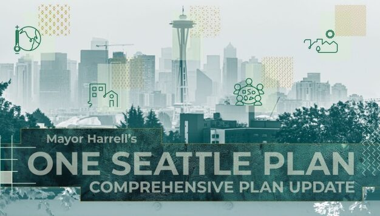
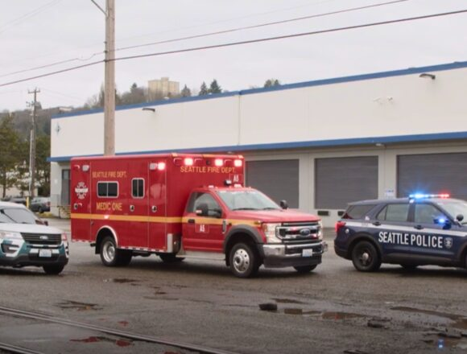

          

 *  [Home](https://council.seattle.gov) 
 *  [News](https://council.seattle.gov/news) 
 *  [Press Releases](https://council.seattle.gov/press-releases) 
 *  [Video](https://council.seattle.gov/video) 
 *  [Councilmembers](https://council.seattle.gov/seattle-city-councilmembers) 
   *  [Rob Saka](https://council.seattle.gov/saka) 
   *  [Mark Solomon](https://council.seattle.gov/solomon) 
   *  [Joy Hollingsworth](https://council.seattle.gov/hollingsworth) 
   *  [Maritza Rivera](https://council.seattle.gov/rivera) 
   *  [Cathy Moore](https://council.seattle.gov/moore) 
   *  [Dan Strauss](https://council.seattle.gov/strauss) 
   *  [Robert Kettle](https://council.seattle.gov/kettle) 
   *  [Alexis Mercedes Rinck](https://council.seattle.gov/rinck) 
   *  [Sara Nelson](https://council.seattle.gov/nelson) 
   *  [Councilmembers (Past)](https://council.seattle.gov/councilmembers-2022) 
 *  [About](https://council.seattle.gov/about) 
    March 07, 2025 March 10, 2025 By [City Council News Releases](https://council.seattle.gov/author/city-council-news-releases)  

##  [Seattle City Council establishes additional meeting dates for Select Committee on the Comprehensive Plan](https://council.seattle.gov/2025/03/07/seattle-city-council-establishes-additional-meeting-dates-for-select-committee-on-the-comprehensive-plan) 

City Councilmember Joy Hollingsworth (District 3), Chair of the Select Committee on the Comprehensive Plan, has issued additional guidance to select committee members following challenges to the Final Environmental Impact Statement. Until now, the Select Committee has received briefings on several aspects of the Mayor’s recommended One Seattle Plan, including the City’s obligations under the Growth Management Act, the Comprehensive...

 April 15, 2025April 15, 2025 In [Councilmember Nelson](https://council.seattle.gov/category/councilmember-nelson) , [Nelson](https://council.seattle.gov/category/news-releases/nelson) , [News](https://council.seattle.gov/category/news) , [News Releases](https://council.seattle.gov/category/news-releases) , [Public Safety](https://council.seattle.gov/category/news/public-safety)  By [City Council News Releases](https://council.seattle.gov/author/city-council-news-releases)  

###  [Council President Sara Nelson statement on passage of new after-hours lounge safety regulations](https://council.seattle.gov/2025/04/15/council-president-sara-nelson-statement-on-passage-of-new-after-hours-lounge-safety-regulations) 

Today, Council President Sara Nelson (Position 9) released the following statement on the 6-0 vote to approve legislation establishing new...

 April 15, 2025April 15, 2025 In [Councilmember Hollingsworth](https://council.seattle.gov/category/councilmember-hollingsworth) , [Councilmember Kettle](https://council.seattle.gov/category/councilmember-kettle) , [Hollingsworth](https://council.seattle.gov/category/news-releases/hollingsworth) , [Kettle](https://council.seattle.gov/category/news-releases/kettle) , [News](https://council.seattle.gov/category/news) , [News Releases](https://council.seattle.gov/category/news-releases) , [Public Safety](https://council.seattle.gov/category/news/public-safety)  By [City Council News Releases](https://council.seattle.gov/author/city-council-news-releases)  

###  [City Council passes new safety regulations for after-hours lounges](https://council.seattle.gov/2025/04/15/city-council-passes-new-safety-regulations-for-after-hours-lounges) 

New regulations developed in collaboration with operators seek to address persistent violence The City Council today voted 6-0 to approve...

 April 3, 2025April 3, 2025 In [Councilmember Nelson](https://council.seattle.gov/category/councilmember-nelson) , [Nelson](https://council.seattle.gov/category/news-releases/nelson) , [News](https://council.seattle.gov/category/news) , [News Releases](https://council.seattle.gov/category/news-releases)  By [City Council News Releases](https://council.seattle.gov/author/city-council-news-releases)  

###  [Council President Sara Nelson statement on Dept. of Health and Human Services cuts and Seattle regional office closure](https://council.seattle.gov/2025/04/03/council-president-sara-nelson-statement-on-dept-of-health-and-human-services-cuts-and-seattle-regional-office-closure) 

Today, Council President Sara Nelson (Position 9) issued the following statement on Tuesday’s closure of the Region 10 office of...

 April 1, 2025April 2, 2025 In [Councilmember Kettle](https://council.seattle.gov/category/councilmember-kettle) , [Councilmember Saka](https://council.seattle.gov/category/councilmember-saka) , [Kettle](https://council.seattle.gov/category/news-releases/kettle) , [News](https://council.seattle.gov/category/news) , [News Releases](https://council.seattle.gov/category/news-releases) , [Public Safety](https://council.seattle.gov/category/news/public-safety) , [Saka](https://council.seattle.gov/category/news-releases/saka)  By [City Council News Releases](https://council.seattle.gov/author/city-council-news-releases)  

###  [City Council approves resolution endorsing holistic approach to public safety](https://council.seattle.gov/2025/04/01/city-council-approves-resolution-endorsing-holistic-approach-to-public-safety) 

Today the City Council adopted a resolution, sponsored by Councilmember Rob Saka (District 1), strengthening Seattle’s commitment to a comprehensive...

 March 28, 2025March 28, 2025 In [Councilmember Rinck](https://council.seattle.gov/category/councilmember-rinck) , [News](https://council.seattle.gov/category/news) , [News Releases](https://council.seattle.gov/category/news-releases) , [Rinck](https://council.seattle.gov/category/news-releases/rinck)  By [City Council News Releases](https://council.seattle.gov/author/city-council-news-releases)  

###  [Seattle City Council to host second committee meeting on safeguarding city from federal policy changes](https://council.seattle.gov/2025/03/28/seattle-city-council-to-host-second-committee-meeting-on-safeguarding-city-from-federal-policy-changes) 

The second Federal Administration and Policy Changes committee meeting focuses on housing issues Seattle City Councilmember Alexis Mercedes Rinck (Position...

 March 25, 2025March 26, 2025 In [Councilmember Moore](https://council.seattle.gov/category/councilmember-moore) , [Councilmember Nelson](https://council.seattle.gov/category/councilmember-nelson) , [Councilmember Rivera](https://council.seattle.gov/category/councilmember-rivera) , [Moore](https://council.seattle.gov/category/news-releases/moore) , [Nelson](https://council.seattle.gov/category/news-releases/nelson) , [News](https://council.seattle.gov/category/news) , [News Releases](https://council.seattle.gov/category/news-releases) , [Rivera](https://council.seattle.gov/category/news-releases/rivera)  By [City Council News Releases](https://council.seattle.gov/author/city-council-news-releases)  

###  [Council President Sara Nelson celebrates passage of Shield Law and other state protections](https://council.seattle.gov/2025/03/25/council-president-sara-nelson-celebrates-passage-of-shield-law-and-other-state-protections) 

Measure taken in direct response to federal actions, resident concerns Today, Council President Sara Nelson (Position 9) praised legislation passed...

 March 25, 2025March 25, 2025 In [Councilmember Kettle](https://council.seattle.gov/category/councilmember-kettle) , [Kettle](https://council.seattle.gov/category/news-releases/kettle) , [News](https://council.seattle.gov/category/news) , [News Releases](https://council.seattle.gov/category/news-releases) , [Public Safety](https://council.seattle.gov/category/news/public-safety)  By [City Council News Releases](https://council.seattle.gov/author/city-council-news-releases)  

###  [City unveils new safety regulations proposal for late night lounges](https://council.seattle.gov/2025/03/25/city-unveils-new-safety-regulations-proposal-for-late-night-lounges) 

Bill seeks to improve safety of patrons and surrounding neighborhood areas Councilmember Bob Kettle (District 7), chair of the Public...

 March 25, 2025March 25, 2025 In [Councilmember Saka](https://council.seattle.gov/category/councilmember-saka) , [News](https://council.seattle.gov/category/news) , [News Releases](https://council.seattle.gov/category/news-releases) , [Public Safety](https://council.seattle.gov/category/news/public-safety) , [Saka](https://council.seattle.gov/category/news-releases/saka)  By [City Council News Releases](https://council.seattle.gov/author/city-council-news-releases)  

###  [Councilmember Saka introduces resolution focused on future of public safety in Seattle](https://council.seattle.gov/2025/03/25/councilmember-saka-introduces-resolution-focused-on-future-of-public-safety-in-seattle) 

Reiterates support for first responders, acknowledges failure of defund movement and embraces focus on underserved communities Today’s 9:30 a.m. meeting...

 March 18, 2025March 19, 2025 In [Councilmember Nelson](https://council.seattle.gov/category/councilmember-nelson) , [Nelson](https://council.seattle.gov/category/news-releases/nelson) , [News](https://council.seattle.gov/category/news) , [News Releases](https://council.seattle.gov/category/news-releases)  By [City Council News Releases](https://council.seattle.gov/author/city-council-news-releases)  

###  [Council approves Nelson’s workforce housing bill](https://council.seattle.gov/2025/03/18/council-approves-nelsons-workforce-housing-bill) 

Allows much-needed affordable housing and workspace in Stadium District Today the City Council passed Council President Sara Nelson’s (Position 9)...

 March 18, 2025March 18, 2025 In [Councilmember Rinck](https://council.seattle.gov/category/councilmember-rinck) , [Councilmember Strauss](https://council.seattle.gov/category/councilmember-strauss) , [News](https://council.seattle.gov/category/news) , [News Releases](https://council.seattle.gov/category/news-releases) , [Rinck](https://council.seattle.gov/category/news-releases/rinck) , [Strauss](https://council.seattle.gov/category/news-releases/strauss)  By [City Council News Releases](https://council.seattle.gov/author/city-council-news-releases)  

###  [Councilmembers call to reschedule Stadium District rezone vote after receiving 9 new amendments yesterday](https://council.seattle.gov/2025/03/18/councilmembers-call-to-reschedule-stadium-district-rezone-vote-after-receiving-9-new-amendments-yesterday) 

Seattle City Councilmembers Dan Strauss (District 6) and Alexis Mercedes Rinck (Position 8) are requesting to reschedule the Stadium District...

 March 17, 2025March 17, 2025 In [Councilmember Kettle](https://council.seattle.gov/category/councilmember-kettle) , [News](https://council.seattle.gov/category/news)  By [Bob Kettle](https://council.seattle.gov/author/bob-kettle)  

###  [The Port, Industrial Lands, Freight, and Housing – The Wrong Place at the Wrong Time](https://council.seattle.gov/2025/03/17/the-port-industrial-lands-freight-and-housing-the-wrong-place-at-the-wrong-time) 

In 2016, during the Seattle City Council meeting which would decide on a street vacation allowing Chris Hansen to develop...

 March 7, 2025March 11, 2025 In [Councilmember Nelson](https://council.seattle.gov/category/councilmember-nelson) , [News](https://council.seattle.gov/category/news)  By [City Council Staff](https://council.seattle.gov/author/councilconnection)  

###  [Workforce Housing in the Stadium District](https://council.seattle.gov/2025/03/07/workforce-housing-in-the-stadium-district) 

Seattle’s in the midst of a housing affordability crisis and small manufacturing businesses are leaving town for lack of affordable...

##  [PRESS RELEASES](https://council.seattle.gov/press-releases) 

 April 15, 2025April 15, 2025 

###  [Council President Sara Nelson statement on passage of new after-hours lounge safety regulations](https://council.seattle.gov/2025/04/15/council-president-sara-nelson-statement-on-passage-of-new-after-hours-lounge-safety-regulations) 

 April 15, 2025April 15, 2025 

###  [City Council passes new safety regulations for after-hours lounges](https://council.seattle.gov/2025/04/15/city-council-passes-new-safety-regulations-for-after-hours-lounges) 

 April 3, 2025April 3, 2025 

###  [Council President Sara Nelson statement on Dept. of Health and Human Services cuts and Seattle regional office closure](https://council.seattle.gov/2025/04/03/council-president-sara-nelson-statement-on-dept-of-health-and-human-services-cuts-and-seattle-regional-office-closure) 

 April 1, 2025April 2, 2025 

###  [City Council approves resolution endorsing holistic approach to public safety](https://council.seattle.gov/2025/04/01/city-council-approves-resolution-endorsing-holistic-approach-to-public-safety) 

 March 28, 2025March 28, 2025 

###  [Seattle City Council to host second committee meeting on safeguarding city from federal policy changes](https://council.seattle.gov/2025/03/28/seattle-city-council-to-host-second-committee-meeting-on-safeguarding-city-from-federal-policy-changes) 

 March 25, 2025March 26, 2025 

###  [Council President Sara Nelson celebrates passage of Shield Law and other state protections](https://council.seattle.gov/2025/03/25/council-president-sara-nelson-celebrates-passage-of-shield-law-and-other-state-protections) 

 March 25, 2025March 25, 2025 

###  [City unveils new safety regulations proposal for late night lounges](https://council.seattle.gov/2025/03/25/city-unveils-new-safety-regulations-proposal-for-late-night-lounges) 

 March 25, 2025March 25, 2025 

###  [Councilmember Saka introduces resolution focused on future of public safety in Seattle](https://council.seattle.gov/2025/03/25/councilmember-saka-introduces-resolution-focused-on-future-of-public-safety-in-seattle) 

######  [View More Releases](https://council.seattle.gov/?page_id=18133) 

##  [COUNCILMEMBER BLOGS](https://council.seattle.gov/seattle-city-councilmembers) 

 April 15, 2025 April 15, 2025 

###  [Council President Sara Nelson statement on passage of new after-hours lounge safety regulations](https://council.seattle.gov/2025/04/15/council-president-sara-nelson-statement-on-passage-of-new-after-hours-lounge-safety-regulations) 

Today, Council President Sara Nelson (Position 9) released the following statement on the 6-0 vote to approve legislation establishing new...

  [Read More](https://council.seattle.gov/2025/04/15/council-president-sara-nelson-statement-on-passage-of-new-after-hours-lounge-safety-regulations)  April 15, 2025 April 15, 2025 

###  [City Council passes new safety regulations for after-hours lounges](https://council.seattle.gov/2025/04/15/city-council-passes-new-safety-regulations-for-after-hours-lounges) 

New regulations developed in collaboration with operators seek to address persistent violence The City Council today voted 6-0 to approve...

  [Read More](https://council.seattle.gov/2025/04/15/city-council-passes-new-safety-regulations-for-after-hours-lounges)  April 03, 2025 April 3, 2025 

###  [Council President Sara Nelson statement on Dept. of Health and Human Services cuts and Seattle regional office closure](https://council.seattle.gov/2025/04/03/council-president-sara-nelson-statement-on-dept-of-health-and-human-services-cuts-and-seattle-regional-office-closure) 

Today, Council President Sara Nelson (Position 9) issued the following statement on Tuesday’s closure of the Region 10 office of...

  [Read More](https://council.seattle.gov/2025/04/03/council-president-sara-nelson-statement-on-dept-of-health-and-human-services-cuts-and-seattle-regional-office-closure)     April 01, 2025 April 2, 2025 

###  [City Council approves resolution endorsing holistic approach to public safety](https://council.seattle.gov/2025/04/01/city-council-approves-resolution-endorsing-holistic-approach-to-public-safety) 

Today the City Council adopted a resolution, sponsored by Councilmember Rob Saka (District 1), strengthening Seattle’s commitment to a comprehensive...

  [Read More](https://council.seattle.gov/2025/04/01/city-council-approves-resolution-endorsing-holistic-approach-to-public-safety)  

 *  1 
 *  [2](https://council.seattle.gov/page/2) 
 *  … 
 *  [50](https://council.seattle.gov/page/50) 
 *  [Next](https://council.seattle.gov/page/2) 

  

### HELPFUL LINKS

 *  [Meet the Council](https://seattle.gov/council/meet-the-council) 
 *  [Mayor’s Office](https://seattle.gov/mayor) 
 *  [Council Calendar](https://seattle.gov/council/calendar) 
 *  [Council Agendas](https://seattle.legistar.com/Calendar.aspx) 
 *  [Council Committees](https://seattle.gov/council/committees) 
 *  [Watch Council Live](https://seattle.gov/council/watch-council-live) 

### Make your voice heard

 [Find Your Council District](https://www.seattle.gov/cityclerk/agendas-and-legislative-resources/find-your-council-district) 

 [Contact the Council](https://www.seattle.gov/cityclerk/agendas-and-legislative-resources/city-council-agendas/contact-the-city-council) 

 [Sign up for Public Comment](https://www.seattle.gov/council/committees/public-comment#:~:text=Register%20to%20speak%20on%20the,be%20recognized%20by%20the%20Chair.) 

 [Register to Vote](https://kingcounty.gov/depts/elections/how-to-vote/register-to-vote.aspx) 

### Councilmembers

 *  [Rob Saka](https://seattle.gov/council/meet-the-council/rob-saka) 
 *  [Joy Hollingsworth](https://seattle.gov/council/meet-the-council/joy-hollingsworth) 
 *  [Maritza Rivera](https://seattle.gov/council/meet-the-council/maritza-rivera) 
 *  [Cathy Moore](https://seattle.gov/council/meet-the-council/cathy-moore) 
 *  [Dan Strauss](https://seattle.gov/council/strauss) 
 *  [Robert Kettle](https://seattle.gov/council/meet-the-council/robert-kettle) 
 *  [Alexis Mercedes Rinck](https://seattle.gov/council/rinck) 
 *  [Sara Nelson](https://seattle.gov/council/meet-the-council/sara-nelson) 
    The official blog of the Seattle City Council 7ads6x98y 