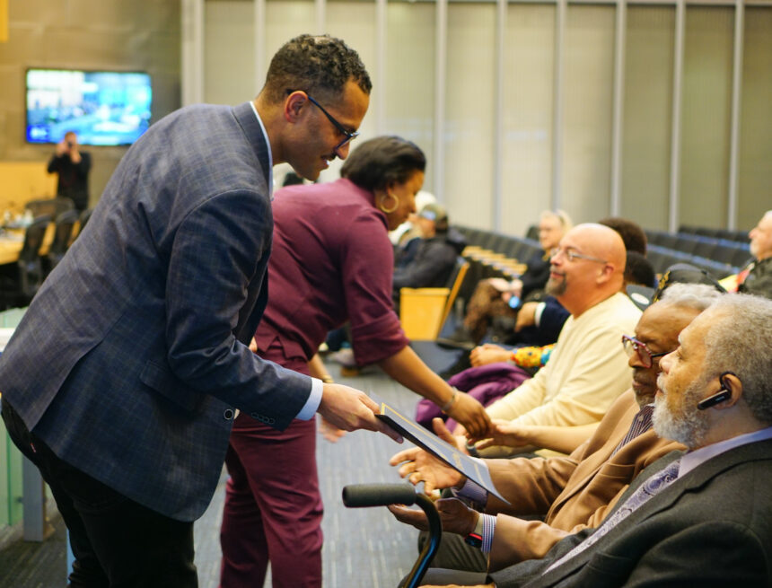

          

 *  [Home](https://council.seattle.gov) 
 *  [News](https://council.seattle.gov/news) 
 *  [Press Releases](https://council.seattle.gov/press-releases) 
 *  [Video](https://council.seattle.gov/video) 
 *  [Councilmembers](https://council.seattle.gov/seattle-city-councilmembers) 
   *  [Rob Saka](https://council.seattle.gov/saka) 
   *  [Mark Solomon](https://council.seattle.gov/solomon) 
   *  [Joy Hollingsworth](https://council.seattle.gov/hollingsworth) 
   *  [Maritza Rivera](https://council.seattle.gov/rivera) 
   *  [Cathy Moore](https://council.seattle.gov/moore) 
   *  [Dan Strauss](https://council.seattle.gov/strauss) 
   *  [Robert Kettle](https://council.seattle.gov/kettle) 
   *  [Alexis Mercedes Rinck](https://council.seattle.gov/rinck) 
   *  [Sara Nelson](https://council.seattle.gov/nelson) 
   *  [Councilmembers (Past)](https://council.seattle.gov/councilmembers-2022) 
 *  [About](https://council.seattle.gov/about) 

# Joy Hollingsworth

  [Home](https://council.seattle.gov)  » Joy Hollingsworth    

# Blog Posts from Councilmember Hollingsworth

 April 15, 2025 April 15, 2025  [Councilmember Hollingsworth](https://council.seattle.gov/category/councilmember-hollingsworth) , [Councilmember Kettle](https://council.seattle.gov/category/councilmember-kettle) , [Hollingsworth](https://council.seattle.gov/category/news-releases/hollingsworth) , [Kettle](https://council.seattle.gov/category/news-releases/kettle) , [News](https://council.seattle.gov/category/news) , [News Releases](https://council.seattle.gov/category/news-releases) , [Public Safety](https://council.seattle.gov/category/news/public-safety)  By [City Council News Releases](https://council.seattle.gov/author/city-council-news-releases)   [0](https://council.seattle.gov/hollingsworth)  

##  [City Council passes new safety regulations for after-hours lounges](https://council.seattle.gov/2025/04/15/city-council-passes-new-safety-regulations-for-after-hours-lounges) 

New regulations developed in collaboration with operators seek to address persistent violence The City Council today voted 6-0 to approve a new amended ordinance relating to regulation of after-hours nightlife lounges that are open between the hours of 2 a.m. and 6 a.m. In light of a recent double murder at a nightclub in Rainier Beach and other late-night establishments...

  [Read More](https://council.seattle.gov/2025/04/15/city-council-passes-new-safety-regulations-for-after-hours-lounges)     March 07, 2025 March 10, 2025  [Comprehensive Plan](https://council.seattle.gov/category/news/comprehensive-plan) , [Councilmember Hollingsworth](https://council.seattle.gov/category/councilmember-hollingsworth) , [Hollingsworth](https://council.seattle.gov/category/news-releases/hollingsworth) , [News](https://council.seattle.gov/category/news) , [News Releases](https://council.seattle.gov/category/news-releases) , [Top Story](https://council.seattle.gov/category/top-story)  By [City Council News Releases](https://council.seattle.gov/author/city-council-news-releases)   [0](https://council.seattle.gov/hollingsworth)  

##  [Seattle City Council establishes additional meeting dates for Select Committee on the Comprehensive Plan](https://council.seattle.gov/2025/03/07/seattle-city-council-establishes-additional-meeting-dates-for-select-committee-on-the-comprehensive-plan) 

City Councilmember Joy Hollingsworth (District 3), Chair of the Select Committee on the Comprehensive Plan, has issued additional guidance to select committee members following challenges to the Final Environmental Impact Statement. Until now, the Select Committee has received briefings on several aspects of the Mayor’s recommended One Seattle Plan, including the City’s obligations under the Growth Management Act, the Comprehensive...

  [Read More](https://council.seattle.gov/2025/03/07/seattle-city-council-establishes-additional-meeting-dates-for-select-committee-on-the-comprehensive-plan)  February 06, 2025 February 6, 2025  [Councilmember Hollingsworth](https://council.seattle.gov/category/councilmember-hollingsworth) , [Hollingsworth](https://council.seattle.gov/category/news-releases/hollingsworth) , [News](https://council.seattle.gov/category/news) , [News Releases](https://council.seattle.gov/category/news-releases)  By [City Council News Releases](https://council.seattle.gov/author/city-council-news-releases)   [0](https://council.seattle.gov/hollingsworth)  

##  [Chair Hollingsworth urges public to remain engaged on Comprehensive Plan process](https://council.seattle.gov/2025/02/06/chair-hollingsworth-urges-public-to-remain-engaged-on-comprehensive-plan-process) 

Additional public hearings will be scheduled and continuous public engagement opportunities are available On Thursday Councilmember Joy Hollingsworth (District 3), who chairs the Select Committee for the Comprehensive Plan, issued the following statement: First and foremost, I want to thank the hundreds of Seattleites who took the time to provide comments at last night’s public hearing on the Comprehensive Plan....

  [Read More](https://council.seattle.gov/2025/02/06/chair-hollingsworth-urges-public-to-remain-engaged-on-comprehensive-plan-process)  December 16, 2024 December 16, 2024  [Councilmember Hollingsworth](https://council.seattle.gov/category/councilmember-hollingsworth) , [Hollingsworth](https://council.seattle.gov/category/news-releases/hollingsworth) , [News](https://council.seattle.gov/category/news) , [News Releases](https://council.seattle.gov/category/news-releases)  By [City Council News Releases](https://council.seattle.gov/author/city-council-news-releases)   [0](https://council.seattle.gov/hollingsworth)  

##  [Councilmember Hollingsworth to lead Select Committee on Comprehensive Plan for 2025](https://council.seattle.gov/2024/12/16/councilmember-hollingsworth-to-lead-select-committee-on-comprehensive-plan-for-2025) 

Today, Councilmember Joy Hollingsworth (District 3) agreed to lead the Select Committee on the Comprehensive Plan following the announced departure of Councilmember Tammy Morales (District 2) on Jan. 6, 2025. She released the following statement:  “Seattle’s comprehensive plan is an opportunity for us to shape what type of city we want to live in for the next twenty years. Throughout...

  [Read More](https://council.seattle.gov/2024/12/16/councilmember-hollingsworth-to-lead-select-committee-on-comprehensive-plan-for-2025)  November 21, 2024 November 21, 2024  [Budget](https://council.seattle.gov/category/news/budget) , [Councilmember Hollingsworth](https://council.seattle.gov/category/councilmember-hollingsworth) , [Hollingsworth](https://council.seattle.gov/category/news-releases/hollingsworth) , [News](https://council.seattle.gov/category/news) , [News Releases](https://council.seattle.gov/category/news-releases)  By [City Council News Releases](https://council.seattle.gov/author/city-council-news-releases)   [0](https://council.seattle.gov/hollingsworth)  

##  [Councilmember Hollingsworth secures over $15 million for public safety, the arts, and economic opportunity in 2025-26 budget](https://council.seattle.gov/2024/11/21/councilmember-hollingsworth-secures-over-15-million-for-public-safety-the-arts-and-economic-opportunity-in-2025-26-budget) 

Today, Councilmember Joy Hollingsworth (District 3) secured over $15 million in funding for investments in arts, culture, economic opportunity, legacy homeownership, and youth homelessness services as part of Seattle’s 2025-2026 budget.   “I am grateful to my council colleagues for supporting my investments in the fundamentals for our community. I am proud of the investments that were made directly in District...

  [Read More](https://council.seattle.gov/2024/11/21/councilmember-hollingsworth-secures-over-15-million-for-public-safety-the-arts-and-economic-opportunity-in-2025-26-budget)     February 07, 2024 February 10, 2024  [Councilmember Hollingsworth](https://council.seattle.gov/category/councilmember-hollingsworth) , [Councilmember Saka](https://council.seattle.gov/category/councilmember-saka) , [News](https://council.seattle.gov/category/news) , [Top Story](https://council.seattle.gov/category/top-story)  By [Jesse Franz](https://council.seattle.gov/author/jesse)   [0](https://council.seattle.gov/hollingsworth)  

##  [Seattle City Council proclamation celebrates Black History Month, city’s historic Black leaders](https://council.seattle.gov/2024/02/07/seattle-city-council-proclamation-celebrates-black-history-month-citys-historic-black-leaders) 

Seattle City Councilmembers Rob Saka (District 1) and Joy Hollingsworth (District 3) brought forward a proclamation Tuesday recognizing this February as Black History Month in Seattle and celebrating Black trailblazers throughout the city’s history. Mayor Bruce Harrell and every member of the Seattle City Council in attendance signed on to the proclamation. You can watch it being discussed and delivered...

  [Read More](https://council.seattle.gov/2024/02/07/seattle-city-council-proclamation-celebrates-black-history-month-citys-historic-black-leaders)     January 30, 2024 January 30, 2024  [Councilmember Hollingsworth](https://council.seattle.gov/category/councilmember-hollingsworth)  By [Joy Hollingsworth](https://council.seattle.gov/author/joy-hollingsworth)   [0](https://council.seattle.gov/hollingsworth)  

##  [Seattle City Councilmember Hollingsworth Sends Letter to Washington State Liquor and Cannabis Board following Raids on LGBTQ+ Establishments](https://council.seattle.gov/2024/01/30/seattle-city-councilmember-hollingsworth-sends-letter-to-washington-state-liquor-and-cannabis-board-following-raids-on-lgbtq-establishments) 

Following reports of raids at LGBTQ+ Establishments on Capitol Hill, Councilmember Hollingsworth (District 3) wrote the following letter to Director Lukela and members of the Washington State Liquor and Cannabis Board, requesting more information on the tactics employed over the weekend: Director Lukela and Members of the Liquor and Cannabis Board,  It was brought to my attention that the Liquor...

  [Read More](https://council.seattle.gov/2024/01/30/seattle-city-councilmember-hollingsworth-sends-letter-to-washington-state-liquor-and-cannabis-board-following-raids-on-lgbtq-establishments)     January 02, 2024 January 2, 2024  [Councilmember Hollingsworth](https://council.seattle.gov/category/councilmember-hollingsworth) , [Councilmember Kettle](https://council.seattle.gov/category/councilmember-kettle) , [Councilmember Moore](https://council.seattle.gov/category/councilmember-moore) , [Councilmember Morales](https://council.seattle.gov/category/councilmember-morales) , [Councilmember Nelson](https://council.seattle.gov/category/councilmember-nelson) , [Councilmember Rivera](https://council.seattle.gov/category/councilmember-rivera) , [Councilmember Saka](https://council.seattle.gov/category/councilmember-saka) , [Councilmember Strauss](https://council.seattle.gov/category/councilmember-strauss) , [Hollingsworth](https://council.seattle.gov/category/news-releases/hollingsworth) , [Kettle](https://council.seattle.gov/category/news-releases/kettle) , [Moore](https://council.seattle.gov/category/news-releases/moore) , [Morales](https://council.seattle.gov/category/news-releases/morales) , [Nelson](https://council.seattle.gov/category/news-releases/nelson) , [News Releases](https://council.seattle.gov/category/news-releases) , [Rivera](https://council.seattle.gov/category/news-releases/rivera) , [Saka](https://council.seattle.gov/category/news-releases/saka) , [Strauss](https://council.seattle.gov/category/news-releases/strauss)  By [City Council News Releases](https://council.seattle.gov/author/city-council-news-releases)   [0](https://council.seattle.gov/hollingsworth)  

##  [New Seattle City Councilmembers sworn-in during inauguration ceremony at City Hall](https://council.seattle.gov/2024/01/02/new-seattle-city-councilmembers-sworn-in-during-inauguration-city-hall) 

The seven winning candidates from November’s General Election were just sworn-in as Seattle City Councilmembers. Five of the seven individuals are new councilmembers, the most in more than a century. Two others are returning for their second term in office. More information about each of them, including quotes can be found below. Rob Saka (District 1) “We have a once-in-a-generation...

  [Read More](https://council.seattle.gov/2024/01/02/new-seattle-city-councilmembers-sworn-in-during-inauguration-city-hall)  

 __Learn more about Councilmember Hollingsworth:__ 

 [Visit her website](https://www.seattle.gov/council/hollingsworth) 

 [Sign up for her newsletter](https://seattle.us12.list-manage.com/subscribe?u=11a79978ca7225050bfabf7ad&id=95e60b79b0) 

# News Releases

 April 15, 2025April 15, 2025 

###  [City Council passes new safety regulations for after-hours lounges](https://council.seattle.gov/2025/04/15/city-council-passes-new-safety-regulations-for-after-hours-lounges) 

New regulations developed in collaboration with operators seek to address persistent violence The City Council today voted 6-0 to approve...

  [Read More](https://council.seattle.gov/2025/04/15/city-council-passes-new-safety-regulations-for-after-hours-lounges)  March 7, 2025March 10, 2025 

###  [Seattle City Council establishes additional meeting dates for Select Committee on the Comprehensive Plan](https://council.seattle.gov/2025/03/07/seattle-city-council-establishes-additional-meeting-dates-for-select-committee-on-the-comprehensive-plan) 

City Councilmember Joy Hollingsworth (District 3), Chair of the Select Committee on the Comprehensive Plan, has issued additional guidance to...

  [Read More](https://council.seattle.gov/2025/03/07/seattle-city-council-establishes-additional-meeting-dates-for-select-committee-on-the-comprehensive-plan)  February 6, 2025February 6, 2025 

###  [Chair Hollingsworth urges public to remain engaged on Comprehensive Plan process](https://council.seattle.gov/2025/02/06/chair-hollingsworth-urges-public-to-remain-engaged-on-comprehensive-plan-process) 

Additional public hearings will be scheduled and continuous public engagement opportunities are available On Thursday Councilmember Joy Hollingsworth (District 3),...

  [Read More](https://council.seattle.gov/2025/02/06/chair-hollingsworth-urges-public-to-remain-engaged-on-comprehensive-plan-process)  December 16, 2024December 16, 2024 

###  [Councilmember Hollingsworth to lead Select Committee on Comprehensive Plan for 2025](https://council.seattle.gov/2024/12/16/councilmember-hollingsworth-to-lead-select-committee-on-comprehensive-plan-for-2025) 

Today, Councilmember Joy Hollingsworth (District 3) agreed to lead the Select Committee on the Comprehensive Plan following the announced departure...

  [Read More](https://council.seattle.gov/2024/12/16/councilmember-hollingsworth-to-lead-select-committee-on-comprehensive-plan-for-2025)  

  

### HELPFUL LINKS

 *  [Meet the Council](https://seattle.gov/council/meet-the-council) 
 *  [Mayor’s Office](https://seattle.gov/mayor) 
 *  [Council Calendar](https://seattle.gov/council/calendar) 
 *  [Council Agendas](https://seattle.legistar.com/Calendar.aspx) 
 *  [Council Committees](https://seattle.gov/council/committees) 
 *  [Watch Council Live](https://seattle.gov/council/watch-council-live) 

### Make your voice heard

 [Find Your Council District](https://www.seattle.gov/cityclerk/agendas-and-legislative-resources/find-your-council-district) 

 [Contact the Council](https://www.seattle.gov/cityclerk/agendas-and-legislative-resources/city-council-agendas/contact-the-city-council) 

 [Sign up for Public Comment](https://www.seattle.gov/council/committees/public-comment#:~:text=Register%20to%20speak%20on%20the,be%20recognized%20by%20the%20Chair.) 

 [Register to Vote](https://kingcounty.gov/depts/elections/how-to-vote/register-to-vote.aspx) 

### Councilmembers

 *  [Rob Saka](https://seattle.gov/council/meet-the-council/rob-saka) 
 *  [Joy Hollingsworth](https://seattle.gov/council/meet-the-council/joy-hollingsworth) 
 *  [Maritza Rivera](https://seattle.gov/council/meet-the-council/maritza-rivera) 
 *  [Cathy Moore](https://seattle.gov/council/meet-the-council/cathy-moore) 
 *  [Dan Strauss](https://seattle.gov/council/strauss) 
 *  [Robert Kettle](https://seattle.gov/council/meet-the-council/robert-kettle) 
 *  [Alexis Mercedes Rinck](https://seattle.gov/council/rinck) 
 *  [Sara Nelson](https://seattle.gov/council/meet-the-council/sara-nelson) 
    The official blog of the Seattle City Council 7ads6x98y 