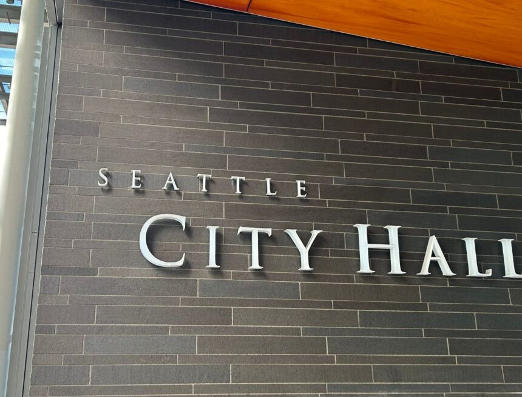

          

 *  [Home](https://council.seattle.gov) 
 *  [News](https://council.seattle.gov/news) 
 *  [Press Releases](https://council.seattle.gov/press-releases) 
 *  [Video](https://council.seattle.gov/video) 
 *  [Councilmembers](https://council.seattle.gov/seattle-city-councilmembers) 
   *  [Rob Saka](https://council.seattle.gov/saka) 
   *  [Mark Solomon](https://council.seattle.gov/solomon) 
   *  [Joy Hollingsworth](https://council.seattle.gov/hollingsworth) 
   *  [Maritza Rivera](https://council.seattle.gov/rivera) 
   *  [Cathy Moore](https://council.seattle.gov/moore) 
   *  [Dan Strauss](https://council.seattle.gov/strauss) 
   *  [Robert Kettle](https://council.seattle.gov/kettle) 
   *  [Alexis Mercedes Rinck](https://council.seattle.gov/rinck) 
   *  [Sara Nelson](https://council.seattle.gov/nelson) 
   *  [Councilmembers (Past)](https://council.seattle.gov/councilmembers-2022) 
 *  [About](https://council.seattle.gov/about) 

# Sara Nelson

  [Home](https://council.seattle.gov)  » Sara Nelson    

# News Releases from Councilmember Nelson

 April 15, 2025 April 15, 2025  [Councilmember Nelson](https://council.seattle.gov/category/councilmember-nelson) , [Nelson](https://council.seattle.gov/category/news-releases/nelson) , [News](https://council.seattle.gov/category/news) , [News Releases](https://council.seattle.gov/category/news-releases) , [Public Safety](https://council.seattle.gov/category/news/public-safety)  By [City Council News Releases](https://council.seattle.gov/author/city-council-news-releases)   [0](https://council.seattle.gov/nelson)  

##  [Council President Sara Nelson statement on passage of new after-hours lounge safety regulations](https://council.seattle.gov/2025/04/15/council-president-sara-nelson-statement-on-passage-of-new-after-hours-lounge-safety-regulations) 

Today, Council President Sara Nelson (Position 9) released the following statement on the 6-0 vote to approve legislation establishing new safety regulations for nightlife lounges operating after 2 a.m. Over the past decade, there have been dozens of shootings and homicides that have occurred in connection with these venues. CB 120956 was co-sponsored by Council President Nelson. “Unregulated after-hours lounges...

  [Read More](https://council.seattle.gov/2025/04/15/council-president-sara-nelson-statement-on-passage-of-new-after-hours-lounge-safety-regulations)  April 03, 2025 April 3, 2025  [Councilmember Nelson](https://council.seattle.gov/category/councilmember-nelson) , [Nelson](https://council.seattle.gov/category/news-releases/nelson) , [News](https://council.seattle.gov/category/news) , [News Releases](https://council.seattle.gov/category/news-releases)  By [City Council News Releases](https://council.seattle.gov/author/city-council-news-releases)   [0](https://council.seattle.gov/nelson)  

##  [Council President Sara Nelson statement on Dept. of Health and Human Services cuts and Seattle regional office closure](https://council.seattle.gov/2025/04/03/council-president-sara-nelson-statement-on-dept-of-health-and-human-services-cuts-and-seattle-regional-office-closure) 

Today, Council President Sara Nelson (Position 9) issued the following statement on Tuesday’s closure of the Region 10 office of the Department of Health and Human Services (HHS) in Seattle. The HHS Region 10 office serves Washington, Oregon, Idaho, and Alaska. “This level of funding and staff cuts to public health services is unconscionable. This will hurt Seattle. There’s no...

  [Read More](https://council.seattle.gov/2025/04/03/council-president-sara-nelson-statement-on-dept-of-health-and-human-services-cuts-and-seattle-regional-office-closure)  March 25, 2025 March 26, 2025  [Councilmember Moore](https://council.seattle.gov/category/councilmember-moore) , [Councilmember Nelson](https://council.seattle.gov/category/councilmember-nelson) , [Councilmember Rivera](https://council.seattle.gov/category/councilmember-rivera) , [Moore](https://council.seattle.gov/category/news-releases/moore) , [Nelson](https://council.seattle.gov/category/news-releases/nelson) , [News](https://council.seattle.gov/category/news) , [News Releases](https://council.seattle.gov/category/news-releases) , [Rivera](https://council.seattle.gov/category/news-releases/rivera)  By [City Council News Releases](https://council.seattle.gov/author/city-council-news-releases)   [0](https://council.seattle.gov/nelson)  

##  [Council President Sara Nelson celebrates passage of Shield Law and other state protections](https://council.seattle.gov/2025/03/25/council-president-sara-nelson-celebrates-passage-of-shield-law-and-other-state-protections) 

Measure taken in direct response to federal actions, resident concerns Today, Council President Sara Nelson (Position 9) praised legislation passed by the full Council strengthening protections from harmful federal actions, specifically for people seeking reproductive health care and gender-affirming treatment. The amended bill, co-sponsored with Councilmember Cathy Moore (District 5) and Councilmember Maritza Rivera (District 4), creates a firewall preventing...

  [Read More](https://council.seattle.gov/2025/03/25/council-president-sara-nelson-celebrates-passage-of-shield-law-and-other-state-protections)     March 18, 2025 March 19, 2025  [Councilmember Nelson](https://council.seattle.gov/category/councilmember-nelson) , [Nelson](https://council.seattle.gov/category/news-releases/nelson) , [News](https://council.seattle.gov/category/news) , [News Releases](https://council.seattle.gov/category/news-releases)  By [City Council News Releases](https://council.seattle.gov/author/city-council-news-releases)   [0](https://council.seattle.gov/nelson)  

##  [Council approves Nelson’s workforce housing bill](https://council.seattle.gov/2025/03/18/council-approves-nelsons-workforce-housing-bill) 

Allows much-needed affordable housing and workspace in Stadium District Today the City Council passed Council President Sara Nelson’s (Position 9) amended “Stadium Makers’” bill, that will now allow the construction of workforce housing and affordable workspaces for Seattle’s small manufacturing businesses, generate living-wage union jobs and improve public safety in a two-block stretch of the Stadium District just south of...

  [Read More](https://council.seattle.gov/2025/03/18/council-approves-nelsons-workforce-housing-bill)     March 07, 2025 March 11, 2025  [Councilmember Nelson](https://council.seattle.gov/category/councilmember-nelson) , [News](https://council.seattle.gov/category/news)  By [City Council Staff](https://council.seattle.gov/author/councilconnection)   [0](https://council.seattle.gov/nelson)  

##  [Workforce Housing in the Stadium District](https://council.seattle.gov/2025/03/07/workforce-housing-in-the-stadium-district) 

Seattle’s in the midst of a housing affordability crisis and small manufacturing businesses are leaving town for lack of affordable commercial space. I’m advancing a widely-supported proposal that will help solve for both at no cost to the City – what’s not to like about that? Learn the facts below. Council Bill 120933 would allow construction of workforce housing and...

  [Read More](https://council.seattle.gov/2025/03/07/workforce-housing-in-the-stadium-district)     March 05, 2025 March 11, 2025  [Councilmember Nelson](https://council.seattle.gov/category/councilmember-nelson) , [Nelson](https://council.seattle.gov/category/news-releases/nelson) , [News](https://council.seattle.gov/category/news) , [News Releases](https://council.seattle.gov/category/news-releases)  By [City Council News Releases](https://council.seattle.gov/author/city-council-news-releases)   [0](https://council.seattle.gov/nelson)  

##  [Council President Nelson details efforts to protect Seattle from Trump’s attacks](https://council.seattle.gov/2025/03/05/council-president-nelson-details-efforts-to-protect-seattle-from-trumps-attacks) 

Today, Council President Sara Nelson (Position 9) issued the following release ahead of the first meeting of the Select Committee on Federal Administration and Policy Changes. Council President Nelson established this new committee to identify and defend against emerging federal policies that threaten City programs and funding.   “Trump’s chaos campaign in Washington D.C. is intended to create fear and...

  [Read More](https://council.seattle.gov/2025/03/05/council-president-nelson-details-efforts-to-protect-seattle-from-trumps-attacks)  February 27, 2025 March 17, 2025  [Councilmember Nelson](https://council.seattle.gov/category/councilmember-nelson) , [Nelson](https://council.seattle.gov/category/news-releases/nelson) , [News](https://council.seattle.gov/category/news) , [News Releases](https://council.seattle.gov/category/news-releases)  By [City Council News Releases](https://council.seattle.gov/author/city-council-news-releases)   [0](https://council.seattle.gov/nelson)  

##  [Council President counters Port opposition to Stadium District Housing Bill, urges passage](https://council.seattle.gov/2025/02/27/council-president-counters-port-opposition-to-stadium-district-housing-bill-urges-passage) 

Committee to consider voting on proposal this afternoon Seattle City Council President Sara Nelson (Position 9), issued the following statement today in response to the Port of Seattle’s opposition to Council Bill 120933,which allows for critically needed workforce housing to be built near T-Mobile Park and Lumen Field. The legislation is scheduled for a possible vote in the Council’s Governance,...

  [Read More](https://council.seattle.gov/2025/02/27/council-president-counters-port-opposition-to-stadium-district-housing-bill-urges-passage)  February 11, 2025 February 11, 2025  [Councilmember Kettle](https://council.seattle.gov/category/councilmember-kettle) , [Councilmember Nelson](https://council.seattle.gov/category/councilmember-nelson) , [Kettle](https://council.seattle.gov/category/news-releases/kettle) , [Nelson](https://council.seattle.gov/category/news-releases/nelson) , [News](https://council.seattle.gov/category/news) , [News Releases](https://council.seattle.gov/category/news-releases) , [Public Safety](https://council.seattle.gov/category/news/public-safety)  By [City Council News Releases](https://council.seattle.gov/author/city-council-news-releases)   [0](https://council.seattle.gov/nelson)  

##  [Council passes updated guidance for crowd management, sets the stage for end of federal consent decree](https://council.seattle.gov/2025/02/11/council-passes-updated-guidance-for-crowd-management-sets-the-stage-for-end-of-federal-consent-decree) 

The City Council voted 6-3 today to approve final legislation on crowd management guidelines for the Seattle Police Department (SPD). The updated guidelines include several amendments intended to provide additional oversight and accountability, including checks on the use of blast balls. “The crowd management guidelines we passed today strike an important balance of giving our police officers flexibility to keep...

  [Read More](https://council.seattle.gov/2025/02/11/council-passes-updated-guidance-for-crowd-management-sets-the-stage-for-end-of-federal-consent-decree)  January 31, 2025 January 31, 2025  [Councilmember Nelson](https://council.seattle.gov/category/councilmember-nelson) , [Nelson](https://council.seattle.gov/category/news-releases/nelson) , [News](https://council.seattle.gov/category/news) , [News Releases](https://council.seattle.gov/category/news-releases)  By [City Council News Releases](https://council.seattle.gov/author/city-council-news-releases)   [0](https://council.seattle.gov/nelson)  

##  [Council President Nelson forms committee to address federal instability, protect Seattle residents](https://council.seattle.gov/2025/01/31/council-president-nelson-forms-committee-to-address-federal-instability-protect-seattle-residents) 

Today Council President Sara Nelson (Position 9) announced that she will stand up a special committee on federal policy changes. In a statement she provided the following details: It’s my responsibility as an elected official and as Seattle City Council President to make sure every one of my constituents feels safe, particularly our most vulnerable communities who are being targeted...

  [Read More](https://council.seattle.gov/2025/01/31/council-president-nelson-forms-committee-to-address-federal-instability-protect-seattle-residents)  January 15, 2025 January 15, 2025  [Councilmember Nelson](https://council.seattle.gov/category/councilmember-nelson) , [Nelson](https://council.seattle.gov/category/news-releases/nelson) , [News](https://council.seattle.gov/category/news) , [News Releases](https://council.seattle.gov/category/news-releases)  By [City Council News Releases](https://council.seattle.gov/author/city-council-news-releases)   [0](https://council.seattle.gov/nelson)  

##  [Council President Nelson introduces legislation allowing workforce housing in Stadium District ](https://council.seattle.gov/2025/01/15/council-president-nelson-introduces-legislation-allowing-workforce-housing-in-stadium-district) 

Seattle City Council President Sara Nelson (Position 9) yesterday introduced legislation to allow workforce housing to be built near T-Mobile Park and Lumen Field to support the creation of a Stadium Makers’ District with mixed residential and light industrial uses.  “It makes no sense to exclude housing from a downtown neighborhood that holds so much promise,” Council President Nelson said....

  [Read More](https://council.seattle.gov/2025/01/15/council-president-nelson-introduces-legislation-allowing-workforce-housing-in-stadium-district)     January 06, 2025 January 6, 2025  [Councilmember Kettle](https://council.seattle.gov/category/councilmember-kettle) , [Councilmember Nelson](https://council.seattle.gov/category/councilmember-nelson) , [Kettle](https://council.seattle.gov/category/news-releases/kettle) , [Nelson](https://council.seattle.gov/category/news-releases/nelson) , [News](https://council.seattle.gov/category/news) , [News Releases](https://council.seattle.gov/category/news-releases) , [Public Safety](https://council.seattle.gov/category/news/public-safety)  By [City Council News Releases](https://council.seattle.gov/author/city-council-news-releases)   [0](https://council.seattle.gov/nelson)  

##  [Council President Nelson urges continued focus on public safety in 2025 after record number of bills passed in 2024](https://council.seattle.gov/2025/01/06/council-president-nelson-urges-continued-focus-on-public-safety-in-2025-after-record-number-of-bills-passed-in-2024) 

Noting the high number of public safety-related bills adopted by the Seattle City Council in 2024, today Council President Sara Nelson (Position 9) welcomed incoming interim Chief of Police Shon Barnes to Seattle and urged a redoubling of city efforts on Seattle’s ongoing public safety challenges in the new year. In its first year, the new City Council adopted 14...

  [Read More](https://council.seattle.gov/2025/01/06/council-president-nelson-urges-continued-focus-on-public-safety-in-2025-after-record-number-of-bills-passed-in-2024)     December 16, 2024 January 10, 2025  [Councilmember Nelson](https://council.seattle.gov/category/councilmember-nelson) , [Nelson](https://council.seattle.gov/category/news-releases/nelson) , [News Releases](https://council.seattle.gov/category/news-releases) , [Top Story](https://council.seattle.gov/category/top-story)  By [City Council News Releases](https://council.seattle.gov/author/city-council-news-releases)   [0](https://council.seattle.gov/nelson)  

##  [Seattle City Council announces process to fill council vacancy representing District 2](https://council.seattle.gov/2024/12/16/seattle-city-council-announces-process-to-fill-council-vacancy-representing-district-2) 

Application deadline: Jan. 9, 2025. City Council President Sara Nelson (Position 9 – Citywide) has announced the formal process to fill the vacancy after the resignation of Councilmember Tammy Morales (District 2), effective Jan. 6, 2025.  “We look forward to hearing from and considering the leaders from District 2 who are willing to put themselves forward during this critical time for Seattle. This is...

  [Read More](https://council.seattle.gov/2024/12/16/seattle-city-council-announces-process-to-fill-council-vacancy-representing-district-2)  

 *  1 
 *  [2](https://council.seattle.gov/nelson/page/2) 
 *  … 
 *  [4](https://council.seattle.gov/nelson/page/4) 
 *  [Next](https://council.seattle.gov/nelson/page/2) 

 __Learn More about Councilmember Nelson__ 

 [Visit her website](https://seattle.gov/council/nelson) 

 [Sign up for her newsletter](https://seattle.us12.list-manage.com/subscribe?u=11a79978ca7225050bfabf7ad&id=974e33336d) 

  

### HELPFUL LINKS

 *  [Meet the Council](https://seattle.gov/council/meet-the-council) 
 *  [Mayor’s Office](https://seattle.gov/mayor) 
 *  [Council Calendar](https://seattle.gov/council/calendar) 
 *  [Council Agendas](https://seattle.legistar.com/Calendar.aspx) 
 *  [Council Committees](https://seattle.gov/council/committees) 
 *  [Watch Council Live](https://seattle.gov/council/watch-council-live) 

### Make your voice heard

 [Find Your Council District](https://www.seattle.gov/cityclerk/agendas-and-legislative-resources/find-your-council-district) 

 [Contact the Council](https://www.seattle.gov/cityclerk/agendas-and-legislative-resources/city-council-agendas/contact-the-city-council) 

 [Sign up for Public Comment](https://www.seattle.gov/council/committees/public-comment#:~:text=Register%20to%20speak%20on%20the,be%20recognized%20by%20the%20Chair.) 

 [Register to Vote](https://kingcounty.gov/depts/elections/how-to-vote/register-to-vote.aspx) 

### Councilmembers

 *  [Rob Saka](https://seattle.gov/council/meet-the-council/rob-saka) 
 *  [Joy Hollingsworth](https://seattle.gov/council/meet-the-council/joy-hollingsworth) 
 *  [Maritza Rivera](https://seattle.gov/council/meet-the-council/maritza-rivera) 
 *  [Cathy Moore](https://seattle.gov/council/meet-the-council/cathy-moore) 
 *  [Dan Strauss](https://seattle.gov/council/strauss) 
 *  [Robert Kettle](https://seattle.gov/council/meet-the-council/robert-kettle) 
 *  [Alexis Mercedes Rinck](https://seattle.gov/council/rinck) 
 *  [Sara Nelson](https://seattle.gov/council/meet-the-council/sara-nelson) 
    The official blog of the Seattle City Council 7ads6x98y 