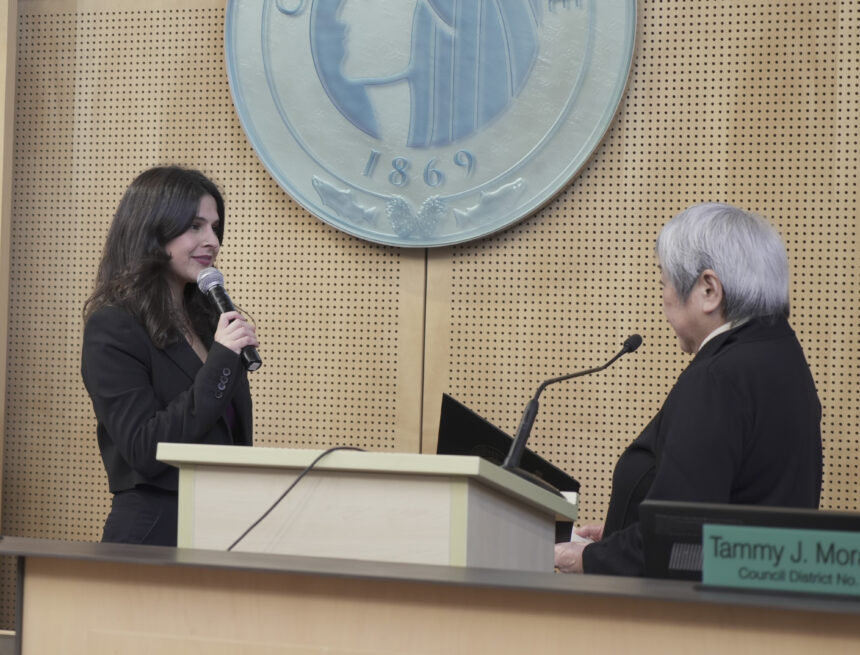

          

 *  [Home](https://council.seattle.gov) 
 *  [News](https://council.seattle.gov/news) 
 *  [Press Releases](https://council.seattle.gov/press-releases) 
 *  [Video](https://council.seattle.gov/video) 
 *  [Councilmembers](https://council.seattle.gov/seattle-city-councilmembers) 
   *  [Rob Saka](https://council.seattle.gov/saka) 
   *  [Mark Solomon](https://council.seattle.gov/solomon) 
   *  [Joy Hollingsworth](https://council.seattle.gov/hollingsworth) 
   *  [Maritza Rivera](https://council.seattle.gov/rivera) 
   *  [Cathy Moore](https://council.seattle.gov/moore) 
   *  [Dan Strauss](https://council.seattle.gov/strauss) 
   *  [Robert Kettle](https://council.seattle.gov/kettle) 
   *  [Alexis Mercedes Rinck](https://council.seattle.gov/rinck) 
   *  [Sara Nelson](https://council.seattle.gov/nelson) 
   *  [Councilmembers (Past)](https://council.seattle.gov/councilmembers-2022) 
 *  [About](https://council.seattle.gov/about) 

# Alexis Mercedes Rinck

  [Home](https://council.seattle.gov)  » Alexis Mercedes Rinck    

# Blog Posts from Councilmember Rinck

 March 28, 2025 March 28, 2025  [Councilmember Rinck](https://council.seattle.gov/category/councilmember-rinck) , [News](https://council.seattle.gov/category/news) , [News Releases](https://council.seattle.gov/category/news-releases) , [Rinck](https://council.seattle.gov/category/news-releases/rinck)  By [City Council News Releases](https://council.seattle.gov/author/city-council-news-releases)   [0](https://council.seattle.gov/rinck)  

##  [Seattle City Council to host second committee meeting on safeguarding city from federal policy changes](https://council.seattle.gov/2025/03/28/seattle-city-council-to-host-second-committee-meeting-on-safeguarding-city-from-federal-policy-changes) 

The second Federal Administration and Policy Changes committee meeting focuses on housing issues Seattle City Councilmember Alexis Mercedes Rinck (Position 8) announced key details and the date of the second meeting of the Select Committee on Federal Administration and Policy Changes. This Select Committee will feature a roundtable on housing issues and take place next Thursday, April 3 at 2...

  [Read More](https://council.seattle.gov/2025/03/28/seattle-city-council-to-host-second-committee-meeting-on-safeguarding-city-from-federal-policy-changes)  March 18, 2025 March 18, 2025  [Councilmember Rinck](https://council.seattle.gov/category/councilmember-rinck) , [Councilmember Strauss](https://council.seattle.gov/category/councilmember-strauss) , [News](https://council.seattle.gov/category/news) , [News Releases](https://council.seattle.gov/category/news-releases) , [Rinck](https://council.seattle.gov/category/news-releases/rinck) , [Strauss](https://council.seattle.gov/category/news-releases/strauss)  By [City Council News Releases](https://council.seattle.gov/author/city-council-news-releases)   [0](https://council.seattle.gov/rinck)  

##  [Councilmembers call to reschedule Stadium District rezone vote after receiving 9 new amendments yesterday](https://council.seattle.gov/2025/03/18/councilmembers-call-to-reschedule-stadium-district-rezone-vote-after-receiving-9-new-amendments-yesterday) 

Seattle City Councilmembers Dan Strauss (District 6) and Alexis Mercedes Rinck (Position 8) are requesting to reschedule the Stadium District rezone legislation scheduled for a final Council vote later today. This comes after nine new amendments were released yesterday afternoon. The Seattle City Council has been considering fiercely debated legislation proposed by Council President Sara Nelson to rezone industrial lands...

  [Read More](https://council.seattle.gov/2025/03/18/councilmembers-call-to-reschedule-stadium-district-rezone-vote-after-receiving-9-new-amendments-yesterday)  February 26, 2025 February 26, 2025  [Councilmember Rinck](https://council.seattle.gov/category/councilmember-rinck) , [News](https://council.seattle.gov/category/news) , [News Releases](https://council.seattle.gov/category/news-releases) , [Rinck](https://council.seattle.gov/category/news-releases/rinck)  By [City Council News Releases](https://council.seattle.gov/author/city-council-news-releases)   [0](https://council.seattle.gov/rinck)  

##  [Seattle City Council to host first committee meeting on safeguarding city from federal policy changes](https://council.seattle.gov/2025/02/26/seattle-city-council-to-host-first-committee-meeting-on-safeguarding-city-from-federal-policy-changes) 

The first Federal Administration and Policy Changes committee meeting focuses on individual civil rights and labor protections Seattle City Councilmember Alexis Mercedes Rinck (Position 8) is officially announcing the first meeting of the Select Committee on Federal Administration and Policy Changes which will hold a roundtable for community partners and government departments working in the topic areas of individual civil...

  [Read More](https://council.seattle.gov/2025/02/26/seattle-city-council-to-host-first-committee-meeting-on-safeguarding-city-from-federal-policy-changes)  January 31, 2025 January 31, 2025  [Councilmember Rinck](https://council.seattle.gov/category/councilmember-rinck) , [News](https://council.seattle.gov/category/news) , [News Releases](https://council.seattle.gov/category/news-releases) , [Rinck](https://council.seattle.gov/category/news-releases/rinck)  By [City Council News Releases](https://council.seattle.gov/author/city-council-news-releases)   [1](https://council.seattle.gov/rinck)  

##  [Councilmember Rinck calls for new committee to safeguard Seattle from federal policy changes](https://council.seattle.gov/2025/01/31/councilmember-rinck-calls-for-new-committee-to-safeguard-seattle-from-federal-policy-changes) 

The proposed committee is aimed at identifying responses to emerging changes in federal policy which could threaten vital City programs and funding Seattle City Councilmember Alexis Mercedes Rinck (Position 8) announced today she has officially called for the creation of a Select Committee on Federal Administration and Policy Changes. She released the following statement: Throughout the past week, we have...

  [Read More](https://council.seattle.gov/2025/01/31/councilmember-rinck-calls-for-new-committee-to-safeguard-seattle-from-federal-policy-changes)  December 05, 2024 December 22, 2024  [Councilmember Morales](https://council.seattle.gov/category/councilmember-morales) , [Councilmember Rinck](https://council.seattle.gov/category/councilmember-rinck) , [News](https://council.seattle.gov/category/news) , [News Releases](https://council.seattle.gov/category/news-releases) , [Rinck](https://council.seattle.gov/category/news-releases/rinck)  By [City Council News Releases](https://council.seattle.gov/author/city-council-news-releases)   [1](https://council.seattle.gov/rinck)  

##  [Councilmember Rinck’s statement on Councilmember Morales’ departure from council](https://council.seattle.gov/2024/12/05/councilmember-rincks-statement-on-councilmember-morales-departure-from-council) 

I am deeply saddened by the news that my friend and colleague Councilmember Tammy Morales will be leaving the council. Councilmember Morales has been a beacon of progressive values, tirelessly championing the rights of workers, families, renters, transit riders, and all who live and work in Seattle. I respect her decision to do what is best for her personally, her...

  [Read More](https://council.seattle.gov/2024/12/05/councilmember-rincks-statement-on-councilmember-morales-departure-from-council)     December 03, 2024 December 5, 2024  [Councilmember Rinck](https://council.seattle.gov/category/councilmember-rinck) , [Nelson](https://council.seattle.gov/category/news-releases/nelson) , [Rinck](https://council.seattle.gov/category/news-releases/rinck)  By [City Council News Releases](https://council.seattle.gov/author/city-council-news-releases)   [0](https://council.seattle.gov/rinck)  

##  [City Council welcomes new councilmember Alexis Mercedes Rinck](https://council.seattle.gov/2024/12/03/city-council-welcomes-new-councilmember-alexis-mercedes-rinck) 

Councilmember Rinck ceremonially sworn in by community member Sharon Maeda

  [Read More](https://council.seattle.gov/2024/12/03/city-council-welcomes-new-councilmember-alexis-mercedes-rinck)  

 __Learn More about Councilmember Rinck:__ 

 [Visit her website](https://seattle.gov/council/rinck) 

 [Sign up for her newsletter](https://seattle.us12.list-manage.com/subscribe?u=11a79978ca7225050bfabf7ad&id=f60af58778) 

# News Releases

 March 28, 2025March 28, 2025 

###  [Seattle City Council to host second committee meeting on safeguarding city from federal policy changes](https://council.seattle.gov/2025/03/28/seattle-city-council-to-host-second-committee-meeting-on-safeguarding-city-from-federal-policy-changes) 

The second Federal Administration and Policy Changes committee meeting focuses on housing issues Seattle City Councilmember Alexis Mercedes Rinck (Position...

  [Read More](https://council.seattle.gov/2025/03/28/seattle-city-council-to-host-second-committee-meeting-on-safeguarding-city-from-federal-policy-changes)  March 18, 2025March 18, 2025 

###  [Councilmembers call to reschedule Stadium District rezone vote after receiving 9 new amendments yesterday](https://council.seattle.gov/2025/03/18/councilmembers-call-to-reschedule-stadium-district-rezone-vote-after-receiving-9-new-amendments-yesterday) 

Seattle City Councilmembers Dan Strauss (District 6) and Alexis Mercedes Rinck (Position 8) are requesting to reschedule the Stadium District...

  [Read More](https://council.seattle.gov/2025/03/18/councilmembers-call-to-reschedule-stadium-district-rezone-vote-after-receiving-9-new-amendments-yesterday)  February 26, 2025February 26, 2025 

###  [Seattle City Council to host first committee meeting on safeguarding city from federal policy changes](https://council.seattle.gov/2025/02/26/seattle-city-council-to-host-first-committee-meeting-on-safeguarding-city-from-federal-policy-changes) 

The first Federal Administration and Policy Changes committee meeting focuses on individual civil rights and labor protections Seattle City Councilmember...

  [Read More](https://council.seattle.gov/2025/02/26/seattle-city-council-to-host-first-committee-meeting-on-safeguarding-city-from-federal-policy-changes)  January 31, 2025January 31, 2025 

###  [Councilmember Rinck calls for new committee to safeguard Seattle from federal policy changes](https://council.seattle.gov/2025/01/31/councilmember-rinck-calls-for-new-committee-to-safeguard-seattle-from-federal-policy-changes) 

The proposed committee is aimed at identifying responses to emerging changes in federal policy which could threaten vital City programs...

  [Read More](https://council.seattle.gov/2025/01/31/councilmember-rinck-calls-for-new-committee-to-safeguard-seattle-from-federal-policy-changes)   `` 

  

### HELPFUL LINKS

 *  [Meet the Council](https://seattle.gov/council/meet-the-council) 
 *  [Mayor’s Office](https://seattle.gov/mayor) 
 *  [Council Calendar](https://seattle.gov/council/calendar) 
 *  [Council Agendas](https://seattle.legistar.com/Calendar.aspx) 
 *  [Council Committees](https://seattle.gov/council/committees) 
 *  [Watch Council Live](https://seattle.gov/council/watch-council-live) 

### Make your voice heard

 [Find Your Council District](https://www.seattle.gov/cityclerk/agendas-and-legislative-resources/find-your-council-district) 

 [Contact the Council](https://www.seattle.gov/cityclerk/agendas-and-legislative-resources/city-council-agendas/contact-the-city-council) 

 [Sign up for Public Comment](https://www.seattle.gov/council/committees/public-comment#:~:text=Register%20to%20speak%20on%20the,be%20recognized%20by%20the%20Chair.) 

 [Register to Vote](https://kingcounty.gov/depts/elections/how-to-vote/register-to-vote.aspx) 

### Councilmembers

 *  [Rob Saka](https://seattle.gov/council/meet-the-council/rob-saka) 
 *  [Joy Hollingsworth](https://seattle.gov/council/meet-the-council/joy-hollingsworth) 
 *  [Maritza Rivera](https://seattle.gov/council/meet-the-council/maritza-rivera) 
 *  [Cathy Moore](https://seattle.gov/council/meet-the-council/cathy-moore) 
 *  [Dan Strauss](https://seattle.gov/council/strauss) 
 *  [Robert Kettle](https://seattle.gov/council/meet-the-council/robert-kettle) 
 *  [Alexis Mercedes Rinck](https://seattle.gov/council/rinck) 
 *  [Sara Nelson](https://seattle.gov/council/meet-the-council/sara-nelson) 
    The official blog of the Seattle City Council 7ads6x98y 