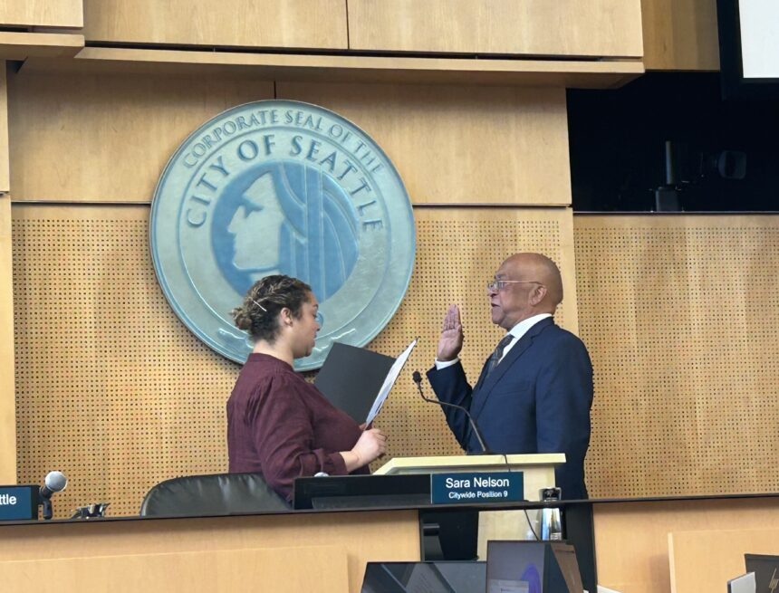

          

 *  [Home](https://council.seattle.gov) 
 *  [News](https://council.seattle.gov/news) 
 *  [Press Releases](https://council.seattle.gov/press-releases) 
 *  [Video](https://council.seattle.gov/video) 
 *  [Councilmembers](https://council.seattle.gov/seattle-city-councilmembers) 
   *  [Rob Saka](https://council.seattle.gov/saka) 
   *  [Mark Solomon](https://council.seattle.gov/solomon) 
   *  [Joy Hollingsworth](https://council.seattle.gov/hollingsworth) 
   *  [Maritza Rivera](https://council.seattle.gov/rivera) 
   *  [Cathy Moore](https://council.seattle.gov/moore) 
   *  [Dan Strauss](https://council.seattle.gov/strauss) 
   *  [Robert Kettle](https://council.seattle.gov/kettle) 
   *  [Alexis Mercedes Rinck](https://council.seattle.gov/rinck) 
   *  [Sara Nelson](https://council.seattle.gov/nelson) 
   *  [Councilmembers (Past)](https://council.seattle.gov/councilmembers-2022) 
 *  [About](https://council.seattle.gov/about) 

# Mark Solomon

  [Home](https://council.seattle.gov)  » Mark Solomon    

# Blog Posts from Councilmember Solomon

    January 27, 2025 January 27, 2025  [Councilmember Solomon](https://council.seattle.gov/category/councilmember-solomon) , [News](https://council.seattle.gov/category/news) , [News Releases](https://council.seattle.gov/category/news-releases) , [Top Story](https://council.seattle.gov/category/top-story)  By [City Council News Releases](https://council.seattle.gov/author/city-council-news-releases)   [0](https://council.seattle.gov/solomon#)  

##  [Seattle City Council appoints Mark Solomon to fill District 2 vacancy](https://council.seattle.gov/2025/01/27/seattle-city-council-appoints-mark-solomon-to-fill-district-2-vacancy) 

The Seattle City Council voted today to appoint Mark A. Solomon to fill the vacant position on the Council, representing District 2, which encompasses south Seattle. After five rounds of voting, Solomon received the necessary five vote majority for the appointment. “I want to express my deep gratitude to this Council for their trust,” new Councilmember Mark Solomon (District 2)....

  [Read More](https://council.seattle.gov/2025/01/27/seattle-city-council-appoints-mark-solomon-to-fill-district-2-vacancy)  

 __Learn More about Councilmember Solomon:__ 

 [Visit his website](https://seattle.gov/council/solomon) 

 [Sign up for his newsletter](https://seattle.us12.list-manage.com/subscribe?u=11a79978ca7225050bfabf7ad&id=e205296124) 

# News Releases

 January 27, 2025January 27, 2025 

###  [Seattle City Council appoints Mark Solomon to fill District 2 vacancy](https://council.seattle.gov/2025/01/27/seattle-city-council-appoints-mark-solomon-to-fill-district-2-vacancy) 

The Seattle City Council voted today to appoint Mark A. Solomon to fill the vacant position on the Council, representing...

  [Read More](https://council.seattle.gov/2025/01/27/seattle-city-council-appoints-mark-solomon-to-fill-district-2-vacancy)   `` 

  

### HELPFUL LINKS

 *  [Meet the Council](https://seattle.gov/council/meet-the-council) 
 *  [Mayor’s Office](https://seattle.gov/mayor) 
 *  [Council Calendar](https://seattle.gov/council/calendar) 
 *  [Council Agendas](https://seattle.legistar.com/Calendar.aspx) 
 *  [Council Committees](https://seattle.gov/council/committees) 
 *  [Watch Council Live](https://seattle.gov/council/watch-council-live) 

### Make your voice heard

 [Find Your Council District](https://www.seattle.gov/cityclerk/agendas-and-legislative-resources/find-your-council-district) 

 [Contact the Council](https://www.seattle.gov/cityclerk/agendas-and-legislative-resources/city-council-agendas/contact-the-city-council) 

 [Sign up for Public Comment](https://www.seattle.gov/council/committees/public-comment#:~:text=Register%2520to%2520speak%2520on%2520the,be%2520recognized%2520by%2520the%2520Chair.) 

 [Register to Vote](https://kingcounty.gov/depts/elections/how-to-vote/register-to-vote.aspx) 

### Councilmembers

 *  [Rob Saka](https://seattle.gov/council/meet-the-council/rob-saka) 
 *  [Joy Hollingsworth](https://seattle.gov/council/meet-the-council/joy-hollingsworth) 
 *  [Maritza Rivera](https://seattle.gov/council/meet-the-council/maritza-rivera) 
 *  [Cathy Moore](https://seattle.gov/council/meet-the-council/cathy-moore) 
 *  [Dan Strauss](https://seattle.gov/council/strauss) 
 *  [Robert Kettle](https://seattle.gov/council/meet-the-council/robert-kettle) 
 *  [Alexis Mercedes Rinck](https://seattle.gov/council/rinck) 
 *  [Sara Nelson](https://seattle.gov/council/meet-the-council/sara-nelson) 
    The official blog of the Seattle City Council 7ads6x98y 